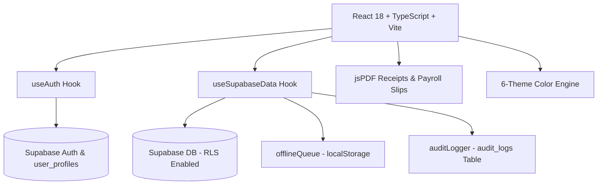

# Complexe Scolaire MAMA THERA — Full Development & Architecture History

This document serves as a complete history, architectural record, and technical changelog for the **Complexe Scolaire MAMA THERA Finance Suite** (Bamako, Mali). It documents every phase, feature addition, security enhancement, and design decision made during development.

---

## 📍 School Context & Project Scope

- **Institution**: Complexe Scolaire MAMA THERA
- **Location**: Bamako, Mali (Managed remotely from the US by Ibrahim Thera)
- **Levels Served**: Enseignement Fondamental (Primary & Middle) and Lycée (High School)
- **Currency**: FCFA (XOF)
- **Primary Language**: Bilingual UI (French `fr` default, English `en`)
- **Key Domain Terminology**: **Élève / Élèves** (Primary/Secondary pupils, changed from university-level *Étudiants*)

---

## 🚀 Chronological Development History

### Phase 1: Production Readiness & Network Resilience
- **Objective**: Establish staging/production configuration templates and network retry mechanisms for unreliable internet connectivity in Bamako.
- **Deliverables**:
  - Environment templates (`.env.example`, `.env.staging`, `.env.production`).
  - Build & seed scripts (`dev:staging`, `build:production`, `seed:production`).
  - Exponential backoff network retry utility (`src/lib/networkUtils.ts`).

---

### Phase 2: Supabase Auth & RLS Database Security Lockdown
- **Objective**: Replace anonymous/hardcoded access with secure Supabase Email/Password Authentication and Row Level Security (RLS).
- **Deliverables**:
  - Migration `20260809000000_auth_and_rls.sql`: Created `public.user_profiles` table, auto-profile trigger on signup, and 33 strict RLS policies locking down tables to authenticated users.
  - `src/lib/useAuth.ts`: Custom React hook managing session state, authentication persistence, and user profiles.
  - Login UI (`App.tsx`): Bilingual login screen backed by Supabase `signInWithPassword`.

---

### Phase 3: Offline Support & Printable PDF Payment Receipts
- **Objective**: Ensure cashiers in Bamako can record transactions even during internet outages, and generate official A5 payment receipts for parents.
- **Deliverables**:
  - `src/lib/offlineQueue.ts`: `localStorage` queue manager (`mama_thera_offline_queue`).
  - `src/lib/pdfReceipt.ts`: A5 official payment receipt generator using `jspdf` featuring school letterhead, receipt serial number, student/parent details, and payment breakdown.
  - `src/components/ToastNotification.tsx`: `<OfflineBanner>` displaying pending offline items and a manual "Sync Now" button.
  - Auto-sync (`syncOfflineQueue`) triggering upon network reconnection.

---

### Phase 4: Financial Reports & Printable Staff Payslips
- **Objective**: Generate official PDF exports for monthly executive P&L statements and staff salary slips (*Bulletin de Paie*).
- **Deliverables**:
  - `src/lib/pdfPayroll.ts`: Printable A5 **Bulletin de Paie** PDF generator with earnings, deductions, net salary, and cashier signatures.
  - `src/lib/pdfFinancialReport.ts`: Executive A4 **Financial Summary Report (P&L)** with revenue, operating costs, vendor expenses, net balance, and enrollment statistics.
  - UI Triggers (`App.tsx`): Dedicated PDF export buttons in Dashboard and Staff Payroll tables.

---

### Phase 5: Tamper-Evident Audit Trail & Security Logs
- **Objective**: Admin-only audit log tracking every payment, expense, salary, and user role change with timestamps and staff identity.
- **Deliverables**:
  - Migration `20260814000000_audit_logs.sql`: Created `audit_logs` table with RLS restricting read access exclusively to `admin` role.
  - `src/lib/auditLogger.ts`: Utility function (`logAuditEvent`) inserting structured log records into Supabase.
  - Admin View (`App.tsx`): Dedicated **Journal d'Audit / Audit Trail** tab view with time-series table and color-coded action badges (`RECORD_PAYMENT`, `ADD_EXPENSE`, `UPDATE_USER_ROLE`).

---

### Phase 6: In-App User & Role Controller
- **Objective**: Allow Admins to manage staff user accounts, toggle roles (`admin` ⇄ `staff`), and send password reset emails directly within the app without using the Supabase dashboard.
- **Deliverables**:
  - `src/lib/useAuth.ts`: Added `updateUserRole(userId, newRole)` and `sendPasswordReset(email)`.
  - Admin UI (`App.tsx`): Upgraded **Settings → User Accounts** into an interactive controller with avatar badges, role toggles, and 1-click password reset triggers.

---

### Phase 7: UI Polish, Theme Engine & Localization Refinements
- **Objective**: Elevate design aesthetics, adapt local terminology, and refine user experience.
- **Deliverables**:
  - **Terminology Update**: Changed all French UI occurrences of *"Étudiant"* to *"Élève"* (suitable for fundamental and high school pupils).
  - **Custom 6-Theme Palette**:
    1. **Émeraude MAMA THERA** *(Official School Emerald #064E3B)*
    2. **Navy Exécutif** *(Corporate Navy)*
    3. **Bordeaux Académique** *(Burgundy Academic)*
    4. **Livre Crème** *(Warm Cream Ledger)*
    5. **Ardoise Sombre** *(Dark Slate)*
    6. **Cyber Minuit** *(Cyber Midnight Dark)*
  - **Timezone Integration**: Formatted timestamps explicitly with `Africa/Bamako` GMT+0 timezone tags for official records.
  - **WhatsApp & SMS Relance**: WhatsApp & SMS follow-up notice modal for parents with overdue balances.

---

## 🛠️ Complete System Architecture



---

## 📂 Key Source Code Map

| Feature / Area | Primary File(s) | Description |
|----------------|-----------------|-------------|
| **Core UI & Admin Hub** | `src/App.tsx` | Main application shell, dashboard, tabs, modals, theme engine |
| **Authentication & Users** | `src/lib/useAuth.ts` | Supabase auth state, session persistence, role updates, password resets |
| **Data & Synchronization** | `src/lib/useSupabaseData.ts` | Optimistic state management, offline queue auto-sync, database mutations |
| **Offline Storage** | `src/lib/offlineQueue.ts` | Queue storage manager for offline payments & expenses |
| **Audit Logging** | `src/lib/auditLogger.ts` | Inserts structured audit trail entries into Supabase |
| **Payment PDF Receipt** | `src/lib/pdfReceipt.ts` | Printable A5 payment receipt PDF generator |
| **Staff Payslip PDF** | `src/lib/pdfPayroll.ts` | Printable A5 Bulletin de Paie PDF generator |
| **Financial Report PDF** | `src/lib/pdfFinancialReport.ts` | Executive P&L Financial Report PDF generator |
| **Notifications & Toasts** | `src/components/ToastNotification.tsx` | Toast notification provider & offline status banner |
| **Views Props Contract** | `src/app/mainViewsProps.ts` | Single source of truth for the 186-prop `MainViewsProps` contract + helper types — imported by `App.tsx` and `MainViews.tsx`, consumed by the views through the typed context; guarded by `scripts/check-component-props.mjs` (parses this module) and `tests/mainviews-props.test.ts` (single definition, all props required, no `any`, wiring pointed here, types-only) |
| **Database Migrations** | `supabase/migrations/` | SQL schema files for profiles, audit logs, and RLS policies |

---

## 🔍 Verification & Quality Assurance

- **Typecheck (`npm run lint`)**: `tsc --noEmit` returns **0 errors** (strict + noImplicitAny).
- **Lint (`eslint .`)**: **0 errors and 0 warnings** (2026-08-31). The two `react-hooks/exhaustive-deps` warnings in `App.tsx` are fixed properly — the welcome effect destructures the stable pieces of `auth` (`profile`/`isAdmin`/`fetchAllProfiles` — the hook object itself is recreated every render) and lists them with `hasShownWelcome`/`t.welcomeBackName`; the floating-chat greeting effect keys on the queue length and the translated text itself (a language switch re-seeds only when the chat is empty, as before). The `react-refresh` warnings are gone by structure: the `useToast` hook + toast types moved to [`src/lib/useToast.ts`](src/lib/useToast.ts), the `MainViewsContext` + `useMainViews` hook moved to [`src/app/mainViewsContext.ts`](src/app/mainViewsContext.ts) (component files now only export components — this also breaks the latent import cycle views↔MainViews), and `src/main.tsx` is exempted from the rule (an entry point intentionally exports nothing). The toast timer cleanup now captures the timer map inside the effect instead of dereferencing `timerRefs.current` at cleanup time. `t` is declared right after `lang` so effects can list translated strings in their dependency arrays. Zero warnings are now **enforced**, not just achieved: the lint chain (local, pre-commit and CI) runs `eslint . --max-warnings 0`, so any single warning — even a benign one — fails the chain. Proven by a negative test: a temporary file exporting a hook + a component fails with exit 1 (`ESLint found too many warnings (maximum: 0)`).
- **Tests (`npm test`)**: 61/61 passing (formatters, excel importer, offline queue replay, **offline sync drain — the full `syncOfflineQueue` behaviour via [`src/lib/offlineSync.ts`](src/lib/offlineSync.ts)**: queue round-trip through the real store, FIFO drain, failing items kept for retry, stop-on-throw, hook contract; `offlineQueue.ts` gained an in-memory storage fallback so the queue is testable without a DOM), view rendering inside MainViewsContext, MainViewsProps contract).
- **Pre-commit hooks**: husky runs `npm run lint && npm test && node scripts/check-audit.mjs` before every commit — the same audit gate as CI guards locally. Two hook-only conveniences (via `AUDIT_CACHE=1 AUDIT_SOFT_OFFLINE=1`): the result is **cached** in `node_modules/.cache/audit-gate.json`, keyed on the package-lock hash (24h TTL, `AUDIT_CACHE_REFRESH=1` forces a live re-audit), so commits that don't touch dependencies re-audit instantly; and an **unreachable registry** (offline development) only warns instead of blocking — the CI push gate stays the enforcement point. `git commit --no-verify` skips everything in an emergency.
- **Production Build (`npm run build`)**: Vite production bundle builds successfully in `dist/`.
- **Local Dev Server**: Runs on `http://localhost:3000/`.

---

## 🔒 Dependency Security Status (npm audit)

*Last review: 2026-08-31. `npm audit` reports **0 vulnerabilities**. The previous 29 (2 low, 7 moderate, 19 high, 1 critical) were all **dev-only pins inside the Vercel CLI** dependency tree (`tar`, `undici`, `js-yaml`, `minimatch`, `smol-toml`, `path-to-regexp`, `ajv`, `@tootallnate/once`, `esbuild`). Rather than `overrides`, the deployment CLI was **removed from the root project** — it now lives in the isolated [`tools/`](tools/package.json) manifest (own lockfile) and deploys run through GitHub Actions — which eliminated the whole tree (≈264 packages) from the root lock at the source.*

- **How it was fixed**: `vercel` was a devDependency used only to deploy. It (and all its `@vercel/*` transitive pins) is gone from the root `package.json` + lockfile; it is now pinned in [`tools/package.json`](tools/package.json) (own lockfile, ≈289 packages), consumed only by the deploy workflow. [`.github/workflows/deploy.yml`](.github/workflows/deploy.yml) runs `npm ci --prefix tools` and deploys on every push to `main` **with that reviewed pin** — a broken CLI release reaches production only after its Dependabot PR merges. `npm run deploy:prod` is now a notice pointing to CI (`scripts/deploy-notice.mjs`). `esbuild` is declared explicitly in devDependencies because `tsx` (the test runner)'s esbuild copy had to be restored after removing the vercel override — it is clean (`0.28.2`).
- **Dependabot** ([`.github/dependabot.yml`](.github/dependabot.yml)): daily `npm` checks on the root manifest and on `/tools` (a new `vercel` release opens a reviewed PR that becomes the deployed CLI version), weekly `github-actions`. Commit messages follow the repo's conventional style (`chore(deps)`, `chore(deps-dev)`, `chore(deploy)`, `chore(ci)`). Dependabot **cannot** watch the `xlsx` CDN tarball — that one is manual. The `/tools` pins are deploy-CLI-only: they live in CI, are never bundled into the app, and are deliberately **not** part of the root audit gate (the CLI's known `@vercel/*` pins remain dev-only upstream — vercel/vercel#11543 — which is why the CLI stays out of the root lock).
- **What the workflow needs** (repository secrets — `Settings ▸ Secrets and variables ▸ Actions`): `VERCEL_TOKEN` (access token), `VERCEL_ORG_ID` (`team_…`), `VERCEL_PROJECT_ID` (`prj_…`). For this project: org `team_CfIwAlGjbuOf3EItm2mDUK4n`, project `prj_Jwn5tMXCwQ6a2V3t5nFQjt8OSMPi`. Production env (`VITE_SUPABASE_URL`/`VITE_SUPABASE_ANON_KEY`) stays in the Vercel dashboard and is pulled by `vercel pull`.
- **`vercel.json`**: now pins `framework`/`buildCommand`/`outputDirectory` (Vite → `dist`) so the isolated CLI build is deterministic and doesn't depend on dashboard settings (the SPA rewrite is unchanged).
- **To deploy locally** nothing is needed — push to `main`:
  ```bash
  git push origin main
  ```
  and watch the "Deploy (Vercel)" workflow. `npm run lint`, `npm test`, `npm run build` and the audit gate all run in CI before `vercel deploy --prebuilt --prod`.
- **To use the CLI locally** (e.g. `vercel dev`): `cd tools && npm ci && npx vercel …` — the root project stays clean. Re-adding `vercel` to the root devDependencies would re-introduce its dev-only pins, so only do that deliberately.
- **Risk assessment**: all removed packages were deployment-CLI-only and never bundled into the production app (verified in `dist/`). The only runtime dependency with advisories, `xlsx`, is already the SheetJS CDN build `0.20.3`.
- **Install scripts**: npm 11's `allowScripts` policy is configured in `package.json` with `esbuild`/`core-js` approved by package name.
- **CI gates**: a single quality workflow, [`.github/workflows/perf-guard.yml`](.github/workflows/perf-guard.yml) (it absorbed the former `security-audit.yml`), runs on every push to `main` with three parallel jobs — `quality` (explicit **ESLint zero-warning gate** — `eslint . --max-warnings 0` — then no-explicit-any + banned ts-comments + tsc strict + props wiring + [`scripts/check-forbidden-any.mjs`](scripts/check-forbidden-any.mjs) blocking every `as any`/`@ts-ignore`/`@ts-expect-error`/`@ts-nocheck` in `src/`, then the tests, then `scripts/check-audit.mjs` in strict mode — fails on any production vuln and on any total **above 0**) and `lighthouse` (Lighthouse), and `tools-audit` (**warning-only**, see below) — alongside `deploy.yml` and the weekly `vercel-pins-watch` (see below). The same `check-audit.mjs` also guards the pre-commit hook locally (cached + offline-tolerant, see above), so a vulnerability introduced by an install is caught at commit time, before it can be pushed.
- **Verified on GitHub (2026-08-31)**: the quality/audit gate was checked against the real runners via the public API (not just locally). On `f0db212`, run [33407449986](https://github.com/ibrahimkalilthera/-MAMA/actions/runs/33407449986) completed **success**: job `Lint + tests + audit` passed every step — checkout → setup-node → `npm ci` → lint → tests → **Audit gate (production clean + total within baseline 0)** — in ~35 s; job `lighthouse` passed in ~61 s. All 8 most recent pushes are green (`quality` workflow: 33 runs total). `npm ci` sync between `package.json` and `package-lock.json` is proven by the runner's install step itself.
- **Deploys are gated on quality (no broken push can reach production)**: [`deploy.yml`](.github/workflows/deploy.yml) no longer triggers on `push` — it triggers via **`workflow_run`** when `perf-guard.yml` **completes successfully on `main`**, and deploys **exactly the commit that quality validated** (`head_sha` checkout). Its first step is a gate: if the quality workflow did not succeed, the deploy job exits neutral (78 — shown grey, not red) and nothing reaches Vercel. The redundant lint/tests steps were removed from the deploy job (quality already covers them); it only needs `npm ci` for `vercel build`. Manual deploys stay possible via `workflow_dispatch` (deploys current main — explicit human action). Trade-off, by design: if the quality workflow itself cannot run (Actions outage), deploys stop too.
- **Tools audit job (warning-only, 2026-08-31)**: [`scripts/report-tools-audit.mjs`](scripts/report-tools-audit.mjs) audits the `tools/` lockfile on every push (no install needed) and reports the isolated CLI's dev-only pins via a `::warning` annotation + step summary. It can **never** fail the run (always exits 0, plus `continue-on-error` on the job) because `deploy.yml` is triggered by this workflow's success — a red tools audit there would silently stop deploys. The strict root gate stays at 0; the deeper weekly follow-up stays with `vercel-pins-watch`.
- **Vercel pins watch (weekly, 2026-08-31)**: [`.github/workflows/vercel-pins-watch.yml`](.github/workflows/vercel-pins-watch.yml) (Mondays 06:00 UTC, plus manual dispatch and a paths-filtered push run) audits the current `tools/` tree from its lockfile (no install needed) and probes the latest vercel release the same way (`npm install --package-lock-only` — metadata only, nothing executed; latest read via `npm view`, which honours proxy settings unlike bare `fetch`). Dependabot opens the bump PR when a new CLI ships but cannot tell whether the *new tree is clean*; this watch can — when the latest tree audits **0**, it opens a single tracking issue (label `vercel-pins`) refreshed weekly with live counts and the linked Dependabot PR(s), and auto-closes it once `tools/` audits **0** after the bump merges. A still-vulnerable upstream never turns the run red — it is a tracker, not a gate ([`scripts/check-vercel-pins.mjs`](scripts/check-vercel-pins.mjs); local dry-run without `GITHUB_TOKEN`, and `PROBE_VERSION=x.y.z` exercises the probe path directly).
- **Vercel git integration neutralized (single source of prod = Actions, 2026-08-31)**: the GitHub `deployments` endpoint showed the **native Vercel git integration was also auto-deploying on every push to main** — creating `vercel[bot]` deployments on **two** projects (`Production – mama-thera-finance` **and** `Production – mama-thera-staging`, the latter never touched by any workflow), duplicating the Actions `deploy.yml` on production. [`vercel.json`](vercel.json) now sets `git.deploymentEnabled: false`, which disables **all git-triggered automatic deployments** on every project that reads this config (finance and staging alike) without affecting the explicit CLI/API deployment that `deploy.yml` performs (`vercel deploy --prebuilt --prod`). Verified after push: the neutralized commit shows **no new `Vercel – mama-thera-staging` status/deployment**. The GitHub-app connection itself stays installed (harmless once `deploymentEnabled` is false); it can be disconnected dashboard-side (Vercel → Settings → Git) for a fully clean state.
- **Deploy verified end-to-end (2026-08-31)**: the secrets were added and the full chain was confirmed on the real runners — quality succeeded on `6c198be` (run #33409792988), then deploy ran via `workflow_run` and succeeded in ~36 s (run #33409897850: Gate → checkout `head_sha` → deps → tools → `vercel pull` → `vercel build` → `vercel deploy --prebuilt --prod`), so production now ships exactly what quality validated. Triggers, for reference: `perf-guard` fires on `push` to `main` (concurrency group `quality-*`, cancel-in-progress); `deploy` fires on quality-completion (and manual `workflow_dispatch`, concurrency `deploy-*`, no cancel).
