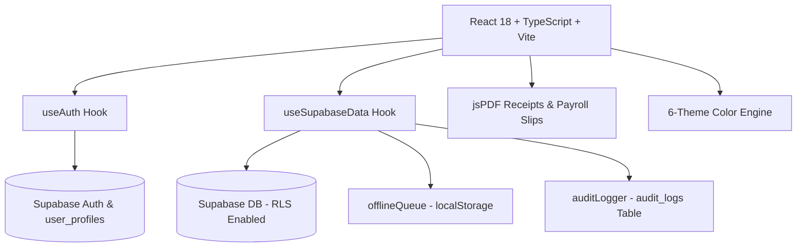

# Complexe Scolaire MAMA THERA — Full Development & Architecture History

This document serves as a complete history, architectural record, and technical changelog for the **Complexe Scolaire MAMA THERA Finance Suite** (Bamako, Mali). It documents every phase, feature addition, security enhancement, and design decision made during development.

---

## 📍 School Context & Project Scope

- **Institution**: Complexe Scolaire MAMA THERA
- **Location**: Bamako, Mali (Managed remotely from the US by Ibrahim Thera)
- **Levels Served**: Enseignement Fondamental (Primary & Middle) and Lycée (High School)
- **Currency**: FCFA (XOF)
- **Primary Language**: Bilingual UI (French `fr` default, English `en`)
- **Key Domain Terminology**: **Élève / Élèves** (Primary/Secondary pupils, changed from university-level *Étudiants*)

---

## 🚀 Chronological Development History

### Phase 1: Production Readiness & Network Resilience
- **Objective**: Establish staging/production configuration templates and network retry mechanisms for unreliable internet connectivity in Bamako.
- **Deliverables**:
  - Environment templates (`.env.example`, `.env.staging`, `.env.production`).
  - Build & seed scripts (`dev:staging`, `build:production`, `seed:production`).
  - Exponential backoff network retry utility (`src/lib/networkUtils.ts`).

---

### Phase 2: Supabase Auth & RLS Database Security Lockdown
- **Objective**: Replace anonymous/hardcoded access with secure Supabase Email/Password Authentication and Row Level Security (RLS).
- **Deliverables**:
  - Migration `20260809000000_auth_and_rls.sql`: Created `public.user_profiles` table, auto-profile trigger on signup, and 33 strict RLS policies locking down tables to authenticated users.
  - `src/lib/useAuth.ts`: Custom React hook managing session state, authentication persistence, and user profiles.
  - Login UI (`App.tsx`): Bilingual login screen backed by Supabase `signInWithPassword`.

---

### Phase 3: Offline Support & Printable PDF Payment Receipts
- **Objective**: Ensure cashiers in Bamako can record transactions even during internet outages, and generate official A5 payment receipts for parents.
- **Deliverables**:
  - `src/lib/offlineQueue.ts`: `localStorage` queue manager (`mama_thera_offline_queue`).
  - `src/lib/pdfReceipt.ts`: A5 official payment receipt generator using `jspdf` featuring school letterhead, receipt serial number, student/parent details, and payment breakdown.
  - `src/components/ToastNotification.tsx`: `<OfflineBanner>` displaying pending offline items and a manual "Sync Now" button.
  - Auto-sync (`syncOfflineQueue`) triggering upon network reconnection.

---

### Phase 4: Financial Reports & Printable Staff Payslips
- **Objective**: Generate official PDF exports for monthly executive P&L statements and staff salary slips (*Bulletin de Paie*).
- **Deliverables**:
  - `src/lib/pdfPayroll.ts`: Printable A5 **Bulletin de Paie** PDF generator with earnings, deductions, net salary, and cashier signatures.
  - `src/lib/pdfFinancialReport.ts`: Executive A4 **Financial Summary Report (P&L)** with revenue, operating costs, vendor expenses, net balance, and enrollment statistics.
  - UI Triggers (`App.tsx`): Dedicated PDF export buttons in Dashboard and Staff Payroll tables.

---

### Phase 5: Tamper-Evident Audit Trail & Security Logs
- **Objective**: Admin-only audit log tracking every payment, expense, salary, and user role change with timestamps and staff identity.
- **Deliverables**:
  - Migration `20260814000000_audit_logs.sql`: Created `audit_logs` table with RLS restricting read access exclusively to `admin` role.
  - `src/lib/auditLogger.ts`: Utility function (`logAuditEvent`) inserting structured log records into Supabase.
  - Admin View (`App.tsx`): Dedicated **Journal d'Audit / Audit Trail** tab view with time-series table and color-coded action badges (`RECORD_PAYMENT`, `ADD_EXPENSE`, `UPDATE_USER_ROLE`).

---

### Phase 6: In-App User & Role Controller
- **Objective**: Allow Admins to manage staff user accounts, toggle roles (`admin` ⇄ `staff`), and send password reset emails directly within the app without using the Supabase dashboard.
- **Deliverables**:
  - `src/lib/useAuth.ts`: Added `updateUserRole(userId, newRole)` and `sendPasswordReset(email)`.
  - Admin UI (`App.tsx`): Upgraded **Settings → User Accounts** into an interactive controller with avatar badges, role toggles, and 1-click password reset triggers.

---

### Phase 7: UI Polish, Theme Engine & Localization Refinements
- **Objective**: Elevate design aesthetics, adapt local terminology, and refine user experience.
- **Deliverables**:
  - **Terminology Update**: Changed all French UI occurrences of *"Étudiant"* to *"Élève"* (suitable for fundamental and high school pupils).
  - **Custom 6-Theme Palette**:
    1. **Émeraude MAMA THERA** *(Official School Emerald #064E3B)*
    2. **Navy Exécutif** *(Corporate Navy)*
    3. **Bordeaux Académique** *(Burgundy Academic)*
    4. **Livre Crème** *(Warm Cream Ledger)*
    5. **Ardoise Sombre** *(Dark Slate)*
    6. **Cyber Minuit** *(Cyber Midnight Dark)*
  - **Timezone Integration**: Formatted timestamps explicitly with `Africa/Bamako` GMT+0 timezone tags for official records.
  - **WhatsApp & SMS Relance**: WhatsApp & SMS follow-up notice modal for parents with overdue balances.

---

## 🛠️ Complete System Architecture



---

## 📂 Key Source Code Map

| Feature / Area | Primary File(s) | Description |
|----------------|-----------------|-------------|
| **Core UI & Admin Hub** | `src/App.tsx` | Main application shell, dashboard, tabs, modals, theme engine |
| **Authentication & Users** | `src/lib/useAuth.ts` | Supabase auth state, session persistence, role updates, password resets |
| **Data & Synchronization** | `src/lib/useSupabaseData.ts` | Optimistic state management, offline queue auto-sync, database mutations |
| **Offline Storage** | `src/lib/offlineQueue.ts` | Queue storage manager for offline payments & expenses |
| **Audit Logging** | `src/lib/auditLogger.ts` | Inserts structured audit trail entries into Supabase |
| **Payment PDF Receipt** | `src/lib/pdfReceipt.ts` | Printable A5 payment receipt PDF generator |
| **Staff Payslip PDF** | `src/lib/pdfPayroll.ts` | Printable A5 Bulletin de Paie PDF generator |
| **Financial Report PDF** | `src/lib/pdfFinancialReport.ts` | Executive P&L Financial Report PDF generator |
| **Notifications & Toasts** | `src/components/ToastNotification.tsx` | Toast notification provider & offline status banner |
| **Database Migrations** | `supabase/migrations/` | SQL schema files for profiles, audit logs, and RLS policies |

---

## 🔍 Verification & Quality Assurance

- **Typecheck (`npm run lint`)**: `tsc --noEmit` returns **0 errors** (strict + noImplicitAny).
- **Tests (`npm test`)**: 27/27 passing (formatters, excel importer, view rendering inside MainViewsContext).
- **Pre-commit hooks**: husky runs `npm run lint && npm test` before every commit.
- **Production Build (`npm run build`)**: Vite production bundle builds successfully in `dist/`.
- **Local Dev Server**: Runs on `http://localhost:3000/`.

---

## 🔒 Dependency Security Status (npm audit)

*Last review: 2026-08-31. `npm audit` reports 29 vulnerabilities (2 low, 7 moderate, 19 high, 1 critical) — **all dev-only, none reach the production bundle**.*

All 29 trace to exact vulnerable pins inside the **Vercel CLI** dependency tree (`vercel` is a devDependency used only for deployment):

| Package (pinned version) | Vulnerable via | Fixed version exists in registry |
|---|---|---|
| `tar` 7.5.7 | `@vercel/fun` | ✅ 7.5.22 |
| `undici` 5.28.4 | `@vercel/node` | ✅ 6.28+ |
| `js-yaml` 4.1.1 | `@vercel/python-analysis` | ✅ 4.3.1+ |
| `minimatch` 10.1.1 | `@vercel/python-analysis` | ✅ 10.2.3+ |
| `smol-toml` 1.5.2 | `@vercel/python-analysis` | ✅ 1.6.1+ |
| `path-to-regexp` 6.1.0 / 8.2.0 | `@vercel/*` | ✅ 6.3.0 / 8.4.0 |
| `esbuild` 0.27.7 | `@vercel/backends` → `tsx@4.21.0` | ✅ 0.28.2 |

- **Tracking issue**: [vercel/vercel#11543](https://github.com/vercel/vercel/issues/11543) — *"Latest version of cli is pulling in insecure packages that have available patches"* — open since 2024-05-04, still open.
- **No fix released yet**: `vercel@59.10.0` is the latest version and its `@vercel/*` packages still pin the vulnerable versions exactly (e.g. `@vercel/fun@1.3.1 → tar 7.5.7`, `@vercel/node@10.0.0 → undici 5.28.4`). `npm audit fix` has nothing to apply; the only "fix" npm can compute is a breaking downgrade to `vercel@54.17.3`, intentionally rejected.
- **Update procedure when Vercel ships a fix** (one command):
  ```bash
  npm install -D vercel@latest && npm audit fix
  ```
  Then verify: `npm audit` (expect 0), `npm run lint && npm test`.
- **Risk assessment**: these packages are only executed by the deployment CLI at deploy time — they are never bundled into the production app (verified in `dist/`). The only runtime dependency with advisories, `xlsx`, was fixed by switching to the SheetJS CDN build `0.20.3`; it no longer appears in `npm audit`.
- **Install scripts**: npm 11's `allowScripts` policy is configured in `package.json` (esbuild binary install + core-js funding notice approved, pinned by version).
