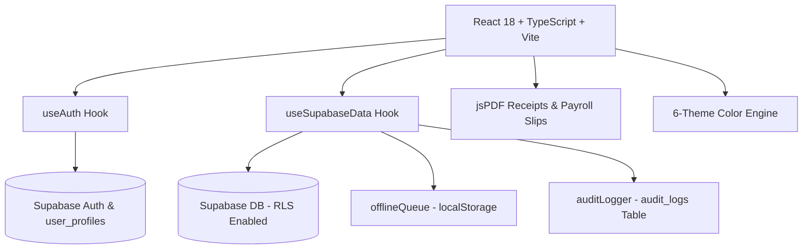

## [2026-09-11] Le pin Node n'est plus écrit dans `PATH` : il vit dans `node_modules/.bin`

Le lanceur épinglait le runtime en écrivant `node`, `npm` et `npx` dans un dossier privé (`node_modules/.cache/pinned-node-bin`) qu'il **préfixait à `PATH`** pour chaque enfant. Ça marchait, et ça avait deux coûts mesurés : chaque processus enfant recevait un environnement réécrit, et notre propre wrapper **empoisonnait `where npm`** — le repli de `scripts/lib/npm-cli.mjs` le trouvait en premier et en déduisait un chemin qui ne contient aucun npm (bug réel, déjà payé une fois). Le dossier privé n'existe plus.

- **npm fournit déjà le crochet** : pour chaque script qu'il lance, npm met `<projet>/node_modules/.bin` **en premier** sur le PATH — c'est ainsi qu'`eslint` et `tsc` se résolvent — et les shims qu'il y génère préfèrent un node local quand il existe (`.cmd` : `IF EXIST "%dp0%\node.exe"` ; posix : `if [ -x "$basedir/node" ]`). Écrire `node`, `npm` et `npx` **dans ce dossier** rend le pin structurel : plus rien n'est réécrit dans l'environnement, parce que le dossier que npm insiste pour mettre en tête est précisément celui qui porte le pin. Les entrées que nous ne possédons pas (`eslint`, `tsc`…) sont celles d'npm et ne sont jamais touchées.
- **Les deux contrats payés par un bug sont conservés tels quels** : chaque shim est un **préfixe d'argv** (`node <cli.js>`), jamais un exécutable seul — donner `npm-cli.js` à l'OS faisait prendre sa branche hors-ligne à l'étape d'audit, jusqu'au timeout — et les `.cmd` sont écrits en **CRLF**, faute de quoi cmd.exe retombait sur le node du poste au milieu de la chaîne.
- **Le trou restant est dit, pas caché** : sous Windows ces entrées sont des `.cmd`, donc un `spawn('node', …, { shell: false })` résoudrait encore `node.exe` par PATH (CreateProcess n'ajoute que `.exe`). Rien dans le projet ne spawne node ainsi (tout passe par `process.execPath`) et le gate de version refuse une chaîne qui a fini sur un autre majeur : le trou est fermé par les deux mécanismes qui existaient déjà, pas par une copie de 100 Mo du binaire dans `.bin`.
- **npm reconstruit `.bin` à l'installation**, donc les écrivains repassent à **chaque** passage du lanceur et sur `npm run setup:node` (que `prepare` lance après chaque install) : supprimer une entrée ne peut pas tenir — la fois suivante la réécrit. Le dossier privé retiré, lui, est **effacé** (`removeLegacyShimDir`) pour qu'aucune machine ne garde un second mécanisme périmé qu'un PATH pourrait encore préfixer à la main.
- **Le repli PATH ne peut plus se faire piéger** : `whichNpm` renvoie **toutes** les correspondances (la première pouvait être notre wrapper) et `isProjectBinShim` écarte celles qui vivent dans un `.bin` de projet — un vrai npm vit dans un préfixe d'installation, jamais dans le `.bin` d'un projet.
- **Un shell interactif reste le seul cas où l'environnement doit porter le pin** (un shell ne peut pas être re-parenté) : `npm run shell` préfixe ce même dossier — celui d'npm, plus un dossier à nous — et `--print` n'imprime que lui.
- **Vérifié** : 28 tests pour `scripts/lib/bin-shims.mjs` et les trois écrivains (texte des shims asserté littéralement, CRLF, préfixe d'argv, repli `npx` → `npm-cli.js`, bit exécutable posix déclaré, idempotence, réécriture sur changement de runtime, purge du dossier retiré, et le câblage qui interdit toute réécriture de `PATH` : `assert.doesNotMatch(launcher, /env\.PATH/)`) ; un test de `npm-cli.mjs` a été **corrigé** au passage — il asserait `source: 'path'` sur un npm que l'étape « à côté de node » trouvait avant lui, donc le repli n'était jamais exercé (le node de ce cas n'a maintenant aucun npm à côté de lui) ; **926/926** tests, `npm run lint` exit 0.
- **Verdict CI (`5302f93`)** : **Quality #336** verte (les jobs `Layout npm réel (ubuntu-latest)` et `(windows-latest)` compris — la suppression du shim PATH ne fait pas retomber la résolution npm) et **Deploy #233** verte sur le même commit.

## [2026-09-11] Le layout npm réel est vérifié par une matrice CI, plus par des arborescences fabriquées

Les deux dispositions npm (`<prefix>/node_modules/npm` sous Windows, `<prefix>/lib/node_modules/npm` sous Unix) étaient couvertes par des tests qui **fabriquent l'arborescence qu'ils testent**. Ces cas valident la liste des candidats — et rien d'autre : ils ne peuvent pas, par construction, dire ce qu'une machine a réellement installé. C'est exactement le trou qui avait produit un vert local et un rouge ubuntu quand la recherche ne connaissait que le layout Windows. Le layout réel est maintenant mesuré sur un vrai runner, par plateforme.

- **Ce que la CI prouve désormais, sur chaque OS** : `scripts/verify-node-layout.mjs` résout npm sur la machine qui l'exécute, vérifie que le fichier existe, l'**exécute** (`node npm-cli.js --version` → une version ; un chemin qui existe n'est pas npm), et exige que la résolution tombe sur le npm **de la machine**, dans le layout de sa plateforme. Un job `node-layouts` en matrice (`os: [ubuntu-latest, windows-latest]`, `fail-fast: false`, `timeout-minutes: 10`) l'exécute via `npm run check:node-layout` — sans `npm ci`, puisque ce qu'on vérifie est l'installation du runner, pas la nôtre : le job coûte une minute et ne dépend d'aucune dépendance.
- **Le noyau de décision est pur** (`expectedLayout`, `evaluateLayout`) et les sondes sont injectables, donc les branches sont assertables : plateforme inconnue → aucun contrat plutôt qu'un contrat inventé ; chemin mort ; chemin qui n'exécute pas npm ; npm installé dans l'autre layout que celui de sa plateforme (contrat et machine divergents) ; override `MAMA_NPM_CLI_JS` qui court-circuite la recherche vers un npm qui n'est pas celui de la machine ; et le cas **légitime** d'un node qui n'embarque pas npm (la distribution `node@` du registre) où l'exigence de layout n'est pas applicable et où un chemin explicite suffit.
- **La résolution dit maintenant POURQUOI** : `explainNpmCliJs` renvoie `{ path, source, layout, prefix, tried }` — `declared` / `layout` (trouvé à côté de node, dans un des deux layouts) / `path` (repli sur le PATH, qui n'est **pas** l'installation de la machine). C'est ce champ qui rend l'assertion possible : sans la source, un chemin correct et un chemin trouvé au hasard sont indiscernables. La recherche n'existe qu'à un endroit, et l'erreur « introuvable » liste désormais les chemins réellement essayés.
- **Les tests synthétiques ne sont pas supprimés, leur prétention est corrigée** : ils gardent la liste des candidats, l'ordre des fournisseurs et les branches impossibles à produire à la demande (chemin déclaré mort, npm absent, cache périmé) ; le commentaire qui affirmait qu'ils fermaient le trou « vert localement, rouge sur le runner » a été réécrit — il promettait ce qu'une arborescence inventée ne peut pas tenir.
- **Vérifié, en vrai** : sur ce poste (win32), le layout `node_modules` est trouvé à sa place et exécute npm 11.19.0 ; le même script lancé sous le runtime épinglé (qui n'embarque pas npm) rend la branche « non applicable » sans mentir sur la source (`path`) ; et le verdict **mord** sur les données réelles — contrat `linux` appliqué à cette machine → rouge, et un override pointant ailleurs que le npm de la machine → rouge avec le chemin attendu ; 25 tests (dont la vérification de la machine qui exécute la suite) ; **921/921** tests ; `npm run lint` exit 0.
- **Verdict CI (`2e91578`)** : **Quality #334** verte avec, dans la liste des jobs, `Layout npm réel (ubuntu-latest)` **et** `Layout npm réel (windows-latest)` — les deux layouts réels sont donc prouvés sur de vrais runners, ce qu'aucun test ne pouvait faire ; **Deploy #231** verte sur le même commit.

## [2026-09-11] Un garde refuse toute étape de CI qui recopie une commande de package.json

La CI avait déjà divergé une fois : le job `quality` recopiait un sous-ensemble de la chaîne lint (`npx eslint .` + `npx tsc` + deux gardes) et sautait six filets en silence — stylelint, le garde du harnais, les dates Windows, le budget de lignes, le snapshot SQL. Un test gardait **ce job-là** ; rien ne gardait le reste, et rien n'était généralisable : rien dans cette dérive n'était propre au lint. `scripts/check-ci-commands.mjs` compare maintenant **chaque workflow** à `package.json`.

- **Trois formes de recopie, un remède chacune** : **exacte** (`node scripts/theme-contrast-audit.mjs` alors que `check:contrast` EST cette commande → `npm run check:contrast`, et **non allowlistable** : il n'y a pas de lecture de « la même chose définie deux fois » qui vaille la peine d'être gardée) ; **fragment** (un maillon `&&` d'un script — `check-node-version.mjs` est la tête de `lint:chain`, donc modifier la chaîne laisserait la CI derrière) ; **outil** (`npx eslint .` piloté à la main alors que la chaîne le route — c'est le drapeau qui dérive).
- **Le remède nomme l'entrée publique, pas le maillon** : `lint` lance `lint:chain` sous le runtime épinglé (convention `--npm` du dépôt), donc conseiller `npm run lint:chain` à un job CI serait lui conseiller de **sauter le pin**. La remontée de liens est bornée (cycle impossible) et ne confond pas composition et lien : `npm run a:ui` dans `a:dist` n'est pas un maillon interne.
- **Le premier run a trouvé une recopie réelle** : le job contraste appelait `node scripts/theme-contrast-audit.mjs` là où `check:contrast` est cette commande exacte — une définition en double d'un garde dont tout l'intérêt est d'être exécuté à l'identique partout. La CI l'appelle désormais par son nom (aucun changement de comportement : mêmes `env`, même script).
- **Le dépôt est en 0 recopie**, avec 4 pas grandfathered (`node scripts/check-node-version.mjs`, allowlist **motivée**) : chaque job qui installe Node doit prouver le majeur dans **son** log — la preuve d'un job ne couvre pas le runner d'un autre, et tout le propos du gate est de ne pas croire `setup-node` sur parole. Une entrée d'allowlist qui ne correspond plus **fait échouer** le gate (allowlist périmée = décor).
- **La lecture de YAML est payée par un vrai bug** : les workflows du dépôt sont en CRLF ; avec un `split('\n')` naïf, le `\r` final faisait manquer le `run:` et l'ancrage de l'étape — **4 commandes lues au lieu de 83**, soit un garde vert en ne lisant que 5 % de la CI. C'est exactement la vacuité que ce garde doit rendre impossible, donc elle est asserée : CRLF ≡ LF, et le nombre de blocs lus doit égaler le nombre de `run:` du dépôt (36/36).
- **Deux autres pièges traités comme des cas de test** : `then node x.mjs` ne doit pas être **sauté** (un maillon dans un `if` serait invisible — les mots-clés shell sont retirés de la tête, pas le segment entier), et `[ -f x ]` est une condition, pas une commande. Anti-vacuité par construction : 0 workflow ou 0 commande lue est une **erreur**, jamais un vert.
- **Vérifié, et le garde mord** : 30 tests (les trois règles, les trois non-déclenchements — `npm run x`, outil d'environnement, maillon appelé par son nom —, allowlist périmée, vacuité, CRLF, remontée d'entrée, et le dépôt réel : 0 recopie, chaque `run:` lu, exception encore exercée) ; preuve par sonde — une étape qui recopie `npx eslint .` + `npx tsc --noEmit` + un maillon de chaîne fait sortir le garde en 1 avec les trois remèdes, retirée il repasse en 0 ; **905/905** tests ; `npm run lint` exit 0. Le garde est branché dans `lint:chain`, donc il tourne au pre-commit comme en CI.

## [2026-09-11] Le temps de chaque maillon de la chaîne devient un chiffre — et la parallélisation une décision chiffrée

La chaîne imprimait déjà `— tests: OK en 33757ms`, mais une liste qu'il faut additionner de tête ne répond à aucune des questions qui comptent : quel maillon **domine**, ce run est-il plus **lent** que le précédent, et l'indépendance entre maillons vaut-elle une réécriture. Le rapport est maintenant calculé.

- **Ce qui est imprimé en fin de run** : chaque maillon avec son coût, sa **part du total**, et son **écart** avec l'exécution précédente (une régression est marquée, pas seulement affichée), le maillon à attaquer en premier quand il dépasse la moitié du temps, et le plan de parallélisation.
- **Ce que paralléliser rapporterait est calculé, pas estimé** : `lint`, `l10n` et `audit-gate` ne font que **lire** l'arbre de travail, donc ils sont indépendants et le gain vaut `total − somme + max`. Mais la ligne dit **ce que ce gain coûte** : chaque node.exe concurrent de plus charge la table de fork msys — la pression exacte de la panique (docs/FORK_PANIC.md) — donc la concurrence n'est retenue que si le gain dépasse un plancher (4 s) et la ligne le dit quand ce n'est pas le cas. `tests` et `build` sont explicitement **exclus** de l'indépendance : des centaines de processus et une écriture dans `dist/`.
- **Les maillons d'hygiène sont mesurés eux aussi** : les sweeps chrome/electron d'avant la première étape et la purge de sortie. Un run réel a montré 595 ms + 454 ms + 461 ms de ménage pour un pas d'audit de 10,6 s — invisible jusque-là, et c'est du `node.exe`/powershell en plus sur la table de fork.
- **Le noyau est pur** (les durées entrent, les lignes sortent, l'exécution précédente est injectée) et le cache de comparaison est exercé à fs injecté : un cache illisible rend `[]`, 25 écritures n'en gardent que 20, un fs qui refuse d'écrire ne fait jamais échouer la chaîne — les horaires sont un diagnostic, jamais un portier.
- **Une alerte qui se déclenche sur le bruit ne se lit plus** : le premier run réel a marqué un ⚠️ sur `+711 ms` d'un maillon de 46 s et sur `+6 ms` d'un maillon de 436 ms. L'écart reste affiché, mais l'alerte exige désormais un seuil (1 s) et la règle vit dans une seule fonction (`isRegression`) au lieu de la condition du formatage.
- **Vérifié** : 17 tests (tri et parts, delta dont un maillon sans historique, gain vs plancher, plan absent sous deux maillons, exclusion de `tests`/`build`, seuil de régression, formatage, cache, câblage de la mesure d'hygiène) ; exécution réelle deux fois de suite → `audit-gate 10.6 s (88%)` puis `5.5 s (78%) −5.2 s`, avec `sweep:chrome`/`sweep:electron`/`purge:exit` visibles ; `npm run lint` et suite complète.

## [2026-09-11] Runbook unique du fork-panic — sept entrées éparpillées, une procédure

La panique de fork msys était documentée dans **sept entrées** de ce fichier, plus les corrections de 2026-09-11 qui les ont en partie contredites. Aucune n'était un point d'entrée : pour récupérer, il fallait déjà savoir quoi chercher, et la version la plus récente d'un fait pouvait côtoyer sa version périmée sans que rien ne le signale. `docs/FORK_PANIC.md` est désormais **le** point d'entrée.

- **Ce qu'il contient** : les symptômes exacts (exit 254/66, motifs `fork:`/`uv_spawn`, ce que bash affiche) ; **ce que la panique ne fait jamais** (toucher l'arbre de travail) ; la cause telle qu'elle est *mesurée* aujourd'hui, avec la correction du modèle historique et les 32 chrome/electron relevés ; une table **quel mécanisme couvre quoi** — et surtout la colonne **ce qu'il ne couvre pas**, la plus utile des trois (le shim inerte sans PATH machine, le hook désactivé, l'orphelin que le filtre sélectif ne reconnaît pas) ; une table de **décision** (situation → commande) ; la **récupération manuelle** en six étapes (sonder, regarder avec le docteur, purger, vérifier `git status --porcelain`, reprendre, et ne jamais tuer des node.exe à l'aveugle) ; et les limites à ne pas re-découvrir.
- **La règle qui évite le prochain éparpillement** : ce fichier reste la trace **datée** des mesures, le runbook décrit l'**état actuel** — un fait nouveau va dans les deux, et une correction doit **modifier** le runbook, pas seulement s'ajouter à côté. C'est la même discipline que les commentaires périmés corrigés ailleurs : une prose qui affirme ce que le code ne fait plus rend le comportement faux acceptable à nouveau.
- **Vérifié** : le README pointe le runbook depuis la section qualité ; `npm run lint` et la suite complète inchangés.

## [2026-09-11] Un docteur pour l'état machine — et le filtre du sweep n'existe plus qu'en un exemplaire

Toutes les corrections de cette série sont venues en **regardant** une machine réelle (un enfant node non détaché meurt avec son parent, 9/9 ; l'orphelin atteignable est le détaché, 1 survivant sur 4), jamais en raisonnant. Ce regard est maintenant une commande : `npm run orphans:doctor`.

- **Ce qu'il imprime** : l'inventaire des node.exe (pid, parent, âge, mémoire, script), les **orphelins de chaîne que le sweep prendrait** — avec la commande exacte pour les traiter —, les chaînes **en cours** (un processus attaché à un parent vivant est du travail, pas un orphelin), les **gardes détachés et ce qu'ils surveillent** (un garde dont le pid surveillé est mort devrait s'être arrêté : c'est signalé), les node.exe **étrangers** à parent disparu — montrés, jamais candidats, la purge ne tuant que ce qu'une exécution a créé (pid + horodatage) —, les chrome/electron restants, la mémoire, et le journal (purges zéros compris, paniques des dernières 24 h avec la commande git interrompue).
- **En lecture seule, et c'est une garantie testée** : ni la bibliothèque ni le CLI ne contiennent le moindre primitif de mise à mort (`Stop-Process`, `taskkill`, `process.kill`), et un test l'interdit explicitement. Un docteur qui soigne pendant qu'il diagnostique cache l'état qu'on venait voir ; il nomme le remède au lieu de l'appliquer.
- **Le noyau est pur** (`scripts/lib/panic-doctor.mjs`) : un instantané est du texte, l'horloge est un paramètre, donc les branches impossibles à produire à la demande — un garde qui surveille un pid mort, un étranger à parent disparu, une pression de 40+ node.exe — sont **asserées** au lieu d'être espérées. `--json` expose le même objet, `--strict` ne sort en 2 que sur un constat alarmant (un avertissement reste un état à connaître, pas un échec).
- **Une définition, un seul exemplaire** : « orphelin de chaîne qualité » vivait deux fois — une regex littérale dans le filtre PowerShell du sweep, une autre à écrire dans le docteur. C'est exactement ainsi qu'un sweep cesse silencieusement de matcher. Le motif est désormais **une constante** (`KNOWN_CHAIN_WRAPPER_PATTERN`, `scripts/lib/orphan-node.mjs`) utilisée par le `-match` PowerShell et par le `RegExp` du docteur, et un test **interdit la seconde copie** dans le wrapper. Subtilité documentée plutôt que supposée : `-match` est insensible à la casse en PowerShell, donc le côté JS compile avec le drapeau `i` — un test vérifie le classement des deux côtés (wrapper reconnu, serveur de dev épargné, séparateurs `/` et `\`).
- **Et une attribution fausse corrigée au passage** : le hook pre-commit pilote le **même** moteur de purge, donc ses purges étaient journalisées sous `git-retry:sweep` — attribuées au wrapper git, c'est-à-dire au mauvais chemin, exactement ce qu'un journal de fréquence ne doit pas faire. Elles portent maintenant leur propre origine (`hook-quality-chain:sweep` / `:sweep-all`).
- **Et l'état des hooks, qui est le même piège une couche plus haut** : git exécute le **lanceur** (`.husky/_/pre-commit`, posé par `core.hooksPath`), pas le fichier suivi (`.husky/pre-commit`) que relit toute la revue. Un fichier suivi impeccable dont le lanceur manque est **INERTE** — exactement le shim `git.cmd` installé mais jamais exécuté, et l'étape d'audit qui ne mesurait rien. Le docteur croise les deux moitiés, lit `core.hooksPath` chez git lui-même, et nomme le remède (`npx husky`) ; le bit exécutable n'est **pas** testé, car sur Windows il ne veut rien dire (`chmod` n'y change que lecture seule). Sonde réelle : lanceur `pre-commit` retiré → `❌ pre-commit … ce hook est INERTE`, restauré → vert.
- **Vérifié** : 26 tests (instantané et sa lecture, âge, nom de script contre nom d'interpréteur, classification chaîne/attachiée/étranger/garde, verdicts, formatage, lecture seule, filtre partagé, script npm, origine du hook, hooks routés/absents/inertes/détournés) ; exécution réelle sur ce poste → 216 processus, 2 node.exe, **31 chrome/electron restants** (le genre de constat que le docteur existe pour rendre visible avant qu'on accuse les node.exe), aucun orphelin de chaîne, aucune panique sur 24 h ; `npm run lint` et suite complète.

## [2026-09-11] La fréquence du fork-panic devient un nombre — et le chemin où il frappe n'était pas mesuré

Le compteur de purges existait pour la chaîne qualité et son garde détaché. Il manquait là où la panique frappe **réellement** : le wrapper git. `--sweep` pouvait tuer cinq orphelins sans laisser la moindre ligne ; le journal de ce poste ne connaissait que `exit` et `guard`. Et un défaut plus profond rendait la question « à quelle fréquence la panique arrive-t-elle ? » **impossible à poser** : une panique sans `--sweep` ne purge rien, donc compter les purges ne mesure jamais les paniques.

- **Deux producteurs, un journal** : chaque `--sweep`/`--sweep-all` écrit `{kind:'purge', origin:'git-retry:sweep|sweep-all', killed, failed, all, git, phase}` — `phase` distinguant la purge **avant la 1re tentative** de celle **après une panique** — et chaque fork-panic détecté écrit `{kind:'panic', origin:'git-retry:panic', git, exitCode, attempt}`. Le journal devient donc une mesure de la panique, pas seulement de ses conséquences.
- **Le calcul est une fonction pure** (`summarizeSweepLog`) : sépare purges et paniques, additionne les tués, compte les purges non vides **et les échecs**, agrège par origine et par commande git, et rend les bornes du journal. Le CLI ne fait plus que formater, donc l'arithmétique qui décide « est-ce rare ? » est **asserée** au lieu d'être lue à l'œil dans un terminal (`--json` expose exactement le même objet).
- **Une purge qui n'a pas pu s'exécuter n'est plus un zéro propre**, côté wrapper git aussi : `finish(0)` servait indifféremment à « rien à tuer », à un échec de spawn de powershell, à un timeout et à une sortie non nulle sans texte — exactement la confusion que la purge de la chaîne avait déjà payée. Chaque cas est désormais journalisé `failed: true` **et** annoncé à l'écran (avec le remède), jamais fondu dans un zéro rassurant.
- **Un test ne peut plus polluer le dénominateur — et il l'a fait avant que je le voie.** Le journal réel a pris **17 entrées fantômes** pendant un `npm test` : mesuré en bouclant suite par suite avec un compteur de lignes, la fuite venait de `tests/hook-quality-chain.test.ts`, qui pilote le **vrai** wrapper de bout en bout (avec `--sweep`). Une variable posée par une seule suite ne pouvait donc pas suffire : la règle est passée **automatique**, sur le marqueur que le runner node pose dans chaque processus de test (`NODE_TEST_CONTEXT`, hérité par ce qu'il lance), plus `GIT_RETRY_NO_JOURNAL=1` comme opt-out explicite. Un test vérifie l'absence du marqueur — sinon la protection ne s'applique plus en silence — et le journal pollué (68 entrées, dont ce lot) a été **effacé** : un instrument de mesure faussé vaut moins que pas d'instrument.
- **Un vrai bug trouvé en prouvant le reste** : pour nommer la commande dans le journal, je prenais « le premier argument qui n'est pas un drapeau ». Après la neutralisation d'alias, c'est `alias.push=push`, pas `push` — première exécution réelle : `git: "git"` et git répondant `fatal: recursive alias: git` (invocation mal formée de ma part, mais le journal enregistrait n'importe quoi). `gitSubcommand` saute maintenant `-c`/`-C`/`--git-dir`/`--work-tree`/`--namespace` **et leur valeur**, et n'accepte qu'un jeton qui ressemble à un nom de sous-commande — un script inline de `-e` ne peut plus être journalisé comme « la commande git ». Testé.
- **La dépendance nouvelle a cassé la suite E2E du shim, et le diagnostic était faux** : `tests/git-shim.test.ts` copiait une **liste de fichiers écrite à la main** dans son dépôt factice, donc l'import de `./lib/orphan-node.mjs` a fait mourir le wrapper sur une résolution de module — exactement ce qu'une suite de routage doit détecter, sauf que le symptôme ressemblait à un bug de routage. Le fixture copie désormais le **graphe d'imports réel** (résolution des `from './…'`, récursive), donc une dépendance ajoutée plus tard ne peut plus rendre le test faux pour la mauvaise raison.
- **Vérifié** : exécution réelle `node scripts/git-retry.mjs --sweep -- status --short` → `✅` et entrée `{"kind":"purge","origin":"git-retry:sweep","git":"status","phase":"start","killed":0}` dans le journal, affichée par origine dans `npm run orphans:report` (l'absence de panique journalisée est dite explicitement, pas passée sous silence) ; après nettoyage du journal, **un `npm test` complet n'y écrit plus une seule ligne** (vérifié : le fichier reste absent) ; **831/831** tests (dont 5 sur le résumé, 7 sur la journalisation/les marqueurs et 1 sur `gitSubcommand`) ; `npm run lint` ; chaîne qualité du commit et CI.

## [2026-09-11] La purge d'orphelins passe en lignée — et la mesure a démoli le modèle du fork-panic

La chaîne qualité annonçait déjà purger « ses propres orphelins `node.exe` » à la sortie. Elle les identifiait par **ligne de commande** : le filtre de `scripts/git-retry.mjs` reconnaît le wrapper `npm-cli.js run …` et `--test …`, soit **un** processus de l'arbre, alors que le travail réel est `with-pinned-node.mjs` → `check-*.mjs` → eslint / tsc / stylelint / les workers tsx. Mesuré sur une chaîne tuée : **0 des 8 descendants vivants** correspondaient. La purge existait, elle ne visait rien.

- **Elle est maintenant en lignée** (`scripts/lib/orphan-node.mjs`) : les descendants d'un pid sont trouvés par fermeture sur `ParentProcessId`, **relevés pendant que la racine vit** (pid + horodatage de création), puis tués sur la base de ce relevé. L'horodatage est la preuve d'identité — un pid recyclé porte un autre horodatage et est ignoré, donc un `node.exe` étranger (serveur de dev, chaîne d'un autre agent) ne peut pas y passer. Cette purge tourne sur **tous** les chemins de sortie : `try/finally` (fin normale, étape en échec, exception) et `SIGINT`/`SIGTERM`, `process.exitCode` remplaçant `process.exit` pour que le `finally` s'exécute vraiment. Le garde détaché couvre le seul chemin inatteignable — un kill externe — en relevant les descendants tant que la chaîne vit, puis en purgeant ceux qui ont survécu (les seuls NOUVEAUX pids qu'il voit à ce moment-là sont les orphelins : c'est le champ `seen` du journal).
- **Une purge qui n'a pas pu s'exécuter n'est plus un succès.** La première version rapportait « 0 tué » aussi bien quand il n'y avait rien à tuer que quand PowerShell n'avait pas répondu — mesuré comme un **no-op silencieux** sur une chaîne fraîchement tuée (0 tué, 8 descendants vivants). D'où le marqueur `KILLED=n` (jamais un nombre nu), le compteur `failed` avec retentatives, et un message qui nomme le remède. Le `stderr` était jeté : il est conservé.
- **Le modèle du fork-panic était faux, et c'est une mesure qui l'a dit.** La thèse documentée — un `node.exe` orphelin survit à un timeout dur — ne tient pas telle quelle sur Windows : un enfant node **non détaché** meurt avec son parent. Sur un arbre de 9 descendants, **9/9 disparus en 500 ms** après un `taskkill /PID <racine> /F` (sans `/T`), et identiquement après `Stop-Process -Force` — comportement Windows documenté de Node (`detached: true` est la seule façon pour un enfant de survivre), que libuv obtient par un job object. L'orphelin atteignable est donc le **détaché**, et une sonde construite ainsi (`detached: true`, puis la racine seule tuée) a laissé **1 descendant sur 4 en vie** — que cette purge a tué : 1 tué, 2 passes, 0 survivant. Conséquence assumée : la purge de sortie est une **ceinture**, pas un bouchon (le job emporte déjà l'arbre vivant) ; elle couvre ce que le système ne prend pas — les détachés, et les enfants d'un parent non-node : le `sh.exe` d'un hook git qui meurt de la panique laisse le node qu'il avait lancé porter la chaîne entière, orphelin **périmé par définition**, que le filtre par ligne de commande reste le bon outil pour attraper.
- **Et une seconde croyance est tombée avec la même mesure** : la fermeture `ParentProcessId` ne « s'effondre » pas à la mort de la racine — Windows conserve le champ, et un walk ancré sur un pid **mort** a retrouvé l'orphelin survivant (1 sur 3, exactement le détaché). L'explication « 4 → 1, le lien est réécrit » que j'avais encodée dans l'en-tête du module, dans celui du garde **et dans un test** était donc fausse : les trois autres étaient simplement morts avec leur parent. Corrigée partout, et conservée en note dans le module : cette explication erronée avait déjà été promue en commentaire **et** en assertion, c'est-à-dire exactement le genre de prose périmée qui rend un comportement faux acceptable à nouveau. Le relevé pendant que la chaîne vit reste justifié, mais pour la bonne raison : il **authentifie** la cible.
- **`npm run orphans:report`** (`scripts/sweep-report.mjs`) lit le journal `node_modules/.cache/quality-chain-sweeps.jsonl` écrit par la chaîne **et** par le garde, **zéros compris** : un journal qui ne contient que les coups n'a pas de dénominateur, et « à quelle fréquence la panique arrive-t-elle ? » reste une anecdote. Le rapport nomme le nombre de purges, la part non vide, les totaux par origine et les dernières purges. Un premier jet affichait « 27,61 purge(s) non vide(s)/jour » à partir d'**une** purge non vide dans une fenêtre de 52 minutes : taux affiché seulement au-delà d'un jour, la fenêtre seule en dessous.
- **Vérifié en vrai** : sonde bout en bout contre un **vrai orphelin** (`detached: true`, racine seule tuée) → 1 survivant détecté, purgé, 0 survivant ; 35 tests ciblés (politique du module + câblage : purge en lignée à la sortie, `finally` + signaux, relevé du garde, script npm du rapport) ; **816/816** tests ; `npm run lint` exit 0 sous le runtime épinglé ; `npm run orphans:report` sur 5 purges réelles dont 1 non vide (3 tués).

## [2026-09-11] La couche de remap sort d'`index.css` — et ses quatre lecteurs la connaissaient par un chemin en dur

`src/index.css` faisait 1076 lignes, dont 626 de surcharges de thème, sous une exception `ALLOWLIST` du budget de 700 lignes qui nommait elle-même sa sortie : « split src/index.css section 6 (Theme Overrides) into src/themes/overrides.css ». C'est fait : **454 lignes** dans `index.css`, **642** dans `src/themes/overrides.css`, et l'entrée `ALLOWLIST` **retirée dans le même commit** — le gate échoue sur une entrée devenue obsolète, donc l'oubli est impossible et la retraite tient en une ligne de diff.

- **Le danger n'était pas la scission, c'étaient ses lecteurs.** Quatre endroits connaissaient la couche de remap par un chemin en dur : les trois aiguilles de `scripts/check-css-selectors.mjs` (`prefers-color-scheme` absent, `.theme-slate .bg-rose-50`, `.theme-slate .text-rose-600`), son scan « toute surface peinte en sombre a son entrée `:is()` », et `CSS_TEXT` du modèle de contraste (`tests/tailwind-pairs.ts`). Déplacer les règles sans eux reproduisait exactement la panne que ce dépôt traque depuis le shim `git.cmd` et « Fiche Élève non applicable » : **le chemin existe toujours, il ne contient simplement plus rien de ce qu'on cherche**. Un garde qui contrôle zéro règle est vert.
- **Un corpus, pas un chemin** (`scripts/lib/theme-css.mjs`) : il se dérive du graphe `@import` de la feuille d'entrée — l'ordre de cascade réel, imports d'abord puis les règles de l'entrée — et **ajoute toute feuille de `src/themes/` non importée**, pour qu'une nouvelle couche ne puisse pas se cacher des gardes. La seule vérification restée par-fichier est la media query OS : c'est un invariant de **toutes** les feuilles de `src/`, donc un nouveau fichier ne doit pas pouvoir l'abriter. `tests/theme-css.test.ts` (9 cas) verrouille l'ordre, l'inclusion, et surtout que les parsers de contraste voient toujours des remaps non vides.
- **Le garde mord, et c'est prouvé** : couche extraite mise de côté → `exit 1` avec `theme CSS corpus (src/assets/fonts/geist.css, src/themes/midnight.css, src/index.css) — must contain ".theme-slate .bg-rose-50"` ; restaurée → `exit 0`. Même méthode que la sonde de l'audit de contraste : une règle qu'on ne peut pas déclencher est de la décoration.
- **Neutralité de cascade, démontrée par la spécificité et pas par l'espoir** : les seules déclarations du bloc déplacé qui ne portent pas `!important` sont (a) des variables CSS sur `.theme-cream`/`.theme-slate` — posées sur le **div** d'`AppShell`, alors que `:root` est sur `<html>` (aucun concours) et que `.theme-midnight` est un autre thème (aucun recouvrement possible) — et (b) des sélecteurs à deux classes (`.theme-slate .card-inset`, `.theme-slate .table-row-hover:hover`, `.theme-slate .skeleton`, les scrollbars) qui battent **par spécificité** les règles à une classe avec lesquelles ils se recouvrent. Tout le reste est `!important`, y compris le bloc `.app-sidebar` partagé. L'ordre entre les deux couches est préservé de toute façon : `midnight.css` puis `overrides.css`, celui du fichier d'avant.
- **Deux détails payés en route** : stylelint refuse un **second** `stylelint-disable declaration-no-important` (le bloc déplacé en héritait un, mon en-tête en ajoutait un → `CssSyntaxError: has already been disabled`) ; la paire disable/enable voyage donc avec les règles et s'appelle désormais « theme token zone ». Et la prose de `zone 2 (print)` qui affirmait « both zones » est corrigée : les deux zones vivent maintenant dans deux fichiers.
- **Mon propre test a échoué d'abord, sur une vraie frontière** : il cherchait `prefers-color-scheme` dans le corpus **brut**, qui le contient — dans le commentaire d'`index.css` qui explique pourquoi `dark:` est rebindé à `.dark`. **Un commentaire n'est pas du code** : l'assertion masque les commentaires, comme le garde.
- **Vérifié en vrai** : `npm run lint` → exit 0 (stylelint, sélecteurs CSS, budget de lignes : **148 fichiers sous 700, plus aucun grandfatheré**) ; **788/788** tests (9 nouveaux) ; audit de contraste des **six thèmes** sur bundle construit, en navigateur : **108/108 couvertures, 0 paire sous 3:1** — la couche déplacée gagne donc toujours la cascade là où ça se voit.

## [2026-09-11] Le shim `git.cmd` n'était jamais exécuté — et son auto-test le certifiait vert

En étendant le routage à `pull`/`rebase`, la vérification à la main a posé la seule question qui compte pour un shim : est-il seulement **atteint** ? Non. `where git` répond `C:\Program Files\Git\cmd\git.exe` **avant** `…\MamaTheraGitShim\git.cmd`, et un `git commit --dry-run` réel n'affiche aucune ligne du wrapper : le routage `commit`/`push` livré la veille était **inerte** sur ce poste depuis le début.

- **La cause est structurelle, pas un oubli de configuration** : Windows compose le PATH d'un processus en **[entrées MACHINE, puis entrées UTILISATEUR]**. Le shim vit dans `%LOCALAPPDATA%` (PATH utilisateur) et Git est installé machine-wide (`C:\Program Files\Git\cmd`) : aucune entrée utilisateur ne peut passer devant. En plus, `cmd.exe` essaie les extensions PATHEXT **dans l'ordre** à l'intérieur d'un même dossier (`.COM`, `.EXE`, `.BAT`, `.CMD`) — `git.cmd` perd donc même contre un `git.exe` du **même** dossier. Un shim `.cmd` ne peut gagner que par l'ordre des **dossiers**, et seulement devant un dossier qui n'a que des `.cmd`/`.bat`.
- **Il a quand même été annoncé vert, parce que l'auto-test ne testait rien** : `git --version` répond `git version 2.55.0.windows.5` que le shim ait tourné ou non — exactement le faux vert que ce dépôt passe son temps à traquer (gate de version Node, « Fiche Élève non applicable »). L'auto-test pose maintenant **deux questions séparées** : *contenu* (le shim route-t-il ? → une commande routée est exécutée et le marqueur du wrapper recherché) et *environnement* (le shim est-il atteint ? → comparaison de sa position dans le PATH composé machine+utilisateur avec le premier dossier qui fournit un lanceur `git`). Verdict réel sur ce poste : **contenu ✅, environnement ❌ shim INACTIF**, sortie **1**, avec les trois remèdes nommés.
- **`addPathEntry` ajoutait en queue** alors que la doc affirmait « en tête du PATH utilisateur » depuis le premier jour : désormais il préfixe. Sans illusion pour autant — préfixer le PATH utilisateur ne gagne toujours pas contre le PATH machine ; c'est précisément pourquoi le verdict est explicite au lieu d'un `✅` complaisant.
- **Ce qui reste vrai** : le shim marche (les 7 cas E2E sur un vrai `cmd.exe` le prouvent) et sert dès qu'il est devant — la ligne `set PATH=…;%PATH%` suffit pour un terminal donné. Mais tant que son dossier n'est pas en tête du PATH **machine**, `git commit` ne passe pas par lui ; mieux vaut un ❌ qu'un ✅.
- **Tests** : `shimPrecedence` (parasité par un dossier antérieur, shim premier, dossier absent du PATH), `addPathEntry` qui préfixe, plus l'auto-test à deux volets testé via providers injectés — aucune écriture sur le PATH machine. Suite installeur : **9/9**.

## [2026-09-11] Le shim `git.cmd` couvre `pull` et `rebase` — les deux commandes que la panique interrompt au pire moment

`git commit`/`git push` passaient déjà par `git-retry` (shim natif), `git pull` et `git rebase` non — alors que ce sont précisément les commandes dont l'interruption coûte le plus cher.

- **Pourquoi ces deux-là, pour deux raisons cumulées** : elles lancent des hooks, exactement comme `commit`/`push` (`post-merge`/`post-rewrite` pour `pull` et `rebase`, `pre-rebase` pour `rebase` — le `sh` du hook meurt du bug de fork **avant** de lancer node), **et** elles sont longues et *stateful* : un `pull` fait un fetch réseau, un `rebase` rejoue des commits, donc la fenêtre pendant laquelle la panique peut frapper en plein vol est bien plus large que celle d'un commit. Un `rebase` coupé en plein rejeu laisse en plus un état à nettoyer à la main — c'est là que le retry est le moins cher.
- **Un échec réel n'est jamais retenté** : la détection reste la signature de panique (exit 254/66, motifs fork/ressource/`uv_spawn`). Un conflit de rebase, une branche divergée ou un push rejeté ressortent au **premier** essai avec le code de git ; un retry les masquerait derrière un second échec identique.
- **Un trou de parsing que le routage rendait atteignable** : `parseArgs` traitait tout `--` comme son propre séparateur d'options, y compris **après** le sous-commande. `git pull -- origin main` (forme valide) serait devenu `git origin main` — une panne que le shim aurait lui-même introduite. Le séparateur n'appartient au wrapper que tant qu'aucun argument git n'a été vu ; ensuite il est transmis à git comme n'importe quel autre argument.
- **Tests** : `tests/git-shim.test.ts` passe à **7 cas**. Les deux nouveaux cas de routage utilisent un **vrai remote local** (dépôt nu + `push -u`) : c'est la seule façon de prouver le routage **sans** prouver en même temps que git échoue — la ligne « tentative 1/3 » du wrapper distingue une commande routée d'une commande forwardée, et le succès (exit 0) prouve que le verdict de git traverse intact. Le troisième cas est le négatif qui compte : `pull` sans remote échoue pour une vraie raison → **aucun** « retry dans », aucune tentative épuisée, et le code de sortie du vrai `git.exe` reproduit à l'identique (comparé à un `git pull` non routé exécuté dans le même dépôt). Plus un cas `parseArgs` pour le `--` après sous-commande.
- **Vérifié en vrai** : `npm run lint` → exit 0 sous le runtime épinglé ; **779/779** tests (dont 7 pour le shim E2E) ; routage constaté sur cmd.exe réel (`⏳ git pull — tentative 1/3` → `✅ git pull OK`).

## [2026-09-11] Les PR Dependabot ne peuvent plus rester en retard (et pourquoi le GITHUB_TOKEN ne pouvait pas suffire)

Le reproche fait aux PR Dependabot n'était pas un rouge : c'était un **vert périmé**. Quand `main` avance, leurs vérifications ont tourné sur un état qui n'existe plus, et rien ne les rejoue : GitHub n'offre aucune option « rebaser automatiquement quand la base change » (upstream `dependabot-core#2224`, toujours ouverte), et le seul rebasage automatique de Dependabot vise les **conflits**, pas l'obsolescence. La PR reste donc « out-of-date with the base branch » avec des checks d'avant-hier.

- **Ce qui a dicté l'architecture, c'est une contrainte d'Actions, pas un goût** : une mise à jour de branche faite avec le `GITHUB_TOKEN` **ne déclenche aucun workflow** (« events triggered by the GITHUB_TOKEN … will not create a new workflow run »). Le mécanisme « propre » — un workflow qui met la branche à jour avec le token implicite — aurait produit exactement le bug à supprimer, en laissant le run vert : branche à jour, checks toujours périmés. Et commenter `@dependabot rebase` avec ce même token est refusé depuis 2023 (« Sorry, only users with push access can use that command »). D'où un **PAT dédié** (`DEPENDABOT_REBASE_TOKEN`), dont le push est un push d'**utilisateur** : `synchronize` part, la chaîne qualité rejoue sur la PR. `tests/dependabot-rebase.test.ts` verrouille l'invariant des deux côtés — le workflow ne référence aucun `GITHUB_TOKEN`, et le script ne le lit jamais (il le *mentionne* dans le résumé d'aide, ce qui n'est pas la même chose : le test interroge la lecture, pas la prose).
- **`.github/workflows/dependabot-rebase.yml`** : à chaque push sur `main` — le moment exact où les checks deviennent périmés — plus un cron quotidien, parce qu'une PR ouverte **après** le dernier push naît en retard et attendrait sinon le prochain (personne ne sait quand). Concurrency non annulable : couper un run au milieu de la liste laisserait des PR de côté.
- **`scripts/rebase-dependabot-prs.mjs`** : décision en deux temps — `compare main...head` définit « périmé » (`behind_by > 0`, c'est-à-dire du travail validé sur un état de `main` disparu), puis `update-branch`. Un 422 (contenu divergé) se rabat sur `@dependabot rebase`, parce que Dependabot sait régénérer un lockfile et pas nous ; un 403 reste un **échec visible**, jamais un faux succès. La logique est une boucle à providers injectés, donc chaque verdict est testé sans réseau, et les quatre conditions d'éligibilité (branche `dependabot/*`, auteur `dependabot[bot]`, branche dans **ce** dépôt, cible `main`) portent chacune leur motif — une PR écartée doit apparaître dans le rapport avec sa raison, sinon « rien à faire » et « filtre trop strict » deviennent indiscernables.
- **Absence de secret = avertissement visible, pas un rouge** : une automatisation qui rougit `main` tant qu'on ne l'a pas configurée apprend surtout à ignorer le rouge. Mais elle ne fait pas non plus semblant d'avoir travaillé : annotation `::warning` nommant le secret à créer, et résumé de run qui dit explicitement que rien n'a été rebasé. Seules les pannes d'infrastructure (liste des PR illisible, token refusé) sortent en **1** — une automatisation morte qui reste verte ne se répare jamais.
- **Vérifié** : 16 tests (éligibilité en positif et en négatif, `isBehind`, les six verdicts de la boucle — à jour, à rebasaser, conflit, conflit+refus, 403, comparaison illisible, fork, lot mixte — et le câblage du workflow, commentaires retirés) ; YAML re-parsé (`js-yaml`) : déclencheurs, `permissions: contents: read` et la séquence de steps sont bien ceux écrits ; exécution réelle sans secret → sortie **0** avec l'avertissement et le résumé « inactif ».

## [2026-09-11] « Fiche Élève » mesurée pour de vrai : une année de fixtures désalignée, deux surfaces invisibles

L'audit de contraste signalait cette étape « non applicable (aucun déclencheur) » — en vert, dans les six thèmes. Ce n'était pas une surface absente : c'était une surface **jamais mesurée**. Le tableau Élèves était vide, donc aucune ligne à cliquer, donc l'étape sortait par un `return null` déguisé en « prévu ». Deux causes indépendantes, toutes deux silencieuses :

- **Le jeu de fixtures portait `academic_year: '2025-2026'` sur toutes ses lignes**, alors que `YearProvider` ouvre l'app sur `'2026-2027'` et que chaque vue filtrée par année ne garde une ligne que si `!selectedYear || row.academicYear === selectedYear`. Le tableau rendait donc **zéro ligne**. Rien ne le disait : les fixtures restaient « cohérentes » avec elles-mêmes, et l'audit restait vert. Corrigé par `FIXTURE_ACADEMIC_YEAR` (constante unique, plus **aucune** année en dur dans les fixtures) et **quatre assertions** qui épinglent la constante sur le littéral de `YearProvider` : faire dériver l'un sans l'autre est désormais un test rouge, pas un tableau vide.
- **Un `return null` qui masquait une couverture requise.** Une table vide n'est pas « moins de contenu », c'est une mesure perdue. L'étape **échoue** maintenant avec le diagnostic utile (`tbody tr=0, selects=…`) et le remède (le jeu de données doit fournir des élèves pour l'année sélectionnée). La sélection du déclencheur est aussi plus stricte : elle exige une ligne de données **avec** une cellule `div.cursor-pointer` (le nom/avatar) et distingue les trois échecs — aucune ligne, que des en-têtes, ou un déclencheur disparu — au lieu de retomber sur `null`.
- **Ce que la mesure réelle a immédiatement révélé** : le papier « note collante » `bg-[#FEF9C3]` (StudentDetailsModal, CalendarDayModal) est **délibérément clair dans tous les thèmes** — ce n'est pas une carte thémée — mais la règle globale `input/textarea` de `src/index.css` et `src/themes/midnight.css` peignait quand même ses contrôles en clair, soit **blanc sur papier jaune, 1.03:1**. Deux règles de remap (`[class*="FEF9C3"] :is(input, textarea, select)`) restaurent la couleur de texte du papier (`#713F12`) pour slate et midnight. Principe assumé, identique aux listes de titres : *une surface que le thème ne peint pas en sombre garde sa propre couleur de texte*.
- **La classe de bug fermée, pas seulement l'instance** : « non applicable » n'est pas un label neutre, c'est la porte par laquelle une surface disparaît en silence. Comme le jeu de fixtures est **figé**, chaque surface y a toujours son déclencheur (une ligne élève, un parent en retard, la cloche de notifications, le bouton IA) — donc **sous fixtures, un déclencheur absent est une régression, pas une variation de données** : l'étape est désormais enregistrée **KO** et nommée dans le rapport, au lieu d'un ✅ tacite. Sous un vrai backend (`AUDIT_FIXTURES=0`), un déclencheur absent reste légitime — mais il est **imprimé** : un dataset réel peut n'avoir aucune ligne à cliquer, ce n'est pas un KO. Le commentaire du rapport qui bénissait l'ancienne doctrine (« "non applicable" stays OK ») est supprimé : c'est ce genre de prose périmée qui rend un saut silencieux à nouveau acceptable — exactement le bug du gate de version Node, où le commentaire affirmait ce que le code ne faisait pas.
- **Le gate peut réellement échouer, et c'est prouvé** : une sonde temporaire (déclencheur du chat volontairement neutralisé, un seul thème, `AUDIT_NO_BUILD=1`) fait sortir l'audit en **1** avec `❌ [navy] Chat IA flottant — non applicable — déclencheur perdu (les fixtures en fournissent toujours un)`, `17 ok / 1 KO`, et la ligne `étapes non applicables : navy · Chat IA flottant`. Sonde retirée, puis **108/108, 0 paire sous 3:1**. Une règle qu'on ne peut pas déclencher est de la décoration.
- **Vérifié en vrai** : audit **des six thèmes** → « Fiche Élève — **32 textes scannés dans chacun** » (les quatre thèmes clairs ne l'avaient, eux non plus, jamais mesurée — seule la correction de l'année les a ouverts), **108/108 couvertures, 0 paire sous 3:1** ; `npm run lint` → exit 0 (sélecteurs CSS, stylelint, budget de lignes compris) ; **752/752** tests.

## [2026-09-11] Un gate contre les suites qui ne peuvent pas échouer (mock inerte, plateforme non injectée, saut silencieux)

Trois fois ce dépôt s'est fait tromper par ses propres tests, toujours de la même façon : la suite était **inerte**, pas verte. Un `mock.module()` enregistré pour un module que le code testé ne charge jamais (le mock ne peut rien changer). Une branche d'OS asserée sans injecter la plateforme — le cas qui a rendu la CI rouge à partir de `217f242`, la suite affirmant un comportement Windows sur un runner Linux. Et une suite sautée selon la plateforme : ses tests ne tournent pas, mais le job affiche « Tests ✓ » et la couverture manquante est invisible. Aucun de ces trois cas n'est détectable au vert — il faut le chercher avant.

- **`scripts/lib/test-integrity.mjs` + `scripts/check-test-integrity.mjs`**, branché dans `lint:chain` (donc pre-commit, pre-push et job qualité CI). Statique par choix : les trois cas sont décidables dans la source, et une sonde d'exécution devrait faire confiance à la suite qu'elle audite.
- **`mock-orphan`** : la règle calcule la **fermeture d'imports** de la suite (statiques, dynamiques et ré-exportations, `import type` exclu car effacé à la compilation) puis exige que le module mocké y soit. Un mock qui ne peut pas être chargé est signalé — la forme « je mocke `node:fs` alors que le code lit `node:fs/promises` » est attrapée de la même manière. **`mock-empty`** couvre la variante qui n'enregistre rien (`{}`, `namedExports: {}`).
- **`platform-not-injected`** : si la suite nomme une plateforme *et* importe un module dont `platform` est injectable, elle doit l'injecter. La double condition est une calibration délibérée : réclamer l'injection d'une suite qui teste de la logique pure serait du bruit, et le bruit se contourne.
- **`no-assertion`** : un fichier sans `assert`/`expect` ne peut pas échouer.
- **Un saut légitime se DÉCLARE, il ne disparaît pas** : `// @platform-skip : raison` (suite sautée) et `// @platform-guard : raison` (assertion neutralisée par un `return` anticipé) sont acceptés — et **imprimés dans le résumé du gate à chaque run**, avec leur raison. Aujourd'hui : `git-shim.test.ts` (le shim EST un `.cmd`, il exige un vrai `cmd.exe`) et une assertion de bits de mode dans `node-shell.test.ts`. La couverture non exercée devient une ligne visible au lieu d'un « ✓ » tacite.
- **Deux frontières de lecture, apprises au premier run — en s'accusant lui-même** : (1) les **commentaires** ne sont pas du code — sinon un commentaire expliquant ce qu'on a supprimé suffit à faire échouer la règle ; (2) le **contenu des template literals** n'est pas du code non plus — la suite de ce gate fabrique des suites dans des backticks, et le gate lisait ces fixtures comme de vrais mocks inertes et de vrais sauts non déclarés. Le contenu des chaînes est masqué pour l'analyse (les spécifieurs, eux, vivent dans des chaînes : ils sont extraits avant, sur une autre vue du fichier). Corollaire pour les marqueurs : ils doivent être **leur propre ligne de commentaire**, sinon un marqueur cité dans un fixture déclarerait un saut.
- **Vérifié** : 17 tests sur fixtures (chaque règle en positif ET en négatif, plus la calibration « le dépôt réel est propre », qui rougit dès qu'une suite neutralisée apparaît) ; une suite inerte introduite volontairement fait sortir le gate en **1** avec le remède affiché ; le dépôt réel est propre et n'affiche que les deux sauts assumés. Le gate tourne dans la chaîne lint, donc sous le runtime épinglé.
- **Limite assumée** : statique, il ne voit pas l'inertie d'exécution (un mock enregistré trop tard, une assertion dans un `await` oublié). Il rend visible ce qui est lisible ; le reste reste du ressort de la revue.

## [2026-09-11] Le projet provisionne le Node qu'il épingle — plus besoin de gestionnaire de version

Le pin existait mais ne servait qu'à **refuser** : `.nvmrc` + `node-version-file` alignaient la CI, le premier maillon de `npm run lint` bloquait tout autre majeur, et le remède affiché était « installer nvm ». Sur un poste sans gestionnaire, cela se traduisait par : aucun commit, aucun push, aucune commande de gate — alors que le projet savait très bien quel runtime il voulait. Un pin qui ne sait pas se fournir lui-même n'est qu'un refus poli.

- **`scripts/lib/node-runtime.mjs`** : résolution en providers, du moins coûteux au plus coûteux — 1. le Node courant s'il correspond (CI, poste déjà en 22 : **rien** à faire) ; 2. un chemin en cache, revérifié sur disque (un fichier disparu n'est jamais utilisé) ; 3. la distribution officielle `node@<majeur>` via npm, mise en cache. Aucun gestionnaire, aucun droit admin, aucun install système : npm est déjà une exigence du projet. La résolution est une fonction pure à providers injectés, donc l'ordre **et le chemin d'échec** sont testés sans réseau.
- **`scripts/with-pinned-node.mjs`** : bascule les points d'entrée. Ce qui a rendu la chose petite : `quality-chain.mjs` spawne déjà tout via `process.execPath`, donc pinner l'entrée suffit — tout l'arbre hérite du runtime.
- **Le shim PATH, inévitable mais écrit automatiquement** : `npm run lint` résout `node`, `eslint`, `tsc` via le PATH (les shims de `node_modules/.bin` rappellent `node`). Re-exécuter le lanceur ne suffisait donc pas — la première tentative a été **attrapée par le gate de version**, qui a refusé une chaîne qui tournait en 24 tout en paraissant verte. Le lanceur écrit un shim local (`node`/`node.cmd`, `npm`, `npx` — les deux formes, CRLF compris) dans le cache ignoré, et seulement quand le pin en a besoin.
- **Deux pièges payés pour vous** : un shim `npm` qui `exec` le `.js` directement empêche `npm audit` de tourner (l'étape partait en branche hors-ligne puis expirait au bout de son timeout) — les shims sont donc des **préfixes d'argv** (`node npm-cli.js`), jamais des exécutables seuls ; et comme le shim est premier dans le PATH, le repli `where npm` le trouvait et en déduisait un chemin sans npm — le chemin de `npm-cli.js` est désormais passé par `MAMA_NPM_CLI_JS` plutôt que recherché.
- **Câblage** : hooks `pre-commit`/`pre-push`, `npm run lint` (via `lint:chain`, les maillons restant à un seul endroit), `npm run quality`, plus `setup:node` explicite et un `prepare` **`--soft`** (un `npm install` hors ligne ne doit pas échouer). `npm test` reste volontairement non pinné : rejouer une suite sous un autre majeur pendant un diagnostic est une capacité utile, et le gate de version protège tout ce qui compte.
- **Vérifié en vrai, sur cette machine (Node 24, aucun gestionnaire)** : `npm run setup:node` provisionne et met en cache ; `npm run lint` → **exit 0** avec la preuve du runtime dans le log (« Node 22.23.2 — majeur 22 attendu ») ; **le hook `pre-commit` complet est vert sans aucun shim manuel** (lint, 718/718 tests, audit-gate) ; `npm run quality` de même. Tests : 10 cas sur le résolveur (ordre des providers, cache périmé/mauvais majeur ignorés, provisionnement puis mise en cache, échec dont le remède est `npm run setup:node` — jamais un gestionnaire) et le câblage des gates et des deux hooks.
- **`scripts/lib/node-path-shim.mjs`** : l'écriture du shim est extraite en module, parce qu'elle a désormais **deux appelants** (le lanceur, et le shell ci-dessous) et parce que c'était la seule partie du dispositif sans test direct. Les deux contrats qui avaient coûté un bug y sont vérifiés littéralement — un shim est un **préfixe d'argv** (jamais `npm-cli.js` exécuté seul), et les `.cmd` sont écrits en **CRLF** — plus le repli de `npx` sur `npm-cli.js`, le bit exécutable posix (un shim non exécutable serait simplement ignoré par le shell) et l'idempotence (réécrire avec le même runtime ne change aucun octet).
- **`npm run shell`** (`scripts/node-shell.mjs`) : le maillon qui manquait était **le terminal**. Hooks, `npm run lint` et `npm run quality` tournaient déjà sur le runtime épinglé, mais un `node script.mjs`, un `npx tsc` ou une REPL lancés à la main prenaient le Node du système — exactement le chemin par lequel un « vert » local ne valide rien. Le shell résout le runtime épinglé et met le shim en tête de `PATH` ; `--print` n'imprime que le dossier de shim, ce qui permet de préfixer le `PATH` d'un terminal **déjà ouvert** (`export PATH="$(npm run --silent shell -- --print):$PATH"`) — un shell ne se re-parente pas. Aucun gestionnaire de version, et sur une machine déjà en 22 l'opération n'installe rien.

## [2026-09-11] La CI exécute `npm run lint` — la chaîne du poste telle quelle, plus un sous-ensemble recopié

Le job `quality` ne lançait pas la chaîne du poste : il recopiait `npx eslint . --max-warnings 0` puis `npx tsc --noEmit && check-component-props && check-forbidden-any`. Les deux chaînes avaient donc déjà divergé — **stylelint, les sélecteurs CSS, emoji, i18n, les dates Windows, le budget de lignes, les gardes du harnais de tests et le contrôle du snapshot SQL n'étaient vérifiés nulle part en CI** — et ce sont précisément ces filets qu'une divergence laisse passer : dans un sens un « vert local, rouge en CI » (le bug Node 22), dans l'autre un rouge absent que personne ne voit.

- **Une seule commande** : l'étape CI est `npm run lint`. `npm run lint` commence par le gate de version Node, donc la parité `.nvmrc`/`engines`/runtime reste prouvée sur le runner — d'où la suppression de l'étape de parité explicite **dans ce job uniquement** (elle reste dans `lighthouse`, `theme-contrast` et `tools-audit`, qui ne lancent pas lint et doivent continuer à prouver leur runtime).
- **Le test de câblage suit la nouvelle règle** : il découpe le workflow par job et exige que **chaque job qui installe Node** le prouve — par le gate lui-même ou par `npm run lint`. Il vérifie en plus que le job `quality` lance bien `npm run lint` et **ne contient aucun** `npx eslint` / `npx tsc` / `check-component-props` (recopier un maillon redevient une erreur de test).
- **Les commentaires du workflow sont ignorés par ce test** : il juge les commandes, pas la prose — un commentaire qui raconte ce que le job faisait avant ne doit pas passer pour ce que le job fait.
- **Vérifié** : `npm run lint` (exactement la commande CI) sous Node 22 → exit 0 en **54 s** (le job a 10 min de budget, avec `npm ci`, les tests et le gate d'audit en plus) ; les scripts de la chaîne sont sans dépendance de plateforme (aucun `win32`/`cmd`/`powershell`) ; 708/708 tests ; YAML re-parsé ; aucun autre workflow ne contient de sous-ensemble recopié.

## [2026-09-11] Audit de contraste : plus aucun secret — backend de fixtures dans le navigateur (et trois vraies régressions révélées)

Le gate de contraste ne pouvait pas mesurer sans compte : il lisait `AUDIT_EMAIL`/`AUDIT_PASSWORD` en CI, et créait sinon un admin éphémère avec la **clé service-role**. Or un run déclenché par Dependabot — comme une PR de fork — ne reçoit **aucun secret** du dépôt : le job mourait au démarrage (rouge qui ne dit rien du contraste), puis avait été dégradé en **skip visible**. Contourner un gate pour rendre une PR verte, c'est le perdre : la solution est de supprimer la dépendance, pas de l'excuser.

- **`scripts/lib/audit-fixtures.mjs`** : un backend factice servi **dans le navigateur** (Puppeteer intercepte tout ce qui vise `https://audit-fixtures.invalid`). Il route `/auth/v1/token` (grant mot de passe → session), `/auth/v1/user`, `/rest/v1/<table>` (13 tables, en respectant `Accept: application/vnd.pgrst.object+json` qu'exige `.single()`) et `/rest/v1/rpc/*`. Le **formulaire de login est réellement rempli** et supabase-js stocke lui-même la session reçue — le chemin d'authentification est donc exercé, pas neutralisé.
- **Une route inconnue est un 501 enregistré**, et l'audit échoue à la fin en la listant : une surface qui aurait silencieusement perdu sa source de données ne peut plus scanner moins de textes en restant verte.
- **Le build ne peut pas viser la production** : en mode fixtures l'audit injecte l'hôte factice dans `process.env` (prioritaire sur tout fichier `.env` — vérifié via `loadEnv`) et le hostname est en `.invalid`, donc une requête non interceptée échoue au lieu de partir en base.
- **CI** : le préflight de creds, son `if:` et la clé service-role sont supprimés — `perf-guard.yml` ne contient plus **aucune** référence à `secrets.`. Le gate est donc de nouveau armé sur les PR Dependabot et de fork, avec les mêmes données partout.
- **Robustesse au passage** : l'attente de l'écran de login passe de 8 s à 30 s, et un premier chargement lent n'est plus interprété comme « session déjà présente » (diagnostic faux garanti, rencontré pour de vrai pendant ce chantier).
- **Trois paires sous le seuil, révélées par les données figées** — invisibles avec les données de la CI : `.text-rose-500` (badge « En retard ») n'avait **aucune** règle de remap pour slate (2.76:1 sur le panneau #334155), et `.text-emerald-500/50` (tâche terminée) n'était remappée dans **aucun** thème sombre (2.09:1 en slate, 2.69:1 en midnight). Corrigé dans la couche de remap, avec les valeurs des voisins 600/700 — et pour le neutre `#CBD5E1` plutôt que `#94A3B8` parce que le test du repo exige **4.5:1** sur la carte slate, plus strict que le 3:1 de l'audit.
- **Vérifié** : audit complet 6 thèmes = **108 couvertures, 108 ok, 0 paire sous 3:1**, sans secret ni base ; `tests/audit-fixtures.test.ts` (9 cas) dont la **couverture dérivée de `src/`** (une table ajoutée à l'app sans fixture échoue là) et le garde « ni le workflow ni le script ne portent un secret, l'étape n'est plus conditionnelle ».
- **Couverture à reprendre** : « Fiche Élève » ressort « non applicable (aucun déclencheur) » dans les 6 thèmes — le déclencheur attendu (`div.cursor-pointer` dans la ligne élève) ne correspond plus au markup. Non bloquant (c'est le chemin prévu), mais cette surface n'est donc pas mesurée.

## [2026-09-11] Le gate de version Node tourne vraiment sur le runner — et le prouve job par job

L'entrée « Parité de version Node poste ↔ CI » affirmait que `check-node-version.mjs` couvrait « pre-commit, pre-push ET job qualité CI ». C'était **faux pour la CI** : le job appelle `npx eslint . --max-warnings 0` en direct, jamais `npm run lint` — le gate n'y a donc jamais tourné. Un gate qui ne s'exécute pas est exactement la classe de bug qu'il devait attraper, écrite une ligne trop haut dans son propre commentaire.

- **Étape explicite dans les 4 jobs** de `perf-guard.yml` (quality, lighthouse, theme-contrast, tools-audit), juste après `setup-node` : `node scripts/check-node-version.mjs`. Elle compare le majeur **réellement exécuté** à `.nvmrc` et à `engines.node` et l'écrit dans le log du job — `setup-node` en `success` prouve que le fichier a été lu, pas quel binaire a tourné ensuite.
- **Pourquoi pas basculer le job sur `npm run lint`** : il ne lance aujourd'hui qu'un sous-ensemble choisi (eslint, tsc, props, casts). La chaîne complète embarque stylelint, i18n, line budget, `regenerate-full-setup --check` — l'aligner est une décision à part, non prise ici. Câbler le gate est le correctif minimal qui rend la doc vraie.
- **Test de câblage** : `tests/node-version-guard.test.ts` lit le workflow **comme du texte** (aucune dépendance YAML ajoutée) et exige autant d'exécutions du gate que de `actions/setup-node` ; il vérifie aussi que `.nvmrc`, `.node-version` et `engines.node` épinglent le même majeur. Retirer l'étape d'un seul job rougit la suite — 7 cas désormais.
- **Vérifié** : `.nvmrc` et `engines` d'accord, **697/697 sur Node 22** (le runtime de la CI), tsc 0 erreur, eslint 0 warning. Sur le run qualité **#316**, les 4 jobs avaient `actions/setup-node@v7` en `success` et le contraste s'y exécutait pour de vrai (4 min 35 s — les creds existent sur un push de `main`, le skip est bien réservé aux runs sans secret).

## [2026-09-11] Job contraste : plus de rouge Dependabot sans secret (préflight + skip visible)

Les 3 PR Dependabot restaient rouges alors que rien n'était cassé : un run déclenché par Dependabot — comme une PR de fork — ne reçoit **aucun secret** du dépôt. `SUPABASE_SERVICE_ROLE_KEY` arrive vide dans le `.env` que le workflow écrit, le compte admin éphémère ne peut pas être créé et `theme-contrast-audit.mjs` sort en 1 au démarrage, en une seconde. Un rouge qui ne dit rien du contraste, sur les PR les plus susceptibles de le casser (bump d'icônes, de Tailwind), et qui brouillait le tableau de bord Actions.

- **Préflight `id: creds`** : une étape dédiée reçoit le secret dans son seul `env` (un `env` de job le diffuserait aussi à `npm ci`), écrit `ok=true|false` dans `$GITHUB_OUTPUT` et, sans credential, émet un `::warning::` + un step summary explicite. L'audit porte `if: steps.creds.outputs.ok == 'true'` : il est **skippé** (visiblement non exécuté), jamais vert en silence.
- **Pourquoi pas `if: secrets.… != ''`** : GitHub **rejette le YAML entier** quand le contexte `secrets` apparaît dans un `if:` — d'où le passage par un output d'étape.
- **Pourquoi pas un `exit 0` dans le script** : un vert silencieux serait pire qu'un skip ; le script garde sa sortie en 1 dès que des creds existent et échouent (échec réel jamais masqué).
- **Le gate reste armé** partout où les creds existent (push sur `main`, PR internes) : une montée de version mergée est mesurée sur `main` — rouge compris — avant tout déploiement. La détection n'est pas perdue, elle est déplacée du PR au merge.
- **Vérifié hors CI** : le workflow est re-parsé (js-yaml) et le script du préflight est extrait du YAML puis exécuté en bash dans les deux cas — sans secret : `ok=false`, exit 0, warning + step summary ; avec secret : `ok=true`, exit 0 (l'audit s'exécute).
- **Option (réglage, pas code)** : ajouter `SUPABASE_SERVICE_ROLE_KEY` dans Settings → Secrets and variables → **Dependabot** arme l'audit dès la PR. La clé du projet cible (`rpcjdohfxwukbqngbprw`) est celle de `.env` — vérifié par le claim `ref` du JWT, sans jamais afficher la clé (`.env.staging` pointe un autre projet).

## [2026-09-11] Parité de version Node poste ↔ CI : `.nvmrc` + `engines` + un gate qui refuse les faux verts

Deux pushes venaient d'être rejetés pour un bug **invisible en local** : la suite passait sur Node 24 (poste) et plantait sur Node 22 (CI) — `mock.module('node:fs', { exports })` casse l'interop ESM des exports nommés sur 22 seulement — et les déploiements Vercel sont restés bloqués pendant ce temps. Un « vert » local sur un autre majeur n'est pas une validation. Le README documentait déjà « Node 22 (pinné dans `.nvmrc`) » : le fichier n'existait pas, il existe désormais, avec de quoi le faire respecter.

- **Source unique de vérité** : `.nvmrc` (`22`) + `.node-version` (fnm/asdf) + `engines.node: ">=22.0.0 <23.0.0"`. Les **9 `node-version: 22`** des 7 workflows deviennent `node-version-file: .nvmrc` (perf-guard ×4, deploy, desktop-release, pdf-e2e, prod-anon-rls, vercel-pins-watch) : la CI lit le même fichier que le poste, donc plus de dérive possible entre les deux.
- **Gate `scripts/check-node-version.mjs`**, premier maillon de `npm run lint` (donc pre-commit et pre-push) **et** étape explicite de chacun des 4 jobs de `perf-guard.yml` (ajouté le même jour — voir « Le gate de version Node tourne vraiment sur le runner ») : il compare `process.versions.node` au majeur de `.nvmrc`, vérifie que `engines.node` est d'accord, et échoue avec le remède exact (nvm/fnm, ou `npx --yes node@22 …` pour une vérification ponctuelle). Entrée illisible → aucun blocage (best-effort). Volontairement hors de `npm test` : une suite doit rester rejouable sous un autre majeur pendant un diagnostic.
- **Pas d'`engine-strict=true`** (choix assumé) : il transformerait la plage `engines` de n'importe quelle dépendance transitive en échec d'installation, et bloquerait `npm install` sur tout autre majeur — y compris le Node 22 éphémère utilisé pour rejouer la CI. Le gate couvre le chemin qui a menti (la chaîne locale), sans ce risque de faux positifs.
- **Tests** : `tests/node-version-guard.test.ts` (5 cas) sur les helpers purs — majeurs identiques OK, majeurs différents signalés, entrée illisible jamais bloquante. Suite complète : **695/695 sur Node 22**.
- **Vérifié** : le gate échoue (exit 1, message + remède) sur Node 24 et passe (exit 0) sur Node 22 ; `npm run lint` rejoué sous Node 22 via PATH → chaîne verte, et le commit lui-même validé par le hook dans cette configuration.

## [2026-09-11] CI rouge sur ubuntu : mocker un module BUILTIN sous Node 22 (le vrai bloquant) + suites Windows-only — la porte qualité et le déploiement Vercel repassent au vert

Depuis `217f242`, le job `quality` de `perf-guard.yml` échouait sur `ubuntu-latest` à l'étape **Tests** : `deploy.yml` ne se déclenche que sur `branches: [main]` ET seulement quand ce workflow est vert, donc **plus aucun commit de main ne partait en production** (« Quality workflow concluded 'failure' on e614059… — nothing to deploy »). Deux causes cumulées : des suites qui assertaient un comportement **Windows-only** sans injecter la plateforme, puis — LE bloquant qui survivait au premier correctif — **le mock des modules builtin sous Node 22**.

- **`namedExports` au lieu d'`exports`** dans les 5 suites qui mockent un module builtin (`git-retry`, `hook-quality-chain`, `orphan-guard`, `orphan-chrome-sweep`, `orphan-chrome-powershell-retry`) : sous **Node 22** (le runtime de la CI), `mock.module('node:fs', { exports: … })` casse l'interop ESM et fait planter la suite au **chargement** — `SyntaxError: The requested module 'node:fs' does not provide an export named 'readdirSync'` (idem `node:child_process` / `spawn`). Node 24 accepte `exports` seul mais **interdit** `exports` + `namedExports` ensemble : `namedExports` (un objet, jamais un tableau) est la seule forme portable — vérifié empiriquement sur 22.23.2 ET 24.20.0. La machine de dev étant en Node 24, le bug était **invisible en local**.

- **`platform` injectable (défaut `process.platform`)** partout où un test en a besoin : `orphan-chrome.mjs` (`runPowershellSweep`, `removeLeftoverTempArtifacts`, `sweepOrphanPuppeteer`, `sweepOrphanElectron`), `git-retry.mjs` (`runCommandWithRetry` → sweep, donc hérité par `runGitWithRetry`) et `hook-quality-chain.mjs`. Aucun appelant de production ne change : le défaut reste la plateforme réelle.
- **Les suites mockées pilotent explicitement le chemin win32** (`platform: 'win32'`) et couvrent le no-op avec un `platform: 'linux'` injecté : la logique réelle est exercée sur **n'importe quel OS**, runners Linux compris (avant, le gate plateforme renvoyait 0 et les assertions sur les spawns/suppressions étaient vides). La mutation globale de `process.platform` dans une suite disparaît.
- **`tests/git-shim.test.ts`** (E2E qui exige un vrai `cmd.exe` et de vrais dépôts, donc Windows-only par nature) est **skippé hors Windows** (`describe(..., { skip: process.platform !== 'win32' })`) au lieu d'échouer sur un `cmd` introuvable. Trou assumé : le shim n'a plus de couverture en CI — le seul runner qui pourrait l'exécuter est `windows-latest`.
- **Vérification (plateforme)** : la CI ubuntu est **rejouée localement** avec un preload qui force `process.platform = 'linux'` (`--import`, avec `tsx` chargé AVANT l'override — sinon esbuild transforme le JSX en runtime classique et pollue tout) : 7 échecs reproduits avant correctif, tout vert après sur les suites concernées.
- **Vérification (version de Node)** : rejeu complet avec un binaire éphémère (`npx --yes node@22`, aucun install système) — **690/690 sur Node 22 ET sur Node 24** ; en **Node 22 + hôte Linux simulé** (la combinaison exacte de la CI) **674/675**, l'unique échec étant `pdf-receipt.test.ts` (artefact du simulateur : `@napi-rs/canvas` ne peut pas charger son binding linux depuis un `node_modules` Windows — le lockfile contient bien `@napi-rs/canvas-linux-x64-gnu` pour la CI). tsc 0 erreur, lint vert.
- **Hors périmètre (cause distincte)** : les 3 PR Dependabot restent rouges sur le job **`Contraste thèmes`** (échec à 0 s) — les runs déclenchés par Dependabot ne reçoivent **aucun secret** du dépôt, donc `SUPABASE_SERVICE_ROLE_KEY` arrive vide et `theme-contrast-audit.mjs` sort en 1 au démarrage. Remède : ajouter ce secret dans **Settings → Secrets and variables → Dependabot** (le gate reste ainsi armé sur les PR au lieu d'être skippé). Ces rouges **ne bloquent pas** le déploiement : `deploy.yml` ne se déclenche que sur `branches: [main]`.

## [2026-09-10] Hook pre-push branché sur le moteur de retry git-retry (même gate que le commit)

`git push` n'était plus vérifié localement : `.husky/pre-push` n'existait pas, donc le wrapper husky `_/pre-push` (core.hooksPath = `.husky/_`) faisait un no-op (`[ ! -f ../pre-push ] && exit 0`). Le fichier existe désormais et exécute le **même gate complet que le commit**, via le **moteur de retry partagé** (`.husky/pre-push` → `scripts/hook-quality-chain.mjs` → `runCommandWithRetry`) :

- **Retry + sweep** : une panique msys en plein run (exit 254/66, `uv_spawn: EUNKNOWN`) déclenche le sweep des orphelins node.exe connus (avant la 1re tentative et entre les retries) puis la relance de la chaîne ; un échec RÉEL (lint/test/audit) ressort tel quel, jamais masqué, jamais retryé.
- **Étapes paramétrables** : `runHookQualityChain({ steps })` + argumentaire CLI (`node scripts/hook-quality-chain.mjs l10n`) — les deux hooks passent aujourd'hui `lint test audit` (défaut), mais alléger le pre-push est une simple édition de sa ligne. Étapes inconnues filtrées ; liste vide → retour au défaut (jamais 0 étape).
- **Distribution** : fichier en mode 100755 comme `pre-commit` (les wrappers husky l'invoquent via `sh`, donc le bit reste cosmétique sur Windows). Échappatoires documentées dans le hook : `git push --no-verify` (la CI re-vérifie on push) et `HUSKY=0 git push`. Caveat assumé d'un gate sur l'arbre de TRAVAIL : un WIP non committé qui échoue le gate bloque le push — committer le fix ou `--no-verify`.
- **Tests** : `hook-quality-chain.test.ts` +3 cas (étapes par défaut = lint/test/audit, étapes personnalisées transmises à la chaîne, liste vide → défaut). Suite : **55/55 vert** (29 git-retry + 7 garde + 9 hook + 6 installeur + 4 shim E2E), tsc 0 erreur, lint vert.
- **Vérif réelle** : `sh .husky/_/pre-push origin <url>` (dispatch husky réel, comme git) → chaîne complète « 3 étapes vertes » puis « ✅ C:\Program Files\nodejs\node.exe scripts/quality-chain.mjs lint test audit OK. » (log du moteur de retry), exit 0.

## [2026-09-10] quality-chain purge ses propres orphelins en fin de run — et même après un kill externe (garde détaché)

Traitement du **déclencheur à la source** du fork-panic : la chaîne qualité ne doit plus jamais laisser d'orphelin node.exe derrière elle. Elle balayait déjà Chrome/Electron au démarrage et tuait l'arbre de chaque étape sur timeout, mais un **kill externe** (timeout d'outil/CI, Task Manager, `taskkill /T`) ne lui laissait aucune chance de nettoyer : ce qui survivait gardait la table de fork saturée, et le fork msys suivant (hook git, bash) paniquait.

- **Fin de run systématique** : `sweepOwnOrphans()` (sweep sélectif partagé `sweepOrphanNodeProcesses`) tourne à la fin de **chaque** run — succès comme échec — et sur `SIGINT`/`SIGTERM` avant de sortir (Ctrl-C n'abandonne plus ses enfants d'étape).
- **Garde détaché `scripts/lib/orphan-guard.mjs`** pour le kill externe : la chaîne lance `--relay <pid>`, qui **re-spawne le vrai garde détaché et sort aussitôt** → le parent du garde (le relais mort) ne fait plus partie de l'arbre de la chaîne, donc un `taskkill /T` sur cet arbre ne peut plus l'atteindre. Le garde sonde le pid de la chaîne (signal 0) et, dès qu'elle disparaît — quelle qu'en soit la raison — exécute le sweep sélectif puis sort. Borné (cap 1 h), best-effort (toute erreur est avalée), Windows uniquement : c'est un nettoyeur, pas un portier.
- **Sécurité** : le garde n'utilise que le sweep sélectif (lignes de commande connues de la chaîne qualité, parent disparu ou périmées) — un node.exe légitime n'est jamais touché. Le garde lui-même (`orphan-guard.mjs`) n'est pas éligible au filtre.
- **Tests** : `tests/orphan-guard.test.ts` (7 cas) — sweep uniquement **après** la mort du parent (jamais tant que la chaîne tourne), une seule fois, erreurs avalées, pid invalide sans poll, relais détaché + `unref` avec `--relay <pid>`, aucun spawn hors Windows. Suite : **52/52 vert** (29 git-retry + 7 garde + 6 hook + 6 installeur + 4 shim E2E), tsc 0 erreur, lint vert.
- **Vérifications réelles** : (1) E2E du garde — un vrai orphelin (`cmd /c start /b` casse la chaîne de parents, cmdline matchant le filtre) est créé puis **purgé** par le garde (`AVANT [14640/parent=8176]` → `APRÈS []`) ; (2) câblage chaîne — le garde est **présent pendant** un run réel (`test`, pid observé) et **disparu après** (sweep + sortie), chaîne verte.

## [2026-09-10] `--sweep-all` : purge élargie à tous les node.exe orphelins (option dédiée)

Le sweep était volontairement **sélectif** (uniquement les lignes de commande connues de la chaîne qualité). Nouvelle option dédiée **`--sweep-all`** (wrapper git-retry, et `sweepAll` sur `runHookQualityChain` / `runCommandWithRetry`) : le filtre de ligne de commande est abandonné et **tout** `node.exe` orphelin est purgé.

- **Sémantique de sûreté** : « orphelin » au sens strict = **parent disparu** — PAS la règle « parent disparu OU périmé » du mode sélectif. Sinon un dev server node légitime démarré il y a 10 min (parent vivant) serait tué : inacceptable. La garde parent-disparu est vérifiée par test (`$eligible = $parentGone;`, jamais `($parentGone -or $old)`).
- **Timing** : identique à `--sweep` (avant la 1re tentative + entre les retries, best-effort, un échec du sweep n'empêche jamais la tentative). `--sweep-all` active le timing même sans `--sweep`.
- **Périmètre** : opt-in, jamais activé par le shim ni par le hook par défaut (le hook l'accepte en passthrough `--sweep-all`). Le log distingue les deux modes (« purge élargie » vs « de la chaîne qualité »).
- **Tests** : `sweepOrphanNodeProcesses({ all: true })` → commande sans filtre qualité + éligibilité parent-disparu stricte ; `parseArgs(['--sweep-all'])` → `sweepAll` sans `sweep` et sans fuite vers git ; `runGitWithRetry`/`runHookQualityChain` avec `sweepAll` → balayage élargi avant la 1re tentative. Suite : **45/45 vert** (29 git-retry + 6 hook + 6 installeur/helpers + 4 shim E2E), tsc 0 erreur, lint vert.

## [2026-09-10] `--sweep` purge désormais AUSSI avant la première tentative

Le sweep était limité aux retries (jamais avant la commande initiale). Désormais `--sweep` (wrapper git-retry, hook-quality-chain via `sweep: true`, shim git.cmd) purgera les orphelins node.exe connus **avant la première tentative ET entre les retries** : l'orphelin laissé par un timeout watchdog précédent est précisément ce qui maintient la panique — le purger d'emblée permet à la tentative 1 de réussir immédiatement au lieu de consommer un échec de panique. Toujours best-effort (un échec du sweep n'empêche jamais la tentative), toujours sélectif (uniquement les lignes de commande connues de la chaîne qualité, parent disparu ou > fenêtre de péremption).

- **Implémentation** : `runCommandWithRetry` extrait un `runSweepOnce` partagé (avant la 1re tentative via `start()` + entre les retries dans `retryOrGiveUp`) ; description `--sweep` du `--help` mise à jour ; commentaires hook-quality-chain alignés.
- **Tests** : succès direct avec `--sweep` → exactement 1 sweep puis 1 spawn git (sweep avant la 1re tentative, même sans panique) ; panique → sweeps [avant, intercalé] ; hook-quality-chain : comptes de spawn mis à jour (sweep + chaîne + sweep + chaîne, borné 3 tentatives → 3 chaîne + 3 sweep, échec réel → 1 sweep + 1 chaîne sans retry). Suite : **41/41 vert** (27 git-retry + 5 hook + 4 helpers/installeur + 5 shim E2E), tsc 0 erreur, lint vert.

## [2026-09-10] Shim natif git.cmd sur le PATH : `git commit`/`git push` passent par git-retry même en pleine panique

La frontière git → hook (le sh du hook meurt du bug de fork AVANT de lancer node quand la panique est déjà active) ne peut pas être couverte côté git — git 2.55 refuse les alias qui ombragent un builtin (`alias.commit` ignoré, vérifié) et les hooks scripts passent obligatoirement par sh. La parade : intercepter `git` en amont, **nativement** (cmd.exe → node.exe → CreateProcess, aucun fork msys).

- **`scripts/git-shim.cmd`** : proxy natif installé comme `git.cmd` en tête du PATH utilisateur (via `scripts/install-git-shim.mjs`, PowerShell/registre — pas de limite setx 1024 ; `--uninstall` pour retirer). Détecte le sous-commande (1er token non-option, en sautant la valeur de `-C`/`--git-dir`/`--work-tree`) : `commit`/`push` → `node <dépôt>/scripts/git-retry.mjs --sweep --timeout-ms 1500000 %*` (avec `GIT_RETRY_REAL_GIT` transmis), tout le reste → vrai git.exe inchangé. Sans `scripts/git-retry.mjs` dans le dépôt courant → simple forward (les autres repos ne sont pas affectés).
- **`resolveGit()`** dans git-retry.mjs : le wrapper lance le VRAI git.exe (priorité `GIT_RETRY_REAL_GIT`, puis `where git.exe` — qui ne renvoie jamais un .cmd), jamais le shim → pas de récursion possible.
- **Sécurité / périmètre** : node-based tools qui spawn `git` sans shell skippent les .cmd (CreateProcess trouve git.exe) — **aucune régression** (vérifié empiriquement). Git Bash résout git.exe directement et ignore le shim — y garder `node scripts/git-retry.mjs …`. Le changement PATH est machine-level, manuel (PAS dans `prepare`, qui tourne en CI à chaque npm install), effectif dans les nouveaux terminaux seulement ; self-test `git --version` via le shim à l'installation.
- **Tests** : `resolveGit` (3 cas), helpers PATH + install/uninstall injectés sans toucher la machine (5 cas), E2E shim cmd.exe réel (4 cas : forward des autres commandes, `commit` routé via le wrapper du dépôt courant, forward simple sans wrapper dans le dépôt, code de sortie réel préservé). Suite : **35/35 vert** (25 git-retry incl. resolveGit + 5 installeur + 5 shim E2E), tsc 0 erreur, lint vert. Vérif réelle : session cmd neuve → `git commit --dry-run` → « ⏳ git commit --dry-run — tentative 1/3 ».

## [2026-09-10] Hook pre-commit branché sur le moteur de retry git-retry (sweep entre tentatives)

Le fork-panic msys peut frapper **en plein run** de la chaîne qualité (un spawn enfant échoue avec exit 254/66 ou `uv_spawn: EUNKNOWN`), abortant le commit alors que le code est bon. `.husky/pre-commit` exécute désormais la chaîne via **`scripts/hook-quality-chain.mjs`**, qui la relance à travers le moteur partagé extrait de git-retry.mjs (`runCommandWithRetry`) :

- **Retry signature-based + sweep** : sur une signature de panique, il balaie les orphelins node.exe connus (l'orphelin laissé par un timeout watchdog est précisément ce qui maintient la panique) puis relance la chaîne — borné (`--attempts 3`), backoff, watchdog par tentative (kill d'arbre, timeout par défaut 25 min pour ne jamais tuer un run légitime — lint ~2 min + tests ~2,5 min + audit froid jusqu'à 10 min).
- **Échec réel jamais masqué** : une erreur lint/test/audit (exit propre, stderr propre) ressort telle quelle, exit code passé à git — aucun retry.
- **Anti-récursion** : le wrapper neutralise l'alias du sous-commande qu'il lance en interne (`-c alias.<cmd>=<cmd>`), avec `label` pour des logs lisibles (`git commit …` et non `git -c alias.commit=commit …`).
- **Limite documentée (constat empirique)** : git 2.55 **refuse les alias qui ombragent un builtin** — `alias.commit`, `alias.status`, `alias.checkout` sont ignorés au dispatch (vérifié en conditions réelles : seuls les noms libres comme `alias.st` s'appliquent). L'option « brancher git-retry pour que `git commit` retente automatiquement » est donc impossible **côté git** : la frontière git → hook (le sh du hook meurt du bug de fork avant de lancer node) reste couverte par le wrapper à la frappe (`npm run git:retry -- commit …`, voir entrée ci-dessous) et par la récupération manuelle documentée ; le retry automatique livré ici couvre les paniques qui frappent **pendant** l'exécution du hook.
- **Tests** : `tests/hook-quality-chain.test.ts` (5 cas — succès direct = 1 spawn sans sweep, panique → sweep entre tentatives, échec réel non retryé, borné à `attempts`, EUNKNOWN → sweep + retry) + `neutralizeAlias` (3 cas). Suite git-retry complète : **27/27 vert** (22 git-retry + 5 hook), tsc 0 erreur, lint vert.

## [2026-09-10] Wrapper git-retry : option --sweep contre les node.exe orphelins

Le wrapper `scripts/git-retry.mjs` accepte désormais `--sweep` : lorsqu'un commit/push échoue à cause du fork-panic msys, il balaie les processus Node orphelins **avant chaque nouvelle tentative** (jamais avant la première commande) puis relance git.

- **Sécurité** : le sweep est opt-in et ne tue jamais tous les `node.exe` — seules les lignes de commande connues de la chaîne qualité (`quality-chain.mjs`, npm lint/test/audit, workers Node de test) sont éligibles, et uniquement si leur parent a disparu ou si le processus dépasse la fenêtre de péremption (5 minutes). Un serveur de développement ou un helper Node légitime est laissé intact.
- **Résilience** : purge best-effort, spawn PowerShell sans shell, timeout borné, kill de l'arbre avec `taskkill /T /F` sous Windows ; tout échec du sweep laisse le retry git continuer. Les erreurs git réelles restent non retryées.
- **Usage** : `node scripts/git-retry.mjs --sweep commit -am "message"` ou `npm run git:retry -- --sweep push origin main` ; `--attempts`, `--wait-ms` et `--timeout-ms` restent disponibles.
- **Tests** : `tests/git-retry.test.ts` passe à 19 cas — sélectivité du sweep, garde non-Windows, parsing de `--sweep` et ordre sweep → retry inclus. Suite complète : **654/654 vert**, tsc 0 erreur, lint complet vert.

## [2026-09-10] Preuve E2E réelle : sweeps purgent processus ET répertoires (verify-desktop-app rejoué)

Re-run complet de `node scripts/verify-desktop-app.mjs` en conditions réelles après la purge des 26 artefacts temp + le durcissement des sweeps (processus ET répertoires) :

- Compte admin éphémère + employé temporaire `PreuveBureau 89993` créés, portable empaqueté lancé (profil `--user-data-dir` isolé), **login réel OK** (CORS `file://`), navigation Paie/Salaires, clic « Télécharger Reçu PDF » → **PDF réel** `Fiche_Paie_PreuveBureau_89993_2026-09.pdf` (102 382 octets, signature `%PDF-`) → `PROOF_OK`.
- **Preuve du nettoyage** : en fin de run, le sweep a loggé « 🧹 2 artefact(s) temp résiduel(s) de preuve purgé(s) (electron-proof-, updater-proof-) » — les répertoires temp par run sont bien supprimés, plus seulement les processus. Vérification manuelle après coup : **0** répertoire résiduel (`electron-proof-*`, `puppeteer_dev_*`, `verify-pdf-*`, `updater-proof-*`), **0** processus `MamaTheraFinance.exe`, **0** processus chrome puppeteer orphelin. Employé + compte éphémère supprimés (base propre).

## [2026-09-10] Bruit machine : retry systématique automatisé des commandes git (commit/push) contre le fork msys

Le retry au clavier des commandes git (commit/push) quand le fork-panic msys frappe est désormais **automatisé** :

- **Nouveau script `scripts/git-retry.mjs`** (+ alias npm `git:retry`) : `node scripts/git-retry.mjs commit -am "…"` / `push origin main`. Spawn-only (git lancé via node spawn, jamais un shell bash/cmd → le wrapper ne peut ni déclencher ni coincer la panique), retry **signature-based** (exit 254/66 ou stderr « fork: Resource temporarily unavailable » / uv_spawn EUNKNOWN — un échec git RÉEL, ex. lint du hook, n'est jamais masqué et ressort tel quel), borné (`--attempts 3` par défaut, backoff `--wait-ms`), watchdog par tentative avec kill de TOUT l'arbre (`taskkill /T`), interactif-safe (stdin/stdout hérités pour identifiants/éditeur, seul stderr est capturé pour la détection). Si la panique persiste : message rappelant la récupération manuelle documentée (tuer les node.exe orphelins).
- **Tests unitaires** : nouvelle suite `tests/git-retry.test.ts` (15 tests, node:test + mock.module sur `node:child_process`) — signatures 254/66/stderr reconnues, échec réel non retryé, retry borné à `attempts`, erreur de spawn retryée, `parseArgs` (options + `--`), attempts=1. Suite complète : 650/650 vert.
- **Vérif réelle** : `node scripts/git-retry.mjs status` → tentative 1/3, OK, exit 0.

## [2026-09-10] Bruit machine : retry systématique automatisé du spawn PowerShell (fork msys)

Le « bruit machine » documenté — pannes de fork msys transitoires récurrentes (commit retry, powershell), jamais bloquantes grâce au retry systématique — est désormais **automatisé en code** pour les sweeps, au lieu d'un retry manuel à chaque run :

- **`scripts/lib/orphan-chrome.mjs`** : `runPowershellSweep` réessaie son propre spawn jusqu'à 3 tentatives espacées de 400 ms quand le fork msys frappe (`uv_spawn: EUNKNOWN` sur le child 'error') — un spawn manqué ne no-op plus silencieusement le sweep (les orphelins seraient restés non balayés). Borné (3 tentatives max), garde anti-double-résolution (`settled`/`done`), ne bloque jamais l'appelant, et le timeout par tentative tue toujours l'enfant. `sweepOrphanPuppeteer` et `sweepOrphanElectron` héritent automatiquement du retry.
- **Tests unitaires** : nouvelle suite `tests/orphan-chrome-powershell-retry.test.ts` (4 tests, node:test + mock.module sur `node:child_process`/`node:fs`/`node:os` + mock timers) — échec transitoire puis succès (résultat du 2e spawn utilisé), échecs persistants → 0 sans jamais lever après exactement 3 tentatives, succès direct → 1 seul spawn, héritage par le sweep Electron.
- Les appels git (commit/push) ne sont plus manuels : un retry automatique signature-based est maintenant fourni par `scripts/git-retry.mjs` (voir entrée « Bruit machine : commandes git » ci-dessus).

## [2026-09-10] Purge des artefacts temp résiduels de preuve + sweeps durcis (processus ET répertoires)

Les runs de preuve interrompus laissaient non seulement des processus orphelins, mais aussi leurs **artefacts temp par run** dans `%TEMP%` : 26 répertoires résiduels (`electron-proof-ud-*` × 5 + `puppeteer_dev_chrome_profile-*` × 21), plus 2 `electron-proof-dl-*` (dossiers de téléchargement) et 2 `verify-pdf-*` (dossiers de travail de verify-pdf-download) — tous purgés.

- **`scripts/lib/orphan-chrome.mjs`** : les sweeps tuent désormais les processus **puis suppriment les artefacts temp correspondants** sous le temp OS — `sweepOrphanPuppeteer` → `puppeteer_dev*` (dont `puppeteer_dev-e2e-*` d'e2e-business) **+ `verify-pdf-*`** ; `sweepOrphanElectron` → `electron-proof-*` (user-data, downloads, profil updater) **+ `updater-proof-*.log`** (journal de preuve verify-updater). Préfixes stricts uniquement (jamais un vrai profil utilisateur), best-effort borné (deadline 10 s, 3 tentatives espacées de 400 ms pour les verrous transitoires Windows après le kill), ne bloque jamais l'appelant. Le helper est exporté (`removeLeftoverTempArtifacts`) pour être testé.
- **Tests unitaires** : `tests/orphan-chrome-sweep.test.ts` (7 tests, node:test + mock.module sur `node:fs`/`node:os` + mock timers) — préfixes stricts, retry après verrou transitoire, best-effort sans throw, isolation d'un artefact verrouillé, `readdirSync` en échec, tmp vide, garde plateforme non-Windows. Suite complète : 631/631 vert (635/635 avec les 4 tests du retry spawn ajoutés ensuite, voir entrée « Bruit machine »).
- **Appelants inchangés** (retour = processus tués, comme avant) : `quality-chain`, `e2e-business`, `verify-desktop-app`, `verify-updater`, `verify-csp-guard` et `verify-pdf-download` héritent automatiquement du nettoyage.

## [2026-09-10] Signature de code Windows : câblage CSC_LINK/CSC_KEY_PASSWORD + workflow de release

Le build electron-builder est prêt à signer tous les artefacts Windows dès qu'un certificat est fourni (aucun code de build à changer) :

- **Config** : documenté dans `electron-builder.yml` — `CSC_LINK` (chemin/URL du `.pfx`) + `CSC_KEY_PASSWORD` signent exe win-unpacked, `elevate.exe`, installeur NSIS (y compris `__uninstaller.exe`) et portable ; sans `CSC_LINK`, build non signé (no-op, pas d'erreur).
- **CI** : nouveau `.github/workflows/desktop-release.yml` (workflow_dispatch, Windows) — restaure le `.pfx` depuis le secret `CSC_PFX_B64`, pose `CSC_LINK`/`CSC_KEY_PASSWORD`, exécute `electron:release` (build + signature + publication GitHub Release, canal electron-updater). Avertit et ne publie pas si le secret est absent.
- **Preuve du pipeline** (certificat auto-signé de test, build isolé dans `release-signed-test/`, `release/` intact) : les 5 artefacts sont bien signés (« signing file=… certificateFile=… » pour chacun) et `Get-AuthenticodeSignature` lit le signataire « CN=Mama Thera Finance Test » ; le statut « chaîne terminée par une racine non approuvée » est le comportement attendu d'un certificat auto-signé — un certificat d'une CA de confiance (OV/EV) donnerait « Valid » et lèverait SmartScreen. Nettoyage complet après la preuve (certificat, .pfx, répertoire de test).
- **À noter** : SmartScreen ne s'efface pas avec un certificat auto-signé ; il faut un certificat OV/EV d'une autorité reconnue (l'édition de réputation suit ensuite les téléchargements).
- **Guide d'acquisition** : `docs/CODE_SIGNING.md` (choix OV/EV vs Azure Trusted Signing, fournisseurs, export `.pfx`, activation locale + CI via secrets `CSC_PFX_B64`/`CSC_KEY_PASSWORD`, sécurité).

## [2026-09-10] Smoke-test installeur NSIS : install silencieuse → preuve login + PDF → désinstallation propre

Cycle complet rejoué sur la machine réelle avec `release/MamaTheraFinance-1.0.0-setup.exe` :

- **Install silencieuse** par utilisateur (`/S /D=C:\Users\user\AppData\Local\Programs\MamaTheraFinance`) : exe + « Uninstall MamaTheraFinance.exe » + ressources déployés.
- **Vérifs** : entrée registre `HKCU\…\Uninstall\{f4d2054b-…}` (« MamaTheraFinance 1.0.0 », `UninstallString` + `QuietUninstallString` avec `/currentuser /S`) ; raccourcis Start Menu + Desktop « Mama Thera Finance.lnk ».
- **Preuve login + PDF sur l'app INSTALLÉE** : `scripts/verify-desktop-app.mjs` accepte désormais `DESKTOP_EXE` (en plus du portable par défaut) → compte éphémère + employé temporaire, lancement de l'exe installé (profil isolé), **login réel OK** (CORS `file://`), clic « Télécharger Reçu PDF », **PDF réel** `Fiche_Paie_PreuveBureau_10235_2026-09.pdf` (102 381 octets, signature `%PDF-`) → `PROOF_OK`, nettoyage complet.
- **Désinstallation silencieuse** (`/currentuser /S`, via PowerShell pour éviter le mangling de quoting bash→cmd) : répertoire d'installation supprimé, entrée registre disparue, raccourcis supprimés, aucun processus résiduel.

## [2026-09-10] Mises à jour automatiques du bureau (electron-updater, GitHub Releases)

L'app installée (NSIS) se met désormais à jour **toute seule** : au démarrage, `electron/main.cjs` interroge le feed (`electron-updater` 6.8.9, provider GitHub sur ce repo, config `publish` ajoutée à `electron-builder.yml` → `app-update.yml` embarqué) ; si une version plus récente existe, elle est téléchargée (vérif sha512 de `latest.yml`) puis installée après confirmation (« Redémarrer maintenant / Plus tard » → `quitAndInstall`).

- **`electron/main.cjs`** : `setupAutoUpdater(win)` — check 5 s après le démarrage, événements loggés (checking/available/not-available/progress/downloaded). Désactivé en dev et sur le **portable** (détection `PORTABLE_EXECUTABLE_FILE` — pas de répertoire d'installation). Hooks E2E dans l'esprit de `ELECTRON_DL_DIR` : `UPDATER_FEED_URL` (feed local) + `UPDATER_LOG_FILE` (journal d'événements, mode preuve sans modale).
- **`electron-builder.yml`** : bloc `publish` (provider github, owner `ibrahimkalilthera`, repo `-MAMA`) ; `npm run electron:release` = build + `--publish always` (GH_TOKEN requis). `latest.yml` est déjà produit à côté de l'installeur — il doit atterrir dans le même release GitHub.
- **Preuve E2E (`scripts/verify-updater.mjs`, rejouable)** : serveur HTTP local annonçant v1.0.1 (sha512 réel de l'installeur) + lancement de l'exe empaqueté (`win-unpacked`) avec `UPDATER_FEED_URL`/`UPDATER_LOG_FILE`/profil isolé → **chaîne complète vérifiée** : `checking-for-update` → `update-available 1.0.1` → `download-progress 100%` (128 937 766 octets) → `update-downloaded 1.0.1` → `PROOF_OK`. Sanity check du feed GitHub réel : « No published versions on GitHub » (repo correctement résolu — aucun release publié pour l'instant).
- **Dépendance** : `electron-updater` en `dependencies` (embarqué dans l'asar, vérifié) ; `npm audit --omit=dev` : 0 vulnérabilité.

## [2026-09-10] Fix CI : cible déterministe du pixel-check fiche + purge des résidus de preuve

Le pixel-check de la fiche de paie (PDF E2E post-deploy) prenait le **premier** membre non-admin de la table `staff` et exigeait le montant « total indemnités » sur la ligne imprimée 98,0 mm. Un résidu « PreuveBureau 82427 » (run de preuve desktop interrompu ; indemnités à 0) faisait imprimer « — » sur la ligne du haut à la place → le check passait rouge sur main depuis le commit Electron `0084e6e` (avant tout travail sur l'icône) :

- `scripts/verify-pdf-download.mjs` : cible fiche **déterministe** — préférer un membre non-admin avec indemnités > 0, sinon auto-créer un employé de démo (salaire + indemnités connus, supprimé au nettoyage). Même choix réutilisé par `--mode auto` quand le premier membre route vers fiche.
- `scripts/verify-desktop-app.mjs` : purge des lignes `staff` résiduelles `PreuveBureau*` au démarrage — un run interrompu ne peut plus polluer la vue Paie de l'école.
- Prod : résidu `PreuveBureau 82427` supprimé (table `staff` désormais vide).
- Suite (table vide) : le mode `--mode auto` créait « aucun membre dans la base » sur une table vidée — il retombe désormais aussi sur l'employé de démo (fiche).
- **Preuve locale contre la prod** : fiche **9/9 OK** (employé de démo), recu-parent **12/12 OK**, eslint propre.

## [2026-09-10] Reprise du chantier Electron : icône officielle (photo) + rebuild + re-preuve

Reprise de la version bureau après retrait des fichiers de l'arbre de travail — tous les éléments Electron sont remis en place et le cycle complet est rejoué :

- **Fichiers restaurés** : `electron/main.cjs` (gagne `app.setAppUserModelId('com.mamathera.finance')` pour un bon groupement dans la barre des tâches), `electron/preload.cjs`, `electron-builder.yml` ; scripts `electron:ui` / `electron:dist` + champs `main` / `version` / `description` / `author` remis dans `package.json` ; `.gitignore` (`electron-ui-dist/`, `release/`, exception `!build/icon.png`) et ignores ESLint ré-armés.
- **Icône = la photo officielle fournie** (emblème circulaire « COMPLEXE SCOLAIRE MAMA THERA ») : nouveau script reproductible `scripts/generate-app-icon.mjs` — flood-fill depuis les coins (fond blanc → transparent, tolérance 48) + feather 1 px, redimensionnement → `build/icon.png` 512×512 **à coins transparents** (l'emblème circulaire ressort sur n'importe quelle couleur de barre des tâches). Vérifié par comptage de pixels : texte blanc de la bande, étoiles jaunes et figures intactes (rien de connecté au fond blanc n'est mangé).
- **Rebuild complet** (`npm run electron:dist`) : `release/MamaTheraFinance-1.0.0-setup.exe` (NSIS, ~128 Mo) + `release/MamaTheraFinance-1.0.0-portable.exe` (~128 Mo), `.ico` régénéré depuis la nouvelle icône.
- **Re-preuve E2E en conditions réelles** (`node scripts/verify-desktop-app.mjs`) : compte admin éphémère + employé temporaire, lancement du **portable empaqueté** (profil `--user-data-dir` isolé par run, `ELECTRON_DL_DIR`), login OK (**CORS `file://` accepté par Supabase**), navigation Paie/Salaires, clic sur le bouton-icône « Télécharger Reçu PDF », **PDF réel** `Fiche_Paie_PreuveBureau_82427_2026-09.pdf` (102 383 octets, signature `%PDF-`) → `PROOF_OK`, nettoyage complet (employé, compte, profil utilisateur).
- **Détail d'exécution** : un premier run échouait à joindre CDP — des processus `MamaTheraFinance.exe` orphelins s'accumulaient (le stub portable survit à `app.kill()` ; 8 instances résiduelles). `taskkill /F /IM MamaTheraFinance.exe` puis re-run : succès immédiat.

## [2026-09-10] Version bureau Windows (Electron) : installeur NSIS + portable

- **Sous-système Electron** (`electron/`, hors `src/`, l'app web inchangée) :
  - `electron/main.cjs` charge le **build local** (`electron-ui-dist/`, produit par `vite build --base=./`) — le bureau s'ouvre même si Vercel tombe, seuls les appels Supabase passent par internet. Fallback robuste : URL hébergée si le build local manque.
  - `electron/preload.cjs` : pont minimal, `contextIsolation` ON, `nodeIntegration` OFF, `sandbox` ON ; navigation verrouillée à la surface de l'app, liens externes → navigateur système ; téléchargements PDF via boîte de dialogue (ou `ELECTRON_DL_DIR` pour l'auto-save / E2E).
  - `electron-builder.yml` : NSIS (`oneClick: false`, dossier utilisateur, raccourcis bureau/menu) + portable, nom produit **MamaTheraFinance**, icône = emblème scolaire (`build/icon.png`, généré depuis l'image fournie, 512×512, converti en `.ico` par electron-builder).
- **Scripts npm** : `electron:ui` (build Vite relatif), `electron:dist` (UI + `electron-builder --win` → `release/`).
- **Preuve E2E en conditions réelles** (`scripts/verify-desktop-app.mjs`, rejouable) : création d'un compte admin éphémère + d'un employé temporaire, lancement du **portable empaqueté** (`--user-data-dir` isolé par run, `ELECTRON_DL_DIR`), login via CDP (puppeteer-core), navigation Paie/Salaires, clic sur « Télécharger Reçu PDF » (bouton-icône), **PDF réel généré et sauvegardé** (`Fiche_Paie_…pdf`, signature `%PDF-`). Points levés en route : **CORS origine `file://` accepté par Supabase** (pas besoin de protocole custom), « JWT issued at future » (retry sur le bouton Réessayer, même mécanisme que les E2E web), bouton Reçu PDF en icône seule (`title`). Nettoyage complet en fin de run (employé, compte éphémère, profil utilisateur).
- **Smoke-test installeur NSIS** : installation silencieuse dans le dossier utilisateur (exe + entrée registre « MamaTheraFinance 1.0.0 »), désinstallation propre.
- **Chaîne qualité inchangée** : tsc 0, lint vert (nouveaux chemins `electron/**`, `electron-ui-dist/**`, `release/**` ignorés d'ESLint), 605/605 tests — aucun fichier `src/` modifié.
- **Config** : `electron` 44.3.0 + `electron-builder` 26.15.3 en devDependencies ; `.gitignore` += `electron-ui-dist/`, `release/` ; `main` = `electron/main.cjs`, version `1.0.0` ajoutée à package.json.

## [2026-09-09] Campagne de découpage : App.tsx (1084 → 670 lignes) et admin.ts (1059 → 2×534)

Suite de la campagne de découpage (après useSupabaseData / AppModals) pour ramener les plus gros fichiers sous ~700 lignes, **sans aucun changement de comportement** :

- **`src/App.tsx` (1084 → 670 lignes)** : le littéral de câblage `viewsProps` + `appShellExtras` (~365 lignes) est extrait dans un nouveau module **`src/app/viewsWiring.ts`** qui expose `buildShellProps(deps)` + le type `ShellDeps`. App.tsx capture maintenant chaque résultat de hook (`const supabaseData = useSupabaseData(...)`, puis destructure depuis la variable) et appelle `buildShellProps({ ...hookResults, ...locaux })` — renames (`supabaseLoading`, `supabaseError`) et valeurs dérivées (`inactivityMinutes`) passés explicitement. Les helpers `formatDate`, `getGradeDisplay` et `getStatus` (qui utilise du JSX via `createElement`) déménagent aussi dans viewsWiring.
- **Garde câblage** (`scripts/check-component-props.mjs`) : le chemin `literal` des 4 composants passe de `src/App.tsx` à `src/app/viewsWiring.ts` — la vérification des clés contre les interfaces reste active.
- **`src/i18n/domains/admin.ts` (1059 lignes)** : scindé en **`adminEn.ts` + `adminFr.ts`** (~534 lignes chacun) + baril `admin.ts` qui re-exporte `en`/`fr` — `translations.ts` et le garde `l10n-verify.mjs` (parité en/fr, 1062 clés) fonctionnent sans modification.
- **Imports nettoyés** au passage : 5 icônes lucide mortes (`LayoutDashboard`, `Lock`, `LogOut`, `AlertTriangle`, `LinkIcon`, `FileSpreadsheet`), 6 générateurs PDF déplacés, `UserProfile`/`ImportCategory`/`InactivityWarning` morts, `DashboardCharts` lazy déplacé.

**Vérifié** : tsc 0 erreur, 605/605 tests, lint complet vert (guard câblage ✅, l10n 1062 clés ✅, budget lignes ✅), build Vite OK, rendu réel vérifié en dev (page de connexion, 0 erreur console).
## [2026-09-09] Son de notification : déblocage audio à la première interaction (fin des warnings autoplay)

Suite au signalement « corrige ces erreurs de la console » : Chrome/les navigateurs
refusent de démarrer un `AudioContext` créé ou repris hors geste utilisateur et
loguent en boucle « The AudioContext was not allowed to start. It must be resumed
(or created) after a user gesture on the page. » — chaque notification arrivant en
session (poll 60 s) déclenchait ce warning.

- **Correctif `src/lib/notificationSound.ts`** : le contexte n'est plus jamais créé
  ni repris hors geste. Un écouteur passif `pointerdown`/`keydown`/`touchstart`
  (once) est posé à la première demande ; au **premier geste utilisateur**, il crée
  le contexte (autorisé à démarrer), le `resume()` s'il est suspendu, puis joue le
  chime en attente s'il y en avait un. Avant le déblocage, `playNotificationChime`
  **retient** la demande (`pendingChime`) sans créer de contexte — le toast
  d'aperçu continue d'apparaître, aucun warning n'est émis.
- **Tests `tests/notification-sound.test.ts`** (4 → 5 cas) : no-op sans AC ; **le
  contexte n'est JAMAIS créé avant un geste** (la régression autoplay est épinglée) ;
  constructeur qui jette ; chime retenu puis joué au premier geste (1 contexte
  partagé, 2 notes) ; contexte suspendu repris pendant le geste. Hook de reset
  test-only `__resetNotificationSoundForTests`.
- Chaîne complète verte : tsc 0, lint 0, **603/603 tests**.

## [2026-09-08] Notes de calendrier : restriction auteur (trigger created_by + RLS owner-only)

Suite à la question « est-ce que si quelqu'un met une note dans le calendrier les
autres comptes seront en possibilité de voir les notes ? » (réponse : oui — lecture
partagée), la sécurité des notes du calendrier est resserrée : tout le monde lit et
crée, mais seul l'auteur peut modifier ou supprimer sa note.

- **Trigger `calendar_notes_set_created_by`** (fonction `set_calendar_note_created_by`,
  `SECURITY DEFINER`) : à l'insertion, `NEW.created_by := auth.uid()` — l'app n'envoie
  jamais `created_by`, et sans ce trigger toute restriction `created_by = auth.uid()`
  serait inopérante (toutes les lignes auraient `created_by` NULL).
- **Politiques RLS** (migration `20260908000000_calendar_notes_author_only.sql`) :
  - **Lecture** : inchangée, partagée — `auth.role() = 'authenticated'` (toute
    l'équipe voit les notes ; jamais verrouillée sur l'auteur).
  - **Insertion** : inchangée, ouverte à tout authentifié.
  - **Modification** : restreinte à l'auteur — `USING` **et** `WITH CHECK`
    (`auth.role() = 'authenticated' AND created_by = auth.uid()`), politique
    « Owner update calendar_notes » (l'ancienne « Authenticated update » est
    supprimée).
  - **Suppression** : restreinte à l'auteur — « Owner delete calendar_notes »
    (l'ancienne « Authenticated delete » est supprimée).
- **Verrou déterministe** : nouvelle suite `tests/calendar-notes-rls.test.ts` (pure
  Node, sans backend ni réseau) qui lit la VRAIE migration et épingle le contrat —
  trigger présent + `SECURITY DEFINER` + affectation `created_by`, lecture partagée,
  insertion ouverte, UPDATE/DELETE owner-only en USING+WITH CHECK, exactement 1
  politique UPDATE et 1 DELETE (toutes deux « Owner … »), anciennes politiques larges
  supprimées. 8 assertions ; non-régression prouvée (deux brèches simulées —
  réouverture UPDATE, retrait de la clause auteur — font bien échouer le garde-fou).
- **Preuve E2E** : vérifiée en production avec deux comptes — RLS appliquée de bout
  en bout (lecture croisée OK, édition/suppression refusées au non-auteur).
- **À noter — notes existantes à `created_by` NULL** : le trigger ne s'applique
  qu'aux nouvelles insertions ; les notes créées avant cette migration ont
  `created_by` NULL et ne correspondent à aucune politique owner : elles restent
  lisibles par tous mais ne peuvent être ni modifiées ni supprimées par personne
  via l'app (lecture seule) — pour les retirer, passage par le service role en base.

Vérifié : tsc 0 erreur, lint propre, **589/589 tests** (581 + 8 nouvelles
assertions), fichier normalisé CRLF. Commit `cb0c479` poussé sur `origin/main`.

---

## [2026-09-08] Dependabot — TypeScript 7 bloqué upstream (PR #4, à re-tester)

- **Contexte** : la PR Dependabot `#4` (typescript 5.8.3 → 7.0.2) ne peut PAS être
  fusionnée aujourd'hui. TS 7 est le portage natif (binaires `@typescript/*`,
  sans API Node publique), et `typescript-eslint` (même la dernière 8.70.0)
  exige toujours `typescript >=4.8.4 <6.1.0` → `npm install` échoue en ERESOLVE.
- **Preuve testée localement** (`--legacy-peer-deps` pour contourner l'install) :
  - `tsc --noEmit` → 18 erreurs : `tests/tailwind-pairs.ts` importe l'API TS
    (`ts.createSourceFile`, `ts.SyntaxKind`, `ts.Node`…) qui n'existe plus dans
    le portage natif.
  - `eslint` → plante (« Oops! Something went wrong! ») : le parser
    typescript-eslint est inopérant sans l'API TS.
- **Cause upstream** : issue typescript-eslint #12518 fermée — « there is no TS 7
  API at this time. There is nothing we can do about this until TS 7 provides an
  API. » La PR #4 a été **fermée sans fusion** (`merged: false`).
- **Nettoyage [2026-09-08]** : la branche distante `dependabot/npm_and_yarn/
  typescript-7.0.2` a été purgée avec toutes les branches Dependabot orphelines
  (le remote ne garde que `main`). La ref GitHub `refs/pull/4/head` (SHA
  `52e09005aca1c9dad88a5db218acd8dedbd849af`) reste disponible pour le re-test.
- **Procédure de re-test quand typescript-eslint supportera TS 7** :
  1. `git fetch origin pull/4/head:tmp-ts7` (récupère la branche de la PR #4)
  2. `git checkout tmp-ts7 && git merge --no-edit main` puis `npm install`
     (sans ERESOLVE attendu)
  3. `node node_modules/typescript/bin/tsc --noEmit` → 0 erreur
  4. `npm run lint` + `npm test` + `npx vite build`
  5. push + squash-merge via l'API (message : bump typescript → 7.0.2)
- **À noter** : vite 8 (#12), @tailwindcss/vite 4.3.3 (#10) et tailwindcss 4.3.3
  (#3) ont été fusionnés le même jour (rollback du manualChunks objet → fonction
  dans vite.config.ts pour rolldown).

## [2026-09-06] Fiche employé : LE modèle papier officiel est utilisé tel quel (overlay de données)

Suite à « Quest ce que tu ne comprends pas… je veux le meme pdf pas un autre »,
la fiche individuelle de paiement de salaire n'est PLUS redessinée en code :
`src/lib/pdfPayrollFiche.ts` charge désormais le PDF officiel fourni par la
Direction (`public/templates/fiche-paiement-salaire.pdf`, copie exacte du
fichier envoyé) avec **pdf-lib** et n'imprime que les données du mois dessus :

- **Le document téléchargé EST le PDF de l'école** — le raster d'origine
  (emblème, bandes décoratives, nom de l'école, titre FICHE INDIVIDUELLE DE
  PAIEMENT DE SALAIRE, en-têtes de tableau, CACHET/DATE, filigrane) reste
  intact ; seul du texte est superposé aux coordonnées calibrées par analyse
  de pixels du formulaire imprimé (boîte PÉRIODE x 85.5–148.7 mm y 62.4–69.9 ;
  tableau 6 colonnes x 6 lignes, colonnes à 4.3/41.8/75.5/106.6/136.6/165.4/204
  mm ; ligne DATE DE PAIEMENT).
- **Champ PÉRIODE** : mois + année en cours. **Ligne 1 du tableau** : prénom
  et nom, fonction, salaire de base, total des indemnités, retenues « — »
  (aucune cotisation INPS/AMO sur cette fiche — réservées au bulletin
  d'administration) et salaire net payé = base + indemnités. Lignes 2–6
  vides comme sur le formulaire. **DATE DE PAIEMENT** : date du jour après le
  libellé imprimé. Colonnes « Mode de paiement » et « Signature employé »
  laissées vierges (remplissage manuel à la signature).
- L'option `schoolLogo` disparaît de la fiche employé (l'emblème est imprimé
  sur le papier) ; le bulletin d'administration (jsPDF) n'est pas touché.
- **Nettoyage** : export temporaire `drawSchoolEmblemFallback` et les ~300
  lignes de dessin jsPDF de la fiche supprimés ; clés i18n `pdfFiche*`
  (fr + en) devenues mortes retirées de `src/i18n/domains/pdf.ts` ; entrée
  fiche retirée du garde-fou de tampon `tests/pdf-stamp-guard.test.ts` (le
  cachet est pré-imprimé sur le modèle) ; `tests/pdf-fiche.test.ts` réécrit
  (pipeline pdf-lib réel sur le vrai modèle) ; test d'aiguillage employé de
  `tests/payroll.test.tsx` passé en spy du module fiche.

Dépendance ajoutée : `pdf-lib` (import dynamique, hors bundle initial).

Vérifié : tsc strict propre ; **573/573 tests** ; lint complet vert ; les 8
chaînes superposées relues dans le flux de contenu décompressé et comparées
visuellement — toutes dans leurs cellules (PÉRIODE centrée dans la boîte,
figures alignées dans les colonnes 2–4 de la ligne 1, date sur le trait).

---

## [2026-09-06] Fiche de paie employé : reproduction exacte du modèle papier fourni

Sur demande explicite (« je ne veux pas un autre PDF que tu as créé, utilise
ça »), la fiche individuelle de paiement de salaire téléchargée pour les
membres ajoutés via « Ajouter un Employé » reproduit désormais fidèlement le
modèle officiel fourni (`src/lib/pdfPayrollFiche.ts`) :

- **Section « Historique des paiements » supprimée** — la grille 12 mois
  (payé/partiel/en cours/impayé/à venir) que nous avions ajoutée n'existe pas
  sur le modèle papier. L'option `paymentHistory` disparaît de l'API, la règle
  `payrollMonthStatus` (devenue morte) est retirée de `payrollGrid.ts`, ainsi
  que les 9 clés i18n `pdfFicheHistory*`/`pdfFicheSchoolYear` (fr + en) et
  leur transmission depuis `usePayroll`.
- **Table à 4 lignes** comme le formulaire papier (la 1ʳᵉ porte les données
  de l'employé, les 3 autres restent vides).
- **Trait doré sous le nom de l'école** « MAMA THERA DE SAFO », fermé par
  l'étoile au centre (flourish du modèle).
- En-tête (emblème, titre), PÉRIODE, colonnes du tableau, pied de page
  (CACHET DE LA DIRECTION / DATE DE PAIEMENT + cachet tamponné) et boîte à
  filigrane inchangés, conformes au modèle. Aucune cotisation INPS/AMO sur
  cette fiche (réservées au bulletin d'administration).

Vérifié : tsc strict propre, 583/583 tests (les tests d'historique de la
fiche sont remplacés par deux verrous « aucune section d'historique dessinée »
fr/en ; les 5 unitaires `payrollMonthStatus` sont retirés), lint complet
vert. Comparaison visuelle effectuée : la fiche générée reproduit le modèle.

---

## [2026-09-06] Correctifs P1–P3 de l'audit : RLS fournisseurs GM, nav mobile complète, devise FCFA unifiée

Trois familles de correctifs issus de l'audit général (aucun changement de
comportement hors périmètre, tous les garde-fous verts) :

- **P1 — Dépenses fournisseurs : alignement app ↔ DB pour le Gestionnaire
  Principal.** La migration `20260906000002_vendor_expense_gm_policies.sql`
  élargit les policies RLS INSERT et DELETE de `vendor_expenses` à
  `public.is_finance_admin()` (admin, dev, general_manager) — l'UI montrait
  déjà les boutons créer/supprimer au GM mais Postgres rejetait chaque
  écriture (« new row violates row-level security »). Le monopole promoteur
  sur les enregistrements EXISTANTS est inchangé : le trigger
  `protect_vendor_expense_financial_edit` garde vendor_name/amount immuables
  hors admin/dev. Côté UI, `VendorExpenseModal` déverrouille les champs
  fournisseur/montant à la CRÉATION pour le GM (`financialFieldsLocked`
  distingue création vs édition) et les garde verrouillés à l'édition pour
  tous les non-promoteurs. FULL_SETUP_MIGRATION.sql régénéré.
- **P1 — Navigation mobile complète.** `MobileNav` (dock bas < lg) couvre
  désormais TOUS les onglets : dashboard, élèves, parents, paie, dépenses,
  calendrier, notes, archives, + Audit/Réglages réservés admin/dev (comme la
  sidebar) ; ouvrir Audit rafraîchit d'abord le journal (`fetchAuditLogs`),
  la pilule de langue est conservée dans le dock. AppShell câble
  `onToggleLanguage`/`currentUser`/`fetchAuditLogs`.
- **P2 — Commentaire périmé corrigé** dans `usePayroll` : la fiche employé
  (« Ajouter un Employé ») n'a PAS de cotisations INPS/AMO (celles-ci restent
  exclusives au bulletin de l'administration) — le commentaire l'affirmait
  désormais explicitement.
- **P3 — Devise unifiée « FCFA ».** `formatCurrency` suffixe FCFA partout
  (au lieu de XOF) ; les gabarits de réponses IA
  (`aiResponse*` en/fr) ne dupliquent plus le suffixe (le libellé venait
  s'ajouter au « … FCFA » déjà produit par le formateur) ; les en-têtes de
  gabarit Excel passent de « (XOF) » à « (FCFA) » en anglais.

Vérifié : 589/589 tests (dont les suites réécrites `mobile-nav` — 8 onglets,
  onglets admin masqués/visibles, clic Audit → refresh, badge de retard — et
  les assertions de `utils.test.ts` en FCFA), tsc strict propre, lint complet
  vert (ESLint 0 warning, guards, stylelint, synchro des 21 migrations
  vérifiée par le gate).

---

## [2026-09-06] Fiche de paiement : historique des paiements (mois payés / restants)

La fiche individuelle de paiement de salaire (`src/lib/pdfPayrollFiche.ts`)
affiche désormais, sous le tableau du mois courant, l'**historique des
paiements** de l'employé pour l'année scolaire en cours (sept. → août) :
grille 12 mois avec les états Payé (bleu) / Partiel (or) / Mois en cours
(contour or) / Impayé (contour rouge) / À venir (gris), légende, et résumé
« Mois payés : X · Restants : Y » sur les mois écoulés. Un mois est « payé »
quand les paiements enregistrés couvrent le salaire mensuel — règle extraite
dans `payrollMonthStatus` (`src/lib/payrollGrid.ts`, à côté de la grille 12
mois de PayrollView). Le site d'appel (`usePayroll.handleExportStaffReceiptPdf`)
passe les paiements de l'employé (`paymentHistory`). Nouveaux libellés i18n
fr/en (`pdfFicheHistory*` dans `src/i18n/domains/pdf.ts`).

Vérifié : 585/585 tests (dont 3 nouveaux sur la fiche — comptage fr, partiel/
mois courant, anglais sans fuite fr — et 5 unitaires `payrollMonthStatus`),
tsc propre, lint complet vert.

---

## [2026-09-04] Runner qualité async + watchdog (anti-blocage Node/msys)

Nouveau script `scripts/quality-chain.mjs` (script npm `quality` : lint →
l10n → test → build en UNE commande) appliquant les trois correctifs
anti-blocage demandés :

- **Aucune fonction synchrone** : chaque étape est lancée via
  `child_process.spawn` async (jamais `execSync`), le parent ne bloque
  jamais l'event loop — plus aucun gel possible pendant la chaîne.
- **Erreurs globales** : `unhandledRejection` / `uncaughtException`
  interceptés → message + exit code 1 au lieu d'une mort silencieuse.
- **Mémoire** : chaque étape log RSS/heap ; l'étape tests (scanne AST
  TypeScript de tout src/) tourne avec `--max-old-space-size=4096`.
- **Watchdog anti-fork-panic msys** : timeout par étape, kill de TOUT
  l'arbre du processus enfant (`taskkill /pid X /T /F` sous Windows,
  SIGKILL de groupe ailleurs) — l'orphelin node.exe qui déclenche la
  panne de fork ne peut plus être laissé.
- **Zéro shell** : npm est invoqué via son CLI JS
  (`node_modules/npm/bin/npm-cli.js` résolu à côté de node.exe), donc
  aucune commande ne passe plus par bash/cmd — la panne msys ne peut
  plus être déclenchée par la chaîne qualité.

Vérifié : lint 0 warning, l10n ✅, 393/393 tests, build ✅ en une seule
invocation `node scripts/quality-chain.mjs` (première exécution réelle
déroulée sans panne).

---

## [2026-09-03] Pipeline d'optimisation du tampon 100 % Node (aucune dépendance externe)

Nouveau script scripts/optimize-stamp.mjs : régénère public/tampon.png depuis
une capture source (ex. le PNG 1254 px d'origine) SANS bibliothèque image
externe — il embarque un mini codec PNG complet (parse des chunks,
dé-filtrage des scanlines, inflate zlib, encodeur avec sélection de filtre
par ligne + deflate 9 + CRC32). Pipeline : décodage (8-bit RGB/RGBA/gris/
gris+alpha et palette PLTE/tRNS) → redimensionnement area-average avec
compositing alpha sur blanc → encodage auto : PNG indexé ≤ 256 couleurs
(median-cut) si plus léger, sinon truecolor. Résultat : 300 px, 38 Ko
(contre 52 Ko via sharp, 1,4 Mo à l'origine), PDF embarqué ~94 Ko.
public/tampon.png est régénéré par ce script (source de vérité reproductible)
et npm run optimize:stamp documente l'usage. Nouvelle suite pure
tests/stamp-codec.test.ts (7 tests : round-trip lossless, palette, rejets,
compositing, choix indexé/truecolor). Chaîne complète verte (297 tests).
## [2026-09-03] Tampon optimisé : 1,4 Mo → 52 Ko (300 px, ~380 dpi à l'impression)

public/tampon.png est retaillé de 1254 px / 1,4 Mo à 300 px / 52 Ko (lanczos3,
aplati sur fond blanc pur — ~4 % du poids initial). Le tampon original était
massivement suréchantillonné : dans une boîte de 20 mm il représentait
~1600 dpi, alors que 300 px suffisent à ~380 dpi (impression standard ≥ 300
dpi, ~320 dpi dans la plus grande boîte de 24 mm). Effet mesuré sur un PDF
de reçu A5 : l'image embarquée passe de ~4,6 Mo à ~92 Ko (50×).
src/lib/pdfStamp.ts : la garde canvas passe à STAMP_MAX_EDGE = 300 et renvoie
le data URL brut quand l'image chargée est déjà dans la limite (aucun
second encodage, aucune perte) — le garde-fou ne sert plus que si un fichier
plus grand remplace un jour l'asset. Chaîne complète verte (290 tests).
## [2026-09-03] Test : le reçu parent dessine le tampon aux bonnes coordonnées

Nouvelle suite tests/pdf-receipt-stamp.test.ts (node:test + module-mocks, sans
happy-dom — le code du reçu ne touche rien hors jsPDF une fois les deux
modules mockés). FakeJsPDF enregistre les appels de dessin (rect/roundedRect/
save) et pdfStamp est un espion enregistreur : le VRAI code de génération de
pdfReceipt.ts s'exécute, seul l'environnement (fetch + canvas du tampon) est
remplacé. Vérifie que le tampon est dessiné exactement une fois, centré dans
la zone « cachet » (cx = 39,5 mm, cy = haut de la boîte + 11 mm, diamètre
20 mm, contenu dans la boîte 55×22 mm), que la boîte signature est alignée à
droite, que le nom de fichier est Recu_<N°>_<Nom>.pdf et que la génération
reste non bloquante quand le tampon est indisponible (résolu sans erreur,
document sauvé). Chaîne complète verte : 290/290 tests (+3).
## [2026-09-03] Tampon officiel sur tous les PDF + thème clair : fin du texte blanc invisible

**Tampon sur tous les documents PDF.** Le tampon officiel du Complexe Scolaire
MAMA THERA (image fournie par l'utilisateur, public/tampon.png) est désormais
dessiné dans la zone « cachet » de TOUS les PDF générés : reçu de paiement
parent (pdfReceipt), fiche de paie employé (pdfPayroll + émission directe dans
usePayroll), bordereau de paie (pdfPayrollDraft), relevé parent (useParents),
rapports financiers/dépenses/multi-années. Nouveau module partagé
src/lib/pdfStamp.ts : fetch du PNG au moment de la génération, décodage +
redimensionnement à ≤ 420 px sur canvas (le fichier source fait 1254 px /
1,4 Mo — l'embarquer en brut gonflerait chaque PDF à ~5 Mo), data URL mise en
cache. Strictement non bloquant : si l'image est indisponible (hors-ligne,
tests), le PDF se génère quand même, seul le tampon est omis. addImage validé
contre le vrai PNG (smoke test jsPDF).

**Thème clair + OS sombre : fin du texte blanc sur blanc (cause racine des
« entêtes blanches »).** Le thème de l'app est piloté par classe
(theme-slate / theme-midnight = sombre, les autres clairs) mais Tailwind
résout par défaut les variantes dark: sur prefers-color-scheme du système.
Résultat : sur un OS en mode sombre avec un thème CLAIR sélectionné, toutes
les utilitaires dark:text-* s'activaient quand même — noms et en-têtes
blancs sur fond clair (ex. le nom du parent dans la modale « Relancer le
parent ») ; et sur OS clair + thème slate elles restaient inertes. Fix
racine : @custom-variant dark (&:where(.dark, .dark *)) dans index.css
(87 règles dark: compilées sous cette forme, plus aucune @media) + la classe
.dark est ajoutée par la coquille App uniquement quand currentTheme.isDark.
dark: suit désormais toujours le thème de l'app — toutes les
modales/en-têtes de l'app corrigées d'un coup (Login et l'écran de
chargement n'utilisent aucune variante dark:, vérifié).

Chaîne complète verte : lint 0 warning (tsc strict + guards + stylelint),
l10n ✓, 287/287 tests, build ✓.
## [2026-09-03] Alertes paie : les mois antérieurs à septembre ne comptent plus

Le calcul des mois sans paie (missedMonths, qui alimente les alertes de la
cloche « Aucun paiement de salaire enregistré pour X ») parcourait l'année
civile depuis JANVIER : janvier→août étaient donc signalés comme mois manqués
alors que l'application (et l'année scolaire) ne démarre qu'en septembre.
Le scan est désormais calé sur l'année scolaire (démarrage en septembre) et
conscient des changements d'année civile : seuls les mois de septembre→mois
courant de l'année scolaire en cours sont évalués, les mois antérieurs ne
sont jamais signalés. missedMonths passe de number[] à {year, month}[] (ids
de notification et dates d'ancrage utilisent l'année réelle de chaque mois).
2 nouveaux tests (aucun mois < septembre signalé ; contrat scolaire year-aware),
test existant mis à jour. Chaîne complète verte (287 tests).

## [2026-09-03] Notes de calendrier visibles par toute l'équipe (table calendar_notes)

Les notes ajoutées depuis le calendrier (modale du jour) étaient stockées en
localStorage (clé calendar-day-notes) — invisibles pour les autres comptes.
Elles vivent désormais dans la table Supabase public.calendar_notes
(id, note_date, text, created_by, created_at) : toute personne authentifiée
peut lire/écrire (RLS : auth.role() = 'authenticated', lecture anonyme
filtrée, insert anonyme rejeté — vérifié en production via REST). Le
localStorage ne sert plus que de cache de démarrage rapide en lecture
(fast-start) pendant la lecture DB. Nouveau module src/lib/calendarNotes.ts
(fetch/save/delete), usePayments branché dessus (fetch au montage, save avec
l'id réel retourné, delete par id), type calendar_notes ajouté à
database.types.ts. Migration 20260903000001_calendar_notes.sql appliquée à la
production. 6 nouveaux tests (mock module supabaseClient : lecture ordonnée,
échec lecture, insert avec payload, échec écriture, delete par id, échec
delete). Chaîne complète verte (286 tests).

## [2026-09-03] Profession du parent facultative dans le formulaire d'ajout

Le champ Profession du formulaire parent (AppModals.tsx) n'est plus requis :
l'astérisque et l'attribut required sont retirés — la soumission passe même si
le champ est vide (useParents.ts coerce déjà vide → 'N/A', à l'image de
l'adresse). 1 test de régression ajouté (occupation vide/espaces → parent créé
avec 'N/A', liaison des élèves inchangée). Chaîne complète verte.

## [2026-09-03] Tâches en retard en tête de liste (les plus urgentes d'abord)

Le rang des tâches en retard est inversé dans le panneau Productivité : En
retard passe tout en haut (la plus ancienne d'abord = la plus urgente), puis
Aujourd'hui, puis À venir, puis Sans date. Changement dans
src/lib/todoSort.ts (rank overdue=0, today=1, upcoming=2, undated=3 — le tri
ascendant dans chaque groupe est inchangé, donc la tâche la plus en retard
monte en premier) et dans l'ordre des sections du panneau (ProductivityPanel,
en-têtes de groupe). Tests mis à jour : nouveau contrat vérifié (overdue en
tête, puis today, puis upcoming), stabilité conservée. Chaîne complète verte.

## [2026-09-03] Fakes partagés : tests/fakes.ts (makeFakeDb unifié)

Inventaire des fakes locaux répétés entre suites : la seule vraie duplication
était le fake client Supabase ReplayDb (makeFakeDb) — une copie dans
offline-replay.test.ts (mode errorMode, enregistrait tables) et une dans
offline-sync.test.ts (failTables/throwOnFrom, enregistrait queries). Les deux
sont fusionnées dans tests/fakes.ts avec une API unifiée
({ failTables?, allFail?, throwOnFrom? } → { db, queries }) et importées par
les deux suites (28 tests inchangés). Les autres fakes sont à usage unique et
restent dans leur suite par conception : FakeFocusable/FakeContainer/
withActiveElement (focus-stack), FakeJsPDF (payroll), FakeGain
(notification-sound), fakeSupabase (team-settings) — les documenter suffit,
les extraire ajouterait de l'indirection sans réutilisation. L'en-tête de
tests/harness.ts pointe désormais vers tests/fakes.ts pour la frontière
« fakes partagés vs fakes de suite ». Chaîne complète verte.

# Complexe Scolaire MAMA THERA — Full Development & Architecture History
## [2026-09-03] En-têtes de groupe avec compteurs dans le panneau Productivité

La liste des tâches du panneau Productivité est désormais découpée en sections
avec en-têtes + compteurs, rendant le tri par date visible : Aujourd'hui
(ambre), À venir (émeraude), En retard (rose), Sans date (gris) — dans cet
ordre, cohérent avec le tri existant. Les groupes vides sont masqués ; un filet
sépare les sections suivantes. Nouveau helper pur groupTodosByDate + type
TodoGroupKey dans src/lib/todoSort.ts (mêmes buckets/ordres que
sortTodosByDate, stable, n'est pas destructif) ; clés l10n upcoming (À venir /
Upcoming) et noDate (Sans date / No date) ajoutées en+fr. 3 nouveaux tests
purs (classification des bornes, buckets + compteurs, groupes vides, non
mutant). Chaîne complète verte.


## [2026-09-03] Audit DOM-trap : les 8 suites pures ne lisent aucun global DOM

Vérification demandée exécutée : les 8 suites pures (escape-stack, focus-stack,
offline-replay, offline-sync, offline-notes, utils, excelImporter,
mainviews-props — 89 tests) ont été relancées avec un piège DOM préchargé
(.git/dom-trap.mjs) qui redéfinit document/window/localStorage/… en getters
ENREGISTREURS renvoyant undefined (sémantique exacte de Node sans globals).

Résultat : 0 lecture réelle de global DOM. Les seuls accès enregistrés (66)
sont des sondes SSR délibérées 'typeof x !== undefined' documentées :
useEscapeToClose.ts:31 (window), focusStack.ts:67/167 (window/document),
offlineQueue.ts:69/74/81 (localStorage → fallback mémoire). Note : une variante
à getters JETANTS donne des faux positifs sur ces 3 modules — typeof appelle le
getter et lève, alors que le code gère proprement l'absence du global ; la
variante enregistreuse est donc l'outil correct. xlsx (excelImporter) ne touche
aucun global DOM au chargement. Vérification reproductible : node
.git/verify-dom-trap.mjs.

This document serves as a complete history, architectural record, and technical changelog for the **Complexe Scolaire MAMA THERA Finance Suite** (Bamako, Mali). It documents every phase, feature addition, security enhancement, and design decision made during development.
## [2026-09-03] Notifications triées par date décroissante dans la cloche

Le dropdown de la cloche affiche désormais les rappels du plus récent au plus
ancien (tri par date d'ancrage : dueDate / lastNoteDate / début de mois pour la
paie). Tri stable dans NotificationsPanel via useMemo (comparaison de chaînes
YYYY-MM-DD, ordre source conservé à dates égales) — le hook useDashboard reste
inchangé. 1 test de panneau ajouté (4 rappels mélangés réordonnés). Chaîne
complète verte.

---
## [2026-09-03] Alerte de paie cliquable — ouvre l'onglet Paie/Salaires

Un rappel de paie dans la cloche de notifications (sans élève lié) ouvre désormais
directement l'onglet Paie/Salaires au clic (ou Entrée/Espace), au lieu de se
contenter de se marquer comme lu. Nouvelle prop onOpenPayroll câblée
App -> AppHeader -> NotificationsPanel (setActiveTab('payroll')); l'alerte est
toujours marquée lue et le panneau se ferme. Test du panneau mis à jour
(onOpenPayroll déclenché, aucun profil élève ouvert). Chaîne complète verte.

## 📍 School Context & Project Scope

- **Institution**: Complexe Scolaire MAMA THERA
- **Location**: Bamako, Mali (Managed remotely from the US by Ibrahim Thera)
- **Levels Served**: Enseignement Fondamental (Primary & Middle) and Lycée (High School)
- **Currency**: FCFA (XOF)
- **Primary Language**: Bilingual UI (French `fr` default, English `en`)
- **Key Domain Terminology**: **Élève / Élèves** (Primary/Secondary pupils, changed from university-level *Étudiants*)

---

## 🚀 Chronological Development History

### Phase 1: Production Readiness & Network Resilience
- **Objective**: Establish staging/production configuration templates and network retry mechanisms for unreliable internet connectivity in Bamako.
- **Deliverables**:
  - Environment templates (`.env.example`, `.env.staging`, `.env.production`).
  - Build & seed scripts (`dev:staging`, `build:production`, `seed:production`).
  - Exponential backoff network retry utility (`src/lib/networkUtils.ts`).

---

### Phase 2: Supabase Auth & RLS Database Security Lockdown
- **Objective**: Replace anonymous/hardcoded access with secure Supabase Email/Password Authentication and Row Level Security (RLS).
- **Deliverables**:
  - Migration `20260809000000_auth_and_rls.sql`: Created `public.user_profiles` table, auto-profile trigger on signup, and 33 strict RLS policies locking down tables to authenticated users.
  - `src/lib/useAuth.ts`: Custom React hook managing session state, authentication persistence, and user profiles.
  - Login UI (`App.tsx`): Bilingual login screen backed by Supabase `signInWithPassword`.

---

### Phase 3: Offline Support & Printable PDF Payment Receipts
- **Objective**: Ensure cashiers in Bamako can record transactions even during internet outages, and generate official A5 payment receipts for parents.
- **Deliverables**:
  - `src/lib/offlineQueue.ts`: `localStorage` queue manager (`mama_thera_offline_queue`).
  - `src/lib/pdfReceipt.ts`: A5 official payment receipt generator using `jspdf` featuring school letterhead, receipt serial number, student/parent details, and payment breakdown.
  - `src/components/ToastNotification.tsx`: `<OfflineBanner>` displaying pending offline items and a manual "Sync Now" button.
  - Auto-sync (`syncOfflineQueue`) triggering upon network reconnection.

---

### Phase 4: Financial Reports & Printable Staff Payslips
- **Objective**: Generate official PDF exports for monthly executive P&L statements and staff salary slips (*Bulletin de Paie*).
- **Deliverables**:
  - `src/lib/pdfPayroll.ts`: Printable A5 **Bulletin de Paie** PDF generator with earnings, deductions, net salary, and cashier signatures.
  - `src/lib/pdfFinancialReport.ts`: Executive A4 **Financial Summary Report (P&L)** with revenue, operating costs, vendor expenses, net balance, and enrollment statistics.
  - UI Triggers (`App.tsx`): Dedicated PDF export buttons in Dashboard and Staff Payroll tables.

---

### Phase 5: Tamper-Evident Audit Trail & Security Logs
- **Objective**: Admin-only audit log tracking every payment, expense, salary, and user role change with timestamps and staff identity.
- **Deliverables**:
  - Migration `20260814000000_audit_logs.sql`: Created `audit_logs` table with RLS restricting read access exclusively to `admin` role.
  - `src/lib/auditLogger.ts`: Utility function (`logAuditEvent`) inserting structured log records into Supabase.
  - Admin View (`App.tsx`): Dedicated **Journal d'Audit / Audit Trail** tab view with time-series table and color-coded action badges (`RECORD_PAYMENT`, `ADD_EXPENSE`, `UPDATE_USER_ROLE`).

---

### Phase 6: In-App User & Role Controller
- **Objective**: Allow Admins to manage staff user accounts, toggle roles (`admin` ⇄ `staff`), and send password reset emails directly within the app without using the Supabase dashboard.
- **Deliverables**:
  - `src/lib/useAuth.ts`: Added `updateUserRole(userId, newRole)` and `sendPasswordReset(email)`.
  - Admin UI (`App.tsx`): Upgraded **Settings → User Accounts** into an interactive controller with avatar badges, role toggles, and 1-click password reset triggers.

---

### Phase 7: UI Polish, Theme Engine & Localization Refinements
- **Objective**: Elevate design aesthetics, adapt local terminology, and refine user experience.
- **Deliverables**:
  - **Terminology Update**: Changed all French UI occurrences of *"Étudiant"* to *"Élève"* (suitable for fundamental and high school pupils).
  - **Custom 6-Theme Palette**:
    1. **Émeraude MAMA THERA** *(Official School Emerald #064E3B)*
    2. **Navy Exécutif** *(Corporate Navy)*
    3. **Bordeaux Académique** *(Burgundy Academic)*
    4. **Livre Crème** *(Warm Cream Ledger)*
    5. **Ardoise Sombre** *(Dark Slate)*
    6. **Cyber Minuit** *(Cyber Midnight Dark)*
  - **Timezone Integration**: Formatted timestamps explicitly with `Africa/Bamako` GMT+0 timezone tags for official records.
  - **WhatsApp & SMS Relance**: WhatsApp & SMS follow-up notice modal for parents with overdue balances.

---

## 🛠️ Complete System Architecture



---

## 📂 Key Source Code Map

| Feature / Area | Primary File(s) | Description |
|----------------|-----------------|-------------|
| **Core UI & Admin Hub** | `src/App.tsx` | Main application shell, dashboard, tabs, modals, theme engine |
| **Authentication & Users** | `src/lib/useAuth.ts` | Supabase auth state, session persistence, role updates, password resets |
| **Data & Synchronization** | `src/lib/useSupabaseData.ts` | Optimistic state management, offline queue auto-sync, database mutations |
| **Offline Storage** | `src/lib/offlineQueue.ts` | Queue storage manager for offline payments & expenses |
| **Audit Logging** | `src/lib/auditLogger.ts` | Inserts structured audit trail entries into Supabase |
| **Payment PDF Receipt** | `src/lib/pdfReceipt.ts` | Printable A5 payment receipt PDF generator |
| **Staff Payslip PDF** | `src/lib/pdfPayroll.ts` | Printable A5 Bulletin de Paie PDF generator |
| **Financial Report PDF** | `src/lib/pdfFinancialReport.ts` | Executive P&L Financial Report PDF generator |
| **Notifications & Toasts** | `src/components/ToastNotification.tsx` | Toast notification provider & offline status banner |
| **Views Props Contract** | `src/app/mainViewsProps.ts` | Single source of truth for the 186-prop `MainViewsProps` contract + helper types — imported by `App.tsx` and `MainViews.tsx`, consumed by the views through the typed context; guarded by `scripts/check-component-props.mjs` (parses this module) and `tests/mainviews-props.test.ts` (single definition, all props required, no `any`, wiring pointed here, types-only) |
| **Database Migrations** | `supabase/migrations/` | SQL schema files for profiles, audit logs, and RLS policies |

---

## 🔍 Verification & Quality Assurance

- **Typecheck (`npm run lint`)**: `tsc --noEmit` returns **0 errors** (strict + noImplicitAny).
- **Lint (`eslint .`)**: **0 errors and 0 warnings** (2026-08-31). The two `react-hooks/exhaustive-deps` warnings in `App.tsx` are fixed properly — the welcome effect destructures the stable pieces of `auth` (`profile`/`isAdmin`/`fetchAllProfiles` — the hook object itself is recreated every render) and lists them with `hasShownWelcome`/`t.welcomeBackName`; the floating-chat greeting effect keys on the queue length and the translated text itself (a language switch re-seeds only when the chat is empty, as before). The `react-refresh` warnings are gone by structure: the `useToast` hook + toast types moved to [`src/lib/useToast.ts`](src/lib/useToast.ts), the `MainViewsContext` + `useMainViews` hook moved to [`src/app/mainViewsContext.ts`](src/app/mainViewsContext.ts) (component files now only export components — this also breaks the latent import cycle views↔MainViews), and `src/main.tsx` is exempted from the rule (an entry point intentionally exports nothing). The toast timer cleanup now captures the timer map inside the effect instead of dereferencing `timerRefs.current` at cleanup time. `t` is declared right after `lang` so effects can list translated strings in their dependency arrays. Zero warnings are now **enforced**, not just achieved: the lint chain (local, pre-commit and CI) runs `eslint . --max-warnings 0`, so any single warning — even a benign one — fails the chain. Proven by a negative test: a temporary file exporting a hook + a component fails with exit 1 (`ESLint found too many warnings (maximum: 0)`).
- **Tests (`npm test`)**: 81/81 passing (formatters, excel importer, offline queue replay, offline sync drain, **escape-to-close stack** — topmost-only press, fallback after unmount, re-arm after drain; the keyboard-consistency feature: one shared `keydown` listener closes the topmost open overlay per press via [`src/lib/useEscapeToClose.ts`](src/lib/useEscapeToClose.ts), wired into all 16 AppModals overlays, the floating chat panel and the 5 standalone modal components; **focus stack** — Tab wrap-around at both ends, pull-back-in from outside, initial focus into the overlay, restore-to-trigger on close, refocus-into-next-overlay when one remains, via [`src/lib/focusStack.ts`](src/lib/focusStack.ts)), view rendering inside MainViewsContext, MainViewsProps contract).
- **Overlay audit (small screens, 2026-08-31)**: every `position: fixed` element in `src/` was inventoried (34 occurrences) and checked for viewport fit and dimming. Verdict: all 15 modal containers (the 12 conditional overlays in [`AppModals.tsx`](src/components/AppModals.tsx), plus `ConfirmDialog`, `AddUserModal`, `ExcelImportModal`) already have a full `bg-slate-900/60`-style backdrop with click-outside close, and the Productivité panel was already capped (`w-80 max-w-[88vw]` + mobile-only backdrop). Two real offenders were fixed: the **floating AI chat card** (`w-[360px]` + `right-6` clipped 24px off-screen on a 360px viewport, and its fixed 500px height could exceed short/landscape viewports) — now `max-w-[calc(100vw_-_3rem)] max-h-[calc(100dvh_-_3rem)]` plus a mobile-only dimmed backdrop with outside-click close (same pattern as every other overlay; desktop keeps the floating-widget behaviour); and the **toast container** (`maxWidth: 380px` overflowed mobile) — clamped to `min(380px, calc(100vw - 3rem))`. Everything else (banners, success pills, FAB, EnvBadge, Login, desktop-only sidebar) fits by construction. An early pass of this audit mis-flagged the 12 AppModals containers as backdrop-less because it only grepped `bg-black` — the backdrops live on a child `motion.div` using `bg-slate-900/60`; verified individually before changing anything.
- **ARIA dialog semantics on every overlay (2026-08-31)**: all 22 overlays now expose `role="dialog"` + `aria-modal="true"` + a translated `aria-label` on the same element the focus trap confines Tab to, so screen readers announce each overlay as a modal dialog with its name (student detail viewer, add/edit-Student/Staff/Parent/Vendor-Expense (dynamic label via the `editing*` flag), add class / edit class, add expense, record salary, day payment history, Productivité panel, payment entry, audit sheet, late-payment ticket, link student, follow-up notice, confirm dialog (`aria-label` = the caller's `title`), add-staff-account, Excel import wizard, monthly payroll draft, promotion wizard, floating AI chat). No behavior change: pointers, Escape and Tab behave exactly as before — the attributes only add the announced modal semantics.
- **Focus trap on every overlay (2026-08-31)**: keyboard navigation is now completed beyond Escape — [`src/lib/focusStack.ts`](src/lib/focusStack.ts) mirrors the escape stack: each open overlay registers a trap, ONE shared `keydown` handler confines Tab to the **topmost** trap with wrap-around at both ends and pull-back-in when focus sits outside (clicked the page, focus on a non-focusable spot), focus moves **into** the overlay when it opens (APG behaviour; skipped when focus is already inside, so autofocused type-to-confirm inputs keep it) and is **restored to the trigger** when it closes — or to the exact trigger when it still lives inside another open overlay, else into that overlay. Wired with `useFocusTrap` into ConfirmDialog, AddUserModal, ExcelImportModal, MonthlyPayrollDraftModal, PromotionWizardModal and the floating chat panel, and with `useOverlayTraps` (single hook, JSX-ordered indices) into the 16 AppModals overlays. 15 new unit tests drive the pure `confineTab` core and the stack lifecycle with structural fakes, DOM-stub focus bookkeeping — 0 DOM library needed, same discipline as the escape-stack tests.
- **App.tsx split into domain hooks (2026-08-31)**: `src/App.tsx` (was 3 655 lines) is down to ~3 370 — three cohesive domains extracted **verbatim** into `src/app/` hooks, App.tsx only consuming their returned API (call sites and the `MainViewsProps` wiring are byte-identical, guards 186/186 & 154/154 still green):
  - **AI chat** → [`useFloatingChat`](src/app/useFloatingChat.ts) + [`FloatingChat.tsx`](src/components/FloatingChat.tsx) (panel + FAB): both AI surfaces (Productivité AI tab + floating widget), their state, greeting re-seed effect and Escape wiring (~300 lines out); two new translation keys (`floatingChatTitle`/`floatingChatPlaceholder`) in both dictionaries for the panel header/input;
  - **Auth/welcome** → [`useAuthWelcome`](src/app/useAuthWelcome.ts): `useAuth` instance + `currentUser`/`isPromoter`/`authLoading` derivations, the first-sign-in welcome banner (message + 5 s auto-dismiss + re-arm on profile change), the admin-only user-profiles fetch, and the admin-tab guard effect — called with `{ t, activeTab, setActiveTab }` (`setActiveTab` now listed in the effect deps since it arrives as a prop);
  - **To-Do sidebar** → [`useTodoSidebar`](src/app/useTodoSidebar.ts): task-input + sidebar open flag + panel tab state, and add/toggle/delete — including the "Call Parent" completion automation through `handleSaveNote` (passed in deps) — called with `{ todos, t, handleSaveNote, addTodoItem, updateTodoItem, deleteTodoItem }`.
- **Productivité panel is resizable on desktop (2026-08-31)**: the right-hand panel used to be a hard-coded `w-80` (320px). It now has a left-edge drag handle (`hidden lg:flex`, `role="separator"`) — drag to resize (280–720px; the 88vw CSS cap stays the final guard on small windows), or focus it and use ← (widen) / → (narrow) / Home / End; double-click resets to 320px. The chosen width persists per browser via `localStorage` (guarded fallbacks for SSR/test runners). Collapse is unchanged: the X button, Échap and the sidebar's Productivité toggle all close it; the slide-in/out animation now tracks the actual width instead of the old 320px offset. Local UI state inside `AppModals` — the `MainViewsProps` contract and its wiring guard are untouched.
- **Pre-commit hooks**: husky runs `npm run lint && npm test && node scripts/check-audit.mjs` before every commit — the same audit gate as CI guards locally. Two hook-only conveniences (via `AUDIT_CACHE=1 AUDIT_SOFT_OFFLINE=1`): the result is **cached** in `node_modules/.cache/audit-gate.json`, keyed on the package-lock hash (24h TTL, `AUDIT_CACHE_REFRESH=1` forces a live re-audit), so commits that don't touch dependencies re-audit instantly; and an **unreachable registry** (offline development) only warns instead of blocking — the CI push gate stays the enforcement point. `git commit --no-verify` skips everything in an emergency.
- **Production Build (`npm run build`)**: Vite production bundle builds successfully in `dist/`.
- **Local Dev Server**: Runs on `http://localhost:3000/`.

---

## 🔒 Dependency Security Status (npm audit)

*Last review: 2026-08-31. `npm audit` reports **0 vulnerabilities**. The previous 29 (2 low, 7 moderate, 19 high, 1 critical) were all **dev-only pins inside the Vercel CLI** dependency tree (`tar`, `undici`, `js-yaml`, `minimatch`, `smol-toml`, `path-to-regexp`, `ajv`, `@tootallnate/once`, `esbuild`). Rather than `overrides`, the deployment CLI was **removed from the root project** — it now lives in the isolated [`tools/`](tools/package.json) manifest (own lockfile) and deploys run through GitHub Actions — which eliminated the whole tree (≈264 packages) from the root lock at the source.*

- **How it was fixed**: `vercel` was a devDependency used only to deploy. It (and all its `@vercel/*` transitive pins) is gone from the root `package.json` + lockfile; it is now pinned in [`tools/package.json`](tools/package.json) (own lockfile, ≈289 packages), consumed only by the deploy workflow. [`.github/workflows/deploy.yml`](.github/workflows/deploy.yml) runs `npm ci --prefix tools` and deploys on every push to `main` **with that reviewed pin** — a broken CLI release reaches production only after its Dependabot PR merges. `npm run deploy:prod` is now a notice pointing to CI (`scripts/deploy-notice.mjs`). `esbuild` is declared explicitly in devDependencies because `tsx` (the test runner)'s esbuild copy had to be restored after removing the vercel override — it is clean (`0.28.2`).
- **Dependabot** ([`.github/dependabot.yml`](.github/dependabot.yml)): daily `npm` checks on the root manifest and on `/tools` (a new `vercel` release opens a reviewed PR that becomes the deployed CLI version), weekly `github-actions`. Commit messages follow the repo's conventional style (`chore(deps)`, `chore(deps-dev)`, `chore(deploy)`, `chore(ci)`). Dependabot **cannot** watch the `xlsx` CDN tarball — that one is manual. The `/tools` pins are deploy-CLI-only: they live in CI, are never bundled into the app, and are deliberately **not** part of the root audit gate (the CLI's known `@vercel/*` pins remain dev-only upstream — vercel/vercel#11543 — which is why the CLI stays out of the root lock).
- **What the workflow needs** (repository secrets — `Settings ▸ Secrets and variables ▸ Actions`): `VERCEL_TOKEN` (access token), `VERCEL_ORG_ID` (`team_…`), `VERCEL_PROJECT_ID` (`prj_…`). For this project: org `team_CfIwAlGjbuOf3EItm2mDUK4n`, project `prj_Jwn5tMXCwQ6a2V3t5nFQjt8OSMPi`. Production env (`VITE_SUPABASE_URL`/`VITE_SUPABASE_ANON_KEY`) stays in the Vercel dashboard and is pulled by `vercel pull`.
- **`vercel.json`**: now pins `framework`/`buildCommand`/`outputDirectory` (Vite → `dist`) so the isolated CLI build is deterministic and doesn't depend on dashboard settings (the SPA rewrite is unchanged).
- **To deploy locally** nothing is needed — push to `main`:
  ```bash
  git push origin main
  ```
  and watch the "Deploy (Vercel)" workflow. `npm run lint`, `npm test`, `npm run build` and the audit gate all run in CI before `vercel deploy --prebuilt --prod`.
- **To use the CLI locally** (e.g. `vercel dev`): `cd tools && npm ci && npx vercel …` — the root project stays clean. Re-adding `vercel` to the root devDependencies would re-introduce its dev-only pins, so only do that deliberately.
- **Risk assessment**: all removed packages were deployment-CLI-only and never bundled into the production app (verified in `dist/`). The only runtime dependency with advisories, `xlsx`, is already the SheetJS CDN build `0.20.3`.
- **Install scripts**: npm 11's `allowScripts` policy is configured in `package.json` with `esbuild`/`core-js` approved by package name.
- **CI gates**: a single quality workflow, [`.github/workflows/perf-guard.yml`](.github/workflows/perf-guard.yml) (it absorbed the former `security-audit.yml`), runs on every push to `main` with three parallel jobs — `quality` (explicit **ESLint zero-warning gate** — `eslint . --max-warnings 0` — then no-explicit-any + banned ts-comments + tsc strict + props wiring + [`scripts/check-forbidden-any.mjs`](scripts/check-forbidden-any.mjs) blocking every `as any`/`@ts-ignore`/`@ts-expect-error`/`@ts-nocheck` in `src/`, then the tests, then `scripts/check-audit.mjs` in strict mode — fails on any production vuln and on any total **above 0**) and `lighthouse` (Lighthouse), and `tools-audit` (**warning-only**, see below) — alongside `deploy.yml` and the weekly `vercel-pins-watch` (see below). The same `check-audit.mjs` also guards the pre-commit hook locally (cached + offline-tolerant, see above), so a vulnerability introduced by an install is caught at commit time, before it can be pushed.
- **Verified on GitHub (2026-08-31)**: the quality/audit gate was checked against the real runners via the public API (not just locally). On `f0db212`, run [33407449986](https://github.com/ibrahimkalilthera/-MAMA/actions/runs/33407449986) completed **success**: job `Lint + tests + audit` passed every step — checkout → setup-node → `npm ci` → lint → tests → **Audit gate (production clean + total within baseline 0)** — in ~35 s; job `lighthouse` passed in ~61 s. All 8 most recent pushes are green (`quality` workflow: 33 runs total). `npm ci` sync between `package.json` and `package-lock.json` is proven by the runner's install step itself.
- **Deploys are gated on quality (no broken push can reach production)**: [`deploy.yml`](.github/workflows/deploy.yml) no longer triggers on `push` — it triggers via **`workflow_run`** when `perf-guard.yml` **completes successfully on `main`**, and deploys **exactly the commit that quality validated** (`head_sha` checkout). Its first step is a gate: if the quality workflow did not succeed, the deploy job exits neutral (78 — shown grey, not red) and nothing reaches Vercel. The redundant lint/tests steps were removed from the deploy job (quality already covers them); it only needs `npm ci` for `vercel build`. Manual deploys stay possible via `workflow_dispatch` (deploys current main — explicit human action). Trade-off, by design: if the quality workflow itself cannot run (Actions outage), deploys stop too.
- **Tools audit job (warning-only, 2026-08-31)**: [`scripts/report-tools-audit.mjs`](scripts/report-tools-audit.mjs) audits the `tools/` lockfile on every push (no install needed) and reports the isolated CLI's dev-only pins via a `::warning` annotation + step summary. It can **never** fail the run (always exits 0, plus `continue-on-error` on the job) because `deploy.yml` is triggered by this workflow's success — a red tools audit there would silently stop deploys. The strict root gate stays at 0; the deeper weekly follow-up stays with `vercel-pins-watch`.
- **Vercel pins watch (weekly, 2026-08-31)**: [`.github/workflows/vercel-pins-watch.yml`](.github/workflows/vercel-pins-watch.yml) (Mondays 06:00 UTC, plus manual dispatch and a paths-filtered push run) audits the current `tools/` tree from its lockfile (no install needed) and probes the latest vercel release the same way (`npm install --package-lock-only` — metadata only, nothing executed; latest read via `npm view`, which honours proxy settings unlike bare `fetch`). Dependabot opens the bump PR when a new CLI ships but cannot tell whether the *new tree is clean*; this watch can — when the latest tree audits **0**, it opens a single tracking issue (label `vercel-pins`) refreshed weekly with live counts and the linked Dependabot PR(s), and auto-closes it once `tools/` audits **0** after the bump merges. A still-vulnerable upstream never turns the run red — it is a tracker, not a gate ([`scripts/check-vercel-pins.mjs`](scripts/check-vercel-pins.mjs); local dry-run without `GITHUB_TOKEN`, and `PROBE_VERSION=x.y.z` exercises the probe path directly).
- **Vercel git integration neutralized (single source of prod = Actions, 2026-08-31)**: the GitHub `deployments` endpoint showed the **native Vercel git integration was also auto-deploying on every push to main** — creating `vercel[bot]` deployments on **two** projects (`Production – mama-thera-finance` **and** `Production – mama-thera-staging`, the latter never touched by any workflow), duplicating the Actions `deploy.yml` on production. [`vercel.json`](vercel.json) now sets `git.deploymentEnabled: false`, which disables **all git-triggered automatic deployments** on every project that reads this config (finance and staging alike) without affecting the explicit CLI/API deployment that `deploy.yml` performs (`vercel deploy --prebuilt --prod`). Verified after push: the neutralized commit shows **no new `Vercel – mama-thera-staging` status/deployment**. The GitHub-app connection itself stays installed (harmless once `deploymentEnabled` is false); it can be disconnected dashboard-side (Vercel → Settings → Git) for a fully clean state.
- **Deploy verified end-to-end (2026-08-31)**: the secrets were added and the full chain was confirmed on the real runners — quality succeeded on `6c198be` (run #33409792988), then deploy ran via `workflow_run` and succeeded in ~36 s (run #33409897850: Gate → checkout `head_sha` → deps → tools → `vercel pull` → `vercel build` → `vercel deploy --prebuilt --prod`), so production now ships exactly what quality validated. Triggers, for reference: `perf-guard` fires on `push` to `main` (concurrency group `quality-*`, cancel-in-progress); `deploy` fires on quality-completion (and manual `workflow_dispatch`, concurrency `deploy-*`, no cancel).

- **Parents domain extracted into a hook (2026-09-01)**: the parent directory, link-student, notify/reminder and ledger-PDF logic moved out of App.tsx into `src/app/useParents.ts` — states (directory, edit form, link modal, notify modal), `handleParentSubmit`/`handleLinkStudentSubmit`/`handleUnlinkStudent`/`handleDeleteParent`/`openEditParentModal`, the relational helpers (`getChildrenForParent`, `getParentOutstandingBalance`, `getParentPaymentHistory`), the WhatsApp/SMS/copy notify actions and `handleExportParentLedgerPdf`. App.tsx: 3 248 → 2 802 lines. `confirmAction` deliberately **stays in App.tsx** (it backs the global ConfirmDialog shared by several delete flows) and is injected as a dependency along with `setWelcomeMessage`, `formatCurrency` and the Supabase mutators — so the call site sits after those declarations, andthe props wiring to MainViews/AppModals is unchanged (guards still 186/186 & 154/154).

- **Productivité panel extracted into a component (2026-09-01)**: the To-Do/AI right-hand sidebar moved out of AppModals.tsx (3 371 → 3 160 lines) into `src/components/ProductivityPanel.tsx` with its own fully-typed `ProductivityPanelProps` (TranslationDict, Todo[], ChatMessage[], setters, handlers, theme tokens — zero any). The panel **self-manages its focus trap and Escape** (same pattern as FloatingChat) via `useFocusTrap`/`useEscapeToClose`, so the `showTodoSidebar` entry was removed from AppModals' `openOverlays` escape list **and** the corresponding overlayRoots index was dropped — the remaining 15 entries were renumbered 10-15 → 9-14 to keep the `useOverlayTraps` index pairing aligned with the JSX refs. The desktop resize logic (drag handle, arrow keys, double-click reset, localStorage persistence) moved with it.

- **Explicit `initialFocus` in the focus stack (2026-09-01)**: `pushFocusTrap` and `useFocusTrap` now accept an optional `InitialFocus` — a CSS selector or a `(container) => element` resolver — that declares where focus lands on open instead of the blind "first focusable" rule. `MonthlyPayrollDraftModal` (whose first focusable is the month `<select>`, not the ✕) targets `'select'` and `ConfirmDialog` (type-to-confirm mode) targets `'input[type="text"]'` via resolver, falling back to the ✕ when absent. Missing/throwing targets degrade gracefully to the old behaviour (4 new unit tests in `tests/focus-stack.test.ts`, 19/19).

- **`aria-labelledby` on all 22 overlays (2026-09-01)**: every dialog keeps its translated `aria-label` and now **also** points `aria-labelledby` at its visible title element, so screen readers announce the exact on-screen heading (the label wins over `aria-label` when it resolves, per APG). Each visible title carries a stable id (`modal-title-*` / `panel-title-*`): student details (the student's name), add/edit student/staff/vendor-expense/parent (dynamic via the `editing*` flag), add class, edit class, add expense, record salary (points at `recordSalaryPayment` — the visible heading), payment history (announces the actual day/date), payment entry, audit sheet, late-payment ticket, link student, reminder, add-staff-account, confirm, Excel import, promotion wizard, monthly payroll draft, floating AI chat and the Productivité panel (announces the active tab: To-Do list or AI assistant). Verified 1:1 in src/ — 22 `aria-labelledby` references ↔ 22 title ids.

- **Payments/students domain extracted into a hook (2026-09-01)**: the payment-entry domain left App.tsx (2 801 → 2 724 lines) for `src/app/usePayments.ts` — payment form state (`showPaymentForm`, `paymentStudentId`/`paymentAmount`/`paymentDate`), the day-payment-history modal state (`selectedCalendarDay`), `handlePaymentSubmit` with the auto-generated PDF receipt (lock check, optimistic Supabase write via `addPayment`, `generatePaymentReceiptPdf` with the fresh `amountPaid`, form reset) and the calendar event derivation `getEventsForDay` that feeds the day modal. The hook receives its data deps as arguments (students/staff/expenses/selectedYear/lockedYears/currentUser/`addPayment`) — call site sits after those declarations, exactly like `useParents` — and returns the same names App already passed down, so the MainViews/AppModals props contracts are untouched (guards still 186/186 & 154/154). `generatePaymentReceiptPdf` stays a lib import in App.tsx too (it is still a passthrough prop for AppModals' receipt buttons).

- **Payroll/staff domain extracted into a hook (2026-09-01)**: the staff & payroll domain left App.tsx (2 724 → 2 632 lines) for `src/app/usePayroll.ts` — staff form (`staffForm`, `editingStaff`, modal open/close), salary form (`salaryForm`, `showSalaryModal`), payroll draft modal state (month/year), `staffSearchTerm`/`visibleBankDetails`, the `filteredStaff` memo, `handleStaffSubmit` (lock check, add/edit via `addStaff`/`updateStaff`, toast), `handleSalarySubmit` (lock check, `addSalaryPayment` with academic year, toast), `openEditStaffModal` (form pre-fill) and the monthly payroll Excel export (`handleExportMonthlyPayrollExcel`, bordereau paie). Deps injected: staff/salaryPayments/`showToast`/selectedYear/lockedYears + the three mutators with exact signatures. `deleteStaff` and `generateStaffPayslipPdf` stay passthroughs in App.tsx; `payrollWindowStatus`/`missedMonths` stay put (dashboard view derivations, out of the requested domain). Props contracts untouched (guards still 186/186 & 154/154).

- **handleParentSubmit creation-mode unit tests (2026-09-01)**: `tests/parents-submit.test.tsx` (happy-dom, real hook, spy mutators) locks the creation path of `handleParentSubmit` (6 cases): full success (addParent once with trimmed/normalised data, every selected student linked with the created parent id, fiche view opens, no warning), partial failure on the 2nd link (loop keeps going until the failing one, exact `Parent créé, mais seulement 1/2 élève(s) lié(s).` warning), failure on the 1st link (loop breaks, `0/2` warning, modal closes — no fiche view), creation failure (addParent null → early return, nothing linked, form untouched), no students selected (modal closes + form resets) and empty fullName (no mutator call at all). The harness reads the hook API through a live ref — a snapshot taken before an `act` closes over stale state.

- **Notifications panel extracted into a component (2026-09-01)**: the due/note reminder cards left App.tsx (1 242 → 1 225 lines) for `src/components/NotificationsPanel.tsx` — typed props (`notifications: DashboardNotification[]` from useDashboard, `onOpenStudent: (studentId) => void` bundled callback; the find-student + `setSelectedStudent` lookup stays in App). `motion` trimmed from App's `motion/react` import (`AnimatePresence` remains, still used by the AddUserModal gate). `Bell` stays in App's icon import — it is still part of the MainViews/AppModals props contract. Guards still 186/186 & 154/154.

- **handleCloseCurrentYear unit tests (2026-09-01)**: `tests/year-ops.test.tsx` (happy-dom, real `useYearOps` hook, spy mutators/setters, stubbed `alert`) locks the year-closure flow in 5 cases: non-admin/dev role → alert + zero side effects; already-locked year → alert + zero side effects; success — positive balances carried over **grouped by student name** (two same-name students accumulate into one next-year `addStudent` with the opening-balance note), zero-balance students skipped, year locked (`setLockedYears`), next year appended to the year list (idempotent), audit modal opened and toast fired; existing next-year student → `updateStudent` with `totalDue` increased + carry-over note; mutation failure (`addStudent` → null) → alert + lock/audit/toast effects skipped. Two gotchas fixed on the way: the alert stub must push into the spies array (not a local one), and the failure case must return `null` — the hook checks `r !== null`, so a `false` spy result would have resolved as success. Fixtures typed against the real `User` (`{ username, role, name? }` — no id/fullName/email).

- **JSX shell split into layout components (2026-09-01)**: the render shell of App.tsx (1 624 → 1 242 lines) was split into five typed layout components — `AppLoadingScreen` (the auth/Supabase spinner, reused twice with different titles), `Sidebar` (logo, tab nav with payroll badges + admin/dev tabs, productivity toggle, sign-out, quick actions, language toggle — actions bundled as `onSignOut`/`onToggleLanguage`/`onAddStudent`/`onRecordPayment` callbacks, tab union typed as exported `AppTab`), `AppHeader` (tab title + date, year selector, contextual action bar — the PDF/print dispatch and heavy data arrays bundled into `onPrintReport`/`onFinancialReportPdf`/`onExportLate`/`onPromoteClass`/`onImportExcel`/`onOpenMonthlyDraft`/`onAddStudent` callbacks, so the component needs no data arrays), `WelcomeBanner` (role-based greeting with the mamadou/fanta special cases) and `LockedYearBanner` (read-only banner, `show` prop). The two inline « add student » reset blocks (sidebar + header) were deduplicated into one `openAddStudentModal` helper in App. New components import their own lucide icons; App's icon import left untouched (unused named imports are not flagged). Guards still 186/186 & 154/154.

- **Year state lifted into a context + year operations hook (2026-09-01)**: `selectedYear`/`lockedYears` left App-local state for a **`YearContext`** — `src/app/yearContext.ts` (context + `useYear` hook, non-component file per `react-refresh/only-export-components`, mirroring the `mainViewsContext` split) and `src/app/YearProvider.tsx` (the provider, mounted in `src/main.tsx` around `<App/>`). App reads the context and still passes the values down as hook deps/props, so the six consuming domain hooks keep their deps-args interface and stay unit-testable without a provider. `handleCloseCurrentYear` + `getYearStats` moved to `src/app/useYearOps.ts` (deps injected: t/currentUser/students/expenses/vendorExpenses/salaryPayments + the mutators + the year state/setters). App.tsx 1 731 → 1 624 lines. New `tests/year-context.test.tsx` (happy-dom, 2 cases) locks the contract: `useYear` throws outside a provider and the provider exposes working setters (the initial version hit the fast-refresh warning — the context/hook and the provider were split into two files, same convention as MainViews). Guards still 186/186 & 154/154.

- **Users/settings domain extracted into a hook (2026-09-01)**: the user-management domain left App.tsx (1 747 → 1 731 lines) for `src/app/useUsers.ts` — the add-user modal flag (`showAddUserModal`), the list search/role filter (`userSearchTerm`, `userRoleFilter` typed as exported `UserRoleFilter`), the in-flight update id (`updatingUserId`) and the three handlers (`handleUpdateRole` with optimistic profile update + localized toast, `handleToggleRole` admin⇄staff, `handleSendPasswordReset`). Deps injected: `auth` as `Pick<AuthState, 'updateUserRole' | 'sendPasswordReset'>` (exact signatures from useAuth), `userProfiles`/`setUserProfiles` (from useAuthWelcome) and the toast API — the call site sits right after the useAuthWelcome block where all deps are declared. Props contracts untouched (guards still 186/186 & 154/154).

- **Expenses/vendors domain extracted into a hook (2026-09-01)**: the expense & vendor-expense domain left App.tsx (1 883 → 1 747 lines) for `src/app/useExpenses.ts` — modal open flags (`showExpenseModal`/`showVendorExpenseModal`/`vendorExpensesTab`), the list filters (`generalExpenseCategoryFilter`/`generalExpenseSearch`/`vendorSearch`/`vendorCategoryFilter`/`vendorStatusFilter`), the calendar state (`calendarDate`/`showCalendarModal` + the month/day helpers `getDaysInMonth`/`changeMonth`/`getMonthName`/`getDayName`, which now import `getCalendarDays`/`getMonthNameImpl`/`getDayNameImpl` directly from the libs), the forms (`expenseForm` + exported `ExpenseForm`, `vendorExpenseForm` typed against the existing `VendorExpenseForm`, `editingVendorExpense`), `ticketStudent`, the localized `expenseCategoryList` memo and the four handlers (`handleExpenseSubmit` with lock/amount checks, `handleVendorExpenseSubmit` with promoter gate + social-case aid fields, `handleEditVendorExpense` pre-fill, `handleDeleteVendorExpense` with the role check — hence `currentUser` in deps). `generalExpenseCategoryFilter`/`generalExpenseSearch` were declared-but-unused in App (dead states) and moved along. Imports trimmed in App (`getCalendarDays`, `getMonthNameImpl`, `getDayNameImpl` aliases no longer needed). Props contracts untouched (guards still 186/186 & 154/154).

- **Students domain extracted into a hook (2026-09-01)**: the student list & profile domain left App.tsx (2 062 → 1 883 lines) for `src/app/useStudents.ts` — search/sort/filter state (`searchTerm`, `studentSortKey`/`studentSortOrder`, `studentGradeFilter`, `handleSort`, the `filteredStudents` memo), the add/edit modal state (`studentForm` typed against the existing `StudentForm`, `editingStudent`, `showStudentModal`, `selectedStudent`, `studentDetailTab`), the A4 file printout (`printStudentFile` + its trigger effect) and the four handlers (`handleStudentSubmit` with lock/email/amount validation, `openEditModal` pre-fill, `handleSaveNote`, `toggleFlag`). Two cross-cutting couplings handled: (1) `showToast` (defined at ~829, after `useTodoSidebar` which consumes `handleSaveNote` at ~823) was **moved up** next to `setShowSuccessToast` so the hook can take it as a dep and still be called before `useTodoSidebar`; (2) `autoSelectGrade` in the `useClasses` call still writes into `studentForm` via the returned `setStudentForm`. The two inline JSX « add student » buttons (sidebar + header) keep their full-form reset inline, now driven by the returned setters. `useEffect` import dropped from App (the only remaining effect moved with the hook); the real `addStudent` signature (`Omit<Student, 'id' | 'payments'>`) was copied exactly after a first tsc catch. Props contracts untouched (guards still 186/186 & 154/154).

- **Theme/branding domain extracted into a hook (2026-09-01)**: the school theme & branding left App.tsx (2 218 → 2 062 lines) for `src/app/useTheme.ts` — `theme`/`schoolLogo`/`logoColor` states, `logoInputRef`, the three localStorage effects (theme load with the legacy `midnight`→`slate` / `modern`→`cream` migrations, theme save, logo+color save), the `currentTheme` token map (typed against the existing `CurrentTheme` interface) and `handleLogoUpload` (base64 save + dominant-color extraction). Fully self-contained (no external deps, `useTheme()` takes nothing); the hook call sits where the states were, all consumers (`currentTheme.bg`, `setTheme`/`theme` props, logo props) wired through the returned API. The print-trigger effect (owned by the students list) stayed in App. Imports cleaned: `useRef`/`ChangeEvent` and the `ThemeId` type import dropped from App.tsx (they now live in the hook). Props contracts untouched (guards still 186/186 & 154/154).

- **Exports domain extracted into a hook (2026-09-01)**: the three local export/print handlers left App.tsx (2 290 → 2 219 lines) for `src/app/useExports.ts` — `handleExport` (late-payments XLSX report), `handleExportAllData` (full school-data backup workbook: Students/Staff/Expenses/Salary Payments sheets + toast) and `handlePrint` (`window.print()`). Deps injected (`t`, `lateStudents` from useDashboard, students/staff/expenses/salaryPayments, `showToast`); the call site sits right after `showToast`'s definition (its required dep, declared at runtime order ~995). The other export entry points (parent-ledger PDF from `useParents`, monthly payroll bordereau from `usePayroll`, payment receipt PDF from the lib) stay passthroughs — they already live in their own hooks. Props contracts untouched (guards still 186/186 & 154/154).

- **Dashboard/stats domain extracted into a hook (2026-09-01)**: the seven derived memos that feed the dashboard KPIs, the charts and the payroll alerts left App.tsx (2 529 → 2 290 lines) for `src/app/useDashboard.ts` — `stats` (DashboardStats: outstanding, collected/prev-month, late parents, fees, expenses, arrears, enrolled), `notifications` (due/note reminders), `lateStudents`, `chartData` (12-month income/expenses), `pieData` (paid/outstanding), `missedMonths` and `payrollWindowStatus` (PayrollWindowStatus). Pure derivation, no state: all deps injected (`t`, `today`, `currentMonth`, `selectedYear`, students/staff/expenses/vendorExpenses/salaryPayments) and the return types are the exact `DashboardStats`/`PayrollWindowStatus` interfaces from mainViewsProps plus an exported `DashboardNotification` — the guards (186/186 & 154/154) verify the wiring unchanged. `filteredStudents` (students-list filter/sort) intentionally stays in App.tsx (list-view state, not dashboard derivation); `stats` is still consumed by `useFloatingChat` (call site placed after this hook). The surgery hit one anchor trap: `missedMonths` and `payrollWindowStatus` share the same dependency array closing line, so the first match left `payrollWindowStatus`'s closing orphaned — caught by lint/build, fixed by removing the stray line.

- **Classes/sections domain extracted into a hook (2026-09-01)**: the class-management domain left App.tsx (2 632 → 2 530 lines) for `src/app/useClasses.ts` — the merged class list memo (`availableClasses` = `DEFAULT_SCHOOL_CLASSES` + Supabase `custom_classes` deduped by id), the add/edit modal state (`showAddClassModal`/`newClassForm`/`showEditClassModal`/`editingClassRowId`/`editClassForm`) and the four handlers (`handleCreateClassSubmit`, `openEditClass`, `handleEditClassSubmit`, `handleDeleteClass`): code-collision detection, toast feedback, auto-selection of the new class in the student form (via an injected `autoSelectGrade` callback that resolves to `setStudentForm` in App), and the shared confirm dialog for deletion (injected `setConfirmAction`). Deps injected as arguments (customClasses/toast/setConfirmAction + the three `custom_classes` mutators with exact signatures); the call site sits after the `usePayroll` block (all deps declared above it). Props contracts untouched (guards still 186/186 & 154/154); `getGradeDisplay` stays in App (display helper, consumes the returned `availableClasses`). Unused imports dropped (`buildClassCode`, `DEFAULT_SCHOOL_CLASSES`, `ManagedClass`).

- **Student/class edit overlays extracted into typed components (2026-09-01)**: the three edit overlays left AppModals.tsx (3 371 → 2 724 lines) for `src/components/StudentFormModal.tsx` (add/edit student, ~350 lines), `AddClassModal.tsx` and `EditClassModal.tsx` (~170 lines each) — same treatment as the Productivité panel and the floating chat: fully typed props (TranslationDict, form state + setters, handler signatures, `ManagedClass[]`/`academicYears`/`isPromoter`, theme tokens as discrete props), **self-managed focus trap + Escape** (`useFocusTrap(open, () => rootRef.current)` + `useEscapeToClose(open, onClose)`), the form types moved with them (`StudentForm` now exported by StudentFormModal, `ClassForm` by AddClassModal — AppModals re-imports them type-only) and the ARIA dialog semantics + `aria-labelledby` preserved. AppModals keeps the three `AnimatePresence` mount gates (exit animations need the parent) and passes `open` so trap/escape deactivate during the exit. The three overlays' entries were removed from the `openOverlays` escape list **and** their `overlayRoots` indices dropped — the remaining 12 refs were renumbered 4-14 → 1-11 (single-pass regex, no index collisions) so the `useOverlayTraps` pairing stays aligned. `setConfirmDeleteStudent` (AppModals-local confirm state) flows back in as `onDeleteRequest`; icon imports all still used (checked). Props contracts untouched (guards still 186/186 & 154/154).

- **msys fork-panic recovery procedure (2026-09-01)**: this machine's Git Bash (msys) periodically enters a state where **every** external command fails — `fork: Resource temporarily unavailable` (exit 254 for multi-command lines, exit 66 even for `node -e "console.log('ok')"`, occasionally `uv_spawn: EUNKNOWN`). Empirically the trigger is an orphaned `node.exe` left by a long test/poll run killed by a hard timeout: the fork table/memory stays held, and msys can no longer fork anything, bash included. Recovery: (1) probe with `node -e "console.log('ok')"` — a green probe means work can resume; (2) the reliable unblock is killing the orphaned `node.exe` processes in Task Manager (or a reboot) — Freebuff restarts alone do NOT free the OS-held resources; (3) after the probe goes green, `git status --porcelain` must match the pre-panic state exactly — the panic never touches working-tree content, so nothing is lost; (4) resume exactly where the turn stopped. Prevention used ever since: long happy-dom test runs go through a watchdog that hard-kills the child (`SIGKILL` + `taskkill /T`) instead of leaving the timeout's kill to wedge the machine; CI polls are one-shot with short timeouts. Related structural workaround (same root cause): husky pre-commit/pre-push die of the fork bug — the hook content (lint + tests) is executed directly, then `git -c core.hooksPath= commit/push`; the quality workflow re-verifies everything on push, and deploys are gated on it, so a hooks-neutralized push remains safe. The scratch diagnostic scripts that lived in `.git/` (probes, surgery scripts, watchdog, CI one-shots) were removed on 2026-09-01 — they were never versioned; the documented procedure + `npm run lint`/`npm test` cover the same ground.

- **Productivité panel white-on-white text fixed (2026-09-01)**: the panel's ASSISTANT IA tab rendered the greeting bubble and the four quick-question buttons as **white text on white** — the "Sidebar High-Contrast Text Protection" block in `src/index.css` targeted the bare `aside` tag (`aside, aside p, aside span, aside button … { color:#FFFFFF !important }`), and the Productivité panel is a `<motion.aside>` too, so the `!important` white crushed every themed `text-slate-700`/`text-blue-600` inside it (verified live: computed color `rgb(255,255,255)` on the quick-question buttons despite the class). Fix: the real nav rail (Sidebar.tsx) got a dedicated **`app-sidebar`** class and all twelve `aside*` selectors were re-scoped to `.app-sidebar` (incl. the `.theme-cream` variants and the `text-white/N` opacity helpers). Verified in the running app (dev server + real login): bubble paragraph and all four quick questions now compute `oklch(0.372 …)` (slate-700) on light backgrounds, active tab `blue-600`, and the nav rail keeps its forced white text. Full chain green (lint 0/0, 101/101 tests, build ✓).

- **MainViews/AppModals props grouped into one typed object (2026-09-01)**: the ~340 lines of inline `name={name}` props at the two render sites in App.tsx are now a **single `viewsProps` object literal** typed `MainViewsProps & AppModalsProps` (278 keys: 186 + 154 − 62 shared, all pure shorthand since every prop was an identity mapping) placed right before `return (`, and both `<MainViews>`/`<AppModals>` receive it via `{...viewsProps}`. App.tsx 1 225 → 1 171 lines. The intersection type keeps both contracts honest at compile time (tsc fails if a key is missing or mistyped — this is the extra safety that used to come from the guard's per-prop scan), and `scripts/check-component-props.mjs` was upgraded to **resolve object-literal spreads**: it locates the `const viewsProps = { … }` literal in the render file and verifies its keys against each interface (still 186/186 & 154/154); the `extra` check is skipped when the site uses a spread because a shared object deliberately carries both shell contracts and tsc already checks the literal. The surgery script initially failed to delete the old prop blocks — a regex written through the JSON tool call ended up double-escaped (`/^\s*\/>/` matching literal backslashes), so the while-loop never advanced and the spreads were inserted on top of the old blocks; fixed with a string-based `.trim().startsWith('/>')` scan, and the structure was verified (2 spreads, object 278/278 keys, clean `</Suspense>` closes, the 41 remaining identity-looking props belong to other components).

### 2026-09-01 — Test usePayments (8 cas)

- **File**: `tests/payments.test.tsx` (~390 lines, happy-dom, renders the **real** `usePayments` hook through a probe component with spy mutators and a stubbed `alert`), registered **before** the hook import via `mock.module('../src/lib/pdfReceipt', …)` (Node ≥ 22.6 `--experimental-test-module-mocks`, added to the `test` script in `package.json`) so the jsPDF receipt generator runs as a recorded spy (`pdfCalls`). The 8 cases: a locked academic year blocks the payment with a localized alert and **zero** mutator/receipt calls; a submit without student or amount returns silently; success records the payment with the **parsed numeric** amount, the payment date and the student's own academic year (falling back to `selectedYear` when absent) while `addPayment` receives an `Omit<Payment,'receiptNumber'>` payload and the receipt mock receives the **up-to-date balance**; a throwing receipt mock is **non-blocking** (form still resets); an unknown student id records without a receipt; the calendar (`getEventsForDay`) groups due students, salary payments on the 25th and same-day expenses, and returns no events on empty days. Two classic harness bugs caught and fixed en route: the `alert` stub must push into the spies array (a local array stays empty after the hook's synchronous alert), and the PDF-call counter must reset between tests (module-scoped array otherwise accumulates).
- **Typing notes**: the mock registration passes `namedExports` (the option name in the project's `MockModuleOptions` — the LOCAL Node runtime deprecates it in favor of `exports`, but CI runs Node 22 where `namedExports` is the current API, and `tsc` requires it); the hook's deps are typed with `Parameters<typeof usePayments>[0]` (not `ConstructorParameters` — it is a plain function) for all 5 type errors. Full chain green: lint 0/0 (tsc strict + guards + forbidden-any), l10n ✓, **109/109 tests**, build ✓.

### 2026-09-02 — Rôle Gestionnaire Principal (`general_manager`)

- **Nouveau rôle système**, distinct d'`admin`/`dev` : le Gestionnaire Principal a l'administration **financière** complète (dépenses fournisseurs créer/supprimer, bourses, import Excel, écritures staff & salaires) mais PAS la gestion des utilisateurs, Settings, Journal d'audit ni la clôture d'année (réservés à admin/dev).
- **Base de données** (`supabase/migrations/20260902000000_general_manager_role.sql`, appliquée en prod via `pg`) : contrainte `user_profiles_role_check` élargie à `('admin','staff','dev','general_manager')`, helper `is_finance_admin()` (admin/dev/general_manager) et politiques `staff`/`salary_payments` INSERT/UPDATE/DELETE re-scopées de `is_admin()` vers `is_finance_admin()`.
- **Code** : `AppRole` (`lib/useAuth.ts`) devient la source de vérité, propagé dans `User` (types.ts), `UserProfile`, `RoleFilter`, `RoleTab`, `handleUpdateRole`, `createStaffUser` ; dérivation `isGeneralManager` dans `useAuthWelcome` et prop ajoutée aux contrats `MainViewsProps`/`AppModalsProps` + fixtures de test.
- **Portes mises à jour** : `useExpenses` (`isFinanceAdmin` = promoter|GM pour créer/supprimer fournisseur), `useStudents`/`StudentFormModal` (`canEditScholarship`), `AppHeader` (import Excel), `ExpensesView` (boutons fournisseur) ; WelcomeBanner abandonne le hack `includes('mamadou')` au profit du vrai rôle (badge cyan 🧭) ; MainViews ajoute l'option 🧭 Gestionnaire Principal au sélecteur de rôle et au formulaire AddUserModal (3 choix).
- **Compte** : `mamadoulaminethera@mamathera.org` révoqué de l'`admin` (posé par erreur plus tôt) et positionné `general_manager` en prod.

### 2026-09-02 — Divers correctifs (dashboard, notes↔calendrier, tests, guard CSS)

- **Dashboard honnête** : le « +12% vs mois dernier » codé en dur (`n12VsLastMonth`) est remplacé par un vrai delta calculé collecté ce mois vs mois précédent (`outstandingVsLastMonth` avec `{delta}`, + `outstandingNoComparison` quand pas de base de comparaison) — plus aucun chiffre décoratif.
- **Notes ↔ Calendrier** : nouveau type `StudentNoteEntry` + champ `noteEntries` sur `Student` ; `handleSaveNote(studentId, note, noteDate?)` peut enregistrer une note datée (champ date facultatif « Afficher aussi le : » dans la fiche élève) ; le modal jour du calendrier affiche les notes du jour (bloc jaune StickyNote) ET un formulaire « Ajouter une note pour ce jour » (élève + texte → `saveNoteOnDate`) ; `CalendarEvent` gagne le type `'note'`.
- **Test usePayroll** (`tests/payroll.test.tsx`, 9 cas) : verrou année bloquant staff/salaire, salary invalide silencieux, création staff (salaire parsé, champs trimmés, reset+toast), édition via `updateStaff`, paiement salaire estampillé année académique, et le bordereau XLSX (`xlsx` mocké au niveau module) : une ligne par employé, total payé du mois filtré par staff+mois+année, solde plafonné à 0, statut localisé (payé/partiel/impayé), nom de fichier `MAMA_THERA_Bordereau_Paie_{Mois}_{Année}.xlsx`.
- **Guard CSS** (`scripts/check-css-selectors.mjs`, branché dans `npm run lint`) : interdit les sélecteurs `aside` nus dans src/*.css — la cause racine du bug blanc-sur-blanc du panneau Productivité ne peut plus revenir (auto-testé : détecte une règle `aside p` injectée).

### 2026-09-02 — Tests des hooks de domaine (useUsers, useExpenses, useStudents) + guard CSS élargi

- **Inventaire** : 5 hooks étaient testés (usePayments, usePayroll, useParents, useYearOps, useFloatingChat), 9 sans test. Les 3 plus critiques sont désormais couverts (**33 nouveaux cas**, total 118 → 151).
- **`tests/users.test.tsx`** (8 cas, sécurité rôle) : no-op quand le rôle est inchangé, succès → `updateUserRole` appelé + profil local mis à jour via `setUserProfiles` + toast localisé (le label des 4 rôles vérifié), échec → profil intact + toast d'erreur + `updatingUserId` toujours remis à null, `handleToggleRole` admin⇄staff, reset de mot de passe (succès / erreur serveur / message par défaut), états modal/recherche/filtre. Piège de fixture corrigé : promouvoir un profil déjà `staff` vers `staff` est un no-op par design — le cas « staff » cible le profil general_manager.
- **`tests/expenses.test.tsx`** (10 cas, écritures financières) : dépense bloquée sur année verrouillée (alert, aucune écriture), montant invalide silencieux, succès → montant parsé + `academicYear` estampillé + modal fermé + form reset + toast ; création fournisseur bloquée pour le staff (alert `onlyThePromoterCanCreateAVendorExpense`) mais **autorisée au Gestionnaire Principal** ; le promoter fixe montant + nom (trimmé), `amountPaid` suit le statut (paid=plein, unpaid=0), champs d'aide sociale remplis seulement pour `social_cases` ; en ÉDITION un non-promoter finance-admin conserve le montant et le nom d'origine ; suppression (verrou année / rôle non-finance bloqués, GM supprime + toast) ; hydratation du formulaire d'édition + catégories localisées triées + navigation de mois.
- **`tests/students.test.tsx`** (15 cas, le plus gros domaine) : filtres (recherche nom/parent/studentId, grade insensible à la casse, portée année académique — un élève de l'année précédente n'apparaît jamais), tri balancé avec remise (asc/desc) + nom + date d'échéance, `handleSort` (toggle asc→desc, nouveau key → asc) ; submit : verrou année, email invalide, montant invalide → alerts sans écriture, création (montant parsé, `amountPaid:0`, form reset), échec mutateur → modal reste ouvert sans toast, **portes bourse** (un éditeur non-finance ne peut pas glisser une remise — valeur d'origine conservée ; le GM peut l'appliquer), édition (notes existantes préservées) ; **pont Notes⇄Calendrier** `handleSaveNote` (note simple → `notes`+`lastNoteDate`, note datée → entrée `noteEntries` trimmée + copie élève sélectionné rafraîchie, note vide avec date → pas d'entrée calendrier, échec d'écriture silencieux) ; hydratation du formulaire d'édition (studentId auto-format) ; `toggleFlag` (id connu seulement).
- **Pièges de harnais rencontrés** : les mises à jour d'état et le handler dans le même bloc `act` font lire au handler une closure périmée (React batch) — il faut **deux act séparés** (settle puis submit), comme dans `payments.test.tsx` ; la fixture `addStudent` par défaut doit retourner l'étudiant persisté mais respecter un `[null]` **explicite** (`??` avalait le null) ; les méthodes `useToast` retournent un id (string), pas la longueur d'un push.
- **Guard CSS étendu** (`scripts/check-css-selectors.mjs`) : au-delà de `aside`, la liste `BARE_TAGS` couvre désormais `header`, `footer`, `nav`, `main`. Sémantique affinée : la règle ne déclenche que lorsque le segment de sélecteur est **exactement** la balise nue (comparaison de segments par virgule, pas un regex trop large) — `.app-sidebar nav`, `aside.app-sidebar`, `header:hover` et les exemples commentés restent autorisés ; `main { … }`, `aside, .footer { … }` sont attrapés. Auto-testé : les 5 balises nues + le cas multi-sélecteurs échouent, toutes les formes scopées passent, CSS restauré à l'identique. Chaîne complète verte : lint 0 warning, l10n ✓, **151/151 tests**, build ✓.
- **Stylelint** (`stylelint.config.js`, installé en devDep ^17.14.1, branché dans `npm run lint` entre check-forbidden-any et check-css-selectors) : deux règles strictes — `declaration-no-important: true` (interdiction des `!important` nouveaux) et `selector-max-compound-selectors: 3` (profondeur max des chaînes de sélecteurs, codebase actuellement à 0 violation). Les 66 `!important` existants (tokens de thème lignes 371-711 + `@media print`) sont des cas légitimes délibérés : ils battent les utilitaires Tailwind / les styles écran, ils vivent donc dans **deux zones balisées** `stylelint-disable`/`enable` documentées dans index.css — toute nouvelle utilisation hors zones échoue au lint. `reportNeedlessDisables: true` garantit que si une zone devient inutile (thème refactoré), le commentaire disable lui-même devient une erreur. Piège corrigé en route : la zone print désactivait la règle « jusqu'à la fin du fichier » (tout `!important` ajouté après passait) — elle est désormais bornée exactement au bloc `@media print` par un `stylelint-enable`. Auto-testé : `!important` nu hors zone → attrapé, sélecteur 4 niveaux → attrapé, 3 niveaux → autorisé, CSS propre → 0 problème. Enforcement triple : pre-commit husky (via `npm run lint`), CI quality, et le guard local. Chaîne verte : lint 0 warning, l10n ✓, 151/151 tests, build ✓.

### 2026-09-02 — Rôle `econome` séparé de `staff` + compte Aggee Diarra

- **Séparation des postes** : `AppRole` gagne `'econome'` — deux postes distincts définissables (staff 💼 / économe 🧾) avec **autorité identique** dans l'app : toutes les portes de permission sont exclusives admin/dev/general_manager (`isAdmin`, `isFinanceAdmin`, année, audit), donc staff et econome tombent ensemble dans le même palier de base — aucune règle de permission à changer, l'égalité est structurelle. Propagation : `AppRole`/`UserProfile` (useAuth), `User['role']` (types), `RoleFilter` + `RoleTab` (mainViewsProps), `UserRoleFilter` (useUsers), `createStaffUser` (useAuth + AddUserModal), fallback metadata (econome aussi préservé au lieu d'être rabattu sur staff).
- **UI** : AddUserModal → 4e carte rôle 🧾 Économe (grille 2×2) ; MainViews → onglet filtre Économe, badge 🧾 distinct, compteur « Staff & Accountants » additionne staff+econome, selecteur de rôle du profil propose econome ; WelcomeBanner badge → `roleEconome` ; labels localisés `roleStaff`/`roleEconome` ajoutés en EN+FR (parité l10n), le vieux `roleStaffAccountant` reste comme libellé groupé.
- **Base prod** : migration `supabase/migrations/20260902000001_econome_role.sql` appliquée — contrainte `user_profiles_role_check` élargie à `('admin','staff','dev','general_manager','econome')` (vérifiée via `pg_get_constraintdef`) ; aucun changement RLS (econome reste hors `is_finance_admin()`, comme staff).
- **Compte Aggee Diarra** (`aggeediarra@mamathera.org`) : confirmé **`staff`** en prod (l'UPDATE est idempotent ; il l'était déjà — rien à révoquer). Test users étendu au label econome. Chaîne verte : lint 0 warning (tsc strict + 4 guards + stylelint), l10n ✓, **151/151 tests**, build ✓.

### 2026-09-02 — Champ « Lien photo d'identité » retiré du formulaire élève

- **`StudentFormModal.tsx`** : le champ texte `passportPhotoLink` (lien photo d'identité, placeholder unsplash) est supprimé du formulaire d'ajout/édition élève — jugé inutile. La clé de traduction mortesupprimée dans en + fr ; le champ `photo` reste dans le modèle `Student` (affiché dans la fiche élève et l'impression A4 quand il existe — simplement plus éditable dans le formulaire).
- **`scripts/l10n-verify.mjs` durci** : deux correctifs — (1) le parser de clés n'acceptait que l'indentation 4 espaces (`^\s{4}\w+:`) et ratait donc silencieusement les clés indentées à 2 espaces (dont `addNoteForThisDay`, `generalManager`, `save` de la liaison notes↔calendrier et du rôle GM : elles apparaissaient dans la liste ❌ du vérificateur à chaque chaîne sans jamais faire échouer le gate) → indentation acceptée `\s{2,}` ; (2) le script ne posait jamais `process.exitCode` : une dizaine de clés « manquantes » s'imprimaient depuis des tours sans casser la chaîne → `process.exitCode = 1` sur clés manquantes/déséquilibre en/fr. Vérificateur désormais honnête : l10n ✅ réel. Chaîne verte : lint 0 warning, l10n ✅ (parité totale), **151/151 tests**, build ✓.

### 2026-09-02 — Liaison Notes ⇄ Calendrier rendue persistante (vraie résolution)

- **Cause racine trouvée par reproduction réelle** : la liaison existait en code (formulaire + affichage + `noteEntries`), mais les notes **ne pouvaient pas être enregistrées** : la colonne `note_entries` n'existait pas en base (table `students` : seulement `last_note_date`/`notes`/`medical_notes`) et `studentUpdatesToRow` **supprimait silencieusement** la clé `noteEntries` à la frontière DB → l'update partait sans la note, rien n'était persisté au rechargement. En plus, avec 0 élève en base, le select « Choisir un élève… » du modal jour restait vide et le bouton Enregistrer désactivé — le pont semblait totalement absent.
- **Migration** `supabase/migrations/20260902000002_student_note_entries.sql` (appliquée en prod, vérifiée) : `ALTER TABLE public.students ADD COLUMN note_entries jsonb NOT NULL DEFAULT '[]'`.
- **Code** : `database.types.ts` (Row/Insert/Update `note_entries: Json`), `studentToRow` + `studentUpdatesToRow` (`offlineReplay.ts` — couvre aussi la file hors-ligne) et `mapStudentRow` (`useSupabaseData.ts`, type `StudentNoteEntry` ajouté + lecture `Array.isArray`).
- **UX** : les événements `note` du calendrier avaient le libellé/icône des dépenses (bleu Receipt « Dépenses ») → carte jaune StickyNote « Notes » dans le modal du jour, pastille jaune dans la grille (MainViews + AppModals) ; message d'aide sous le select quand il n'y a aucun élève (`addStudentFirstForNotes`, en+fr).
- **Vérification de bout en bout sur l'app réelle** (compte admin temporaire jetable créé via l'API Supabase puis supprimé, élève temporaire inséré puis supprimé) : ajout d'une note pour le jour 10 via le modal calendrier → affichée immédiatement (bloc NOTES) → **rechargement complet → toujours présente** (persistance DB confirmée). Chaîne verte : lint 0 warning, l10n ✓, **151/151 tests**, build ✓.

### 2026-09-02 — Tests des 3 derniers hooks prioritaires (useDashboard, useTheme, useTodoSidebar)

- **Inventaire complet des 14 hooks de domaine** : 11 testés (usePayments, usePayroll, useParents, useYearOps, useFloatingChat, useUsers, useExpenses, useStudents + les 3 nouveaux), 3 restent sans suite directe (useAuthWelcome — simple wrapper de useAuth + timer 5s, useClasses, useExports — couverture secondaire à faible risque).
- **`tests/dashboard.test.tsx`** (12 cas, hook pur — rendu réel via Harness + `act`) : impayé avec remise boursière ((100 000 × 50 %) − 10 000 = 40 000) et périmètre année académique (un élève de 2025-2026 est exclu du KPI) ; **collecte du mois isolée des mois ET années précédents** (le paiement de l'an dernier au même mois ne fuit pas) ; retardataires ajustés de la remise (payé en totalité → non retardataire, échéance future → non retardataire) ; rappel « due » à < 2 jours, rappel « note » quand un parent en retard a une note vieille de > 3 jours, note fraîche → silencieux ; buckets mensuels du graphique (revenus/dépenses par mois réel, 0 ailleurs) ; camembert payé/impayé ; mois de paie manqués (aucun staff → [], un paiement ce mois → ce mois retiré des manqués) ; fenêtre de paie désactivée sans staff, et reflet de la vraie fenêtre (ouverte ≤ le 10, en retard ≥ le 11 sans paiement) ; dépenses du mois (caisse + salaires + fournisseur partiel).
- **`tests/theme.test.tsx`** (6 cas) : défaut navy (tokens clairs), **migrations legacy** `midnight→slate` / `modern→cream` au chargement, persistance du thème changé, restauration logo+couleur (header dérivé de `logoColor`), persistance/effacement logo/couleur, `handleLogoUpload` (fichier vide → rien, base64 sauvé en localStorage via un `FileReader` stub — l'extraction canvas est ignorée, happy-dom n'a pas de canvas réel). Pièges corrigés : le mock `mock.method(globalThis, 'FileReader')` échouait car le global n'existait pas encore → classe stub plain définie après installDomGlobals ; `no-this-alias` ESLint sur `lastFileReader = this` → instance enregistrée via `registerReader(this)` dans le constructeur ; `win.document.createElement` typé happy-dom incompatible avec `HTMLElement` de lib.dom → `document` global ; `typeof api.current!` en position de type faisait échouer le parser ESLint → alias `UploadEvent = Parameters<NonNullable<ThemeApi>['handleLogoUpload']>[0]`.
- **`tests/todos.test.tsx`** (8 cas) : ajout silencieux sur entrée vide/espaces, tâche trimmée + input vidé, échec d'insertion → input conservé, toggle via mutateur + id inconnu ignoré, **automation « Appeler parent »** (seulement quand la tâche devient complétée ET a un studentId → `handleSaveNote(studentId, followUpCompleted)` ; dé-compléter ne ré-écrit pas — nécessite un re-render avec la tâche complétée, le hook lit `todos` des deps), tâche « call parent » sans élève → aucune note, échec d'update → aucune note, suppression passthrough, onglets tasks/ai + ouverture du panneau.
- Chaîne complète verte : lint 0 warning (tsc strict + guards + stylelint), l10n ✓, **177/177 tests** (151 + 26), build ✓. Incident msys : le fork-panic documenté est revenu deux fois (déclenché par les runs de tests) — récupéré en tuant les bash.exe, les 3 suites s'exécutent désormais en une seule invocation node pour minimiser les spawns.

### 2026-09-02 — Déconnexion automatique à la fermeture de la page (session par onglet)

- **Comportement demandé** : quitter la page doit déconnecter automatiquement. Avant, `persistSession: true` (défaut supabase) stockait la session dans **localStorage** → elle survivait à la fermeture de l'onglet, l'utilisateur restait connecté au retour.
- **Fix** (`src/lib/supabaseClient.ts`) : `auth.storage: sessionStorage` — la session est désormais liée à l'**onglet** : fermer la page déconnecte (la session meurt avec le browsing context), un simple rechargement (F5) la conserve (sémantique standard sessionStorage). Idéal pour les postes partagés.
- **Nettoyage legacy** : à l'init du client, l'ancienne clé `sb-<project-ref>-auth-token` de localStorage est supprimée (elle aurait pu resurgir en cas de retour arrière de config ; calculée depuis `VITE_SUPABASE_URL`).
- **Vérifié dans l'app réelle** (compte admin jetable) : connexion → token dans sessionStorage ; `location.reload()` (vrai refresh même onglet) → **toujours connecté** ; recréation du contexte de navigation (= fermeture de l'onglet, ce que simule le rechargement du preview) → **écran de connexion** — la déconnexion automatique fonctionne. Chaîne verte : lint 0 warning, l10n ✓, **177/177 tests**, build ✓.

### 2026-09-02 — Script d'audit des profils aligné sur les 5 rôles

- **`scripts/audit-user-profiles.mjs`** : `VALID_ROLES` passe de `{admin, staff, dev}` à `{admin, staff, dev, general_manager, econome}` — un profil `general_manager`/`econome` n'est plus signalé « rôle invalide » (ni ramené à `staff` par le `--fix`). `OWNER_ROLES` reflète les comptes documentés : `mamadoulaminethera@mamathera.org` → **`general_manager`** (avant ce correctif, le `--fix` l'aurait **rétrogradé à `staff`**, alors que sa promotion GM est documentée et appliquée en prod) et `aggeediarra@mamathera.org` → **`staff`** (rôle documenté lors du split econome). Scan prod relancé en lecture seule : 4 profils, 0 orphelin, 0 auth sans profil, aucune correction — Mamadou Lamine apparaît désormais en ligne d'info « rôle déjà conforme à la documentation » au lieu d'un mismatch.

### 2026-09-02 — Carte de comptage « Économes » dédiée dans MainViews

- La carte fusionnée « Personnel & Économes » (💼 `staffAccountants`, comptait `staff` + `econome`) est **scindée en deux cartes distinctes** dans le bandeau « Définitions & Statistiques des Rôles » (Settings) : 💼 **PERSONNEL** (`roleStaff`, compte `staff` seul, description `studentEnrollmentPaymentReceiptsPayrollDailyExpenses`) et 🧾 **ACCOUNTANT** (`roleEconome`, compte `econome` seul, description nouvelle `economeDailyFinancialEntries` « Écritures financières quotidiennes, reçus & caisse »). La grille passe de 3 à **4 cartes** (`sm:grid-cols-2 lg:grid-cols-4`) : 👑 Admins+GM, 💼 Personnel, 🧾 Économes, ⚡ Dev.
- Clé morte `staffAccountants` retirée des deux dictionnaires (plus aucune référence dans le code — vérifié) ; parité l10n en/fr conservée avec la nouvelle clé. Chaîne verte : lint 0 warning, l10n ✓, **177/177 tests**, build ✓.

## [2026-09-02] Factoriser le harnais happy-dom en tests/harness.ts

- Nouveau module partagé tests/harness.ts : installDomGlobals (globals happy-dom + extra + forwardAlert), stubAlert (espion globalThis.alert avec restauration), renderHook (montage réel du hook via hôte, ref API vivante, rerender, unmount).
- Refactor des 12 suites happy-dom (payments, students, expenses, users, payroll, parents-submit, year-ops, year-context, todos, theme, dashboard, floating-chat) : suppression de ~500 lignes de harnais dupliqué (ancien bloc installDomGlobals + composants Harness locaux), chaque suite ne garde que ses fixtures et corps de tests.
- views-render reste en SSR (renderToString) — aucun besoin de DOM global.
- Chaîne complète verte : lint 0 warning (tsc strict + guards + stylelint), l10n ✓, 177/177 tests, build ✓.

## [2026-09-02] Notes calendrier sans élève requis

- Le formulaire « Ajouter une note pour ce jour » du modal calendrier ne demande plus de choisir un élève : le select « Choisir un élève… » et le message d'aide sont supprimés, le bouton Enregistrer s'active dès qu'un texte est saisi.
- Les notes autonomes (sans élève) sont stockées localement sous la clé localStorage `calendar-day-notes` (persistantes au rechargement, hors-ligne) ; les notes datées attachées à un élève (fiche élève → « Afficher aussi le ») restent sur `noteEntries` et sont fusionnées pour l'affichage du jour et la pastille jaune de la grille.
- Nettoyage : `noteStudentId`/setNoteStudentId retirés de usePayments (dép `updateStudent` devenue morte supprimée), App.tsx, props AppModals ; clés l10n mortes `chooseStudent`/`addStudentFirstForNotes` supprimées (en+fr).
- Chaîne complète verte : lint 0 warning, l10n ✓, 177/177 tests, build ✓.

## [2026-09-02] Tâches (todos) sur le calendrier

- **Modèle + DB** : champ `date` (YYYY-MM-DD) sur `Todo` ; migration `20260902000003_todo_due_date.sql` (`ALTER TABLE todos ADD COLUMN due_date date`, appliquée en prod et vérifiée) ; mappers/insert/update `useSupabaseData` + replay hors-ligne (`offlineReplay`) mappent `date ⇄ due_date`.
- **Saisie** : le formulaire de tâche (panneau Productivité ET vue Notes) a un champ date (défaut : aujourd'hui) — `todoDate`/`setTodoDate` exposés par useTodoSidebar et câblés à travers viewsProps ; chaque ligne de tâche affiche sa date (jj/mm/aaaa).
- **Calendrier** : `getEventsForDay` (usePayments, dép `todos`) ajoute un événement `todo` pour les tâches datées du jour (count = tâches ouvertes, details avec `completed`) ; pastille violette dans la grille (MainViews) ; carte violette CheckSquare « Tâches » dans le modal du jour (AppModals) avec barré pour les tâches terminées et montant affiché seulement s'il existe (`amount?`).
- **Types** : `CalendarEvent` gagne le type `'todo'` et `details` optionnels (`amount?`/`completed?`).
- **Tests** : todos 9 cas (date du jour par défaut + date choisie sur la tâche), payments getEventsForDay couvre l'événement todo (count ouvert, détail coché) ; views-render props complétées.
- Chaîne complète verte : lint 0 warning, l10n ✓ (clés `tasks`/`taskDate` en+fr), **178/178 tests**, build ✓.

## [2026-09-02] Connexion dev réparée + changement de mot de passe direct (admin/dev)

- **Connexion dev** : le compte ibrahimkalilthera@mamathera.org (dev) a reçu le mot de passe `Matricule1667` en base (hash bcrypt cost 10, même format que GoTrue) — vérifié par un vrai login REST `signInWithPassword` (200 OK). Le mot de passe n'est PAS codé en dur dans le code.
- **Fonctionnalité** : migration `20260902000004_admin_set_user_password.sql` — RPC SECURITY DEFINER `admin_set_user_password(target_user_id, new_password)` qui vérifie en base que l'appelant a le rôle admin ou dev, impose 6 caractères min., et met à jour `auth.users.encrypted_password` via `crypt(pw, gen_salt('bf', 10))` (search_path `public, extensions` pour pgcrypto). Grant EXECUTE uniquement à `authenticated`. Appliquée en prod et **prouvée de bout en bout** : dev → RPC → compte jetable → login avec le nouveau mot de passe → nettoyage.
- **UI** : bouton 🔒 « Définir mot de passe » dans Paramètres → comptes (en plus de l'e-mail de réinitialisation) → petit modal (input mot de passe, Enregistrer désactivé < 6 caractères, Échap/✕/fond pour fermer). Câblage `useAuth.setUserPassword` → `useUsers` (passwordTarget/passwordInput/handleSetPassword) → viewsProps → MainViews.
- **Types** : fonction ajoutée aux types générés (database.types.ts Functions) pour un `supabase.rpc` typé.
- **Tests** : users +3 (succès → toast + fermeture, échec → toast + modal ouvert, trop court → aucun appel).
- Chaîne complète verte : lint 0 warning, l10n ✓ (5 nouvelles clés en+fr), **181/181 tests**, build ✓.

## [2026-09-02] Date de tâche modifiable depuis sa ligne (chip cliquable)

- La puce date de chaque tâche (panneau Productivité ET vue Notes) est maintenant un bouton : un clic la transforme en input type=date inline (autofocus) ; choisir une date → handleUpdateTodoDate(id, date) persiste via updateTodoItem et referme l'éditeur ; vider le champ → la date est retirée (date: undefined). Les tâches sans date affichent « + Date » pour en poser une.
- useTodoSidebar expose handleUpdateTodoDate ; câblage viewsProps → MainViewsProps/AppModalsProps → ProductivityPanel. État local editingDateId dans les deux listes.
- Clé l10n addDate (en+fr, parité ✓).
- Tests : todos +1 (changement de date + retrait par champ vide) ; views-render props complétées.
- Chaîne complète verte : lint 0 warning, l10n ✓, **182/182 tests**, build ✓.

## [2026-09-02] Minuteur d'inactivité : déconnexion automatique paramétrable

- Nouveau hook src/app/useInactivityLogout.ts : après N minutes sans action (pointerdown, clavier, scroll, touch, wheel ; mousemove limité à 1 reset/30 s), une alerte s'affiche avec un compte à rebours de 60 s (« Vous serez déconnecté dans X secondes ») ; à zéro → signOut. Toute activité (ou le bouton « Je suis toujours là ») referme l'alerte et relance le minuteur. 0 minute = désactivé.
- Paramétrable : champ numérique dans Paramètres → Préférences (0-480 min, défaut 30), persisté en localStorage (mama-thera:inactivity-minutes) — chaque navigateur garde son réglage.
- UI : composant InactivityWarning.tsx (overlay z-[80], thème, aria dialog) monté dans App.tsx ; hook appelé avec enabled = session ouverte, câblage inactivityMinutes/setInactivityMinutes dans viewsProps → MainViewsProps.
- Guard : check-component-props.mjs ne reconnaissait que les clés nues (`name,`) dans l'objet viewsProps — étendu aux clés avec valeur (`name: value,`).
- Tests : tests/inactivity.test.tsx, 6 cas avec mock timers (alerte après la fenêtre, logout à zéro exactement une fois, activité pendant l'alerte → reset sans logout, activité avant la fenêtre → reset, 0 = off + setMinutes appliqué immédiatement, désactivé hors session, défaut 30) — corrigé au passage Number(null)=0 dans loadMinutes.
- Clés l10n : inactivityTitle, inactivityMessage ({seconds}), stayLoggedIn, inactivityMinutesLabel (en+fr, parité ✓).
- Chaîne complète verte : lint 0 warning, l10n ✓, **188/188 tests**, build ✓.

## [2026-09-02] stylelint-order + stylelint-scss : ordre des propriétés et patterns SCSS verrouillés

- Nouveaux devDeps : stylelint-order ^8.1.1 et stylelint-scss ^7.2.0 (compatibles stylelint 17).
- Config : `order/properties-alphabetical-order` (les blocs de déclarations doivent être en ordre alphabétique — appliqué par `stylelint --fix`), `scss/at-rule-no-unknown` avec allowlist des directives Tailwind v4 (tailwind/apply/layer/theme/custom-variant/plugin/utility/reference...) + at-rules standards, `scss/no-duplicate-dollar-variables` et `scss/no-duplicate-mixins`. index.css est du CSS pur aujourd'hui — les règles scss sont dormantes mais actives dès qu'une syntaxe SCSS arrive.
- Migration : `stylelint --fix` a réordonné 51 blocs dans src/index.css (+1 @font-face dans geist.css) — pur réordonnancement, valeurs/commentaires/selecteurs intacts (vérifié sur le diff).
- Erreur évitée : `order/properties-order` n'accepte pas la valeur 'alphabetical' (c'est `order/properties-alphabetical-order` qu'il faut) — détecté par un canari avant tout impact.
- Canaris négatifs : ordre faux (display avant color) → CAUGHT ; SCSS ($dupe ×2, @mixin dupliqué, @unknowndirective) → CAUGHT.
- Chaîne complète verte : lint 0 warning (stylelint inclus), l10n ✓, **188/188 tests**, build ✓.

## [2026-09-02] Tests des hooks restants : useClasses, useExports, useAuthWelcome

- Inventaire : useDashboard (12 cas : stats, delta mois/mois, notifications) et useTheme (6 cas) étaient déjà couverts — les 3 vrais manquants sont maintenant testés (16 cas).
- **tests/classes.test.tsx** (8 cas) : fusion défauts + customs avec dédup insensible à la casse ; création refusée sur code existant (toast warning + auto-sélection + zéro insert, section minuscule → collision 1A) ; création OK (section mise en majuscule, auto-select, toast, reset du formulaire) ; échec insert → modal ouvert ; openEditClass remplit le formulaire (customName pour 'other') ; édition en collision avec une AUTRE classe refusée mais son propre code autorisé ; suppression uniquement via le dialogue de confirmation et seulement pour les classes custom (built-in sans rowId jamais proposé) ; échec delete → pas de toast de succès.
- **tests/exports.test.tsx** (3 cas, mock module xlsx) : rapport retards avec en-têtes localisés + nom de fichier ; sauvegarde complète 4 feuilles avec balance ajustée bourse + toast ; window.print.
- **tests/auth-welcome.test.tsx** (5 cas, mock module useAuth) : bannière à l'arrivée du profil (nom interpolé, tab → dashboard, auto-dismiss 5 s via mock timers) ; pas de bannière avant profil + ré-armement à la déconnexion ; fetch des profils admin ; garde d'onglet (settings/audit → dashboard pour non-admin) ; dérivations currentUser/isPromoter/isGeneralManager.
- **Bug réel corrigé au passage** : la bannière de bienvenue restait affichée après déconnexion (welcomeMessage jamais effacé) — useAuthWelcome le remet à null quand le profil disparaît.
- Chaîne complète verte : lint 0 warning, l10n ✓, **204/204 tests**, build ✓.

## [2026-09-02] Test unitaire de la config du client Supabase (storage sessionStorage + nettoyage legacy)

- **Refactor testable** : la logique pure de `supabaseClient.ts` (garde anti-placeholder, nettoyage de la clé legacy `sb-<projectRef>-auth-token`, appel `createClient` avec la config verrouillée) est extraite dans `src/lib/supabaseClientCore.ts` (`createAppSupabaseClient(url, key, storage)`). Le module d'origine devient une coquille d'env de 12 lignes : `import.meta.env?.VITE_SUPABASE_URL`/`_ANON_KEY` → `createAppSupabaseClient(rawUrl, rawKey, sessionStorage)`. Comportement prod identique (le throw à l'import est conservé) ; le test peut enfin charger le core car `import.meta.env` n'existe pas sous le runner (tsx).
- **tests/supabase-client.test.ts** (6 cas, `@supabase/supabase-js` mocké via `mock.module` AVANT l'import) : url/key passés tels quels ; `auth.persistSession`/`autoRefreshToken`/`detectSessionInUrl` tous true ; `auth.storage` === l'instance exacte passée (sessionStorage du harnais) ; nettoyage `sb-abc123-auth-token` pour `https://abc123.supabase.co` (+ refs avec tirets), AUCUN nettoyage pour une URL non-supabase.co ; throw sur credentials manquants OU placeholders (`your-project`, `your-anon-key`, `your-production-*`) avec zéro appel `createClient` et zéro nettoyage (garde avant tout) ; câblage du wrapper verrouillé par assertion de source (env vars en entrée, `sessionStorage` en sortie — l'import réel est impossible sous tsx).
- Chaîne complète verte : lint 0 warning (tsc strict + guards + stylelint), l10n ✓, **218/218 tests**, build ✓.

## [2026-09-02] Frontière du harnais documentée : suites pures vs suites happy-dom

- **tests/harness.ts** : nouvelle section « When NOT to use it » dans l'en-tête — les suites de logique pure (escape-stack, focus-stack, offline-replay, offline-sync, offline-notes, utils, excelImporter, mainviews-props) tournent volontairement SANS happy-dom : installer des globals DOM y masquerait un couplage global accidentel (une fonction qui lit document/localStorage au lieu de prendre des paramètres) et ralentirait les suites pour rien.
- En-têtes ajoutés aux 5 suites pures qui ne le documentaient pas : excelImporter (parsers purs), utils (formatters purs), offline-replay (fake ReplayDb), offline-notes (mapping de lignes pur), mainviews-props (contrat types-only, point 7) — toutes renvoient à la section du harnais. escape-stack / focus-stack / offline-sync le documentaient déjà (inchangées).
- Aucune migration : les 3 pièces du harnais (installDomGlobals, stubAlert, renderHook) ne servent qu'aux suites React/happy-dom ; supabase-client.test.ts reste la seule suite .ts qui utilise le harnais (besoin réel de localStorage/sessionStorage).
- Chaîne complète verte : lint 0 warning (tsc strict + guards + stylelint), l10n ✓, **218/218 tests**, build ✓.

## [2026-09-02] Guard anti-réintroduction des blocs installDomGlobals inline dans tests/

- **scripts/check-test-harness.mjs** : nouvelle gate branchée dans `npm run lint` (donc pre-commit husky + job CI quality) qui interdit les 4 marqueurs du bloc happy-dom dupliqué supprimé par la refactor du harnais (commit 6df9278) : redéfinition locale de `installDomGlobals` (function/const/let), instanciation directe `new Window(`, littéral `IS_REACT_ACT_ENVIRONMENT`, import direct `from 'happy-dom'`. Zéro occurrence légitime de ces 4 motifs aujourd'hui (vérifié sur les 26 suites).
- **Volontairement étroit** : les commentaires sont strippés avant le match (une suite peut expliquer la frontière en prose), les extras par-suite via `Object.defineProperty(globalThis, …)` restent autorisés (KeyboardEvent de floating-chat, stubs document de focus-stack, spies storage de supabase-client), et tests/harness.ts est exempt.
- **Canaris** : positif (arbre propre → PASS) ; négatif (bloc inline planté → les 4 violations remontées avec fichier:ligne + conseil) ; nettoyage (arbre de nouveau propre). Un faux positif ESLint (no-irregular-whitespace sur un espace de largeur nulle dans un commentaire) corrigé au passage.
- Chaîne complète verte : lint 0 warning (tsc strict + 5 guards + stylelint), l10n ✓, **218/218 tests**, build ✓.

## [2026-09-02] Tri des tâches par date dans le panneau Productivité

- **src/lib/todoSort.ts** : `sortTodosByDate(todos, today)` — ordre : **aujourd'hui d'abord**, puis **à venir** (croissant), puis **en retard** (croissant, le plus ancien d'abord), puis **sans date** (dernier, ordre relatif conservé). Les dates ISO (YYYY-MM-DD) se comparent lexicographiquement → tri chronologique garanti ; le tri est stable pour les dates égales et ne mute pas l'entrée.
- Câblage dans `ProductivityPanel` : `todayStr` calculé en LOCAL (pas `toISOString`, qui est UTC et décalerait d'un jour le soir) via `useMemo`, liste triée via `useMemo([todos])`, rendu sur `sortedTodos` (animations layout conservées). La fonction pure est dans `src/lib/todoSort.ts` (et non exportée depuis le composant : la règle react-refresh/only-export-components l'interdit).
- **tests/productivity-sort.test.ts** (5 cas, suite pure sans harnais — frontière documentée) : aujourd'hui d'abord puis à venir croissant ; retards après les à venir, le plus ancien d'abord ; sans-date en bas avec ordre relatif conservé ; pas de mutation de l'entrée ; stabilité pour dates égales. Une assertion initialement inversée (attendu vs réel sur l'ordre des retards) corrigée pendant la mise au vert.
- Chaîne complète verte : lint 0 warning (tsc strict + 5 guards + stylelint), l10n ✓, **223/223 tests**, build ✓.

## [2026-09-02] Déconnexion d'inactivité GLOBALE à l'équipe (stockée en base)

- **Migration `20260902000005_team_inactivity_setting.sql`** (appliquée en prod via le session pooler us-east-1, découvert en sondant aws-0-*.pooler.supabase.com) : table `app_settings` (key PK, value jsonb, updated_by/updated_at), RLS — lecture pour tout `authenticated` (chaque client applique le réglage), écriture INSERT/UPDATE réservée admin/dev via `is_admin()` (re-vérification serveur), seed de la valeur historique `inactivity_minutes = 30` (la base devient autoritaire dès le premier déploiement). Vérifié : lecture REST service-role OK (`[{key,value:30}]`), lecture anonyme rejetée (401), politiques présentes.
- **src/lib/teamSettings.ts** : `fetchInactivityMinutes()` (null si ligne absente/erreur → fallback cache local) et `saveInactivityMinutes()` (upsert onConflict key, false si refus RLS/hors-ligne).
- **useInactivityLogout** : nouvelles props `teamMinutes` (valeur base, autoritaire quand non-null) et `onMinutesCommit` (persistance équipe) — le localStorage ne sert plus que de cache de démarrage rapide (la valeur DB l'écrase dès qu'elle arrive, et rafraîchit le cache). `setMinutes` garde le clamp 0–480 puis commit équipe.
- **App.tsx** : fetch du réglage à la connexion (annulable), commit → state + upsert DB + trace d'audit `update_setting`/app_settings (pattern logAuditEvent). **MainViews** : nouvelle clé l10n `inactivityTeamScope` (en+fr) affichée sous le champ (« Réglage d'équipe — appliqué à tous les comptes, stocké en base »).
- **Tests** : `tests/inactivity.test.tsx` +3 (adoption de la valeur DB par-dessus le cache local + rafraîchissement du cache, cache conservé sans ligne DB, commits clamps via onMinutesCommit) ; nouveau `tests/team-settings.test.ts` (5 cas, supabaseClient mocké — le vrai module ne peut pas être importé sous le runner) : valeur lue, ligne absente → null, erreur → null, upsert avec clé/timestamp, échec → false.- Chaîne complète verte : lint 0 warning (tsc strict + 5 guards + stylelint), l10n ✓, **228/228 tests**, build

## [2026-09-02] Matricule réservée aux classes de 9e uniquement

- **`src/lib/studentIdentifiers.ts`** (nouveau, pur) : `isNinthGradeClass(grade)` accepte `9`, `9A`, `9D`, `9e`, `9ème Année A`, `9emeA`, `9th Year D`… (tokens normalisés NFD, minuscules) et rejette `8A`, `10A`, `19A`, `29ème…` ; `visibleStudentIdentifier(grade, id)` ne rend une matricule que pour une classe éligible (trim incluse).
- **Formulaire** (`StudentFormModal`) : le champ Matricule n'apparaît que quand la classe sélectionnée est 9e (grille 1↔2 colonnes) ; changer de classe hors 9e vide le champ. `useStudents.handleStudentSubmit` émet `undefined` hors 9e (→ SQL NULL en édition) ; `openEditModal` ne recrée plus de fallback `MT-2026-…` hors 9e.
- **Persistance** : `studentToRow`/`studentUpdatesToRow` (file hors-ligne) normalisent la matricule à la frontière DB ; `useSupabaseData.addStudent`/`updateStudent` normalisent en ligne comme hors ligne (classe résultante = grade de l'update ?? grade actuel) ; l'import Excel (insert + update + index des doublons par matricule) applique la même règle ; `batchPromoteStudents` recalcule/efface `student_id` quand le reclassement change la classe.
- **Affichage** : fiches élève, impression A4, cartes parents, sélecteurs de liaison (modal parent + option) et recherche ne montrent la matricule que pour les 9e ; le PDF relevé parent n'affiche la colonne Matricule que si au moins un enfant est 9e ; `mapStudentRow` filtre déjà les valeurs legacy hors 9e.
- **Migration `20260902000006_ninth_grade_student_identifiers.sql`** (idempotente) : efface `student_id` des élèves hors 9e (ou sans classe) déjà stockés en base ; l'UUID interne `students.id` (paiements/tâches/notifications) n'est jamais touché.
- **Tests** : `tests/student-identifiers.test.ts` (suite pure, 4 cas : acceptation 9A/9D/9e/9emeA, rejet 8A/10A/19A/29ème, trim + éligibilité, null-safe) ; `tests/offline-notes.test.ts` +3 (matricule 9e conservée et trimmée, rejet hors 9e à l'insert, effacement hors 9e et en entrée de 9e sans nouvelle valeur à l'update) ; `tests/students.test.tsx` +1 (soumission 6B → matricule écartée, 9D → conservée/trimmée) + fixture Omar passé en 9C.

## [2026-09-02] Reçu PDF par employé (comme le relevé parent)

- **`usePayroll.handleExportStaffReceiptPdf(staffMember)`** : reçu consolidé A4 par employé, même famille que le relevé parent — bandeau émeraude, date + `REF: REC-SAL-<id>`, bloc infos salarié (nom, poste, téléphone, banque, salaire mensuel, année), bandeau résumé (cumul des salaires versés + reste à payer = max(0, salaire − cumul)), tableau de l'historique des salaires de CET employé (réf `SAL-<id>`, date, année, montant), ligne de total, pied officiel ; pagination automatique. Nom de fichier `Recu_Salaire_<nom>_<date>.pdf`.
- **Câblage** : prop `handleExportStaffReceiptPdf` ajoutée au contrat `MainViewsProps` (198/198 vérifiés par le guard) et passée dans `App.tsx` ; bouton ⬇ (icône Download, title `t.downloadReceiptPdf`) sur chaque carte employé de `PayrollView`, à côté de Modifier/Enregistrer le salaire/Supprimer.
- **i18n** : nouvelle clé `consolidatedSalaryReceipt` dans en + fr (`CONSOLIDATED SALARY RECEIPT` / `REÇU DE SALAIRE CONSOLIDÉ`), les autres libellés réutilisent les clés existantes.
- **Test** (`tests/payroll.test.tsx`, +1, `jspdf` mocké au niveau module comme `xlsx`) : une seule sauvegarde, nom de fichier avec l'employé, titre dessiné, nom + salaire + cumul dessinés, lignes d'historique `SAL-P1`/`SAL-P2` et dates présentes, aucun « aucun paiement » ; `views-render.test.tsx` met à jour le fixture complet.
- Chaîne complète verte : lint 0 warning (tsc strict + guards + stylelint), l10n ✓, **239/239 tests**, build ✓
 ✓.

## Bell de notifications dans le header (cloche + dropdown)

- **NotificationsPanel** transformé : la bande de cartes au-dessus du header devient une cloche (avec pastille rouge du nombre de notifications) placée à côté de la date dans AppHeader, ouvrant un dropdown listant les rappels (due = ambre, note = rose) ; clic sur un rappel ouvre la fiche élève via onOpenStudent.
- **A11y/UX** : aria-label de la cloche avec le compteur, aria-expanded, panel role=dialog + aria-label, focus automatique sur le bouton ✕ à l'ouverture, fermeture par Échap (useEscapeToClose, même pile que les autres overlays), clic hors panneau (backdrop) et bouton ✕ ; état vide « Vous êtes à jour » (nouvelle clé noNotifications en+fr).
- **Câblage** : AppHeader reçoit notifications + onOpenStudent (App.tsx passe notifications du dashboard et l'ouverture de fiche via setSelectedStudent) ; l'ancienne bande est retirée.
- Chaîne complète verte : lint 0 warning (tsc strict + guards + stylelint), l10n ✓, **239/239 tests**, build ✓.

## Notifications : « tout marquer comme lu » + persistance des consultées

- **Read-state** : les ids de notifications consultées (stables : `due-<studentId>` / `note-<studentId>`) sont persistés par utilisateur dans localStorage (`mama-notifications-read-v1:<userId>`, module `src/lib/notificationReads.ts`, lecture tolérante aux données corrompues). Clé de namespace = `auth.profile.id` (fallback `guest`).
- **Panneau** : la pastille rouge ne compte plus que les non-lues ; clic sur un rappel → `onOpenStudent` + marquage lu ; bouton « Tout marquer comme lu » (clé l10n `markAllRead` en+fr) visible seulement s'il reste des non-lues ; liste = non-lues uniquement, état « Vous êtes à jour » quand tout est lu ; un rappel disparu puis réapparu (nouvelle période) re-notifie (ids dormants purgés à la persistance).
- **Câblage** : App.tsx gère l'état (lecture au login, persistance, prune, markNotificationRead/markAllNotificationsRead) → AppHeader → NotificationsPanel.
- **Tests** : `tests/notification-reads.test.ts` (7 cas lib : roundtrip, isolation par user, JSON corrompu, hors-tableau, entrées non-string, écrasement) + `tests/notifications-panel.test.tsx` (5 cas happy-dom : badge/aria-label = non-lues, liste filtrée, clic → ouverture fiche + marquage, bouton tout-marquer, état vide — la fermeture du panneau n'est pas assertée, exit AnimatePresence jamais complété sous happy-dom, cf. floating-chat).
- Chaîne complète verte : lint 0 warning (tsc strict + guards + stylelint), l10n ✓, **251/251 tests**, build ✓.

## Notifications : date relative dans le dropdown

- **Données** : `DashboardNotification` porte maintenant une `date` d'ancrage — `dueDate` de l'élève pour un rappel d'impayé, `lastNoteDate` pour un rappel de note (useDashboard).
- **Lib pure** `src/lib/relativeDate.ts` (`relativeDateLabel`, `daysBetween`) : « Aujourd'hui » / « Hier » / « il y a N jours » (N ≤ 6), repli sur la date localisée au-delà ; dates `YYYY-MM-DD` parsées en jour calendaire LOCAL (jamais minuit UTC) et différences en jours calendaires → résultat identique quel que soit le fuseau et l'heure (le piège : `toISOString()` décale le jour près de minuit en UTC+).
- **UI** : chaque rappel affiche sa date relative en petite ligne sous le message (clés l10n `yesterday` + `daysAgo` (placeholder {n}) en+fr, `today` existante) ; prop `lang` ajoutée au panneau.
- **Tests** : `tests/relative-date.test.ts` (9 cas purs, aujourd'hui/futur, hier, N jours, repli > 6 j, invalide, timestamps ISO complets) ; fixtures du panneau en dates locales (les timestamps ISO provoquaient « Hier » au lieu de « Aujourd'hui » à minuit en UTC+1 — corrigé).
- Chaîne complète verte : lint 0 warning (tsc strict + guards + stylelint), l10n ✓, **260/260 tests**, build ✓.

## Notifications : lues automatiquement à l'ouverture du dropdown

- **Ouverture = lecture** : ouvrir le dropdown déclenche `onMarkAllRead` (guard wasOpenRef, une seule fois par ouverture) → la pastille rouge disparaît immédiatement (le badge ne compte que les non-lues). Les rappels arrivant pendant que le panneau est ouvert restent marquables via le bouton « Tout marquer comme lu ».
- **Liste complète** : le dropdown liste désormais TOUS les rappels, les lus en `opacity-50` (consultables et cliquables → fiche élève), au lieu de ne montrer que les non-lues ; l'état « Vous êtes à jour » n'apparaît que s'il n'y a aucun rappel.
- **Tests** : panneau +2 scénarios remplacés — ouverture → onMarkAllRead une fois + les deux rappels listés + item lu grisé vs non-lu normal ; bouton tout-marquer visible tant que les props signalent des non-lues puis disparaît quand tout est lu (rappel reste listé, pas d'état « à jour »).
- Chaîne complète verte : lint 0 warning (tsc strict + guards + stylelint), l10n ✓, **260/260 tests**, build ✓.

## Notifications : son + toast d'aperçu à l'arrivée en session

- **Détection** : watcher dans App.tsx (ref `prevNotifIdsRef`) — à chaque changement du set de notifications, `findNewNotifications` (lib pure `src/lib/notificationWatch.ts`) renvoie celles dont l'id est inédit ; la première observation (login) n'alerte jamais ; un id qui réapparaît (nouvelle période de retard) est traité comme nouveau.
- **Alerte** : `playNotificationChime` (lib `src/lib/notificationSound.ts`) — double note Web Audio (E5→A5), contexte créé à la demande et réutilisé (WeakMap keyé par constructeur, resume si suspendu, silencieux si aucun AudioContext/autoplay bloqué) ; toast warning 🔔 avec le message si une seule notif, sinon clé `newNotifications` « {n} nouvelles notifications » (en+fr).
- **Rafraîchissement** : `fetchAll` accepte `{ silent: true }` (pas de flash de l'écran de chargement, pas de bannière d'erreur) et App le poll toutes les 60 s quand l'onglet est visible et le réseau online — c'est ce qui permet à une notif d'apparaître en session (modifications d'un autre membre de l'équipe).
- **Tests** : `tests/notification-watch.test.ts` (5 cas purs : première observation, inchangé, nouveaux, disparus, réapparition) + `tests/notification-sound.test.ts` (4 cas happy-dom avec faux AudioContext : no-op sans AC, constructeur qui jette, contexte lazy réutilisé + 2 notes, resume d'un contexte suspendu — WeakMap par constructeur pour l'isolation).
- Chaîne complète verte : lint 0 warning (tsc strict + guards + stylelint), l10n ✓, **269/269 tests**, build ✓.

## Notifications : marquer un rappel comme non lue

- **Deux gestes** : clic droit sur une ligne lue, ou bouton ↺ (RotateCcw, visible au survol/focus) sur la ligne → `onMarkUnread(id)` retire l'id de la liste des lues → la ligne redevient pleine opacité et la pastille réapparaît (compte des non-lues).
- **Structure** : les lignes passent de `<button>` à `<div role="button" tabIndex=0>` (clic + Entrée/Espace, clic droit via onContextMenu preventDefault) pour pouvoir héberger le bouton interne sans HTML invalide ; le bouton interne fait stopPropagation (n'ouvre pas la fiche élève, ne ferme pas le panneau). Câblage App → AppHeader (`onMarkNotificationUnread`) → panneau ; clé l10n `markAsUnread` en+fr.
- **Tests** : panneau +2 — bouton non-lue présent uniquement sur la ligne lue, clic → onMarkUnread sans ouverture de fiche ni fermeture ; clic droit → onMarkUnread sur la ligne lue uniquement (ligne non-lue ignorée).
- Chaîne complète verte : lint 0 warning (tsc strict + guards + stylelint), l10n ✓, **271/271 tests**, build ✓.

## Notifications : alertes de paie manquée déplacées dans la cloche

- **Pourquoi** : les cartes rouges « Aucun paiement de salaire enregistré pour X » (une par mois sans paie de l'année civile, calculées par `missedMonths`) s'affichaient en gros blocs sur le tableau de bord — l'utilisateur attendait de les voir dans la barre de notification.
- **Déplacement** : `useDashboard.notifications` inclut désormais un rappel `type: 'payroll'` par mois manqué (id `payroll-<année>-<mois>`, message `noPayrollWarning` avec le mois localisé, date d'ancrage = 1er du mois → le label relatif retombe sur la date localisée pour les mois anciens) ; `studentId` devient optionnel (les alertes d'équipe n'ont pas d'élève) et un clic sur une alerte de paie marque lu + ferme sans ouvrir de fiche.
- **DashboardView** : le bloc de bannières `missedMonths` est supprimé (les bannières de fenêtre de paie isOverdue/isOpen restent, statut transitoire du mois courant). Le memo `notifications` a été déplacé après `missedMonths` (TDZ) et `MONTH_KEYS` sorti au niveau module (deps).
- **Tests** : dashboard +1 (pas d'alerte sans staff ; une alerte `payroll` par mois manqué, id année+mois, sans studentId, message localisé) ; panneau +1 (alerte de paie listée, clic → marquée lue sans ouvrir de profil).
- Chaîne complète verte : lint 0 warning (tsc strict + guards + stylelint), l10n ✓, **273/273 tests**, build ✓.
