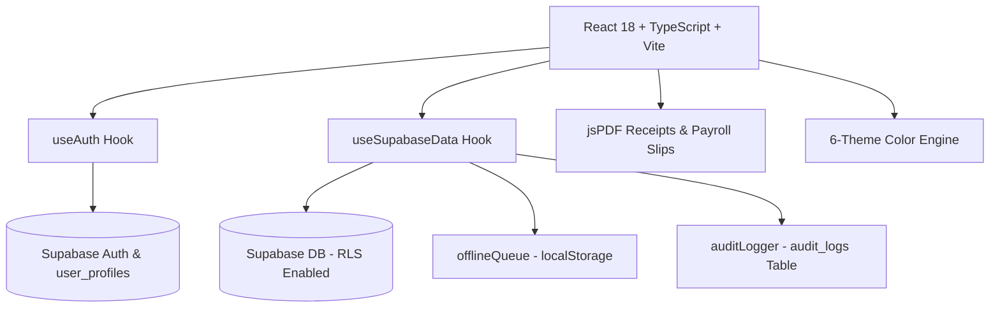

# Complexe Scolaire MAMA THERA — Full Development & Architecture History

This document serves as a complete history, architectural record, and technical changelog for the **Complexe Scolaire MAMA THERA Finance Suite** (Bamako, Mali). It documents every phase, feature addition, security enhancement, and design decision made during development.

---

## 📍 School Context & Project Scope

- **Institution**: Complexe Scolaire MAMA THERA
- **Location**: Bamako, Mali (Managed remotely from the US by Ibrahim Thera)
- **Levels Served**: Enseignement Fondamental (Primary & Middle) and Lycée (High School)
- **Currency**: FCFA (XOF)
- **Primary Language**: Bilingual UI (French `fr` default, English `en`)
- **Key Domain Terminology**: **Élève / Élèves** (Primary/Secondary pupils, changed from university-level *Étudiants*)

---

## 🚀 Chronological Development History

### Phase 1: Production Readiness & Network Resilience
- **Objective**: Establish staging/production configuration templates and network retry mechanisms for unreliable internet connectivity in Bamako.
- **Deliverables**:
  - Environment templates (`.env.example`, `.env.staging`, `.env.production`).
  - Build & seed scripts (`dev:staging`, `build:production`, `seed:production`).
  - Exponential backoff network retry utility (`src/lib/networkUtils.ts`).

---

### Phase 2: Supabase Auth & RLS Database Security Lockdown
- **Objective**: Replace anonymous/hardcoded access with secure Supabase Email/Password Authentication and Row Level Security (RLS).
- **Deliverables**:
  - Migration `20260809000000_auth_and_rls.sql`: Created `public.user_profiles` table, auto-profile trigger on signup, and 33 strict RLS policies locking down tables to authenticated users.
  - `src/lib/useAuth.ts`: Custom React hook managing session state, authentication persistence, and user profiles.
  - Login UI (`App.tsx`): Bilingual login screen backed by Supabase `signInWithPassword`.

---

### Phase 3: Offline Support & Printable PDF Payment Receipts
- **Objective**: Ensure cashiers in Bamako can record transactions even during internet outages, and generate official A5 payment receipts for parents.
- **Deliverables**:
  - `src/lib/offlineQueue.ts`: `localStorage` queue manager (`mama_thera_offline_queue`).
  - `src/lib/pdfReceipt.ts`: A5 official payment receipt generator using `jspdf` featuring school letterhead, receipt serial number, student/parent details, and payment breakdown.
  - `src/components/ToastNotification.tsx`: `<OfflineBanner>` displaying pending offline items and a manual "Sync Now" button.
  - Auto-sync (`syncOfflineQueue`) triggering upon network reconnection.

---

### Phase 4: Financial Reports & Printable Staff Payslips
- **Objective**: Generate official PDF exports for monthly executive P&L statements and staff salary slips (*Bulletin de Paie*).
- **Deliverables**:
  - `src/lib/pdfPayroll.ts`: Printable A5 **Bulletin de Paie** PDF generator with earnings, deductions, net salary, and cashier signatures.
  - `src/lib/pdfFinancialReport.ts`: Executive A4 **Financial Summary Report (P&L)** with revenue, operating costs, vendor expenses, net balance, and enrollment statistics.
  - UI Triggers (`App.tsx`): Dedicated PDF export buttons in Dashboard and Staff Payroll tables.

---

### Phase 5: Tamper-Evident Audit Trail & Security Logs
- **Objective**: Admin-only audit log tracking every payment, expense, salary, and user role change with timestamps and staff identity.
- **Deliverables**:
  - Migration `20260814000000_audit_logs.sql`: Created `audit_logs` table with RLS restricting read access exclusively to `admin` role.
  - `src/lib/auditLogger.ts`: Utility function (`logAuditEvent`) inserting structured log records into Supabase.
  - Admin View (`App.tsx`): Dedicated **Journal d'Audit / Audit Trail** tab view with time-series table and color-coded action badges (`RECORD_PAYMENT`, `ADD_EXPENSE`, `UPDATE_USER_ROLE`).

---

### Phase 6: In-App User & Role Controller
- **Objective**: Allow Admins to manage staff user accounts, toggle roles (`admin` ⇄ `staff`), and send password reset emails directly within the app without using the Supabase dashboard.
- **Deliverables**:
  - `src/lib/useAuth.ts`: Added `updateUserRole(userId, newRole)` and `sendPasswordReset(email)`.
  - Admin UI (`App.tsx`): Upgraded **Settings → User Accounts** into an interactive controller with avatar badges, role toggles, and 1-click password reset triggers.

---

### Phase 7: UI Polish, Theme Engine & Localization Refinements
- **Objective**: Elevate design aesthetics, adapt local terminology, and refine user experience.
- **Deliverables**:
  - **Terminology Update**: Changed all French UI occurrences of *"Étudiant"* to *"Élève"* (suitable for fundamental and high school pupils).
  - **Custom 6-Theme Palette**:
    1. **Émeraude MAMA THERA** *(Official School Emerald #064E3B)*
    2. **Navy Exécutif** *(Corporate Navy)*
    3. **Bordeaux Académique** *(Burgundy Academic)*
    4. **Livre Crème** *(Warm Cream Ledger)*
    5. **Ardoise Sombre** *(Dark Slate)*
    6. **Cyber Minuit** *(Cyber Midnight Dark)*
  - **Timezone Integration**: Formatted timestamps explicitly with `Africa/Bamako` GMT+0 timezone tags for official records.
  - **WhatsApp & SMS Relance**: WhatsApp & SMS follow-up notice modal for parents with overdue balances.

---

## 🛠️ Complete System Architecture



---

## 📂 Key Source Code Map

| Feature / Area | Primary File(s) | Description |
|----------------|-----------------|-------------|
| **Core UI & Admin Hub** | `src/App.tsx` | Main application shell, dashboard, tabs, modals, theme engine |
| **Authentication & Users** | `src/lib/useAuth.ts` | Supabase auth state, session persistence, role updates, password resets |
| **Data & Synchronization** | `src/lib/useSupabaseData.ts` | Optimistic state management, offline queue auto-sync, database mutations |
| **Offline Storage** | `src/lib/offlineQueue.ts` | Queue storage manager for offline payments & expenses |
| **Audit Logging** | `src/lib/auditLogger.ts` | Inserts structured audit trail entries into Supabase |
| **Payment PDF Receipt** | `src/lib/pdfReceipt.ts` | Printable A5 payment receipt PDF generator |
| **Staff Payslip PDF** | `src/lib/pdfPayroll.ts` | Printable A5 Bulletin de Paie PDF generator |
| **Financial Report PDF** | `src/lib/pdfFinancialReport.ts` | Executive P&L Financial Report PDF generator |
| **Notifications & Toasts** | `src/components/ToastNotification.tsx` | Toast notification provider & offline status banner |
| **Views Props Contract** | `src/app/mainViewsProps.ts` | Single source of truth for the 186-prop `MainViewsProps` contract + helper types — imported by `App.tsx` and `MainViews.tsx`, consumed by the views through the typed context; guarded by `scripts/check-component-props.mjs` (parses this module) and `tests/mainviews-props.test.ts` (single definition, all props required, no `any`, wiring pointed here, types-only) |
| **Database Migrations** | `supabase/migrations/` | SQL schema files for profiles, audit logs, and RLS policies |

---

## 🔍 Verification & Quality Assurance

- **Typecheck (`npm run lint`)**: `tsc --noEmit` returns **0 errors** (strict + noImplicitAny).
- **Lint (`eslint .`)**: **0 errors and 0 warnings** (2026-08-31). The two `react-hooks/exhaustive-deps` warnings in `App.tsx` are fixed properly — the welcome effect destructures the stable pieces of `auth` (`profile`/`isAdmin`/`fetchAllProfiles` — the hook object itself is recreated every render) and lists them with `hasShownWelcome`/`t.welcomeBackName`; the floating-chat greeting effect keys on the queue length and the translated text itself (a language switch re-seeds only when the chat is empty, as before). The `react-refresh` warnings are gone by structure: the `useToast` hook + toast types moved to [`src/lib/useToast.ts`](src/lib/useToast.ts), the `MainViewsContext` + `useMainViews` hook moved to [`src/app/mainViewsContext.ts`](src/app/mainViewsContext.ts) (component files now only export components — this also breaks the latent import cycle views↔MainViews), and `src/main.tsx` is exempted from the rule (an entry point intentionally exports nothing). The toast timer cleanup now captures the timer map inside the effect instead of dereferencing `timerRefs.current` at cleanup time. `t` is declared right after `lang` so effects can list translated strings in their dependency arrays. Zero warnings are now **enforced**, not just achieved: the lint chain (local, pre-commit and CI) runs `eslint . --max-warnings 0`, so any single warning — even a benign one — fails the chain. Proven by a negative test: a temporary file exporting a hook + a component fails with exit 1 (`ESLint found too many warnings (maximum: 0)`).
- **Tests (`npm test`)**: 81/81 passing (formatters, excel importer, offline queue replay, offline sync drain, **escape-to-close stack** — topmost-only press, fallback after unmount, re-arm after drain; the keyboard-consistency feature: one shared `keydown` listener closes the topmost open overlay per press via [`src/lib/useEscapeToClose.ts`](src/lib/useEscapeToClose.ts), wired into all 16 AppModals overlays, the floating chat panel and the 5 standalone modal components; **focus stack** — Tab wrap-around at both ends, pull-back-in from outside, initial focus into the overlay, restore-to-trigger on close, refocus-into-next-overlay when one remains, via [`src/lib/focusStack.ts`](src/lib/focusStack.ts)), view rendering inside MainViewsContext, MainViewsProps contract).
- **Overlay audit (small screens, 2026-08-31)**: every `position: fixed` element in `src/` was inventoried (34 occurrences) and checked for viewport fit and dimming. Verdict: all 15 modal containers (the 12 conditional overlays in [`AppModals.tsx`](src/components/AppModals.tsx), plus `ConfirmDialog`, `AddUserModal`, `ExcelImportModal`) already have a full `bg-slate-900/60`-style backdrop with click-outside close, and the Productivité panel was already capped (`w-80 max-w-[88vw]` + mobile-only backdrop). Two real offenders were fixed: the **floating AI chat card** (`w-[360px]` + `right-6` clipped 24px off-screen on a 360px viewport, and its fixed 500px height could exceed short/landscape viewports) — now `max-w-[calc(100vw_-_3rem)] max-h-[calc(100dvh_-_3rem)]` plus a mobile-only dimmed backdrop with outside-click close (same pattern as every other overlay; desktop keeps the floating-widget behaviour); and the **toast container** (`maxWidth: 380px` overflowed mobile) — clamped to `min(380px, calc(100vw - 3rem))`. Everything else (banners, success pills, FAB, EnvBadge, Login, desktop-only sidebar) fits by construction. An early pass of this audit mis-flagged the 12 AppModals containers as backdrop-less because it only grepped `bg-black` — the backdrops live on a child `motion.div` using `bg-slate-900/60`; verified individually before changing anything.
- **ARIA dialog semantics on every overlay (2026-08-31)**: all 22 overlays now expose `role="dialog"` + `aria-modal="true"` + a translated `aria-label` on the same element the focus trap confines Tab to, so screen readers announce each overlay as a modal dialog with its name (student detail viewer, add/edit-Student/Staff/Parent/Vendor-Expense (dynamic label via the `editing*` flag), add class / edit class, add expense, record salary, day payment history, Productivité panel, payment entry, audit sheet, late-payment ticket, link student, follow-up notice, confirm dialog (`aria-label` = the caller's `title`), add-staff-account, Excel import wizard, monthly payroll draft, promotion wizard, floating AI chat). No behavior change: pointers, Escape and Tab behave exactly as before — the attributes only add the announced modal semantics.
- **Focus trap on every overlay (2026-08-31)**: keyboard navigation is now completed beyond Escape — [`src/lib/focusStack.ts`](src/lib/focusStack.ts) mirrors the escape stack: each open overlay registers a trap, ONE shared `keydown` handler confines Tab to the **topmost** trap with wrap-around at both ends and pull-back-in when focus sits outside (clicked the page, focus on a non-focusable spot), focus moves **into** the overlay when it opens (APG behaviour; skipped when focus is already inside, so autofocused type-to-confirm inputs keep it) and is **restored to the trigger** when it closes — or to the exact trigger when it still lives inside another open overlay, else into that overlay. Wired with `useFocusTrap` into ConfirmDialog, AddUserModal, ExcelImportModal, MonthlyPayrollDraftModal, PromotionWizardModal and the floating chat panel, and with `useOverlayTraps` (single hook, JSX-ordered indices) into the 16 AppModals overlays. 15 new unit tests drive the pure `confineTab` core and the stack lifecycle with structural fakes, DOM-stub focus bookkeeping — 0 DOM library needed, same discipline as the escape-stack tests.
- **App.tsx split into domain hooks (2026-08-31)**: `src/App.tsx` (was 3 655 lines) is down to ~3 370 — three cohesive domains extracted **verbatim** into `src/app/` hooks, App.tsx only consuming their returned API (call sites and the `MainViewsProps` wiring are byte-identical, guards 186/186 & 154/154 still green):
  - **AI chat** → [`useFloatingChat`](src/app/useFloatingChat.ts) + [`FloatingChat.tsx`](src/components/FloatingChat.tsx) (panel + FAB): both AI surfaces (Productivité AI tab + floating widget), their state, greeting re-seed effect and Escape wiring (~300 lines out); two new translation keys (`floatingChatTitle`/`floatingChatPlaceholder`) in both dictionaries for the panel header/input;
  - **Auth/welcome** → [`useAuthWelcome`](src/app/useAuthWelcome.ts): `useAuth` instance + `currentUser`/`isPromoter`/`authLoading` derivations, the first-sign-in welcome banner (message + 5 s auto-dismiss + re-arm on profile change), the admin-only user-profiles fetch, and the admin-tab guard effect — called with `{ t, activeTab, setActiveTab }` (`setActiveTab` now listed in the effect deps since it arrives as a prop);
  - **To-Do sidebar** → [`useTodoSidebar`](src/app/useTodoSidebar.ts): task-input + sidebar open flag + panel tab state, and add/toggle/delete — including the "Call Parent" completion automation through `handleSaveNote` (passed in deps) — called with `{ todos, t, handleSaveNote, addTodoItem, updateTodoItem, deleteTodoItem }`.
- **Productivité panel is resizable on desktop (2026-08-31)**: the right-hand panel used to be a hard-coded `w-80` (320px). It now has a left-edge drag handle (`hidden lg:flex`, `role="separator"`) — drag to resize (280–720px; the 88vw CSS cap stays the final guard on small windows), or focus it and use ← (widen) / → (narrow) / Home / End; double-click resets to 320px. The chosen width persists per browser via `localStorage` (guarded fallbacks for SSR/test runners). Collapse is unchanged: the X button, Échap and the sidebar's Productivité toggle all close it; the slide-in/out animation now tracks the actual width instead of the old 320px offset. Local UI state inside `AppModals` — the `MainViewsProps` contract and its wiring guard are untouched.
- **Pre-commit hooks**: husky runs `npm run lint && npm test && node scripts/check-audit.mjs` before every commit — the same audit gate as CI guards locally. Two hook-only conveniences (via `AUDIT_CACHE=1 AUDIT_SOFT_OFFLINE=1`): the result is **cached** in `node_modules/.cache/audit-gate.json`, keyed on the package-lock hash (24h TTL, `AUDIT_CACHE_REFRESH=1` forces a live re-audit), so commits that don't touch dependencies re-audit instantly; and an **unreachable registry** (offline development) only warns instead of blocking — the CI push gate stays the enforcement point. `git commit --no-verify` skips everything in an emergency.
- **Production Build (`npm run build`)**: Vite production bundle builds successfully in `dist/`.
- **Local Dev Server**: Runs on `http://localhost:3000/`.

---

## 🔒 Dependency Security Status (npm audit)

*Last review: 2026-08-31. `npm audit` reports **0 vulnerabilities**. The previous 29 (2 low, 7 moderate, 19 high, 1 critical) were all **dev-only pins inside the Vercel CLI** dependency tree (`tar`, `undici`, `js-yaml`, `minimatch`, `smol-toml`, `path-to-regexp`, `ajv`, `@tootallnate/once`, `esbuild`). Rather than `overrides`, the deployment CLI was **removed from the root project** — it now lives in the isolated [`tools/`](tools/package.json) manifest (own lockfile) and deploys run through GitHub Actions — which eliminated the whole tree (≈264 packages) from the root lock at the source.*

- **How it was fixed**: `vercel` was a devDependency used only to deploy. It (and all its `@vercel/*` transitive pins) is gone from the root `package.json` + lockfile; it is now pinned in [`tools/package.json`](tools/package.json) (own lockfile, ≈289 packages), consumed only by the deploy workflow. [`.github/workflows/deploy.yml`](.github/workflows/deploy.yml) runs `npm ci --prefix tools` and deploys on every push to `main` **with that reviewed pin** — a broken CLI release reaches production only after its Dependabot PR merges. `npm run deploy:prod` is now a notice pointing to CI (`scripts/deploy-notice.mjs`). `esbuild` is declared explicitly in devDependencies because `tsx` (the test runner)'s esbuild copy had to be restored after removing the vercel override — it is clean (`0.28.2`).
- **Dependabot** ([`.github/dependabot.yml`](.github/dependabot.yml)): daily `npm` checks on the root manifest and on `/tools` (a new `vercel` release opens a reviewed PR that becomes the deployed CLI version), weekly `github-actions`. Commit messages follow the repo's conventional style (`chore(deps)`, `chore(deps-dev)`, `chore(deploy)`, `chore(ci)`). Dependabot **cannot** watch the `xlsx` CDN tarball — that one is manual. The `/tools` pins are deploy-CLI-only: they live in CI, are never bundled into the app, and are deliberately **not** part of the root audit gate (the CLI's known `@vercel/*` pins remain dev-only upstream — vercel/vercel#11543 — which is why the CLI stays out of the root lock).
- **What the workflow needs** (repository secrets — `Settings ▸ Secrets and variables ▸ Actions`): `VERCEL_TOKEN` (access token), `VERCEL_ORG_ID` (`team_…`), `VERCEL_PROJECT_ID` (`prj_…`). For this project: org `team_CfIwAlGjbuOf3EItm2mDUK4n`, project `prj_Jwn5tMXCwQ6a2V3t5nFQjt8OSMPi`. Production env (`VITE_SUPABASE_URL`/`VITE_SUPABASE_ANON_KEY`) stays in the Vercel dashboard and is pulled by `vercel pull`.
- **`vercel.json`**: now pins `framework`/`buildCommand`/`outputDirectory` (Vite → `dist`) so the isolated CLI build is deterministic and doesn't depend on dashboard settings (the SPA rewrite is unchanged).
- **To deploy locally** nothing is needed — push to `main`:
  ```bash
  git push origin main
  ```
  and watch the "Deploy (Vercel)" workflow. `npm run lint`, `npm test`, `npm run build` and the audit gate all run in CI before `vercel deploy --prebuilt --prod`.
- **To use the CLI locally** (e.g. `vercel dev`): `cd tools && npm ci && npx vercel …` — the root project stays clean. Re-adding `vercel` to the root devDependencies would re-introduce its dev-only pins, so only do that deliberately.
- **Risk assessment**: all removed packages were deployment-CLI-only and never bundled into the production app (verified in `dist/`). The only runtime dependency with advisories, `xlsx`, is already the SheetJS CDN build `0.20.3`.
- **Install scripts**: npm 11's `allowScripts` policy is configured in `package.json` with `esbuild`/`core-js` approved by package name.
- **CI gates**: a single quality workflow, [`.github/workflows/perf-guard.yml`](.github/workflows/perf-guard.yml) (it absorbed the former `security-audit.yml`), runs on every push to `main` with three parallel jobs — `quality` (explicit **ESLint zero-warning gate** — `eslint . --max-warnings 0` — then no-explicit-any + banned ts-comments + tsc strict + props wiring + [`scripts/check-forbidden-any.mjs`](scripts/check-forbidden-any.mjs) blocking every `as any`/`@ts-ignore`/`@ts-expect-error`/`@ts-nocheck` in `src/`, then the tests, then `scripts/check-audit.mjs` in strict mode — fails on any production vuln and on any total **above 0**) and `lighthouse` (Lighthouse), and `tools-audit` (**warning-only**, see below) — alongside `deploy.yml` and the weekly `vercel-pins-watch` (see below). The same `check-audit.mjs` also guards the pre-commit hook locally (cached + offline-tolerant, see above), so a vulnerability introduced by an install is caught at commit time, before it can be pushed.
- **Verified on GitHub (2026-08-31)**: the quality/audit gate was checked against the real runners via the public API (not just locally). On `f0db212`, run [33407449986](https://github.com/ibrahimkalilthera/-MAMA/actions/runs/33407449986) completed **success**: job `Lint + tests + audit` passed every step — checkout → setup-node → `npm ci` → lint → tests → **Audit gate (production clean + total within baseline 0)** — in ~35 s; job `lighthouse` passed in ~61 s. All 8 most recent pushes are green (`quality` workflow: 33 runs total). `npm ci` sync between `package.json` and `package-lock.json` is proven by the runner's install step itself.
- **Deploys are gated on quality (no broken push can reach production)**: [`deploy.yml`](.github/workflows/deploy.yml) no longer triggers on `push` — it triggers via **`workflow_run`** when `perf-guard.yml` **completes successfully on `main`**, and deploys **exactly the commit that quality validated** (`head_sha` checkout). Its first step is a gate: if the quality workflow did not succeed, the deploy job exits neutral (78 — shown grey, not red) and nothing reaches Vercel. The redundant lint/tests steps were removed from the deploy job (quality already covers them); it only needs `npm ci` for `vercel build`. Manual deploys stay possible via `workflow_dispatch` (deploys current main — explicit human action). Trade-off, by design: if the quality workflow itself cannot run (Actions outage), deploys stop too.
- **Tools audit job (warning-only, 2026-08-31)**: [`scripts/report-tools-audit.mjs`](scripts/report-tools-audit.mjs) audits the `tools/` lockfile on every push (no install needed) and reports the isolated CLI's dev-only pins via a `::warning` annotation + step summary. It can **never** fail the run (always exits 0, plus `continue-on-error` on the job) because `deploy.yml` is triggered by this workflow's success — a red tools audit there would silently stop deploys. The strict root gate stays at 0; the deeper weekly follow-up stays with `vercel-pins-watch`.
- **Vercel pins watch (weekly, 2026-08-31)**: [`.github/workflows/vercel-pins-watch.yml`](.github/workflows/vercel-pins-watch.yml) (Mondays 06:00 UTC, plus manual dispatch and a paths-filtered push run) audits the current `tools/` tree from its lockfile (no install needed) and probes the latest vercel release the same way (`npm install --package-lock-only` — metadata only, nothing executed; latest read via `npm view`, which honours proxy settings unlike bare `fetch`). Dependabot opens the bump PR when a new CLI ships but cannot tell whether the *new tree is clean*; this watch can — when the latest tree audits **0**, it opens a single tracking issue (label `vercel-pins`) refreshed weekly with live counts and the linked Dependabot PR(s), and auto-closes it once `tools/` audits **0** after the bump merges. A still-vulnerable upstream never turns the run red — it is a tracker, not a gate ([`scripts/check-vercel-pins.mjs`](scripts/check-vercel-pins.mjs); local dry-run without `GITHUB_TOKEN`, and `PROBE_VERSION=x.y.z` exercises the probe path directly).
- **Vercel git integration neutralized (single source of prod = Actions, 2026-08-31)**: the GitHub `deployments` endpoint showed the **native Vercel git integration was also auto-deploying on every push to main** — creating `vercel[bot]` deployments on **two** projects (`Production – mama-thera-finance` **and** `Production – mama-thera-staging`, the latter never touched by any workflow), duplicating the Actions `deploy.yml` on production. [`vercel.json`](vercel.json) now sets `git.deploymentEnabled: false`, which disables **all git-triggered automatic deployments** on every project that reads this config (finance and staging alike) without affecting the explicit CLI/API deployment that `deploy.yml` performs (`vercel deploy --prebuilt --prod`). Verified after push: the neutralized commit shows **no new `Vercel – mama-thera-staging` status/deployment**. The GitHub-app connection itself stays installed (harmless once `deploymentEnabled` is false); it can be disconnected dashboard-side (Vercel → Settings → Git) for a fully clean state.
- **Deploy verified end-to-end (2026-08-31)**: the secrets were added and the full chain was confirmed on the real runners — quality succeeded on `6c198be` (run #33409792988), then deploy ran via `workflow_run` and succeeded in ~36 s (run #33409897850: Gate → checkout `head_sha` → deps → tools → `vercel pull` → `vercel build` → `vercel deploy --prebuilt --prod`), so production now ships exactly what quality validated. Triggers, for reference: `perf-guard` fires on `push` to `main` (concurrency group `quality-*`, cancel-in-progress); `deploy` fires on quality-completion (and manual `workflow_dispatch`, concurrency `deploy-*`, no cancel).

- **Parents domain extracted into a hook (2026-09-01)**: the parent directory, link-student, notify/reminder and ledger-PDF logic moved out of App.tsx into `src/app/useParents.ts` — states (directory, edit form, link modal, notify modal), `handleParentSubmit`/`handleLinkStudentSubmit`/`handleUnlinkStudent`/`handleDeleteParent`/`openEditParentModal`, the relational helpers (`getChildrenForParent`, `getParentOutstandingBalance`, `getParentPaymentHistory`), the WhatsApp/SMS/copy notify actions and `handleExportParentLedgerPdf`. App.tsx: 3 248 → 2 802 lines. `confirmAction` deliberately **stays in App.tsx** (it backs the global ConfirmDialog shared by several delete flows) and is injected as a dependency along with `setWelcomeMessage`, `formatCurrency` and the Supabase mutators — so the call site sits after those declarations, andthe props wiring to MainViews/AppModals is unchanged (guards still 186/186 & 154/154).

- **Productivité panel extracted into a component (2026-09-01)**: the To-Do/AI right-hand sidebar moved out of AppModals.tsx (3 371 → 3 160 lines) into `src/components/ProductivityPanel.tsx` with its own fully-typed `ProductivityPanelProps` (TranslationDict, Todo[], ChatMessage[], setters, handlers, theme tokens — zero any). The panel **self-manages its focus trap and Escape** (same pattern as FloatingChat) via `useFocusTrap`/`useEscapeToClose`, so the `showTodoSidebar` entry was removed from AppModals' `openOverlays` escape list **and** the corresponding overlayRoots index was dropped — the remaining 15 entries were renumbered 10-15 → 9-14 to keep the `useOverlayTraps` index pairing aligned with the JSX refs. The desktop resize logic (drag handle, arrow keys, double-click reset, localStorage persistence) moved with it.

- **Explicit `initialFocus` in the focus stack (2026-09-01)**: `pushFocusTrap` and `useFocusTrap` now accept an optional `InitialFocus` — a CSS selector or a `(container) => element` resolver — that declares where focus lands on open instead of the blind "first focusable" rule. `MonthlyPayrollDraftModal` (whose first focusable is the month `<select>`, not the ✕) targets `'select'` and `ConfirmDialog` (type-to-confirm mode) targets `'input[type="text"]'` via resolver, falling back to the ✕ when absent. Missing/throwing targets degrade gracefully to the old behaviour (4 new unit tests in `tests/focus-stack.test.ts`, 19/19).

- **`aria-labelledby` on all 22 overlays (2026-09-01)**: every dialog keeps its translated `aria-label` and now **also** points `aria-labelledby` at its visible title element, so screen readers announce the exact on-screen heading (the label wins over `aria-label` when it resolves, per APG). Each visible title carries a stable id (`modal-title-*` / `panel-title-*`): student details (the student's name), add/edit student/staff/vendor-expense/parent (dynamic via the `editing*` flag), add class, edit class, add expense, record salary (points at `recordSalaryPayment` — the visible heading), payment history (announces the actual day/date), payment entry, audit sheet, late-payment ticket, link student, reminder, add-staff-account, confirm, Excel import, promotion wizard, monthly payroll draft, floating AI chat and the Productivité panel (announces the active tab: To-Do list or AI assistant). Verified 1:1 in src/ — 22 `aria-labelledby` references ↔ 22 title ids.

- **Payments/students domain extracted into a hook (2026-09-01)**: the payment-entry domain left App.tsx (2 801 → 2 724 lines) for `src/app/usePayments.ts` — payment form state (`showPaymentForm`, `paymentStudentId`/`paymentAmount`/`paymentDate`), the day-payment-history modal state (`selectedCalendarDay`), `handlePaymentSubmit` with the auto-generated PDF receipt (lock check, optimistic Supabase write via `addPayment`, `generatePaymentReceiptPdf` with the fresh `amountPaid`, form reset) and the calendar event derivation `getEventsForDay` that feeds the day modal. The hook receives its data deps as arguments (students/staff/expenses/selectedYear/lockedYears/currentUser/`addPayment`) — call site sits after those declarations, exactly like `useParents` — and returns the same names App already passed down, so the MainViews/AppModals props contracts are untouched (guards still 186/186 & 154/154). `generatePaymentReceiptPdf` stays a lib import in App.tsx too (it is still a passthrough prop for AppModals' receipt buttons).

- **Payroll/staff domain extracted into a hook (2026-09-01)**: the staff & payroll domain left App.tsx (2 724 → 2 632 lines) for `src/app/usePayroll.ts` — staff form (`staffForm`, `editingStaff`, modal open/close), salary form (`salaryForm`, `showSalaryModal`), payroll draft modal state (month/year), `staffSearchTerm`/`visibleBankDetails`, the `filteredStaff` memo, `handleStaffSubmit` (lock check, add/edit via `addStaff`/`updateStaff`, toast), `handleSalarySubmit` (lock check, `addSalaryPayment` with academic year, toast), `openEditStaffModal` (form pre-fill) and the monthly payroll Excel export (`handleExportMonthlyPayrollExcel`, bordereau paie). Deps injected: staff/salaryPayments/`showToast`/selectedYear/lockedYears + the three mutators with exact signatures. `deleteStaff` and `generateStaffPayslipPdf` stay passthroughs in App.tsx; `payrollWindowStatus`/`missedMonths` stay put (dashboard view derivations, out of the requested domain). Props contracts untouched (guards still 186/186 & 154/154).

- **handleParentSubmit creation-mode unit tests (2026-09-01)**: `tests/parents-submit.test.tsx` (happy-dom, real hook, spy mutators) locks the creation path of `handleParentSubmit` (6 cases): full success (addParent once with trimmed/normalised data, every selected student linked with the created parent id, fiche view opens, no warning), partial failure on the 2nd link (loop keeps going until the failing one, exact `Parent créé, mais seulement 1/2 élève(s) lié(s).` warning), failure on the 1st link (loop breaks, `0/2` warning, modal closes — no fiche view), creation failure (addParent null → early return, nothing linked, form untouched), no students selected (modal closes + form resets) and empty fullName (no mutator call at all). The harness reads the hook API through a live ref — a snapshot taken before an `act` closes over stale state.

- **Notifications panel extracted into a component (2026-09-01)**: the due/note reminder cards left App.tsx (1 242 → 1 225 lines) for `src/components/NotificationsPanel.tsx` — typed props (`notifications: DashboardNotification[]` from useDashboard, `onOpenStudent: (studentId) => void` bundled callback; the find-student + `setSelectedStudent` lookup stays in App). `motion` trimmed from App's `motion/react` import (`AnimatePresence` remains, still used by the AddUserModal gate). `Bell` stays in App's icon import — it is still part of the MainViews/AppModals props contract. Guards still 186/186 & 154/154.

- **handleCloseCurrentYear unit tests (2026-09-01)**: `tests/year-ops.test.tsx` (happy-dom, real `useYearOps` hook, spy mutators/setters, stubbed `alert`) locks the year-closure flow in 5 cases: non-admin/dev role → alert + zero side effects; already-locked year → alert + zero side effects; success — positive balances carried over **grouped by student name** (two same-name students accumulate into one next-year `addStudent` with the opening-balance note), zero-balance students skipped, year locked (`setLockedYears`), next year appended to the year list (idempotent), audit modal opened and toast fired; existing next-year student → `updateStudent` with `totalDue` increased + carry-over note; mutation failure (`addStudent` → null) → alert + lock/audit/toast effects skipped. Two gotchas fixed on the way: the alert stub must push into the spies array (not a local one), and the failure case must return `null` — the hook checks `r !== null`, so a `false` spy result would have resolved as success. Fixtures typed against the real `User` (`{ username, role, name? }` — no id/fullName/email).

- **JSX shell split into layout components (2026-09-01)**: the render shell of App.tsx (1 624 → 1 242 lines) was split into five typed layout components — `AppLoadingScreen` (the auth/Supabase spinner, reused twice with different titles), `Sidebar` (logo, tab nav with payroll badges + admin/dev tabs, productivity toggle, sign-out, quick actions, language toggle — actions bundled as `onSignOut`/`onToggleLanguage`/`onAddStudent`/`onRecordPayment` callbacks, tab union typed as exported `AppTab`), `AppHeader` (tab title + date, year selector, contextual action bar — the PDF/print dispatch and heavy data arrays bundled into `onPrintReport`/`onFinancialReportPdf`/`onExportLate`/`onPromoteClass`/`onImportExcel`/`onOpenMonthlyDraft`/`onAddStudent` callbacks, so the component needs no data arrays), `WelcomeBanner` (role-based greeting with the mamadou/fanta special cases) and `LockedYearBanner` (read-only banner, `show` prop). The two inline « add student » reset blocks (sidebar + header) were deduplicated into one `openAddStudentModal` helper in App. New components import their own lucide icons; App's icon import left untouched (unused named imports are not flagged). Guards still 186/186 & 154/154.

- **Year state lifted into a context + year operations hook (2026-09-01)**: `selectedYear`/`lockedYears` left App-local state for a **`YearContext`** — `src/app/yearContext.ts` (context + `useYear` hook, non-component file per `react-refresh/only-export-components`, mirroring the `mainViewsContext` split) and `src/app/YearProvider.tsx` (the provider, mounted in `src/main.tsx` around `<App/>`). App reads the context and still passes the values down as hook deps/props, so the six consuming domain hooks keep their deps-args interface and stay unit-testable without a provider. `handleCloseCurrentYear` + `getYearStats` moved to `src/app/useYearOps.ts` (deps injected: t/currentUser/students/expenses/vendorExpenses/salaryPayments + the mutators + the year state/setters). App.tsx 1 731 → 1 624 lines. New `tests/year-context.test.tsx` (happy-dom, 2 cases) locks the contract: `useYear` throws outside a provider and the provider exposes working setters (the initial version hit the fast-refresh warning — the context/hook and the provider were split into two files, same convention as MainViews). Guards still 186/186 & 154/154.

- **Users/settings domain extracted into a hook (2026-09-01)**: the user-management domain left App.tsx (1 747 → 1 731 lines) for `src/app/useUsers.ts` — the add-user modal flag (`showAddUserModal`), the list search/role filter (`userSearchTerm`, `userRoleFilter` typed as exported `UserRoleFilter`), the in-flight update id (`updatingUserId`) and the three handlers (`handleUpdateRole` with optimistic profile update + localized toast, `handleToggleRole` admin⇄staff, `handleSendPasswordReset`). Deps injected: `auth` as `Pick<AuthState, 'updateUserRole' | 'sendPasswordReset'>` (exact signatures from useAuth), `userProfiles`/`setUserProfiles` (from useAuthWelcome) and the toast API — the call site sits right after the useAuthWelcome block where all deps are declared. Props contracts untouched (guards still 186/186 & 154/154).

- **Expenses/vendors domain extracted into a hook (2026-09-01)**: the expense & vendor-expense domain left App.tsx (1 883 → 1 747 lines) for `src/app/useExpenses.ts` — modal open flags (`showExpenseModal`/`showVendorExpenseModal`/`vendorExpensesTab`), the list filters (`generalExpenseCategoryFilter`/`generalExpenseSearch`/`vendorSearch`/`vendorCategoryFilter`/`vendorStatusFilter`), the calendar state (`calendarDate`/`showCalendarModal` + the month/day helpers `getDaysInMonth`/`changeMonth`/`getMonthName`/`getDayName`, which now import `getCalendarDays`/`getMonthNameImpl`/`getDayNameImpl` directly from the libs), the forms (`expenseForm` + exported `ExpenseForm`, `vendorExpenseForm` typed against the existing `VendorExpenseForm`, `editingVendorExpense`), `ticketStudent`, the localized `expenseCategoryList` memo and the four handlers (`handleExpenseSubmit` with lock/amount checks, `handleVendorExpenseSubmit` with promoter gate + social-case aid fields, `handleEditVendorExpense` pre-fill, `handleDeleteVendorExpense` with the role check — hence `currentUser` in deps). `generalExpenseCategoryFilter`/`generalExpenseSearch` were declared-but-unused in App (dead states) and moved along. Imports trimmed in App (`getCalendarDays`, `getMonthNameImpl`, `getDayNameImpl` aliases no longer needed). Props contracts untouched (guards still 186/186 & 154/154).

- **Students domain extracted into a hook (2026-09-01)**: the student list & profile domain left App.tsx (2 062 → 1 883 lines) for `src/app/useStudents.ts` — search/sort/filter state (`searchTerm`, `studentSortKey`/`studentSortOrder`, `studentGradeFilter`, `handleSort`, the `filteredStudents` memo), the add/edit modal state (`studentForm` typed against the existing `StudentForm`, `editingStudent`, `showStudentModal`, `selectedStudent`, `studentDetailTab`), the A4 file printout (`printStudentFile` + its trigger effect) and the four handlers (`handleStudentSubmit` with lock/email/amount validation, `openEditModal` pre-fill, `handleSaveNote`, `toggleFlag`). Two cross-cutting couplings handled: (1) `showToast` (defined at ~829, after `useTodoSidebar` which consumes `handleSaveNote` at ~823) was **moved up** next to `setShowSuccessToast` so the hook can take it as a dep and still be called before `useTodoSidebar`; (2) `autoSelectGrade` in the `useClasses` call still writes into `studentForm` via the returned `setStudentForm`. The two inline JSX « add student » buttons (sidebar + header) keep their full-form reset inline, now driven by the returned setters. `useEffect` import dropped from App (the only remaining effect moved with the hook); the real `addStudent` signature (`Omit<Student, 'id' | 'payments'>`) was copied exactly after a first tsc catch. Props contracts untouched (guards still 186/186 & 154/154).

- **Theme/branding domain extracted into a hook (2026-09-01)**: the school theme & branding left App.tsx (2 218 → 2 062 lines) for `src/app/useTheme.ts` — `theme`/`schoolLogo`/`logoColor` states, `logoInputRef`, the three localStorage effects (theme load with the legacy `midnight`→`slate` / `modern`→`cream` migrations, theme save, logo+color save), the `currentTheme` token map (typed against the existing `CurrentTheme` interface) and `handleLogoUpload` (base64 save + dominant-color extraction). Fully self-contained (no external deps, `useTheme()` takes nothing); the hook call sits where the states were, all consumers (`currentTheme.bg`, `setTheme`/`theme` props, logo props) wired through the returned API. The print-trigger effect (owned by the students list) stayed in App. Imports cleaned: `useRef`/`ChangeEvent` and the `ThemeId` type import dropped from App.tsx (they now live in the hook). Props contracts untouched (guards still 186/186 & 154/154).

- **Exports domain extracted into a hook (2026-09-01)**: the three local export/print handlers left App.tsx (2 290 → 2 219 lines) for `src/app/useExports.ts` — `handleExport` (late-payments XLSX report), `handleExportAllData` (full school-data backup workbook: Students/Staff/Expenses/Salary Payments sheets + toast) and `handlePrint` (`window.print()`). Deps injected (`t`, `lateStudents` from useDashboard, students/staff/expenses/salaryPayments, `showToast`); the call site sits right after `showToast`'s definition (its required dep, declared at runtime order ~995). The other export entry points (parent-ledger PDF from `useParents`, monthly payroll bordereau from `usePayroll`, payment receipt PDF from the lib) stay passthroughs — they already live in their own hooks. Props contracts untouched (guards still 186/186 & 154/154).

- **Dashboard/stats domain extracted into a hook (2026-09-01)**: the seven derived memos that feed the dashboard KPIs, the charts and the payroll alerts left App.tsx (2 529 → 2 290 lines) for `src/app/useDashboard.ts` — `stats` (DashboardStats: outstanding, collected/prev-month, late parents, fees, expenses, arrears, enrolled), `notifications` (due/note reminders), `lateStudents`, `chartData` (12-month income/expenses), `pieData` (paid/outstanding), `missedMonths` and `payrollWindowStatus` (PayrollWindowStatus). Pure derivation, no state: all deps injected (`t`, `today`, `currentMonth`, `selectedYear`, students/staff/expenses/vendorExpenses/salaryPayments) and the return types are the exact `DashboardStats`/`PayrollWindowStatus` interfaces from mainViewsProps plus an exported `DashboardNotification` — the guards (186/186 & 154/154) verify the wiring unchanged. `filteredStudents` (students-list filter/sort) intentionally stays in App.tsx (list-view state, not dashboard derivation); `stats` is still consumed by `useFloatingChat` (call site placed after this hook). The surgery hit one anchor trap: `missedMonths` and `payrollWindowStatus` share the same dependency array closing line, so the first match left `payrollWindowStatus`'s closing orphaned — caught by lint/build, fixed by removing the stray line.

- **Classes/sections domain extracted into a hook (2026-09-01)**: the class-management domain left App.tsx (2 632 → 2 530 lines) for `src/app/useClasses.ts` — the merged class list memo (`availableClasses` = `DEFAULT_SCHOOL_CLASSES` + Supabase `custom_classes` deduped by id), the add/edit modal state (`showAddClassModal`/`newClassForm`/`showEditClassModal`/`editingClassRowId`/`editClassForm`) and the four handlers (`handleCreateClassSubmit`, `openEditClass`, `handleEditClassSubmit`, `handleDeleteClass`): code-collision detection, toast feedback, auto-selection of the new class in the student form (via an injected `autoSelectGrade` callback that resolves to `setStudentForm` in App), and the shared confirm dialog for deletion (injected `setConfirmAction`). Deps injected as arguments (customClasses/toast/setConfirmAction + the three `custom_classes` mutators with exact signatures); the call site sits after the `usePayroll` block (all deps declared above it). Props contracts untouched (guards still 186/186 & 154/154); `getGradeDisplay` stays in App (display helper, consumes the returned `availableClasses`). Unused imports dropped (`buildClassCode`, `DEFAULT_SCHOOL_CLASSES`, `ManagedClass`).

- **Student/class edit overlays extracted into typed components (2026-09-01)**: the three edit overlays left AppModals.tsx (3 371 → 2 724 lines) for `src/components/StudentFormModal.tsx` (add/edit student, ~350 lines), `AddClassModal.tsx` and `EditClassModal.tsx` (~170 lines each) — same treatment as the Productivité panel and the floating chat: fully typed props (TranslationDict, form state + setters, handler signatures, `ManagedClass[]`/`academicYears`/`isPromoter`, theme tokens as discrete props), **self-managed focus trap + Escape** (`useFocusTrap(open, () => rootRef.current)` + `useEscapeToClose(open, onClose)`), the form types moved with them (`StudentForm` now exported by StudentFormModal, `ClassForm` by AddClassModal — AppModals re-imports them type-only) and the ARIA dialog semantics + `aria-labelledby` preserved. AppModals keeps the three `AnimatePresence` mount gates (exit animations need the parent) and passes `open` so trap/escape deactivate during the exit. The three overlays' entries were removed from the `openOverlays` escape list **and** their `overlayRoots` indices dropped — the remaining 12 refs were renumbered 4-14 → 1-11 (single-pass regex, no index collisions) so the `useOverlayTraps` pairing stays aligned. `setConfirmDeleteStudent` (AppModals-local confirm state) flows back in as `onDeleteRequest`; icon imports all still used (checked). Props contracts untouched (guards still 186/186 & 154/154).

- **msys fork-panic recovery procedure (2026-09-01)**: this machine's Git Bash (msys) periodically enters a state where **every** external command fails — `fork: Resource temporarily unavailable` (exit 254 for multi-command lines, exit 66 even for `node -e "console.log('ok')"`, occasionally `uv_spawn: EUNKNOWN`). Empirically the trigger is an orphaned `node.exe` left by a long test/poll run killed by a hard timeout: the fork table/memory stays held, and msys can no longer fork anything, bash included. Recovery: (1) probe with `node -e "console.log('ok')"` — a green probe means work can resume; (2) the reliable unblock is killing the orphaned `node.exe` processes in Task Manager (or a reboot) — Freebuff restarts alone do NOT free the OS-held resources; (3) after the probe goes green, `git status --porcelain` must match the pre-panic state exactly — the panic never touches working-tree content, so nothing is lost; (4) resume exactly where the turn stopped. Prevention used ever since: long happy-dom test runs go through a watchdog that hard-kills the child (`SIGKILL` + `taskkill /T`) instead of leaving the timeout's kill to wedge the machine; CI polls are one-shot with short timeouts. Related structural workaround (same root cause): husky pre-commit/pre-push die of the fork bug — the hook content (lint + tests) is executed directly, then `git -c core.hooksPath= commit/push`; the quality workflow re-verifies everything on push, and deploys are gated on it, so a hooks-neutralized push remains safe. The scratch diagnostic scripts that lived in `.git/` (probes, surgery scripts, watchdog, CI one-shots) were removed on 2026-09-01 — they were never versioned; the documented procedure + `npm run lint`/`npm test` cover the same ground.

- **Productivité panel white-on-white text fixed (2026-09-01)**: the panel's ASSISTANT IA tab rendered the greeting bubble and the four quick-question buttons as **white text on white** — the "Sidebar High-Contrast Text Protection" block in `src/index.css` targeted the bare `aside` tag (`aside, aside p, aside span, aside button … { color:#FFFFFF !important }`), and the Productivité panel is a `<motion.aside>` too, so the `!important` white crushed every themed `text-slate-700`/`text-blue-600` inside it (verified live: computed color `rgb(255,255,255)` on the quick-question buttons despite the class). Fix: the real nav rail (Sidebar.tsx) got a dedicated **`app-sidebar`** class and all twelve `aside*` selectors were re-scoped to `.app-sidebar` (incl. the `.theme-cream` variants and the `text-white/N` opacity helpers). Verified in the running app (dev server + real login): bubble paragraph and all four quick questions now compute `oklch(0.372 …)` (slate-700) on light backgrounds, active tab `blue-600`, and the nav rail keeps its forced white text. Full chain green (lint 0/0, 101/101 tests, build ✓).

- **MainViews/AppModals props grouped into one typed object (2026-09-01)**: the ~340 lines of inline `name={name}` props at the two render sites in App.tsx are now a **single `viewsProps` object literal** typed `MainViewsProps & AppModalsProps` (278 keys: 186 + 154 − 62 shared, all pure shorthand since every prop was an identity mapping) placed right before `return (`, and both `<MainViews>`/`<AppModals>` receive it via `{...viewsProps}`. App.tsx 1 225 → 1 171 lines. The intersection type keeps both contracts honest at compile time (tsc fails if a key is missing or mistyped — this is the extra safety that used to come from the guard's per-prop scan), and `scripts/check-component-props.mjs` was upgraded to **resolve object-literal spreads**: it locates the `const viewsProps = { … }` literal in the render file and verifies its keys against each interface (still 186/186 & 154/154); the `extra` check is skipped when the site uses a spread because a shared object deliberately carries both shell contracts and tsc already checks the literal. The surgery script initially failed to delete the old prop blocks — a regex written through the JSON tool call ended up double-escaped (`/^\s*\/>/` matching literal backslashes), so the while-loop never advanced and the spreads were inserted on top of the old blocks; fixed with a string-based `.trim().startsWith('/>')` scan, and the structure was verified (2 spreads, object 278/278 keys, clean `</Suspense>` closes, the 41 remaining identity-looking props belong to other components).

### 2026-09-01 — Test usePayments (8 cas)

- **File**: `tests/payments.test.tsx` (~390 lines, happy-dom, renders the **real** `usePayments` hook through a probe component with spy mutators and a stubbed `alert`), registered **before** the hook import via `mock.module('../src/lib/pdfReceipt', …)` (Node ≥ 22.6 `--experimental-test-module-mocks`, added to the `test` script in `package.json`) so the jsPDF receipt generator runs as a recorded spy (`pdfCalls`). The 8 cases: a locked academic year blocks the payment with a localized alert and **zero** mutator/receipt calls; a submit without student or amount returns silently; success records the payment with the **parsed numeric** amount, the payment date and the student's own academic year (falling back to `selectedYear` when absent) while `addPayment` receives an `Omit<Payment,'receiptNumber'>` payload and the receipt mock receives the **up-to-date balance**; a throwing receipt mock is **non-blocking** (form still resets); an unknown student id records without a receipt; the calendar (`getEventsForDay`) groups due students, salary payments on the 25th and same-day expenses, and returns no events on empty days. Two classic harness bugs caught and fixed en route: the `alert` stub must push into the spies array (a local array stays empty after the hook's synchronous alert), and the PDF-call counter must reset between tests (module-scoped array otherwise accumulates).
- **Typing notes**: the mock registration passes `namedExports` (the option name in the project's `MockModuleOptions` — the LOCAL Node runtime deprecates it in favor of `exports`, but CI runs Node 22 where `namedExports` is the current API, and `tsc` requires it); the hook's deps are typed with `Parameters<typeof usePayments>[0]` (not `ConstructorParameters` — it is a plain function) for all 5 type errors. Full chain green: lint 0/0 (tsc strict + guards + forbidden-any), l10n ✓, **109/109 tests**, build ✓.

### 2026-09-02 — Rôle Gestionnaire Principal (`general_manager`)

- **Nouveau rôle système**, distinct d'`admin`/`dev` : le Gestionnaire Principal a l'administration **financière** complète (dépenses fournisseurs créer/supprimer, bourses, import Excel, écritures staff & salaires) mais PAS la gestion des utilisateurs, Settings, Journal d'audit ni la clôture d'année (réservés à admin/dev).
- **Base de données** (`supabase/migrations/20260902000000_general_manager_role.sql`, appliquée en prod via `pg`) : contrainte `user_profiles_role_check` élargie à `('admin','staff','dev','general_manager')`, helper `is_finance_admin()` (admin/dev/general_manager) et politiques `staff`/`salary_payments` INSERT/UPDATE/DELETE re-scopées de `is_admin()` vers `is_finance_admin()`.
- **Code** : `AppRole` (`lib/useAuth.ts`) devient la source de vérité, propagé dans `User` (types.ts), `UserProfile`, `RoleFilter`, `RoleTab`, `handleUpdateRole`, `createStaffUser` ; dérivation `isGeneralManager` dans `useAuthWelcome` et prop ajoutée aux contrats `MainViewsProps`/`AppModalsProps` + fixtures de test.
- **Portes mises à jour** : `useExpenses` (`isFinanceAdmin` = promoter|GM pour créer/supprimer fournisseur), `useStudents`/`StudentFormModal` (`canEditScholarship`), `AppHeader` (import Excel), `ExpensesView` (boutons fournisseur) ; WelcomeBanner abandonne le hack `includes('mamadou')` au profit du vrai rôle (badge cyan 🧭) ; MainViews ajoute l'option 🧭 Gestionnaire Principal au sélecteur de rôle et au formulaire AddUserModal (3 choix).
- **Compte** : `mamadoulaminethera@mamathera.org` révoqué de l'`admin` (posé par erreur plus tôt) et positionné `general_manager` en prod.

### 2026-09-02 — Divers correctifs (dashboard, notes↔calendrier, tests, guard CSS)

- **Dashboard honnête** : le « +12% vs mois dernier » codé en dur (`n12VsLastMonth`) est remplacé par un vrai delta calculé collecté ce mois vs mois précédent (`outstandingVsLastMonth` avec `{delta}`, + `outstandingNoComparison` quand pas de base de comparaison) — plus aucun chiffre décoratif.
- **Notes ↔ Calendrier** : nouveau type `StudentNoteEntry` + champ `noteEntries` sur `Student` ; `handleSaveNote(studentId, note, noteDate?)` peut enregistrer une note datée (champ date facultatif « Afficher aussi le : » dans la fiche élève) ; le modal jour du calendrier affiche les notes du jour (bloc jaune StickyNote) ET un formulaire « Ajouter une note pour ce jour » (élève + texte → `saveNoteOnDate`) ; `CalendarEvent` gagne le type `'note'`.
- **Test usePayroll** (`tests/payroll.test.tsx`, 9 cas) : verrou année bloquant staff/salaire, salary invalide silencieux, création staff (salaire parsé, champs trimmés, reset+toast), édition via `updateStaff`, paiement salaire estampillé année académique, et le bordereau XLSX (`xlsx` mocké au niveau module) : une ligne par employé, total payé du mois filtré par staff+mois+année, solde plafonné à 0, statut localisé (payé/partiel/impayé), nom de fichier `MAMA_THERA_Bordereau_Paie_{Mois}_{Année}.xlsx`.
- **Guard CSS** (`scripts/check-css-selectors.mjs`, branché dans `npm run lint`) : interdit les sélecteurs `aside` nus dans src/*.css — la cause racine du bug blanc-sur-blanc du panneau Productivité ne peut plus revenir (auto-testé : détecte une règle `aside p` injectée).

### 2026-09-02 — Tests des hooks de domaine (useUsers, useExpenses, useStudents) + guard CSS élargi

- **Inventaire** : 5 hooks étaient testés (usePayments, usePayroll, useParents, useYearOps, useFloatingChat), 9 sans test. Les 3 plus critiques sont désormais couverts (**33 nouveaux cas**, total 118 → 151).
- **`tests/users.test.tsx`** (8 cas, sécurité rôle) : no-op quand le rôle est inchangé, succès → `updateUserRole` appelé + profil local mis à jour via `setUserProfiles` + toast localisé (le label des 4 rôles vérifié), échec → profil intact + toast d'erreur + `updatingUserId` toujours remis à null, `handleToggleRole` admin⇄staff, reset de mot de passe (succès / erreur serveur / message par défaut), états modal/recherche/filtre. Piège de fixture corrigé : promouvoir un profil déjà `staff` vers `staff` est un no-op par design — le cas « staff » cible le profil general_manager.
- **`tests/expenses.test.tsx`** (10 cas, écritures financières) : dépense bloquée sur année verrouillée (alert, aucune écriture), montant invalide silencieux, succès → montant parsé + `academicYear` estampillé + modal fermé + form reset + toast ; création fournisseur bloquée pour le staff (alert `onlyThePromoterCanCreateAVendorExpense`) mais **autorisée au Gestionnaire Principal** ; le promoter fixe montant + nom (trimmé), `amountPaid` suit le statut (paid=plein, unpaid=0), champs d'aide sociale remplis seulement pour `social_cases` ; en ÉDITION un non-promoter finance-admin conserve le montant et le nom d'origine ; suppression (verrou année / rôle non-finance bloqués, GM supprime + toast) ; hydratation du formulaire d'édition + catégories localisées triées + navigation de mois.
- **`tests/students.test.tsx`** (15 cas, le plus gros domaine) : filtres (recherche nom/parent/studentId, grade insensible à la casse, portée année académique — un élève de l'année précédente n'apparaît jamais), tri balancé avec remise (asc/desc) + nom + date d'échéance, `handleSort` (toggle asc→desc, nouveau key → asc) ; submit : verrou année, email invalide, montant invalide → alerts sans écriture, création (montant parsé, `amountPaid:0`, form reset), échec mutateur → modal reste ouvert sans toast, **portes bourse** (un éditeur non-finance ne peut pas glisser une remise — valeur d'origine conservée ; le GM peut l'appliquer), édition (notes existantes préservées) ; **pont Notes⇄Calendrier** `handleSaveNote` (note simple → `notes`+`lastNoteDate`, note datée → entrée `noteEntries` trimmée + copie élève sélectionné rafraîchie, note vide avec date → pas d'entrée calendrier, échec d'écriture silencieux) ; hydratation du formulaire d'édition (studentId auto-format) ; `toggleFlag` (id connu seulement).
- **Pièges de harnais rencontrés** : les mises à jour d'état et le handler dans le même bloc `act` font lire au handler une closure périmée (React batch) — il faut **deux act séparés** (settle puis submit), comme dans `payments.test.tsx` ; la fixture `addStudent` par défaut doit retourner l'étudiant persisté mais respecter un `[null]` **explicite** (`??` avalait le null) ; les méthodes `useToast` retournent un id (string), pas la longueur d'un push.
- **Guard CSS étendu** (`scripts/check-css-selectors.mjs`) : au-delà de `aside`, la liste `BARE_TAGS` couvre désormais `header`, `footer`, `nav`, `main`. Sémantique affinée : la règle ne déclenche que lorsque le segment de sélecteur est **exactement** la balise nue (comparaison de segments par virgule, pas un regex trop large) — `.app-sidebar nav`, `aside.app-sidebar`, `header:hover` et les exemples commentés restent autorisés ; `main { … }`, `aside, .footer { … }` sont attrapés. Auto-testé : les 5 balises nues + le cas multi-sélecteurs échouent, toutes les formes scopées passent, CSS restauré à l'identique. Chaîne complète verte : lint 0 warning, l10n ✓, **151/151 tests**, build ✓.
- **Stylelint** (`stylelint.config.js`, installé en devDep ^17.14.1, branché dans `npm run lint` entre check-forbidden-any et check-css-selectors) : deux règles strictes — `declaration-no-important: true` (interdiction des `!important` nouveaux) et `selector-max-compound-selectors: 3` (profondeur max des chaînes de sélecteurs, codebase actuellement à 0 violation). Les 66 `!important` existants (tokens de thème lignes 371-711 + `@media print`) sont des cas légitimes délibérés : ils battent les utilitaires Tailwind / les styles écran, ils vivent donc dans **deux zones balisées** `stylelint-disable`/`enable` documentées dans index.css — toute nouvelle utilisation hors zones échoue au lint. `reportNeedlessDisables: true` garantit que si une zone devient inutile (thème refactoré), le commentaire disable lui-même devient une erreur. Piège corrigé en route : la zone print désactivait la règle « jusqu'à la fin du fichier » (tout `!important` ajouté après passait) — elle est désormais bornée exactement au bloc `@media print` par un `stylelint-enable`. Auto-testé : `!important` nu hors zone → attrapé, sélecteur 4 niveaux → attrapé, 3 niveaux → autorisé, CSS propre → 0 problème. Enforcement triple : pre-commit husky (via `npm run lint`), CI quality, et le guard local. Chaîne verte : lint 0 warning, l10n ✓, 151/151 tests, build ✓.

### 2026-09-02 — Rôle `econome` séparé de `staff` + compte Aggee Diarra

- **Séparation des postes** : `AppRole` gagne `'econome'` — deux postes distincts définissables (staff 💼 / économe 🧾) avec **autorité identique** dans l'app : toutes les portes de permission sont exclusives admin/dev/general_manager (`isAdmin`, `isFinanceAdmin`, année, audit), donc staff et econome tombent ensemble dans le même palier de base — aucune règle de permission à changer, l'égalité est structurelle. Propagation : `AppRole`/`UserProfile` (useAuth), `User['role']` (types), `RoleFilter` + `RoleTab` (mainViewsProps), `UserRoleFilter` (useUsers), `createStaffUser` (useAuth + AddUserModal), fallback metadata (econome aussi préservé au lieu d'être rabattu sur staff).
- **UI** : AddUserModal → 4e carte rôle 🧾 Économe (grille 2×2) ; MainViews → onglet filtre Économe, badge 🧾 distinct, compteur « Staff & Accountants » additionne staff+econome, selecteur de rôle du profil propose econome ; WelcomeBanner badge → `roleEconome` ; labels localisés `roleStaff`/`roleEconome` ajoutés en EN+FR (parité l10n), le vieux `roleStaffAccountant` reste comme libellé groupé.
- **Base prod** : migration `supabase/migrations/20260902000001_econome_role.sql` appliquée — contrainte `user_profiles_role_check` élargie à `('admin','staff','dev','general_manager','econome')` (vérifiée via `pg_get_constraintdef`) ; aucun changement RLS (econome reste hors `is_finance_admin()`, comme staff).
- **Compte Aggee Diarra** (`aggeediarra@mamathera.org`) : confirmé **`staff`** en prod (l'UPDATE est idempotent ; il l'était déjà — rien à révoquer). Test users étendu au label econome. Chaîne verte : lint 0 warning (tsc strict + 4 guards + stylelint), l10n ✓, **151/151 tests**, build ✓.

### 2026-09-02 — Champ « Lien photo d'identité » retiré du formulaire élève

- **`StudentFormModal.tsx`** : le champ texte `passportPhotoLink` (lien photo d'identité, placeholder unsplash) est supprimé du formulaire d'ajout/édition élève — jugé inutile. La clé de traduction mortesupprimée dans en + fr ; le champ `photo` reste dans le modèle `Student` (affiché dans la fiche élève et l'impression A4 quand il existe — simplement plus éditable dans le formulaire).
- **`scripts/l10n-verify.mjs` durci** : deux correctifs — (1) le parser de clés n'acceptait que l'indentation 4 espaces (`^\s{4}\w+:`) et ratait donc silencieusement les clés indentées à 2 espaces (dont `addNoteForThisDay`, `generalManager`, `save` de la liaison notes↔calendrier et du rôle GM : elles apparaissaient dans la liste ❌ du vérificateur à chaque chaîne sans jamais faire échouer le gate) → indentation acceptée `\s{2,}` ; (2) le script ne posait jamais `process.exitCode` : une dizaine de clés « manquantes » s'imprimaient depuis des tours sans casser la chaîne → `process.exitCode = 1` sur clés manquantes/déséquilibre en/fr. Vérificateur désormais honnête : l10n ✅ réel. Chaîne verte : lint 0 warning, l10n ✅ (parité totale), **151/151 tests**, build ✓.

### 2026-09-02 — Liaison Notes ⇄ Calendrier rendue persistante (vraie résolution)

- **Cause racine trouvée par reproduction réelle** : la liaison existait en code (formulaire + affichage + `noteEntries`), mais les notes **ne pouvaient pas être enregistrées** : la colonne `note_entries` n'existait pas en base (table `students` : seulement `last_note_date`/`notes`/`medical_notes`) et `studentUpdatesToRow` **supprimait silencieusement** la clé `noteEntries` à la frontière DB → l'update partait sans la note, rien n'était persisté au rechargement. En plus, avec 0 élève en base, le select « Choisir un élève… » du modal jour restait vide et le bouton Enregistrer désactivé — le pont semblait totalement absent.
- **Migration** `supabase/migrations/20260902000002_student_note_entries.sql` (appliquée en prod, vérifiée) : `ALTER TABLE public.students ADD COLUMN note_entries jsonb NOT NULL DEFAULT '[]'`.
- **Code** : `database.types.ts` (Row/Insert/Update `note_entries: Json`), `studentToRow` + `studentUpdatesToRow` (`offlineReplay.ts` — couvre aussi la file hors-ligne) et `mapStudentRow` (`useSupabaseData.ts`, type `StudentNoteEntry` ajouté + lecture `Array.isArray`).
- **UX** : les événements `note` du calendrier avaient le libellé/icône des dépenses (bleu Receipt « Dépenses ») → carte jaune StickyNote « Notes » dans le modal du jour, pastille jaune dans la grille (MainViews + AppModals) ; message d'aide sous le select quand il n'y a aucun élève (`addStudentFirstForNotes`, en+fr).
- **Vérification de bout en bout sur l'app réelle** (compte admin temporaire jetable créé via l'API Supabase puis supprimé, élève temporaire inséré puis supprimé) : ajout d'une note pour le jour 10 via le modal calendrier → affichée immédiatement (bloc NOTES) → **rechargement complet → toujours présente** (persistance DB confirmée). Chaîne verte : lint 0 warning, l10n ✓, **151/151 tests**, build ✓.

### 2026-09-02 — Tests des 3 derniers hooks prioritaires (useDashboard, useTheme, useTodoSidebar)

- **Inventaire complet des 14 hooks de domaine** : 11 testés (usePayments, usePayroll, useParents, useYearOps, useFloatingChat, useUsers, useExpenses, useStudents + les 3 nouveaux), 3 restent sans suite directe (useAuthWelcome — simple wrapper de useAuth + timer 5s, useClasses, useExports — couverture secondaire à faible risque).
- **`tests/dashboard.test.tsx`** (12 cas, hook pur — rendu réel via Harness + `act`) : impayé avec remise boursière ((100 000 × 50 %) − 10 000 = 40 000) et périmètre année académique (un élève de 2025-2026 est exclu du KPI) ; **collecte du mois isolée des mois ET années précédents** (le paiement de l'an dernier au même mois ne fuit pas) ; retardataires ajustés de la remise (payé en totalité → non retardataire, échéance future → non retardataire) ; rappel « due » à < 2 jours, rappel « note » quand un parent en retard a une note vieille de > 3 jours, note fraîche → silencieux ; buckets mensuels du graphique (revenus/dépenses par mois réel, 0 ailleurs) ; camembert payé/impayé ; mois de paie manqués (aucun staff → [], un paiement ce mois → ce mois retiré des manqués) ; fenêtre de paie désactivée sans staff, et reflet de la vraie fenêtre (ouverte ≤ le 10, en retard ≥ le 11 sans paiement) ; dépenses du mois (caisse + salaires + fournisseur partiel).
- **`tests/theme.test.tsx`** (6 cas) : défaut navy (tokens clairs), **migrations legacy** `midnight→slate` / `modern→cream` au chargement, persistance du thème changé, restauration logo+couleur (header dérivé de `logoColor`), persistance/effacement logo/couleur, `handleLogoUpload` (fichier vide → rien, base64 sauvé en localStorage via un `FileReader` stub — l'extraction canvas est ignorée, happy-dom n'a pas de canvas réel). Pièges corrigés : le mock `mock.method(globalThis, 'FileReader')` échouait car le global n'existait pas encore → classe stub plain définie après installDomGlobals ; `no-this-alias` ESLint sur `lastFileReader = this` → instance enregistrée via `registerReader(this)` dans le constructeur ; `win.document.createElement` typé happy-dom incompatible avec `HTMLElement` de lib.dom → `document` global ; `typeof api.current!` en position de type faisait échouer le parser ESLint → alias `UploadEvent = Parameters<NonNullable<ThemeApi>['handleLogoUpload']>[0]`.
- **`tests/todos.test.tsx`** (8 cas) : ajout silencieux sur entrée vide/espaces, tâche trimmée + input vidé, échec d'insertion → input conservé, toggle via mutateur + id inconnu ignoré, **automation « Appeler parent »** (seulement quand la tâche devient complétée ET a un studentId → `handleSaveNote(studentId, followUpCompleted)` ; dé-compléter ne ré-écrit pas — nécessite un re-render avec la tâche complétée, le hook lit `todos` des deps), tâche « call parent » sans élève → aucune note, échec d'update → aucune note, suppression passthrough, onglets tasks/ai + ouverture du panneau.
- Chaîne complète verte : lint 0 warning (tsc strict + guards + stylelint), l10n ✓, **177/177 tests** (151 + 26), build ✓. Incident msys : le fork-panic documenté est revenu deux fois (déclenché par les runs de tests) — récupéré en tuant les bash.exe, les 3 suites s'exécutent désormais en une seule invocation node pour minimiser les spawns.
