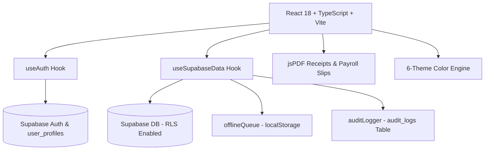

## [2026-09-03] Tampon officiel sur tous les PDF + thème clair : fin du texte blanc invisible

**Tampon sur tous les documents PDF.** Le tampon officiel du Complexe Scolaire
MAMA THERA (image fournie par l'utilisateur, public/tampon.png) est désormais
dessiné dans la zone « cachet » de TOUS les PDF générés : reçu de paiement
parent (pdfReceipt), fiche de paie employé (pdfPayroll + émission directe dans
usePayroll), bordereau de paie (pdfPayrollDraft), relevé parent (useParents),
rapports financiers/dépenses/multi-années. Nouveau module partagé
src/lib/pdfStamp.ts : fetch du PNG au moment de la génération, décodage +
redimensionnement à ≤ 420 px sur canvas (le fichier source fait 1254 px /
1,4 Mo — l'embarquer en brut gonflerait chaque PDF à ~5 Mo), data URL mise en
cache. Strictement non bloquant : si l'image est indisponible (hors-ligne,
tests), le PDF se génère quand même, seul le tampon est omis. addImage validé
contre le vrai PNG (smoke test jsPDF).

**Thème clair + OS sombre : fin du texte blanc sur blanc (cause racine des
« entêtes blanches »).** Le thème de l'app est piloté par classe
(theme-slate / theme-midnight = sombre, les autres clairs) mais Tailwind
résout par défaut les variantes dark: sur prefers-color-scheme du système.
Résultat : sur un OS en mode sombre avec un thème CLAIR sélectionné, toutes
les utilitaires dark:text-* s'activaient quand même — noms et en-têtes
blancs sur fond clair (ex. le nom du parent dans la modale « Relancer le
parent ») ; et sur OS clair + thème slate elles restaient inertes. Fix
racine : @custom-variant dark (&:where(.dark, .dark *)) dans index.css
(87 règles dark: compilées sous cette forme, plus aucune @media) + la classe
.dark est ajoutée par la coquille App uniquement quand currentTheme.isDark.
dark: suit désormais toujours le thème de l'app — toutes les
modales/en-têtes de l'app corrigées d'un coup (Login et l'écran de
chargement n'utilisent aucune variante dark:, vérifié).

Chaîne complète verte : lint 0 warning (tsc strict + guards + stylelint),
l10n ✓, 287/287 tests, build ✓.
## [2026-09-03] Alertes paie : les mois antérieurs à septembre ne comptent plus

Le calcul des mois sans paie (missedMonths, qui alimente les alertes de la
cloche « Aucun paiement de salaire enregistré pour X ») parcourait l'année
civile depuis JANVIER : janvier→août étaient donc signalés comme mois manqués
alors que l'application (et l'année scolaire) ne démarre qu'en septembre.
Le scan est désormais calé sur l'année scolaire (démarrage en septembre) et
conscient des changements d'année civile : seuls les mois de septembre→mois
courant de l'année scolaire en cours sont évalués, les mois antérieurs ne
sont jamais signalés. missedMonths passe de number[] à {year, month}[] (ids
de notification et dates d'ancrage utilisent l'année réelle de chaque mois).
2 nouveaux tests (aucun mois < septembre signalé ; contrat scolaire year-aware),
test existant mis à jour. Chaîne complète verte (287 tests).

## [2026-09-03] Notes de calendrier visibles par toute l'équipe (table calendar_notes)

Les notes ajoutées depuis le calendrier (modale du jour) étaient stockées en
localStorage (clé calendar-day-notes) — invisibles pour les autres comptes.
Elles vivent désormais dans la table Supabase public.calendar_notes
(id, note_date, text, created_by, created_at) : toute personne authentifiée
peut lire/écrire (RLS : auth.role() = 'authenticated', lecture anonyme
filtrée, insert anonyme rejeté — vérifié en production via REST). Le
localStorage ne sert plus que de cache de démarrage rapide en lecture
(fast-start) pendant la lecture DB. Nouveau module src/lib/calendarNotes.ts
(fetch/save/delete), usePayments branché dessus (fetch au montage, save avec
l'id réel retourné, delete par id), type calendar_notes ajouté à
database.types.ts. Migration 20260903000001_calendar_notes.sql appliquée à la
production. 6 nouveaux tests (mock module supabaseClient : lecture ordonnée,
échec lecture, insert avec payload, échec écriture, delete par id, échec
delete). Chaîne complète verte (286 tests).

## [2026-09-03] Profession du parent facultative dans le formulaire d'ajout

Le champ Profession du formulaire parent (AppModals.tsx) n'est plus requis :
l'astérisque et l'attribut required sont retirés — la soumission passe même si
le champ est vide (useParents.ts coerce déjà vide → 'N/A', à l'image de
l'adresse). 1 test de régression ajouté (occupation vide/espaces → parent créé
avec 'N/A', liaison des élèves inchangée). Chaîne complète verte.

## [2026-09-03] Tâches en retard en tête de liste (les plus urgentes d'abord)

Le rang des tâches en retard est inversé dans le panneau Productivité : En
retard passe tout en haut (la plus ancienne d'abord = la plus urgente), puis
Aujourd'hui, puis À venir, puis Sans date. Changement dans
src/lib/todoSort.ts (rank overdue=0, today=1, upcoming=2, undated=3 — le tri
ascendant dans chaque groupe est inchangé, donc la tâche la plus en retard
monte en premier) et dans l'ordre des sections du panneau (ProductivityPanel,
en-têtes de groupe). Tests mis à jour : nouveau contrat vérifié (overdue en
tête, puis today, puis upcoming), stabilité conservée. Chaîne complète verte.

## [2026-09-03] Fakes partagés : tests/fakes.ts (makeFakeDb unifié)

Inventaire des fakes locaux répétés entre suites : la seule vraie duplication
était le fake client Supabase ReplayDb (makeFakeDb) — une copie dans
offline-replay.test.ts (mode errorMode, enregistrait tables) et une dans
offline-sync.test.ts (failTables/throwOnFrom, enregistrait queries). Les deux
sont fusionnées dans tests/fakes.ts avec une API unifiée
({ failTables?, allFail?, throwOnFrom? } → { db, queries }) et importées par
les deux suites (28 tests inchangés). Les autres fakes sont à usage unique et
restent dans leur suite par conception : FakeFocusable/FakeContainer/
withActiveElement (focus-stack), FakeJsPDF (payroll), FakeGain
(notification-sound), fakeSupabase (team-settings) — les documenter suffit,
les extraire ajouterait de l'indirection sans réutilisation. L'en-tête de
tests/harness.ts pointe désormais vers tests/fakes.ts pour la frontière
« fakes partagés vs fakes de suite ». Chaîne complète verte.

# Complexe Scolaire MAMA THERA — Full Development & Architecture History
## [2026-09-03] En-têtes de groupe avec compteurs dans le panneau Productivité

La liste des tâches du panneau Productivité est désormais découpée en sections
avec en-têtes + compteurs, rendant le tri par date visible : Aujourd'hui
(ambre), À venir (émeraude), En retard (rose), Sans date (gris) — dans cet
ordre, cohérent avec le tri existant. Les groupes vides sont masqués ; un filet
sépare les sections suivantes. Nouveau helper pur groupTodosByDate + type
TodoGroupKey dans src/lib/todoSort.ts (mêmes buckets/ordres que
sortTodosByDate, stable, n'est pas destructif) ; clés l10n upcoming (À venir /
Upcoming) et noDate (Sans date / No date) ajoutées en+fr. 3 nouveaux tests
purs (classification des bornes, buckets + compteurs, groupes vides, non
mutant). Chaîne complète verte.


## [2026-09-03] Audit DOM-trap : les 8 suites pures ne lisent aucun global DOM

Vérification demandée exécutée : les 8 suites pures (escape-stack, focus-stack,
offline-replay, offline-sync, offline-notes, utils, excelImporter,
mainviews-props — 89 tests) ont été relancées avec un piège DOM préchargé
(.git/dom-trap.mjs) qui redéfinit document/window/localStorage/… en getters
ENREGISTREURS renvoyant undefined (sémantique exacte de Node sans globals).

Résultat : 0 lecture réelle de global DOM. Les seuls accès enregistrés (66)
sont des sondes SSR délibérées 'typeof x !== undefined' documentées :
useEscapeToClose.ts:31 (window), focusStack.ts:67/167 (window/document),
offlineQueue.ts:69/74/81 (localStorage → fallback mémoire). Note : une variante
à getters JETANTS donne des faux positifs sur ces 3 modules — typeof appelle le
getter et lève, alors que le code gère proprement l'absence du global ; la
variante enregistreuse est donc l'outil correct. xlsx (excelImporter) ne touche
aucun global DOM au chargement. Vérification reproductible : node
.git/verify-dom-trap.mjs.

This document serves as a complete history, architectural record, and technical changelog for the **Complexe Scolaire MAMA THERA Finance Suite** (Bamako, Mali). It documents every phase, feature addition, security enhancement, and design decision made during development.
## [2026-09-03] Notifications triées par date décroissante dans la cloche

Le dropdown de la cloche affiche désormais les rappels du plus récent au plus
ancien (tri par date d'ancrage : dueDate / lastNoteDate / début de mois pour la
paie). Tri stable dans NotificationsPanel via useMemo (comparaison de chaînes
YYYY-MM-DD, ordre source conservé à dates égales) — le hook useDashboard reste
inchangé. 1 test de panneau ajouté (4 rappels mélangés réordonnés). Chaîne
complète verte.

---
## [2026-09-03] Alerte de paie cliquable — ouvre l'onglet Paie/Salaires

Un rappel de paie dans la cloche de notifications (sans élève lié) ouvre désormais
directement l'onglet Paie/Salaires au clic (ou Entrée/Espace), au lieu de se
contenter de se marquer comme lu. Nouvelle prop onOpenPayroll câblée
App -> AppHeader -> NotificationsPanel (setActiveTab('payroll')); l'alerte est
toujours marquée lue et le panneau se ferme. Test du panneau mis à jour
(onOpenPayroll déclenché, aucun profil élève ouvert). Chaîne complète verte.

## 📍 School Context & Project Scope

- **Institution**: Complexe Scolaire MAMA THERA
- **Location**: Bamako, Mali (Managed remotely from the US by Ibrahim Thera)
- **Levels Served**: Enseignement Fondamental (Primary & Middle) and Lycée (High School)
- **Currency**: FCFA (XOF)
- **Primary Language**: Bilingual UI (French `fr` default, English `en`)
- **Key Domain Terminology**: **Élève / Élèves** (Primary/Secondary pupils, changed from university-level *Étudiants*)

---

## 🚀 Chronological Development History

### Phase 1: Production Readiness & Network Resilience
- **Objective**: Establish staging/production configuration templates and network retry mechanisms for unreliable internet connectivity in Bamako.
- **Deliverables**:
  - Environment templates (`.env.example`, `.env.staging`, `.env.production`).
  - Build & seed scripts (`dev:staging`, `build:production`, `seed:production`).
  - Exponential backoff network retry utility (`src/lib/networkUtils.ts`).

---

### Phase 2: Supabase Auth & RLS Database Security Lockdown
- **Objective**: Replace anonymous/hardcoded access with secure Supabase Email/Password Authentication and Row Level Security (RLS).
- **Deliverables**:
  - Migration `20260809000000_auth_and_rls.sql`: Created `public.user_profiles` table, auto-profile trigger on signup, and 33 strict RLS policies locking down tables to authenticated users.
  - `src/lib/useAuth.ts`: Custom React hook managing session state, authentication persistence, and user profiles.
  - Login UI (`App.tsx`): Bilingual login screen backed by Supabase `signInWithPassword`.

---

### Phase 3: Offline Support & Printable PDF Payment Receipts
- **Objective**: Ensure cashiers in Bamako can record transactions even during internet outages, and generate official A5 payment receipts for parents.
- **Deliverables**:
  - `src/lib/offlineQueue.ts`: `localStorage` queue manager (`mama_thera_offline_queue`).
  - `src/lib/pdfReceipt.ts`: A5 official payment receipt generator using `jspdf` featuring school letterhead, receipt serial number, student/parent details, and payment breakdown.
  - `src/components/ToastNotification.tsx`: `<OfflineBanner>` displaying pending offline items and a manual "Sync Now" button.
  - Auto-sync (`syncOfflineQueue`) triggering upon network reconnection.

---

### Phase 4: Financial Reports & Printable Staff Payslips
- **Objective**: Generate official PDF exports for monthly executive P&L statements and staff salary slips (*Bulletin de Paie*).
- **Deliverables**:
  - `src/lib/pdfPayroll.ts`: Printable A5 **Bulletin de Paie** PDF generator with earnings, deductions, net salary, and cashier signatures.
  - `src/lib/pdfFinancialReport.ts`: Executive A4 **Financial Summary Report (P&L)** with revenue, operating costs, vendor expenses, net balance, and enrollment statistics.
  - UI Triggers (`App.tsx`): Dedicated PDF export buttons in Dashboard and Staff Payroll tables.

---

### Phase 5: Tamper-Evident Audit Trail & Security Logs
- **Objective**: Admin-only audit log tracking every payment, expense, salary, and user role change with timestamps and staff identity.
- **Deliverables**:
  - Migration `20260814000000_audit_logs.sql`: Created `audit_logs` table with RLS restricting read access exclusively to `admin` role.
  - `src/lib/auditLogger.ts`: Utility function (`logAuditEvent`) inserting structured log records into Supabase.
  - Admin View (`App.tsx`): Dedicated **Journal d'Audit / Audit Trail** tab view with time-series table and color-coded action badges (`RECORD_PAYMENT`, `ADD_EXPENSE`, `UPDATE_USER_ROLE`).

---

### Phase 6: In-App User & Role Controller
- **Objective**: Allow Admins to manage staff user accounts, toggle roles (`admin` ⇄ `staff`), and send password reset emails directly within the app without using the Supabase dashboard.
- **Deliverables**:
  - `src/lib/useAuth.ts`: Added `updateUserRole(userId, newRole)` and `sendPasswordReset(email)`.
  - Admin UI (`App.tsx`): Upgraded **Settings → User Accounts** into an interactive controller with avatar badges, role toggles, and 1-click password reset triggers.

---

### Phase 7: UI Polish, Theme Engine & Localization Refinements
- **Objective**: Elevate design aesthetics, adapt local terminology, and refine user experience.
- **Deliverables**:
  - **Terminology Update**: Changed all French UI occurrences of *"Étudiant"* to *"Élève"* (suitable for fundamental and high school pupils).
  - **Custom 6-Theme Palette**:
    1. **Émeraude MAMA THERA** *(Official School Emerald #064E3B)*
    2. **Navy Exécutif** *(Corporate Navy)*
    3. **Bordeaux Académique** *(Burgundy Academic)*
    4. **Livre Crème** *(Warm Cream Ledger)*
    5. **Ardoise Sombre** *(Dark Slate)*
    6. **Cyber Minuit** *(Cyber Midnight Dark)*
  - **Timezone Integration**: Formatted timestamps explicitly with `Africa/Bamako` GMT+0 timezone tags for official records.
  - **WhatsApp & SMS Relance**: WhatsApp & SMS follow-up notice modal for parents with overdue balances.

---

## 🛠️ Complete System Architecture



---

## 📂 Key Source Code Map

| Feature / Area | Primary File(s) | Description |
|----------------|-----------------|-------------|
| **Core UI & Admin Hub** | `src/App.tsx` | Main application shell, dashboard, tabs, modals, theme engine |
| **Authentication & Users** | `src/lib/useAuth.ts` | Supabase auth state, session persistence, role updates, password resets |
| **Data & Synchronization** | `src/lib/useSupabaseData.ts` | Optimistic state management, offline queue auto-sync, database mutations |
| **Offline Storage** | `src/lib/offlineQueue.ts` | Queue storage manager for offline payments & expenses |
| **Audit Logging** | `src/lib/auditLogger.ts` | Inserts structured audit trail entries into Supabase |
| **Payment PDF Receipt** | `src/lib/pdfReceipt.ts` | Printable A5 payment receipt PDF generator |
| **Staff Payslip PDF** | `src/lib/pdfPayroll.ts` | Printable A5 Bulletin de Paie PDF generator |
| **Financial Report PDF** | `src/lib/pdfFinancialReport.ts` | Executive P&L Financial Report PDF generator |
| **Notifications & Toasts** | `src/components/ToastNotification.tsx` | Toast notification provider & offline status banner |
| **Views Props Contract** | `src/app/mainViewsProps.ts` | Single source of truth for the 186-prop `MainViewsProps` contract + helper types — imported by `App.tsx` and `MainViews.tsx`, consumed by the views through the typed context; guarded by `scripts/check-component-props.mjs` (parses this module) and `tests/mainviews-props.test.ts` (single definition, all props required, no `any`, wiring pointed here, types-only) |
| **Database Migrations** | `supabase/migrations/` | SQL schema files for profiles, audit logs, and RLS policies |

---

## 🔍 Verification & Quality Assurance

- **Typecheck (`npm run lint`)**: `tsc --noEmit` returns **0 errors** (strict + noImplicitAny).
- **Lint (`eslint .`)**: **0 errors and 0 warnings** (2026-08-31). The two `react-hooks/exhaustive-deps` warnings in `App.tsx` are fixed properly — the welcome effect destructures the stable pieces of `auth` (`profile`/`isAdmin`/`fetchAllProfiles` — the hook object itself is recreated every render) and lists them with `hasShownWelcome`/`t.welcomeBackName`; the floating-chat greeting effect keys on the queue length and the translated text itself (a language switch re-seeds only when the chat is empty, as before). The `react-refresh` warnings are gone by structure: the `useToast` hook + toast types moved to [`src/lib/useToast.ts`](src/lib/useToast.ts), the `MainViewsContext` + `useMainViews` hook moved to [`src/app/mainViewsContext.ts`](src/app/mainViewsContext.ts) (component files now only export components — this also breaks the latent import cycle views↔MainViews), and `src/main.tsx` is exempted from the rule (an entry point intentionally exports nothing). The toast timer cleanup now captures the timer map inside the effect instead of dereferencing `timerRefs.current` at cleanup time. `t` is declared right after `lang` so effects can list translated strings in their dependency arrays. Zero warnings are now **enforced**, not just achieved: the lint chain (local, pre-commit and CI) runs `eslint . --max-warnings 0`, so any single warning — even a benign one — fails the chain. Proven by a negative test: a temporary file exporting a hook + a component fails with exit 1 (`ESLint found too many warnings (maximum: 0)`).
- **Tests (`npm test`)**: 81/81 passing (formatters, excel importer, offline queue replay, offline sync drain, **escape-to-close stack** — topmost-only press, fallback after unmount, re-arm after drain; the keyboard-consistency feature: one shared `keydown` listener closes the topmost open overlay per press via [`src/lib/useEscapeToClose.ts`](src/lib/useEscapeToClose.ts), wired into all 16 AppModals overlays, the floating chat panel and the 5 standalone modal components; **focus stack** — Tab wrap-around at both ends, pull-back-in from outside, initial focus into the overlay, restore-to-trigger on close, refocus-into-next-overlay when one remains, via [`src/lib/focusStack.ts`](src/lib/focusStack.ts)), view rendering inside MainViewsContext, MainViewsProps contract).
- **Overlay audit (small screens, 2026-08-31)**: every `position: fixed` element in `src/` was inventoried (34 occurrences) and checked for viewport fit and dimming. Verdict: all 15 modal containers (the 12 conditional overlays in [`AppModals.tsx`](src/components/AppModals.tsx), plus `ConfirmDialog`, `AddUserModal`, `ExcelImportModal`) already have a full `bg-slate-900/60`-style backdrop with click-outside close, and the Productivité panel was already capped (`w-80 max-w-[88vw]` + mobile-only backdrop). Two real offenders were fixed: the **floating AI chat card** (`w-[360px]` + `right-6` clipped 24px off-screen on a 360px viewport, and its fixed 500px height could exceed short/landscape viewports) — now `max-w-[calc(100vw_-_3rem)] max-h-[calc(100dvh_-_3rem)]` plus a mobile-only dimmed backdrop with outside-click close (same pattern as every other overlay; desktop keeps the floating-widget behaviour); and the **toast container** (`maxWidth: 380px` overflowed mobile) — clamped to `min(380px, calc(100vw - 3rem))`. Everything else (banners, success pills, FAB, EnvBadge, Login, desktop-only sidebar) fits by construction. An early pass of this audit mis-flagged the 12 AppModals containers as backdrop-less because it only grepped `bg-black` — the backdrops live on a child `motion.div` using `bg-slate-900/60`; verified individually before changing anything.
- **ARIA dialog semantics on every overlay (2026-08-31)**: all 22 overlays now expose `role="dialog"` + `aria-modal="true"` + a translated `aria-label` on the same element the focus trap confines Tab to, so screen readers announce each overlay as a modal dialog with its name (student detail viewer, add/edit-Student/Staff/Parent/Vendor-Expense (dynamic label via the `editing*` flag), add class / edit class, add expense, record salary, day payment history, Productivité panel, payment entry, audit sheet, late-payment ticket, link student, follow-up notice, confirm dialog (`aria-label` = the caller's `title`), add-staff-account, Excel import wizard, monthly payroll draft, promotion wizard, floating AI chat). No behavior change: pointers, Escape and Tab behave exactly as before — the attributes only add the announced modal semantics.
- **Focus trap on every overlay (2026-08-31)**: keyboard navigation is now completed beyond Escape — [`src/lib/focusStack.ts`](src/lib/focusStack.ts) mirrors the escape stack: each open overlay registers a trap, ONE shared `keydown` handler confines Tab to the **topmost** trap with wrap-around at both ends and pull-back-in when focus sits outside (clicked the page, focus on a non-focusable spot), focus moves **into** the overlay when it opens (APG behaviour; skipped when focus is already inside, so autofocused type-to-confirm inputs keep it) and is **restored to the trigger** when it closes — or to the exact trigger when it still lives inside another open overlay, else into that overlay. Wired with `useFocusTrap` into ConfirmDialog, AddUserModal, ExcelImportModal, MonthlyPayrollDraftModal, PromotionWizardModal and the floating chat panel, and with `useOverlayTraps` (single hook, JSX-ordered indices) into the 16 AppModals overlays. 15 new unit tests drive the pure `confineTab` core and the stack lifecycle with structural fakes, DOM-stub focus bookkeeping — 0 DOM library needed, same discipline as the escape-stack tests.
- **App.tsx split into domain hooks (2026-08-31)**: `src/App.tsx` (was 3 655 lines) is down to ~3 370 — three cohesive domains extracted **verbatim** into `src/app/` hooks, App.tsx only consuming their returned API (call sites and the `MainViewsProps` wiring are byte-identical, guards 186/186 & 154/154 still green):
  - **AI chat** → [`useFloatingChat`](src/app/useFloatingChat.ts) + [`FloatingChat.tsx`](src/components/FloatingChat.tsx) (panel + FAB): both AI surfaces (Productivité AI tab + floating widget), their state, greeting re-seed effect and Escape wiring (~300 lines out); two new translation keys (`floatingChatTitle`/`floatingChatPlaceholder`) in both dictionaries for the panel header/input;
  - **Auth/welcome** → [`useAuthWelcome`](src/app/useAuthWelcome.ts): `useAuth` instance + `currentUser`/`isPromoter`/`authLoading` derivations, the first-sign-in welcome banner (message + 5 s auto-dismiss + re-arm on profile change), the admin-only user-profiles fetch, and the admin-tab guard effect — called with `{ t, activeTab, setActiveTab }` (`setActiveTab` now listed in the effect deps since it arrives as a prop);
  - **To-Do sidebar** → [`useTodoSidebar`](src/app/useTodoSidebar.ts): task-input + sidebar open flag + panel tab state, and add/toggle/delete — including the "Call Parent" completion automation through `handleSaveNote` (passed in deps) — called with `{ todos, t, handleSaveNote, addTodoItem, updateTodoItem, deleteTodoItem }`.
- **Productivité panel is resizable on desktop (2026-08-31)**: the right-hand panel used to be a hard-coded `w-80` (320px). It now has a left-edge drag handle (`hidden lg:flex`, `role="separator"`) — drag to resize (280–720px; the 88vw CSS cap stays the final guard on small windows), or focus it and use ← (widen) / → (narrow) / Home / End; double-click resets to 320px. The chosen width persists per browser via `localStorage` (guarded fallbacks for SSR/test runners). Collapse is unchanged: the X button, Échap and the sidebar's Productivité toggle all close it; the slide-in/out animation now tracks the actual width instead of the old 320px offset. Local UI state inside `AppModals` — the `MainViewsProps` contract and its wiring guard are untouched.
- **Pre-commit hooks**: husky runs `npm run lint && npm test && node scripts/check-audit.mjs` before every commit — the same audit gate as CI guards locally. Two hook-only conveniences (via `AUDIT_CACHE=1 AUDIT_SOFT_OFFLINE=1`): the result is **cached** in `node_modules/.cache/audit-gate.json`, keyed on the package-lock hash (24h TTL, `AUDIT_CACHE_REFRESH=1` forces a live re-audit), so commits that don't touch dependencies re-audit instantly; and an **unreachable registry** (offline development) only warns instead of blocking — the CI push gate stays the enforcement point. `git commit --no-verify` skips everything in an emergency.
- **Production Build (`npm run build`)**: Vite production bundle builds successfully in `dist/`.
- **Local Dev Server**: Runs on `http://localhost:3000/`.

---

## 🔒 Dependency Security Status (npm audit)

*Last review: 2026-08-31. `npm audit` reports **0 vulnerabilities**. The previous 29 (2 low, 7 moderate, 19 high, 1 critical) were all **dev-only pins inside the Vercel CLI** dependency tree (`tar`, `undici`, `js-yaml`, `minimatch`, `smol-toml`, `path-to-regexp`, `ajv`, `@tootallnate/once`, `esbuild`). Rather than `overrides`, the deployment CLI was **removed from the root project** — it now lives in the isolated [`tools/`](tools/package.json) manifest (own lockfile) and deploys run through GitHub Actions — which eliminated the whole tree (≈264 packages) from the root lock at the source.*

- **How it was fixed**: `vercel` was a devDependency used only to deploy. It (and all its `@vercel/*` transitive pins) is gone from the root `package.json` + lockfile; it is now pinned in [`tools/package.json`](tools/package.json) (own lockfile, ≈289 packages), consumed only by the deploy workflow. [`.github/workflows/deploy.yml`](.github/workflows/deploy.yml) runs `npm ci --prefix tools` and deploys on every push to `main` **with that reviewed pin** — a broken CLI release reaches production only after its Dependabot PR merges. `npm run deploy:prod` is now a notice pointing to CI (`scripts/deploy-notice.mjs`). `esbuild` is declared explicitly in devDependencies because `tsx` (the test runner)'s esbuild copy had to be restored after removing the vercel override — it is clean (`0.28.2`).
- **Dependabot** ([`.github/dependabot.yml`](.github/dependabot.yml)): daily `npm` checks on the root manifest and on `/tools` (a new `vercel` release opens a reviewed PR that becomes the deployed CLI version), weekly `github-actions`. Commit messages follow the repo's conventional style (`chore(deps)`, `chore(deps-dev)`, `chore(deploy)`, `chore(ci)`). Dependabot **cannot** watch the `xlsx` CDN tarball — that one is manual. The `/tools` pins are deploy-CLI-only: they live in CI, are never bundled into the app, and are deliberately **not** part of the root audit gate (the CLI's known `@vercel/*` pins remain dev-only upstream — vercel/vercel#11543 — which is why the CLI stays out of the root lock).
- **What the workflow needs** (repository secrets — `Settings ▸ Secrets and variables ▸ Actions`): `VERCEL_TOKEN` (access token), `VERCEL_ORG_ID` (`team_…`), `VERCEL_PROJECT_ID` (`prj_…`). For this project: org `team_CfIwAlGjbuOf3EItm2mDUK4n`, project `prj_Jwn5tMXCwQ6a2V3t5nFQjt8OSMPi`. Production env (`VITE_SUPABASE_URL`/`VITE_SUPABASE_ANON_KEY`) stays in the Vercel dashboard and is pulled by `vercel pull`.
- **`vercel.json`**: now pins `framework`/`buildCommand`/`outputDirectory` (Vite → `dist`) so the isolated CLI build is deterministic and doesn't depend on dashboard settings (the SPA rewrite is unchanged).
- **To deploy locally** nothing is needed — push to `main`:
  ```bash
  git push origin main
  ```
  and watch the "Deploy (Vercel)" workflow. `npm run lint`, `npm test`, `npm run build` and the audit gate all run in CI before `vercel deploy --prebuilt --prod`.
- **To use the CLI locally** (e.g. `vercel dev`): `cd tools && npm ci && npx vercel …` — the root project stays clean. Re-adding `vercel` to the root devDependencies would re-introduce its dev-only pins, so only do that deliberately.
- **Risk assessment**: all removed packages were deployment-CLI-only and never bundled into the production app (verified in `dist/`). The only runtime dependency with advisories, `xlsx`, is already the SheetJS CDN build `0.20.3`.
- **Install scripts**: npm 11's `allowScripts` policy is configured in `package.json` with `esbuild`/`core-js` approved by package name.
- **CI gates**: a single quality workflow, [`.github/workflows/perf-guard.yml`](.github/workflows/perf-guard.yml) (it absorbed the former `security-audit.yml`), runs on every push to `main` with three parallel jobs — `quality` (explicit **ESLint zero-warning gate** — `eslint . --max-warnings 0` — then no-explicit-any + banned ts-comments + tsc strict + props wiring + [`scripts/check-forbidden-any.mjs`](scripts/check-forbidden-any.mjs) blocking every `as any`/`@ts-ignore`/`@ts-expect-error`/`@ts-nocheck` in `src/`, then the tests, then `scripts/check-audit.mjs` in strict mode — fails on any production vuln and on any total **above 0**) and `lighthouse` (Lighthouse), and `tools-audit` (**warning-only**, see below) — alongside `deploy.yml` and the weekly `vercel-pins-watch` (see below). The same `check-audit.mjs` also guards the pre-commit hook locally (cached + offline-tolerant, see above), so a vulnerability introduced by an install is caught at commit time, before it can be pushed.
- **Verified on GitHub (2026-08-31)**: the quality/audit gate was checked against the real runners via the public API (not just locally). On `f0db212`, run [33407449986](https://github.com/ibrahimkalilthera/-MAMA/actions/runs/33407449986) completed **success**: job `Lint + tests + audit` passed every step — checkout → setup-node → `npm ci` → lint → tests → **Audit gate (production clean + total within baseline 0)** — in ~35 s; job `lighthouse` passed in ~61 s. All 8 most recent pushes are green (`quality` workflow: 33 runs total). `npm ci` sync between `package.json` and `package-lock.json` is proven by the runner's install step itself.
- **Deploys are gated on quality (no broken push can reach production)**: [`deploy.yml`](.github/workflows/deploy.yml) no longer triggers on `push` — it triggers via **`workflow_run`** when `perf-guard.yml` **completes successfully on `main`**, and deploys **exactly the commit that quality validated** (`head_sha` checkout). Its first step is a gate: if the quality workflow did not succeed, the deploy job exits neutral (78 — shown grey, not red) and nothing reaches Vercel. The redundant lint/tests steps were removed from the deploy job (quality already covers them); it only needs `npm ci` for `vercel build`. Manual deploys stay possible via `workflow_dispatch` (deploys current main — explicit human action). Trade-off, by design: if the quality workflow itself cannot run (Actions outage), deploys stop too.
- **Tools audit job (warning-only, 2026-08-31)**: [`scripts/report-tools-audit.mjs`](scripts/report-tools-audit.mjs) audits the `tools/` lockfile on every push (no install needed) and reports the isolated CLI's dev-only pins via a `::warning` annotation + step summary. It can **never** fail the run (always exits 0, plus `continue-on-error` on the job) because `deploy.yml` is triggered by this workflow's success — a red tools audit there would silently stop deploys. The strict root gate stays at 0; the deeper weekly follow-up stays with `vercel-pins-watch`.
- **Vercel pins watch (weekly, 2026-08-31)**: [`.github/workflows/vercel-pins-watch.yml`](.github/workflows/vercel-pins-watch.yml) (Mondays 06:00 UTC, plus manual dispatch and a paths-filtered push run) audits the current `tools/` tree from its lockfile (no install needed) and probes the latest vercel release the same way (`npm install --package-lock-only` — metadata only, nothing executed; latest read via `npm view`, which honours proxy settings unlike bare `fetch`). Dependabot opens the bump PR when a new CLI ships but cannot tell whether the *new tree is clean*; this watch can — when the latest tree audits **0**, it opens a single tracking issue (label `vercel-pins`) refreshed weekly with live counts and the linked Dependabot PR(s), and auto-closes it once `tools/` audits **0** after the bump merges. A still-vulnerable upstream never turns the run red — it is a tracker, not a gate ([`scripts/check-vercel-pins.mjs`](scripts/check-vercel-pins.mjs); local dry-run without `GITHUB_TOKEN`, and `PROBE_VERSION=x.y.z` exercises the probe path directly).
- **Vercel git integration neutralized (single source of prod = Actions, 2026-08-31)**: the GitHub `deployments` endpoint showed the **native Vercel git integration was also auto-deploying on every push to main** — creating `vercel[bot]` deployments on **two** projects (`Production – mama-thera-finance` **and** `Production – mama-thera-staging`, the latter never touched by any workflow), duplicating the Actions `deploy.yml` on production. [`vercel.json`](vercel.json) now sets `git.deploymentEnabled: false`, which disables **all git-triggered automatic deployments** on every project that reads this config (finance and staging alike) without affecting the explicit CLI/API deployment that `deploy.yml` performs (`vercel deploy --prebuilt --prod`). Verified after push: the neutralized commit shows **no new `Vercel – mama-thera-staging` status/deployment**. The GitHub-app connection itself stays installed (harmless once `deploymentEnabled` is false); it can be disconnected dashboard-side (Vercel → Settings → Git) for a fully clean state.
- **Deploy verified end-to-end (2026-08-31)**: the secrets were added and the full chain was confirmed on the real runners — quality succeeded on `6c198be` (run #33409792988), then deploy ran via `workflow_run` and succeeded in ~36 s (run #33409897850: Gate → checkout `head_sha` → deps → tools → `vercel pull` → `vercel build` → `vercel deploy --prebuilt --prod`), so production now ships exactly what quality validated. Triggers, for reference: `perf-guard` fires on `push` to `main` (concurrency group `quality-*`, cancel-in-progress); `deploy` fires on quality-completion (and manual `workflow_dispatch`, concurrency `deploy-*`, no cancel).

- **Parents domain extracted into a hook (2026-09-01)**: the parent directory, link-student, notify/reminder and ledger-PDF logic moved out of App.tsx into `src/app/useParents.ts` — states (directory, edit form, link modal, notify modal), `handleParentSubmit`/`handleLinkStudentSubmit`/`handleUnlinkStudent`/`handleDeleteParent`/`openEditParentModal`, the relational helpers (`getChildrenForParent`, `getParentOutstandingBalance`, `getParentPaymentHistory`), the WhatsApp/SMS/copy notify actions and `handleExportParentLedgerPdf`. App.tsx: 3 248 → 2 802 lines. `confirmAction` deliberately **stays in App.tsx** (it backs the global ConfirmDialog shared by several delete flows) and is injected as a dependency along with `setWelcomeMessage`, `formatCurrency` and the Supabase mutators — so the call site sits after those declarations, andthe props wiring to MainViews/AppModals is unchanged (guards still 186/186 & 154/154).

- **Productivité panel extracted into a component (2026-09-01)**: the To-Do/AI right-hand sidebar moved out of AppModals.tsx (3 371 → 3 160 lines) into `src/components/ProductivityPanel.tsx` with its own fully-typed `ProductivityPanelProps` (TranslationDict, Todo[], ChatMessage[], setters, handlers, theme tokens — zero any). The panel **self-manages its focus trap and Escape** (same pattern as FloatingChat) via `useFocusTrap`/`useEscapeToClose`, so the `showTodoSidebar` entry was removed from AppModals' `openOverlays` escape list **and** the corresponding overlayRoots index was dropped — the remaining 15 entries were renumbered 10-15 → 9-14 to keep the `useOverlayTraps` index pairing aligned with the JSX refs. The desktop resize logic (drag handle, arrow keys, double-click reset, localStorage persistence) moved with it.

- **Explicit `initialFocus` in the focus stack (2026-09-01)**: `pushFocusTrap` and `useFocusTrap` now accept an optional `InitialFocus` — a CSS selector or a `(container) => element` resolver — that declares where focus lands on open instead of the blind "first focusable" rule. `MonthlyPayrollDraftModal` (whose first focusable is the month `<select>`, not the ✕) targets `'select'` and `ConfirmDialog` (type-to-confirm mode) targets `'input[type="text"]'` via resolver, falling back to the ✕ when absent. Missing/throwing targets degrade gracefully to the old behaviour (4 new unit tests in `tests/focus-stack.test.ts`, 19/19).

- **`aria-labelledby` on all 22 overlays (2026-09-01)**: every dialog keeps its translated `aria-label` and now **also** points `aria-labelledby` at its visible title element, so screen readers announce the exact on-screen heading (the label wins over `aria-label` when it resolves, per APG). Each visible title carries a stable id (`modal-title-*` / `panel-title-*`): student details (the student's name), add/edit student/staff/vendor-expense/parent (dynamic via the `editing*` flag), add class, edit class, add expense, record salary (points at `recordSalaryPayment` — the visible heading), payment history (announces the actual day/date), payment entry, audit sheet, late-payment ticket, link student, reminder, add-staff-account, confirm, Excel import, promotion wizard, monthly payroll draft, floating AI chat and the Productivité panel (announces the active tab: To-Do list or AI assistant). Verified 1:1 in src/ — 22 `aria-labelledby` references ↔ 22 title ids.

- **Payments/students domain extracted into a hook (2026-09-01)**: the payment-entry domain left App.tsx (2 801 → 2 724 lines) for `src/app/usePayments.ts` — payment form state (`showPaymentForm`, `paymentStudentId`/`paymentAmount`/`paymentDate`), the day-payment-history modal state (`selectedCalendarDay`), `handlePaymentSubmit` with the auto-generated PDF receipt (lock check, optimistic Supabase write via `addPayment`, `generatePaymentReceiptPdf` with the fresh `amountPaid`, form reset) and the calendar event derivation `getEventsForDay` that feeds the day modal. The hook receives its data deps as arguments (students/staff/expenses/selectedYear/lockedYears/currentUser/`addPayment`) — call site sits after those declarations, exactly like `useParents` — and returns the same names App already passed down, so the MainViews/AppModals props contracts are untouched (guards still 186/186 & 154/154). `generatePaymentReceiptPdf` stays a lib import in App.tsx too (it is still a passthrough prop for AppModals' receipt buttons).

- **Payroll/staff domain extracted into a hook (2026-09-01)**: the staff & payroll domain left App.tsx (2 724 → 2 632 lines) for `src/app/usePayroll.ts` — staff form (`staffForm`, `editingStaff`, modal open/close), salary form (`salaryForm`, `showSalaryModal`), payroll draft modal state (month/year), `staffSearchTerm`/`visibleBankDetails`, the `filteredStaff` memo, `handleStaffSubmit` (lock check, add/edit via `addStaff`/`updateStaff`, toast), `handleSalarySubmit` (lock check, `addSalaryPayment` with academic year, toast), `openEditStaffModal` (form pre-fill) and the monthly payroll Excel export (`handleExportMonthlyPayrollExcel`, bordereau paie). Deps injected: staff/salaryPayments/`showToast`/selectedYear/lockedYears + the three mutators with exact signatures. `deleteStaff` and `generateStaffPayslipPdf` stay passthroughs in App.tsx; `payrollWindowStatus`/`missedMonths` stay put (dashboard view derivations, out of the requested domain). Props contracts untouched (guards still 186/186 & 154/154).

- **handleParentSubmit creation-mode unit tests (2026-09-01)**: `tests/parents-submit.test.tsx` (happy-dom, real hook, spy mutators) locks the creation path of `handleParentSubmit` (6 cases): full success (addParent once with trimmed/normalised data, every selected student linked with the created parent id, fiche view opens, no warning), partial failure on the 2nd link (loop keeps going until the failing one, exact `Parent créé, mais seulement 1/2 élève(s) lié(s).` warning), failure on the 1st link (loop breaks, `0/2` warning, modal closes — no fiche view), creation failure (addParent null → early return, nothing linked, form untouched), no students selected (modal closes + form resets) and empty fullName (no mutator call at all). The harness reads the hook API through a live ref — a snapshot taken before an `act` closes over stale state.

- **Notifications panel extracted into a component (2026-09-01)**: the due/note reminder cards left App.tsx (1 242 → 1 225 lines) for `src/components/NotificationsPanel.tsx` — typed props (`notifications: DashboardNotification[]` from useDashboard, `onOpenStudent: (studentId) => void` bundled callback; the find-student + `setSelectedStudent` lookup stays in App). `motion` trimmed from App's `motion/react` import (`AnimatePresence` remains, still used by the AddUserModal gate). `Bell` stays in App's icon import — it is still part of the MainViews/AppModals props contract. Guards still 186/186 & 154/154.

- **handleCloseCurrentYear unit tests (2026-09-01)**: `tests/year-ops.test.tsx` (happy-dom, real `useYearOps` hook, spy mutators/setters, stubbed `alert`) locks the year-closure flow in 5 cases: non-admin/dev role → alert + zero side effects; already-locked year → alert + zero side effects; success — positive balances carried over **grouped by student name** (two same-name students accumulate into one next-year `addStudent` with the opening-balance note), zero-balance students skipped, year locked (`setLockedYears`), next year appended to the year list (idempotent), audit modal opened and toast fired; existing next-year student → `updateStudent` with `totalDue` increased + carry-over note; mutation failure (`addStudent` → null) → alert + lock/audit/toast effects skipped. Two gotchas fixed on the way: the alert stub must push into the spies array (not a local one), and the failure case must return `null` — the hook checks `r !== null`, so a `false` spy result would have resolved as success. Fixtures typed against the real `User` (`{ username, role, name? }` — no id/fullName/email).

- **JSX shell split into layout components (2026-09-01)**: the render shell of App.tsx (1 624 → 1 242 lines) was split into five typed layout components — `AppLoadingScreen` (the auth/Supabase spinner, reused twice with different titles), `Sidebar` (logo, tab nav with payroll badges + admin/dev tabs, productivity toggle, sign-out, quick actions, language toggle — actions bundled as `onSignOut`/`onToggleLanguage`/`onAddStudent`/`onRecordPayment` callbacks, tab union typed as exported `AppTab`), `AppHeader` (tab title + date, year selector, contextual action bar — the PDF/print dispatch and heavy data arrays bundled into `onPrintReport`/`onFinancialReportPdf`/`onExportLate`/`onPromoteClass`/`onImportExcel`/`onOpenMonthlyDraft`/`onAddStudent` callbacks, so the component needs no data arrays), `WelcomeBanner` (role-based greeting with the mamadou/fanta special cases) and `LockedYearBanner` (read-only banner, `show` prop). The two inline « add student » reset blocks (sidebar + header) were deduplicated into one `openAddStudentModal` helper in App. New components import their own lucide icons; App's icon import left untouched (unused named imports are not flagged). Guards still 186/186 & 154/154.

- **Year state lifted into a context + year operations hook (2026-09-01)**: `selectedYear`/`lockedYears` left App-local state for a **`YearContext`** — `src/app/yearContext.ts` (context + `useYear` hook, non-component file per `react-refresh/only-export-components`, mirroring the `mainViewsContext` split) and `src/app/YearProvider.tsx` (the provider, mounted in `src/main.tsx` around `<App/>`). App reads the context and still passes the values down as hook deps/props, so the six consuming domain hooks keep their deps-args interface and stay unit-testable without a provider. `handleCloseCurrentYear` + `getYearStats` moved to `src/app/useYearOps.ts` (deps injected: t/currentUser/students/expenses/vendorExpenses/salaryPayments + the mutators + the year state/setters). App.tsx 1 731 → 1 624 lines. New `tests/year-context.test.tsx` (happy-dom, 2 cases) locks the contract: `useYear` throws outside a provider and the provider exposes working setters (the initial version hit the fast-refresh warning — the context/hook and the provider were split into two files, same convention as MainViews). Guards still 186/186 & 154/154.

- **Users/settings domain extracted into a hook (2026-09-01)**: the user-management domain left App.tsx (1 747 → 1 731 lines) for `src/app/useUsers.ts` — the add-user modal flag (`showAddUserModal`), the list search/role filter (`userSearchTerm`, `userRoleFilter` typed as exported `UserRoleFilter`), the in-flight update id (`updatingUserId`) and the three handlers (`handleUpdateRole` with optimistic profile update + localized toast, `handleToggleRole` admin⇄staff, `handleSendPasswordReset`). Deps injected: `auth` as `Pick<AuthState, 'updateUserRole' | 'sendPasswordReset'>` (exact signatures from useAuth), `userProfiles`/`setUserProfiles` (from useAuthWelcome) and the toast API — the call site sits right after the useAuthWelcome block where all deps are declared. Props contracts untouched (guards still 186/186 & 154/154).

- **Expenses/vendors domain extracted into a hook (2026-09-01)**: the expense & vendor-expense domain left App.tsx (1 883 → 1 747 lines) for `src/app/useExpenses.ts` — modal open flags (`showExpenseModal`/`showVendorExpenseModal`/`vendorExpensesTab`), the list filters (`generalExpenseCategoryFilter`/`generalExpenseSearch`/`vendorSearch`/`vendorCategoryFilter`/`vendorStatusFilter`), the calendar state (`calendarDate`/`showCalendarModal` + the month/day helpers `getDaysInMonth`/`changeMonth`/`getMonthName`/`getDayName`, which now import `getCalendarDays`/`getMonthNameImpl`/`getDayNameImpl` directly from the libs), the forms (`expenseForm` + exported `ExpenseForm`, `vendorExpenseForm` typed against the existing `VendorExpenseForm`, `editingVendorExpense`), `ticketStudent`, the localized `expenseCategoryList` memo and the four handlers (`handleExpenseSubmit` with lock/amount checks, `handleVendorExpenseSubmit` with promoter gate + social-case aid fields, `handleEditVendorExpense` pre-fill, `handleDeleteVendorExpense` with the role check — hence `currentUser` in deps). `generalExpenseCategoryFilter`/`generalExpenseSearch` were declared-but-unused in App (dead states) and moved along. Imports trimmed in App (`getCalendarDays`, `getMonthNameImpl`, `getDayNameImpl` aliases no longer needed). Props contracts untouched (guards still 186/186 & 154/154).

- **Students domain extracted into a hook (2026-09-01)**: the student list & profile domain left App.tsx (2 062 → 1 883 lines) for `src/app/useStudents.ts` — search/sort/filter state (`searchTerm`, `studentSortKey`/`studentSortOrder`, `studentGradeFilter`, `handleSort`, the `filteredStudents` memo), the add/edit modal state (`studentForm` typed against the existing `StudentForm`, `editingStudent`, `showStudentModal`, `selectedStudent`, `studentDetailTab`), the A4 file printout (`printStudentFile` + its trigger effect) and the four handlers (`handleStudentSubmit` with lock/email/amount validation, `openEditModal` pre-fill, `handleSaveNote`, `toggleFlag`). Two cross-cutting couplings handled: (1) `showToast` (defined at ~829, after `useTodoSidebar` which consumes `handleSaveNote` at ~823) was **moved up** next to `setShowSuccessToast` so the hook can take it as a dep and still be called before `useTodoSidebar`; (2) `autoSelectGrade` in the `useClasses` call still writes into `studentForm` via the returned `setStudentForm`. The two inline JSX « add student » buttons (sidebar + header) keep their full-form reset inline, now driven by the returned setters. `useEffect` import dropped from App (the only remaining effect moved with the hook); the real `addStudent` signature (`Omit<Student, 'id' | 'payments'>`) was copied exactly after a first tsc catch. Props contracts untouched (guards still 186/186 & 154/154).

- **Theme/branding domain extracted into a hook (2026-09-01)**: the school theme & branding left App.tsx (2 218 → 2 062 lines) for `src/app/useTheme.ts` — `theme`/`schoolLogo`/`logoColor` states, `logoInputRef`, the three localStorage effects (theme load with the legacy `midnight`→`slate` / `modern`→`cream` migrations, theme save, logo+color save), the `currentTheme` token map (typed against the existing `CurrentTheme` interface) and `handleLogoUpload` (base64 save + dominant-color extraction). Fully self-contained (no external deps, `useTheme()` takes nothing); the hook call sits where the states were, all consumers (`currentTheme.bg`, `setTheme`/`theme` props, logo props) wired through the returned API. The print-trigger effect (owned by the students list) stayed in App. Imports cleaned: `useRef`/`ChangeEvent` and the `ThemeId` type import dropped from App.tsx (they now live in the hook). Props contracts untouched (guards still 186/186 & 154/154).

- **Exports domain extracted into a hook (2026-09-01)**: the three local export/print handlers left App.tsx (2 290 → 2 219 lines) for `src/app/useExports.ts` — `handleExport` (late-payments XLSX report), `handleExportAllData` (full school-data backup workbook: Students/Staff/Expenses/Salary Payments sheets + toast) and `handlePrint` (`window.print()`). Deps injected (`t`, `lateStudents` from useDashboard, students/staff/expenses/salaryPayments, `showToast`); the call site sits right after `showToast`'s definition (its required dep, declared at runtime order ~995). The other export entry points (parent-ledger PDF from `useParents`, monthly payroll bordereau from `usePayroll`, payment receipt PDF from the lib) stay passthroughs — they already live in their own hooks. Props contracts untouched (guards still 186/186 & 154/154).

- **Dashboard/stats domain extracted into a hook (2026-09-01)**: the seven derived memos that feed the dashboard KPIs, the charts and the payroll alerts left App.tsx (2 529 → 2 290 lines) for `src/app/useDashboard.ts` — `stats` (DashboardStats: outstanding, collected/prev-month, late parents, fees, expenses, arrears, enrolled), `notifications` (due/note reminders), `lateStudents`, `chartData` (12-month income/expenses), `pieData` (paid/outstanding), `missedMonths` and `payrollWindowStatus` (PayrollWindowStatus). Pure derivation, no state: all deps injected (`t`, `today`, `currentMonth`, `selectedYear`, students/staff/expenses/vendorExpenses/salaryPayments) and the return types are the exact `DashboardStats`/`PayrollWindowStatus` interfaces from mainViewsProps plus an exported `DashboardNotification` — the guards (186/186 & 154/154) verify the wiring unchanged. `filteredStudents` (students-list filter/sort) intentionally stays in App.tsx (list-view state, not dashboard derivation); `stats` is still consumed by `useFloatingChat` (call site placed after this hook). The surgery hit one anchor trap: `missedMonths` and `payrollWindowStatus` share the same dependency array closing line, so the first match left `payrollWindowStatus`'s closing orphaned — caught by lint/build, fixed by removing the stray line.

- **Classes/sections domain extracted into a hook (2026-09-01)**: the class-management domain left App.tsx (2 632 → 2 530 lines) for `src/app/useClasses.ts` — the merged class list memo (`availableClasses` = `DEFAULT_SCHOOL_CLASSES` + Supabase `custom_classes` deduped by id), the add/edit modal state (`showAddClassModal`/`newClassForm`/`showEditClassModal`/`editingClassRowId`/`editClassForm`) and the four handlers (`handleCreateClassSubmit`, `openEditClass`, `handleEditClassSubmit`, `handleDeleteClass`): code-collision detection, toast feedback, auto-selection of the new class in the student form (via an injected `autoSelectGrade` callback that resolves to `setStudentForm` in App), and the shared confirm dialog for deletion (injected `setConfirmAction`). Deps injected as arguments (customClasses/toast/setConfirmAction + the three `custom_classes` mutators with exact signatures); the call site sits after the `usePayroll` block (all deps declared above it). Props contracts untouched (guards still 186/186 & 154/154); `getGradeDisplay` stays in App (display helper, consumes the returned `availableClasses`). Unused imports dropped (`buildClassCode`, `DEFAULT_SCHOOL_CLASSES`, `ManagedClass`).

- **Student/class edit overlays extracted into typed components (2026-09-01)**: the three edit overlays left AppModals.tsx (3 371 → 2 724 lines) for `src/components/StudentFormModal.tsx` (add/edit student, ~350 lines), `AddClassModal.tsx` and `EditClassModal.tsx` (~170 lines each) — same treatment as the Productivité panel and the floating chat: fully typed props (TranslationDict, form state + setters, handler signatures, `ManagedClass[]`/`academicYears`/`isPromoter`, theme tokens as discrete props), **self-managed focus trap + Escape** (`useFocusTrap(open, () => rootRef.current)` + `useEscapeToClose(open, onClose)`), the form types moved with them (`StudentForm` now exported by StudentFormModal, `ClassForm` by AddClassModal — AppModals re-imports them type-only) and the ARIA dialog semantics + `aria-labelledby` preserved. AppModals keeps the three `AnimatePresence` mount gates (exit animations need the parent) and passes `open` so trap/escape deactivate during the exit. The three overlays' entries were removed from the `openOverlays` escape list **and** their `overlayRoots` indices dropped — the remaining 12 refs were renumbered 4-14 → 1-11 (single-pass regex, no index collisions) so the `useOverlayTraps` pairing stays aligned. `setConfirmDeleteStudent` (AppModals-local confirm state) flows back in as `onDeleteRequest`; icon imports all still used (checked). Props contracts untouched (guards still 186/186 & 154/154).

- **msys fork-panic recovery procedure (2026-09-01)**: this machine's Git Bash (msys) periodically enters a state where **every** external command fails — `fork: Resource temporarily unavailable` (exit 254 for multi-command lines, exit 66 even for `node -e "console.log('ok')"`, occasionally `uv_spawn: EUNKNOWN`). Empirically the trigger is an orphaned `node.exe` left by a long test/poll run killed by a hard timeout: the fork table/memory stays held, and msys can no longer fork anything, bash included. Recovery: (1) probe with `node -e "console.log('ok')"` — a green probe means work can resume; (2) the reliable unblock is killing the orphaned `node.exe` processes in Task Manager (or a reboot) — Freebuff restarts alone do NOT free the OS-held resources; (3) after the probe goes green, `git status --porcelain` must match the pre-panic state exactly — the panic never touches working-tree content, so nothing is lost; (4) resume exactly where the turn stopped. Prevention used ever since: long happy-dom test runs go through a watchdog that hard-kills the child (`SIGKILL` + `taskkill /T`) instead of leaving the timeout's kill to wedge the machine; CI polls are one-shot with short timeouts. Related structural workaround (same root cause): husky pre-commit/pre-push die of the fork bug — the hook content (lint + tests) is executed directly, then `git -c core.hooksPath= commit/push`; the quality workflow re-verifies everything on push, and deploys are gated on it, so a hooks-neutralized push remains safe. The scratch diagnostic scripts that lived in `.git/` (probes, surgery scripts, watchdog, CI one-shots) were removed on 2026-09-01 — they were never versioned; the documented procedure + `npm run lint`/`npm test` cover the same ground.

- **Productivité panel white-on-white text fixed (2026-09-01)**: the panel's ASSISTANT IA tab rendered the greeting bubble and the four quick-question buttons as **white text on white** — the "Sidebar High-Contrast Text Protection" block in `src/index.css` targeted the bare `aside` tag (`aside, aside p, aside span, aside button … { color:#FFFFFF !important }`), and the Productivité panel is a `<motion.aside>` too, so the `!important` white crushed every themed `text-slate-700`/`text-blue-600` inside it (verified live: computed color `rgb(255,255,255)` on the quick-question buttons despite the class). Fix: the real nav rail (Sidebar.tsx) got a dedicated **`app-sidebar`** class and all twelve `aside*` selectors were re-scoped to `.app-sidebar` (incl. the `.theme-cream` variants and the `text-white/N` opacity helpers). Verified in the running app (dev server + real login): bubble paragraph and all four quick questions now compute `oklch(0.372 …)` (slate-700) on light backgrounds, active tab `blue-600`, and the nav rail keeps its forced white text. Full chain green (lint 0/0, 101/101 tests, build ✓).

- **MainViews/AppModals props grouped into one typed object (2026-09-01)**: the ~340 lines of inline `name={name}` props at the two render sites in App.tsx are now a **single `viewsProps` object literal** typed `MainViewsProps & AppModalsProps` (278 keys: 186 + 154 − 62 shared, all pure shorthand since every prop was an identity mapping) placed right before `return (`, and both `<MainViews>`/`<AppModals>` receive it via `{...viewsProps}`. App.tsx 1 225 → 1 171 lines. The intersection type keeps both contracts honest at compile time (tsc fails if a key is missing or mistyped — this is the extra safety that used to come from the guard's per-prop scan), and `scripts/check-component-props.mjs` was upgraded to **resolve object-literal spreads**: it locates the `const viewsProps = { … }` literal in the render file and verifies its keys against each interface (still 186/186 & 154/154); the `extra` check is skipped when the site uses a spread because a shared object deliberately carries both shell contracts and tsc already checks the literal. The surgery script initially failed to delete the old prop blocks — a regex written through the JSON tool call ended up double-escaped (`/^\s*\/>/` matching literal backslashes), so the while-loop never advanced and the spreads were inserted on top of the old blocks; fixed with a string-based `.trim().startsWith('/>')` scan, and the structure was verified (2 spreads, object 278/278 keys, clean `</Suspense>` closes, the 41 remaining identity-looking props belong to other components).

### 2026-09-01 — Test usePayments (8 cas)

- **File**: `tests/payments.test.tsx` (~390 lines, happy-dom, renders the **real** `usePayments` hook through a probe component with spy mutators and a stubbed `alert`), registered **before** the hook import via `mock.module('../src/lib/pdfReceipt', …)` (Node ≥ 22.6 `--experimental-test-module-mocks`, added to the `test` script in `package.json`) so the jsPDF receipt generator runs as a recorded spy (`pdfCalls`). The 8 cases: a locked academic year blocks the payment with a localized alert and **zero** mutator/receipt calls; a submit without student or amount returns silently; success records the payment with the **parsed numeric** amount, the payment date and the student's own academic year (falling back to `selectedYear` when absent) while `addPayment` receives an `Omit<Payment,'receiptNumber'>` payload and the receipt mock receives the **up-to-date balance**; a throwing receipt mock is **non-blocking** (form still resets); an unknown student id records without a receipt; the calendar (`getEventsForDay`) groups due students, salary payments on the 25th and same-day expenses, and returns no events on empty days. Two classic harness bugs caught and fixed en route: the `alert` stub must push into the spies array (a local array stays empty after the hook's synchronous alert), and the PDF-call counter must reset between tests (module-scoped array otherwise accumulates).
- **Typing notes**: the mock registration passes `namedExports` (the option name in the project's `MockModuleOptions` — the LOCAL Node runtime deprecates it in favor of `exports`, but CI runs Node 22 where `namedExports` is the current API, and `tsc` requires it); the hook's deps are typed with `Parameters<typeof usePayments>[0]` (not `ConstructorParameters` — it is a plain function) for all 5 type errors. Full chain green: lint 0/0 (tsc strict + guards + forbidden-any), l10n ✓, **109/109 tests**, build ✓.

### 2026-09-02 — Rôle Gestionnaire Principal (`general_manager`)

- **Nouveau rôle système**, distinct d'`admin`/`dev` : le Gestionnaire Principal a l'administration **financière** complète (dépenses fournisseurs créer/supprimer, bourses, import Excel, écritures staff & salaires) mais PAS la gestion des utilisateurs, Settings, Journal d'audit ni la clôture d'année (réservés à admin/dev).
- **Base de données** (`supabase/migrations/20260902000000_general_manager_role.sql`, appliquée en prod via `pg`) : contrainte `user_profiles_role_check` élargie à `('admin','staff','dev','general_manager')`, helper `is_finance_admin()` (admin/dev/general_manager) et politiques `staff`/`salary_payments` INSERT/UPDATE/DELETE re-scopées de `is_admin()` vers `is_finance_admin()`.
- **Code** : `AppRole` (`lib/useAuth.ts`) devient la source de vérité, propagé dans `User` (types.ts), `UserProfile`, `RoleFilter`, `RoleTab`, `handleUpdateRole`, `createStaffUser` ; dérivation `isGeneralManager` dans `useAuthWelcome` et prop ajoutée aux contrats `MainViewsProps`/`AppModalsProps` + fixtures de test.
- **Portes mises à jour** : `useExpenses` (`isFinanceAdmin` = promoter|GM pour créer/supprimer fournisseur), `useStudents`/`StudentFormModal` (`canEditScholarship`), `AppHeader` (import Excel), `ExpensesView` (boutons fournisseur) ; WelcomeBanner abandonne le hack `includes('mamadou')` au profit du vrai rôle (badge cyan 🧭) ; MainViews ajoute l'option 🧭 Gestionnaire Principal au sélecteur de rôle et au formulaire AddUserModal (3 choix).
- **Compte** : `mamadoulaminethera@mamathera.org` révoqué de l'`admin` (posé par erreur plus tôt) et positionné `general_manager` en prod.

### 2026-09-02 — Divers correctifs (dashboard, notes↔calendrier, tests, guard CSS)

- **Dashboard honnête** : le « +12% vs mois dernier » codé en dur (`n12VsLastMonth`) est remplacé par un vrai delta calculé collecté ce mois vs mois précédent (`outstandingVsLastMonth` avec `{delta}`, + `outstandingNoComparison` quand pas de base de comparaison) — plus aucun chiffre décoratif.
- **Notes ↔ Calendrier** : nouveau type `StudentNoteEntry` + champ `noteEntries` sur `Student` ; `handleSaveNote(studentId, note, noteDate?)` peut enregistrer une note datée (champ date facultatif « Afficher aussi le : » dans la fiche élève) ; le modal jour du calendrier affiche les notes du jour (bloc jaune StickyNote) ET un formulaire « Ajouter une note pour ce jour » (élève + texte → `saveNoteOnDate`) ; `CalendarEvent` gagne le type `'note'`.
- **Test usePayroll** (`tests/payroll.test.tsx`, 9 cas) : verrou année bloquant staff/salaire, salary invalide silencieux, création staff (salaire parsé, champs trimmés, reset+toast), édition via `updateStaff`, paiement salaire estampillé année académique, et le bordereau XLSX (`xlsx` mocké au niveau module) : une ligne par employé, total payé du mois filtré par staff+mois+année, solde plafonné à 0, statut localisé (payé/partiel/impayé), nom de fichier `MAMA_THERA_Bordereau_Paie_{Mois}_{Année}.xlsx`.
- **Guard CSS** (`scripts/check-css-selectors.mjs`, branché dans `npm run lint`) : interdit les sélecteurs `aside` nus dans src/*.css — la cause racine du bug blanc-sur-blanc du panneau Productivité ne peut plus revenir (auto-testé : détecte une règle `aside p` injectée).

### 2026-09-02 — Tests des hooks de domaine (useUsers, useExpenses, useStudents) + guard CSS élargi

- **Inventaire** : 5 hooks étaient testés (usePayments, usePayroll, useParents, useYearOps, useFloatingChat), 9 sans test. Les 3 plus critiques sont désormais couverts (**33 nouveaux cas**, total 118 → 151).
- **`tests/users.test.tsx`** (8 cas, sécurité rôle) : no-op quand le rôle est inchangé, succès → `updateUserRole` appelé + profil local mis à jour via `setUserProfiles` + toast localisé (le label des 4 rôles vérifié), échec → profil intact + toast d'erreur + `updatingUserId` toujours remis à null, `handleToggleRole` admin⇄staff, reset de mot de passe (succès / erreur serveur / message par défaut), états modal/recherche/filtre. Piège de fixture corrigé : promouvoir un profil déjà `staff` vers `staff` est un no-op par design — le cas « staff » cible le profil general_manager.
- **`tests/expenses.test.tsx`** (10 cas, écritures financières) : dépense bloquée sur année verrouillée (alert, aucune écriture), montant invalide silencieux, succès → montant parsé + `academicYear` estampillé + modal fermé + form reset + toast ; création fournisseur bloquée pour le staff (alert `onlyThePromoterCanCreateAVendorExpense`) mais **autorisée au Gestionnaire Principal** ; le promoter fixe montant + nom (trimmé), `amountPaid` suit le statut (paid=plein, unpaid=0), champs d'aide sociale remplis seulement pour `social_cases` ; en ÉDITION un non-promoter finance-admin conserve le montant et le nom d'origine ; suppression (verrou année / rôle non-finance bloqués, GM supprime + toast) ; hydratation du formulaire d'édition + catégories localisées triées + navigation de mois.
- **`tests/students.test.tsx`** (15 cas, le plus gros domaine) : filtres (recherche nom/parent/studentId, grade insensible à la casse, portée année académique — un élève de l'année précédente n'apparaît jamais), tri balancé avec remise (asc/desc) + nom + date d'échéance, `handleSort` (toggle asc→desc, nouveau key → asc) ; submit : verrou année, email invalide, montant invalide → alerts sans écriture, création (montant parsé, `amountPaid:0`, form reset), échec mutateur → modal reste ouvert sans toast, **portes bourse** (un éditeur non-finance ne peut pas glisser une remise — valeur d'origine conservée ; le GM peut l'appliquer), édition (notes existantes préservées) ; **pont Notes⇄Calendrier** `handleSaveNote` (note simple → `notes`+`lastNoteDate`, note datée → entrée `noteEntries` trimmée + copie élève sélectionné rafraîchie, note vide avec date → pas d'entrée calendrier, échec d'écriture silencieux) ; hydratation du formulaire d'édition (studentId auto-format) ; `toggleFlag` (id connu seulement).
- **Pièges de harnais rencontrés** : les mises à jour d'état et le handler dans le même bloc `act` font lire au handler une closure périmée (React batch) — il faut **deux act séparés** (settle puis submit), comme dans `payments.test.tsx` ; la fixture `addStudent` par défaut doit retourner l'étudiant persisté mais respecter un `[null]` **explicite** (`??` avalait le null) ; les méthodes `useToast` retournent un id (string), pas la longueur d'un push.
- **Guard CSS étendu** (`scripts/check-css-selectors.mjs`) : au-delà de `aside`, la liste `BARE_TAGS` couvre désormais `header`, `footer`, `nav`, `main`. Sémantique affinée : la règle ne déclenche que lorsque le segment de sélecteur est **exactement** la balise nue (comparaison de segments par virgule, pas un regex trop large) — `.app-sidebar nav`, `aside.app-sidebar`, `header:hover` et les exemples commentés restent autorisés ; `main { … }`, `aside, .footer { … }` sont attrapés. Auto-testé : les 5 balises nues + le cas multi-sélecteurs échouent, toutes les formes scopées passent, CSS restauré à l'identique. Chaîne complète verte : lint 0 warning, l10n ✓, **151/151 tests**, build ✓.
- **Stylelint** (`stylelint.config.js`, installé en devDep ^17.14.1, branché dans `npm run lint` entre check-forbidden-any et check-css-selectors) : deux règles strictes — `declaration-no-important: true` (interdiction des `!important` nouveaux) et `selector-max-compound-selectors: 3` (profondeur max des chaînes de sélecteurs, codebase actuellement à 0 violation). Les 66 `!important` existants (tokens de thème lignes 371-711 + `@media print`) sont des cas légitimes délibérés : ils battent les utilitaires Tailwind / les styles écran, ils vivent donc dans **deux zones balisées** `stylelint-disable`/`enable` documentées dans index.css — toute nouvelle utilisation hors zones échoue au lint. `reportNeedlessDisables: true` garantit que si une zone devient inutile (thème refactoré), le commentaire disable lui-même devient une erreur. Piège corrigé en route : la zone print désactivait la règle « jusqu'à la fin du fichier » (tout `!important` ajouté après passait) — elle est désormais bornée exactement au bloc `@media print` par un `stylelint-enable`. Auto-testé : `!important` nu hors zone → attrapé, sélecteur 4 niveaux → attrapé, 3 niveaux → autorisé, CSS propre → 0 problème. Enforcement triple : pre-commit husky (via `npm run lint`), CI quality, et le guard local. Chaîne verte : lint 0 warning, l10n ✓, 151/151 tests, build ✓.

### 2026-09-02 — Rôle `econome` séparé de `staff` + compte Aggee Diarra

- **Séparation des postes** : `AppRole` gagne `'econome'` — deux postes distincts définissables (staff 💼 / économe 🧾) avec **autorité identique** dans l'app : toutes les portes de permission sont exclusives admin/dev/general_manager (`isAdmin`, `isFinanceAdmin`, année, audit), donc staff et econome tombent ensemble dans le même palier de base — aucune règle de permission à changer, l'égalité est structurelle. Propagation : `AppRole`/`UserProfile` (useAuth), `User['role']` (types), `RoleFilter` + `RoleTab` (mainViewsProps), `UserRoleFilter` (useUsers), `createStaffUser` (useAuth + AddUserModal), fallback metadata (econome aussi préservé au lieu d'être rabattu sur staff).
- **UI** : AddUserModal → 4e carte rôle 🧾 Économe (grille 2×2) ; MainViews → onglet filtre Économe, badge 🧾 distinct, compteur « Staff & Accountants » additionne staff+econome, selecteur de rôle du profil propose econome ; WelcomeBanner badge → `roleEconome` ; labels localisés `roleStaff`/`roleEconome` ajoutés en EN+FR (parité l10n), le vieux `roleStaffAccountant` reste comme libellé groupé.
- **Base prod** : migration `supabase/migrations/20260902000001_econome_role.sql` appliquée — contrainte `user_profiles_role_check` élargie à `('admin','staff','dev','general_manager','econome')` (vérifiée via `pg_get_constraintdef`) ; aucun changement RLS (econome reste hors `is_finance_admin()`, comme staff).
- **Compte Aggee Diarra** (`aggeediarra@mamathera.org`) : confirmé **`staff`** en prod (l'UPDATE est idempotent ; il l'était déjà — rien à révoquer). Test users étendu au label econome. Chaîne verte : lint 0 warning (tsc strict + 4 guards + stylelint), l10n ✓, **151/151 tests**, build ✓.

### 2026-09-02 — Champ « Lien photo d'identité » retiré du formulaire élève

- **`StudentFormModal.tsx`** : le champ texte `passportPhotoLink` (lien photo d'identité, placeholder unsplash) est supprimé du formulaire d'ajout/édition élève — jugé inutile. La clé de traduction mortesupprimée dans en + fr ; le champ `photo` reste dans le modèle `Student` (affiché dans la fiche élève et l'impression A4 quand il existe — simplement plus éditable dans le formulaire).
- **`scripts/l10n-verify.mjs` durci** : deux correctifs — (1) le parser de clés n'acceptait que l'indentation 4 espaces (`^\s{4}\w+:`) et ratait donc silencieusement les clés indentées à 2 espaces (dont `addNoteForThisDay`, `generalManager`, `save` de la liaison notes↔calendrier et du rôle GM : elles apparaissaient dans la liste ❌ du vérificateur à chaque chaîne sans jamais faire échouer le gate) → indentation acceptée `\s{2,}` ; (2) le script ne posait jamais `process.exitCode` : une dizaine de clés « manquantes » s'imprimaient depuis des tours sans casser la chaîne → `process.exitCode = 1` sur clés manquantes/déséquilibre en/fr. Vérificateur désormais honnête : l10n ✅ réel. Chaîne verte : lint 0 warning, l10n ✅ (parité totale), **151/151 tests**, build ✓.

### 2026-09-02 — Liaison Notes ⇄ Calendrier rendue persistante (vraie résolution)

- **Cause racine trouvée par reproduction réelle** : la liaison existait en code (formulaire + affichage + `noteEntries`), mais les notes **ne pouvaient pas être enregistrées** : la colonne `note_entries` n'existait pas en base (table `students` : seulement `last_note_date`/`notes`/`medical_notes`) et `studentUpdatesToRow` **supprimait silencieusement** la clé `noteEntries` à la frontière DB → l'update partait sans la note, rien n'était persisté au rechargement. En plus, avec 0 élève en base, le select « Choisir un élève… » du modal jour restait vide et le bouton Enregistrer désactivé — le pont semblait totalement absent.
- **Migration** `supabase/migrations/20260902000002_student_note_entries.sql` (appliquée en prod, vérifiée) : `ALTER TABLE public.students ADD COLUMN note_entries jsonb NOT NULL DEFAULT '[]'`.
- **Code** : `database.types.ts` (Row/Insert/Update `note_entries: Json`), `studentToRow` + `studentUpdatesToRow` (`offlineReplay.ts` — couvre aussi la file hors-ligne) et `mapStudentRow` (`useSupabaseData.ts`, type `StudentNoteEntry` ajouté + lecture `Array.isArray`).
- **UX** : les événements `note` du calendrier avaient le libellé/icône des dépenses (bleu Receipt « Dépenses ») → carte jaune StickyNote « Notes » dans le modal du jour, pastille jaune dans la grille (MainViews + AppModals) ; message d'aide sous le select quand il n'y a aucun élève (`addStudentFirstForNotes`, en+fr).
- **Vérification de bout en bout sur l'app réelle** (compte admin temporaire jetable créé via l'API Supabase puis supprimé, élève temporaire inséré puis supprimé) : ajout d'une note pour le jour 10 via le modal calendrier → affichée immédiatement (bloc NOTES) → **rechargement complet → toujours présente** (persistance DB confirmée). Chaîne verte : lint 0 warning, l10n ✓, **151/151 tests**, build ✓.

### 2026-09-02 — Tests des 3 derniers hooks prioritaires (useDashboard, useTheme, useTodoSidebar)

- **Inventaire complet des 14 hooks de domaine** : 11 testés (usePayments, usePayroll, useParents, useYearOps, useFloatingChat, useUsers, useExpenses, useStudents + les 3 nouveaux), 3 restent sans suite directe (useAuthWelcome — simple wrapper de useAuth + timer 5s, useClasses, useExports — couverture secondaire à faible risque).
- **`tests/dashboard.test.tsx`** (12 cas, hook pur — rendu réel via Harness + `act`) : impayé avec remise boursière ((100 000 × 50 %) − 10 000 = 40 000) et périmètre année académique (un élève de 2025-2026 est exclu du KPI) ; **collecte du mois isolée des mois ET années précédents** (le paiement de l'an dernier au même mois ne fuit pas) ; retardataires ajustés de la remise (payé en totalité → non retardataire, échéance future → non retardataire) ; rappel « due » à < 2 jours, rappel « note » quand un parent en retard a une note vieille de > 3 jours, note fraîche → silencieux ; buckets mensuels du graphique (revenus/dépenses par mois réel, 0 ailleurs) ; camembert payé/impayé ; mois de paie manqués (aucun staff → [], un paiement ce mois → ce mois retiré des manqués) ; fenêtre de paie désactivée sans staff, et reflet de la vraie fenêtre (ouverte ≤ le 10, en retard ≥ le 11 sans paiement) ; dépenses du mois (caisse + salaires + fournisseur partiel).
- **`tests/theme.test.tsx`** (6 cas) : défaut navy (tokens clairs), **migrations legacy** `midnight→slate` / `modern→cream` au chargement, persistance du thème changé, restauration logo+couleur (header dérivé de `logoColor`), persistance/effacement logo/couleur, `handleLogoUpload` (fichier vide → rien, base64 sauvé en localStorage via un `FileReader` stub — l'extraction canvas est ignorée, happy-dom n'a pas de canvas réel). Pièges corrigés : le mock `mock.method(globalThis, 'FileReader')` échouait car le global n'existait pas encore → classe stub plain définie après installDomGlobals ; `no-this-alias` ESLint sur `lastFileReader = this` → instance enregistrée via `registerReader(this)` dans le constructeur ; `win.document.createElement` typé happy-dom incompatible avec `HTMLElement` de lib.dom → `document` global ; `typeof api.current!` en position de type faisait échouer le parser ESLint → alias `UploadEvent = Parameters<NonNullable<ThemeApi>['handleLogoUpload']>[0]`.
- **`tests/todos.test.tsx`** (8 cas) : ajout silencieux sur entrée vide/espaces, tâche trimmée + input vidé, échec d'insertion → input conservé, toggle via mutateur + id inconnu ignoré, **automation « Appeler parent »** (seulement quand la tâche devient complétée ET a un studentId → `handleSaveNote(studentId, followUpCompleted)` ; dé-compléter ne ré-écrit pas — nécessite un re-render avec la tâche complétée, le hook lit `todos` des deps), tâche « call parent » sans élève → aucune note, échec d'update → aucune note, suppression passthrough, onglets tasks/ai + ouverture du panneau.
- Chaîne complète verte : lint 0 warning (tsc strict + guards + stylelint), l10n ✓, **177/177 tests** (151 + 26), build ✓. Incident msys : le fork-panic documenté est revenu deux fois (déclenché par les runs de tests) — récupéré en tuant les bash.exe, les 3 suites s'exécutent désormais en une seule invocation node pour minimiser les spawns.

### 2026-09-02 — Déconnexion automatique à la fermeture de la page (session par onglet)

- **Comportement demandé** : quitter la page doit déconnecter automatiquement. Avant, `persistSession: true` (défaut supabase) stockait la session dans **localStorage** → elle survivait à la fermeture de l'onglet, l'utilisateur restait connecté au retour.
- **Fix** (`src/lib/supabaseClient.ts`) : `auth.storage: sessionStorage` — la session est désormais liée à l'**onglet** : fermer la page déconnecte (la session meurt avec le browsing context), un simple rechargement (F5) la conserve (sémantique standard sessionStorage). Idéal pour les postes partagés.
- **Nettoyage legacy** : à l'init du client, l'ancienne clé `sb-<project-ref>-auth-token` de localStorage est supprimée (elle aurait pu resurgir en cas de retour arrière de config ; calculée depuis `VITE_SUPABASE_URL`).
- **Vérifié dans l'app réelle** (compte admin jetable) : connexion → token dans sessionStorage ; `location.reload()` (vrai refresh même onglet) → **toujours connecté** ; recréation du contexte de navigation (= fermeture de l'onglet, ce que simule le rechargement du preview) → **écran de connexion** — la déconnexion automatique fonctionne. Chaîne verte : lint 0 warning, l10n ✓, **177/177 tests**, build ✓.

### 2026-09-02 — Script d'audit des profils aligné sur les 5 rôles

- **`scripts/audit-user-profiles.mjs`** : `VALID_ROLES` passe de `{admin, staff, dev}` à `{admin, staff, dev, general_manager, econome}` — un profil `general_manager`/`econome` n'est plus signalé « rôle invalide » (ni ramené à `staff` par le `--fix`). `OWNER_ROLES` reflète les comptes documentés : `mamadoulaminethera@mamathera.org` → **`general_manager`** (avant ce correctif, le `--fix` l'aurait **rétrogradé à `staff`**, alors que sa promotion GM est documentée et appliquée en prod) et `aggeediarra@mamathera.org` → **`staff`** (rôle documenté lors du split econome). Scan prod relancé en lecture seule : 4 profils, 0 orphelin, 0 auth sans profil, aucune correction — Mamadou Lamine apparaît désormais en ligne d'info « rôle déjà conforme à la documentation » au lieu d'un mismatch.

### 2026-09-02 — Carte de comptage « Économes » dédiée dans MainViews

- La carte fusionnée « Personnel & Économes » (💼 `staffAccountants`, comptait `staff` + `econome`) est **scindée en deux cartes distinctes** dans le bandeau « Définitions & Statistiques des Rôles » (Settings) : 💼 **PERSONNEL** (`roleStaff`, compte `staff` seul, description `studentEnrollmentPaymentReceiptsPayrollDailyExpenses`) et 🧾 **ACCOUNTANT** (`roleEconome`, compte `econome` seul, description nouvelle `economeDailyFinancialEntries` « Écritures financières quotidiennes, reçus & caisse »). La grille passe de 3 à **4 cartes** (`sm:grid-cols-2 lg:grid-cols-4`) : 👑 Admins+GM, 💼 Personnel, 🧾 Économes, ⚡ Dev.
- Clé morte `staffAccountants` retirée des deux dictionnaires (plus aucune référence dans le code — vérifié) ; parité l10n en/fr conservée avec la nouvelle clé. Chaîne verte : lint 0 warning, l10n ✓, **177/177 tests**, build ✓.

## [2026-09-02] Factoriser le harnais happy-dom en tests/harness.ts

- Nouveau module partagé tests/harness.ts : installDomGlobals (globals happy-dom + extra + forwardAlert), stubAlert (espion globalThis.alert avec restauration), renderHook (montage réel du hook via hôte, ref API vivante, rerender, unmount).
- Refactor des 12 suites happy-dom (payments, students, expenses, users, payroll, parents-submit, year-ops, year-context, todos, theme, dashboard, floating-chat) : suppression de ~500 lignes de harnais dupliqué (ancien bloc installDomGlobals + composants Harness locaux), chaque suite ne garde que ses fixtures et corps de tests.
- views-render reste en SSR (renderToString) — aucun besoin de DOM global.
- Chaîne complète verte : lint 0 warning (tsc strict + guards + stylelint), l10n ✓, 177/177 tests, build ✓.

## [2026-09-02] Notes calendrier sans élève requis

- Le formulaire « Ajouter une note pour ce jour » du modal calendrier ne demande plus de choisir un élève : le select « Choisir un élève… » et le message d'aide sont supprimés, le bouton Enregistrer s'active dès qu'un texte est saisi.
- Les notes autonomes (sans élève) sont stockées localement sous la clé localStorage `calendar-day-notes` (persistantes au rechargement, hors-ligne) ; les notes datées attachées à un élève (fiche élève → « Afficher aussi le ») restent sur `noteEntries` et sont fusionnées pour l'affichage du jour et la pastille jaune de la grille.
- Nettoyage : `noteStudentId`/setNoteStudentId retirés de usePayments (dép `updateStudent` devenue morte supprimée), App.tsx, props AppModals ; clés l10n mortes `chooseStudent`/`addStudentFirstForNotes` supprimées (en+fr).
- Chaîne complète verte : lint 0 warning, l10n ✓, 177/177 tests, build ✓.

## [2026-09-02] Tâches (todos) sur le calendrier

- **Modèle + DB** : champ `date` (YYYY-MM-DD) sur `Todo` ; migration `20260902000003_todo_due_date.sql` (`ALTER TABLE todos ADD COLUMN due_date date`, appliquée en prod et vérifiée) ; mappers/insert/update `useSupabaseData` + replay hors-ligne (`offlineReplay`) mappent `date ⇄ due_date`.
- **Saisie** : le formulaire de tâche (panneau Productivité ET vue Notes) a un champ date (défaut : aujourd'hui) — `todoDate`/`setTodoDate` exposés par useTodoSidebar et câblés à travers viewsProps ; chaque ligne de tâche affiche sa date (jj/mm/aaaa).
- **Calendrier** : `getEventsForDay` (usePayments, dép `todos`) ajoute un événement `todo` pour les tâches datées du jour (count = tâches ouvertes, details avec `completed`) ; pastille violette dans la grille (MainViews) ; carte violette CheckSquare « Tâches » dans le modal du jour (AppModals) avec barré pour les tâches terminées et montant affiché seulement s'il existe (`amount?`).
- **Types** : `CalendarEvent` gagne le type `'todo'` et `details` optionnels (`amount?`/`completed?`).
- **Tests** : todos 9 cas (date du jour par défaut + date choisie sur la tâche), payments getEventsForDay couvre l'événement todo (count ouvert, détail coché) ; views-render props complétées.
- Chaîne complète verte : lint 0 warning, l10n ✓ (clés `tasks`/`taskDate` en+fr), **178/178 tests**, build ✓.

## [2026-09-02] Connexion dev réparée + changement de mot de passe direct (admin/dev)

- **Connexion dev** : le compte ibrahimkalilthera@mamathera.org (dev) a reçu le mot de passe `Matricule1667` en base (hash bcrypt cost 10, même format que GoTrue) — vérifié par un vrai login REST `signInWithPassword` (200 OK). Le mot de passe n'est PAS codé en dur dans le code.
- **Fonctionnalité** : migration `20260902000004_admin_set_user_password.sql` — RPC SECURITY DEFINER `admin_set_user_password(target_user_id, new_password)` qui vérifie en base que l'appelant a le rôle admin ou dev, impose 6 caractères min., et met à jour `auth.users.encrypted_password` via `crypt(pw, gen_salt('bf', 10))` (search_path `public, extensions` pour pgcrypto). Grant EXECUTE uniquement à `authenticated`. Appliquée en prod et **prouvée de bout en bout** : dev → RPC → compte jetable → login avec le nouveau mot de passe → nettoyage.
- **UI** : bouton 🔒 « Définir mot de passe » dans Paramètres → comptes (en plus de l'e-mail de réinitialisation) → petit modal (input mot de passe, Enregistrer désactivé < 6 caractères, Échap/✕/fond pour fermer). Câblage `useAuth.setUserPassword` → `useUsers` (passwordTarget/passwordInput/handleSetPassword) → viewsProps → MainViews.
- **Types** : fonction ajoutée aux types générés (database.types.ts Functions) pour un `supabase.rpc` typé.
- **Tests** : users +3 (succès → toast + fermeture, échec → toast + modal ouvert, trop court → aucun appel).
- Chaîne complète verte : lint 0 warning, l10n ✓ (5 nouvelles clés en+fr), **181/181 tests**, build ✓.

## [2026-09-02] Date de tâche modifiable depuis sa ligne (chip cliquable)

- La puce date de chaque tâche (panneau Productivité ET vue Notes) est maintenant un bouton : un clic la transforme en input type=date inline (autofocus) ; choisir une date → handleUpdateTodoDate(id, date) persiste via updateTodoItem et referme l'éditeur ; vider le champ → la date est retirée (date: undefined). Les tâches sans date affichent « + Date » pour en poser une.
- useTodoSidebar expose handleUpdateTodoDate ; câblage viewsProps → MainViewsProps/AppModalsProps → ProductivityPanel. État local editingDateId dans les deux listes.
- Clé l10n addDate (en+fr, parité ✓).
- Tests : todos +1 (changement de date + retrait par champ vide) ; views-render props complétées.
- Chaîne complète verte : lint 0 warning, l10n ✓, **182/182 tests**, build ✓.

## [2026-09-02] Minuteur d'inactivité : déconnexion automatique paramétrable

- Nouveau hook src/app/useInactivityLogout.ts : après N minutes sans action (pointerdown, clavier, scroll, touch, wheel ; mousemove limité à 1 reset/30 s), une alerte s'affiche avec un compte à rebours de 60 s (« Vous serez déconnecté dans X secondes ») ; à zéro → signOut. Toute activité (ou le bouton « Je suis toujours là ») referme l'alerte et relance le minuteur. 0 minute = désactivé.
- Paramétrable : champ numérique dans Paramètres → Préférences (0-480 min, défaut 30), persisté en localStorage (mama-thera:inactivity-minutes) — chaque navigateur garde son réglage.
- UI : composant InactivityWarning.tsx (overlay z-[80], thème, aria dialog) monté dans App.tsx ; hook appelé avec enabled = session ouverte, câblage inactivityMinutes/setInactivityMinutes dans viewsProps → MainViewsProps.
- Guard : check-component-props.mjs ne reconnaissait que les clés nues (`name,`) dans l'objet viewsProps — étendu aux clés avec valeur (`name: value,`).
- Tests : tests/inactivity.test.tsx, 6 cas avec mock timers (alerte après la fenêtre, logout à zéro exactement une fois, activité pendant l'alerte → reset sans logout, activité avant la fenêtre → reset, 0 = off + setMinutes appliqué immédiatement, désactivé hors session, défaut 30) — corrigé au passage Number(null)=0 dans loadMinutes.
- Clés l10n : inactivityTitle, inactivityMessage ({seconds}), stayLoggedIn, inactivityMinutesLabel (en+fr, parité ✓).
- Chaîne complète verte : lint 0 warning, l10n ✓, **188/188 tests**, build ✓.

## [2026-09-02] stylelint-order + stylelint-scss : ordre des propriétés et patterns SCSS verrouillés

- Nouveaux devDeps : stylelint-order ^8.1.1 et stylelint-scss ^7.2.0 (compatibles stylelint 17).
- Config : `order/properties-alphabetical-order` (les blocs de déclarations doivent être en ordre alphabétique — appliqué par `stylelint --fix`), `scss/at-rule-no-unknown` avec allowlist des directives Tailwind v4 (tailwind/apply/layer/theme/custom-variant/plugin/utility/reference...) + at-rules standards, `scss/no-duplicate-dollar-variables` et `scss/no-duplicate-mixins`. index.css est du CSS pur aujourd'hui — les règles scss sont dormantes mais actives dès qu'une syntaxe SCSS arrive.
- Migration : `stylelint --fix` a réordonné 51 blocs dans src/index.css (+1 @font-face dans geist.css) — pur réordonnancement, valeurs/commentaires/selecteurs intacts (vérifié sur le diff).
- Erreur évitée : `order/properties-order` n'accepte pas la valeur 'alphabetical' (c'est `order/properties-alphabetical-order` qu'il faut) — détecté par un canari avant tout impact.
- Canaris négatifs : ordre faux (display avant color) → CAUGHT ; SCSS ($dupe ×2, @mixin dupliqué, @unknowndirective) → CAUGHT.
- Chaîne complète verte : lint 0 warning (stylelint inclus), l10n ✓, **188/188 tests**, build ✓.

## [2026-09-02] Tests des hooks restants : useClasses, useExports, useAuthWelcome

- Inventaire : useDashboard (12 cas : stats, delta mois/mois, notifications) et useTheme (6 cas) étaient déjà couverts — les 3 vrais manquants sont maintenant testés (16 cas).
- **tests/classes.test.tsx** (8 cas) : fusion défauts + customs avec dédup insensible à la casse ; création refusée sur code existant (toast warning + auto-sélection + zéro insert, section minuscule → collision 1A) ; création OK (section mise en majuscule, auto-select, toast, reset du formulaire) ; échec insert → modal ouvert ; openEditClass remplit le formulaire (customName pour 'other') ; édition en collision avec une AUTRE classe refusée mais son propre code autorisé ; suppression uniquement via le dialogue de confirmation et seulement pour les classes custom (built-in sans rowId jamais proposé) ; échec delete → pas de toast de succès.
- **tests/exports.test.tsx** (3 cas, mock module xlsx) : rapport retards avec en-têtes localisés + nom de fichier ; sauvegarde complète 4 feuilles avec balance ajustée bourse + toast ; window.print.
- **tests/auth-welcome.test.tsx** (5 cas, mock module useAuth) : bannière à l'arrivée du profil (nom interpolé, tab → dashboard, auto-dismiss 5 s via mock timers) ; pas de bannière avant profil + ré-armement à la déconnexion ; fetch des profils admin ; garde d'onglet (settings/audit → dashboard pour non-admin) ; dérivations currentUser/isPromoter/isGeneralManager.
- **Bug réel corrigé au passage** : la bannière de bienvenue restait affichée après déconnexion (welcomeMessage jamais effacé) — useAuthWelcome le remet à null quand le profil disparaît.
- Chaîne complète verte : lint 0 warning, l10n ✓, **204/204 tests**, build ✓.

## [2026-09-02] Test unitaire de la config du client Supabase (storage sessionStorage + nettoyage legacy)

- **Refactor testable** : la logique pure de `supabaseClient.ts` (garde anti-placeholder, nettoyage de la clé legacy `sb-<projectRef>-auth-token`, appel `createClient` avec la config verrouillée) est extraite dans `src/lib/supabaseClientCore.ts` (`createAppSupabaseClient(url, key, storage)`). Le module d'origine devient une coquille d'env de 12 lignes : `import.meta.env?.VITE_SUPABASE_URL`/`_ANON_KEY` → `createAppSupabaseClient(rawUrl, rawKey, sessionStorage)`. Comportement prod identique (le throw à l'import est conservé) ; le test peut enfin charger le core car `import.meta.env` n'existe pas sous le runner (tsx).
- **tests/supabase-client.test.ts** (6 cas, `@supabase/supabase-js` mocké via `mock.module` AVANT l'import) : url/key passés tels quels ; `auth.persistSession`/`autoRefreshToken`/`detectSessionInUrl` tous true ; `auth.storage` === l'instance exacte passée (sessionStorage du harnais) ; nettoyage `sb-abc123-auth-token` pour `https://abc123.supabase.co` (+ refs avec tirets), AUCUN nettoyage pour une URL non-supabase.co ; throw sur credentials manquants OU placeholders (`your-project`, `your-anon-key`, `your-production-*`) avec zéro appel `createClient` et zéro nettoyage (garde avant tout) ; câblage du wrapper verrouillé par assertion de source (env vars en entrée, `sessionStorage` en sortie — l'import réel est impossible sous tsx).
- Chaîne complète verte : lint 0 warning (tsc strict + guards + stylelint), l10n ✓, **218/218 tests**, build ✓.

## [2026-09-02] Frontière du harnais documentée : suites pures vs suites happy-dom

- **tests/harness.ts** : nouvelle section « When NOT to use it » dans l'en-tête — les suites de logique pure (escape-stack, focus-stack, offline-replay, offline-sync, offline-notes, utils, excelImporter, mainviews-props) tournent volontairement SANS happy-dom : installer des globals DOM y masquerait un couplage global accidentel (une fonction qui lit document/localStorage au lieu de prendre des paramètres) et ralentirait les suites pour rien.
- En-têtes ajoutés aux 5 suites pures qui ne le documentaient pas : excelImporter (parsers purs), utils (formatters purs), offline-replay (fake ReplayDb), offline-notes (mapping de lignes pur), mainviews-props (contrat types-only, point 7) — toutes renvoient à la section du harnais. escape-stack / focus-stack / offline-sync le documentaient déjà (inchangées).
- Aucune migration : les 3 pièces du harnais (installDomGlobals, stubAlert, renderHook) ne servent qu'aux suites React/happy-dom ; supabase-client.test.ts reste la seule suite .ts qui utilise le harnais (besoin réel de localStorage/sessionStorage).
- Chaîne complète verte : lint 0 warning (tsc strict + guards + stylelint), l10n ✓, **218/218 tests**, build ✓.

## [2026-09-02] Guard anti-réintroduction des blocs installDomGlobals inline dans tests/

- **scripts/check-test-harness.mjs** : nouvelle gate branchée dans `npm run lint` (donc pre-commit husky + job CI quality) qui interdit les 4 marqueurs du bloc happy-dom dupliqué supprimé par la refactor du harnais (commit 6df9278) : redéfinition locale de `installDomGlobals` (function/const/let), instanciation directe `new Window(`, littéral `IS_REACT_ACT_ENVIRONMENT`, import direct `from 'happy-dom'`. Zéro occurrence légitime de ces 4 motifs aujourd'hui (vérifié sur les 26 suites).
- **Volontairement étroit** : les commentaires sont strippés avant le match (une suite peut expliquer la frontière en prose), les extras par-suite via `Object.defineProperty(globalThis, …)` restent autorisés (KeyboardEvent de floating-chat, stubs document de focus-stack, spies storage de supabase-client), et tests/harness.ts est exempt.
- **Canaris** : positif (arbre propre → PASS) ; négatif (bloc inline planté → les 4 violations remontées avec fichier:ligne + conseil) ; nettoyage (arbre de nouveau propre). Un faux positif ESLint (no-irregular-whitespace sur un espace de largeur nulle dans un commentaire) corrigé au passage.
- Chaîne complète verte : lint 0 warning (tsc strict + 5 guards + stylelint), l10n ✓, **218/218 tests**, build ✓.

## [2026-09-02] Tri des tâches par date dans le panneau Productivité

- **src/lib/todoSort.ts** : `sortTodosByDate(todos, today)` — ordre : **aujourd'hui d'abord**, puis **à venir** (croissant), puis **en retard** (croissant, le plus ancien d'abord), puis **sans date** (dernier, ordre relatif conservé). Les dates ISO (YYYY-MM-DD) se comparent lexicographiquement → tri chronologique garanti ; le tri est stable pour les dates égales et ne mute pas l'entrée.
- Câblage dans `ProductivityPanel` : `todayStr` calculé en LOCAL (pas `toISOString`, qui est UTC et décalerait d'un jour le soir) via `useMemo`, liste triée via `useMemo([todos])`, rendu sur `sortedTodos` (animations layout conservées). La fonction pure est dans `src/lib/todoSort.ts` (et non exportée depuis le composant : la règle react-refresh/only-export-components l'interdit).
- **tests/productivity-sort.test.ts** (5 cas, suite pure sans harnais — frontière documentée) : aujourd'hui d'abord puis à venir croissant ; retards après les à venir, le plus ancien d'abord ; sans-date en bas avec ordre relatif conservé ; pas de mutation de l'entrée ; stabilité pour dates égales. Une assertion initialement inversée (attendu vs réel sur l'ordre des retards) corrigée pendant la mise au vert.
- Chaîne complète verte : lint 0 warning (tsc strict + 5 guards + stylelint), l10n ✓, **223/223 tests**, build ✓.

## [2026-09-02] Déconnexion d'inactivité GLOBALE à l'équipe (stockée en base)

- **Migration `20260902000005_team_inactivity_setting.sql`** (appliquée en prod via le session pooler us-east-1, découvert en sondant aws-0-*.pooler.supabase.com) : table `app_settings` (key PK, value jsonb, updated_by/updated_at), RLS — lecture pour tout `authenticated` (chaque client applique le réglage), écriture INSERT/UPDATE réservée admin/dev via `is_admin()` (re-vérification serveur), seed de la valeur historique `inactivity_minutes = 30` (la base devient autoritaire dès le premier déploiement). Vérifié : lecture REST service-role OK (`[{key,value:30}]`), lecture anonyme rejetée (401), politiques présentes.
- **src/lib/teamSettings.ts** : `fetchInactivityMinutes()` (null si ligne absente/erreur → fallback cache local) et `saveInactivityMinutes()` (upsert onConflict key, false si refus RLS/hors-ligne).
- **useInactivityLogout** : nouvelles props `teamMinutes` (valeur base, autoritaire quand non-null) et `onMinutesCommit` (persistance équipe) — le localStorage ne sert plus que de cache de démarrage rapide (la valeur DB l'écrase dès qu'elle arrive, et rafraîchit le cache). `setMinutes` garde le clamp 0–480 puis commit équipe.
- **App.tsx** : fetch du réglage à la connexion (annulable), commit → state + upsert DB + trace d'audit `update_setting`/app_settings (pattern logAuditEvent). **MainViews** : nouvelle clé l10n `inactivityTeamScope` (en+fr) affichée sous le champ (« Réglage d'équipe — appliqué à tous les comptes, stocké en base »).
- **Tests** : `tests/inactivity.test.tsx` +3 (adoption de la valeur DB par-dessus le cache local + rafraîchissement du cache, cache conservé sans ligne DB, commits clamps via onMinutesCommit) ; nouveau `tests/team-settings.test.ts` (5 cas, supabaseClient mocké — le vrai module ne peut pas être importé sous le runner) : valeur lue, ligne absente → null, erreur → null, upsert avec clé/timestamp, échec → false.- Chaîne complète verte : lint 0 warning (tsc strict + 5 guards + stylelint), l10n ✓, **228/228 tests**, build

## [2026-09-02] Matricule réservée aux classes de 9e uniquement

- **`src/lib/studentIdentifiers.ts`** (nouveau, pur) : `isNinthGradeClass(grade)` accepte `9`, `9A`, `9D`, `9e`, `9ème Année A`, `9emeA`, `9th Year D`… (tokens normalisés NFD, minuscules) et rejette `8A`, `10A`, `19A`, `29ème…` ; `visibleStudentIdentifier(grade, id)` ne rend une matricule que pour une classe éligible (trim incluse).
- **Formulaire** (`StudentFormModal`) : le champ Matricule n'apparaît que quand la classe sélectionnée est 9e (grille 1↔2 colonnes) ; changer de classe hors 9e vide le champ. `useStudents.handleStudentSubmit` émet `undefined` hors 9e (→ SQL NULL en édition) ; `openEditModal` ne recrée plus de fallback `MT-2026-…` hors 9e.
- **Persistance** : `studentToRow`/`studentUpdatesToRow` (file hors-ligne) normalisent la matricule à la frontière DB ; `useSupabaseData.addStudent`/`updateStudent` normalisent en ligne comme hors ligne (classe résultante = grade de l'update ?? grade actuel) ; l'import Excel (insert + update + index des doublons par matricule) applique la même règle ; `batchPromoteStudents` recalcule/efface `student_id` quand le reclassement change la classe.
- **Affichage** : fiches élève, impression A4, cartes parents, sélecteurs de liaison (modal parent + option) et recherche ne montrent la matricule que pour les 9e ; le PDF relevé parent n'affiche la colonne Matricule que si au moins un enfant est 9e ; `mapStudentRow` filtre déjà les valeurs legacy hors 9e.
- **Migration `20260902000006_ninth_grade_student_identifiers.sql`** (idempotente) : efface `student_id` des élèves hors 9e (ou sans classe) déjà stockés en base ; l'UUID interne `students.id` (paiements/tâches/notifications) n'est jamais touché.
- **Tests** : `tests/student-identifiers.test.ts` (suite pure, 4 cas : acceptation 9A/9D/9e/9emeA, rejet 8A/10A/19A/29ème, trim + éligibilité, null-safe) ; `tests/offline-notes.test.ts` +3 (matricule 9e conservée et trimmée, rejet hors 9e à l'insert, effacement hors 9e et en entrée de 9e sans nouvelle valeur à l'update) ; `tests/students.test.tsx` +1 (soumission 6B → matricule écartée, 9D → conservée/trimmée) + fixture Omar passé en 9C.

## [2026-09-02] Reçu PDF par employé (comme le relevé parent)

- **`usePayroll.handleExportStaffReceiptPdf(staffMember)`** : reçu consolidé A4 par employé, même famille que le relevé parent — bandeau émeraude, date + `REF: REC-SAL-<id>`, bloc infos salarié (nom, poste, téléphone, banque, salaire mensuel, année), bandeau résumé (cumul des salaires versés + reste à payer = max(0, salaire − cumul)), tableau de l'historique des salaires de CET employé (réf `SAL-<id>`, date, année, montant), ligne de total, pied officiel ; pagination automatique. Nom de fichier `Recu_Salaire_<nom>_<date>.pdf`.
- **Câblage** : prop `handleExportStaffReceiptPdf` ajoutée au contrat `MainViewsProps` (198/198 vérifiés par le guard) et passée dans `App.tsx` ; bouton ⬇ (icône Download, title `t.downloadReceiptPdf`) sur chaque carte employé de `PayrollView`, à côté de Modifier/Enregistrer le salaire/Supprimer.
- **i18n** : nouvelle clé `consolidatedSalaryReceipt` dans en + fr (`CONSOLIDATED SALARY RECEIPT` / `REÇU DE SALAIRE CONSOLIDÉ`), les autres libellés réutilisent les clés existantes.
- **Test** (`tests/payroll.test.tsx`, +1, `jspdf` mocké au niveau module comme `xlsx`) : une seule sauvegarde, nom de fichier avec l'employé, titre dessiné, nom + salaire + cumul dessinés, lignes d'historique `SAL-P1`/`SAL-P2` et dates présentes, aucun « aucun paiement » ; `views-render.test.tsx` met à jour le fixture complet.
- Chaîne complète verte : lint 0 warning (tsc strict + guards + stylelint), l10n ✓, **239/239 tests**, build ✓
 ✓.

## Bell de notifications dans le header (cloche + dropdown)

- **NotificationsPanel** transformé : la bande de cartes au-dessus du header devient une cloche (avec pastille rouge du nombre de notifications) placée à côté de la date dans AppHeader, ouvrant un dropdown listant les rappels (due = ambre, note = rose) ; clic sur un rappel ouvre la fiche élève via onOpenStudent.
- **A11y/UX** : aria-label de la cloche avec le compteur, aria-expanded, panel role=dialog + aria-label, focus automatique sur le bouton ✕ à l'ouverture, fermeture par Échap (useEscapeToClose, même pile que les autres overlays), clic hors panneau (backdrop) et bouton ✕ ; état vide « Vous êtes à jour » (nouvelle clé noNotifications en+fr).
- **Câblage** : AppHeader reçoit notifications + onOpenStudent (App.tsx passe notifications du dashboard et l'ouverture de fiche via setSelectedStudent) ; l'ancienne bande est retirée.
- Chaîne complète verte : lint 0 warning (tsc strict + guards + stylelint), l10n ✓, **239/239 tests**, build ✓.

## Notifications : « tout marquer comme lu » + persistance des consultées

- **Read-state** : les ids de notifications consultées (stables : `due-<studentId>` / `note-<studentId>`) sont persistés par utilisateur dans localStorage (`mama-notifications-read-v1:<userId>`, module `src/lib/notificationReads.ts`, lecture tolérante aux données corrompues). Clé de namespace = `auth.profile.id` (fallback `guest`).
- **Panneau** : la pastille rouge ne compte plus que les non-lues ; clic sur un rappel → `onOpenStudent` + marquage lu ; bouton « Tout marquer comme lu » (clé l10n `markAllRead` en+fr) visible seulement s'il reste des non-lues ; liste = non-lues uniquement, état « Vous êtes à jour » quand tout est lu ; un rappel disparu puis réapparu (nouvelle période) re-notifie (ids dormants purgés à la persistance).
- **Câblage** : App.tsx gère l'état (lecture au login, persistance, prune, markNotificationRead/markAllNotificationsRead) → AppHeader → NotificationsPanel.
- **Tests** : `tests/notification-reads.test.ts` (7 cas lib : roundtrip, isolation par user, JSON corrompu, hors-tableau, entrées non-string, écrasement) + `tests/notifications-panel.test.tsx` (5 cas happy-dom : badge/aria-label = non-lues, liste filtrée, clic → ouverture fiche + marquage, bouton tout-marquer, état vide — la fermeture du panneau n'est pas assertée, exit AnimatePresence jamais complété sous happy-dom, cf. floating-chat).
- Chaîne complète verte : lint 0 warning (tsc strict + guards + stylelint), l10n ✓, **251/251 tests**, build ✓.

## Notifications : date relative dans le dropdown

- **Données** : `DashboardNotification` porte maintenant une `date` d'ancrage — `dueDate` de l'élève pour un rappel d'impayé, `lastNoteDate` pour un rappel de note (useDashboard).
- **Lib pure** `src/lib/relativeDate.ts` (`relativeDateLabel`, `daysBetween`) : « Aujourd'hui » / « Hier » / « il y a N jours » (N ≤ 6), repli sur la date localisée au-delà ; dates `YYYY-MM-DD` parsées en jour calendaire LOCAL (jamais minuit UTC) et différences en jours calendaires → résultat identique quel que soit le fuseau et l'heure (le piège : `toISOString()` décale le jour près de minuit en UTC+).
- **UI** : chaque rappel affiche sa date relative en petite ligne sous le message (clés l10n `yesterday` + `daysAgo` (placeholder {n}) en+fr, `today` existante) ; prop `lang` ajoutée au panneau.
- **Tests** : `tests/relative-date.test.ts` (9 cas purs, aujourd'hui/futur, hier, N jours, repli > 6 j, invalide, timestamps ISO complets) ; fixtures du panneau en dates locales (les timestamps ISO provoquaient « Hier » au lieu de « Aujourd'hui » à minuit en UTC+1 — corrigé).
- Chaîne complète verte : lint 0 warning (tsc strict + guards + stylelint), l10n ✓, **260/260 tests**, build ✓.

## Notifications : lues automatiquement à l'ouverture du dropdown

- **Ouverture = lecture** : ouvrir le dropdown déclenche `onMarkAllRead` (guard wasOpenRef, une seule fois par ouverture) → la pastille rouge disparaît immédiatement (le badge ne compte que les non-lues). Les rappels arrivant pendant que le panneau est ouvert restent marquables via le bouton « Tout marquer comme lu ».
- **Liste complète** : le dropdown liste désormais TOUS les rappels, les lus en `opacity-50` (consultables et cliquables → fiche élève), au lieu de ne montrer que les non-lues ; l'état « Vous êtes à jour » n'apparaît que s'il n'y a aucun rappel.
- **Tests** : panneau +2 scénarios remplacés — ouverture → onMarkAllRead une fois + les deux rappels listés + item lu grisé vs non-lu normal ; bouton tout-marquer visible tant que les props signalent des non-lues puis disparaît quand tout est lu (rappel reste listé, pas d'état « à jour »).
- Chaîne complète verte : lint 0 warning (tsc strict + guards + stylelint), l10n ✓, **260/260 tests**, build ✓.

## Notifications : son + toast d'aperçu à l'arrivée en session

- **Détection** : watcher dans App.tsx (ref `prevNotifIdsRef`) — à chaque changement du set de notifications, `findNewNotifications` (lib pure `src/lib/notificationWatch.ts`) renvoie celles dont l'id est inédit ; la première observation (login) n'alerte jamais ; un id qui réapparaît (nouvelle période de retard) est traité comme nouveau.
- **Alerte** : `playNotificationChime` (lib `src/lib/notificationSound.ts`) — double note Web Audio (E5→A5), contexte créé à la demande et réutilisé (WeakMap keyé par constructeur, resume si suspendu, silencieux si aucun AudioContext/autoplay bloqué) ; toast warning 🔔 avec le message si une seule notif, sinon clé `newNotifications` « {n} nouvelles notifications » (en+fr).
- **Rafraîchissement** : `fetchAll` accepte `{ silent: true }` (pas de flash de l'écran de chargement, pas de bannière d'erreur) et App le poll toutes les 60 s quand l'onglet est visible et le réseau online — c'est ce qui permet à une notif d'apparaître en session (modifications d'un autre membre de l'équipe).
- **Tests** : `tests/notification-watch.test.ts` (5 cas purs : première observation, inchangé, nouveaux, disparus, réapparition) + `tests/notification-sound.test.ts` (4 cas happy-dom avec faux AudioContext : no-op sans AC, constructeur qui jette, contexte lazy réutilisé + 2 notes, resume d'un contexte suspendu — WeakMap par constructeur pour l'isolation).
- Chaîne complète verte : lint 0 warning (tsc strict + guards + stylelint), l10n ✓, **269/269 tests**, build ✓.

## Notifications : marquer un rappel comme non lue

- **Deux gestes** : clic droit sur une ligne lue, ou bouton ↺ (RotateCcw, visible au survol/focus) sur la ligne → `onMarkUnread(id)` retire l'id de la liste des lues → la ligne redevient pleine opacité et la pastille réapparaît (compte des non-lues).
- **Structure** : les lignes passent de `<button>` à `<div role="button" tabIndex=0>` (clic + Entrée/Espace, clic droit via onContextMenu preventDefault) pour pouvoir héberger le bouton interne sans HTML invalide ; le bouton interne fait stopPropagation (n'ouvre pas la fiche élève, ne ferme pas le panneau). Câblage App → AppHeader (`onMarkNotificationUnread`) → panneau ; clé l10n `markAsUnread` en+fr.
- **Tests** : panneau +2 — bouton non-lue présent uniquement sur la ligne lue, clic → onMarkUnread sans ouverture de fiche ni fermeture ; clic droit → onMarkUnread sur la ligne lue uniquement (ligne non-lue ignorée).
- Chaîne complète verte : lint 0 warning (tsc strict + guards + stylelint), l10n ✓, **271/271 tests**, build ✓.

## Notifications : alertes de paie manquée déplacées dans la cloche

- **Pourquoi** : les cartes rouges « Aucun paiement de salaire enregistré pour X » (une par mois sans paie de l'année civile, calculées par `missedMonths`) s'affichaient en gros blocs sur le tableau de bord — l'utilisateur attendait de les voir dans la barre de notification.
- **Déplacement** : `useDashboard.notifications` inclut désormais un rappel `type: 'payroll'` par mois manqué (id `payroll-<année>-<mois>`, message `noPayrollWarning` avec le mois localisé, date d'ancrage = 1er du mois → le label relatif retombe sur la date localisée pour les mois anciens) ; `studentId` devient optionnel (les alertes d'équipe n'ont pas d'élève) et un clic sur une alerte de paie marque lu + ferme sans ouvrir de fiche.
- **DashboardView** : le bloc de bannières `missedMonths` est supprimé (les bannières de fenêtre de paie isOverdue/isOpen restent, statut transitoire du mois courant). Le memo `notifications` a été déplacé après `missedMonths` (TDZ) et `MONTH_KEYS` sorti au niveau module (deps).
- **Tests** : dashboard +1 (pas d'alerte sans staff ; une alerte `payroll` par mois manqué, id année+mois, sans studentId, message localisé) ; panneau +1 (alerte de paie listée, clic → marquée lue sans ouvrir de profil).
- Chaîne complète verte : lint 0 warning (tsc strict + guards + stylelint), l10n ✓, **273/273 tests**, build ✓.
