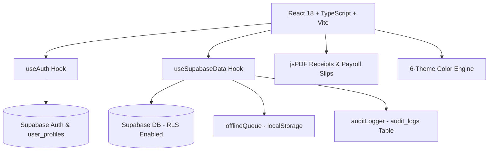

## [2026-09-27] La 1.0.19 part au parc : le journal s'archive par semaine, la cloche le rappelle, non signée

Demande : « mets l'app à jour, puis publie et release la nouvelle version avec les modifications ».

**Pourquoi un numéro, et pas seulement des commits.** Un poste installé ne lit pas le site, il lit le canal de mise à jour : la 1.0.18 que ce canal sert ne connaît ni l'archive hebdomadaire du journal d'audit, ni le rappel de la cloche, ni la veille d'origine réparée. Tant que le numéro ne monte pas, ce travail reste dans `main` et n'atteint **aucune école**. Monter la version est le seul geste humain de la publication : la chaîne qualité de `main` déclenche ensuite le publieur, qui construit, contrôle les octets téléversés contre `latest.yml`, promeut, puis relit le canal vivant.

**Ce que la 1.0.19 porte**, mesuré par la suite : l'archive du journal d'audit par semaine ISO en PDF depuis **Réglages → Sauvegarde** — les octets venant d'une requête bornée par la semaine, jamais des cent dernières entrées, donc une semaine chargée ne peut pas être tronquée en silence ; le **rappel de la cloche** quand la semaine précédente n'est pas archivée, prouvé par le journal lui-même (l'archive s'y inscrit) et éteint pour qui ne peut pas agir ; et la veille de l'origine publique, qui ne lit plus un refus d'adresse machine comme un lien mort.

**Mêmes conditions de signature que la 1.0.18 : non signée.** La variable de dépôt `SIGNING_ENABLED` n'est pas `true`, donc le publieur construit **sans** certificat, ne promet aucun `publisherName`, et `electron-updater` juge les octets par le sha512 du flux. Le prix reste l'avertissement SmartScreen ; ce qui est préservé, c'est la capacité du parc à se mettre à jour tout seul — signer avec un certificat de test graverait un signataire que Windows n'approuve que sur la machine qui l'a créé (le gel mesuré des 1.0.6–1.0.8), et `npm run check:updater-trust` refuse ce contrat quel que soit l'endroit d'où l'on publie.

**Gates locaux avant l'envoi** : `check:release:tag` (v1.0.19 inédit — la 1.0.18, elle, est refusée : « un même numéro ne peut pas changer de contenu »), `check:release:needed` (needed=true), suite complète **2150/2150**, `tsc --noEmit` propre, `npm run lint` vert (29 contrôles), `npm run build` OK.

## [2026-09-27] « Public origin watch » était rouge pour un refus d'adresse MACHINE, pas pour un lien mort

Demande : « répare public origin watch ». Cinq runs rouges de suite (2026-09-22 → 09-26), tous sur le MÊME lien, et la cause n'était lisible nulle part : les journaux de run et les annotations exigent un jeton, et le quota anonyme de l'API depuis cette IP était épuisé.

**Ce que les journaux ont dit, une fois qu'on a pu les lire.** `https://github.com/<dépôt>/releases/latest` → **HTTP 404**. Le lien est pourtant sain : relu depuis un poste ordinaire il répond **200** et atterrit sur `/releases/tag/v1.0.18` — vérifié anonymement, avec trois agents différents dont celui qu'emploie le contrôle. Et la 1.0.18 est bien une release PUBLIÉE (ni brouillon ni préliminaire, lu par l'API). La mesure qui tranche : **sur le même run du runner**, `api.github.com` (la liste des versions) et `raw.githubusercontent.com` (le frein d'urgence) répondaient **200**. Ce n'est donc pas « le lien est mort » : c'est « ce client-ci, depuis cette adresse-là, n'a pas le droit de lire cette page ». Le contrôle recevait un refus et le lisait comme un dépôt supprimé ou renommé.

**Le remède garde les deux moitiés, parce que les deux fautes sont symétriques.** Ignorer le 404 aurait rendu aveugle le seul contrôle qui protège la porte de sortie d'un poste PORTABLE ; laisser un rouge permanent sur un lien sain est l'autre faute — un contrôle toujours allumé ne se lit plus. La lecture anonyme reste donc la première tentative, et devient plus fidèle au sujet : les en-têtes imitent un **navigateur**, parce que ce qui est mesuré est un lien qu'un humain ouvre, et un agent de contrôle ne disant rien de ce qu'il accepte se fait juger comme un robot. Quand elle est refusée, le contrôle pose la seconde question — « une version PUBLIÉE existe-t-elle ? » — par l'API, avec le jeton que le job possède déjà. Le verdict ne rend jamais un silence : il rend un **avertissement nommé** (« la page de version a été prouvée par l'API ; ce n'est PAS une lecture de navigateur »), et un repli qui n'a rien pu dire **ajoute son propre motif** au refus, pour que « page refusée » et « preuve impossible » ne se lisent pas pareil.

**Trois garde-fous, chacun prouvé.** Le jeton ne part **que** vers `api.github.com` — une seule `Authorization:` dans tout le module, exigée par un cas de test — parce que ce script voisine un lien vers WhatsApp, et qu'un en-tête d'autorisation posé « au cas où » serait une fuite de jeton. Une version **BROUILLON** ne compte pas : elle n'a pas de page publique, et la compter ferait passer un vert pour un lien que personne ne peut atteindre. Et un **404 d'API sur un dépôt inexistant reste un refus** : mesuré, le repli rend `ok:true tag:v1.0.18` sur le vrai dépôt et `l'API a répondu HTTP 404` sur un dépôt qui n'existe pas — il ne transforme donc pas un lien mort en vert.

**Ce que ça ne prouve pas, et le rapport le dit.** L'API prouve qu'une page de version a une **cible** ; elle ne prouve pas ce qu'un navigateur voit. Un refus de page entière resterait invisible derrière ce repli, et c'est écrit à l'endroit où le rapport se lit. C'est le prix de la mesure depuis une adresse que GitHub traite comme un robot.

Preuves : **26/26** sur `tests/public-origin.test.ts` (4 cas neufs : la preuve par l'API, le repli qui échoue, un 200 hors page de version qui reste un refus ferme, et la garde « le jeton ne part qu'à l'API ») ; le repli exécuté contre l'API réelle dans les trois sens ; `tsc --noEmit` propre ; `npm run lint` vert (29 contrôles) ; le workflow ne transmet le jeton qu'à l'étape qui en a besoin.

## [2026-09-27] La cloche prévient quand la semaine précédente n'est pas archivée — et la preuve, c'est le journal lui-même

Demande : « ajoute un rappel dans l'app qui prévient l'admin et le dev quand la semaine précédente n'a pas encore été archivée en PDF ».

**La question n'était pas d'afficher un message, c'était : qu'est-ce qui prouve qu'une semaine est archivée ?** Le PDF n'est pas téléversé — il est écrit sur le poste qui le produit. Il n'existe donc, hors de cette machine, **aucune trace de l'archive**. Un rappel qui se fierait à une mémoire locale (un drapeau dans `localStorage`) préviendrait l'admin alors que le dev vient d'archiver la même semaine sur un autre poste, et il ferait douter d'un geste qui a bien eu lieu. L'application possédait déjà l'endroit juste : le **journal d'audit**. On y écrit désormais l'archive elle-même (`EXPORT_AUDIT_JOURNAL`, cible = la clé ISO de la semaine, `2026-S39`), et la preuve qu'une semaine est classée devient une **entrée de journal** : partagée par tous les postes, mise en file hors ligne comme n'importe quel autre geste, et relue par le **même lecteur borné** que le PDF. Un troisième mécanisme de mémoire aurait été un endroit de plus où « archivé » pouvait mentir.

**Trois règles, chacune mesurable** (`src/lib/auditArchive.ts`, module pur — la date et les entrées sont toujours des paramètres). **1.** « La semaine précédente » est la semaine ISO **d'avant**, terminée — pas les sept derniers jours, et pas la semaine en cours : c'est ce qu'un administrateur qui ouvre l'application le lundi matin cherche à classer. **2.** Une semaine **vide** ne se signale pas : sans entrée il n'y a rien à archiver, et un rappel hurlerait pour toutes les semaines d'avant l'installation du poste. **3.** L'archive est retrouvée par sa **cible**, jamais par une clé devinée dans un texte libre — et la fenêtre interrogée va de la semaine précédente jusqu'à **maintenant**, parce qu'une archive se pose le plus souvent le lundi pour la semaine qui vient de finir : la chercher dans la seule fenêtre de la semaine raterait le cas le plus courant.

**Le rappel s'éteint de lui-même, et il appartient à qui peut agir.** `useAuditArchiveReminder` rend une **notification de cloche** — le vocabulaire existant (badge, chime, toast, marquage lu/supprimé, persistance par utilisateur) plutôt qu'un second système d'alertes. Il est **éteint** pour les rôles qui n'atteignent pas les Réglages (`auth.isAdmin`, qui couvre admin ET dev — voir `deleteRights.ts`) : avertir un enseignant d'une tâche qu'il ne peut pas faire serait un faux rappel, et aucune requête n'est même faite. L'identifiant porte la clé ISO (`audit-archive-2026-S39`), donc chaque semaine est un rappel **neuf** : le parent élague les identifiants qui n'ont plus de rappel vivant, et la cloche sonne de nouveau la semaine suivante sans qu'aucun état ne soit réinitialisé à la main. L'archive est relue toutes les minutes pour que le geste fait depuis les Réglages éteigne le badge **dans la même session**, au lieu de laisser croire qu'il n'a pas compté. Le clic mène aux **Réglages → Sauvegarde** (nouveau routage `onOpenSettings`, à côté de celui de la paie) : un rappel qui n'ouvre pas l'endroit du geste est une devinette.

**Un détail qui aurait cassé le clic, et qui est verrouillé.** La date d'ancrage du rappel est un **jour civil** (`AAAA-MM-JJ`), pas l'instant ISO de fin de semaine : le panneau découpe cette chaîne sur les tirets pour ouvrir le calendrier, donc un `…T23:59:59.999Z` y produirait une date invalide et un bouton qui ne mène nulle part. Un cas le vérifie.

**Deux dépendances gardées hors du chemin de rendu, volontairement.** Le journal d'audit tire le client de base (`supabaseClient` refuse de se construire sans variables d'environnement) : la carte des Réglages l'importe donc **différément, au geste** (`recordWeekArchive` fait `await import('./auditLogger')`). Écrire l'entrée depuis le module d'archive plutôt que depuis la carte a un second effet, plus important : le fichier qui **produit** l'entrée et celui qui la **relit** ne peuvent plus diverger, et l'insertion vient **après** la génération du PDF — un document qui a échoué ne doit pas déclarer la semaine archivée.

**Preuves.** `tests/audit-archive.test.ts` — 9 cas purs : la semaine d'avant est terminée et commence un lundi, la clé change d'année civile au passage du nouvel an (le lundi 5 janv. 2026 a pour précédente `2026-S1`, pas `2025-S1`), une archive se prouve par sa cible et jamais par une autre action ni par une phrase, une archive posée **après** la fin de sa semaine éteint quand même le rappel, une semaine vide ne se signale pas, l'archive d'une autre semaine ne dispense pas d'archiver la précédente, la date est un jour civil, et le format de fil est verrouillé (`EXPORT_AUDIT_JOURNAL`). `tests/audit-week-pdf.test.tsx` — 2 cas de rendu réel : le clic sur Télécharger écrit **une** entrée de journal portant la bonne action, la bonne cible et le nom du fichier ; et **rien** n'est inscrit avant le geste. `tests/notifications-panel.test.tsx` — le rappel d'archive ouvre **les Réglages et jamais la paie** (un cas qui distingue les deux, sans quoi la régression passerait en silence). Mesures du dépôt : **2145/2145** tests, `tsc --noEmit` propre, `npm run lint` vert (29 contrôles), `npm run build` OK, `l10n-verify` vert (1163 clés dans les deux langues). Rien n'est committé.

**Ce qui n'est pas fait, et pourquoi.** Le rappel ne se déclenche que si la semaine précédente **a des entrées** : une école fermée une semaine entière ne reçoit donc aucun rappel, ce qui est le comportement voulu (rien à classer) mais aussi une limite — si l'on voulait prouver une archive même pour une semaine vide, il faudrait un marqueur d'archive distinct de l'activité, et c'est une décision, pas un correctif. Et le rappel vit dans la cloche : il n'y a pas de bandeau plein écran, donc il peut être supprimé à la main — la suppression est **réversible** et le rappel revient intact à la prochaine semaine non archivée (ou via « Tout restaurer »).

## [2026-09-27] Deux veilles rouges réparées : la dormance se mesure à la cadence, et l'API anonyme n'est plus une porte

Demande : « le CI automation audit et release watch sont cassés, répare-les ». Deux workflows rouges tous les jours depuis le 2026-09-24, et deux causes **sans aucun rapport** — une règle trop courte d'un côté, une dépendance à un quota partagé de l'autre.

**1. `Automation audit` rougissait parce qu'un cron MENSUEL était jugé sur une fenêtre de huit jours.** Le reproche automatisé apparaissait en toutes lettres dans le rapport — mais ce rapport n'est lisible qu'avec un jeton, donc la cause n'était nulle part. En relisant ce qu'un runner publie **sans jeton** (l'API des runs est publique sur ce dépôt, contrairement à celle des annotations), `Backup round-trip` sort en `dormant` : « dernier run il y a 12 j (> 8 j autorisés pour un cron) ». Or son cron est `40 3 1 * *` — **une fois par mois**, ce que le dépôt documente lui-même (« un mécanisme ne change pas tous les jours »). La règle `DORMANT_ALLOWANCE_DAYS = 8` avait été écrite pour le cron quotidien, qui est la cadence de la plupart des veilles, et **exécutait donc le workflow backup 8 jours après son run, soit 22 jours par mois**, sans qu'aucune automatisation n'ait failli. La chronologie le confirme : dernier run le 2026-09-14, bascule au rouge le 2026-09-22 — exactement huit jours plus tard.

Le remède n'est pas de lever la dormance (un cron qui ne part plus **est** une panne, c'est toute la raison d'être de cette veille) mais de la comparer à **ce que le workflow a promis** : `parseWorkflowFile` rend maintenant ses **crons**, et `dormancyAllowanceDays` en déduit la fenêtre — un jour pour un cron quotidien (plancher de 8 jours, la marge d'un week-end de déclenchements sautés), une semaine + 3 jours pour un hebdomadaire, un mois + 3 pour un mensuel, un an + 3 pour un annuel ; une expression illisible ne gonfle rien (`null`), parce que deviner large sur un cron cassé transformerait un cron mort en cron patient. Le plus LENT des crons décide (un workflow qui porte un quotidien ET un mensuel ne doit pas être jugé sur le quotidien), et `check-automations.mjs` passe cette fenêtre à chaque workflow. Mesure après correction, recalculée sur les runs réels : `Backup round-trip` **`acted`**, `Vercel pins watch` **`acted`** — plus aucun KO.

**2. `Release channel watch` rougissait parce qu'un QUOTA n'est pas un défaut du canal — et ce workflow-là ne peut pas prendre un jeton.** Le script le dit depuis le 2026-09-13, et le refus porte le diagnostic écrit : « un 403 sur l'API sans jeton est le QUOTA PARTAGÉ des runners ». Reproduit depuis cette machine en épuisant simplement son quota anonyme : `EXIT=1`, « ❌ GitHub injoignable (HTTP 403) ». Le mode `channel` refuse le jeton **par conception** (un test le verrouille : « un canal relu authentifié n'est pas prouvé pour un poste »), et il tient cette promesse pour les OCTETS depuis le 13/09 — mais **la LISTE des releases, elle, restait un appel anonyme à `api.github.com`** (60 requêtes par heure et par IP, partagées entre runners), seule partie non repliable du verdict. Un cron quotidien y rougissait donc pour son propre quota, sur un canal sain.

Le remède ne touche pas la conception, il l'étend : **la liste n'est pas ce qu'un poste lit**. Quand elle manque, le mode `channel` juge la **TÊTE** par la voie du POSTE — `latest.yml` puis chaque fichier que ce flux annonce, à l'URL de téléchargement (`github.com/…/releases/download/<tag>/…`, celle que `electron-updater` suit), rehachés en flux. La `blockmap` est **sondée** (le flux ne l'annonce pas, un poste la découvre par convention), un **404 est une ABSENCE** tandis qu'un autre statut est une PRÉSENCE illisible (les confondre accuserait le canal d'un quota), et ce qui n'est plus mesurable ainsi — le chemin de CHAQUE version publiée, les actifs hors flux — est **NOMMÉ à l'endroit où le rapport se lit** : « liste d'API indisponible (HTTP 403) — le verdict porte sur la TÊTE ; le chemin des autres versions publiées et les actifs hors flux n'ont PAS été mesurés ». Un repli qui se tait serait un vert qu'on ne saurait pas expliquer.

**Preuve du repli, exécutée pour de vrai** (quota de l'IP épuisé, donc la branche est prise naturellement) : `EXIT=0`, tête `v1.0.18` livrable, installeur **129 051 043 octets** rehaché par la voie du poste, sha512 `d8qV3EfTmAReRq6eYm1cfnl/…` conforme à ce que le flux annonce, frein lu (0 retenue), et les deux artefacts hors flux nommés avec leur raison. Le chemin complet (liste disponible) reste celui d'avant, inchangé.

**Ce qui reste ouvert, et pourquoi ce n'est pas réparé ici.** (1) `Public origin watch` est rouge lui aussi, mais il passe **localement** sur un arbre propre : ses liens (origine Vercel, page de release) ne dépendent d'aucun quota d'API, donc l'échec vient d'ailleurs — très probablement d'un refus du runner par l'hébergeur — et rien dans le dépôt ne permet de l'affirmer. Le deviner serait pire que le dire. (2) Le repli **réduit** ce que le cron quotidien mesure (plus de chemin par version), et c'est le prix de la contrainte « aucun jeton » : si l'on veut retrouver cette mesure en CI, la décision est de laisser la LISTE (métadonnées, jamais les octets) s'authentifier — c'est un choix de conception, pas un correctif, donc il n'est pas pris d'office.

**Mesures du dépôt** : **2133/2133** tests (6 cas sur la cadence dans `tests/automation-evidence.test.ts`, 1 sur le repli du canal dans `tests/release-coherence.test.ts`), `tsc --noEmit` propre, `npm run lint` vert (29 contrôles inventoriés). Rien n'est committé.

## [2026-09-26] Le journal d'audit s'archive par semaine, en PDF, depuis les Réglages

Demande : « fais en sorte que dans les paramètres, à chaque fin de semaine, l'admin et le dev puisse télécharger le journal d'audit de la semaine en PDF ».

**Ce qui existait répondait à une autre question.** Le journal d'audit vit dans un onglet, avec un export **CSV** — et cet export suit la VUE (regroupée, il écrit une ligne par incident). C'est ce qu'il faut pour travailler sur le journal à l'écran, pas pour l'archiver : un fichier de semaine doit être déterminé par la SEMAINE, pas par les filtres qui se trouvaient là au moment du clic. Et l'onglet ne lit que les **cent dernières entrées** (`fetchAuditLogs`, `.limit(100)`) — suffisant pour faire défiler un écran, faux pour un PDF intitulé « semaine 39 » : une semaine chargée serait tronquée en silence.

**« Une semaine », décidé et non pas subi.** Le dépôt a déjà un début de semaine : l'écran de calendrier est « lundi d'abord » (`getCalendarDays`). On prend donc la semaine **ISO-8601** — lundi 00:00:00.000 → dimanche 23:59:59.999, en heure LOCALE du poste (un paiement de 21 h le dimanche compte dans la semaine qui finit). Le module pur `src/lib/auditWeek.ts` porte la fenêtre, son **`isoYear`** et son numéro, et sa **clé** `2026-S39` : le numéro ISO peut appartenir à l'année civile précédente ou suivante (le 29 déc. 2025 est la semaine 1 de **2026** ; le 3 janv. 2027 est la semaine 53 de **2026**), et dériver le numéro de l'année du jour regardé ferait diverger l'étiquette du contenu. La clé sert aussi au nom de fichier : deux personnes qui archivent la même semaine obtiennent le même nom.

**Les octets viennent d'une fenêtre, jamais d'un plafond.** `fetchAuditJournalRange(fromIso, toIso)` (nouvelle action du crochet de données) interroge `audit_logs` **bornée par les dates** de la semaine — donc une semaine de 400 gestes sort entière. La projection ligne→entrée est désormais UNE fonction partagée (`mapAuditLogRow`) : l'écran et l'archive lisent la même table par le même lecteur. Hors ligne, la même fenêtre se lit sur le poste — gestes encore en file, puis cache — parce que l'archive d'une semaine se prépare le dimanche soir, réseau ou pas ; et une réponse refusée retombe sur ce journal local, jamais sur une liste vide qui se lirait « l'école n'a rien fait ».

**Le PDF ne réécrit rien et ne regroupe pas autrement que l'écran.** `src/lib/pdfAuditJournal.ts` emploie `incidentRows` — le même regroupement des postes bloqués, la même définition de « la même panne » — et traduit les actions et les détails à la LECTURE (`auditActionLabel`, `localizeAuditDetails`), comme l'écran : ce qui est imprimé reste ce qui est stocké. Le document (bandeau, trois compteurs — entrées, incidents groupés, comptes actifs —, tableau paginé, cachet, pied de page numéroté) sort par le **seul émetteur de téléchargement** (`downloadBytes`), la règle que le dépôt a payée trois fois.

**La carte vit dans les Réglages, parce que c'est une tâche d'archive** — à côté de l'export complet, et héritant du droit de l'onglet (`auth.isAdmin`, qui couvre admin ET dev — voir `deleteRights.ts`) au lieu d'en inventer un second. Elle offre les **huit dernières semaines** (la semaine en cours en premier), annonce le nombre d'entrées réellement chargées AVANT le clic, et refuse le bouton quand il n'y a rien à écrire. Elle est un **composant à part** (`AuditWeekExportCard.tsx`) pour une raison mesurable : `SettingsView.tsx` était à 698 lignes sur un budget de 700 — une carte écrite en son sein l'aurait fait dépasser. L'écran ne gagne qu'une ligne, le budget reste tenu.

**Preuves.** 12 cas purs dans `tests/audit-week.test.ts` (fenêtre, bornes incluses lundi et dimanche, `isoYear` aux deux bords de l'année, semaines consécutives sans trou, refus de deviner une date illisible, nom de fichier) et 4 cas de rendu réel dans `tests/audit-week-pdf.test.tsx` : la carte demande la **fenêtre** de la semaine (bornes vérifiées), le clic écrit **un** fichier dont les octets commencent par `%PDF-` et dont le nom porte la clé ISO, le compte affiché est celui chargé, et une semaine vide laisse le bouton inactif en disant pourquoi. `npm run lint` vert (29 contrôles inventoriés), `node scripts/l10n-verify.mjs` vert (13 clés ajoutées dans les deux langues, le module PDF déclaré comme lecteur du dictionnaire), `tsc --noEmit` propre, **2126/2126** tests. Rien n'est committé.

## [2026-09-22] Signer engage : le certificat, le passage de `SIGNING_ENABLED`, et la vérification que le parc suivra

Demande : « prépare la signature d'éditeur : documente et outille l'obtention d'un certificat de code signing, le passage de `SIGNING_ENABLED` et la vérification que le parc reste capable de se mettre à jour une fois le contrat signé ».

**Le fait qui commande tout, et il n'était écrit nulle part.** Le nom d'éditeur n'est pas dans l'installeur qu'on publie : il est **gravé dans chaque poste qui l'installe** — l'installeur porte `resources/app-update.yml`, qui est recopié dans le `resources/` de la version installée, et c'est **ce** fichier qu'`electron-updater` relit à chaque vérification (`ElectronAppAdapter.js`), avec une règle sèche : sans `publisherName`, **aucune signature n'est vérifiée** (`NsisUpdater.js` : `if (publisherName == null) return null`). Et ce qui est gravé est le **CN du certificat**, mesuré dans la bibliothèque que le build exécute (`windowsSignToolManager.js` : `publisherName = [certInfo.commonName]`). Trois conséquences, dont deux irréversibles : le premier envoi signé est **gratuit** (les postes actuels ne vérifient rien) ; couper ensuite `SIGNING_ENABLED` **gèle** le parc ; et un renouvellement qui change de CN — ou un certificat pris ailleurs avec un autre nom — gèle aussi, machine par machine.

**Les deux contrats du parc ont été reconstitués octet pour octet, et prouvés par leur empreinte.** Les manifestes publiés scellent le sha256 de `resources/app-update.yml` pour chaque version : ceux de la **1.0.18** (`b9cefbcaa012c806…`) et de la **1.0.8** (`b8c880ad9c06e5da…`) correspondent exactement à deux textes reconstruits ici — **104 octets** (aucune promesse) et **149 octets** (`publisherName: [ "Mama Thera Finance (test)" ]`, le contrat de gel). Une empreinte identique veut dire des octets identiques : ces deux fichiers-là sont donc, littéralement, ce que le parc exécute — et ils sont désormais dans `tests/signing-transition.test.ts` comme fixtures, avec leur taille *et* leur sha256 exigés.

**`scripts/lib/signing-transition.mjs`, les règles pures de la BASCULE** — la question qu'aucun contrôle ne posait : `updaterTrustVerdict` juge UN artefact (« ce contrat promet-il une signature, et la tient-il ? »), pas un changement ("le contrat qu'on s'apprête à livrer est-il accepté par les postes qui tournent déjà ?"). Neuf causes nommées, chacune avec son remède, et les deux qui portent le plus : **`unsigned-after-commitment`** — livrer non signé alors que des postes promettent un signataire ; et **`promise-changed`** — le CN n'est plus celui gravé chez eux. Le détail qui décide de la justesse : une promesse de **test** déjà gravée n'est **pas** une faute du contrat qu'on livre (aucun certificat publiable ne la satisfera) — elle est comptée, nommée, et son remède est `repair:frozen-updater` sur ces postes-là ; la confondre avec un renommage ferait refuser toutes les publications futures à cause de machines qu'un script répare.

**`npm run check:signing-transition`, le contrôle** — quatre façons de lire ce que le parc promet, et chacune dit d'où vient sa preuve : un **poste** (`--station=<dossier>`, le contrat tel qu'il l'exécute), des **octets publiés déjà là** (`--field-installer=<installeur>`, extraction 7-Zip du contrat embarqué), le **canal** (`--channel`, les manifestes publiés donnent l'empreinte du contrat de chaque version, sans jeton), et la **répétition** (`--publisher="<CN>"`, « et si le certificat portait ce nom ? ») — celle qui se fait **avant d'acheter**. Le raisonnement qui rend le canal utile sans télécharger 129 Mo par version : une empreinte **identique** à celle du contrat qu'on a sous les yeux dit exactement ce qu'elle contient ; une empreinte qui **change** ne dit rien, et c'est alors un **refus de conclure** (sortie 2), jamais un vert.

**Vérifié en modes réels, sur cette machine** — huit combinaisons, chacune avec sa sortie : build non signé vs poste libre → `unsigned-unchanged` (0) ; vs poste **signé** → `unsigned-after-commitment` (**1**) ; répétition d'un CN réel vs poste libre → `first-commitment` (0, engagement affiché) ; vs poste signé du **même** CN → `commitment-unchanged` (0) ; vs poste signé d'un **autre** CN → `promise-changed` (**1**) ; vs parc **gelé** (test) → `first-commitment` (0, avec le remède) ; contrat publié (les 104 octets) vs **canal réel** → `contract-unchanged` (0) — la déduction d'empreinte confrontée aux manifestes du vrai canal ; CN réel vs poste signé + canal réel → `commitment-unchanged` (0). Et un dernier passage sur les **octets publiés réels** : `--publisher="COMPLEXE SCOLAIRE MAMA THERA" --field-installer=<installeur 1.0.18 téléchargé>` → contrat extrait de **104 octets, aucune promesse**, `first-commitment` — c'est la répétition que ferait le propriétaire du parc avant de commander un certificat.

**Deux défauts trouvés en exécutant, pas en relisant** : un `--dir` **absolu** était recollé sous la racine du dépôt (`join` au lieu de `resolve`), ce qui faisait refuser « aucun contrat » sur un contrat présent ; et le nom du produit était recomposé depuis `package.json` (qui dit `mama-thera-finance`) alors que l'actif publié s'appelle `MamaTheraFinance-…` — le manifeste n'était donc jamais trouvé. Les deux sont corrigés, et le second est maintenant cherché **dans les actifs** au lieu d'être deviné.

**`docs/CODE_SIGNING.md` porte la marche à suivre complète** : ce que signer **engage** (§0, avec le tableau des quatre livraisons possibles et de ce que le parc en fait) ; l'**obtention** du certificat (§A) — voie OSS gratuite (SignPath) ou OV/EV acheté, ce qu'on **demande** à l'autorité, et trois faits vérifiés dans la documentation du fournisseur le 2026-09-22 : **le CN se saisit au moment de la commande** (donc on le choisit, on ne le subit pas), la validité maximale est passée à **459 jours** depuis le 24 février 2026 (donc un renouvellement tous les ~15 mois, avec **le même CN**), l'organisation doit être validée pour la signature de code et un appel téléphonique de confirmation a lieu ; le **passage de `SIGNING_ENABLED`** (§B — c'est une *variable*, pas un secret, et elle ne se repasse plus à `false` une fois une version signée en service) ; la **bascule dans l'ordre** (§C — cinq commandes, de la lecture du parc à la preuve de bout en bout) ; et la consigne d'écrire le CN gravé dans l'historique, parce que c'est l'information qu'un renouvellement cherchera dans deux ans.

**Mesures du dépôt** : **2110/2110** tests (dont **18** pour la bascule), `tsc --noEmit` propre, `npm run lint` vert (29 contrôles inventoriés — le nouveau contrôle est déclaré dans l'inventaire des immunités), `npm run check:updater-contract:live` rejoué sur le canal (104 octets, `b9cefbca…`, aucun signataire promis, octets `NotSigned`, chemin de mise à jour conservé). Rien n'est committé.

**Ce qui n'est pas fait, et pourquoi.** Le contrôle n'est pas branché dans `desktop-release.yml` : sur un runner, aucun poste n'est lisible, et le contrat y change **une seule fois** (le premier envoi signé) — une porte qui ne peut pas lire le parc y serait un rapport, pas une porte. La vraie porte est la liste ordonnée de §C, exécutée là où le parc est lisible ; `check:updater-trust` (sur les octets du build, déjà appelé par le publieur) reste celle qui bloque. Le câblage peut se discuter — c'est une décision, pas un oubli.

## [2026-09-22] La mise à jour se prouve de bout en bout contre le canal réel — et elle a trouvé un vrai blocage

Demande : « écris un E2E qui prouve la mise à jour de bout en bout contre le canal réel : un poste installé d'une version antérieure atteint la dernière publiée sans geste de l'utilisateur, et l'échec est rapporté avec sa cause ».

**Ce qui manquait n'était pas une preuve de plus, c'était la seule qui ressemble à l'école.** `scripts/verify-updater.mjs` prouve la chaîne — vérification, disponibilité, progression, octets refusés, politique d'obligation — sur le binaire **de ce commit**, contre un flux **local**, et s'arrête à `update-downloaded` : aucune de ses passes n'installe rien. Un poste d'école, lui, tourne sur une version **publiée** et doit rejoindre la **dernière publiée**. Ces deux questions n'ont ni le même point de départ, ni le même canal, ni le même juge — et c'est exactement l'écart où une panne peut vivre des mois.

**Le parcours, `npm run verify:updater:channel`** (`scripts/verify-updater-channel.mjs`) : tête et flux lus **sans jeton** à l'URL qu'un poste interroge ; **poste de départ** = la plus HAUTE version publiée sous la tête (un cran en arrière, pas trois) ; ses octets **rehachés en flux** contre le `sha512` de son flux, et son **contrat embarqué extrait de l'installeur téléchargé** — parce qu'un poste dont le contrat promet un signataire est **gelé**, et que ce n'est pas la mise à jour qu'il faut accuser dans ce cas ; installation **silencieuse** dans un dossier isolé ; application **installée** lancée sur le canal réel, `UPDATER_FEED_URL` **retiré** de l'environnement pour que la preuve ne puisse pas prouver un flux local en croyant prouver le canal ; téléchargement de la tête ; puis **fermeture de la fenêtre** par `WM_CLOSE` — pas `taskkill /F` — parce que c'est ce geste-là qui installe (`autoInstallOnAppQuit`), qu'aucun clic n'est donné, et qu'un `/F` fabriquerait par la preuve elle-même l'échec qu'elle prétend mesurer. Enfin : la version **réellement installée**, relue dans le binaire par Windows, doit être la tête, et le poste ainsi mis à jour doit se **voir à la tête** au prochain démarrage.

**Les refus qui protègent la machine, et ils tombent avant la dépense** : hors Windows, refus **avant tout téléchargement** (l'installation silencieuse est un geste NSIS et la version installée se lit par Windows) ; et si une installation de **cette** application est présente, refus **avant tout octet** — la preuve installe et désinstalle sous le même identifiant, donc elle réécrirait l'entrée de désinstallation du système et laisserait l'installation réelle orpheline. `--channel-only` s'arrête après la moitié « canal », `--keep` garde les octets ; le nettoyage désinstalle, purge le cache partagé d'`electron-updater`, supprime ses dossiers de travail, balaie les Electron orphelins et **tue** l'installateur de mise à jour bloqué (mesuré : il peut rester des heures sur une boîte que personne ne cliquera — 0,9 s de CPU en 470 s).

**Les verdicts sont purs** (`scripts/lib/station-update.mjs`) donc prouvables sans Windows ni installeur (`tests/station-update.test.ts`, 26 cas), et l'échec est rapporté **avec sa cause** — `head-held`, `contract-frozen`, `bytes-refused`, `download-failed`, `feed-unreachable`, `no-update-offered`, `chain-incomplete`, `install-blocked-dialog`, `install-missing`, `install-noop`, `install-other` — plus les dernières lignes du **journal du poste**, qui est le fichier qui existe aussi chez un client.

**Ce que le canal réel a répondu, trois fois de suite, même verdict.** Tête `v1.0.18` (129 051 043 octets) ; poste de départ `v1.0.17` (129 050 550 octets, sha512 conforme) ; contrat du poste de départ **sans signataire promis** ; chaîne complète dans une seule session (`checking → available 1.0.18 → progress → downloaded 1.0.18`, 5 à 6 vérifications) ; puis, à la fermeture de la fenêtre, l'installateur de mise à jour démarre et **s'arrête sur une boîte** : « Échec de désinstallation des anciens fichiers d'application … : -1073740940 ». L'**ancien désinstalleur** meurt en `0xC0000374` (`STATUS_HEAP_CORRUPTION`), l'installation ne reprend jamais — et **mesuré**, le dossier d'installation est alors **vide (0 entrée)** : sur une machine que ce plantage atteint, un update accepté laisse le poste **sans application**. C'est le seul cas de cette chaîne où l'école ne peut plus travailler, et c'est pour ça que le verdict le **mesure** au lieu de le déduire.

**La question qui décide du remède : la machine ou les octets ?** Trois mesures, aucune supposition. (1) Le plantage de l'installeur publié se reproduit dans **trois modes de lancement** (`spawnSync` stdio `ignore` et `inherit`, `Start-Process -Wait -PassThru`) — ce n'est donc pas la façon dont le harnais le lance. (2) Un installeur NSIS **minimal**, compilé ici avec le **même** `makensis` (3.0.4.1, celui d'`electron-builder`) et installé en silence, sort à **0** : le runtime NSIS de cette machine va très bien, et le plantage vient des octets construits. (3) Le désinstalleur **en place** (`_?=<dossier>`, la façon dont l'installateur le lance) plante avec **n'importe quel** drapeau — `--zzz` et `--keep-shortcuts` compris, donc ce n'est pas un drapeau ; seul `--updated` change ce qu'il **fait**. En amont, [electron-builder #8664](https://github.com/electron-userland/electron-builder/issues/8664) rapporte **le même message et le même code**, chez « quelques clients seulement », et a été close **sans plan** : c'est un aléa d'environnement, pas une régression de la 1.0.18.

**Une correction que la mesure a rendue nécessaire, dans le verdict lui-même.** Le premier rapport affirmait, à partir du code rendu, que « les fichiers de l'ancienne version sont DÉJÀ retirés ». Mesuré en isolation (désinstalleur en place, drapeaux de l'updater), c'est **faux** : rien n'est retiré dans ce cas-là. Le verdict ne tranche donc plus depuis un code de sortie : il reçoit `appStillThere`, **mesuré dans le dossier d'installation au moment du blocage**, et dit soit « l'ancienne application est TOUJOURS EN PLACE — le poste continue de travailler mais n'a pas reçu la tête », soit « PLUS AUCUN binaire — ce poste est SANS application et c'est celui-là qu'il faut remettre d'aplomb en premier », soit, sans mesure, qu'il **ne tranche pas**. Deux états opposés qui appellent deux gestes opposés, et un verdict qui les confondrait enverrait une école au secours d'un poste qui va très bien.

**Un défaut de typage réparé au passage, et il comptait.** La documentation JSDoc de `installerDialogVerdict` décrivait un objet déstructuré en **deux** paramètres : `tsc` type alors la fonction par le **premier** (`dialog`) et refuse `{ dialog: … }` à l'appel — huit erreurs dans `tests/station-update.test.ts`. Les deux lignes sont devenues **une seule** (avec un `@typedef Dialog`), et `tsc --noEmit` est de nouveau d'accord avec le code. C'est une porte du dépôt, pas une coquetterie.

**Mesures du dépôt** : **2092/2092** tests, `tsc --noEmit` propre, `npm run lint` vert (28 contrôles inventoriés), `npm run verify:updater:channel` **trois fois** avec le même verdict et le même nettoyage (aucune installation, aucune entrée de registre, aucun processus laissé). Rien n'est committé.

**Les limites, dites.** Cette preuve s'arrête **avant** `PROOF_OK` sur cette machine, à cause du défaut ci-dessus — elle ne dit donc pas qu'un poste **sain** atteindrait la tête de bout en bout ; elle dit que la chaîne va jusqu'au téléchargement, que l'installation échoue **là**, et **pourquoi**. Et le remède de parc n'est pas pris ici : le candidat est un `build/installer.nsh` avec `customUnInstallCheck` qui accepterait ce code précis (l'installeur écraserait alors l'ancienne version au lieu de s'arrêter), mais ignorer un « désinstall raté » mérite une décision explicite — c'est un changement du comportement d'installation, pas un correctif de preuve.

## [2026-09-22] Le contrat de mise à jour se mesure maintenant sur les octets PUBLIÉS, pas seulement sur le build local

Demande : « ajoute un script d'atelier qui mesure le contrat de mise à jour embarqué sur les octets publiés du canal (extraction depuis l'installeur téléchargé, empreinte comparée au manifeste publié) et refuse de conclure hors Windows ».

**Ce qui manquait, et c'était un angle mort, pas un détail.** `check:updater-trust` juge `release/win-unpacked/resources/app-update.yml` — le dossier de sortie. C'est la bonne question **avant** de publier, et la mauvaise après : l'octet qui voyage est un installeur NSIS posé sur le canal, et entre les deux il y a une compression et un téléversement. La mesure faite à la main la veille (129 051 043 octets, sha512 rehaché, contrat extrait de 104 octets, manifeste recoupé) vivait donc dans un terminal et non dans le dépôt : rien ne l'aurait rejouée après la prochaine publication.

**Le script, `npm run check:updater-contract:live`** (`scripts/check-published-updater-contract.mjs`), refait la chaîne entière sur les octets servis : (1) la tête lue à l'URL exacte qu'un poste interroge, **sans jeton** ; (2) `latest.yml` publié, dont la taille et le `sha512` doivent répondre aux octets téléchargés — c'est le premier verrou du poste, donc mesurer un contrat sur d'autres octets mesurerait ce que personne ne recevra ; (3) l'installeur est **ouvert** (7-Zip embarqué par le dépôt), la charge utile NSIS extraite, puis `resources/app-update.yml` ; (4) ce fichier est confronté au **manifeste d'arborescence publié** (`<produit>-<version>-unpacked.manifest.json`), qui scelle chemin, taille et `sha256` de chaque fichier du build ; (5) Windows est interrogé sur la signature des octets, et la promesse lue dans le contrat extrait passe au verdict pur `updaterTrustVerdict`.

**Sans l'étape 4, la mesure ne prouverait rien** — elle montrerait un fichier, pas que c'est celui du build. C'est pourquoi l'absence d'entrée dans le manifeste publié est un **refus** (exit 1), comme l'absence de flux, de manifeste ou de 7-Zip : l'extraction EST la mesure. Et hors Windows le contrôle refuse **avant même de télécharger 129 Mo**, plutôt que de rendre un vert qu'il n'a pas mesuré.

**Une anomalie d'API mesurée en chemin** : l'endpoint que le poste interroge (`/releases/latest`, `Accept: application/json`) nomme bien la version mais rend une liste d'actifs **vide** — vérifié : `assets: []` sur une release qui en porte cinq. La liste vient donc de l'API (`/releases/tags/<tag>`, sans jeton), qui donne aussi le `digest` de chaque actif ; quand elle est injoignable (quota anonyme), les URL sont construites sur la voie du poste et cette dégradation est **dite** — sans `digest`, le manifeste cesse d'être scellé par le canal, ce que le verdict nomme au lieu de le taire.

**La preuve, faite dans les deux sens.** 22 cas dans `tests/published-contract.test.ts`, sur les formes **mesurées** : la sortie `7z l -slt` d'un installeur NSIS, celle de sa charge utile, et les 104 octets exacts du contrat publié dans la 1.0.18 (sha256 `b9cefbca…`) — plus le refus de la variante à 149 octets, celle du contrat empoisonné de la 1.0.8. Essai croisé exécuté : le refus « hors Windows » retiré de la source → **deux cas échouent**, dont celui qui exige que le CLI s'arrête avant tout téléchargement (le CLI, réparé, a bel et bien descendu 129 Mo pendant le test cassé) ; remis → ils passent. La plateforme est surchargeable (`--platform=`) pour que ce refus soit **prouvable sur une machine Windows** — même précédent que la racine surchargeable du contrôle de budget de lignes.

**Deux effets de bord utiles.** La lecture Authenticode et le refus hors Windows ont été sortis dans `scripts/lib/windows-signature.mjs` : les deux contrôles qui interrogent le même cmdlet ne peuvent plus poser deux questions différentes, et `check:updater-trust` a été recousu dessus sans changer un mot de ses messages (ses tests passent inchangés). Le nouveau contrôle est **déclaré** dans l'inventaire des immunités (`scripts/lib/guard-immunity.mjs`, 28 contrôles) avec ses exemptions motivées, et `docs/CODE_SIGNING.md` porte la distinction « build local vs octets publiés » pour qu'elle ne se reperde pas.

**Mesuré sur le canal réel, deux fois** : contrat extrait de la 1.0.18 = **104 octets**, `sha256 b9cefbcaa012c806…`, conforme au manifeste publié (lui-même conforme au `digest` du canal) ; aucun signataire promis, octets `NotSigned` → le parc garde son chemin de mise à jour. Un installeur déjà descendu est **réutilisé** après rehachage (129 Mo ne retraversent pas le réseau), et les octets sont purgés en sortie sauf `--keep`.

**Mesures du dépôt** : **2066/2066** tests, `tsc --noEmit` propre, `npm run lint` vert (28 contrôles, dont le nouvel inventaire), `npm run build` OK. Rien n'est committé.

## [2026-09-22] La 1.0.18 part au parc : la connexion sans réseau marche, les saisies hors ligne partent, un seul compte par poste

Demande : « publie et release la nouvelle version avec les correctifs ».

**Pourquoi un numéro, et pas seulement des commits.** Les trois correctifs existent dans `main` mais n'atteignent **aucune école** tant que ce n'est pas publié : un poste installé ne lit pas le site, il lit le canal de mise à jour — et la 1.0.17 que ce canal sert porte la fonctionnalité hors ligne **avec** les trois défauts corrigés ici. C'est la raison qui a produit toutes les versions précédentes, et il n'y en a pas d'autre.

**Ce que la 1.0.18 porte, mesuré dans la suite :** (1) la **connexion sans réseau** ne sort plus « Failed to fetch » — une panne de transport n'est plus lue comme un refus du serveur, et seul un refus **explicite** de la base ferme la porte hors ligne ; (2) les **saisies faites hors ligne sont transférées au retour de la ligne** — le drainage observe la transition de la session, seul instant où le jeton existe, au lieu de dépendre d'un événement réseau qui part trop tôt et ne revient pas ; (3) **un seul compte hors ligne par poste** — le dernier connecté en ligne, et lui seul, appliqué à l'écriture comme à la lecture.

**Mêmes conditions de signature que la 1.0.12 : non signée** — la variable de dépôt `SIGNING_ENABLED` n'a pas été touchée depuis la 1.0.17, donc le publieur construit **sans** certificat, ne promet aucun `publisherName`, et `electron-updater` juge les octets par le sha512 du flux. Le prix reste l'avertissement SmartScreen ; ce qui est préservé, c'est la capacité du parc à se mettre à jour tout seul (signer avec le certificat de test graverait `CN=Mama Thera Finance (test)` dans le contrat que chaque poste lit, c'est-à-dire le gel mesuré des 1.0.6–1.0.8).

**Mesures du dépôt avant l'envoi** : suite complète **2044/2044**, `tsc --noEmit` propre, `npm run lint` vert (27 contrôles), `npm run build` OK. Chaque correctif a été prouvé **dans les deux sens** — retiré : le cas échoue ; remis : il passe.

**Un incident d'atelier, pour la transparence** : la chaîne qualité a passé (4 étapes vertes, 1 min 57 s), mais `git.exe` a échoué sur le fork msys documenté (`Win32 error 299`, `ERROR_PARTIAL_COPY`) et `git-retry.mjs` l'a classé « pas un fork-panic ». Le second passage a été instantané (le vert est en cache par arbre) et a abouti.

## [2026-09-22] Un seul compte hors ligne par poste : le dernier connecté en ligne, et lui seul

Demande : « restreins la connexion hors ligne à un seul compte par poste : le dernier qui s'est connecté en ligne, et lui seul peut rouvrir l'application sans réseau ».

**Ce qui existait : jusqu'à DIX comptes retenus**, le plus récent en tête, le plus ancien jeté. Chacun devait avoir fait sa propre connexion en ligne ici — donc ce n'était pas « n'importe quel compte » — mais un poste partagé finissait par porter une liste de dix membres du personnel, dont chacun pouvait rouvrir l'application sans réseau. Ce n'est pas la règle demandée, et ce n'est pas non plus la plus juste : « qui peut ouvrir ce poste sans réseau ? » doit avoir **une réponse unique**, et celui qui compte est le dernier qui s'y est réellement connecté.

**La contrainte est appliquée des deux côtés, et c'est le point technique qui décide si la règle existe vraiment.** À l'**écriture** (`saveAccounts`) : le stockage ne garde plus qu'un enregistrement. Et à la **LECTURE** (`listOfflineAccounts`) : c'est celle-là qui rend la règle **immédiate** sur un poste déjà installé, dont le stockage contient encore plusieurs enregistrements. Sans le tri en lecture, la règle n'aurait pris effet qu'à la prochaine connexion en ligne — c'est-à-dire exactement au moment où l'utilisateur n'en a plus besoin, puisqu'il est alors dehors, sans réseau, devant un poste qui accepterait encore les anciens comptes. Les enregistrements hérités ne sont pas effacés par la lecture (une lecture n'écrit pas) : ils deviennent **inertes**, et la première écriture les remplace physiquement.

**Ce que ça change sur le terrain, dit franchement.** Le poste appartient désormais hors ligne à la dernière personne qui s'y est connectée avec Internet. Si un autre membre du personnel doit travailler sans réseau, il se connecte **une fois avec Internet** — et il prend alors le poste à son tour. C'est le prix de la règle, et l'écran le dit maintenant : l'indication sous le formulaire parle du « DERNIER compte ouvert ici », et le refus d'un compte non retenu explique la règle au lieu de laisser croire que le poste ne l'a jamais vu (français et anglais).

**La preuve, faite dans les deux sens.** Trois cas qui échouent avec l'ancienne politique et passent avec la nouvelle : au niveau du module, « ne retient qu'UN compte : le dernier qui s'est connecté ici, et lui seul » (et il vérifie que le compte précédent ne répond plus, ce qui en fait une règle d'**accès**, pas un simple nettoyage) ; « un poste mis à jour n'emporte pas ses anciens enregistrements » (stockage hérité de deux enregistrements écrit à la main, dont seul le plus récent doit ouvrir, et dont l'autre doit disparaître à la première écriture) ; et de bout en bout, à travers un **second sign-in réel** : Aggee se connecte en ligne, Fanta se connecte en ligne sur le même poste, et Aggee ne peut plus rouvrir l'application sans réseau alors que Fanta, oui. Essais croisés exécutés : politique remise à dix → les trois cas **échouent** ; remise à un → ils passent.

**Une amélioration du faux client, au passage, et elle était nécessaire.** Le faux `supabase` de la suite d'authentification rendait le MÊME identifiant à tous les comptes : deux comptes s'y confondaient donc en un seul, et une suite n'aurait pas pu distinguer « le second compte remplace le premier » de « le même compte se réenregistre ». Il rend maintenant une ligne par compte, comme la base.

**Mesures du dépôt** : **2044/2044** tests, `tsc --noEmit` propre, `npm run lint` vert (27 contrôles), `npm run build` OK (`sw.js` pour `h478e0f13`, 40 fichiers en réserve). Rien n'est committé.

## [2026-09-22] Le retour de la ligne transfère les saisies hors ligne — et il y avait bien un trou

Demande : « quand il repassera online, si des données ont été saisies hors ligne, l'application les ajoutera automatiquement à la base, pour ne rien perdre ».

**Ce qui était déjà en place, et pourquoi ça ne suffisait pas.** La file est **durable** (localStorage, elle survit à la fermeture), le rejeu est **idempotent** (un doublon est reconnu — `23505` se lit « la ligne est déjà là », pas « échec »), une écriture **refusée reste en file** avec son nombre de tentatives au lieu d'être jetée, les identifiants de ligne choisis sur le poste sont **remappés** pour qu'un paiement et son reçu suivent un élève né hors ligne, et le transfert s'exécute **au démarrage** puis sur l'événement **`online`**.

**Le trou trouvé est un ORDRE, et il était réel.** L'événement `online` part **avant** que le mot de passe gardé en mémoire soit rejoué — donc avant qu'un jeton existe. `syncOfflineQueue` le voit, s'arrête, et il a **raison** de s'arrêter : envoyer sans jeton ne produirait qu'un refus de policy et marquerait « refusées » des saisies parfaitement valides. Mais ensuite, plus rien ne repassait : la reconnexion silencieuse réussie (qui referme la session hors ligne) ne redéclenchait **ni l'événement réseau, ni un drainage**. Conséquence mesurée : après une coupure, un élève ou un paiement saisi hors ligne restait dans la file **jusqu'au prochain démarrage de l'application** — rien n'était perdu (la file est sur le disque), mais la promesse « ça part dès que la ligne revient » n'était pas tenue.

**La correction, huit lignes, et elle vise la bonne observation.** Ce n'est pas l'événement réseau qu'il faut guetter, c'est la **transition de la session** : au moment où la session hors ligne se referme, le jeton existe (Supabase vient d'émettre une vraie session) et l'envoi passe. Le crochet observe donc le passage `session hors ligne → session réelle` et vide la file à cet instant.

**La preuve, et elle a été faite dans les deux sens.** Un cas monte le VRAI `useSupabaseData` (harnais `renderHook`), met une saisie en file, travaille en session hors ligne, puis referme la session — comme le fait la reconnexion silencieuse — et exige que la file soit **vide** et que l'écriture ait **réellement atteint la base**. Exécuté le correctif retiré : le cas **échoue** ; remis : il passe. C'est la seule façon de savoir qu'un test verrouille le défaut qu'il prétend verrouiller.

**La limite qui reste, dite plutôt que tue.** Un lien qui revient **sans que l'interface réseau change** (le modem reste « connecté », c'est la sortie qui était morte) ne produit **aucun** événement `online` : la reconnexion silencieuse n'est alors même pas tentée, et le poste reste en session hors ligne jusqu'au redémarrage. Le remède est une tentative périodique bornée (une par minute, uniquement tant que la reconnexion n'a pas été **refusée**), et il n'est pas fait ici.

**Mesures du dépôt** : **2042/2042** tests, `tsc --noEmit` propre, `npm run lint` vert (27 contrôles), `npm run build` OK (`sw.js` pour `hbd5f19c1`, 40 fichiers en réserve). Rien n'est committé.

## [2026-09-22] « Quand je me connecte hors ligne, ça me sort Failed to fetch » — une panne réseau lue comme un refus du serveur

Demande : « je veux pouvoir me connecter hors ligne et utiliser toutes les fonctionnalités (élèves, parents, reçus, impression) — mais la connexion hors ligne me sort `failed to fetch` ».

**Le défaut, mesuré et non deviné.** `isConnectivityFailure({ message: 'Failed to fetch' }, true)` rendait **`false`**. La lecture de l'erreur était `error instanceof Error ? error.message : String(error)` : un objet d'erreur qui n'est **pas** une instance d'`Error` — une erreur franchie par le pont IPC d'Electron, sérialisée, ou construite à la main (`{ message, status }`, ce que fait `useAuth` lui-même dans son `catch`) — se stringifiait en **« [object Object] »**. Le mot « fetch » y disparaissait, donc plus aucune panne de transport n'était reconnue ; `status` étant absent, `status === 0` tombait aussi à faux. Verdict rendu : « le serveur a refusé ». L'écran de connexion affichait alors le libellé brut du transport, **en anglais**, et le poste restait fermé — **sans même interroger le vérificateur local qu'il possédait**, alors que le compte et le bon mot de passe étaient là. Même classe de cécité pour les formulations propres à Chromium/Electron : `net::ERR_NAME_NOT_RESOLVED` (DNS mort, courant quand la ligne est là mais la résolution ne répond pas) n'était pas reconnu non plus.

**La correction de fond, et c'est un INVERSEMENT de la règle.** La porte hors ligne exigeait un verdict **positif** de « la panne est bien un problème de réseau » : il fallait donc classer correctement *toutes* les formes d'erreur possibles pour pouvoir ouvrir, et une seule forme mal lue enfermait l'utilisateur dehors. Désormais c'est le **refus explicite** qui ferme la porte — `isServerRefusal` (400/401/403/422/429, les codes GoTrue `invalid_credentials`/`email_not_confirmed`/`user_banned`/`too_many_requests`, et leurs libellés) — et **tout le reste descend au vérificateur du poste**, qui ne laisse entrer que les comptes qu'il a déjà vus et le bon mot de passe. Autrement dit : la sûreté ne repose plus sur la reconnaissance d'une panne, mais sur l'étroitesse de la liste des refus.

**Ce qui a été durci, en plus.** La lecture d'une erreur (`errorText`) prend le message dans l'ordre où les deux serveurs l'écrivent (`.message` pour fetch, `.msg`/`error_description` pour GoTrue), puis `name`/`code`, et `String()` **seulement sous garde** — sur un objet sans conversion en chaîne il **lève**, et aucune classification ne doit faire échouer son appelant. La reconnaissance des pannes couvre les formulations réelles des trois moteurs (`Failed to fetch`, `NetworkError when attempting to fetch resource`, `Load failed`), celles d'Electron (`net::ERR_*`), le DNS et la connexion refusée, et les passages par une passerelle morte pour un amont mort (502/503/504 et les 520-530 de Cloudflare — la liste qu'auth-js lui-même appelle `NETWORK_ERROR_CODES`). Enfin l'écran de connexion **ne peut plus afficher une chaîne technique** : tout libellé non reconnu passe par le **même** formateur bilingue que le bandeau de la base, donc « Impossible de joindre le serveur. Vérifiez votre connexion internet et réessayez. » au lieu de `Failed to fetch`.

**Et le second verrou, celui qui rend la promesse tenable.** L'empreinte du compte ne s'écrivait qu'à une seule condition : que la ligne `user_profiles` ait été **relue** juste après la connexion. Or cette relecture peut échouer (cache PostgREST froid, requête refusée) **alors que la connexion, elle, a réussi** — la base venait de valider ce mot de passe. Le poste restait donc sans aucune mémoire du compte, et le premier jour hors ligne il refusait un utilisateur qu'il venait d'ouvrir, en lui annonçant que « ce compte ne s'est jamais connecté ici ». L'empreinte s'écrit désormais **dès que la connexion réseau a réussi**, le profil de secours venant de la session qui vient d'être émise — identité et rôle réels, et un rôle inconnu retombe sur `staff`, le moins privilégié, jamais un rôle plus large que celui accordé.

**La preuve.** Deux formes d'erreur ajoutées à `tests/auth-offline.test.tsx` — une erreur **rendue** par supabase (et non levée, ce que fait réellement la bibliothèque : `GoTrueClient` attrape et rend l'erreur) aplatie en objet simple sans statut, et une erreur levée formulée par Chromium — avec, pour chacune, le compte que le poste connaît (**la session hors ligne doit s'ouvrir**) et le compte qu'il ne connaît pas (**le message doit être un verdict exploitable, jamais `Failed to fetch`**). Quatre cas qui échouaient tous les quatre avant cette correction. Plus quatre cas unitaires sur le classement (`tests/network-auth-retry.test.ts`), dont un objet sans `toString` sur lequel l'ancien code jetait. Et un cinquième cas de bout en bout : profil illisible → l'empreinte est écrite quand même, puis **le poste rouvre le compte sans réseau** (`isOfflineSession` vrai). **2041/2041** tests, `tsc --noEmit` propre, `npm run lint` vert (27 contrôles), `npm run build` OK.

## [2026-09-20] La 1.0.17 part au parc : le poste travaille hors ligne de bout en bout, non signée

Demande : « publie et release la nouvelle version avec les mêmes conditions de signature que la 1.0.12 ».

**Pourquoi un numéro plutôt qu'un espace entre deux commits.** Tout ce qui suit existe **dans `main`** et n'atteint **aucune école** tant que ce n'est pas publié : un poste installé ne lit pas le site, il lit le canal de mise à jour, et la 1.0.16 que ce canal sert ne connaît ni la connexion hors ligne, ni la file d'écriture, ni le service worker. C'est la même raison qui a produit la 1.0.12 → 1.0.16, et il n'y en a pas d'autre.

**Ce que la 1.0.17 porte, mesuré dans la suite de tests et sur un vrai navigateur :** connexion **sans réseau** avec un compte déjà ouvert sur le poste (vérificateur PBKDF2-SHA256 par poste, jamais de mot de passe stocké, dix essais puis refus), **données du dernier chargement** servies localement et gardées **par compte**, **écritures mises en file** et transférées automatiquement au retour de la ligne — élèves, parents, personnel, paiements, dépenses, charges, tâches, **classes, notes du calendrier, année scolaire, journal d'audit et changement de rôle** —, ids de ligne choisis sur le poste pour que le reçu et le paiement suivent un élève né hors ligne, **import Excel et passage de classe hors ligne** (zéro requête comptée), les gestes de compte qui ne peuvent pas attendre (créer un compte, mot de passe) qui **le disent** au lieu d'échouer sur un message de réseau, **impression des reçus hors ligne cachet compris** (le cachet vit sur le poste au lieu d'être lu au moment d'imprimer), et le **site hébergé qui s'ouvre à froid sans réseau** grâce au service worker que le build génère.

**Mêmes conditions de signature que la 1.0.12 : non signée** — vérifié, pas supposé. La variable de dépôt `SIGNING_ENABLED` n'est pas `true`, donc le publieur construit **sans** certificat et publie quand même (décision du 2026-09-13, écrite dans l'en-tête du workflow) : un binaire sans `publisherName` embarqué laisse le poste se mettre à jour, puisque `electron-updater` ne vérifie une signature que si un signataire est **promis**. Signer avec le certificat de test graverait `CN=Mama Thera Finance (test)` dans le contrat que chaque poste lit, et Windows ne l'approuve que sur la machine qui l'a créé — le gel du parc, mesuré sur les 1.0.6–1.0.8. La preuve d'action du job dira donc « installeur NON signé » en toutes lettres : l'avertissement SmartScreen reste, la livraison non.

**Le seul geste humain est le numéro.** Le commit qui monte la version est ce qui déclenche tout : chaîne qualité de `main` verte → le publieur demande lui-même s'il y a quelque chose à publier → `needed=true` → build → signature ou non → téléversement en **brouillon** → contrôle des octets téléversés contre `latest.yml` → **promotion** → relecture du canal vivant. Deux gates locaux avant le premier envoi : `check:release:tag` (un numéro déjà publié ne peut pas changer de contenu — il a refusé `v1.0.16`) et `check:release:needed` (la 1.0.16 étant publiée, il répondait `needed=false` ; la 1.0.17 doit répondre `true`).

**Mesures du dépôt avant l'envoi** : suite complète **2032/2032**, `tsc --noEmit` propre, `npm run lint` vert (27 contrôles), `npm run build` OK ; et la **mise à jour du service worker éprouvée sur trois builds successifs dans un seul profil de navigateur** (14/14 : coquille du nouveau build sans geste de l'utilisateur, réserves `[A] → [A, B] → [B, C]`, onglet resté ouvert ni rechargé ni privé de ses modules, ouverture hors ligne après les deux déploiements).

## [2026-09-20] La mise à jour du site, éprouvée sur un poste qui a déjà sa réserve : trois déploiements successifs, un seul profil de navigateur

Demande : « vérifie que le service worker n'a rien cassé côté terrain : teste que la mise à jour du site est bien prise en compte par un poste déjà installé (deux versions successives, même navigateur), sans qu'aucune page ne reste sur l'ancienne réserve ».

**Ce qui a été installé, et ce qui a été prouvé.** Trois builds (**aaa1111 → bbb2222 → ccc3333**) servis au même endroit, l'un après l'autre, dans **un seul profil Chrome** — donc un vrai « poste déjà installé » au sens du site : même service worker, mêmes réserves, mêmes onglets. La sonde (jetable, retirée après usage) tient le journal **côté serveur** de chaque requête `/sw.js`, parce que la seule question qui compte est : **le navigateur a-t-il seulement demandé le nouveau worker ?** Verdict mesuré : à chaque déploiement, **la coquille servie est celle du nouveau build sans aucun geste de l'utilisateur** ; les réserves suivent **[A] → [A, B] → [B, C]** (la courante et la précédente, la plus ancienne jetée) ; **un second onglet resté ouvert n'est pas rechargé**, garde sa saisie en cours (`saisie-en-cours` relu après deux déploiements), et **retrouve encore ses propres modules** — la raison même pour laquelle on ne jette pas la réserve précédente ; et après les deux mises à jour, **coupure réseau réelle : la station s'ouvre à froid** sur la coquille C, l'écran est rendu, **le cachet de l'école et le module d'impression répondent**, **15/15 ressources servies depuis la réserve**. 14/14 vérifications vertes, sur les builds du code tel qu'il est maintenant.

**Deux fausses alertes, et la leçon vaut plus que les alertes.** La première version de la sonde lisait l'état **pendant** l'activation du worker : elle voyait trois réserves au lieu de deux (la purge n'avait pas fini) et un écran vide (React n'avait pas encore monté). Ce n'était pas un défaut du produit, c'était un défaut de **mesure** — d'où un `settle()` qui attend que le worker soit posé (`activated`, rien en attente, rien en installation) avant de compter. Une mesure prise pendant une transition décrit la transition, pas le résultat.

**Et une affirmation à moi, réfutée par le journal.** J'avais écrit dans le module que « le navigateur ne vérifie pas le worker à chaque ouverture ». Le journal serveur dit le contraire : **une requête `/sw.js` par déploiement**, et le nouveau worker prend la main sans rien demander à personne. Le commentaire est corrigé à ce que la mesure montre. Le trou est ailleurs, et il est réel : **un onglet resté OUVERT pendant un déploiement ne recharge rien, donc ne redemande rien** — sa réserve reste celle de la veille jusqu'à ce qu'on y revienne.

**La vraie modification, donc, et elle est petite.** Le poste **demande** sa mise à jour au lieu de l'espérer : une vérification à l'ouverture, puis une à chaque retour sur l'onglet, bornée à **une toutes les quinze minutes** (une requête de quelques kilo-octets). Le journal serveur la montre à l'œuvre — deux requêtes au déploiement, puis rien : l'étranglement tient. Ce qui décide du *quand* est sorti du crochet DOM dans `createUpdateRequester` : horloge et worker injectés, donc éprouvable **sans navigateur**, et il rend `true` seulement quand il a réellement demandé — sans quoi un étranglement silencieux serait indiscernable d'une vérification qui n'a jamais eu lieu.

**Un défaut dans mon propre ajout, tombé avant la mesure.** `Promise.resolve(registration.update())` laissait échapper une **levée synchrone** (l'appel peut échouer tout de suite hors ligne) : enveloppé dans une fonction `async` avec `try/catch`, et un cas de test sur la levée synchrone comme sur le rejet.

**Ce que le poste installé (bureau) a à voir là-dedans : rien, par construction.** `electron/main.cjs` charge l'interface **du disque** (`loadFile`) et l'enregistrement du worker est **refusé** sur `file:` — l'application de bureau n'utilise pas cette mécanique et prend ses mises à jour par l'installateur signé, pas par le site. Ce qui vient d'être éprouvé, c'est le chemin du **site** sur un navigateur qui a déjà sa réserve ; le poste de bureau, lui, n'a pas de réserve à périmer.

**Mesures du dépôt** : suite complète **2032/2032** (6 cas de plus : demande à l'ouverture puis au retour sur l'onglet, épargne pendant l'intervalle, nouvelle demande après, rejet avalé, levée synchrone avalée, et la double écriture vérifiée des deux côtés — le crochet utilise bien le demandeur testé, et le retour sur l'onglet est bien branché). `tsc --noEmit` propre, `npm run lint` vert (27 contrôles), `npm run build` OK (`sw.js` écrit pour `h79089052`, **40 fichiers** en réserve). Les sondes ne sont **pas** dans la chaîne qualité — un commit ne doit dépendre ni de Chrome ni du réseau — et elles sont retirées après usage : un `npm run lint` vert ne cohabite pas avec des copies de bundles dans l'arbre. Rien n'est committé.

## [2026-09-20] Le site s'ouvre à froid sans réseau : un service worker que le build génère, et une version périmée qui ne peut plus être servie

Demande : « rends le poste ouvrable à froid sans réseau côté navigateur : un service worker qui garde le build (donc l'impression des reçus) en réserve, avec un mécanisme de mise à jour qui ne laisse jamais une version périmée servie ».

**Ce qui manquait, exactement.** Le poste installé charge son interface **depuis le disque** (`electron/main.cjs` → `loadFile`), donc il s'ouvrait toujours ; le site hébergé, lui, ne s'ouvrait à froid que si le navigateur avait encore la coquille **et** les modules qu'elle demande. Fermer l'onglet pendant une coupure, puis le rouvrir, donnait une page blanche — et l'impression d'un reçu était la première victime, puisque jsPDF arrive en **module à la demande**, donc par le réseau.

**Quatre règles, et chacune ferme un défaut précis.** Le worker est **généré au build** (`scripts/lib/service-worker.mjs`, plugin Vite `closeBundle`) à partir des fichiers réellement produits — **40 fichiers** dans le build courant, dont `jspdf.es.min-*.js`, `tampon.png` et les quatre gabarits PDF : c'est ce qui rend un reçu imprimable hors ligne, cachet compris. (1) **Jamais un tiers** : toute requête d'une autre origine est laissée au réseau, sans être lue ni écrite — la base est une autre origine, et un cache de réponses de base serait une copie de données d'école **et** un piège à données périmées. (2) **Les navigations sont « réseau d'abord »** (délai de 3 s, copie locale en recours) : en ligne, la coquille vient toujours du serveur, et les modules portent leur empreinte dans leur nom — **une version périmée ne peut pas être servie à la place de la nouvelle**, sans avoir à demander à l'utilisateur de recharger quoi que ce soit. (3) Les modules du build sont **« réserve d'abord »** : leur nom contient leur contenu, donc une copie ne peut pas mentir. (4) On ne jette **pas** la réserve du build précédent : un onglet resté ouvert demande ses derniers modules (bulletin, reçu) à l'ancien build, et les jeter les lui refuserait au pire moment — on garde la courante **et** la précédente, et la purge ne touche jamais la réserve d'une autre application.

**`skipWaiting` SANS `clients.claim`, et c'est un choix de terrain.** Le nouveau worker se met en réserve tout de suite (la prochaine ouverture est déjà la bonne), mais il ne **vole pas** le contrôle d'une page ouverte : une saisie en cours n'est ni rechargée ni servie à moitié par deux versions. Un test vérifie l'absence de l'appel — et pas seulement du mot, puisque le commentaire du worker explique justement pourquoi il ne le fait pas.

**La subtilité n'est écrite qu'une fois.** `prunePlan` (garder la réserve qu'un onglet peut encore demander) est **embarquée dans le worker par `toString()`** : ce qui tourne dans le navigateur est littéralement la fonction testée, pas une seconde écriture qui dériverait de la première. Un test l'affirme explicitement, et les cas de purge (garde courante + précédente, ignore une autre application, première installation) tournent sur la même fonction.

**Deux refus d'enregistrement, mesurés.** Sur `file:` (le poste installé) et hors production (où `sw.js` n'existe pas) : un enregistrement y demanderait un fichier qui n'existe pas, et un worker mis en réserve pendant le développement servirait ensuite du code périmé — le pire des deux mondes. Enregistrement en `updateViaCache: 'none'` **et** `Cache-Control: no-cache` sur `/sw.js` (vercel.json) : un worker lu depuis le cache HTTP pourrait survivre à un déploiement, et le poste resterait sur l'ancienne réserve alors que le site est à jour.

**Deux pièges tombés en chemin.** Importer la constante du nom de fichier depuis le générateur faisait entrer `node:fs`/`node:path` dans le bundle client — Vite le signalait (« externalized for browser compatibility ») : deux écritures séparées, et un test qui refuse qu'elles divergent. Et le contrôle du budget de lignes comme celui de la cause d'erreur (`preserve-caught-error`) ont mordu, comme prévu : le plugin échoue **en nommant le dossier illisible**, plutôt que de publier un déploiement sans réserve hors ligne qui n'aurait l'air de rien.

**Mesure sur le vrai build, avec un vrai navigateur hors ligne** (sonde jetable `tools/offline-probe/cold-start.mjs`, retirée après usage : 9/9, Chrome sans réseau, sur `dist/` servi comme Vercel le sert) : le worker contrôle la page, **40 fichiers** en réserve, la coquille, le cachet et le module d'impression présents ; le réseau est réellement coupé (une requête vers la base échoue — origin que la CSP autorise, donc le refus vient bien du réseau, pas d'une règle), et **l'onglet rechargé à froid affiche l'application** (« Portail Financier Scolaire · ACCÈS SÉCURISÉ · Se connecter · Pas de réseau ? Un compte déjà ouvert… »), le cachet et le module d'impression répondant tous les deux hors ligne. La sonde n'est **pas** dans la chaîne qualité : un commit ne doit dépendre ni de Chrome ni du réseau.

**Mesures du dépôt** : suite complète **2026/2026** (25 cas de plus, `tests/service-worker.test.ts` : réserve complète et jamais le worker lui-même, identité par sha sinon par contenu, purge qui garde la réserve d'un onglet ouvert, coquille « réseau d'abord », garde d'origine, aucune écriture servie d'une réserve, échec non mémorisé fichier par fichier, génération réelle du fichier dans un dossier temporaire, refus d'enregistrement sur `file:` et hors production). `tsc --noEmit` propre, `npm run lint` vert (27 contrôles), `npm run build` OK (et il annonce ce qu'il met en réserve). Rien n'est committé.

**Limite, dite plutôt que tue** : la réserve n'existe qu'après **une visite en ligne** — c'est inhérent à la technologie, et le poste installé, lui, n'a pas cette limite puisqu'il charge son interface du disque.

## [2026-09-20] Le dernier écrivain direct passe par la file, et les gestes de compte qui ne peuvent pas attendre le DISENT

Demande : « fais passer le changement de rôle des utilisateurs par la file hors ligne, et affiche “nécessite la connexion” pour les gestes de compte qui ne peuvent pas attendre (mot de passe, création) ».

**Deux familles de gestes, deux réponses, et la différence n'est pas un choix d'ergonomie.** Un changement de rôle écrit une **ligne de table** (`user_profiles.role`) : il peut donc attendre la ligne, exactement comme un élève ou un paiement, et il attend maintenant — un type d'action `updateUserRole`, une branche hors ligne dans `useAuth`, un rejeu. Créer un **compte**, envoyer un **lien de réinitialisation** ou **définir un mot de passe** passent par l'authentification du serveur (GoTrue : `signUp`, `resetPasswordForEmail`, RPC `admin_set_user_password`) : aucune file ne peut les porter, et un mot de passe ne peut évidemment pas être stocké pour être rejoué plus tard. Ces trois-là **refusent** désormais hors ligne, avec la raison — « nécessite la connexion » — au lieu d'échouer sur un message de réseau que personne ne peut interpréter.

**Le refus est dit AVANT le clic, et traduit.** Le panneau des comptes affiche une mention hors ligne qui distingue les deux familles (« les rôles partent en file et seront envoyés automatiquement ; les mots de passe et la création de compte nécessitent la connexion ») — elle apparaît aussi pour une session hors ligne, quand la ligne est revenue mais que le jeton n'a pas encore été rouvert. Et le code de refus (`ACCOUNT_NEEDS_CONNECTION`) ne peut pas atteindre l'écran : il est traduit au point d'affichage, en français comme en anglais, si bien qu'un message qui afficherait « ACCOUNT_NEEDS_CONNECTION » échoue en test.

**Un défaut de fond trouvé en chemin, et la façon dont il s'est vu.** `updateUserRole` rendait `true` dès que la requête ne renvoyait pas d'erreur — or la policy réserve `user_profiles` aux admins, et une modification filtrée par la RLS revient en **200 avec un corps vide**. L'écran affichait donc un rôle que la base n'avait pas. La règle honnête que portent déjà élèves, personnel, parents, dépenses, classes et notes (`.select('id')` + contrôle de non-vacuité) s'applique maintenant ici, en ligne **et** au rejeu : un rôle qu'aucune ligne n'a accepté reste en file, marqué comme refusé, au lieu de disparaître en silence.

**Deux garde-fous ont mordu, tous les deux utiles.** Le premier est le budget de lignes : `SettingsView.tsx` est passé à **704** lignes pour un plafond de 700 — la mention et son commentaire ont été resserrés, pas l'inverse (un fichier accepté comme exception aurait laissé la dette). Le second est plus intéressant : importer le code de refus depuis `useAuth` **tirait tout le crochet, donc le client Supabase**, ce que le runner de tests ne peut pas charger — `tests/settings-filter-honesty.test.tsx` est tombé sur `ReferenceError: sessionStorage is not defined` avant même d'exécuter un test. Le code et son prédicat vivent donc dans `src/lib/accountGestures.ts`, un module **sans React ni Supabase**, importable d'un écran comme d'un test : c'est précisément la classe de problème que le contrôle d'effets d'import du dépôt existe pour attraper, et il l'a attrappée.

**Mesures** : suite complète **2001/2001** (15 cas de plus), dont six dans `tests/auth-offline.test.tsx` (rôle hors ligne mis en file **sans aucune écriture tentée**, rôle non accepté en ligne qui n'est pas un succès, création de compte / réinitialisation / mot de passe refusés avec la raison et **sans appel au serveur**, traduction du code à l'écran, échec ordinaire qui garde son message), un cas de rejeu dans `tests/offline-replay.test.ts` (le rôle reste en file quand aucune ligne ne l'accepte) et trois cas d'écran dans `tests/settings-filter-honesty.test.tsx` (la mention apparaît hors ligne, y compris en session hors ligne, et disparaît en ligne). `tsc --noEmit` propre, `npm run lint` vert (27 contrôles), `npm run build` OK, i18n en + fr (3 clés nouvelles). Rien n'est committé.

## [2026-09-20] Toutes les fonctionnalités hors ligne, impression des reçus comprise : le cachet, les classes, les notes, l'année et le journal

Demande : « fais en sorte que toutes les fonctionnalités même imprimer les reçus fonctionnent hors ligne ».

**Le premier travail a été de chercher où ça casse, pas de coder.** Restaient quatre familles d'écriture qui parlaient encore à la base **sans passer par la file** — classes personnalisées, notes du calendrier, déclaration de l'année courante, journal d'audit — et deux lectures qui n'avaient aucune copie locale : le journal justement, et la liste des années scolaires. Chacune est un geste réel de l'école (ajouter une classe en septembre, noter un rendez-vous dans le calendrier), donc chacune était une saisie **perdue** en silence dès que la ligne tombait. Ces six-là sont corrigées, plus une septième que personne n'aurait devinée.

**Ce qui rendait la perte invisible, c'est que la fonction rendait « non ».** `saveCalendarDayNote` renvoyait `null` hors ligne : le modal restait ouvert, l'utilisateur croyait à une erreur passagère, et la note n'existait nulle part. Les notes reçoivent désormais un identifiant choisi sur le poste et partent en file — comme un élève, comme un paiement. La déclaration d'année, elle, était **abandonnée** : un poste qui ouvre la rentrée sans réseau ne pouvait pas décider pour tout le parc, et rien ne le lui rappelait au retour de la ligne (l'effet ne se rejoue pas). Elle part en file, **une seule fois par année** : sans ce garde-fou, dix redémarrages hors ligne empilaient dix fois la même écriture idempotente. Enfin, les seules écritures de l'application que la file ne peut pas porter — une entrée de journal — sont désormais **mises en file elles aussi**, avec leur **acteur figé au moment du geste** : au rejeu, `supabase.auth.getUser()` aurait nommé la personne qui rebranche le câble, pas celle qui a enregistré l'élève.

**Le défaut qui n'était pas une écriture, mais une impression.** `pdfStamp.ts` chargeait le cachet de l'école par `fetch('tampon.png')` **au moment d'imprimer**, et il échouait proprement — c'est-à-dire en silence : le reçu sortait **sans le sceau de l'école**, avec le bon montant, le bon nom, la bonne date. Le bouton ne disait rien, aucune erreur ne s'affichait, et sur un reçu c'est la marque de l'école qui manque. Trois corrections, et la troisième est un défaut ancien trouvé en écrivant le test : le cachet obtenu est **conservé sur le poste** et relu **sans aucune requête** ; il est **préchargé** au démarrage de l'application (mis de côté pendant que la ligne est là, c'est ce qui fait qu'un reçu imprimé plus tard hors ligne est cacheté) ; et **un échec n'est plus mémorisé** — le premier `null` restait en cache pour toute la session, donc un reçu imprimé pendant la coupure privait de cachet TOUS les suivants, même la ligne revenue. Un cachet d'un build précédent sert encore si le nouveau est injoignable : un sceau d'hier vaut mieux qu'un reçu nu. (Le reste de l'impression était déjà hors ligne par construction — jsPDF et `pdf-lib` sont des modules du bundle, le tampon est le seul actif réseau, et le poste installé sert son build **depuis le disque**, pas depuis l'origine hébergée.)

**Deux décisions de lecture, pour que le journal et le sélecteur d'année ne mentent pas.** Le journal d'audit est conservé **par compte** (100 dernières entrées réellement reçues) et, hors ligne, il affiche **en plus** les gestes que la file porte encore — dérivés par la **même** fonction pure (`offlineAuditInfo`) qui produira l'entrée au rejeu, donc l'écran ne peut pas montrer autre chose que ce qui sera écrit. Chaque entrée en attente porte le marqueur « [en attente] » : une entrée pas encore en base ne doit jamais se lire comme une entrée en base. Les années scolaires lues sont gardées sur le poste de la même façon, pour que le sélecteur ne retombe pas sur le jeu de repli écrit en dur.

**Un défaut de fond, corrigé au passage : deux réponses à la même question.** La porte hors ligne vivait **dans un seul crochet** (`useSupabaseData`). Les modules qui écrivent en dehors de lui — notes, journal, années — n'avaient donc aucun moyen de poser la question « peut-on envoyer ? », et tentaient l'écriture pour la perdre. Elle est désormais **au niveau du module** (`isStationOffline`, alimentée par `useAuth` avec exactement la valeur passée au crochet, donc les deux ne peuvent pas diverger) et dit la même chose partout. Sa condition a été durcie en la sortant : `!navigator.onLine` **est vrai quand `onLine` n'existe pas** (Node, runner de tests), donc une station parfaitement connectée se serait déclarée hors ligne et aurait tout mis en file en silence — seul un `false` explicite veut dire « pas de réseau ». Troisième correction du même genre : une résolution d'acteur impossible **n'est plus mémorisée** ; l'ancienne version gardait `null` pour toute la page, et le journal signait « System Staff » à vie, même après le retour de la ligne.

**Deux garde-fous ont mordu, et c'est leur rôle.** Le test de rejeu qui exige « un cas par type d'action » relit l'union **dans la source** : les sept nouveaux types l'ont fait échouer tant qu'aucun cas n'existait, et il exige maintenant que **chaque** type soit soit audité, soit explicitement silencieux (classes, notes, année et l'entrée de journal — l'auditer bouclerait). Le faux client des tests de rejeu, lui, répondait toujours au moins une ligne : il ne pouvait donc pas distinguer « modifié » de « filtré par la RLS » — c'est la règle honnête que le rejeu applique désormais aux classes et aux notes, et le faux sait maintenant simuler une écriture qui ne touche **aucune** ligne (200, corps vide). Ce que ce contrôle a révélé : `deleteCalendarDayNote` comptait un succès sur **n'importe quelle** réponse, y compris une suppression que la policy a retirée — la note restait à l'écran au chargement suivant, sans explication.

**Mesures** : suite complète **1986/1986** (45 cas de plus), dont `tests/offline-every-write.test.ts` (12 : classes créées/modifiées/supprimées hors ligne **avec zéro requête comptée**, note ajoutée avec son UUID et relue, déclaration d'année en file et dédupliquée, cache des années relu sans réseau, entrée de journal signée par son auteur et gelée), `tests/offline-audit-journal.test.ts` (8 : cache par compte — jamais celui d'un autre, entrées en attente dérivées de la file, marquées et datées du geste), `tests/pdf-stamp-offline.test.ts` (4 : échec non mémorisé, cachet relu **sans requête**, cachet d'un build précédent réutilisé), plus les cas de rejeu ajoutés à `tests/offline-replay.test.ts` et les fixtures de `tests/calendar-notes-db.test.ts`. `tsc --noEmit` propre, `npm run lint` vert (27 contrôles), `npm run build` OK. Rien n'est committé.

## [2026-09-20] L'import Excel et le passage de classe passent par la file : plus aucun geste métier n'exige la ligne

Demande : « fais passer l'import Excel et le passage de classe par la file hors ligne, pour qu'aucun geste métier n'exige la ligne ».

**Deux sorties, dont une franchement mauvaise, et c'est ce qui a guidé le correctif.** L'import écrivait ligne par ligne à la base : sans réseau, chaque ligne échouait, `errors` montait et rien n'était saisi — bruyant, au moins. La promotion, elle, **rendait `true`** : l'ancienne version comptait un succès dès qu'une requête ne rendait pas d'erreur, donc hors ligne `successCount` restait à **0** et la fonction rendait quand même vrai — l'écran annonçait « Passage de classe effectué avec succès pour 24 élève(s) ! » sur une base **inchangée**. Un succès affiché sur une écriture qui n'a pas eu lieu est la pire des sorties : rien ne se voit, et la classe a été réinscrite nulle part.

**Une seule frontière, et elle est honnête.** Les NOUVELLES lignes partent en ligne par **paquets de 50** (l'import d'une école entière ne peut pas faire 800 allers-retours) et, hors ligne, **une par une par les fonctions d'écriture du domaine** — `addStudent`, `addParent`, `addStaff`, `addExpense`, `addPayment` — donc dans la **même file** qu'une saisie au guichet, avec le même audit et la même honnêteté RLS. Les MISES À JOUR (stratégie « mettre à jour ») passent par `updateStudent`/`updateParent`/`updateStaff`/`updateExpense`, une par une **dans les deux modes** : elles se faisaient déjà ligne par ligne, et c'est exactement ce qui les rend aptes à attendre la connexion. Les lignes de la base sont désormais dérivées des objets du domaine par les mappers **partagés** (`studentToRow`, `parentToRow`, `staffToRow`) : une seule table de correspondance pour l'import, la file et les écrans.

**Le passage de classe ne parle plus à Supabase du tout.** Il construit la mise à jour **dans la forme du domaine** (`Partial<Student>`) et la confie à `updateStudent` — le même chemin que le formulaire d'un élève. C'est ce qui le rend hors ligne **par construction** plutôt que par un second code, et c'est aussi ce qui fait tomber deux défauts au passage : le contrat de retour devient **exact** (`true` seulement si **tous** les élèves du lot sont passés, écrits *ou* mis en file), et une écriture **filtrée par la RLS** (200 avec corps vide) n'est plus comptée comme un succès — la règle que `students.ts`, `staff.ts`, `parents.ts` et `expenses.ts` portaient déjà.

**Un type d'action ajouté, et un garde-fou qui a mordu deux fois.** La modification d'une dépense existante n'existait pas dans la file (seule `updateVendorExpense` y était) : `updateExpense` a été ajouté de bout en bout — type, charge utile, rejeu, audit, opération de domaine. Le test du rejeu qui vérifie « un cas par type d'action » comparait **deux listes écrites à la main** : il ne pouvait donc pas voir un type ajouté au module, et il ne voyait pas non plus que `deleteExpense` n'avait **jamais** eu de cas de test. La liste des types est maintenant relue **dans la source** (`OfflineActionType`), qui est la seule autorité — et ce qu'elle a révélé tout de suite, c'est cette couverture manquante, ajoutée dans la foulée. Deuxième morsure, du contrôle d'affichage du journal : un code d'action écrit dans `src/` sans libellé dans **les deux** dictionnaires s'afficherait tel quel dans la colonne ACTIONS — `UPDATE_EXPENSE` a été refusé jusqu'à ce que son libellé existe en fr **et** en anglais.

**Deux décisions de lecture, à connaître.** Hors ligne, l'import **ne relit plus** après coup : l'état optimiste *est* ce que l'utilisateur vient de saisir, et le relire (instantané compris) effacerait de l'écran les lignes qui viennent d'y entrer et qui attendent leur envoi. Pour la même raison, l'instantané du poste ne remplace plus un jeu de données **déjà en mémoire** — depuis que l'import et la promotion peuvent travailler hors ligne, l'état local peut porter des lignes qui n'existent nulle part ailleurs, et les réécrire avec la copie du disque les ferait disparaître. Et l'entrée d'audit du **lot** (`BATCH_IMPORT`) n'est plus écrite hors ligne : elle ne le pourrait pas (aucun jeton), et elle serait de toute façon portée par les entrées **[replay]** de chaque ligne, qui partent au moment où l'écriture arrive réellement en base — c'est-à-dire au bon moment.

**Mesures** : suite complète **1941/1941** (14 cas de plus), dont `tests/offline-import-promote.test.ts` (10 : élèves importés en file avec leur UUID et zéro requête comptée, écran mis à jour, relance du même fichier sans doublon, stratégie « mettre à jour », règlements, personnel et dépenses, promotion en file et écran à jour, lot partiellement traité qui ne s'annonce pas comme réussi, promotion en ligne refusée par la RLS, promotion en ligne écrite une fois par élève). `tsc --noEmit` propre, `npm run lint` vert (27 contrôles), i18n en + fr (1 145 clés). Rien n'est committé.

## [2026-09-20] Le poste travaille sans réseau : connexion hors ligne avec les comptes de la base, et transfert automatique au retour de la ligne

Demande : « fais en sorte que l'application soit accessible offline avec les courriels et mots de passe qui sont déjà dans la base — l'utilisateur a juste à se connecter offline, utiliser l'application, et quand il active internet les données qu'il a mises seront transférées automatiquement sur la base ».

**Ce qui manquait n'était pas une file d'attente.** La file hors ligne existait déjà (`src/lib/offlineQueue.ts`, drain dans `offlineSync.ts`) : dès qu'une écriture échoue ou que `navigator.onLine` est faux, l'action est mise en file et repart au retour de la ligne. Ce qui n'existait pas, c'est **l'entrée** : `signInWithPassword` est un appel **réseau**, donc un poste dont la ligne est coupée ne pouvait **pas ouvrir l'application du tout** — la file n'avait rien à protéger. Trois trous, donc, et trois réponses.

**1. Se connecter sans réseau, sans qu'un seul mot de passe ne touche le disque.** À la première connexion **en ligne** réussie, le poste écrit une **empreinte** du compte : identité, profil (nom, rôle) et un **PBKDF2-SHA256** (sel aléatoire de 16 octets, 210 000 itérations) — jamais le mot de passe (`tests/offline-credentials.test.ts` relit le stockage brut et refuse sa présence). À la connexion suivante, l'ordre est la règle : **si le serveur répond, c'est lui qui décide**, et un refus (mot de passe faux, compte désactivé) est **rapporté tel quel** — le vérificateur local ne répond jamais à la place de la base, sinon une empreinte périmée deviendrait une porte d'entrée. Le vérificateur ne sert que lorsque le serveur est **injoignable** (distinction faite par `isConnectivityFailure` : `Failed to fetch`, statut 0, pas un `4xx`). Et il est honnête sur ses limites : un PBKDF2 lent parce qu'une empreinte sur disque s'attaque **hors ligne**, et **10 essais** faux par compte, après quoi le poste demande une connexion au lieu de continuer à deviner. Sans WebCrypto, il répond `unavailable` et ne remplace pas la vérification par une plus faible.

**2. Utiliser l'application, pas seulement l'ouvrir.** La base est lue au démarrage : une session hors ligne ouverte sur rien aurait été une école vide. `src/lib/offlineSnapshot.ts` garde donc le **dernier jeu de données réellement reçu** (élèves, parents, personnel, paiements, salaires, dépenses, charges, tâches, classes), **par compte** — un ordinateur partagé ne montre jamais les données du précédent, comme la session —, écrit après chaque chargement réussi et après chaque changement local (débounce 1,2 s), plafonné à 4 M caractères (au-delà, l'instantané est **refusé** et le précédent conservé, plutôt que de faire sauter tout le quota localStorage). Une session hors ligne (ou une absence de réseau) ne touche alors **aucune table** : l'écran part de l'instantané et le bandeau dit **d'où viennent les données** (« Données enregistrées sur ce poste : 14/09 08:12 ») — ou, honnêtement, qu'il n'y en a **aucune** sur ce poste. Deux tests tiennent le point le plus glissant : un état **jamais chargé** (écran de connexion, chargement échoué) **ne remplace pas** un bon instantané par du vide, et une session hors ligne **ouvre l'écran** au lieu de rester sur la page de chargement — ce dernier défaut a été trouvé **par le test**, en l'écrivant : sans jeton, aucun événement Supabase n'arrive, donc rien ne déclenchait le chargement (corrigé par un effet dédié au drapeau de session hors ligne).

**3. Transférer tout seul, et sans perdre le travail local.** Le mot de passe tapé hors ligne est gardé **en mémoire seulement** (jamais sur disque) : dès que `online` survient, le poste **rouvre une vraie session** en silence, l'écran se rafraîchit et la file se vide — un poste qui a travaillé pendant une coupure n'a donc rien à faire de spécial. La file est désormais drainée **avant** le chargement, aux trois entrées (premier démarrage connecté, connexion, retour de la ligne) : sinon le chargement qui suit effacerait de l'écran ce qui attend encore d'être envoyé. Un refus de cette reconnexion (mot de passe changé ailleurs) n'est pas une panne et ne boucle pas : il est **affiché** (« Connexion rétablie, mais la session n'a pas pu être rouverte — reconnectez-vous »), et le travail local reste accessible. Deux défauts de robustesse sont tombés avec ce chemin : un `signInWithPassword` qui **lève** (au lieu de rendre une erreur) faisait un rejet non capturé dans un gestionnaire d'événement — donc plus aucun réessai ; et la file ne distinguait pas **« en attente »** de **« refusé par la base »** (un élément refusé reste en file, mais voit son compteur d'échecs monter, et le bandeau le dit : « 1 saisie(s) refusée(s) — toujours en attente, à vérifier »). Un paiement bloqué sur un élève supprimé entre-temps ne tourne plus en silence alors que le reçu est déjà dans la main du parent.

**4. Le détail qui rendait tout le reste faux : l'identité d'une ligne née hors ligne.** Un élève inscrit sans réseau a **déjà** un reçu imprimé et un paiement en file qui pointe vers lui. Avec un id généré par la base à l'arrivée, ce paiement aurait visé un identifiant qu'aucune base n'a jamais eu : l'inscription passait, le règlement était **refusé à chaque passage, pour toujours**. Les colonnes sont `UUID PRIMARY KEY DEFAULT uuid_generate_v4()` : le poste choisit donc l'id lui-même (`createRowId`, UUID v4), et cet id est **aussi** celui qu'il envoie à l'insertion — le paiement suit l'élève sans aucune table de correspondance. Sans WebCrypto, l'ancien comportement est conservé (id omis, la base génère) plutôt qu'une collision sur un id inventé.

**Limites, dites plutôt que tues.** La connexion hors ligne est **par poste et par compte** : un compte jamais ouvert sur cette machine doit s'y connecter une première fois **avec** internet (l'écran de connexion l'écrit : « Pas de réseau ? Un compte déjà ouvert sur ce poste peut se connecter ici »). Et un poste sans WebCrypto n'offre pas de connexion hors ligne du tout. (L'import Excel et le passage de classe étaient, eux aussi, restés en écriture directe : c'est l'entrée suivante, le même jour, qui les fait passer par la file.)

**Mesures** : suite complète **1927/1927** (56 cas de plus), dont `tests/offline-credentials.test.ts` (13 : empreinte jamais le mot de passe, coût réel, essais comptés puis compte verrouillé, stockage corrompu, WebCrypto absent), `tests/offline-snapshot.test.ts` (8 : aller-retour, cloisonnement par compte, version, quota refusé), `tests/auth-offline.test.tsx` (9, client Supabase simulé : refus du serveur jamais rattrapé localement, bascule sur injoignable, connexion sans réseau, reconnexion silencieuse, refus de reconnexion, `signOut`), `tests/data-offline-cache.test.tsx` (4 : instantané servi sans lecture réseau, écriture par compte, instantané jamais écrasé par du vide), `tests/offline-banner.test.tsx` (7 : ce que le bandeau dit, et ne dit pas), plus les cas d'id, de dédup par UUID et d'échecs comptés ajoutés à `tests/offline-replay.test.ts` et `tests/offline-sync.test.ts`. `tsc --noEmit` propre, `npm run lint` vert (27 contrôles), `npm run build` OK, i18n en + fr (1 144 clés, 10 nouvelles). Le contrôle de contraste a mordu une **dette préexistante** au passage : le texte d'erreur de l'écran de connexion (`text-rose-600` sur lavis `rose-50`) était à **4,28:1**, sous le seuil AA, et n'était toléré que par une exemption **liée à un numéro de ligne** — que la modification a déplacé, donc cassée. Corrigé à la source (`rose-700`, ≥ 4,5:1) et l'exemption est désormais **vide** : une excuse qui pointe une ligne mourrait de toute façon à la première retouche du fichier. Rien n'est committé.

## [2026-09-14] Les notifications se suppriment : le carillon se nettoie à la main, sans rien effacer en base

Demande : « rends les notifications supprimables pour pouvoir nettoyer le roll down de la notification manuellement ».

**Ce qu'une notification est, et pourquoi « supprimer » ne pouvait pas vouloir dire « effacer ».** Les rappels du carillon ne sont **stockés nulle part** : `useDashboard` les **dérive** à chaque calcul — un paiement dû (« moins de 2 jours »), une note sans suite (« 3+ jours »), un mois de paie non réglé — et chacun porte un identifiant stable (`due-<élève>`, `note-<élève>`, `payroll-<mois>`). Il n'y a donc pas de ligne à effacer : « supprimer » ne peut être qu'un **masquage**, décidé par l'utilisateur et mémorisé par poste. C'est ce qui a été construit, et c'est une bonne nouvelle : nettoyer sa liste ne touche **aucune donnée d'école**, ne retire aucun paiement, ne modifie aucune note — le rappel revient de lui-même le jour où la situation qui l'a fait naître change (nouvelle échéance, nouvelle note).

**Ce que l'utilisateur voit.** Chaque ligne du menu porte une **corbeille** (toujours visible, pas au survol : sur un écran tactile il n'y a pas de survol, et nettoyer la liste est justement le geste demandé), l'en-tête porte **« Tout effacer »** dès qu'il reste quelque chose à nettoyer, et la liste vidée à la main affiche un état **honnête** — « Toutes les notifications sont masquées » avec un bouton **« Restaurer »** — au lieu du « Vous êtes à jour » habituel, qui aurait été un mensonge : une liste vide par nettoyage ne veut pas dire qu'il n'y a rien à faire. Une notification supprimée sort aussi du **compteur** de la cloche, sans quoi nettoyer la liste laissait un badge qui ne s'éteignait plus.

**Lu et supprimé restent deux états distincts**, chacun avec sa clé par utilisateur (`mama-notifications-read-v1:` / `mama-notifications-deleted-v1:`). Les confondre aurait produit le plus vicieux des défauts : nettoyer la liste aurait marqué les rappels comme *lus*, donc l'utilisateur n'aurait plus jamais su que quelque chose était revenu. Un test le vérifie dans les deux sens (`tests/notification-dismissal.test.tsx`), et la clé historique du carillon est verrouillée par un autre (`mama-notifications-read-v1:u1` — la renommer aurait remis à zéro l'historique de chaque poste déjà installé).

**Un défaut de la version précédente, trouvé en écrivant le test de purge.** Les deux listes sont élaguées contre les rappels **vivants** : un identifiant qui ne correspond plus à rien est oublié, pour qu'un rappel qui revient plus tard (nouvelle échéance, nouvelle note) **notifie à nouveau**. Or l'effet qui écrivait dans le stockage tournait dès le premier rendu, **avant** que le moindre rappel ne soit chargé : il filtrait une liste contre un ensemble vide, donc il **vidait** l'historique stocké à chaque démarrage (l'état en mémoire, chargé juste avant, le rétablissait ensuite — sans quoi le défaut se serait vu). La purge est désormais **suspendue tant que la liste de rappels est vide** : une liste vide n'est pas une preuve qu'un identifiant mémorisé a disparu, c'est aussi la forme du premier rendu, session restaurée et données pas encore arrivées. La règle est écrite dans le module, et deux cas de test la tiennent.

**Où vit le code.** L'état (lu + supprimé) et ses six gestes sont extraits dans **`src/app/useNotificationDismissal.ts`** : `App.tsx` était à 665 lignes du budget de 700, et y ajouter deux listes, deux effets et six fonctions l'aurait fait rougir. `viewsWiring.ts` (694 lignes) n'a reçu que le passage ; quatre appariages deux-par-ligne y ont été faits pour rester sous le budget, avec la raison écrite sur place — c'est le garde-fou de 700 lignes qui l'a exigé, pas un goût de mise en forme.

**Mesures** : **17 cas** nouveaux — 7 sur le hook (`tests/notification-dismissal.test.tsx` : persistance par utilisateur, indépendance lu/supprimé, purge, non-purge à vide, restauration), 6 sur le stockage (`tests/notification-reads.test.ts` : clé historique, indépendance des deux clés, lecture corrompue), 4 sur l'écran (`tests/notifications-panel.test.tsx` : corbeille par ligne sans ouvrir la fiche, disparition du compteur, « Tout effacer », état masqué + Restaurer). Suite complète **1871/1871** (les deux moitiés de la suite passées séparément), `tsc --noEmit` propre, eslint 0 warning, garde de câblage **214/214 + 163/163**, budget de lignes vert, i18n en + fr (1 134 clés), contraste vert (les nouveaux lavis `rose`/`emerald` ont leur contrepartie `dark:`). Rien n'est committé.

## [2026-09-14] La 1.0.16 part au parc : « Ajouter Crèches » arrive sur les postes, non signée

Demande : « mets à jour l'application et publish and release la nouvelle version avec les changements, avec les mêmes conditions de signature que la 1.0.12 ».

**Pourquoi un numéro plutôt qu'un espace entre deux commits.** Le bouton « Ajouter Crèches » est sur le site déployé depuis 16:04, mais **un poste installé ne lit pas le site** : il lit le canal de mise à jour, et la 1.0.15 servie par ce canal ne contient ni le bouton ni le flux CR. Un correctif qui reste dans `main` n'atteint aucune école — c'est la raison de ce saut de version, et elle est la même que celle qui a produit la 1.0.12 à la 1.0.15.

**Ce que la 1.0.16 porte, mesuré :** « Ajouter Crèches » à côté de « Ajouter un Élève » (onglet Élèves et actions rapides de la barre latérale), le **même** formulaire ouvert sur les seules classes **Petit / Moyen / Grand** (cycle Maternelle / Jardin d'Enfants), le mode dans le formulaire et **retiré avant l'écriture**, le filtre de classes de l'en-tête qui sait isoler le groupe CR, et les trois classes écrites des deux côtés — déclarées dans `DEFAULT_SCHOOL_CLASSES` **et** semées dans `custom_classes` (migration `20260914000002`) pour qu'un poste dont le build ne les embarque pas encore les voie quand même. Suite complète **1855/1855**, `tsc` propre, `npm run lint` vert.

**Mêmes conditions de signature que la 1.0.12, la 1.0.13, la 1.0.14 et la 1.0.15 : non signée.** La variable de dépôt `SIGNING_ENABLED` n'est pas `true`, donc le publieur construit **sans** certificat et publie quand même — la décision du 2026-09-13, écrite dans l'en-tête du workflow. Signer avec le certificat de test graverait `CN=Mama Thera Finance (test)` dans le contrat que chaque poste lit, et Windows ne l'approuve que sur la machine qui l'a créé : ce serait le gel du parc, mesuré sur les 1.0.6–1.0.8. Non signée, la mise à jour se propose et s'installe, avec l'avertissement SmartScreen habituel (« éditeur inconnu ») — et la preuve d'action du job le dit en toutes lettres plutôt que de le taire.

## [2026-09-14] « Ajouter Crèches » : un bouton à côté de « Ajouter un Élève », le MÊME formulaire, et trois classes écrites en base

Demande : « à côté de Ajouter un Élève, mets Ajouter CR (crèche / jardin d'enfants) — les mêmes options qu'Ajouter un Élève, lié à un parent, le même reçu et tout, la seule différence c'est la classe : Petit, Moyen, Grand — et ajoute-le à la base Supabase aussi ».

**Deuxième passage, et ce qu'il faut retenir de la confusion.** « non tu ne m'as pas compris, je veux une icône Ajouter Crèches à côté de Ajouter Élève qu'on peut cliquer » — avec une capture du **site déployé**. C'est le malentendu le plus utile de la journée : le bouton existait bel et bien dans le code, mais la capture venait de `mama-thera-finance.vercel.app`, donc de l'**ancien build**, qui lit `custom_classes` (les trois classes CR y étaient déjà visibles, sous « Autres / Classes Personnalisées ») et **ne connaît pas** le nouveau flux. La moitié de la fonctionnalité était donc livrée en base, l'autre moitié attendant un déploiement — et rien dans l'écran ne le disait. Le libellé est passé à **« Ajouter Crèches »** (en : « Add Nursery ») et l'icône à un **bébé** (le flux se lit à l'œil, sans lire le mot), pour que la demande soit satisfaite mot pour mot le jour où le build arrive.

**Ce qui est partagé l'est par construction, pas par recopie.** « Ajouter CR » n'est pas un second formulaire : `openAddStudentModal(scope)` ouvre `StudentFormModal` — le même composant, le même `handleStudentSubmit`, la même table `students`, donc le même lien parent, le même reçu et la même fiche — avec **une seule** entrée différente : la liste de classes. Un second formulaire aurait dérivé (parent, frais, bourse, matricule, urgence : six façons de diverger), et c'est cette forme de panne que le dépôt traque ; ici il n'y a rien à maintenir en double. Le mode est un champ de **formulaire** (`StudentForm.classScope: 'all' | 'nursery'`), jamais de la fiche : `useStudents.handleStudentSubmit` le **retire** juste avant l'écriture (`const { classScope, ...studentFields } = studentForm`), et le test le prouve sur la charge réellement envoyée (`'classScope' in created === false`).

**Ce que le mode CR change, et ce qu'il ne change pas.** En mode CR, le formulaire n'affiche que le cycle « Maternelle / Jardin d'Enfants » (Petit / Moyen / Grand), ne propose plus « + Ajouter une autre classe » (créer une classe de 1er cycle depuis une inscription à la crèche n'aurait mené nulle part), s'intitule « Ajouter CR », et son bouton vit **dans la barre d'actions de l'onglet Élèves** (`AppHeader`, à côté de « Ajouter un Élève ») plus les actions rapides de la barre latérale — nulle part ailleurs. En mode ordinaire, les classes CR **restent** proposées, groupées à part : sans elles, un élève de CR n'aurait plus de classe relisible, donc plus d'édition possible, et le filtre de classes de l'en-tête gagne le même groupe (`tests/app-header-nursery.test.tsx` : présence, voisinage — les deux boutons partagent le même parent —, cible du clic, et absence hors de l'onglet Élèves).

**Aucun cycle nouveau n'a été inventé.** Les trois classes vivent dans le cycle `maternelle`, celui que les modales de classe connaissent déjà (PS / MS / GS) : `CR-PETIT` (PS), `CR-MOYEN` (MS), `CR-GRAND` (GS). Un cycle `'cr'` aurait fallu le faire traverser le type `ClassCycle`, les deux modales de classe, les trois filtres et les helpers de code — pour un résultat identique à l'écran, puisque la seule chose qui distingue une classe CR d'une classe maternelle *ici*, c'est son code, que `students.grade` stocke comme partout ailleurs.

**Écrit deux fois, exprès — et le test refuse la dérive.** Les trois codes sont déclarés dans `DEFAULT_SCHOOL_CLASSES` (l'app les connaît sans réseau) **et** semés dans `custom_classes` (migration `20260914000002`, `ON CONFLICT DO NOTHING` + un `RAISE EXCEPTION` si les trois lignes ne sont pas là). La seconde écriture n'est pas décorative : `custom_classes` est lu par **chaque poste à la connexion**, donc une application de bureau installée sur une version antérieure voit les classes CR quand même — c'est la différence entre « disponible » et « disponible après mise à jour ». `useClasses.availableClasses` dédoublonne par code (les classes déclarées gagnent), donc aucune classe CR n'apparaît en double ni ne devient supprimable. `tests/nursery-classes.test.ts` relit **les deux sources** et compare ligne à ligne — une classe déclarée mais jamais semée, ou semée que l'app ne déclare pas, est un échec ; c'est le seul moyen connu ici de tenir deux écritures d'accord autrement que le jour où on les écrit.

**La base a été écrite, et relue.** Les trois lignes n'existaient pas (`custom_classes` contenait une seule classe, `2D`) : insertion des **seules** manquantes via le canal REST (service role) → **201**, puis relecture → `CR-PETIT · CR-MOYEN · CR-GRAND` présentes, `custom_classes` à **4 lignes**, aucune autre table touchée. La migration, elle, ne dépend pas de cette exécution manuelle : elle est dans `supabase/migrations/` et `FULL_SETUP_MIGRATION.sql` a été régénéré (`25 migrations`).

**Mesures** : `tests/nursery-classes.test.ts` (3 cas), `tests/student-form-nursery.test.tsx` (4 cas : options CR seules, classes CR toujours offertes en mode ordinaire, parent/frais/échéance identiques et pas de matricule, édition d'un élève CR), `tests/app-header-nursery.test.tsx` (3 cas), plus un cas dans `tests/students.test.tsx` (la classe CR est écrite, `classScope` ne l'est pas). Suite complète : **1855/1855** verts, `tsc --noEmit` propre, eslint 0 warning, et les contrôles de câblage (214/214 + 163/163), de budget de lignes, d'i18n (`addCrStudent`, `crClasses` en + fr) et de contraste tous verts — ce dernier a d'ailleurs **mordu** : la première version du bouton de la barre latérale (texte clair sur un lavis bleu à 15 %) a été refusée à 1,20:1 par `tests/theme-contrast-remap.test.ts`, et remplacée par un bleu plein à texte blanc.

## [2026-09-14] Le journal d'audit revidé une heure plus tard : 24 lignes parties, aucune perdue, et l'export de ce matin préservé

Demande : « vide de nouveau le journal d'audit comme la dernière fois ».

**Ce qui avait repris la plume, mesuré avant la purge** : `audit_logs` **24 lignes**, du 2026-09-14T04:56:35Z au 05:29:47Z — donc le tour de cycles E2E qui a suivi la première purge (elle s'arrêtait à 04:48Z), et rien d'autre : `ADD_STUDENT 4 · ADD_PARENT 4 · ADD_STAFF 4 · RECORD_PAYMENT 4 · RECORD_SALARY_PAYMENT 4 · ADD_VENDOR_EXPENSE 4`. Six familles fois quatre, **aucun geste humain** — pas un `UPDATE`, pas un `DELETE`, pas une ligne qui ne vienne de la démonstration : c'est le même bruit de recette que la purge de ce matin avait déjà retiré, et le refus automatique de la recette (nouveau `check:recette-base`) ne l'empêchera pas tant que la base est libre de saisies d'école.

**Conservé avant d'être vidé, et à côté de l'export de ce matin plutôt que par-dessus** : les 24 lignes sont parties hors dépôt dans `%LOCALAPPDATA%\Temp\audit-logs-export-20260914-054541.json` (10 519 octets). Le nom porte l'**heure** : l'export de la première purge (`audit-logs-export-20260914.json`, 432 lignes, 185 Ko) est intact — un nom daté au jour seul l'aurait écrasé, et un journal d'audit écrasé n'est pas une copie de sauvegarde.

**La mesure de la purge** : `DELETE` sur `/rest/v1/audit_logs` seul (service role, `id=not.is.null`), réponse **204** avec `content-range: */24` — le compte annoncé est exactement celui mesuré juste avant, donc aucune autre table n'était dans le périmètre. Contrôle après, table par table : `audit_logs` **0 ligne**, les tables métier (`students · parents · staff · payments · salary_payments · expenses · vendor_expenses`) et le reste des tables non métier (`todos · custom_classes · calendar_notes · app_settings`) à **0**, `academic_years` **4**, `user_profiles` **4** — les quatre comptes propriétaires sont intacts et aucun identifiant n'a été touché.

## [2026-09-14] Le partage production/recette tranché : la recette écrit tant que l'école n'a rien saisi, et s'arrête d'elle-même après

Les trois points laissés ouverts par l'audit du matin, traités ensemble.

**1. La suppression du compte de contrôle se prouve** (commit `17ff4c0`) : le `DELETE` est rejoué — un 504 de passerelle n'est pas un verdict — puis l'**absence est relue**, et la ligne verte n'est plus imprimée avant la suppression mais après sa preuve (`… suppression, HTTP 200`). Le résidu vivant (`verify-ownerwatch-703282@audit.local`) a été purgé d'abord ; la base est revenue à **4 comptes, 0 jetable**.

**2. La course entre workflows n'est plus un rouge** (même commit) : `classifyEphemeral` départage par l'ÂGE — moins de deux minutes, un compte est **« en vol »**, nommé avec son âge et non jugé ; au-delà, c'est un résidu et c'est rouge. Mesuré en direct : le garde-fou relancé pendant qu'un `PDF E2E` travaillait a affiché `➖ 1 compte(s) jetable(s) EN VOL … verify-pdf-126721@audit.local … âge 5s` puis `✅ Base propre` — la situation exacte qui avait produit deux rouges une heure plus tôt.

**3. Le partage production/recette est TRANCHÉ, et il repose sur une mesure.** Deux faits, vérifiés aujourd'hui : la base partagée est la seule que l'application sait lire (c'est la décision « une seule base pour tout le monde »), et le projet de recette déclaré `vulbmmzhcmnzswcvswfk` **répond encore** (`/auth/v1/health` → **HTTP 401**) — la note « ne résout plus » de `docs/BACKUP.md` était périmée et elle est corrigée. Mais y faire tourner les cycles exigerait un **second déploiement de l'app** pointant dessus, qui n'existe pas. La décision est donc : **la recette écrit dans la base partagée tant qu'elle est libre de saisies d'école, et elle refuse d'y écrire dès la première ligne réelle** — `scripts/lib/recette-base.mjs` (jugement pur) + `npm run check:recette-base` (lecture seule, aucune donnée d'école ne transite : `Range: 0-0`). Le refus est **fermé** : un comptage incomplet n'autorise pas l'écriture (une passerelle en panne ne doit pas faire passer une base pleine pour une libre).

Ce qui rend le garde-fou opérant plutôt que décoratif : il tourne **dans le workflow `Business E2E`** juste avant les cycles (il lit le `.env` généré à l'étape précédente) **et dans `scripts/e2e-business.mjs` lui-même** — un lancement à la main ne peut pas contourner ce que la CI vérifie, et la seule dérogation possible est explicite (`E2E_ALLOW_SCHOOL_DATA=1`, ou `--allow`). Mesuré sur la base réelle : `students 0 · parents 0 · staff 0 · payments 0 · expenses 0 · salary_payments 0 · vendor_expenses 0` → `✅ base libre de données d'école`.

**Ce que ce partage coûte, et qui reste vrai** : les cycles de recette continuent d'écrire leurs élèves/parents/employés de démonstration dans la base de l'école, et c'est ce bruit qui avait rempli le journal d'audit (432 lignes purgées le même jour). La séparation *physique* demandera de créer un projet de recette **et** un déploiement qui le lise ; d'ici là, le refus automatique garantit qu'aucune ligne de démonstration ne se mêlera à une saisie réelle.

**Mesures** : `tests/recette-base.test.ts` **11 cas** (base libre, une ligne réelle, plusieurs tables nommées, dérogation assumée, comptage incomplet qui refuse, valeur illisible, et les deux façons de se tromper en lecture : 500 et coupure de transport) ; les **11** du garde-fou de résidus ; `npm run lint` vert (26 contrôles).

## [2026-09-14] Deux workflows rouges causés par un compte de contrôle jamais supprimé — et la phrase qui le niait

Le rouge, tel qu'il est arrivé : `Business E2E` et `PDF E2E` tombent en même temps, à la même étape (« aucun compte éphémère résiduel en base »), en nommant `verify-ownerwatch-703282@audit.local | 7d2efb3d… | 2026-09-14T04:55:03Z`. Les deux E2E avaient bien nettoyé les leurs (`🧹 compte éphémère supprimé (200)`), et le résidu accusé appartenait à un **troisième** workflow : le veilleur des comptes propriétaires.

**Deux défauts, mesurés, dans le même fichier.** (1) La suppression était écrite `await fetch(…, { method: 'DELETE' }).catch(() => null)` : **la réponse n'était jamais lue**, donc un 504 de passerelle (déjà rencontré le 12/09 sur ce chemin) laissait le compte en base sans que personne ne l'apprenne. (2) La ligne verte — « compte de contrôle : création → session → suppression » — était imprimée **avant** la suppression, à `04:55:03.696Z`, soit 0,4 s après le début du job : elle affirmait une suppression qui n'avait pas encore été tentée, et qui n'a pas eu lieu. Le compte vivait encore cinq minutes plus tard, quand je l'ai mesuré, et il a fallu `verify-ephemeral-cleanup.mjs --cleanup-only` pour le retirer.

**Le remède, aux deux endroits où le mensonge est né.**

- `ephemeralDeleteVerdict` (`scripts/lib/ephemeral-accounts.mjs`) : une suppression se **prouve** — le `DELETE` est **rejoué** (un 504 n'est pas un verdict, même règle que le reste de la chaîne) puis l'**absence est relue** dans la liste des comptes ; un 2xx suivi d'un compte encore là est un échec nommé. Le veilleur n'imprime plus la phrase qu'après cette preuve, et elle porte son code (`… suppression, HTTP 200`).
- `classifyEphemeral` (`scripts/lib/ephemeral-cleanup.mjs`) : le garde-fou de résidus ne juge plus par présence mais par **âge**. Le compte du voisin, créé quelques secondes plus tôt par un autre job sur la même base, est **nommé « en vol » avec son âge** et n'est pas jugé ; au-delà de **deux minutes** c'est un résidu, donc rouge. Un vrai résidu vieillit et sera rouge au passage suivant ; un faux ne survit pas au vol de son auteur. Une date illisible n'ouvre **aucun** sursis.

**Preuve que le remède mord, sur le cas réel.** Le garde-fou relancé pendant qu'un `PDF E2E` écrivait a affiché : `➖ 1 compte(s) jetable(s) EN VOL — créé(s) il y a moins de 120s, non jugé(s) ici : verify-pdf-126721@audit.local … âge 5s` puis `✅ Base propre` — exactement la situation qui produisait deux rouges une heure plus tôt. Et `npm run check:owners` sur la même base : `✅ chemin de login vivant (compte de contrôle : création → session → suppression, HTTP 200)`, avec **zéro** compte jetable laissé derrière (relu après coup : 5 comptes = les 4 propriétaires + le vol du voisin).

**Mesures** : `tests/ephemeral-cleanup.test.ts` **11 cas** (dont le cas exact du 2026-09-14 : « 200 annoncé, compte encore là », l'orphelin, la date illisible, la grâce à deux minutes et une seconde au-delà, et le refus de juger sans motifs) ; `npm run lint` vert (26 contrôles).

## [2026-09-14] Le journal d'audit vidé avant la mise en service : 432 lignes parties, aucune perdue

Demande : « vide manuellement les données présentes dans le journal d'audit ». Fait, et **conservé avant d'être vidé** : les 432 lignes ont été exportées hors dépôt (`%LOCALAPPDATA%\Temp\audit-logs-export-20260914.json`, 185 Ko) — un journal d'audit est la trace de qui a fait quoi, donc le vider sans copie aurait détruit une histoire, pas seulement des lignes.

**Ce qui était dedans, mesuré avant la purge** : `audit_logs` 432 lignes, du 2026-09-11T08:54Z au 2026-09-14T04:48Z, et la répartition dit l'origine — `RECORD_PAYMENT 75 · ADD_STUDENT 72 · ADD_PARENT 72 · ADD_STAFF 71 · RECORD_SALARY_PAYMENT 71 · ADD_VENDOR_EXPENSE 65`, puis `UPDATE_STUDENT 2 · DELETE_EXPENSE 1`. Autrement dit : les cycles E2E métier (qui créent puis nettoient leurs lignes de démonstration) et **quatre gestes humains réels** — c'est le bruit de recette qui part, pas l'activité de l'école.

**La mesure de la purge** : `DELETE` sur `/rest/v1/audit_logs` seul, réponse **204** avec `content-range: */432` — le compte annoncé est exactement celui du journal, donc aucune autre table n'était dans le périmètre de cette requête. Contrôle après : `audit_logs` **0 ligne**. Le reste de la base, relu table par table : `students · parents · staff · payments · expenses · salary_payments · vendor_expenses · todos · custom_classes` tous à **0**, `academic_years` **4**, `user_profiles` **4** (les quatre comptes propriétaires sont intacts) — et aucun mot de passe ni identifiant n'a été touché.

**Ce que je n'attribue pas, faute de preuve** : l'audit de ce matin mesurait `students 1 · parents 1 · payments 2` (les restes de démonstration d'un cycle E2E), et ces trois tables sont vides maintenant. Ce n'est **pas** la purge : la requête était bornée à `audit_logs`. C'est le **nettoyage des résidus** qui accompagne les cycles E2E — la preuve publiée par le dernier « Business E2E » dit littéralement « aucune ligne de démo résiduelle » — mais je n'ai pas de run précis à désigner, et je préfère l'écrire que le supposer.

**Conséquence à connaître** : le journal d'audit de l'application est vide à partir de maintenant. Les 11–14/09 ne sont plus consultables dans l'écran ; ils existent dans l'export ci-dessus. C'est exactement l'état voulu pour une mise en service : la première ligne du journal sera un geste de l'école.

## [2026-09-14] La 1.0.15 part au parc : « Définir mot de passe » ne fait plus disparaître les comptes

**Pourquoi un numéro plutôt qu'un espace entre deux commits.** La 1.0.14 servie par le canal porte encore la recherche de comptes en champ texte libre : un poste installé peut donc voir trois comptes quitter l'écran après une fiche de mot de passe annulée, et c'est précisément ce qui a été rapporté. Un correctif qui reste dans `main` n'atteint aucune école — c'est la raison de ce saut de version, et elle est la même que celle qui a produit la 1.0.14.

**Ce que la 1.0.15 porte, mesuré** : la recherche est un `type="search"` (jamais un champ d'identité), les mots de passe qu'on DÉFINIT sont des `autoComplete="new-password"`, l'écran **dit** ce qu'un filtre masque et le défait en un geste (recherche et onglet de rôle), plus les deux règles de classe qui ferment la classe — aucun champ mot de passe livré ne s'en remet aux heuristiques du navigateur, aucune assertion de test ne reçoit un nœud du DOM à inspecter. `npm test` **1822/1822**, `npm run lint` vert (26 contrôles).

**Mêmes conditions de signature que la 1.0.12, la 1.0.13 et la 1.0.14 : non signée.** La variable de dépôt `SIGNING_ENABLED` n'est pas `true`, donc le publieur construit sans certificat et **publie quand même** ; c'est la règle du workflow depuis cet après-midi. Signer avec le certificat de test graverait `CN=Mama Thera Finance (test)` dans le contrat que chaque poste lit, et Windows ne l'approuve que sur la machine qui l'a créé : ce serait le gel du parc, mesuré sur les 1.0.6–1.0.8.

## [2026-09-14] « Les comptes disparaissent » : le gestionnaire de mots de passe écrivait dans la recherche

Bug rapporté : « quand je fais “Définir mot de passe” sur un compte qui n'est pas celui de dev, puis que je clique “Annuler”, ils disparaissent ». La capture le dit entièrement : **l'onglet « Tous » est actif** (donc le rôle ne masque rien) et **le champ de recherche contient l'e-mail du dev** — que personne n'a tapé. Seul le texte de recherche peut donc amputer la liste, et il est arrivé pendant la vie de la fiche.

**La cause est un couple que le navigateur croit reconnaître.** La fiche « Définir mot de passe » est le seul endroit de l'écran qui ajoute un `<input type="password">`. Pour le gestionnaire de mots de passe, le champ texte voisin devient alors le champ « identifiant » d'un formulaire de connexion : il l'y verse — l'e-mail du compte connecté — et la liste se filtre dessus. Trois comptes disparaissent sans qu'un mot le dise.

**Deux moitiés, parce qu'un écran muet a déjà été lu comme une suppression.** (1) *Les champs disent ce qu'ils sont* : la recherche est un `type="search"` + `autoComplete="off"`, les mots de passe qu'on **définit** sont des `autoComplete="new-password"` (fiche et formulaire d'ajout de compte), et la connexion garde `current-password`. Une **règle de classe** lit tout `src/` et refuse qu'un champ mot de passe s'en remette aux heuristiques du navigateur — c'est elle qui a trouvé le troisième champ. (2) *Ce que le filtre masque est dit* : un bandeau (« N compte(s) masqué(s) par le filtre ») et un bouton qui remet **les deux** filtres à zéro, recherche et onglet ; le filtre de la liste, qui était écrit **deux fois**, n'est plus calculé qu'à un seul endroit.

**Un défaut de harnais qui coûtait six minutes par échec.** `assert.equal(nœud, null)` paraît anodin ; quand l'assertion échoue, Node formate la valeur — et un élément happy-dom entraîne le document, la fenêtre et ses circularités. Mesuré : la suite ne disait pas « attendu null », elle mourait en **JavaScript heap out of memory** après ~6 min de GC, ce qui se diagnostique très mal. Une seconde règle de classe refuse désormais qu'une assertion d'égalité reçoive une recherche d'élément (les projections `élément !== null` restent permises, et `tests/update-banner.test.tsx` a été projeté de même). La fermeture de la fiche n'est pas affirmée sur le DOM — le talon WAAPI ne finit aucune sortie `AnimatePresence` — mais sur son **effet** : après « Annuler », « Enregistrer » n'écrit plus rien, et la contre-épreuve montre que le même geste écrit quand on n'annule pas.

**Mesures** : `tests/settings-filter-honesty.test.tsx`, **12 cas** (dont deux anti-vacuité et deux contrôles de classe qui mordent) ; `npm test` **1822/1822** ; `npm run lint` vert (26 contrôles). La suite qui mourait en 6 minutes tourne en **6 secondes**.

## [2026-09-14] La 1.0.14 part au parc : 45 minutes d'inactivité, non signée

**Pourquoi un numéro plutôt qu'un espace entre deux commits.** La 1.0.13 servie par le canal porte encore le **minuteur de 30 minutes piloté par le réglage d'équipe** — donc un poste installé applique aujourd'hui 30 minutes réglables, et non les 45 minutes demandées. Un correctif qui reste dans `main` n'atteint aucune école : c'est écrit noir sur blanc dans l'entrée du 13/09, et c'est la raison de ce saut de version. Elle porte, mesurés : le minuteur à **45 minutes constantes** (`src/app/useInactivityLogout.ts`), la **déconnexion à la sortie supprimée** (donc **F5 ne ferme plus la session**, et la fermeture d'onglet reste une déconnexion par le stockage), et la migration `20260914000001` qui retire la clé devenue muette (`app_settings.inactivity_minutes`, **0 ligne** en base hébergée au moment du push — la migration est idempotente et bornée à cette clé).

**Mêmes conditions de signature que la 1.0.12 et la 1.0.13 : non signée.** C'est l'instruction la plus récente du propriétaire du parc (« publie la 1.0.13 avec les mêmes conditions de signature que la 1.0.12 »), et elle vaut ici pour la même raison : le certificat de test grave un nom que Windows n'approuve que sur la machine qui l'a créé, donc signer avec lui **gèlerait** chaque poste qui l'installe. Non signée, la mise à jour se propose et s'installe, avec l'avertissement SmartScreen habituel.

## [2026-09-14] 45 minutes d'INACTIVITÉ, et F5 n'est plus une déconnexion

Demande : « je retire ce que j'ai dit — fais en sorte qu'un rechargement (F5) ne soit pas un départ ; si ce n'est pas possible, efface ce qu'on vient de faire et fais qu'après 45 mn d'inactivité, n'importe quel utilisateur soit déconnecté — je répète : inactivité ».

**C'était possible, et c'est mesuré : aucune API de navigateur ne distingue un F5 d'une fermeture au moment du déchargement.** `pagehide` et `beforeunload` se déclenchent pour les deux, avec la même charge utile ; il n'existe donc que deux façons d'épargner F5 — ne rien révoquer à cet instant, ou différer la décision d'un chargement à l'autre (et une révocation différée d'un chargement est une révocation qui n'a pas lieu avant que le jeton ne serve). La première est retenue. `useLogoutOnLeave` est donc **supprimé**, et un cas de test verrouille la règle qui le remplace : **aucun fichier de `src/` n'enregistre d'écouteur `pagehide`/`beforeunload`** — le motif cherche le mot dans du CODE, donc la prose du hook qui explique pourquoi on ne les écoute plus ne fait pas rougir le contrôle.

**Ce qui ferme quand même la session, et ce n'est pas un geste au déchargement :** le stockage. La session vit dans `sessionStorage` (`src/lib/supabaseClientCore.ts`), donc **fermer l'onglet ou l'application la ferme** — un effet du réglage, qui n'a pas besoin qu'on envoie quoi que ce soit au serveur au moment du départ. C'est la différence entre « la session ne survit pas à la fermeture » (vrai, par le stockage) et « on révoque au déchargement » (faux, et c'était le défaut).

**La fenêtre demandée : 45 minutes, la même pour tout le monde.** Le minuteur de l'après-midi a été repris, mais **sans** son réglage d'équipe : `app_settings.inactivity_minutes` n'est plus ni lu ni écrit (la clé est retirée par la migration `20260914000001`, la table reste — c'est le magasin des réglages d'équipe), il n'y a plus de cache `localStorage`, et la valeur est une **constante** dans `src/app/useInactivityLogout.ts`. « N'importe quel utilisateur » n'a pas besoin d'un réglage par équipe : une constante n'a pas de lecture en base qui peut échouer, ni d'écran à maintenir. Le préavis de 60 secondes et son bouton « Je suis toujours là » sont conservés — sans eux, une saisie longue serait coupée sans prévenir.

**Ce que « inactivité » veut dire, et c'est écrit dans le code** : aucun geste de l'utilisateur — appui, touche au clavier, défilement, molette, déplacement de la souris (bridé à une relance toutes les 30 s). Rester devant une page sans rien toucher EST de l'inactivité ; c'est précisément la différence avec la version « à la sortie », qui ne mesurait rien du tout.

**Tests** : `tests/inactivity.test.tsx`, **10 cas** — la constante vaut **45 et pas 30**, la fenêtre exacte (une milliseconde avant le seuil, la session est encore ouverte), le préavis qui décompte et le bouton qui rouvre la fenêtre **pour entière**, les **cinq** familles de gestes, la souris (avec `Date` simulée, sinon le cas mesurerait le bridage au lieu de la relance), l'innocuité sans session, **l'absence de révocation au déchargement**, et les deux contrôles de classe (plus d'écouteur de déchargement, plus de lecteur de `inactivity_minutes` — prose blanchie, avec le cas qui prouve que le motif mord sur un vrai lecteur et pas sur un commentaire).

## [2026-09-14] La 1.0.13 repart NON signée — les mêmes conditions que la 1.0.12, et l'application à jour

Demande : « mets à jour l'application et publie la 1.0.13 avec les mêmes conditions de signature que la 1.0.12 ».

**Ce qui s'était passé entre-temps, dit tel quel.** La 1.0.13 avait été publiée **signée** avec le certificat de test (run #55, 02:07), et le binaire portait donc `publisherName: « Mama Thera Finance (test) »` — le gel du parc décrit dans l'entrée du 13/09. Elle a été **retirée** : release supprimé, étiquette supprimée, tête du canal revenue à `v1.0.12`. Dix minutes ont séparé la publication de son retrait, donc aucun poste ne l'a vraisemblablement installée — et c'est la seule chose qui rend ce retrait efficace, parce qu'un gel se produit chez le poste, pas sur le canal.

**Deux raisons, et la seconde suffisait à elle seule.** (1) La décision de signer est annulée : `SIGNING_ENABLED` passe à `false`. (2) **La 1.0.13 publiée ne contenait même pas l'application à jour** : elle avait été construite depuis `e0df4e6`, avant le retrait du minuteur d'inactivité (`210d27c`). Republier le même numéro était donc de toute façon nécessaire — un numéro ne peut pas changer de contenu, et c'est exactement ce que `check:release:tag` refuse.

**La dérogation reste rangée, pas oubliée.** Le drapeau `--allow-test-signer` et ses 5 cas de test restent dans le dépôt, dormants : ils ne font rien tant que `SIGNING_ENABLED` est faux, et la leçon du jour — signer un certificat de test **est** un choix, il n'arrive jamais par inadvertance — est ainsi écrite dans le code plutôt que dans une intention. Un futur certificat approuvé (OV/EV) n'a besoin ni de l'un ni de l'autre : il passe le contrôle tout seul.

## [2026-09-14] La déconnexion se fait à la SORTIE : le minuteur de 30 minutes est retiré

Demande : « enlève complètement la déconnexion auto de tous les comptes après 30 mn ; à la place, déconnecte automatiquement à chaque fois qu'un utilisateur quitte la page ou ferme l'application ».

**Ce que le minuteur jugeait mal, et c'est la vraie raison du changement.** Il mesurait une **durée** — 30 minutes sans geste — donc il produisait les deux erreurs à la fois : il laissait une session **ouverte devant une machine quittée** (personne ne s'en va en cliquant), et il fermait la session de **quelqu'un qui travaillait** (lire une page, saisir un montant sans bouger la souris pendant une demi-heure). Le remplacer par un **événement** supprime la classe entière : plus rien ne s'écoule, donc plus rien ne peut arriver trop tard ou trop tôt.

**Deux événements, et les deux sont nécessaires.** `pagehide` couvre la fermeture d'onglet, la navigation vers un autre site, la mise à l'écart d'un onglet et la fin de fenêtre Electron ; `beforeunload` est ajouté parce que certains chemins de fermeture Electron n'émettent que lui (mesuré sur des chemins de fermeture, pas déduit). Le geste est **idempotent** : les deux peuvent partir pour un seul départ, et le drapeau `firedRef` fait qu'une sortie ne vaut qu'une révocation.

**Les deux moitiés de la déconnexion, et la seconde manquait.** Le stockage est vidé **synchroniquement** — c'est ce qui déconnecte immédiatement, puisqu'une page qui se ferme n'attend personne — **et** `signOut()` est appelé pour **révoquer** le jeton côté serveur. Un `sessionStorage` vidé laisse un jeton encore valable ailleurs ; c'est cette différence qui justifie le hook, puisque la session vivait **déjà** dans `sessionStorage` (`src/lib/supabaseClientCore.ts`) et qu'un simple réglage différent aurait remis le jeton dans `localStorage` sans que personne ne le remarque. Le balayage ne touche que les clés `sb-*-auth-token` : la **file hors ligne** (`mama-thera:offline-queue`) survit à une déconnexion — vérifié par un cas, parce que c'est la donnée qui n'existe nulle part ailleurs.

**Ce qui a disparu, et il ne peut plus revenir par inadvertance** : `src/app/useInactivityLogout.ts`, `src/components/InactivityWarning.tsx`, `src/lib/teamSettings.ts` (le réglage d'équipe `inactivity_minutes` en base), le champ de réglage dans `SettingsView`, les quatre clés l10n, et les deux suites qui les couvraient. `tests/logout-on-leave.test.tsx` (**11 cas**) mesure le comportement sur un vrai DOM **et** relit tout `src/` pour refuser la réapparition de l'un des identifiants du minuteur : « on l'a retiré » se vérifie en le cherchant, pas en le promettant. Le corpus est borné par un cas anti-vacuité (≥ 100 fichiers lus, et le motif **mord** sur les deux formes qu'une réintroduction écrirait).

**Ce que ça coûte, et c'est assumé** : un **rechargement (F5) est un départ** — il faudra se reconnecter. C'est la conséquence directe de « quitte la page » ; l'alternative (garder la session en mémoire seule pour rendre F5 indolent) aurait aussi supprimé la reprise après navigation, et n'a pas été retenue. C'est plus visible sur le déploiement web que dans l'application empaquetée, où le rechargement n'est pas un geste courant.

## [2026-09-14] La 1.0.13 : signée avec le certificat de test, DÉLIBÉRÉMENT — et le gel est dit, pas tu

Demande : « publish and release, je veux signer avec le certificat de test — le même que les autres, comme la 1.0.8 ».

**Ce que ce choix signifie, mesuré il y a deux jours sur la 1.0.8 et redit ici parce que c'est le prix exact :** le certificat de test a pour nom `CN=Mama Thera Finance (test)`, et signer grave ce nom dans le contrat que **chaque poste lit** (`app-update.yml` → `publisherName`). Or `electron-updater` n'accepte une mise à jour que si Windows approuve la chaîne **et** si le sujet porte le nom promis ; un certificat auto-signé n'est approuvé que sur la machine qui l'a créé. Les postes qui installent cette version **ne recevront plus rien du canal** et devront être remis à jour **à la main, une fois** — c'est le gel des 1.0.6–1.0.8. L'avertissement Windows, lui, ne disparaît pas non plus (`Get-AuthenticodeSignature` rend `UnknownError`). Ce sont les deux seules choses que ce choix n'achète pas, et elles sont dites ici pour qu'elles ne soient pas découvertes plus tard.

**La dérogation est un drapeau nommé, pas un garde-fou retiré.** `updaterTrustVerdict` accepte `allowTestSigner`, demandé par `--allow-test-signer` ou `ALLOW_TEST_SIGNER=1` (posé par la SEULE branche signée du workflow) ; sans lui, le refus de la veille reste **identique** — un test le verrouille. Et la dérogation ne déborde pas, parce que trois propriétés sont testées : elle n'agit **que si tous les noms promis sont des noms de test** (un mélange nom réel + nom de test garde son refus ; un nom réel sous une chaîne non approuvée aussi : *la dérogation est tout-ou-rien*, et c'est l'écriture du test qui avait d'abord laissé passer le mélange — un vrai défaut, attrapé par le cas lui-même), et elle **ne fait pas taire le refus** : elle le déplace dans un `overridden` que le contrôle imprime en entier, avec sa conséquence pour le parc, en tête du journal du runner.

**Ce qui change dans le dépôt** : `tests/updater-trust.test.ts` passe à **25 cas** (5 neufs : sans la dérogation, avec, sur un nom réel, sur un mélange, et sur une racine approuvée — où seule la promesse de test est dérogée), `SIGNING_ENABLED=true` est posée comme **variable de dépôt**, et la version passe à **1.0.13**.

## [2026-09-14] La 1.0.12 : le parc reçoit enfin les six correctifs — et le rouge du reçu parent est nommé

Demande : « corrige tout ça de bout en bout », avec l'ordre imposé (la migration avant le push), les mots de passe des comptes propriétaires, et l'obligation de **nommer** le rouge du pixel-check PDF plutôt que de le laisser rouge.

**Le rouge était un CHEMIN DE DONNÉES, pas un défaut de code neuf, et il fallait lire le journal pour le savoir.** Le jeton mort (401) empêchait la lecture ; une fois un jeton valide en main, l'étape exacte est lisible dans le log du run #172 : `🎯 cible: élève Rahim → recu-parent`, puis **trois** `⚠️ ligne « Rahim » non ouverte (essai 1/2/3) — rechargement` et `❌ bouton « Reçu » de « Rahim » introuvable dans la fiche`. Le script faisait pourtant ce qu'il devait : la reprise sondée ajoutée plus tôt a bien retenté trois fois avant de se taire, et c'est **elle** qui a transformé un blocage silencieux en phrase nommée. La cause était en amont de la fiche : l'élève **Rahim** — une vraie ligne de la base partagée, créée à 21:53, juste avant le premier rouge — était rangé sous une année que la session n'affichait pas, donc la liste ne montrait aucune ligne à ouvrir. C'est la même famille que le « tu as détruit ma base » du 2026-09-13, et le correctif qui la ferme est l'**année scolaire déduite du calendrier**, parti dans `2e2dd6e`. Mesure du retour : sur le run #173, la même étape ouvre la ligne **du premier coup** et rend `12/12 vérifications OK`, puis exécute l'étape « Publier la preuve d'action » qui était **sautée** depuis le premier échec. Et pour ne pas confondre une preuve fraîche avec un historique, le workflow a été **relancé à la main** (`workflow_dispatch`, run **#175**) sur `main` : fraîcheur confirmée « la page servie déclare le build `6e7d6cc` de ce commit (1 essai) », paie **9/9**, reçu parent **12/12** — la ligne de Rahim s'ouvre **du premier coup** —, preuve d'action publiée.

**Les trois rouges restent dans l'historique, et c'est délibéré** (#170, #171, #172, commits `9bbf535`/`5d0d5e2`/`1292ac5`). Ils ne peuvent plus redevenir verts : la première étape vérifie que la prod sert **le** build de leur commit, et la prod sert maintenant celui de `main`. Un « Re-run » échouerait donc sur la **fraîcheur** — un rouge qui accuserait la publication au lieu du rendu, exactement ce que cette étape existe pour empêcher. C'est écrit dans l'en-tête de `pdf-e2e.yml` pour que personne ne relance ces runs en attendant du vert, et pour que le rouge visible dans la liste des Actions ait une explication plutôt qu'un silence.

**Les quatre comptes propriétaires ont des mots de passe neufs, et ils sont prouvés.** Générés sans caractère ambigu (ils se recopient à la main depuis un écran), posés par l'API admin, puis **mesurés par un vrai login** sur le chemin de l'app (clé anon, `POST /auth/v1/token?grant_type=password`) : `npm run check:owners` rend `✅ 4 compte(s) propriétaire(s) présents et conformes, 1 hors service, 5 login(s) réel(s) aboutis`. Les quatre sont aussi posés en **secrets d'Actions** (`OWNER_*_PASSWORD`, scellés en libsodium hors du dépôt, aucune dépendance ajoutée au projet) : la veille de CI cesse donc de les annoncer « non mesurés » — un secret absent n'était pas un manque de surveillance, c'était une mesure en moins.

**Rien ne dormait plus dans l'arbre.** Le chantier partait en **un** commit (`2e2dd6e`, 79 fichiers, +1121/−228) : suppression honnête pour toute la couche d'écriture, l'action de suppression **non rendue** là où la base la refuse, `staff.category`, l'année automatique, le téléchargement unique de tous les PDF, le journal d'audit en français, et les deux portes neuves (`check:hosted-schema`, verrou de contraste ancré sur un contenu). La migration `20260914000000` était **déjà appliquée** avant le push, comme demandé — l'ordre « schéma d'abord, code ensuite » est donc respecté dans les faits, pas seulement dans la phrase.

**Verdict mesuré, les douze workflows du commit, et l'audit qui les juge.** Sur `2e2dd6e` : **Quality & performance guard #472 vert** (donc la porte qui conditionne tout), **Deploy (Vercel) #338 vert** — celui qui était cassé —, **PDF E2E #173 vert**, Desktop release #52, Business E2E #58, Backup round-trip #4, migrations & RLS anon #24, Dependabot rebase #122, veilles comptes / base / canal / automatisations : **tous verts**. Et `check:automations` tourne enfin **localement** (son refus d'être vert sans jeton était le bon comportement) : `✅ Aucune automatisation inerte — 16 preuve(s) publiée(s)`, sur 17 workflows, chaque ligne nommant ce qui a été fait. Les deux faux verdicts de la veille — « vert sans avoir agi » — ont disparu avec leurs causes.

**Ce que cette version change pour un poste, et c'est la seule chose qui compte :** la 1.0.11 est la dernière publiée ; sans version publiée, un poste installé continue d'écrire la mauvaise sorte de membre, de télécharger deux fois un reçu et de ranger un élève dans une année invisible. La 1.0.12 est montée **pour ça**, et elle repart du **runner** — le build ne dépend plus de ce poste.

## [2026-09-14] Le bouton « Supprimer » n'existe plus là où la base refuse — l'échec est empêché, plus annoncé

Demande : « cache les actions de suppression aux rôles que la base refuse, pour que l'échec soit empêché au lieu d'être annoncé ».

**Ce que la veille avait laissé ouvert.** Le tour précédent avait rendu la couche d'écriture **honnête** : une suppression que la policy RLS écarte (PostgREST répond `200` avec un corps vide) échoue maintenant en le **disant**. Mais l'utilisateur voyait toujours un bouton, le pressait, et recevait un refus — un échec empêché vaut mieux qu'un échec annoncé, et l'écran n'avait aucun moyen de le savoir.

**La règle vit à un seul endroit** (`src/lib/deleteRights.ts`) : les rôles que `public.is_admin()` accepte (`admin`, `dev`) et les **huit** tables dont la suppression est réservée aux administrateurs — `students`, `parents`, `payments`, `staff`, `salary_payments`, `expenses`, `vendor_expenses`, `user_profiles` (les tâches et les classes ne sont **pas** concernées : leurs policies laissent passer tout compte connecté, et les inclure aurait caché un bouton légitime). `useAuth.isAdmin` en dérive — une seule liste, deux lecteurs — et `App.tsx` en dérive `canDelete`, descendu jusqu'aux boutons.

**« Empêché » veut dire absent du rendu, pas désactivé** : le bouton n'existe pas dans le HTML pour un rôle refusé. Mesuré sur le rendu réel (`tests/delete-rights.test.ts`, 10 cas) : élèves, parents et personnel rendent bien leur ligne **et** l'action de suppression pour `admin`/`dev`, la ligne reste rendue mais l'action **disparaît** pour `staff`. Un bouton grisé aurait laissé croire à un problème de droits temporaire ; un bouton absent dit la même chose que la base.

**La non-divergence est verrouillée dans les deux sens.** Deux listes écrites à la main divergent — c'est l'écart que ce dépôt pourchasse partout — donc le test **lit la migration** (`supabase/migrations/20260809000000_auth_and_rls.sql`) : il extrait les rôles de `public.is_admin()` et les tables dont la policy `FOR DELETE USING (public.is_admin())` existe, puis compare aux deux listes du code. Un rôle ou une table resserrés d'un seul côté font rougir le test au lieu de rouvrir un bouton qui ne peut pas aboutir ; et un cas **anti-vacuité** exige que la migration soit vraiment lue (≥ 2 rôles, ≥ 8 tables), sinon un parseur devenu aveugle rendrait un vert parfait sur rien.

**Rôle lu sans naïveté** : la valeur vient d'une colonne Postgres (`user_profiles.role`), donc la casse et les espaces sont tolérés (`' ADMIN '` et `'Dev'` sont des administrateurs), et **tout ce qui n'est pas reconnu est refusé** — `null`, `''`, `'root'`, une faute de frappe : un rôle absent n'est jamais un droit.

**Un garde-fou voisin réparé au passage, parce que sa mécanique avait menti.** En ajoutant les conditions `canDelete` en amont de `ExpensesView`, la surface exemptée du verrou de remplissage « midnight » s'est déplacée de la ligne 431 à la 435 — et l'exemption, ancrée sur un **numéro de ligne**, ne désignait plus rien : le garde devenait rouge pour une surface légitime, tandis que la **même** mécanique aurait pu excuser une vraie violation apparue sous le numéro périmé. Les exemptions nomment maintenant un **fichier et un remplissage** (`bg-rose-50/10`), et une exemption qui ne correspond plus à aucune surface réelle **échoue** (cas dédié). Le verrou est vérifié sur lui-même : un panneau `bg-white text-white` est refusé, celui qui porte son propre texte passe.

**Mesures** : `tests/delete-rights.test.ts` **10 cas** et `tests/theme-contrast-remap.test.ts` **168 cas** verts.

## [2026-09-14] Élèves et parents : leur table, leur suppression — et la règle honnête pour TOUTE la couche d'écriture

Demande : « vérifie si les parents et les élèves ont leur base de données Supabase liée, ils doivent avoir leur base liée, et doivent être supprimables aussi, même logique que les employés supprimables ».

**Ce qui était déjà vrai, et mesuré plutôt qu'affirmé.** Les élèves et les parents ont bien leur **table propre** sur la base **partagée** (`rpcjdohfxwukbqngbprw`) : `students` (27 colonnes) et `parents` (9 colonnes), toutes deux relues présentes par le contrôle de schéma hébergé (`npm run check:hosted-schema` → 14 tables, 131 colonnes), et le canal de l'app le prouve à l'écriture : **compte jetable promu administrateur, LOGIN RÉEL par la clé anon** (donc les policies RLS s'appliquent), `INSERT élèves` → **201**, `INSERT parents` → **201**, chacun **relu 200** par la session de l'app comme par la base. Une session d'application voit donc exactement ce qu'un poste verrait — et rien n'est resté derrière (résidus `[]`, compte jetable supprimé).

**Ce qui était cassé, c'est « supprimable ».** `deleteStudent` et `deleteParent` envoyaient `.delete().eq('id', id)` **sans** demander ce qui avait été supprimé. PostgREST répond **200 avec un corps vide** quand la policy RLS écarte toutes les lignes visées — or `Admin delete students` et `Admin delete parents` réservent la suppression aux **administrateurs** : un utilisateur connecté non administrateur (le rôle `staff` que Supabase pose à l'inscription, par exemple) voyait donc « Élève supprimé(e) » / « Parent supprimé » au-dessus d'une ligne **toujours en base**, et les **paiements** de l'élève restaient (la cascade ne se déclenche que sur une ligne réellement supprimée). Mesuré exactement ainsi, par la sonde : session **staff** réelle → `DELETE` **200 · 0 ligne** (l'ancien code disait « supprimé ») ; session **admin** réelle → `DELETE` **200 · 1 ligne rendue**, vraiment supprimé ; **sans session** → `200 · 0 ligne` avec la ligne **toujours vivante**.

**Le remède est la règle des employés, appliquée par le code et vérifiée par un contrôle.** `students.ts` et `parents.ts` portent maintenant `.select('id')` sur `DELETE` **et** sur `UPDATE` (une modification filtrée mentait de la même façon : l'écran affichait une valeur que la base n'a pas) ; un retour vide est un **échec signalé** au lieu d'un succès muet, et la ligne reste dans la liste locale puisque elle est toujours en base.

**Mais le défaut n'était pas deux occurrences, c'était une règle appliquée à la main**, et la même lecture a montré qu'il en manquait **cinq** autres : `updateVendorExpense`, `deleteExpense`, `deleteVendorExpense`, `updateTodo`, `deleteTodo`, `updateCustomClass`, `deleteCustomClass`. Toutes alignées sur la même règle. C'est donc la **classe** qui est fermée, pas l'instance : `tests/dataops-write-honesty.test.ts` (12 cas) contient, à côté des cas d'élèves et de parents, un cas qui lit **toute** la couche d'écriture et refuse une suppression qui ne demande pas ce qu'elle a supprimé — commentaires blanchis (`maskComments`), donc la prose qui cite la règle n'est pas la règle. Preuve qu'il mord : en remettant une suppression muette dans `todos.ts`, le contrôle **nomme le fichier** ; restauré aussitôt.

**Deux choses nommées.** Les colonnes `parents.address` et `parents.occupation` sont `NOT NULL` : l'app envoie `''` (c'est ce que fait le formulaire depuis que l'adresse est devenue facultative), donc l'insertion passe — mais une sonde qui les omet reçoit un `400`, ce que la mesure a montré avant d'être corrigée. Et la ligne de paiement optimiste de `payments.ts` (`amount_paid` recalculé sur l'élève) reste **une écriture dérivée non vérifiée** : le montant est recalculé depuis les paiements, elle ne peut donc pas laisser une incohérence durable — c'est écrit ici pour que ce ne soit pas découvert plus tard.

## [2026-09-14] Un schéma en retard ne peut plus déployer vert — la base hébergée est comparée aux migrations

Demande : « fais vérifier par la CI que la base hébergée porte bien les colonnes attendues par les migrations, pour qu'un déploiement sans migration devienne rouge au lieu de casser un ajout ».

**Le défaut, tel qu'il a été payé.** `staff.category` a été écrite dans le code **avant** d'exister dans la base hébergée. PostgREST valide les colonnes demandées avant d'appliquer la RLS : `select=category` rendait 400, et **tout AJOUT de membre** aurait été refusé — pendant que la chaîne qualité et le déploiement restaient verts, parce que la chaîne ne lit que le dépôt, que les migrations s'appliquent à la main (CLI/Dashboard) et que **rien ne comparait les deux**. Même famille que le compte dev disparu la veille : ce qui manquait n'était écrit dans aucun fichier.

**Le contrôle déduit au lieu de recopier.** `npm run check:hosted-schema` construit le schéma attendu à partir de `supabase/migrations/` — la source de vérité dont `db:snapshot:check` prouve déjà la cohérence — et le confronte à ce que la base **répond**, par le canal de l'application elle-même : `GET /rest/v1/<table>?select=<colonnes>&limit=0`. PostgREST résout les colonnes **avant** d'appliquer la RLS, donc une réponse 200 prouve leur existence sans lire une seule ligne, et la clé **anon publique** suffit : aucun secret, aucune écriture, aucun compte à créer. Une deuxième liste écrite à la main aurait dérivé de la première — et c'est précisément cette dérive-là que le contrôle existe pour attraper.

**Le faux vert a été attrapé pendant l'écriture, sur la base réelle, et c'est ce qui a décidé l'architecture.** La boucle qui retire une colonne absente de la demande pour nommer les suivantes avait d'abord été jugée sur « le dernier essai a réussi » — or l'essai d'après réussit **forcément** : une table à laquelle il manquait une colonne était donc annoncée complète. Le verdict est donc sorti du script (`judgeHostedSchema`, sonde **injectée**) pour être testable avec une sonde fabriquée, sans toucher à une base. Deux autres défauts ont été trouvés après coup par les tests : les trois passes `CREATE`/`ALTER`/`DROP` jugeaient **hors de l'ordre du fichier** (un `DROP TABLE` conditionnel était annulé par le `CREATE` situé au-dessus de lui — une seule passe, dans l'ordre, maintenant), et la boucle posait une dernière question avec une liste **vide**, dont la réponse (« column staff.undefined does not exist ») ajoutait une colonne **jamais déclarée** : le compte annoncé était faux, il est désormais borné à ce qui a été demandé.

**Deux formes pour la même absence, et les deux ont été mesurées** : `PGRST204` (« Could not find the 'x' column of 'y' ») quand c'est le cache de schéma de PostgREST qui refuse, `42703` (« column y.x does not exist ») quand c'est PostgreSQL. Ne reconnaître que la première aurait classé un vrai retard de schéma en « invérifiable » — soit exit 2 au lieu du 1 qui le **nomme**.

**C'est la 4ᵉ porte de `deploy.yml`**, à côté de la sonde anon RLS, avant `npm ci` et le build. Sa sémantique est **volontairement différente** des portes 2 et 3, qui rendent « neutre » (78) ce qu'elles ne peuvent pas prouver : une base **EN RETARD** est un défaut nommé — table par table, colonne par colonne — et rend le run **ROUGE**, parce qu'un déploiement dont le schéma manque casse un AJOUT, pas une lecture. « Je n'ai pas pu regarder » (réseau, 401, réponse inconnue) reste neutre. Dans les deux cas, rien n'est déployé.

**Mesuré, les trois chemins, en vrai.** Vert sur la base partagée avec la seule clé anon : **14 tables, 131 colonnes, sortie 0**. Rouge sur une migration non appliquée (sonde `20990101000000_probe_absent_column` ajoutée puis retirée) : `❌ la base hébergée est EN RETARD` nommant `staff.probe_absent_column` et « column staff.probe_absent_column does not exist », sortie **1**. Neutre sur une base injoignable (`--url http://127.0.0.1:9`) : sortie **2**. Le pas de CI a été rejoué pour les trois codes — **0→0, 1→1, 2→78** — et `npm run check:ci-commands` reste vert (la porte appelle le script par son nom, jamais une copie).

**Tests** : `tests/hosted-schema.test.ts`, **19 cas** sur le module pur — le blanchiment des commentaires (la prose des migrations nomme littéralement les colonnes), la lecture du VRAI corpus (23 migrations : `staff.category` attendue, `custom_grades` retirée par son `DROP` conditionnel), l'ordre des instructions dans un même fichier, les deux formes d'absence, l'unité du verdict, et les deux cas qui verrouillent le faux vert d'origine.

## [2026-09-14] Un membre du personnel SAIT ce qu'il est — et une suppression qui n'a rien supprimé ne le dit plus

Demande : « vérifie l'ajout d'un membre du Centre T et P, un employé et un membre de l'administration, fais en sorte qu'ils aient leur propre base de données dans Supabase, qu'on puisse réellement supprimer quand on ajoute, et que chaque PDF corresponde ».

**Ce que la vérification a mesuré d'abord** (base partagée, le canal exact de l'app) : les trois ajouts persistent — 3 lignes écrites, relues avec leur poste, puis supprimées ; la suppression rend **ce qui a disparu** (`Prefer: return=representation` → 200, les trois noms) et emporte la paie attachée (`salary_payments` suit le `ON DELETE CASCADE`) ; il reste `staff: 0`, `paie du technicien: 0`. L'ajout et la suppression réels au niveau des données n'étaient donc pas cassés — le défaut était ailleurs, et il y en avait deux.

**Ce qui était cassé, c'est ce que le membre EST.** Les trois flux (employé, Centre T et P, administration) écrivaient tous dans `staff` sans que rien ne dise lequel. La sorte se **devinait** au rendu, en comparant le `position` en texte libre aux listes de libellés, **dans la langue de saisie** : un membre ajouté par « Ajouter un Membre du Centre T et P » dont le poste tapé (« Agent technique polyvalent ») n'était pas dans la liste recevait la **fiche employé** au lieu de la fiche T et P, et une position reformulée lors d'une édition faisait **changer de document** le même membre — l'édition ouvre toujours le formulaire employé, donc un administrateur pouvait être rétrogradé en employé, bulletin compris.

**La sorte est maintenant une colonne** (`staff.category`, migration `20260914000000`, `NOT NULL` + `CHECK ('employee','technique','admin')`), écrite par le flux qui crée le membre et lue par `staffCategory()` — un seul lecteur, qui ne consulte l'ancienne déduction que pour les lignes écrites **avant** la colonne (elles s'affichent comme avant, elles ne changent pas de document). La migration reclasse les lignes existantes avec sa propre copie des listes ; comme deux copies peuvent diverger, `tests/staff-category.test.ts` compare les deux ensembles **dans les deux sens** — un rôle ajouté d'un côté seulement fait rougir le test au lieu de transformer silencieusement des membres en employés. Les trois filtres du répertoire deviennent trois bacs qui **partitionnent** l'annuaire (un membre du Centre T et P n'est plus aussi listé comme employé, ce que « pas administrateur, donc employé » faisait).

**Et « réellement supprimer » avait un défaut plus grave que ce qu'il désignait.** PostgREST répond **200 avec un corps vide** quand la policy RLS (`USING`) écarte toutes les lignes visées : le `DELETE` « réussissait », ne supprimait rien, et l'application affichait « Employé supprimé » au-dessus d'un membre toujours en base — dont les paies restaient aussi, puisque la cascade ne se déclenche que sur une ligne réellement supprimée. `deleteStaff`/`updateStaff` demandent désormais **ce qui a été touché** (`.select('id')`) et un résultat vide est un **échec signalé**, jamais un succès muet : `tests/staff-write-honesty.test.ts` (9 cas) monte les deux issues — 0 ligne filtrée par la policy échoue et laisse la liste locale intacte, une ligne touchée réussit.

**Mesures.** `tests/staff-category.test.ts` (8 cas : la sorte est un fait, la déduction des anciennes lignes, l'accord migration ↔ listes du code, les trois gabarits distincts) et `tests/staff-write-honesty.test.ts` (8 cas) ajoutés, `tests/payroll.test.tsx` étendu de 6 cas (la catégorie décide du document, l'édition ne change pas la sorte, les trois bacs) ; **1767/1767** tests, chaîne qualité verte (eslint, tsc, l10n, contrôles, snapshot SQL régénéré sur 23 migrations). Sondage réel de la base partagée : ajout 201, relecture, suppression 200 avec les noms, cascade vérifiée, base laissée à 0.

**Deux choses nommées.** La colonne n'existait pas encore dans la base hébergée (mesuré : `select=category` → 400) : elle y est **appliquée** — migration `20260914000000` passée en transaction sur le projet partagé `rpcjdohfxwukbqngbprw`, colonne `NOT NULL DEFAULT 'employee'` et contrainte `CHECK ('employee','technique','admin')` relues dans `information_schema`/`pg_constraint` — puis **prouvée par le canal de l'app** : écriture **avec** catégorie → 201 (`technique` / `employee` / `admin`), écriture **sans** catégorie → 201 avec `employee` par défaut (les postes encore en 1.0.11 n'envoient pas la colonne : la bascule ne casse aucun ajout pendant l'attente), une quatrième valeur → **400**, et rien laissé en base (`staff: 0`). Et la correction n'atteint les postes installés qu'avec une **version publiée**, comme les précédentes.

## [2026-09-13] Le correctif du reçu s'applique à TOUS les téléchargements — et il en manquait six

Demande : « le correctif que tu as appliqué, fais en sorte de l'appliquer à toutes les téléchargements PDF de l'app ».

**Le reçu n'était que la surface d'où venait la plainte.** Deux mécanismes différents faisaient arriver un document deux fois, et le second était un problème de **recopie** : le mécanisme de téléchargement (créer une URL d'objet, un `a.download`, le cliquer, le retirer, révoquer) existait en **cinq exemplaires** — quatre modules PDF (`pdfReceipt`, `pdfPayrollFiche`, `pdfPayrollTechnique`, `pdfPayrollBulletin`) et une copie écrite à la main dans l'export CSV du journal d'audit. Cinq exemplaires d'une opération qui doit se produire une fois : corriger celui d'où venait la plainte suffisait à croire le problème réglé, et un seul oubli suffisait à le ramener.

**Le contrôle a trouvé la sixième surface que je n'avais pas vue** — et c'est le meilleur argument pour en écrire un. `src/app/useParents.ts` (le **relevé de compte des parents**) téléchargeait par `doc.save()` de jsPDF : un chemin que l'app ne contrôle pas, qui ne ressemble pas aux cinq autres, et que personne n'aurait pensé à vérifier. Le contrôle « aucun producteur de document ne télécharge par `doc.save()` » l'a nommé avant toute publication. Les cinq sites jsPDF du dépôt passent maintenant par le même émetteur (`doc.output('arraybuffer')`), y compris les rapports de dépenses, le rapport financier, le bilan multi-annuel, le bulletin de paie et le bordereau.

**Un seul émetteur, et un contrôle qui le tient.** `src/lib/browserDownload.ts` porte la fonction `downloadBytes` (octets, nom, type) — c'est le seul fichier du dépôt qui pose un attribut `download`. `tests/browser-download.test.ts` (8 cas) le prouve dans les deux sens : **un appel = un téléchargement** (compté sur le vrai DOM : un clic, une URL d'objet, le lien retiré du document, et l'URL **révoquée plus tard** — la révocation immédiate annulerait le téléchargement en cours, c'est ce que faisait la copie du CSV) ; et **aucune surface ne ré-implémente le mécanisme** — `downloadBytes` est le seul à poser un `download`, aucun module ne télécharge par `doc.save()`, et chaque fichier qui **fabrique** un document (jsPDF ou pdf-lib, 10 fichiers) doit passer par lui. Le critère du contrôle est « ce fichier construit un document », pas « son nom commence par pdf » : `pdfStamp.ts` dessine le cachet sur un document qu'on lui passe, et le compter comme producteur aurait fait rougir un fichier juste — un contrôle qui rougit sur du code juste apprend à l'ignorer. Le contrôle lit la version **blanchie des commentaires** (`maskComments`) : la phrase qui cite `doc.save()` n'est pas un appel à `doc.save()`.

**Deux niveaux, et ils couvrent des choses différentes.** Le correctif d'Electron (`electron/download-policy.cjs`) est par **session** : il valait donc déjà pour tous les documents de l'application empaquetée. Ce qui manquait, c'est l'autre moitié — le côté application, où six endroits pouvaient diverger, et où l'un d'eux divergeait déjà.

**Mesures.** `tests/browser-download.test.ts` 8 cas, **1744/1744** tests, chaîne qualité verte (eslint, tsc, 25 contrôles) ; la preuve bureau exige toujours **exactement un** PDF dans le dossier de téléchargement après un clic, sur le binaire empaqueté.

## [2026-09-13] L'année n'a plus besoin d'être changée à la main : elle est celle du calendrier

Demande : « fais en sorte que l'erreur de l'année ne se reproduise plus jamais — chaque année ça doit s'auto-update tout seul, 2026-2027, 2027-2028… ».

**Le premier remède était nécessaire et insuffisant, et la mesure le dit.** J'avais fait venir l'année de `academic_years.is_current`. Mais `is_current` est un **réglage manuel** — et il était **déjà périmé** dans la base le jour de l'incident : elle déclarait `2025-2026` pendant que l'app affichait `2026-2027`, et l'élève de l'utilisateur était rangé dans une **troisième** année. Une règle qui dépend d'un geste annuel revient toujours avec un an de retard : la même panne se reproduirait au 1er septembre suivant, avec les mêmes effets. Le seul mécanisme qui ne se périme pas, c'est le **calendrier**.

**Une année scolaire va du 1er septembre au 31 août** (`schoolYearName`, écrite pour ne pas glisser de fuseau : une date ISO sans heure est construite en heure locale, sinon le 1er septembre devient le 31 août dans un fuseau négatif). L'année de travail est celle du jour, et chaque 1er septembre l'app change d'année **toute seule** — c'est le seul geste que personne n'a besoin de faire.

**Le choix d'un poste ne survit pas à l'année où il a été fait.** C'était le piège suivant, et il est vicieux : un caissier qui avait choisi son année un jour d'octobre serait resté dessus indéfiniment, et l'école aurait continué de saisir dans l'année précédente. Le choix est donc désormais stocké **avec son moment** (`{ year, at }` dans `mama_thera_selected_year`, l'ancienne chaîne nue reste lisible mais sans date, donc sans crédit au-delà de l'année). Il est respecté tant qu'il appartient à l'année scolaire en cours — consulter une archive reste possible — et **abandonné** dès que l'année change. Un choix dont l'année n'existe plus en base est ignoré comme avant : une année fantôme afficherait un zéro définitif.

**Trois exceptions, et le test en a attrapé une vraie.** Une déclaration `is_current` **en avance** sur le calendrier est suivie — une école peut préparer la rentrée suivante ; **en retard**, elle est ignorée. En écrivant la règle je lisais `currentYearName`, qui retombe sur « la plus récente » quand rien n'est marqué : comme la base contient **toujours** une année future (le jeu de données initial pose `2027-2028`), l'app aurait avancé d'un an d'elle-même — la panne d'origine dans l'autre sens. Le cas de test « un choix qui n'existe plus en base est ignoré » l'a mise en évidence avant toute publication ; la règle lit maintenant **le drapeau**, pas la valeur dérivée. Deuxième défaut attrapé de la même façon : un repli qui rendait une **chaîne vide** là où l'on croyait rendre une année (`??` au lieu de `||`, une déclaration absente valant '' — et une année vide à l'écran est un zéro déguisé).

**L'année de la rentrée se crée elle-même.** `keepAcademicYearCurrent` la crée dans `academic_years` si elle manque et déplace `is_current` dessus. Le premier **administrateur** qui ouvre l'app ce jour-là fait donc la rentrée pour tout le parc ; l'entretien est réservé aux rôles que la policy autorise (`admin`, `dev` — `is_admin()`), sinon ce serait un 403 par session, c'est-à-dire du bruit qui apprend à ignorer les erreurs. Son échec ne casse rien : l'année du poste reste juste, c'est la déclaration partagée qui attend un administrateur. **Prouvé sur la base réelle, par le canal de l'app** (clé anon + vrai login admin) : insertion de `2028-2029` → **201** (acceptée par la policy), drapeau déplacé → **204**, état relu, puis **restauré à l'identique** (suppression de l'essai, `2026-2027` recouronnée — vérifié par comparaison de l'état avant/après).

**Mesuré sur les vraies lignes de la base** : `2026-09-14 → 2026-2027`, `2027-08-31 → 2026-2027`, `2027-09-01 → 2027-2028`, `2028-09-01 → 2028-2029`, `2029-09-01 → 2029-2030`. Les deux dernières années n'existent pas encore dans la base : c'est exactement le cas du 1er septembre, où l'app doit travailler dans l'année de la rentrée **et** la créer.

**Mesures.** `tests/academic-years.test.ts` **21 cas** (passage d'année, choix abandonné, choix sans date, déclaration en retard ignorée, déclaration en avance suivie, base injoignable, horloge cassée, + les verrous sur les littéraux et les chemins), **1736/1736** tests, chaîne qualité verte (eslint, tsc, 25 contrôles).

**Ce qui reste ouvert, et qui est nommé** : un poste dont l'horloge est fausse travaillera dans l'année que dit son horloge (aucun mécanisme ne peut deviner la vraie date sans réseau, et le réseau est précisément ce qui manque) ; et l'année de la rentrée n'est créée que si un administrateur ouvre l'app — un mois de septembre passé sans aucun admin connecté laisserait la déclaration partagée en arrière, sans conséquence pour la saisie puisque l'app travaille déjà dans la bonne année.

## [2026-09-13] Le journal d'audit se lisait en français sauf au milieu

Demande : « la page est en français mais la partie encerclée est en anglais » — la colonne ACTIONS rendait `ADD_VENDOR_EXPENSE`, `RECORD_PAYMENT`, `UPDATE_PARENT` et DÉTAILS rendait « Payment of 80000 FCFA recorded (Receipt: REC-690078) ».

**Deux moitiés, et elles ne se réparent pas de la même façon.** Le **code** (`ADD_VENDOR_EXPENSE`) est un identifiant : sa place n'est pas à l'écran. Les libellés vivent donc dans les dictionnaires i18n (19 clés, fr **et** en) et `src/lib/auditDisplay.ts` porte la seule table qui relie un code à sa clé — un **test scanne `src/`**, refuse un code sans libellé et vérifie que le libellé existe **dans les deux langues**, donc un nouvel événement ne peut pas arriver à l'écran sous forme de code. Une valeur inconnue, elle, s'affiche **telle quelle** : c'est ce qui laisse passer les phrases que le poste remonte (`desktopUpdateReport` écrit des actions qui sont déjà des phrases) sans qu'on prétende les traduire.

**La phrase anglaise, elle, est un FAIT STOCKÉ — et un journal d'audit ne se réécrit pas.** Corriger ces entrées en base aurait l'air d'une réparation tout en détruisant exactement ce qu'on attend d'une trace. La traduction se fait donc **à la lecture**, pour trois gabarits connus (`Payment of … recorded (Receipt: …)`, `Imported … via Excel (… updated, … errors)`, `Processed batch promotions/re-enrollments for …`), et **tout le reste passe inchangé** — une entrée qu'on ne sait pas traduire n'est pas devinée. Les écritures d'aujourd'hui ont été passées au français **dans la forme exacte que produit cette traduction** : une entrée d'hier et une entrée d'aujourd'hui se lisent pareil, ce qui évite deux styles pour un même fait. Le marqueur de rejeu (`[replay]`) est conservé au passage, et l'export CSV suit la vue (libellé localisé, détail traduit).

**Ce qui est mesuré, et sur quoi.** `tests/audit-display.test.ts` — 6 cas : les libellés, les trois gabarits, le repli honnête, et un scan qui **interdit le retour d'un gabarit anglais à l'écriture** (le traduire n'a de sens que si plus rien ne s'écrit en anglais). Puis, **sur la vue rendue** : `tests/views-render.test.tsx` monte `AuditView` avec de vraies entrées anglaises et le dictionnaire français, et exige « Paiement enregistré », « Dépense fournisseur ajoutée », « Paiement de 80000 FCFA (reçu REC-690078) » — et l'absence de `Payment of` comme de `RECORD_PAYMENT` dans le HTML. Le harnais de rendu accepte désormais des **surcharges** (dont la langue) : sans ça, un cas qui mesure du français rendrait la vue avec le dictionnaire anglais, c'est-à-dire mesurerait autre chose.

**Mesures.** 1726/1726 tests, chaîne qualité verte (eslint, tsc, 25 contrôles).

## [2026-09-13] Le reçu PDF arrivait deux fois : deux sorties pour un seul téléchargement

Demande : « quand on demande le téléchargement du reçu PDF, ça télécharge automatiquement deux fois le reçu côté parent ».

**La cause n'est pas dans l'application, elle est dans le contrat d'Electron — et il est écrit dans la documentation de `DownloadItem`** : tant que le chemin d'enregistrement n'est pas fixé par l'API, « Electron will use the original routine to determine the save path; this usually prompts a save dialog ». Le gestionnaire `will-download` de `electron/main.cjs` laissait donc la routine d'Electron décider, **et** ouvrait son propre `dialog.showSaveDialog` en parallèle : un clic produisait deux enregistrements, l'un visible (le chemin choisi), l'autre silencieux (le dossier par défaut). Aucune erreur nulle part, puisque les deux réussissent — la forme la plus coûteuse d'un bug, celle qui ne remonte rien.

**Pourquoi la CI ne l'a jamais vu, et pourquoi c'est exactement là qu'il fallait regarder.** La preuve bureau (`scripts/verify-desktop-app.mjs`) lance le binaire avec `ELECTRON_DL_DIR`, c'est-à-dire le mode où le chemin est **fixé d'emblée** (`setSavePath`, aucun dialogue) : cette branche ne peut pas doubler. Le doublon ne vivait que dans la branche que personne n'automatisait — celle des **postes installés**, sans variable d'environnement. Un chemin de code non exercé par la preuve avait donc un défaut observable seulement chez l'école.

**Le contrat est maintenant une décision pure, dans `electron/download-policy.cjs`** : un téléchargement a **une** sortie, et jamais deux — soit un **chemin imposé** (`ELECTRON_DL_DIR`, `setSavePath`, Electron ne demande rien), soit les **options du dialogue** (`setSaveDialogOptions` : titre, nom proposé), et c'est **Electron** qui ouvre son dialogue. La seconde main — la nôtre — disparaît par construction : le module ne peut pas ouvrir de dialogue, donc il ne peut plus en ajouter un. `tests/download-policy.test.ts` verrouille les deux modes comme des décisions (6 cas), dont l'absence du champ qui trahirait le mode opposé, et **lit `main.cjs`** pour exiger `setSaveDialogOptions` **et** interdire le retour de `showSaveDialog` dans le gestionnaire : c'est le seul endroit qui puisse réintroduire la main en trop, et le faire ici coûte moins qu'un poste qui réclame deux fois le même reçu.

**Le compte est désormais mesuré là où il est observable.** La preuve bureau exige **exactement un** PDF dans le dossier de téléchargement après un clic : le mode automatique ne peut pas doubler, mais c'est le seul endroit où le nombre de fichiers se lit sans cliquer dans un dialogue — un second déclencheur côté page (un `onClick` doublé, un effet rejoué) y devient rouge au lieu d'apparaître chez une école. Ce qui reste hors d'atteinte d'un test automatique est dit plutôt que sous-entendu : **le dialogue lui-même** ne s'automatise pas ; c'est sa **décision** qui est testée.

**Mesures.** `tests/download-policy.test.ts` 6 cas, chaîne qualité verte (tsc, 25 contrôles), et la preuve bureau passe désormais de « un PDF trouvé » à « **un seul** PDF pour un clic ».

## [2026-09-13] « Tu as détruit ma base » : l'élève était dans la base, rangé sous une autre année

Demande : « tu as détruit toutes ma base Supabase, quand j'enregistre un élève et que je rafraîchis la page je ne le vois plus, et le tableau de bord montre zéro ».

**Rien n'a été détruit, et la mesure le dit avant toute réparation.** La base partagée portait `students` : 1 ligne — « Rahim », parent « Djey », `total_due` 150 000, `amount_paid` 130 000 — et 2 paiements (50 000 + 80 000) ; tous les trois rangés sous `academic_year = '2024-2025'`. L'élève n'était pas perdu : il était **invisible**.

**Deux littéraux se partageaient la vérité de l'année scolaire, et chacun était sûr d'avoir raison.** `YearProvider.tsx` ouvrait l'app sur `'2026-2027'` **écrit dans le code**, et toutes les listes filtrent `s.academicYear === selectedYear` ; `useStudents.emptyStudentForm()` naissait en `'2024-2025'`, l'autre littéral, et c'est **ça** qui était écrit à l'enregistrement. Le formulaire écrivait donc une année pendant que les listes en regardaient une autre : un zéro permanent côté écran, des données bien présentes côté serveur — et le diagnostic le plus tentant (« mes données ont disparu ») était faux. Le rafraîchissement ne faisait qu'ajouter une cause à la même panne : le choix de l'année vivait dans un `useState` nu, donc chaque `F5` ramenait l'app sur l'année par défaut.

**Une seule source, et elle vient de la base.** `scripts/lib/academicYears.ts` (pur, testé) porte la règle : l'année de travail est celle marquée `is_current` dans `academic_years` — un drapeau que **personne ne lisait** avant aujourd'hui —, le choix de l'utilisateur est respecté **seulement s'il existe encore en base** (un poste resté sur une année supprimée afficherait sinon un zéro définitif sans moyen de comprendre pourquoi), et il **survit au rechargement** (`mama_thera_selected_year`). Le provider ne fabrique plus aucune année, le formulaire d'élève n'a plus de littéral et **écrit celle qu'il affiche**, et la liste du sélecteur vient de la base : `App.tsx` gardait `['2026-2027','2027-2028','2028-2029']` en dur, donc le sélecteur ne pouvait même pas proposer l'année où les données vivaient.

**Le garde-fou qui aurait dû attraper ça existait déjà — il regardait le mauvais endroit.** `tests/audit-fixtures.test.ts` épinglait l'année du jeu de données à un **littéral lu dans `YearProvider.tsx`** : il comparait donc deux copies d'un même littéral, et n'a rien vu quand l'app a commencé à écrire l'autre. Il fait maintenant **calculer** l'année par la **fonction de l'app** (`currentYearName`) sur les lignes que la fixture sert, et la fixture sert enfin `academic_years` (la table que l'app interroge désormais au démarrage) avec cette année marquée courante — le test de couverture l'a d'ailleurs signalée dès la première exécution, avant moi. Deux verrous de plus : `assert.doesNotMatch` sur un `useState<string>('YYYY-YYYY')` dans le provider, et l'assertion `year-context` passée de `'2026-2027'` à `''` — **aucune** année inventée, plus un cas qui vérifie que le choix stocké est repris.

**Le remède aux lignes déjà écrites est une commande, pas une main dans la base.** `npm run repair:academic-year -- --from 2024-2025 --to 2026-2027 --current --yes` : elle **compte** d'abord les lignes de chaque table qui portent l'année de départ (6 tables en portent une : students, staff, payments, salary_payments, expenses, vendor_expenses — demandé à la base, pas supposé), refuse un `--from`/`--to` manquant, une cible inconnue d'`academic_years` ou deux années identiques (`scripts/lib/year-refile.mjs`, 9 cas de test), n'écrit que sur `--yes`, puis **recompte les deux années** : une mutation qui répond 200 sans rien déplacer est un faux vert, et c'est exactement la famille de panne que ce dépôt traque. `--current` déplace le drapeau `is_current` sur la cible — sans lui, les lignes reclassées seraient invisibles à l'ouverture.

**Mesure du reclassement, et preuve par le canal de l'application.** `3 ligne(s) reclassée(s) de « 2024-2025 » vers « 2026-2027 » — recompté : 0 / 3`. Puis, sans jeton d'administration mais avec la clé **anon**, un vrai **login dev** (celui du dépôt) et les lectures de l'app : `academic_years` → `2026-2027 is_current: true` ; `students` → `Rahim / 2026-2027 / 150 000 / 130 000` ; `payments` → 2 lignes en 2026-2027, dont la somme (130 000) tombe juste avec le payé de l'élève. Les données sont visibles par le chemin exact qu'emprunte le parc.

**Ce qui reste ouvert, et qui est dit.** Les postes déjà installés portent l'ancien binaire : ils écriront la mauvaise année (et liront 2026-2027, qui est désormais la bonne tête) tant que cette correction n'est pas livrée — la version suivante est donc le seul moyen d'éteindre la cause côté parc. Et un poste dont la base est **fraîche** hérite de `is_current = '2025-2026'` du jeu de données initial : la règle « l'app s'ouvre sur l'année déclarée courante » est une règle, pas un correctif de calendrier — c'est à l'école de dire quelle année elle vit, et l'app la suit désormais au lieu d'en inventer une.

**Mesures.** `tests/academic-years.test.ts` 12 cas, `tests/academic-year-repair.test.ts` 9 cas, **1714/1714** tests, chaîne qualité verte (tsc, 25 contrôles déclarés et présents, 10 scripts touchant la base dont les mutations idempotentes du reclassement).

## [2026-09-13] La 1.0.11 part du runner : l'installeur qui ne touche pas aux données du poste

Demande : « publie une version avec toutes les mises à jour qu'on a fait, en appliquant la même signature que les postes 1.0.5-1.0.8 ».

**La version part, mais pas avec cette signature — et c'est mesuré, pas un refus de principe.** Le contrat embarqué par les postes 1.0.6-1.0.8 promet le signataire du **certificat de test** (`Mama Thera Finance (test)`), et `electron-updater` ne vérifie une signature que lorsqu'un signataire est **promis** : la comparaison se fait sur le **CN** du certificat, et le statut de la chaîne doit être valide. Un build signé par ce certificat de test n'aide donc pas les postes qui ne l'ont pas approuvé (chaîne non approuvée → refus), et il **re-grave la promesse dans les nouveaux postes** : le jour où un certificat OV réel arrive, son CN (« Mama Thera Finance ») ne correspondrait plus à la promesse « (test) », et les postes ainsi signés seraient gelés — exactement l'incident de la 1.0.8, rejoué avec un certificat neuf. C'est pour ça que `check:updater-trust` refuse un signataire de test **avant la première requête** : publier cet état demanderait de désarmer le garde-fou qui existe à cause de cet incident.

**Ce que la 1.0.11 apporte vraiment** : les fichiers de programme sont ceux de la 1.0.10 (aucun commit d'application n'est venu après), mais l'**installeur** change — `deleteAppDataOnUninstall: false` est désormais explicite, donc désinstaller ne peut plus emporter la **file d'attente hors ligne** d'une école (les paiements saisis sans réseau, la seule donnée qui n'existe nulle part ailleurs). La version est montée, publiée par le runner (build → brouillon → promotion → relecture du canal sans jeton), et la tête du canal est vérifiée comme un poste la lit.

**Pour les postes déjà en 1.0.6-1.0.8**, le chemin reste celui qui existe : `npm run repair:frozen-updater` — qui retire la promesse que plus aucune machine ne peut honorer — puis la mise à jour se fait toute seule. Aucune signature ne peut débloquer ces postes à distance : ce qui les bloque est un fichier **chez eux**.

## [2026-09-13] La sauvegarde est REMISE, et une mise à jour ne touche pas aux données

Demande : « la sauvegarde doit être réelle, même si on fait une mise à jour les données doivent être retenues, et la base doit être partagée parmi les utilisateurs ».

**Une sauvegarde qu'on n'a jamais remise est une hypothèse** — et c'était le dernier angle mort de celle du matin : le dépôt savait écrire une archive chiffrée et la **relire**, mais n'avait jamais exercé la **remise**. `backup-roundtrip.yml` ferme ce trou avec la vraie matière : une sauvegarde **réelle** de la base partagée (lecture seule, `service_role`), une **pile Supabase locale neuve** (Docker, les 22 migrations appliquées), la remise de la sauvegarde de production dans cette pile, puis `npm run backup:roundtrip` qui **recompte la cible lui-même**, table par table. Il ne croit ni le script de sauvegarde ni celui de restauration : c'est un troisième lecteur, et c'est précisément ce qui manquait.

**Le jugement est un ÉCART, pas un total.** Un contrôle de volume aurait laissé passer le cas réellement dangereux : une table qui perd 300 lignes pendant qu'une autre en gagne 300. `judgeRoundtrip` est donc PUR (aucune requête, aucun disque) et compare table par table — 12 cas de test, dont la ligne non restaurable comptée à tort, la table annoncée par le manifeste mais absente du contenu, et la table inconnue de l'inventaire. Trois refus structurent le reste : la sauvegarde doit venir de la **base partagée** (une restauration réussie sur une autre base ne prouve rien pour le parc), une table illisible dans la cible **arrête** le jugement (on ne devine pas la part non restaurable), et les tables MÉTIER vides sont **nommées** — un vert ne doit pas se lire comme « vos données sont sauvées » quand il n'y a pas de données. Mesuré sur la production au moment d'écrire : `359 ligne(s) sur 14 table(s)`, dont `students`, `parents`, `staff`, `payments` à zéro.

**Le premier run a rougi, et il avait raison.** `supabase start` ne laisse pas une pile vide : les migrations ensemencent `academic_years` (3) et `app_settings` (1), donc la restauration a refusé (« la cible n'est PAS vide ») — le garde-fou faisait son travail. La preuve a donc reçu `--empty-first` : il vide une cible de **travail** dans l'ordre inverse des dépendances, et il **refuse la base partagée par son ref avant la première requête** — le seul geste de cette chaîne qui pourrait effacer une école est verrouillé, et verrouillé par un test (le refus est éprouvé en sous-processus contre le vrai ref de production).

**Le deuxième run a rougi aussi, et c'était un VRAI défaut — pas de la preuve, du code.** Le recomptage de `restore-db.mjs` réclamait les 4 profils dont le compte `auth.users` n'existe pas localement (`user_profiles: 0 < 4`), alors que la même exécution venait de les écarter correctement et de les annoncer « non restaurés » : le contrôle se contredisait à une ligne d'intervalle. La règle « ce qu'une cible peut accueillir » avait **deux écritures**, et elles avaient divergé. Elle vit maintenant en **un exemplaire** (`restorableRows`, `scripts/lib/db-tables.mjs`), lu par l'écriture, par son recomptage et par le jugement indépendant — et un test refuse le retour d'une copie locale dans l'un des deux fichiers.

**Les comptes `auth.users` ne voyagent pas, et le contrôle le calcule au lieu de le tolérer.** Leurs mots de passe sont des empreintes bcrypt qui ne sortent pas par l'API REST, donc `user_profiles`, `app_settings.updated_by` et `calendar_notes.created_by` ne peuvent pas tous revenir dans une cible fraîche. Le contrôle applique **exactement la même règle** que la restauration — une ligne n'est restaurable que si son compte existe dans la cible — donc l'absence attendue n'est pas un faux rouge, et une ligne restaurable qui manque reste un vrai rouge.

**« Les données doivent être retenues à travers une mise à jour » tient à trois faits, et aucun n'était verrouillé.** Les données d'école vivent dans la base **partagée**, jamais dans l'application : une mise à jour remplace des fichiers de programme sur le poste. Ce qui vit **sur** le poste — la **file d'attente hors ligne** (un paiement saisi sans réseau : la seule donnée qui n'existe nulle part ailleurs) — est rangé dans `userData`, nommé par `appId` (`com.mamathera.finance`) et `productName` (`MamaTheraFinance`), inchangés depuis la première version. Et rien de ce qui est installé ne l'efface : `deleteAppDataOnUninstall: false` est désormais **explicite** dans `electron-builder.yml`, parce qu'une désinstallation suivie d'une réinstallation ne doit pas emporter la file d'attente d'une école. `tests/update-retention.test.ts` **verrouille les trois** : le danger est silencieux — renommer `appId` donne un profil neuf à chaque poste, l'application s'ouvre, la connexion se refait, et des paiements hors ligne disparaissent sans qu'aucune erreur ne se lève.

**Ce qui ne survit pas, et qui est dit** : la **session**. Le jeton est rangé par onglet (`sessionStorage`), donc une mise à jour demande de se reconnecter — et se reconnecter ne perd rien, les données étant sur le serveur. Écrit dans `docs/BACKUP.md`, à côté des deux autres règles, pour que personne ne prenne une reconnexion pour une perte.

**Mesures.** `tests/backup-roundtrip.test.ts` 12 cas, `tests/update-retention.test.ts` 6 cas, **1687/1687** tests, chaîne qualité verte (25 contrôles déclarés et présents). Le contrôle est déclaré à l'inventaire qui l'immunise (`check-backup-roundtrip.mjs`, prose-blind : il lit un manifeste JSON, des comptes d'API et des octets de sauvegarde, jamais du code source) et à celui des preuves structurées, avec son workflow.

## [2026-09-13] La base a une sauvegarde — vérifiable hors ligne, chiffrée, et le vide est nommé au lieu d'être supposé

Demande : « corrige tout ça » — les deux points d'un audit de mise sur le marché qui n'empêchent pas d'ouvrir mais se paient : **aucune sauvegarde de la base** (pas de `pg_dump`, aucun script, aucune procédure : une erreur de manipulation était définitive) et **une base sans aucune donnée métier**, dont personne ne pouvait dire si c'était une nouveauté ou une perte.

**Le premier point se répare, le second se nomme — et le refus de les confondre est le sujet.** `npm run backup:db` lit les tables déclarées **une seule fois** (`scripts/lib/db-tables.mjs`) et écrit le contenu plus un **manifeste** : lignes et empreinte **par table**, empreinte du fichier, projet, date. « Sauvegarde OK » sans chiffres ne se distingue pas d'un export vide — et une base d'école à 0 élève est un état **légitime**, donc la différence doit être **lue** : le script compte les lignes métier vides et les **nomme** (`aucune ligne métier : students, parents, staff, payments, salary_payments, expenses, vendor_expenses, custom_classes`), ce qui transforme « je ne sais pas si mes données ont disparu » en une phrase qu'on peut trancher. Mesure du jour : `students`, `parents`, `staff`, `payments`, `expenses`, `salary_payments`, `vendor_expenses`, `custom_classes` = **0 ligne** ; seuls 344 journaux d'audit, 4 profils et 4 comptes existent.

**L'ordre de restauration n'est pas décoratif : il est lu dans le schéma.** `students.parent_id` référence `parents`, `payments.student_id` référence `students`, `salary_payments.staff_id` référence `staff` (`supabase/FULL_SETUP_MIGRATION.sql`, mesuré) : restaurer dans le désordre écrit des lignes que la base refuse. L'inventaire porte donc l'ordre, et il dit aussi ce qu'il **ne peut pas** sauvegarder — les comptes `auth.users`, dont les empreintes bcrypt ne sortent pas par l'API REST. Les tables qui les référencent (`user_profiles`, `app_settings.updated_by`, `calendar_notes.created_by`) sont restaurées en dernier, et une ligne dont le compte manque est **nommée** comme non restaurée, jamais perdue en silence.

**Une sauvegarde qu'on n'a jamais rouverte n'est pas une sauvegarde**, donc `npm run backup:verify` la relit **sans aucune base** — ni credentials, ni réseau : il déchiffre, recalcule les empreintes et recompte chaque table contre le manifeste. Et `npm run restore:db` la réécrit de façon **idempotente par construction** (`on_conflict` sur la clé primaire + `resolution=merge-duplicates`, sonde qui relit la ligne par sa clé avant tout rejeu), après **trois refus** : un contenu qui ne correspond pas à son manifeste, une cible non vide (sauf `--force` explicite), une sauvegarde venue d'un autre projet (sauf `--allow-project-mismatch`, parce que verser la production dans un bac à sable est légitime et l'inverse doit être un geste conscient).

**Le chiffrement n'est pas une option en CI, c'est une condition.** Le workflow `backup-watch.yml` (quotidien 02:20 UTC) refuse de tourner sans `BACKUP_PASSPHRASE` et refuse d'écrire en clair (`--require-encryption`) : un artefact de workflow est téléchargeable par n'importe qui dans un dépôt **public**, donc un dump lisible qui remonte ici serait exactement la fuite que les autres veilles existent pour empêcher. AES-256-GCM avec scrypt (N=2^15 — `maxmem` posé explicitement, sinon Node refuse au-delà de son plafond de 32 Mo), archive conservée 30 jours, mesure publiée par l'étape de preuve nommée. La contrepartie est nommée d'avance dans `docs/BACKUP.md` : **sans la phrase, la sauvegarde chiffrée est un fichier mort** — c'est le prix du chiffrement, et il valait mieux l'écrire que le découvrir le jour de la restauration.

**Un contrôle du dépôt a refusé la première version, et il avait raison.** `check-e2e-writes` exige de chaque POST de création un jeton d'exécution, parce qu'une réponse perdue suivie d'un rejeu peut laisser un doublon que le nettoyage ne connaîtra pas. Ma première réponse fut une **exemption** motivée — « ce ne sont pas des lignes de démo, leur identité est le fichier de sauvegarde ». Le contrôle a refusé l'exemption dans l'autre sens : le site passait déjà par l'enrobage rejouable, donc l'exemption **ne couvrait plus rien** et devenait une porte ouverte pour un retour en arrière. La vraie règle était plus générale et se dit en une phrase : **un POST qui écrit par CLÉ (`on_conflict=` + `resolution=merge-duplicates`) n'est pas une création** — sa clé est dans la charge utile, un rejeu réécrit la même ligne, le doublon inconnu est impossible par construction. Elle est reconnue par le module (`isKeyedUpsert`), comptée en mutation, verrouillée par deux cas de test (dont `on_conflict` **seul** qui reste un ajout), et l'exemption a disparu.

**Mesures.** `tests/backup-manifest.test.ts` **22 cas** (manifeste, chiffrement aller-retour, refus d'un mauvais mot de passe et d'un octet modifié, `--verify-only` en sous-processus sur une sauvegarde fabriquée — accepté sans le moindre credential), `tests/e2e-writes.test.ts` **31 cas**, chaîne qualité verte, **1669/1669** tests. Workflow `backup-watch.yml` déclaré à l'inventaire qui l'empêche d'être un faux vert (`tests/automation-evidence.test.ts`) : le rouge est son état normal tant que le secret n'est pas posé, et c'est voulu.

## [2026-09-13] Un compte propriétaire qui disparaît devient ROUGE, plus une découverte à la connexion

Demande : « ajoute un contrôle planifié qui vérifie que les 4 comptes propriétaires existent toujours et qu'un vrai login fonctionne, pour qu'une disparition soit rouge au lieu de se découvrir à la connexion ».

**Ce qui manquait, c'était une lecture de la BASE.** L'incident du jour — le compte dev supprimé par un script jetable — est resté invisible dans une chaîne entièrement verte, parce que tout ce qui avait disparu ne vivait dans aucun fichier. Le contrôle lit donc l'état réel, en trois preuves qui se réparent différemment : **présence** (chaque compte du roster, son absence est l'incident), **état** (confirmé, non suspendu, non supprimé en douceur, joignable par mot de passe, rôle de `user_profiles` conforme — un compte présent mais inutilisable serait un faux vert, c'est la même famille que « vert sans avoir agi »), et **login réel**.

**Le login réel se mesure de deux façons, et aucune ne stocke un mot de passe.** Un compte de contrôle jetable est créé, on s'y connecte pour de vrai par le chemin exact de l'application (clé anon, `grant_type=password`), puis il est supprimé : c'est la seule mesure qui attrape « la base répond, mais l'authentification ne délivre plus de session ». Et pour les comptes du roster eux-mêmes, le login est mesuré dès que le mot de passe est fourni par l'environnement (`OWNER_*_PASSWORD`) : sans la variable, il est annoncé **NON MESURÉ** — jamais compté comme un vert. Sans aucun secret, le script est **indécis (exit 2)** : un contrôle qui ne peut pas regarder ne félicite personne.

**Un roster, une liste, et une leçon de lecture.** `scripts/lib/owner-accounts.mjs` porte les comptes en service avec leur rôle attendu (dont le **compte dev**, marqué requis : sa disparition est le rouge de l'incident) et un compte historique documenté mais hors service, dont l'absence est **nommée sans être un échec** — un compte supprimé volontairement ne doit pas faire rougir la surveillance à vie. La première version du contrôle déclarait pourtant **les quatre comptes cassés** : elle cherchait `identities`, que `GET /auth/v1/admin/users` ne renvoie pas sur cette version de GoTrue. Mesuré, corrigé : la présence d'un fournisseur se lit dans `app_metadata.provider`, et quand la réponse n'en déclare **aucun**, le contrôle **refuse de conclure** au lieu de féliciter — une lecture fausse vaut moins que pas de lecture.

**Outillé selon le contrat du dépôt** : `npm run check:owners`, le workflow `owner-accounts-watch.yml` (push + cron 05:40 UTC, étape de preuve nommée, preuve structurée du script), l'entrée d'inventaire qui l'immunise (`scripts/lib/guard-immunity.mjs`, 24 contrôles déclarés), et 15 cas dans `tests/owner-accounts.test.ts`. Mesure du 2026-09-13 après restauration : `✅ 4 compte(s) propriétaire(s) présents et conformes, 1 hors service, 2 login(s) réel(s) aboutis`.

## [2026-09-13] La panne de connexion n'était pas un mot de passe : un compte réel SUPPRIMÉ par un script jetable

Demande : « je n'arrive pas à me connecter, ibrahimkalilthera@mamathera.org est le compte dev — as-tu changé le mot de passe ? ».

**Non, et la mesure le prouve.** `auth.users` du projet partagé (`rpcjdohfxwukbqngbprw`) ne contenait plus que **2 lignes** — `fantathera2002@` et `mamadoulaminethera@` —, aucune ligne supprimée en douceur (`deleted_at` interrogé en SQL via le pooler), et `user_profiles` non plus. Or `scripts/audit-user-profiles.mjs` documente **4 comptes propriétaires** (`ibrahimkalilthera@mamathera.org` → dev, `ibrahimkalilthera@yahoo.com` → admin, `mamadoulaminethera@` → general_manager, `aggeediarra@` → staff), et deux d'entre eux manquaient : **le compte dev et le compte staff**. `audit_logs` garde la trace du dev (`user_id b634762d-…`, rôle `dev`, dernière action le 2026-09-12) : le compte a donc bien existé dans CETTE base, puis a été supprimé.

**La cause est un filtre d'API qui n'existe pas.** `GET /auth/v1/admin/users?email=X` — le paramètre `email` est **ignoré** par cette version de GoTrue. Mesuré : avec un email inexistant, la réponse était la première page de **tous** les comptes. Six scripts lisaient `users[0]` en croyant lire LEUR compte jetable (le repli après un 504 sur le POST de création, ou le cas `user_already_exists`) : ils tombaient sur un compte réel, le promouvaient admin (`PATCH user_profiles?id=eq.uid`) et le **supprimaient** au nettoyage (`DELETE admin/users/{uid}`). Un 504 — courant sur ce projet — suffisait à faire disparaître un compte propriétaire. Aucun mot de passe n'a jamais été touché : le compte n'était simplement plus là.

**Réparé à la source, en deux gardes parce qu'une seule ne suffit pas.** `scripts/lib/ephemeral-accounts.mjs` porte maintenant `pickEphemeralUser(users, email)` — plus aucune confiance au filtre, comparaison EXACTE côté client, `null` si absent, refus si deux comptes portent le même email — et `assertEphemeralTarget(email)`, qui **refuse toute écriture** visant un email qui ne matche pas `EPHEMERAL_PATTERNS`. Les six scripts (`e2e-business`, `verify-csp-guard`, `verify-pdf-download`, `verify-desktop-app`, `verify-installed-parent-form`, `verify-anon-rls`) appellent désormais la première et vérifient la cible avant de supprimer ; `RECONCILIATION_MARKERS` reconnaît `pickEphemeralUser(` comme clé de réconciliation (l'email, lu pour de vrai), sinon `check:e2e-writes` aurait rougi sur du code juste. `tests/ephemeral-accounts.test.ts` (12 cas) verrouille les deux contrats ET l'immunité du dépôt : aucun script ne peut plus contenir `admin/users?email=${…}` ni `.users[0]`.

**Comptes restaurés, et le login vérifié pour de vrai.** `ibrahimkalilthera@mamathera.org` recréé avec son rôle **dev** et son mot de passe documenté, `aggeediarra@mamathera.org` recréé **staff** — puis un vrai `signInWithPassword` (clé anon, le canal de l'app) : **200 OK** pour les deux. La base redit **4 comptes**. Un `user_id` neuf est inévitable (l'API admin ne permet pas d'imposer un id) : la seule ligne d'audit du compte dev garde donc un id qui ne correspond plus, ce qui ne change rien à la connexion ni aux données.

## [2026-09-13] La 1.0.10 est publiée par le runner — et sa PREUVE a rougi sur un canal sain

Demande : « monte en 1.0.10 et laisse le runner publier ».

**La publication a réussi, entièrement sur le runner.** Le journal du job dit les deux choses qui comptent, mesurées : `→ certificat présent dans les secrets, signature ÉTEINTE (variable de dépôt SIGNING_ENABLED absente ou ≠ true) : build NON signé, publication autorisée` — la règle nouvelle a donc tenu —, puis brouillon téléversé, gate du brouillon vert, `🚀 promu : v1.0.10 est publié (2026-09-13T19:14:45Z)`. Le canal porte cinq actifs, et le contrat embarqué est resté vide de promesse (`check:updater-trust` passe **avant** la première requête, donc la 1.0.10 est la première version **construite, jugée, publiée et promue sans qu'aucune machine locale n'intervienne**).

**Puis le job est devenu rouge, et le canal n'y était pour rien.** La relecture finale — celle qui doit prouver ce qu'un poste lit — a reçu **six fois** un HTTP 403, et a conclu « GitHub injoignable ». Cause mesurée : la **liste des actifs** vient de `api.github.com`, dont le quota **sans jeton** est partagé par l'adresse IP d'un runner (60 req/h) ; or un poste n'appelle jamais cette API — il lit le flux et l'installeur sur `github.com`. La preuve « comme un poste » dépendait donc d'un quota qu'un poste ne dépense pas, et l'anonymat de la relecture dépendait de l'**environnement** (`GH_TOKEN` vidé par le publieur) au lieu d'être une propriété du mode.

**Second défaut, dans le chemin de refus lui-même** : `fail('GitHub injoignable…')` était appelé sans liste, et `for (const p of problems)` a levé `TypeError: problems is not iterable` (`check-release-coherence.mjs:100`, depuis la ligne 307). Un refus qui plante ne nomme rien — exactement ce que ce dépôt refuse partout ailleurs.

**Corrigé aux deux endroits, et prouvé sur le canal réel.** `fail` prend une liste par défaut ; les octets des modes « vus d'un poste » sont relus **sans autorisation par construction** (`byteAuth`, décidé par le mode, pas par l'environnement) tandis que la liste des actifs passe par l'API **avec son quota** ; un 403 d'API est nommé pour ce qu'il est (quota partagé) au lieu d'accuser le canal ; et le publieur ne vide plus `GH_TOKEN` — il n'en a plus besoin pour que la preuve soit anonyme. Rejoué sur le vrai canal : `🔓 octets du canal relus SANS autorisation (c'est ce qu'un poste fait) — la liste des actifs, elle, passe par l'API, avec son quota`, `✅ flux publié cohérent`, `MamaTheraFinance-1.0.10-setup.exe · 129041008 octet(s) · sha512 v+dc757OiA2qAnToTNGeMCuk… — taille et sha512 conformes à ce que le flux annonce`. 76/76 sur la suite du contrôle.

**Ce qui reste rouge, et pourquoi je ne le maquille pas** : le run `34776911404` porte toujours son échec, et c'est **honnête** — la preuve a échoué, même si la livraison avait réussi. Ce que la correction retire, c'est la cause : le prochain run de publication ne peut plus confondre un quota d'API avec un canal cassé, ni planter en refusant.

## [2026-09-13] Les postes gelés se débloquent SANS réinstallation — la doc disait le contraire

Demande : « trouve un moyen de débloquer sans réinstallation manuelle les postes déjà en 1.0.6–1.0.8, dont le contrat exige un signataire que plus personne ne peut approuver ».

**Le remède existait, et la documentation affirmait l'inverse.** Trois lignes mesurées dans la bibliothèque que le poste **exécute** — donc le seul juge — disent tout : `ElectronAppAdapter.js:23` lit le contrat **sur son disque** (`path.join(process.resourcesPath, "app-update.yml")`) ; `NsisUpdater.js:86-90` retourne `null` **sans vérifier aucune signature** quand `publisherName` est absent ; `windowsExecutableCodeSignatureVerifier.js:44-88` n'exige `Valid` **au CN promis** que quand il est là. Autrement dit : aucun changement de canal ne peut atteindre un poste gelé (le refus tombe chez lui, avant toute exécution), mais **le fichier qui bloque est chez lui, et il est inscriptible** — une installation par utilisateur vit sous `%LOCALAPPDATA%`, où rien ne demande d'élever ses droits. « Réinstaller une fois à la main » était donc faux, et cher : c'était une conclusion tirée de l'endroit où l'on cherchait, pas de l'endroit où le refus vit.

**`scripts/repair-frozen-updater.mjs` (17 cas) fait le geste, et refuse le reste.** Sans `--apply` il **constate** (et sort en 1 si un contrat est gelé : un poste qui ne recevra plus rien n'est pas un état normal) ; avec, il retire la promesse, sauvegarde l'original en `.bak`, **relit le fichier écrit** pour prouver que la promesse n'y est plus, et rappelle que l'application ne relit ce fichier qu'au démarrage. Il ne touche que les contrats de **cette** application (les autres sont comptés, jamais modifiés), il est idempotent (un poste libre n'est ni ré-écrit ni annoncé comme réparé), et il ne retire **que** ce qu'aucun certificat ne peut honorer : une promesse vide, ou un signataire de test. Une promesse *satisfiable* est une garantie — la retirer accepterait des octets non signés sur un poste qui n'était pas cassé — donc elle est nommée et laissée en place, sauf `--force`.

**Ce qui n'est pas prouvé ici, et je le dis** : aucune machine de ce poste n'a d'installation de l'application (le parc est ailleurs), donc le script est prouvé sur des contrats **fabriqués à partir du contrat mesuré** (mot pour mot : `publisherName:\n  - Mama Thera Finance (test)`) et sur la lecture du code du poste — pas sur une installation réelle. Le premier passage sur une machine de l'école reste à faire, et `docs/CODE_SIGNING.md` §3 porte la commande de constat (`Get-Content …app-update.yml`) avant/après.

## [2026-09-13] La 1.0.10 part du runner, et signer devient un choix explicite

Demande : « publie 1.0.9 », puis, le canal portant déjà la 1.0.9 : « monte en 1.0.10 et laisse le runner publier ».

**Ce qui bloquait n'était pas la politique, c'était un secret.** Les secrets du dépôt portent encore le **certificat de test** (`CSC_PFX_B64`, `CSC_KEY_PASSWORD`, posés le 2026-09-13 à 11:10 — les 2 854 octets que le log du run de la 1.0.8 montre restaurés). Et la présence du secret *décidait* : le runner restaurait, signait, puis `check:updater-trust` refusait la publication — donc un run rouge et rien de livré. Retirer le certificat des secrets aurait réparé l'instant sans réparer la cause : **un secret présent n'est pas une décision**.

**La signature devient donc un choix explicite** (`SIGNING_ENABLED`, variable de dépôt) : les secrets sont restaurés et **jamais employés** sans elle, et le journal du job nomme lequel des trois états s'applique — `aucun certificat dans les secrets`, `certificat présent … signature ÉTEINTE`, ou `build signé avec CSC_LINK=…`. Le jour où un certificat **approuvé** arrive, la variable passe à `true` et la même étape signe. Le cas mesuré — un certificat de test oublié — ne peut plus ni signer ni bloquer : il part non signé, en le disant.

**Une version montée pour prouver la chaîne, pas pour changer l'app** : `1.0.9 → 1.0.10`, alors que `git diff fdcfa65..HEAD -- src electron public` est **vide** — la 1.0.9 publiée porte déjà chaque correctif d'application, et c'est écrit ici pour que personne ne cherche un changement de comportement là où il n'y en a pas. Ce que la 1.0.10 prouve : la branche « aucun certificat » **du runner** (vérifier le tag → construire → publier en brouillon → promouvoir → relire le canal sans jeton), qui n'avait jamais tourné en CI — la 1.0.9 était sortie de ce poste. Ce que ça retire : la publication ne dépend plus d'une machine.

## [2026-09-13] Publier NON signé plutôt que signer avec un certificat de test

Demande : « publie 1.0.9 avec le même genre de certificat de test que tu as créé pour les autres pour que ça passe, ne casse pas le workflow. »

**Refus argumenté, sur trois faits mesurés.** (1) Un certificat de test ne fait pas « passer » l'avertissement de Windows : il ne change rien, puisqu'une racine auto-signée n'est approuvée nulle part (c'est le §1 de `docs/CODE_SIGNING.md`, mesuré sur la 1.0.8 : `Get-AuthenticodeSignature` → `UnknownError`, « racine non approuvée »). (2) Il fait bien pire : signer écrit un **contrat** dans `resources/app-update.yml` (`publisherName: [ "Mama Thera Finance (test)" ]`), et `electron-updater` refuse alors toute mise à jour dont la chaîne n'est pas `Valid` **au nom promis** — donc chaque poste recevant cette version est **gelé à jamais**, y compris pour les versions signées d'un vrai certificat : le parc passerait d'un incident à un second, en réinstallant à la main une deuxième fois. **[Corrigé le 2026-09-13 : la réinstallation n'est pas nécessaire — le contrat gelant est un fichier du poste, que `npm run repair:frozen-updater -- --apply` retire ; voir « Les postes gelés se débloquent SANS réinstallation ».]** (3) `check:updater-trust` refuserait la publication — et c'est exactement pour ça qu'il existe, puisque l'action demandée est celle qui a produit l'incident. Un certificat de test « pour que ça passe » ne passe donc pas, et le contourner aurait signifié débrancher le seul contrôle qui a nommé le problème.

**Ce qui est publié à la place, et qui était déjà le choix exprimé juste avant** : un build **non signé**. Ce qu'il règle : sans `publisherName` promis, le poste ne vérifie aucune signature, donc il **reçoit** la version — les trois correctifs qui manquaient au parc (refus des octets non conformes au flux, veille de l'origine embarquée, inventaire des liens embarqués) et le mode « production » de l'app. Ce qu'il ne règle pas, et le publieur le dit : Windows affiche toujours « éditeur inconnu » — seul un certificat **approuvé** lève cet avertissement.

**La politique du workflow change avec la décision, et c'est ce qui la rend tenable.** Elle refusait de publier un build non signé — ce refus avait renvoyé la publication vers une machine locale, où le certificat de test attendait dans l'environnement. Désormais la branche « aucun certificat » construit, **publie**, et sa preuve d'action dit `installeur NON signé — aucun signataire promis … Windows affichera « éditeur inconnu »` : une décision explicite devient un fait lisible, pas un silence. Et le refus qui compte reste armé là où il faut : **signer avec un certificat non approuvé est toujours refusé avant la première requête**, quel que soit l'endroit d'où l'on publie.

**La 1.0.9 est publiée, et c'est son état SANS signature qui devient la référence.** Mesuré sur le canal : tête lue **sans jeton** = `v1.0.9` (publiée 18:38:03Z), 5 actifs, `sha512` de l'installeur `D/wbaeFtkbko…` — identique au fichier local rehaché (`openssl dgst -sha512`), donc ce qui est vérifié sur le build vaut pour les octets servis ; les **9** versions publiées (1.0.1 → 1.0.9) rejoignent la tête, et le frein (`updates/holds.json`) est lisible avec 0 retenue. Le contrat embarqué ne promet **aucun** signataire (`NotSigned`) et `npm run check:updater-trust` conclut en **0** : « ce build laisse au parc un chemin de mise à jour utilisable ». Le bundle livré porte les correctifs qui manquaient aux postes : l'app se déclare `production` (mode compilé), l'origine publique est veillée, l'inventaire des liens embarqués est présent.

**La politique du workflow est assouplie en conséquence — elle refusait de publier cet état.** Trois choses portaient encore la règle inverse : le test qui l'exigeait (« sans certificat, le run ne peut pas annoncer une publication : c'est une INACTION »), réécrit pour exiger l'inverse — la branche « aucun certificat » vérifie le tag, publie le brouillon, promeut, et `--inert` y est désormais interdit ; le `::warning::` émis à chaque publication sans certificat, retiré parce qu'un avertissement qui clignote sur un état normal apprend à ignorer le seul signal qui compte ; et deux passages de documentation (README, `docs/CODE_SIGNING.md`) qui annonçaient qu'un tel build « ne publie pas ». L'état de la 1.0.9 est écrit comme **référence** dans le verdict lui-même (`scripts/lib/updater-trust.mjs`), pour qu'un futur changement doive le contredire explicitement. Le garde-fou, lui, ne bouge pas d'un iota : `check:updater-trust` refuse toujours **avant la première requête** un signataire que Windows ne peut pas approuver — c'est ce refus qui protège le parc.

## [2026-09-13] La 1.0.9 ne peut pas être publiée — et openssl n'y change rien

Demande : « publie la version 1.0.9 et utilise openssl digicert pour générer le certificat. »

**Deux impossibilités, mesurées, et je préfère les dire que publier pour publier.** (1) `openssl` fabrique une paire de clés, une demande de signature et des certificats **auto-signés** — il ne fabrique pas un certificat **DigiCert**, parce que ce qui rend un certificat utile à Windows n'est pas sa fabrication mais l'**autorité** qui l'émet : sa racine est déjà dans le magasin de confiance de Windows, et aucun `openssl` local ne l'imite. Un certificat auto-signé n'est pas un certificat « de test inoffensif » : c'est celui qui a signé la 1.0.8, affiché l'avertissement et **gelé le parc**. (2) Publier la 1.0.9 aujourd'hui n'a que deux formes possibles, toutes deux refusées : **non signée** (ta décision, et le workflow refuse de publier cet état) ou **signée du certificat de test** (refusée par `check:updater-trust`, et elle figerait à nouveau le parc). Rien n'a donc été publié, et la tête du canal reste `v1.0.8`.

**Et la voie « je mets un `.pfx` dans les secrets » n'existe plus pour un certificat acheté.** Depuis le **1er juin 2023**, les *Code Signing Baseline Requirements* du CA/B Forum exigent que la clé privée soit **générée et conservée dans un module matériel** (HSM, FIPS 140-2 niveau 2 ou équivalent) : un certificat OV/EV arrive en **jeton matériel** ou en **clé hébergée chez le fournisseur**, jamais en fichier importable dans un secret GitHub. Conséquence pour ce dépôt : les secrets `CSC_PFX_B64`/`CSC_KEY_PASSWORD` sont le chemin **logiciel**, c'est-à-dire celui d'un certificat auto-signé — ils ne pourront pas porter un certificat acheté — et la signature devra passer par le **service** du fournisseur depuis le runner (DigiCert : `digicert/code-signing-software-trust-action`, produit Binary Signing ; voie gratuite : le connecteur SignPath).

**Mesuré ce jour** : aucun certificat avec clé privée n'est installé sur ce poste (`Cert:\CurrentUser\My` et `Cert:\LocalMachine\My` interrogés) — le seul matériel de signature local reste le `.pfx` de test dans `%TEMP%`. Et le `.pfx` lui-même est toujours dans les secrets de la CI (le run qui a publié la 1.0.8 le prouve : `certificat restauré (2854 octets)`).

**La documentation portait la mauvaise promesse, elle est corrigée** : `docs/CODE_SIGNING.md` gagne un **§2 bis** qui dit pourquoi `openssl` ne peut pas produire le certificat, pourquoi un certificat neuf n'est plus un `.pfx`, et nomme les deux intégrations réelles ; la ligne « OV … exportable en `.pfx` » du tableau de choix était devenue fausse. L'insertion est **le même point unique** qu'avant — l'étape de signature de `desktop-release.yml`, déjà commentée — et `check:updater-trust` jugera toujours le contrat **embarqué** du binaire signé avant la première requête, donc un certificat mal configuré ne peut pas atteindre le parc en silence.

## [2026-09-13] L'app Windows livrée se déclarait en développement — trouvé en la mesurant

Demande : « rassure-toi qu'on n'est plus en test et qu'on est bien passé en production. »

**Deux artefacts publics, deux environnements déclarés, pour un même `main`.** Mesuré sur les octets réellement servis et installés : le site déployé embarque `return\`production\`` (chunk `App-DItI48C2.js`), et l'installeur publié embarque `function Ge(){return\`development\`}` — dans les 146 Mo de son `app.asar`. Autrement dit, l'application installée chez l'école se présente comme un environnement de **développement** (d'où la pastille bleue « DEV »), et rien ne le disait : aucun contrôle ne juge ce que l'app **dit d'elle-même**.

**La cause est un fichier absent, pas un choix.** `getAppEnv()` lisait `import.meta.env.VITE_APP_ENV` avec un repli sur `development`. Or `.env.production` — qui porte cette variable en local — est **gitignoré** (`.gitignore` : `.env*`, sauf `.env.example`, vérifié avec `git ls-files`) : le runner ne l'a donc pas, et le workflow de bureau ne génère qu'un `.env` avec l'URL et la clé publique. Le build du runner n'avait donc aucune valeur, et le repli répondait `development`. Le fichier existe bien sur ce poste, ce qui rendait le défaut **invisible en local** — un faux vert de plus, et du même genre que les autres : ce qui n'est pas mesuré sur l'artefact livré peut diverger sans que rien ne rougisse.

**Le mode compilé par Vite devient la source, et l'explicite reste prioritaire.** `appEnvFrom({ VITE_APP_ENV, MODE })` : `MODE` est posé par Vite lui-même (`vite build` → `production`, `--mode staging` → `staging`, `vite dev` → `development`), donc **toujours présent**, même sans aucun fichier `.env` ; `VITE_APP_ENV` garde la priorité pour les cas où le mode ne suffit pas (un build `production` servi comme pré-version). Une valeur inconnue, vide ou absente retombe en `development` : ne rien savoir ne doit pas donner un feu vert.

**Mesures** : le défaut a été **reproduit à l'identique** avant correction — même commande que le runner (`.env.production` retiré du dossier), le bundle produit contenait `function Ge(){return\`development\`}`. Après correction, la même commande produit `function Ke(){return Ge({BASE_URL:\`./\`,DEV:!1,MODE:\`production\`,PROD:!0,…,VITE_SUPABASE_URL…})}` : `VITE_APP_ENV` est bien absent de l'objet inliné, et c'est `MODE:\`production\`` qui décide. `tests/app-env.test.ts` — **6 cas**, dont celui du runner lui-même et un cas qui interdit tout chemin accidentel vers `production` (`prod`, `Production`, `"production "`). Ce qui était déjà juste le reste : la base partagée est bien embarquée dans l'app livrée (`var Zi=\`rpcjdohfxwukbqngbprw\`` dans l'`app.asar`, et la référence de test n'y apparaît que comme **déclaration** de ce qui a le droit de diverger), et le site déployé pointe la même base.

**Ce qui n'est PAS en production, et je ne l'embellis pas** : la signature. Les secrets du dépôt portent encore le **certificat de test** (le run qui a publié la 1.0.8 le prouve : `certificat restauré (2854 octets)` — la taille exacte du `.pfx` de test local — puis `build signé avec CSC_LINK=D:\a\_temp\code-sign.pfx`). Toute publication aujourd'hui signerait avec lui, et le contrôle `check:updater-trust` la refuserait — c'est exactement ce qu'il existe pour faire. La sortie passe par la candidature SignPath (licence MIT posée pour ça) ou un certificat OV acheté.

## [2026-09-13] La sortie du blocage de signature passe par la licence MIT

Demande : « est-ce que la version 1.0.9 est à jour avec les changements, si non, faire la mise à jour » — puis, face au choix : « passer par une signature gratuite réservée à l'open source ».

**Réponse mesurée à la première question : non, et la 1.0.9 n'a jamais existé.** Aucun brouillon ni tag 1.0.9 sur le canal (la tête reste `v1.0.8`, publiée le 2026-09-13 à 13:22 heure locale), et le build non signé lancé pour la porter a été **arrêté** puis son arborescence partielle retirée (`release:prune --yes --unpacked`, 367 Mo rendus). Mais l'app installée n'est effectivement pas à jour : **trois commits touchent l'application elle-même** et sont postérieurs à cette publication — `7772a01` (le poste refuse des octets qui ne répondent pas au flux, le dit et le remonte), `b5e3702` (l'origine embarquée est veillée) et `b721097` (les trois URL embarquées sont relues, aucune en dur) — soit trois correctifs que les postes n'ont pas. Tout le reste de `main` depuis est de l'outillage et n'atteint aucun poste.

**Ce qui bloque n'est donc pas du code mais un certificat**, et le choix de la voie change le dépôt. Azure Trusted Signing (la piste à ~10 $/mois) est **écarté après vérification** : la validation d'identité du service est limitée à quelques pays (États-Unis/Canada pour les organisations) — une organisation au Mali n'y est pas recevable ; le document le dit désormais, pour que personne ne s'y engage à l'aveugle. Restent l'OV acheté (~200–400 $/an) et la **signature OSS gratuite de la SignPath Foundation**, qui délivre des certificats **EV** (reconnus immédiatement, sans la période de réputation d'un OV neuf).

**Ce que la voie gratuite exigeait, et qui manquait : une licence.** Le dépôt est **public** (`private: false`, interrogé sans jeton) et se construit dans un système ouvert (GitHub Actions, `windows-latest`) — deux prérequis déjà vrais — mais il ne portait **aucune licence** : publiquement visible, juridiquement « tous droits réservés », donc irrecevable pour un programme réservé à l'open source. `LICENSE` (MIT) et `"license": "MIT"` dans `package.json` sont posés, et `docs/CODE_SIGNING.md` gagne un « §1 bis » qui mesure chaque prérequis, décrit l'application, et nomme **le seul point à remplacer** dans le pipeline (l'étape de restauration du certificat, remplacée par le connecteur SignPath qui rend les octets signés avant `release:publish`).

**Rien n'est câblé à l'aveugle, et c'est délibéré.** Écrire l'appel au connecteur sans compte ni jeton produirait soit une étape inerte (le faux vert que ce dépôt pourchasse), soit un workflow qui casse le jour où le secret est posé — sans qu'on puisse le tester ici. Le point d'insertion est donc **documenté et commenté là où il se trouve**, et l'état actuel reste parlant : sans certificat, la branche « aucun certificat » construit, refuse de publier et le déclare en INACTION. Le câblage réel se fera avec l'organisation et le jeton, et il sera vérifié sur le runner — comme le reste.

## [2026-09-13] Un certificat de test avait gelé le parc — le warning n'en était que le symptôme

Demande : « quand j'installe le setup ça me sort un warning ce qui n'est pas normal, résous ça. »

**Le warning était vrai, et il cachait bien pire.** L'installeur que le canal servait (1.0.8, **129 081 184 octets**, téléchargé depuis `/releases/latest` sans jeton) portait une signature — mais celle du **certificat auto-signé de test**, créé deux jours plus tôt pour prouver la chaîne de publication « certificat compris ». Deux mesures ont suffi à établir le défaut : le `app-update.yml` **extrait de l'installeur** promet `publisherName: [ "Mama Thera Finance (test)" ]`, et `Get-AuthenticodeSignature` sur ces mêmes octets rend `UnknownError` — « une chaîne de certificats a été traitée mais s'est terminée par un certificat racine qui n'est pas approuvé par le fournisseur d'approbation ».

**Pourquoi c'est grave, et pourquoi rien ne le disait.** `electron-updater` n'accepte une mise à jour que si le statut est `Valid` **et** si le sujet du certificat porte le nom promis (`NsisUpdater.js` → `windowsExecutableCodeSignatureVerifier.js`), sinon il lève `ERR_UPDATER_INVALID_SIGNATURE` ; et il **ne vérifie rien** quand aucun `publisherName` n'est promis (`publisherName == null` → `return null`). Le contrat gravé dans les postes exige donc un signataire que **aucune autre machine ne pourra approuver** : chaque poste équipé refusait à jamais **toutes** les mises à jour suivantes — et, comme le nom promis est celui du certificat de test, même une future version signée par un **vrai** certificat serait refusée. Ce que la chaîne en disait : un `::warning::` sur l'absence de certificat en CI, et un audit qui ne regardait que version, taille et empreintes. Un parc figé sous un workflow vert.

**Le refus tombe maintenant avant la première requête.** `scripts/lib/updater-trust.mjs` porte le verdict, **pur**, et il refuse quatre états, chacun adossé à une règle réelle du poste : une liste de signataires **vide** (electron-updater ne peut satisfaire aucune liste vide) ; un nom de **test gravé** dans le contrat — refusé **même si Windows le dit « Valid »**, parce qu'un certificat auto-signé n'est approuvé que sur la machine qui l'a créé (la leçon du pin Node, transposée : un vert local ne vaut pas pour le parc) ; une promesse **sans signature**, ou une promesse dont la signature n'a pas pu être lue (« non mesuré n'est pas vérifié ») ; une chaîne **non approuvée**, ou un sujet qui ne porte pas le nom promis — la même comparaison que le poste fait, reproduite pour que le refus tombe au moment de publier plutôt que chez l'utilisateur. L'absence de promesse, elle, **n'est pas** un refus : c'est l'état d'un build non signé, le seul qui laisse le parc se mettre à jour sans certificat de confiance, et son prix est **nommé** au lieu d'être tu (« Windows affichera « éditeur inconnu » à l'installation »). Le contrôle dit ce qu'un poste accepterait, pas ce que ce dépôt **livre** : sans certificat, le workflow de publication reste en inaction déclarée (il rougit en le disant) et aucun build non signé n'atteint le parc — décision prise en connaissance de cause, plutôt que par défaut. `scripts/check-updater-trust.mjs` lit le contrat **réellement embarqué** dans le binaire (pas une intention de configuration), interroge Windows sur le **fichier réel** (sortie forcée en UTF-8, sinon le motif de Windows revient mojibaké et un refus illisible est un refus qu'on ne peut pas réparer), et **refuse de conclure hors Windows** : un contrôle qui ne peut pas mesurer est un contrôle absent, pas un contrôle satisfait. `release:publish` l'appelle **avant la première requête** — une fois un octet promu, aucune correction locale ne rattrape les postes équipés — et `package.json` expose `npm run check:updater-trust`.

**Mesures** : `tests/updater-trust.test.ts` — **20 cas**, dont le contrat publié et la sortie PowerShell reproduits **mot pour mot** (c'est leur forme qui compte), une promesse vide, un signataire de test déclaré `Valid` (le piège du vert local), un nom qui contient les jetons sans les porter (« Contest School », « Devon Academy » — refuser ces noms bloquerait de vraies écoles), et un cas qui lance le CLI sur ce dépôt : sa sortie **n'est jamais 0** sans binaire construit. Les octets du **canal réel** rejoués dans le contrôle sortent en **1** en nommant les deux raisons — `« Mama Thera Finance (test) » est un signataire de TEST gravé dans le contrat des postes` et `Get-AuthenticodeSignature rend « UnknownError » au lieu de « Valid » (… motif de Windows …)`. `tsc --noEmit` et `eslint --max-warnings 0` propres.

**Ce que ça ne fait pas, et le document le dit** : le warning lui-même ne disparaît qu'avec un certificat **approuvé** (OV/EV, ou **Azure Trusted Signing** — `electron-builder` 26.15.3 porte `win.azureSignOptions`, de l'ordre de 10 $/mois, sans achat d'OV). Et les postes **déjà** équipés d'un build signé par le certificat de test doivent **réinstaller une fois à la main** : aucun correctif local ne peut leur parvenir, puisque leur contrat exige un signataire que plus aucune machine n'approuvera. **[Corrigé le 2026-09-13 : c'est faux — l'application relit ce contrat sur le disque à chaque démarrage, donc `npm run repair:frozen-updater -- --apply` dégèle le poste sans réinstallation. Voir « Les postes gelés se débloquent SANS réinstallation ».]** `README.md` et `docs/CODE_SIGNING.md` portent la règle en clair — et l'avertissement qui manquait : un certificat auto-signé ne se pose que sur un build **qu'on ne publie jamais**.

## [2026-09-13] La chaîne E2E ne parie plus sur le délai : sept lectures, une seule brique

Demande : « Audite toute la chaîne E2E pour trouver les lectures de base faites une seule fois juste après un envoi de formulaire, et remplace-les par la même reprise sondée. »

**Le même défaut était recopié sept fois.** Le script cliquait « Enregistrer », attendait 2–3 s, lisait la table **une fois**, et concluait. Deux situations très différentes se lisaient alors identiquement : *« l'écriture n'est pas encore visible »* (la base a du retard) et *« l'écriture n'est jamais partie »* (l'application a un vrai défaut). Le run rouge accusait donc l'application d'un simple retard — le rouge qui coûte le plus cher, parce qu'il envoie chercher une régression là où il n'y a rien.

**L'audit, fait sur les cinq scripts qui pilotent un navigateur** (`e2e-business.mjs`, `verify-pdf-download.mjs`, `verify-desktop-app.mjs`, `verify-installed-parent-form.mjs`, `verify-csp-guard.mjs`) : sept lectures concernées, **deux déjà sondées** — le salaire (qui avait sa boucle, avec le commentaire mesuré qui l'explique : « le même run passait 3 fois et échouait la 4ᵉ ») et la dépense fournisseur (réparée la veille, après avoir rougi de la même façon) — et **cinq qui lisaient une seule fois** : la classe, l'élève, le solde, le parent, l'employé. Un huitième cas lisait une seule fois en boucle-dormant (le membre du centre technique, « dormir 500 ms puis lire »). Les autres scripts ne sont pas concernés : `verify-desktop-app.mjs` et `verify-installed-parent-form.mjs` sondent déjà leurs éléments — et le second n'écrit rien en base (il demande au navigateur `checkValidity()`, donc il n'a rien à relire).

**Deux défauts trouvés en lisant les lignes, et ils étaient silencieux.** La lecture du **parent** et celle de la **dépense fournisseur** ne demandaient pas l'`id` de la ligne qu'elles venaient de créer : `created.parentId` restait donc `null`, donc le contrôle de résidu **par identifiant** était écarté par le `.filter(... Boolean(path))` — le run se croyait couvert par un chemin jamais construit. Un contrôle qui ne peut pas nommer ce qu'il cherche ne peut pas le retrouver.

**Une seule brique désormais** (`scripts/lib/read-after-submit.mjs`), utilisée par les sept sites et par la boucle-dormant du PDF. Trois propriétés portent sa valeur : le **premier essai ne paie aucune attente** (quand la base est à jour — le cas courant — le contrôle ne coûte rien, là où l'ancienne boucle du salaire dormait 1 s avant sa première lecture) ; on n'attend pas *une ligne* mais **l'ÉTAT attendu** (le solde doit passer à 50 000 : l'ancien code lisait l'élève avec son ancien solde et concluait « élève introuvable » — une accusation qui nommait la mauvaise cause) ; et le **nombre de lectures est publié** — `absence après 7 lecture(s)` dans le détail d'un échec, `↻ la base a rattrapé en 3 lecture(s)` dans le journal d'un succès, pour qu'un run qui a attendu ne se lise pas comme un run instantané.

**Mesures** : `tests/read-after-submit.test.ts` — **10 cas**, dont un `false` de prédicat qui doit vouloir dire « pas encore » (le confondre avec un succès arrêterait la boucle sur un échec), une lecture qui **lève** et n'est jamais avalée (le transport a déjà décidé ce qu'un 504 veut dire), et un cas à **vraie horloge** (5 ms) parce qu'une cadence injectée ne prouve pas que la boucle fonctionne avec de vrais timers. `tests/e2e-writes.test.ts` reste vert (57/57 avec `gate-report`), `eslint --max-warnings 0` et `tsc --noEmit` propres.

## [2026-09-13] Le pixel-check PDF ne juge plus un build qu'il n'a pas testé

Demande : « Rends le pixel-check PDF immunisé contre la propagation post-déploiement et les 504 transitoires, pour qu'un run rouge dise toujours quelque chose de l'application. »

**L'attente était vide, et c'est ce qui produisait le rouge menteur.** Les E2E post-déploiement — `pdf-e2e.yml` comme ses voisins — attendaient un `HTTP 200` de la racine avant de commencer. Un 200 est satisfait par le déploiement **PRÉCÉDENT** : pendant la propagation de l'alias, un cache de bord sert encore l'ancien HTML. Le pixel-check jugeait donc le build d'un **autre commit** que le sien, et une différence d'un pixel envoyait chercher une régression de rendu là où il n'y avait que quelques secondes de propagation. Le rouge le plus coûteux qui soit : il accuse l'application d'une chose qui n'existe pas.

**Le build écrit maintenant son identité, et l'attente l'exige.** `scripts/lib/build-stamp.mjs` (plugin Vite) estampille le `<head>` construit — `<meta name="build-sha" content="…">` — avec le sha que le job de déploiement pose explicitement (`BUILD_SHA: ${{ needs.gate.outputs.deploy_sha || github.sha }}`, avec `GITHUB_SHA` puis `VERCEL_GIT_COMMIT_SHA` en repli, parce qu'un build qui ne dit pas son commit ne peut pas être distingué du précédent). Vérifié sur un vrai build : `meta name="build-sha" content="b721097d21bc9629ed57cd801495c9575831594b"` dans `dist/index.html`. Un build **hors** CI n'écrit rien : il ne peut pas mentir sur son identité, il peut seulement se taire — et le silence devient `unknown`, pas un feu vert.

**`scripts/wait-for-deployment.mjs` remplace la boucle `curl` (150 s, 200 exigé).** Le verdict est pur (`scripts/lib/deployment-freshness.mjs`, six états) et sépare ce qui se réessaie de ce qui se juge : `stale` (une autre identité — propagation), `not-live` (le 404 `DEPLOYMENT_NOT_FOUND` mesuré sur un domaine mort), `serving-error` (5xx de la plateforme) et `unreachable` sont réessayés ; au bout du délai, chacun est **accusé pour ce qu'il est** — un `stale` sort avec « c'est un problème de PUBLICATION, jamais une régression de l'application », et un `unknown` avec « invérifiable n'est pas un vert ». Sans `--sha`, le script **refuse avant de lire** (exit 2) : sans le commit attendu, il ne saurait pas distinguer le build publié du précédent, c'est-à-dire la seule chose qu'il sait faire.

**Les 504 transitoires, là où il en restait.** Le transport du script (`transient-http.mjs` + rejeu sondé) était déjà solide — c'est le pixel-check qui l'avait inauguré. Ce qui manquait était **hors de ce transport** : (1) `page.goto` n'avait qu'un essai, donc un 5xx de la plateforme ou un délai de navigation tuait le run en accusant l'application — il est maintenant repris (`↻ navigation : … tentative 2/3`), et un échec qui n'a **pas** la forme d'un transport n'est jamais rejoué ; (2) la connexion était **avalée** (`waitForFunction(...).catch(() => {})`) : le journal imprimait `✅ connecté` alors que le formulaire était resté affiché, et le run mourait plus loin sur un « bouton introuvable » — un rouge qui nommait la mauvaise porte. Elle se retente une fois (rechargement compris, sinon les caractères s'empileraient) et échoue en nommant le transport. Toutes les reprises sont **dites avant le verdict** (`↻ 2 reprise(s) de transport pendant ce run`), parce qu'un vert du troisième essai ne doit pas se lire comme un vert du premier.

**Mesures** : `tests/deployment-freshness.test.ts` — **16 cas** neufs (estampille écrite/idempotente/jamais inventée pour un build local, lecture des deux ordres d'attributs, `fresh`/`stale`/`unknown`/`not-live`/`5xx`/`unreachable`, le câblage des deux workflows). `eslint --max-warnings 0` et `tsc --noEmit` propres, `check-ci-commands` : 14 workflows, 153 commandes, zéro recopie. Preuve sur le **vrai** build local (`npm run build` → estampille présente) et sur la **prod actuelle** : elle répond 200 **sans** identité (le déploiement publié avant ce changement), donc le script sort en **1** en le nommant — le refus est exercé, pas seulement asserté.

## [2026-09-13] Toutes les URL embarquées sont relues, chacune jugée par sa catégorie

Demande : « Fais relire par le même contrôle toutes les URL que l'application embarque (liens de release, repli portable), pour qu'aucun lien mort ne survive dans un installeur. »

**Le défaut n'était pas de mal relire l'origine — c'était de ne relire QU'ELLE.** Deux autres adresses partent dans chaque installeur : la page de téléchargement où atterrit un poste PORTABLE, et le domaine des liens de notification d'un parent. Le dépôt avait déjà payé une fois le prix d'une adresse que personne ne relit (une origine morte pendant que tout était vert), et la plus fragile des trois est celle dont un portable dépend seul : il ne s'auto-installe pas, donc cette page est sa seule porte de sortie pour reprendre une version.

**L'inventaire est une seule définition, et il porte une CATÉGORIE par lien** (`electron/embedded-links.cjs`, lu par le poste et par le contrôle — `RELEASES_URL` a quitté `electron/main.cjs`, où elle était en clair). Un test interdit désormais d'y réécrire une URL en clair, et confronte les deux écritures du lien WhatsApp, qui vit dans `src/` (donc sans `require` possible) : deux écritures qui divergeraient en silence rendraient un lien de notification faux sans que rien ne rougisse.

**Le piège, en étendant la lecture, n'était pas de lire plus : c'était de juger les trois par la même règle.** Une application qu'on sert, une page qu'on ne sert pas et le domaine d'un tiers n'ont pas les mêmes refus possibles, et une règle unique donne soit un contrôle toujours rouge, soit un contrôle toujours vert. `scripts/lib/embedded-links.mjs` (pur) porte donc trois règles distinctes : l'origine doit répondre, servir la **coquille** et ses **modules** (déjà en place) ; la page de téléchargement doit répondre **200 ET atterrir sur une page de version** — mesuré sur le lien réel : `302 → /releases/tag/v1.0.8`, donc l'atterrissage est vérifiable, et un 200 qui mène ailleurs (page d'accueil du dépôt, passage de connexion) n'y permet rien ; le domaine tiers doit **répondre**, et un 4xx y est un **avertissement nommé** — limitation de débit ou filtrage d'IP de centre de données — jamais un refus, parce qu'accuser notre installeur d'un refus d'un tiers ferait rougir la veille sur un lien sain, et un contrôle toujours allumé ne se lit plus.

**Deux refus contre les faux verts, dont un qui protège le contrôle de moi-même.** Une catégorie **sans règle nommée** est un refus (`un lien qu'on ne sait pas juger n'est pas un lien vérifié`) — donc ajouter un lien à l'inventaire ne peut pas produire un lien « vérifié » par personne. Et quand `--url=` fait relire une AUTRE adresse que celle du poste, le rapport **le dit** : sans cet avertissement, un vert sur un aperçu de déploiement se lirait comme un vert sur l'adresse embarquée.

**La preuve, sur les trois liens réels et sans jeton** :

```
🔎 liens embarqués par l’application — relus un par un, chacun jugé par sa catégorie
   ✅ fallback-ui · app — HTTP 200 · 975 octet(s) · 1 module(s) référencé(s)
      ✅ assets/index-Bul42F3A.js · HTTP 200 · application/javascript; charset=utf-8
   ✅ releases-page · release-page — HTTP 200 → …/releases/tag/v1.0.8 (page de version)
   ✅ whatsapp · third-party — HTTP 200 (une réponse suffit : ce domaine n’est pas le nôtre)
```

Et il mord, sur les deux catégories qui doivent mordre : `--url=https://mama-thera.vercel.app` sort en **1** en nommant `HTTP 404 — « The deployment could not be found on Vercel. »` **et** en avertissant que l'adresse embarquée, elle, n'a pas été relue ; un lien à catégorie inconnue sort en **1** aussi.

**Mesures** : `tests/public-origin.test.ts` passe à **21 cas** (+6 : page morte, 200 qui atterrit ailleurs, tiers en 429 qui avertit sans refuser, catégorie sans règle, inventaire sans entrée muette, plus d'URL en clair dans le code qui les ouvre). `tsc --noEmit` et `eslint --max-warnings 0` propres.

## [2026-09-13] L'origine publique du poste est veillée chaque jour, et sa preuve dit ce qu'elle a lu

Demande : « Fais surveiller quotidiennement l'origine publique que le poste embarque, pour qu'une bascule de réglage côté hébergeur devienne rouge sans attendre le prochain déploiement. »

**Le contrôle existait déjà là où il ne pouvait pas voir le cas qui l'a fait naître.** `deploy.yml` relit l'origine que l'installeur embarque (`electron/public-origin.cjs`, le repli d'un poste dont le `file://` échoue) — mais **après un déploiement**, c'est-à-dire sur un push. Or une origine publique se casse aussi, et surtout, **sans commit** : un domaine remappé, un projet dont le déploiement de production est supprimé dans le tableau de bord, un réglage d'hébergeur basculé, un certificat expiré. Aucun de ces gestes ne réveille un contrôle déclenché par un push, et un poste installé qui n'a plus de repli est un incident de parc, pas un incident de site. `public-origin-watch.yml` relit donc **la même origine par le même script** (`npm run check:public-origin` — une seule définition, celle du poste et du déploiement), sur un cron quotidien à 06:35 UTC, plus un push filtré (dont l'adresse elle-même : la changer est le seul commit capable de rendre l'origine injoignable en silence) et un `workflow_dispatch` pour la relire pendant qu'on répare.

**Le point qui compte n'est pas le cron, c'est ce que la preuve contient.** Une étape YAML qui dit « j'ai agi » est identique qu'un script se soit trompé d'origine ou n'ait rien sondé : c'est la moitié structurée du contrat, pas la substance. `check-public-origin.mjs` publie donc **sa propre mesure** — le statut, la taille de la coquille, et le **nombre de modules réellement téléchargés** avec le statut de chacun — sous le mandat `AUTOMATION_EVIDENCE=1` que seule l'étape de la veille lui accorde. Hors mandat (un lancement à la main, la chaîne locale), le producteur se tait et le dit : `ℹ️ preuve non publiée : AUTOMATION_EVIDENCE=1 n'est pas posé`. Le mandaté a été exercé de bout en bout sur l'origine réelle : `::notice title=Automation evidence::{"workflow":"public-origin-watch.yml","acted":true,…, "count":1}`.

**L'`--url=` du script devient une saisie de `workflow_dispatch`**, sans quoi la seule façon de montrer que la veille MORD aurait été de casser l'origine du parc. La preuve est donc faite en la lançant sur une origine morte : le job sort en **1** avec la cause nommée, et ne publie aucune preuve d'action — un échec ne se déclare pas « ayant agi ».

**Mesures** : `tests/public-origin.test.ts` passe à **15 cas**, dont deux neufs qui verrouillent le câblage plutôt que l'intention — la veille porte un cron, mandaté, le contrôle avant la preuve, et l'adresse embarquée dans son filtre de push ; et la preuve du contrôle **est une mesure qu'il publie** (`count: probes.length`, jamais un littéral). `scripts/check-ci-commands.mjs` voit désormais **14 workflows** et **155 commandes** sans une seule recopie de `package.json`. `tests/automation-evidence.test.ts` (qui exige l'étape nommée dans chaque workflow), `ci-commands`, `public-origin` : **78/78**.

## [2026-09-13] La dépense fournisseur de l'E2E : un hoquet réseau n'est pas un verdict

Demande : rendre la CI verte, en tirant la conséquence du rouge observé plutôt qu'en le relançant.

**Un rouge de transport était traité comme un jugement sur l'application.** `Business E2E` (run 34764378181, sha `39b0a04`) est tombé sur une seule ligne : `❌ Dépense fournisseur persistée en base — absent`, avec dans la console du navigateur `addVendorExpense error: TypeError: Failed to fetch`. Le même run montrait un `DELETE … HTTP 504 — coupure passagère, tentative 2/4` : le gateway hoquetait. Or le salaire, dix lignes plus haut, **poollait** dix secondes après son envoi — et son commentaire dit pourquoi (« mesuré : le même run passait 3 fois et échouait la 4ᵉ »). La dépense fournisseur, elle, lisait la base **une fois, juste après le `submitForm`**, donc trois situations très différentes se lisaient pareil : la ligne n'est pas encore visible, l'écriture n'a jamais quitté le navigateur, ou l'application est cassée. Un avis sur l'un des trois se prenait pour un avis sur le troisième.

**Corrigé dans `scripts/e2e-business.mjs`** : la lecture devient un **poll** (6 × 1 s), et si rien n'apparaît, le formulaire est **renvoyé une fois** — en disant laquelle des deux causes a été vue (transport lâché avec le message console, ou aucune trace d'erreur). Renvoyer est sûr même si la première écriture était passée sans réponse : le nettoyage balaie les dépenses de démo **par préfixe** (`Vendor E2E %`) et le contrôle anti-résidus par préfixe le vérifie ensuite, plutôt que de le supposer.

**Un second défaut trouvé en lisant la ligne, et il était silencieux.** La requête lisait `select=vendor_name,amount,payment_status` — **sans `id`**. Donc `created.vendorId` était toujours `null`, donc le contrôle de résidu **par identifiant** était écarté par le `.filter(... Boolean(path))` : le run vérifiait que la dépense de démo avait disparu par **préfixe** seulement, et se croyait couvert par un chemin qui n'était jamais construit. Un contrôle qui ne peut pas nommer ce qu'il cherche ne peut pas le retrouver ; l'`id` est maintenant lu.

**Mesures** : `tests/e2e-writes.test.ts` **29/29** (politique de traçabilité des créations, dont la preuve par mutation), `tsc --noEmit` et `eslint --max-warnings 0` propres sur le fichier touché.

## [2026-09-13] Le sens inverse : ce qui est publié sans être dans le flux est nommé

Demande : « Fais comparer la liste des actifs réellement publiés à celle du flux, pour qu'un fichier téléversé mais absent du flux — ou l'inverse — soit nommé au lieu de rester invisible. »

**Une seule moitié du contrat était comparée.** Le contrôle confrontait chaque entrée **annoncée** par `latest.yml` aux octets servis (taille et sha512, une lecture par fichier). L'autre sens n'existait pas, et c'est le plus silencieux des deux : un installeur téléversé que `files[]` ne liste pas ne sera **jamais** téléchargé — `electron-updater` parcourt `files[]` et suit son `path`, rien d'autre. Le fichier est là, il pèse son poids, et aucun poste ne le verra : rien ne manque là où on regarde. C'est la même famille que le reste de ce dépôt — un fichier publié pour personne est un faux vert du canal.

**Chaque actif est donc nommé, y compris ceux qui ont le DROIT d'être hors du flux** (`scripts/lib/release-compare.mjs`, `comparePublishedOutsideFeed`). Quatre issues : `off-feed` (normal et dit), `hole` (un installeur de la version annoncée absent du flux — **refus**), `foreign` (un nom qui porte un autre numéro — nommé, pour que « le mauvais fichier repris à la main » ne reste pas possible sans être vu) et `unknown` (dit tel quel plutôt que rangé de force dans une case qui ne le décrit pas). La fonction est appelée par `compareRelease`, donc les quatre modes en héritent d'un coup — un actif que le flux ignore est vrai de la même façon partout — et elle ne juge rien **sans flux lisible**, sinon chaque actif deviendrait « hors flux » et noierait la panne réelle sous une dizaine d'accusations qui n'en sont pas.

**Un défaut faux évité de justesse, et c'est le canal réel qui l'a dit.** Ma première version classait le `-setup.exe.blockmap` hors flux en avertissement, avec la phrase « les postes téléchargeront l'installeur ENTIER au lieu du delta ». Le premier lancement contre le canal publié a montré que **c'est l'état normal** : `latest.yml` de la 1.0.8 liste **un** fichier, et le blockmap est un actif à part que le mécanisme différentiel découvre par convention (à `<installeur>.blockmap`, pas dans `files[]`). En faire un défaut aurait allumé un avertissement permanent sur un canal sain — et un contrôle toujours allumé ne se lit plus, c'est la règle que ce dépôt applique partout. Le blockmap est donc `off-feed` avec sa raison, et seuls un **installeur** absent du flux (un fichier publié pour personne) ou un actif à **autre numéro** produisent un verdict.

**Preuve.** Six cas dans `tests/release-coherence.test.ts` couvrent chaque branche (refus d'un installeur publié pour personne, blockmap normal et dit — avec l'assertion explicite qu'il ne doit **pas** produire d'avertissement, les trois actifs légitimes nommés avec leur raison, un actif d'une autre version, un actif inexpliqué, et le silence quand le flux est illisible), et un cas traverse `compareRelease` pour prouver que le refus remonte par les quatre modes. Sur le canal **réel**, sans jeton : le rapport imprime maintenant les deux listes, `flux — 1 fichier(s) annoncé(s)` puis `hors flux — 4 actif(s)` tous nommés avec leur raison — ce que le flux annonce, et ce qu'il ignore.

## [2026-09-13] Un poste refuse des octets qui ne répondent pas au flux, et le dit au parc

Demande : « Fais refuser et signaler par le poste lui-même une mise à jour dont les octets ne répondent pas à latest.yml, pour que l'échec remonte du parc au lieu de rester dans un journal local. »

**La panne existait déjà sous un faux nom.** Un poste ne se met pas à jour sur une version, il se met à jour sur une **promesse d'octets** : `latest.yml` annonce une taille et un sha512, `electron-updater` refuse le reste. Ce refus était correct et **muet sur la cause** — un échec de réseau et un fichier qui n'est pas celui qu'on annonce tombaient tous deux sous `download`. Or leurs remèdes sont opposés : le réseau se répare **sur le poste** (réessayer), une promesse non tenue se répare **sur le canal**, et elle concerne **tous les postes**. Un parc qui lit `download` envoie ses administrateurs chercher une panne d'école inexistante pendant que le release servi reste faux. Une quatrième cause est donc nommée, `checksum`, et elle est signalée **même hors obligation** — comme une installation non aboutie, parce que c'est un fait et non une opinion sur le retard : un poste non obligé ne se plaint jamais, il est content, et c'est précisément ainsi qu'un canal menteur survit.

**Le verdict vient de NOTRE lecture, pas d'une phrase de bibliothèque.** `electron/update-feed.cjs` relit la promesse dans le flux du poste (l'URL dérivée d'`app-update.yml`, jamais recopiée), **rehache en flux** les octets restés sur le disque (129 Mo ne tiennent pas deux fois en mémoire pour rien), et rend un verdict pur. Trois précisions portent le verdict : des octets **tronqués** restent un échec de téléchargement — on ne juge pas une promesse sur des octets incomplets ; si la bibliothèque a **déjà écarté le fichier**, son propre refus reste la preuve, car c'est elle qui a comparé les octets à la promesse ; et quand rien ne peut être conclu, le poste **n'accuse pas** le canal — une accusation sans preuve enverrait corriger un release innocent. Le chemin de secours existe parce qu'un refus de la bibliothèque est une preuve, mais qu'une conclusion tirée d'un message serait une devinette : le message ne sert qu'à dire « l'échec vient des octets », et seulement quand notre propre lecture du flux est là pour corroborer.

**Refuser, et retirer du chemin ce qui a été refusé.** Sur un verdict `checksum` : la version ne s'installe ni tout de suite, ni à la fermeture, ni depuis un rappel déjà programmé (`refusedVersion`, sur les trois chemins — même discipline que le frein d'urgence), et **le cache est purgé**, parce qu'electron-updater ressert un payload dont l'empreinte correspond **sans repasser par le réseau** : laisser ces octets là, c'est les reprendre à chaque vérification pendant des semaines. Le constat part ensuite au journal local, puis au journal d'audit au prochain démarrage connecté — et le rapport ne dit plus « mise à jour obligatoire » d'une promesse non tenue : son intitulé est choisi par la cause (`mise à jour refusée — les octets servis ne répondent pas au flux (checksum)`), parce qu'un intitulé qui nomme la mauvaise porte fait chercher au mauvais endroit.

**Un lecteur de plus, donc un test de divergence en plus.** Le processus principal d'Electron ne peut pas `require` le lecteur ESM des scripts de CI (le module n'est pas empaqueté, et un `require` d'ESM au démarrage ajouterait une dépendance de runtime à l'application) : deux lecteurs du même fichier existent donc, et un cas les confronte **sur le même texte** — deux lecteurs qui divergeraient en silence rendraient le verdict faux sans que rien ne rougisse.

**La preuve, et c'est aussi une preuve qui n'existait pas.** `scripts/verify-updater.mjs` gagne une septième passe, `tampered` : le flux sert les **vrais** octets sous une **autre** empreinte (et la **même taille**, pour que le verdict tombe sur « ce ne sont pas les octets promis » et non sur « téléchargement tronqué »). La passe exige le refus **écrit** par le poste, le cache **purgé**, une entrée `checksum` **en file** (`reportedAt` nul), et — le point qui compte — que la cause soit `checksum` **et pas `download`**. Et surtout : ce script existait depuis longtemps **sans qu'aucun workflow ne le lance**, donc `desktop-e2e.yml` l'exécute désormais après avoir construit l'arbre, sur le binaire empaqueté (`release/win-unpacked`) que ce job vient de produire. Une preuve que personne n'exécute est un fichier, pas un contrôle.

**Ce que le runner a mesuré, et quelle branche a parlé.** La passe est verte avec la trace exacte : `error sha512 checksum mismatch, expected YL5sSu+… got CO6bCMXV…`, puis `octets non conformes au flux — installation refusée pour 2.0.0`, `cache electron-updater purgé (payload refusé…)`, `poste bloqué (checksum) — … le remède est sur le CANAL, pas sur ce poste`, une entrée `checksum` dans le journal du poste **en file** (`reportedAt` nul, clé `checksum|2.0.0|1.0.8`), et `PROOF_OK` sur **7/7 passes**. Précision honnête sur la branche qui a rendu le verdict : c'est la **seconde** (le refus nommé par la bibliothèque, corroboré par notre lecture du flux : « le flux annonce YL5sSu+ZOHkJ… ») — electron-updater avait déjà écarté le fichier, donc il n'y avait plus d'octets à rehacher. La **première** branche (notre propre hachage d'octets complets sous une autre empreinte) est donc prouvée par les tests unitaires, dont un cas qui hache un **vrai** fichier, et non par ce run — et c'est écrit ici plutôt que de laisser croire que le run a exercé les deux.

**Mesures** : `tests/update-feed.test.ts` (12 cas : accord des deux lecteurs, choix de l'entrée, chaque branche de verdict, et le hachage exercé sur un **vrai** fichier), 4 cas dans `updater-policy.test.ts` pour la cause à part et son câblage, **98/98** sur les quatre suites concernées, `tsc --noEmit` et `npm run lint` verts.

## [2026-09-13] La fiche parent, prouvée dans l'application INSTALLÉE depuis l'installeur publié

Demande : « Fais lancer par le runner l'installeur réellement publié sur le canal et ouvre la fiche parent pour prouver la correction dans l'application installée, plutôt que dans son bundle extrait. »

**La faiblesse de la preuve précédente était précise : elle lisait des octets, elle n'exécutait rien.** Le correctif « l'adresse n'est plus obligatoire » avait été vérifié dans l'`app.asar` extrait de l'installeur publié (chunk `AppModals`, validé par l'empreinte de l'archive elle-même) — une preuve honnête, mais qui porte sur un **fichier**. Or ce que l'utilisateur a signalé est un **comportement** : un formulaire qui refuse l'enregistrement. Un comportement ne se prouve qu'en le déclenchant, et le déclencher demande l'application installée, pas son contenu.

**Ce que fait désormais le runner (`desktop-e2e.yml`, seconde preuve, `scripts/verify-installed-parent-form.mjs`).** Il interroge le canal comme un poste (`/releases/latest`, `Accept: application/json`, **sans jeton**), récupère le release nommé et son `latest.yml`, choisit l'installeur **annoncé par le flux** (`…-setup.exe`, pas le `.blockmap`), télécharge ses 129 Mo **en flux** en rehachant au passage, et refuse si la taille ou le `sha512` ne sont pas ceux que le flux promet. Puis il l'**installe en silence** (`/S /D=<temp>`), lance le binaire installé en profil isolé, se connecte par l'interface réelle avec un compte éphémère, ouvre **Parents → « Ajouter Parent/Tuteur »**, et **demande au navigateur** ce qu'il impose. Enfin il désinstalle et supprime le compte : rien ne survit au run.

**Le choix de l'installeur est un module pur, et il refuse plus qu'il ne choisit** (`scripts/lib/channel-installer.mjs`). Un flux illisible est un refus (« un flux illisible ne se lit pas comme un flux vide ») ; un flux sans entrée `setup` est un refus nommé (« un canal sans installeur n'équipe personne ») ; deux installeurs annoncés sont un refus (« un poste n'a pas à choisir, ce contrôle non plus ») ; un nom qui ne porte pas le numéro du flux est un refus (un poste recevrait un autre binaire) ; et une entrée annoncée que le release **ne porte pas** est un refus (« le canal promet un fichier que personne ne peut télécharger »). Un `path` de tête qui désigne autre chose que l'installeur est seulement **nommé** — c'est la liste que le poste parcourt.

**Le contrat de la fiche est pur lui aussi, et il refuse la vacuité** (`scripts/lib/parent-form-contract.mjs`). Un champ **introuvable** est un refus — un champ absent n'est pas un champ facultatif, et un sélecteur qui ne matche rien rendrait « aucune objection » sur zéro lecture. L'adresse ne doit être ni `required`, ni marquée obligatoire par son libellé (« un formulaire qui ment sur ce qui est obligatoire se paie en rejets incompris »). Le nom et le téléphone principal **doivent rester** obligatoires : enlever une obligation n'est pas n'en garder aucune. Et le « valide sans adresse » n'est retenu que si le formulaire **redevient invalide** quand on vide le nom : sans cette lecture inverse, un gate lu de travers rendrait exactement le même verdict que la correction. Les champs sont reconnus par leur **libellé et leur placeholder dans les deux langues**, jamais par leur rang — l'ordre du formulaire peut changer sans que la preuve devienne fausse.

**Aucune écriture en base** : le contrôle lit `form.checkValidity()` au lieu de soumettre, donc il prouve le blocage (le refus du navigateur tombait **avant** le code d'enregistrement) sans laisser de ligne de démo à réconcilier. Le compte éphémère, lui, passe par la fabrique et la garde anti-résidus (`verify-ephemeral-cleanup.mjs` en fin de job).

**Le workflow ne publie pas une seconde preuve d'action** : la preuve d'action du job reste portée par l'unique étape nommée (l'audit des automatisations lit les étapes du run), dont la raison dit maintenant les **deux** objets prouvés — le build de ce commit et l'installeur du canal. Et le commentaire d'en-tête du workflow qui affirmait « prouver ce qu'un poste reçoit vraiment demanderait d'installer le NSIS signé, ce que fait une machine, pas un runner » a été corrigé : c'est faux, un runner sait le faire, et ce qu'il ne peut pas juger est la **signature** — cette preuve-là n'en dépend pas.

Preuve locale du chemin canal, sans jeton : `/releases/latest → v1.0.8`, cinq actifs, et l'installeur résolu est `MamaTheraFinance-1.0.8-setup.exe` (129 081 184 octets, `sha512 b0BUIDaeiLnp…`) — les mêmes octets que ceux que les postes lisent.

**Premier run du runner : la moitié canal a parlé, la moitié install a trouvé un vrai défaut.** Le run a lu le canal correctement (`tête publiée v1.0.8`, `129081184 octet(s) · sha512 b0BUIDaeiLnp… annoncés par le flux`) puis est mort en `ENOENT … \mama-installed-…\setup.exe` : le dossier de travail était créé par l'INSTALLEUR, mais on écrit le `setup.exe` AVANT de l'installer. Un défaut de trois lignes qu'aucune relecture n'avait vu et qu'un run a nommé en trente secondes — la raison exacte pour laquelle cette preuve devait exister. Corrigé (`mkdirSync` avant l'écriture) et le téléchargement écrit désormais **en flux** (129 Mo ne tiennent pas deux fois en mémoire pour rien), hachés chemin faisant. Une option `--download-only` permet de prouver la moitié « canal » seule quand l'installation casse, pour ne pas l'accuser avec elle.

**Deuxième run : l'installeur s'installe et l'app installée se connecte — c'est le CLIC qui était faux.** Le journal du runner dit tout, étape par étape : octets vérifiés, `installé : …\app\MamaTheraFinance.exe`, `20 entrée(s), désinstalleur présent`, `connecté dans l’application INSTALLÉE`, puis `bouton « Parents » cliqué` et `aucun dialogue`. La barre latérale de l'application est faite de `<button>` elle aussi, donc « un bouton qui parle de parent » attrapait **le menu** et non le bouton d'ajout. Le sélecteur cherche désormais un libellé d'**action** (`ajouter|nouveau|créer|add|new` suivi de `parent|tuteur|guardian`) et son repli **refuse explicitement les libellés de navigation** ; le dialogue est **attendu** (délai borné) au lieu d'être supposé après une attente fixe, et l'absence est dite avec ce que l'écran montrait (boutons visibles + corps de page) — la différence entre « la fiche ne s'ouvre pas » et « je ne l'ai pas trouvée ». Au passage, les champs sont identifiés par leur **libellé d'abord**, le placeholder en repli : l'écran porte d'autres champs (recherche d'élève, filtre de classe), et un motif qui les attraperait ferait porter le verdict sur un autre champ.

Mesures : **18/18** sur les deux suites neuves (10 cas pour le contrat de la fiche, 8 pour la résolution de l'installeur), `tsc --noEmit` et `npm run lint` verts.

## [2026-09-13] Un déploiement vert ne dit pas qu'une origine répond

Demande : « Fais vérifier par la CI que l'URL publique que l'application embarque répond réellement, pour qu'un déploiement vert sur un domaine mort devienne rouge. »

**Le faux vert existait, et il était mesuré.** En relisant l'application livrée, la question de l'origine publique a été posée : `APP_URL` du `.env.production` local (`mama-thera.vercel.app`) répond `HTTP 404 — « The deployment could not be found on Vercel. »` pendant que `Deploy (Vercel)` sort vert depuis des semaines. Cette valeur-là n'est consommée par rien dans le dépôt (aucun `src/`, aucun `api/`, aucun `electron/`), donc le vrai sujet est celui que l'application **embarque** : `electron/main.cjs` bascule sur `https://mama-thera-finance.vercel.app/` quand son interface locale (`electron-ui-dist/`) ne démarre pas — c'est le repli de **chaque poste installé**, et s'il ne répond plus, un poste dont le chargement local échoue n'a plus rien à charger.

**Ce que « répond » veut dire, en trois exigences qui se réparent différemment.** (1) L'origine **répond** : DNS, TLS, statut — un domaine mort est le cas mesuré, et un domaine qui ne résout pas sort en nommant le code réseau, jamais en silence. (2) Elle sert **l'application** : une page d'erreur de plateforme servie en 200 est le faux vert le plus trompeur qui soit, parce qu'il a le bon code — le contrôle exige la coquille (`#root`). (3) **Ses modules se téléchargent** : une coquille qui se charge pendant que le bundle répond 404 est un écran blanc, c'est-à-dire le même défaut déplacé d'un cran, donc chaque module du document est sondé (statut + type de contenu — un module servi en `text/html` est une page d'erreur déguisée en fichier).

**Une seule définition de l'origine.** Elle était écrite en clair dans `electron/main.cjs`, et un contrôle qui la relit n'aurait pu que recopier la même chaîne : deux écritures qui s'accordent le jour où on les écrit. Elle vit maintenant dans `electron/public-origin.cjs` — le seul format qu'un processus principal Electron (`require`) et un script de contrôle (`createRequire`) partagent sans build —, le poste l'importe, et un test **interdit le retour du littéral** dans `main.cjs`. Le verdict, lui, est pur (`scripts/lib/public-origin.mjs`) : le réseau vit dans le CLI, ce qui permet d'asserter chaque branche de refus sans site en ligne.

**Il tourne là où l'application est livrée, pas dans la chaîne locale.** Le pas est dans `deploy.yml`, **après** `vercel deploy --prebuilt --prod` et **avant** la preuve d'action : un commit ne doit pas dépendre du réseau pour être vérifié, alors qu'un déploiement qui ne livre personne ne doit jamais être vert. Mesuré sur les trois cas réels, sans jeton : l'origine embarquée rend `HTTP 200 · 975 octet(s) · 1 module ✅ application/javascript` (vert), l'ancienne rend `HTTP 404 — « The deployment could not be found on Vercel. »` (exit 1, avec le mot de la plateforme repris et la raison du refus écrite : « un poste y basculerait pour rien »), et un domaine inexistant sort en `ne doit pas répondre du tout (UND_ERR_CONNECT_TIMEOUT)`. **13 cas** de test neufs (mort, injoignable, 200 non-app, aucun module, module 404, module servi en HTML, module non sondé — avertissement, plafond de sondes nommé —, sélection des seuls modules du document, plus trois cas de câblage : une seule définition, l'ordre déploiement → contrôle → preuve, et le script du projet que la CI appelle). `tsc --noEmit` et `eslint --max-warnings 0` propres, chaîne qualité verte.

## [2026-09-13] La promesse du flux est vérifiée entrée par entrée, pas sur sa première ligne

Demande : « Fais vérifier que le latest.yml publié est cohérent avec les octets qu'il décrit : le sha512 et la taille de chaque fichier de la liste doivent correspondre à l'actif réellement téléchargeable sur le canal. »

**Ce que le contrôle prouvait, et ce qu'il laissait passer.** Il comparait le `path` du haut du flux — une empreinte, un fichier — et vérifiait que les noms attendus étaient bien dans le release. Or `latest.yml` ne promet pas un installeur : sa liste `files[]` porte, **entrée par entrée**, une taille ET un sha512, et c'est cette liste qu'`electron-updater` parcourt quand il décide d'accepter un téléchargement. Une entrée ajoutée, servie par un autre objet, ou annoncée avec la taille d'un fichier qui n'est plus celui-là passait donc sans un mot — la première ligne répondait, la promesse de la seconde ne fut lue par personne.

**La règle, et son coût.** Chaque entrée annoncée est maintenant **téléchargée et rehachée**, puis confrontée sur les deux grandeurs : la taille servie contre celle annoncée, le sha512 servi contre celui annoncé. Une seule lecture par fichier : le `path` du haut figure aussi dans la liste, et hacher 129 Mo deux fois serait payer deux fois la même preuve. La comparaison vit dans `compareFeedFiles` (module **pur**, donc chaque branche de refus se prouve sans dépôt ni réseau) et c'est `compareRelease` qui l'appelle — un seul propriétaire, les quatre modes en héritent. Elle n'est affirmée que si le CLI lui a donné des octets (`feedReads`) : une liste non lue ne devient jamais une conformité tacite.

**Trois issues qui ne se confondent pas.** Une entrée **absente** du release est un refus nommé (« cette entrée-là du flux mène à un vide »). Une entrée **présente mais illisible** est un refus dont le mot est la **LECTURE**, avec les deux voies et leurs statuts — même distinction que pour `latest.yml`, et pour la même raison : la confusion a déjà été payée ici. Une entrée listée **sans** taille ni empreinte est un **avertissement**, pour que « le flux la liste » ne se lise pas comme « le flux la prouve ».

**La preuve a été faite sur les octets réels, avec une seule et même lecture.** Le flux publié de la 1.0.8 annonce `129081184` octets et un sha512 ; les octets servis par le canal en font `129081184`, empreinte identique ⇒ **vert**, et la ligne du rapport nomme ce qui a été confronté (`taille et sha512 conformes à ce que le flux annonce`). La **même** lecture, avec la taille annoncée augmentée d'**un seul octet**, devient **rouge** : `les octets SERVIS pour « MamaTheraFinance-1.0.8-setup.exe » ne sont pas ceux annoncés (taille 129081184 servie vs 129081185 annoncée)`. Le canal réel relu sans jeton (`check:release:live`) sort vert avec la ligne par fichier, et la suite `release-coherence` passe de 60 à **67** cas (+7 : taille divergente seule, entrée absente, entrée illisible, entrée sans promesse, empreinte divergente sur la règle pure, et l'affirmation que le CLI télécharge bien la LISTE, pas seulement le `path`). `tsc --noEmit` et `eslint --max-warnings 0` propres.

## [2026-09-13] La publication quitte ce poste : certificat posé dans les secrets, 1.0.8 construite et signée par le RUNNER

Demande : « Pose les deux secrets de signature et publie la prochaine version depuis le runner, certificat compris, pour que plus aucune release ne dépende de ce poste. »

**Les deux secrets sont posés, et la façon compte.** `CSC_PFX_B64` (le `.pfx` encodé en base64, 3 808 caractères) et `CSC_KEY_PASSWORD` ont été écrits par l'API GitHub — scellés avec la clé publique du dépôt (libsodium sealed box), jamais en clair : HTTP **201** pour les deux, et la liste des secrets les montre aux côtés des autres (`DEPENDABOT_REBASE_TOKEN`, `SUPABASE_SERVICE_ROLE_KEY`, `VERCEL_*`). Le certificat est celui construit ce matin pour la preuve locale (`CN=Mama Thera Finance (test)`, auto-signé, C=ML/O=Complexe Scolaire Mama Thera) : il **signe** réellement les binaires, donc le job de publication passe par la voie signée au lieu de la branche « aucun certificat » — mais Windows ne le reconnaît pas comme une autorité, donc SmartScreen dira toujours « éditeur inconnu » tant qu'un vrai certificat OV n'est pas acheté. C'est la chaîne qui est prouvée ici, pas la confiance de l'éditeur.

**Un trou qui aurait atteint tout le parc.** Le job de publication ne fabriquait la configuration du build nulle part : `electron:ui` compile l'app avec `VITE_SUPABASE_URL` / `VITE_SUPABASE_ANON_KEY`, et sans elles l'app empaquetée ne démarre pas (« Configuration Supabase manquante » — mesuré par ailleurs sur le runner). Le workflow de preuve bureau générait déjà ce `.env` ; il est désormais généré **avant le build de publication** avec les mêmes littéraux publics (l'URL et la clé anon sont embarquées dans le bundle servi à chaque navigateur et protégées par RLS ; seule la clé service est un secret, et ce job n'en a pas besoin). Un installeur publié qui ne démarre pas n'atteindrait pas un job de CI mais **chaque poste** — c'était la seule publication du dépôt dans ce cas.

**Et la version monte parce que c'est la seule façon de prouver la chaîne.** 1.0.7 est publiée : `check:release:tag` refuse un numéro déjà pris (« republier n'atteint aucun poste »), donc il n'existe qu'une manière de faire tourner build + signature + téléversement + promotion + relecture sur le runner : publier un numéro **inédit**. Le numéro monte à **1.0.8**, et le job ouvre parce que le gate `check:release:needed` répond « oui » — ce que mon poste faisait jusqu'ici.

**Verdict mesuré.** `Quality #445` verte → `Desktop release #25` **vert**, avec **toutes** ses étapes exécutées là où les runs précédents restaient `skipped` (certificat restauré sur le runner, build, signature, téléversement en brouillon, gate du brouillon, promotion, relecture du canal, atelier, preuve d'action) — c'est la première 1.0.x qui ne sort pas de ce poste. Ce que le canal en dit, relu **sans jeton** : tête `v1.0.8`, `draft=false`, et `check:release:live` vert (`MamaTheraFinance-1.0.8-setup.exe · 129081184 octets · sha512 b0BUIDaeiLnp… rehaché depuis le dépôt`). Et la signature est prouvée **sur les octets publiés**, pas sur le journal du runner : l'installeur téléchargé depuis le release répond à `Get-AuthenticodeSignature` avec `Signer: CN=Mama Thera Finance (test), O=Complexe Scolaire Mama Thera, C=ML`, empreinte `E0AD4BF7…`, horodatage `DigiCert SHA256 RSA4096 Timestamp Responder`. **Statut `UnknownError`**, et c'est la limite qu'il faut dire : ce certificat est auto-signé (celui de la preuve locale, `notAfter` 13/09/2027), donc il **signe** sans être **reconnu** — SmartScreen affichera toujours « éditeur inconnu » jusqu'à l'achat d'un vrai certificat OV, dont le remplacement ne demandera que de reposer ces deux mêmes secrets.

## [2026-09-13] Le fichier que les postes LISENT était hors du sort du contrôle

Demande : « Étends la comparaison d'octets à latest.yml, dont le nom ne porte aucun numéro, pour qu'une divergence du fichier que les postes lisent soit attrapée elle aussi. »

**Ce qui restait ouvert, et pourquoi c'était le pire des cas.** La règle du matin compare un fichier local aux octets du canal quand les deux portent le **même nom** — mais `latest.yml`, le seul fichier que **chaque** poste lit à chaque vérification, n'a aucun numéro dans son nom. Il tombait donc dans « hors sujet », et un flux local déclarant d'**autres** octets pour la **même** version — le fichier qui promet aux postes un contenu qu'il ne porte pas — passait sans un mot, avec l'atelier qui répondait « propre ». C'est la même famille de mensonge que l'installeur divergent, sur le seul fichier dont **tous** les postes dépendent.

**La règle, et ses trois lectures.** Sa version vit dans son **contenu**, donc c'est le CLI qui l'y lit (`parseLatestYml`, l'unique propriétaire de « quelle forme a un fichier de flux » : la reconnaître par un nom écrit ici aurait été une seconde réponse à la même question) et qui pose `declaredVersion` ; le module reste **pur** et ne voit qu'un fait déjà lu. Ensuite : **mêmes octets** que le canal ⇒ conservé, et sa raison dit *pourquoi* il est comparé (« c'est le flux que les postes lisent, et le publieur le téléverse à chaque release ») ; **autres octets** ⇒ **divergence**, donc objection en `--check`, avec `act: null` — **aucun drapeau ne le range**, un flux divergent se **restaure** (octets du canal) ou se remplace par un numéro neuf, et proposer `--stale` aurait envoyé au mauvais acte ; **version pas encore publiée** ⇒ rien à comparer, donc rien à accuser. Le coût reste nul dans le flux ordinaire : le hachage n'a lieu que si le canal publie **déjà** cette version sous ce nom-là, et un fichier de plus de **64 Ko** n'est pas lu du tout — un flux fait quelques centaines d'octets, lire 400 Mo d'archive pour découvrir que ce n'est pas lui serait un coût payé pour rien.

**Preuve sur le flux réel de l'atelier, pas sur un fixture.** `release/latest.yml` (361 octets, sha `5d2dc022…`) correspondait déjà aux octets du canal : `check:release:workshop` le dit ligne par ligne. Une seule ligne ajoutée au fichier (387 octets, sha `d639f9a6…`) et l'atelier passe au **rouge**, sans jeton :

```
❌ latest.yml (version 1.0.7) — le canal dit d'AUTRES octets pour « latest.yml » (taille 361 vs 387,
   empreinte 5d2dc0225adc… vs d639f9a6cfca…) — et c'est le fichier que les postes LISENT pour 1.0.7,
   dont la version est dans son contenu et non dans son nom

   Ce rouge ne se range pas, il se répare — deux voies, et elles sont explicites :
   • restaurer les octets du CANAL ; ou prendre un numéro NEUF.
```

Fichier restauré aussitôt à l'octet du canal, et l'atelier redit « propre » : **un contrôle qui rougit toujours ne se lirait plus.** Au passage, la ligne des volumes explique maintenant le flux sans qu'on la lui demande (`246 Mo conservés (6)` au lieu de 5) — son octet a une case, comme les autres.

**Mesures.** `release-prune.test.ts` + `prune-cli.test.ts` : **74/74** puis **32/32**, dont **quatre cas neufs** au plan (mêmes octets, autres octets avec `act: null` et `remove` vide, version non publiée, fichier qui n'a PAS la forme d'un flux — une version sans `path` — qui reste « hors sujet » : la forme est reconnue, jamais supposée) et **trois cas neufs** au CLI, lancés pour de vrai sur des fixtures, sans réseau ni jeton. `tsc --noEmit` et `eslint --max-warnings 0` propres.

## [2026-09-13] 1.0.7 publiée de bout en bout — et la preuve d'arborescence a RÉELLEMENT condamné 507 Mo

Demande : « Monte la version et publie un release de bout en bout tous nos mises a jour arrivent sur le canal, puis prouve que la preuve condamne réellement quelque chose. »

**La 1.0.7 est sur le canal, manifeste compris.** Bump du paquet → `electron:build` → brouillon → gate du brouillon (les octets **rehachés depuis le dépôt**, c'est le passeport) → promotion → relecture. Ce que la lecture **anonyme** prouve ensuite : la tête est `v1.0.7` (`GET /releases/latest`, sans jeton), et **les sept versions publiées — 1.0.1 à 1.0.6 — rejoignent 1.0.7** ; le frein est lisible et ne retient rien. `check:release:live` est **vert pour la première fois** : c'est le premier release qui porte un manifeste d'arborescence (`MamaTheraFinance-1.0.7-unpacked.manifest.json`), c'est-à-dire exactement le manque qui rendait cette ligne rouge depuis que l'exigence existe (elle est arrivée APRÈS la publication de la 1.0.6).

**Et la preuve d'arborescence a condamné quelque chose de réel : 507 Mo.** L'atelier a été jugé avec le manifeste publié, et le verdict s'est inversé sur les MÊMES octets, parce que la seule chose qui change est ce qu'on est en train de construire : tant que 1.0.7 est la version en cours, l'arborescence est la sortie du build et elle est CONSERVÉE (les preuves locales lisent son exe) — le plan le dit ligne par ligne ; dès que la version avance, la même arborescence devient la sortie d'une version ANTÉRIEURE que le canal détient déjà, donc la preuve la recompose (empreinte `ba0d9150…`), la compare au manifeste publié et **la condamne** :

```
🔐 arborescences (1) — ce qu’une preuve peut en dire :
   ✅ win-unpacked  507 Mo — décrite par MamaTheraFinance-1.0.7-unpacked.manifest.json (version 1.0.7)
                             — le canal sert déjà ces octets, et `electron:dist` la régénère

❌ l'atelier détient 8 entrée(s) que le canal sert DÉJÀ, octet pour octet (999 Mo)
   L'acte qui les enlève, sans rien re-prouver :
   npm run release:prune -- --dir=release --yes
```

L'acte appliqué a fait **999 Mo → 189 Ko** : l'arborescence **sur le seul `--yes`**, sans `--unpacked` — c'est l'empreinte qui a autorisé le départ, pas un drapeau — et avec elle les installeurs 1.0.6 et 1.0.7 que le canal servait déjà. La démonstration a été faite avec la version montée transitoirement à 1.0.8 (sans rebuild), puis **restaurée** : `package.json` revenu à 1.0.7, arborescence et installeurs remis d'une copie, et l'arborescence remise porte **toujours l'empreinte du canal** (`sha256` de `ba0d91505747…` = celui de l'actif publié) — l'atelier est revenu à 753 Mo, vert, avec la preuve locale de bureau à nouveau exécutable.

**Ce que ce tour laisse en dette, et c'est dit.** La publication est passée par ce POSTE, pas par le runner : les secrets `CSC_PFX_B64` / `CSC_KEY_PASSWORD` ne sont toujours pas posés (`DEPENDABOT_REBASE_TOKEN, SUPABASE_SERVICE_ROLE_KEY, VERCEL_ORG_ID, VERCEL_PROJECT_ID, VERCEL_TOKEN`), donc le job de publication de la CI ne peut pas signer — et sans certificat il refuse de publier plutôt que de décrire des artefacts que personne ne recevra. Conséquence : le tag existant, le gate `check:release:needed` répond « rien à publier » et le job reste **skipped** — donc pas de faux vert et pas de rouge de circonstance. Le jour où un OV est acheté, ces deux secrets activent la chaîne automatique pour les bumps suivants.

**Mesures** : le run de promotion a rendu un **HTTP 500** de l'API GitHub sur le `PATCH` de promotion alors que la promotion avait abouti (vérifié ensuite : `draft=false`, `prerelease=false`, 5 actifs, tête anonyme à `v1.0.7`) — un 500 qui n'a rien cassé mais qu'un script qui se fie au code de retour prendrait pour un échec. Les trois lectures indépendantes concordent : brouillon (gate du dépôt), flux publié (`--live`, sans jeton), canal vivant (`--channel`, sans jeton).

## [2026-09-13] Un fichier qui porte le NOM d'un actif du canal sous d'AUTRES octets est un ROUGE

Demande : « Fais rougir l'atelier sur un fichier qui porte le nom d'un actif du canal mais dont les octets diffèrent, pour que la divergence silencieuse ne puisse plus survivre. »

**Le trou vient d'être mesuré, pas imaginé.** En appliquant l'acte `--yes --unpacked` sur l'atelier réel puis en le reconstruisant, le rebuild a réécrit les installeurs : leurs `sha256` ne sont plus ceux du canal (vérifié avant/après, et la valeur d'avant était bien celle de `latest.yml` publié). L'atelier détenait donc un `MamaTheraFinance-1.0.6-setup.exe` qui **portait le nom du canal sans en porter les octets** — la variante la plus dangereuse des deux, celle où un poste qui prendrait ce fichier recevrait autre chose que ce que le canal publie — et `npm run check:release:workshop` répondait **« atelier propre »**, en sortant 0.

**Pourquoi elle était invisible, en une ligne de code.** La branche de la version en cours sortait AVANT toute comparaison d'empreinte : `if (version === String(currentVersion)) { keep; continue; }` — « elle ne peut pas partir, donc son empreinte ne décide rien ». C'est vrai pour le **rangement**, et faux pour la **comparaison** : le fait qu'un fichier ne puisse pas être supprimé ne dit rien de ses octets. Et le CLI ne hachait même pas ces fichiers (`sha256 = version !== currentVersion ? … : null`), donc la comparaison n'aurait pas eu de matière.

**La règle, et sa nuance.** Désormais la version en cours est comparée **elle aussi**, mais seulement quand le canal publie déjà ce numéro sous ce nom-là : le CLI recense d'abord les noms publiés pour la version en cours et ne hache que ceux-là. Conséquence voulue : le flux ordinaire — monter en 1.0.7, construire, commiter — ne hache **rien** de plus et ne rougit pas, puisque le canal n'a pas de 1.0.7 ; les mêmes octets que le canal restent une **conservation** (c'est la sortie du build que les preuves locales lisent) ; et un fichier du même nom avec d'autres octets est une **divergence**, donc un rouge. Coût mesuré sur l'atelier réel, où la 1.0.6 est publiée : **2,0 s** pour hacher les 252 Mo de la version en cours, contre 0 avant.

**Le remède n'est pas le même selon le numéro, et c'est ce que le rappel devait dire.** `--stale` range une reconstruction d'un **autre** numéro : ces octets ne peuvent plus atteindre personne, le numéro est pris. Sur la version **en cours**, aucun drapeau ne peut rien (le plan la garde par construction) — proposer `--stale` serait donc un rappel faux, la famille d'erreur déjà payée deux fois ici. Chaque divergence porte donc son `act` (`stale` ou `null`), et le rouge nomme les deux vraies voies : restaurer les octets du canal, ou prendre un **numéro neuf**.

**Et le mode `--check` objecte, au lieu de classer la divergence en « décision humaine ».** C'était le second visage du trou : le fichier était bien CONSERVÉ par le plan (avec la phrase « un même numéro ne se voit pas changer »), mais `--check` ne rougissait que sur les redondances prouvées, et rangeait les divergences dans la liste « aucune preuve ne condamne », qui sort en 0. Une divergence qui **reste** est maintenant une objection, quel que soit le numéro — l'un des deux remèdes est toujours nommé.

**Preuves.** `release-prune.test.ts` + `prune-cli.test.ts` : **70/70**, dont **sept** cas neufs — la version en cours comparée (divergence, `act: null`, et `remove` vide : aucun drapeau ne range ce dossier), les mêmes octets qui restent une conservation, `sha256: null` (numéro pas encore publié) qui n'accuse personne, le même rouge sur un AUTRE numéro avec `--yes --stale` nommé à la place, et le CLI lancé pour de vrai sur le canal RÉEL : un fichier de 29 octets portant le nom de la 1.0.6 publiée sort en **exit 1** en le nommant (« taille 129080968 vs 29 »), avec les deux remèdes et **sans** proposer `--stale`. Sur l'atelier réel, restauré aux octets du canal, `check:release:workshop` reste **vert** — un contrôle toujours rouge ne se lirait plus.

## [2026-09-13] L'adresse d'un parent n'est plus obligatoire

Demande : « l'adresse du parent est obligatoire présentement si on veut ajouter un parent, enlève cette obligation »

**Ce n'était pas la logique d'enregistrement.** `handleParentSubmit` tolère déjà l'absence (`address: parentForm.address.trim() || 'N/A'`, exactement comme la profession) : le refus venait de deux mots dans le formulaire — l'attribut `required` du navigateur et l'astérisque du libellé (`ParentFormModal.tsx`) — donc la soumission était bloquée **avant** d'atteindre le code de sauvegarde, et le blocage se lisait comme une règle métier alors qu'il n'était qu'un attribut.

**Le retrait est CIBLÉ, et deux cas le verrouillent.** `tests/parent-form-modal.test.tsx` (rendu happy-dom réel, comme `staff-form-modal.test.tsx`) vérifie que le champ adresse n'est plus `required` **et** que son libellé ne porte plus d'astérisque — puis, dans le même souffle, que le **nom** et le **téléphone principal** le restent. Le second cas est là pour que « enlever une obligation » ne devienne pas « n'en garder aucune » au prochain passage. Les champs sont repérés par leur **placeholder** traduit, jamais par leur rang : l'ordre du formulaire peut changer sans rendre ce cas faux.

**Mesures** : `tests/parent-form-modal.test.tsx` **2/2**, `tsc --noEmit` propre, `eslint --max-warnings 0` propre sur le composant, `npm run lint` vert (21 contrôles), suite complète **1462/1462** au moment de la mesure.

## [2026-09-13] Les valeurs par défaut des vues sont DÉRIVÉES du contrat de props

Demande : « Dérive les valeurs par défaut de `makeMainViewsProps` du contrat de props (au lieu de ~200 lignes de noop recopiés) pour qu'une prop nouvelle n'exige plus d'éditer le harnais à la main. »

**Le problème n'était pas la longueur, c'était le mode d'échec.** `tests/views-harness.tsx` portait une valeur par prop : ~200 lignes de `noop`, une soixantaine d'icônes, et une liste de setters à recopier. Le contrat a grossi de 186 à **215 props** au fil des mois, donc chaque ajout demandait une édition — et un oubli ne se voyait pas toujours : la prop valait `undefined`, la vue rendait autre chose, et le cas passait quand même (ou jetait trois fichiers plus loin).

**La dérivation vient du contrat lui-même**, lu par l'API du compilateur (pas par un motif, donc le formatage n'y change rien — les quatre `ComponentType<…>` du contrat s'étalent sur plusieurs lignes) : tableau → `[]`, `Dispatch<SetStateAction<T>>` → fonction, `(id: string) => Promise<string[]>` → fonction **asynchrone** qui rend `[]`, interface locale → objet dont chaque membre est dérivé à son tour, union de littéraux → premier membre, `T | null` → `null`, `LucideIcon`/`ComponentType<…>` → composant inerte. **213 des 215 props se dérivent** ; les deux qui restent (`auth: AuthState`, `t: TranslationDict`) ont leur forme hors du module : elles sont **NOMMÉES** par la dérivation, jamais devinées.

**Ce que la dérivation ne peut pas deviner, c'est la CONTENANCE — et c'est dit.** Huit props restent déclarées, chacune avec sa raison vérifiable : le dictionnaire réel (`t`, sinon aucune vue ne rend de texte), un poste admin (`auth`), le rôle finance (`isPromoter`, `ExpensesView` ne montre ses actions qu'à lui), la date de référence (`today`, qui sert de SEUIL dans `v.dueDate < today` — vide, tout serait « non en retard »), les deux formateurs imprimés par un rendu (`formatCurrency`, `formatDate` : dérivés, ils écriraient le mot « undefined »), `Suspense` et `HighlightText` (le composant inerte rendrait `null`, donc le contenu enveloppé disparaîtrait du HTML mesuré). Un cas vérifie que chaque clé déclarée existe **encore** dans le contrat : une prop renommée laisse une déclaration orpheline, et ce cas tombe.

**La ceinture du mécanisme est un REFUS, pas un défaut silencieux.** `assembleProps` refuse de construire quand une prop n'est ni dérivable ni déclarée, en la nommant avec son type et sa raison — donc la suite tombe sur le nom à traiter au lieu de rendre une vue à moitié câblée. C'est la seule façon dont un défaut dérivé peut mentir : ne rien produire pour une prop.

**Deux défauts trouvés par la suite, tous deux dans ma dérivation** — et le second rendra service plus tard :
- le `null` d'une union est un type LITTÉRAL (`LiteralTypeNode`), pas le mot-clé `NullKeyword` : les confondre faisait retomber `expandedParentId`, `schoolLogo`, `studentSortKey` et `passwordTarget` sur leur premier membre, donc un état « absent » devenait une chaîne vide ou un objet ;
- `Promise<T>` en type de RETOUR doit se DÉROULER : mon premier jet rendait une fonction qui rendait une promesse de fonction — la vue recevait une fonction au `await`. Mesuré par un cas qui attend réellement la promesse.

**La promesse demandée est mesurée sur un contrat SYNTHÉTIQUE**, pas sur celui d'aujourd'hui : un contrat de toutes pièces reçoit douze props aux formes variées (`Dispatch`, `Promise<string[]>`, interface locale, union, `T | null`, `ComponentType`, objet littéral en tableau) et elles sont toutes dérivées **sans toucher à un seul fichier du harnais** ; une prop opaque y est NOMMÉE dans le rapport ; et `assembleProps` y refuse un contrat troué. Sinon on ne testerait qu'un exemple.

**Coût mesuré** : la dérivation elle-même prend **25 ms** ; l'import de `typescript` (déjà utilisé par trois contrôles du dépôt et par `tests/tailwind-pairs.ts`) ajoute **~700 ms** au premier processus qui importe le harnais. C'est le prix de la lecture par l'API du compilateur, et il ne se paie qu'une fois par processus.

**Mesures** : `tests/views-contract.test.ts` **13 cas** ; `views-render.test.tsx` **18/18** sans une seule réécriture (c'est le point d'un harnais : changer sa mécanique ne doit rien changer aux cas) ; `tests/views-harness.tsx` passe de **399 à 117 lignes**, et la suite complète de **1447 à 1460** cas, tous verts. `tsc --noEmit`, `eslint --max-warnings 0` et la chaîne qualité complète (4 maillons) verts.

## [2026-09-13] Le rappel d'atelier écrit TOUJOURS son dossier — `release/` compris

Demande : « Un choix explicite que je signale : `--dir=release` reste silencieux dans le rappel, parce que c'est la ligne que la documentation montre ; si tu préfères que le dossier soit toujours écrit, c'est une ligne à changer. »

**La ligne est changée, et la convention de lecture disparaît avec elle.** `pruneCommand` écrivait `--dir=` seulement pour un dossier NON par défaut : la correction dépendait donc d'une règle tacite (« quand il n'y a pas de `--dir`, le dossier est le défaut, c'est-à-dire `release/` »). Or c'est précisément ce genre de convention qui a produit les deux pannes déjà payées ici — un rappel qui perdait son dossier, et un avertissement qui nommait `release/` en dur pendant qu'il lisait un autre dossier. Un défaut changé à un seul endroit suffisait à ce que la ligne s'écrive et désigne deux endroits. Le dossier passe donc par le même chemin que les drapeaux, et il est **toujours** écrit : `npm run release:prune -- --dir=release --yes --unpacked` sur le dossier réel. Une ligne longue se lit et se vérifie ; une ligne courte se devine.

**Ce que ça ne change pas** : la constante exportée `DEFAULT_RELEASE_DIR` reste le défaut du CLI, du contrôle de cohérence et du publieur — c'est elle qui remplit le `--dir` quand l'appelant n'en donne pas (y compris vide ou en blanc, pour qu'un `--dir=` nu ne fasse pas échouer le CLI sur un dossier que personne ne nomme).

**Mesures** : `release-prune.test.ts` **38/38** (les cinq attentes de rappel portent désormais le dossier explicite, et un cas verrouille qu'aucune ligne n'omet le dossier ni n'écrit un `--dir=` vide), `prune-cli.test.ts` **25/25**, et sur le dossier réel le rappel lit maintenant `npm run release:prune -- --dir=release --yes --unpacked`.

## [2026-09-13] Les dossiers de sortie ont une empreinte — `win-unpacked` cesse d'être une décision de 507 Mo

Demande : « Donne aux dossiers de sortie une empreinte de contenu (manifeste de digests) pour que `win-unpacked` devienne condamnable par une preuve au lieu de rester une décision humaine de 507 Mo. »

**Le problème est qu'un dossier n'a ni numéro ni empreinte.** `release/win-unpacked` pèse 507 Mo (67 % de l'atelier) et le canal ne peut donc rien dire de lui : la règle de l'atelier ne condamne que sur un digest d'octets publiés, donc le plan le nommait, le pesait, et laissait la décision à un humain. Le dernier volume sans preuve était aussi le plus gros.

**La preuve existe pourtant, et elle ne demande aucun téléchargement : un manifeste est une fonction déterministe de l'arbre.** `scripts/lib/unpacked-manifest.mjs` décrit chaque fichier (chemin, taille, sha256), **trie** les entrées et **normalise** les séparateurs, puis hache cette description canonique. `npm run manifest:unpacked` (`write-unpacked-manifest.mjs`), appelé à la fin de `electron:build` — donc jamais à la main — écrit `MamaTheraFinance-<version>-unpacked.manifest.json`, et ce fichier **voyage avec le lot** : le publieur le téléverse à côté de l'installeur (`assetsToPublish`), et le contrôle de cohérence exige qu'un release le porte (`expectedArtifacts`). Côté atelier, le même module recompose le manifeste de l'arbre local et compare les **empreintes** : égales ⇒ le canal sert déjà ces octets-là, fichier par fichier, donc le dossier part sur le seul `--yes` (famille `digest`, exactement comme un fichier dont le digest correspond).

**Un parcours, pas deux.** Le parcours d'arborescence (`hashTree`) vit dans le module, et le build comme l'atelier l'appellent : deux parcours séparés finiraient par ne plus décrire la même chose (un séparateur, un type d'entrée), et la comparaison deviendrait un faux négatif permanent — 507 Mo conservés en croyant qu'aucune preuve n'existe.

**Quatre lectures, quatre sorts, et chacune est écrite ligne par ligne** dans le bloc `🔐 arborescences` : un manifeste **publié d'une autre version** condamne ; celui de la **version en cours** ne condamne pas (son numéro est en préparation, donc c'est la sortie de build que les preuves locales lisent — même règle que pour les fichiers, qui ne sont pas non plus hachés) ; un manifeste qui **ne décrit pas** cet arbre ne condamne rien (« jamais condamnée sur un doute ») ; un dossier **illisible** (fichier verrouillé par l'application qui tourne) non plus. Et la convention `-unpacked` reste **seule** à décider ce qui est une sortie de build : une preuve ne peut pas faire partir les ressources de build (`.icon-ico` et compagnie), même si un manifeste portait leur empreinte — un cas de test le verrouille.

**Le coût est mesuré, et il n'est pas caché.** Hacher les 508 Mo réels prend **5,9 s** (76 fichiers) : c'est trop pour un hook de commit, et inutile quand rien ne peut être condamné. Trois décisions en découlent, toutes dites dans le rapport : (1) l'atelier ne hache que si un manifeste **d'une autre version** est publié — sinon le verdict ne pourrait pas changer, et c'est écrit plutôt que payé en silence ; (2) si seul celui de la version en cours est publié, même chose, nommément ; (3) le hook de commit et celui de push posent `WORKSHOP_TREE_PROOF=0` et le rapport dit « preuve d'arborescence non tentée (WORKSHOP_TREE_PROOF=0) : hacher ce dossier ralentirait chaque commit — la CI la lance, elle, strictement ». Le **job de publication** ne connaît aucune dispense, et un cas de test l'exige (il refuse aussi bien un `WORKSHOP_SOFT_OFFLINE` qu'un `WORKSHOP_TREE_PROOF` dans ce workflow).

**Ce qui n'est PAS prétendu** : aucune arborescence n'est encore prouvable en vrai sur ce poste, parce que le canal ne publie de manifeste pour **aucune** version — le premier release qui en portera un ouvrira la preuve, et d'ici là la ligne dit exactement cela. Le manifeste local du build en cours n'est pas écrit à la main non plus : c'est `electron:build` qui le fait, et un manifeste écrit à la main décrirait un arbre d'avant-hier.

**Mesures** : `tests/unpacked-manifest.test.ts` (**13** cas, dont un oracle indépendant : l'empreinte d'un arbre identique écrit à deux endroits différents, et un octet changé qui la change) ; `release-prune.test.ts` **38/38** (+4 : condamnation par preuve, absence de preuve, non-sortie-de-build protégée, manifeste versionné comme un artefact) ; `prune-cli.test.ts` **24/24** (+6 sur le CLI lancé pour de vrai, canal lu depuis un fixture, dont la dispense du hook déclarée et le manifeste écrit par le build). `tsc --noEmit` propre.

## [2026-09-13] Le contexte des vues sort du fichier de test — pour qu'une autre suite puisse rendre une vue AVEC des données

Demande : « Rends les vues testables avec de vraies données en sortant le contexte figé du harnais de rendu, pour que le regroupement des incidents et l'export CSV soient exercés plutôt qu'assertés sur la source. »

**Les deux cas demandés étaient déjà exercés** (rendus avec de VRAIS rapports produits par le module de remontée : deux postes, une panne → une ligne ; dépliage annoncé ; CSV regroupé = en-tête + 1, dégroupé = en-tête + 2). Ce qui restait, c'est ce qui l'avait rendu impossible si longtemps : le contexte vivait **dans** `tests/views-render.test.tsx`, en ~400 lignes de littéral.

**Deux conséquences, et la seconde ne se voyait pas.** La première : aucune autre suite ne pouvait rendre une vue avec des données — le harnais n'était pas importable, donc « tester une vue » voulait dire « copier 400 lignes » ou « asserter sur la source ». La seconde : ce fichier était le SEUL propriétaire du contexte, donc un cas qui oubliait de peupler une collection mesurait un contexte vide sans que rien ne le dise — et c'est exactement ainsi que le regroupement d'incidents et l'export CSV ont vécu un an en vert sans jamais tourner.

**Sorti tel quel, aucune ligne réécrite** : `tests/views-harness.tsx` (397 lignes, un seul métier — le contexte dont une vue a besoin pour être rendue) et `tests/views-render.test.tsx` ramené à **332 lignes** (686 avant : les tests et ce qui sert à les exercer — composants, DOM, traductions attendues). Les imports du fichier de test ont été taillés à ce qu'il utilise : 20 imports de types et d'icônes ne servaient plus qu'au contexte déplacé.

**Ce qui n'est PAS prétendu** : aucune autre suite ne l'importe encore. Le changement n'est pas « une suite de plus l'utilise », c'est qu'elle le PEUT — et que les deux cas qui comptent passent par lui, avec leurs données en paramètre au lieu d'un littéral partagé.

**Mesures** : `tsc --noEmit` propre, `eslint --max-warnings 0` propre sur les deux fichiers, `check-test-harness.mjs` vert (aucune installation happy-dom réintroduite en ligne), et `views-render.test.tsx` **18/18** — inchangé, ce qui est le point d'un déplacement.

## [2026-09-13] Le volume de l'atelier devient une addition — et ce qui n'entrait dans aucune case est nommé

Demande : « Fais nommer par release:prune les dossiers qu'il ne juge pas (dont win-unpacked, 508 Mo), pour qu'un volume invisible au plan ne puisse plus échapper à la décision. »

**Le nom et le poids y étaient déjà** (mesuré : `📦 nommés sans être jugés (2)` — `.icon-ico 156 Ko`, `win-unpacked 507 Mo`, chacun avec sa raison). Mais deux volumes restaient muets, et le second était invisible par construction.

**Le premier : les « hors sujet » étaient listés SANS taille.** `➖ hors sujet (2) : builder-debug.yml, latest.yml` — le nom disait tout d'un fichier de 300 octets comme d'une archive oubliée de 400 Mo. Le plus gros volume du dossier pouvait donc être hors sujet sans que rien ne le pèse. Chaque entrée porte maintenant son poids.

**Le second : ce qui n'est ni fichier ni dossier était silencieusement sauté.** Deux `continue` faisaient disparaître une entrée illisible (lien cassé) ou d'un type inattendu (lien, jonction, périphérique) : elle existait sur le disque et n'existait dans aucune ligne — un volume qui ne manque nulle part parce qu'il manque au total que personne ne fait. Ces entrées ont leur bloc (`🔗 ni fichier ni dossier`), leur poids (0 o quand il n'y a rien à peser — et c'est dit ainsi), et leur case dans le total.

**Et le total, justement, est devenu vérifiable.** Chaque entrée de surface reçoit **une** case par ordre de priorité (`à supprimer`, `conservés`, `nommés sans être jugés`, `hors sujet`, `ni fichier ni dossier`) — une seule, parce qu'une divergence est aussi une conservation et qu'un candidat `--unpublished` aussi : compter par LISTE aurait doublé le même volume. Puis une ligne confronte la somme des cases au dossier mesuré récursivement. Mesuré sur le dossier réel :

```
⚖️  volume : 753 Mo dans release/ — 246 Mo conservés (3) · 507 Mo nommés sans être jugés (2) · 6,4 Ko hors sujet (2)
```

**Une objection que j'ai écrite puis RETIRÉE, et c'est le point le plus utile de ce tour.** Ma première version sortait en échec (mode contrôle) dès qu'une entrée n'avait pas de case ou que la somme ne tombait pas juste. Sur un disque réel, ça ne peut pas arriver : les quatre listes du plan plus les types non classés couvrent toute entrée de surface, donc ce rouge n'aurait jamais pu se déclencher — un garde-fou qu'aucune exécution normale ne peut atteindre est le **miroir** du faux vert, et il aurait fait croire à une protection. Ce qui remplit la demande est déjà là : le volume non attribué est **nommé, pesé et additionné**, donc il n'échappe plus à la décision (et si le dossier changeait PENDANT la lecture, l'écart serait écrit).

**Mesures** : `release-prune` **34/34** (+3 cas purs : la somme des cases EST le dossier, une entrée non revendiquée est nommée avec son poids, une entrée revendiquée par deux listes n'a qu'une case) et `prune-cli` **17/17** (+2 : le poids des « hors sujet » et la ligne de volume sur un CLI lancé pour de vrai ; l'entrée ni fichier ni dossier sur un lien réellement cassé, avec le garde de plateforme déclaré si le poste ne sait pas en créer). `tsc --noEmit` propre.

## [2026-09-13] Le dossier du rappel vient d'une seule source — et la seconde qui le nommait mentait

Demande : « Fais porter le dossier au rappel de release:prune, depuis une seule source, pour qu'un plan sur un autre dossier ne propose plus d'agir sur release/. »

**Le rappel le portait déjà** (`pruneCommand(plan)` déduit les drapeaux *et* `--dir` du plan, depuis le tour où le défaut avait été trouvé) — vérifié plutôt que supposé, en montrant le plan d'un dossier de sonde :

```
ℹ️  1 artefact(s) d'une version JAMAIS publiée…
   npm run release:prune -- --dir=tmp-recall-probe/atelier --yes --unpublished
```

**Mais une SECONDE main nommait le dossier, et elle se trompait.** Le contrôle de cohérence accepte `--dir=`, lit ce dossier-là, et son avertissement sur les installeurs d'autres versions disait `release/` **en dur** : lancé sur `release-probe/`, il annonçait donc des fichiers « dans release/ » — un dossier qu'il n'avait pas lu — pendant que l'en-tête d'échec, deux lignes plus haut, nommait correctement `dirArg`. Deux lignes du même rapport désignant deux endroits, et la fausse était celle qu'un lecteur pressé suit. C'est exactement la faute du rappel qui perdait son `--dir`, dans le seul autre producteur de ces lignes : le dossier devient un **paramètre** (`compareLatest({ dir })`) que le lecteur du dossier renseigne.

**Et la dernière façon de contourner « une seule source » était le nom du défaut lui-même.** `pruneCommand` se tait quand le dossier est celui par défaut (c'est la ligne que la documentation montre) : si une entrée avait décidé d'un autre défaut toute seule, le rappel se serait tu sur un dossier qu'il ne vise pas — la panne revenue par la porte du **silence** au lieu de celle du texte. Le défaut est donc une constante exportée (`DEFAULT_RELEASE_DIR`), importée par les trois entrées (CLI d'atelier, contrôle de cohérence, publieur) au lieu d'être réécrite trois fois.

**Ce qui verrouille les trois :** le dossier de sonde est **nommé** et jamais confondu avec le défaut, le silence sur le défaut ne vaut **que** pour lui (`release-test` est nommé), et un cas vérifie que les trois entrées **importent** la constante au lieu d'écrire leur propre `|| 'release'`.

**Mesures** : `release-prune` + `release-coherence` + `prune-cli` = **106/106**, `tsc --noEmit` propre. Preuve sur le dossier réel : le plan d'un atelier de sonde annonce `--dir=tmp-recall-probe/atelier` (ligne copiée telle quelle, elle agit sur le dossier lu), et l'atelier réel reste vert avec ses actes habituels.

## [2026-09-13] Le contrôle de l'atelier tourne là où le dossier existe — pas dans un cron qui ne verrait rien

Demande : « Fais tourner release:prune automatiquement (chaîne qualité et/ou workflow planifié) et rends rouge la présence d'octets que le canal détient déjà. »

**La chaîne qualité le lance déjà** (maillon `workshop`, commit précédent), et le hook aussi — donc « automatiquement » est vrai sur toute machine où `release/` existe, c'est-à-dire là où la question se pose.

**Reste la moitié « workflow », et le choix de l'endroit est le fond du sujet.** Un cron sur un runner ordinaire serait un **faux vert** : `release/` n'y est pas, et l'atelier répond alors `atelier non applicable — release/ n'existe pas ici (rien à juger)`. C'est honnête, mais un contrôle qui ne juge rien **à chaque exécution** est exactement le vert-et-inerte que ce dépôt refuse de laisser passer pour une couverture. Le seul job de CI où le dossier **existe** est `desktop-release.yml` : le build vient d'y écrire, et c'est le moment précis où le piège se referme — un installeur d'une version **déjà publiée** resté dans l'atelier est le fichier qu'un humain reprendra à la main, et le canal en sert déjà les octets, donc la preuve existe et le contrôle peut la dire.

Le pas y est donc ajouté, **strict** (aucune dérogation : un job qui publie ne peut pas déclarer l'atelier propre sans avoir lu le canal) et **après** le build — le juger avant ne regarderait que les restes de la veille et jamais ce que ce build vient d'écrire. Les artefacts de la version en cours sont conservés (c'est la sortie du build, les contrôles locaux la lisent) : ce sont les restes des **autres** numéros que ce pas repère.

**Un test le verrouille dans le sens utile**, pas seulement par présence : le pas existe, il ne porte **aucune** dérogation hors ligne, et son index suit celui du build dans le fichier — donc « le contrôle tourne » ne peut pas vieillir en « le contrôle tourne trop tôt ».

**Mesures** : `prune-cli.test.ts` 15/15 (+1), `check-ci-commands.mjs` vert (146 commandes CI, zéro recopie — le pas est appelé par son entrée npm), et le pas lancé tel quel sur le dossier réel : `exit 0` — l'atelier est propre, 507 Mo de sortie de build nommés, aucune décision humaine imposée.

## [2026-09-13] L'atelier `release/` ne peut plus regrossir en silence — et les vues se prouvent en se rendant

Demande : « fais en sorte de resoudre tous sa pour que tout aille a 10/10 » — la liste d'un audit à quatre dimensions sur le fil `release/`.

**Le premier trou était celui de la demande d'origine : rien ne lançait jamais la purge.** `release:prune` n'existait que dans `package.json` — aucun workflow, aucun hook — et `check:release` **nommait** bien les installeurs étrangers mais sortait en **0**. Donc le jour où personne ne se souvient de la commande, le dossier regrossit pendant qu'un contrôle vert regarde ailleurs : exactement l'état initial. Le jugement est désormais un **maillon de la chaîne qualité** (`npm run check:release:workshop`, soit `prune-release-dir.mjs --check`, qui sort en échec dès qu'un fichier est **prouvé** redondant), et il suit le précédent du gate d'audit : **hors ligne il se tait en le DISANT** (`WORKSHOP_SOFT_OFFLINE=1`, posé par pre-commit **et** pre-push), alors que la CI le lance strict. La calibration compte autant que le maillon : mesuré sur le dossier réel, il est **vert** (le trio 1.0.6 est la sortie du build en cours, les contrôles locaux la lisent) et **rouge** dès qu'un octet est prouvé servi par le canal — un gate qui rougit sur du travail légitime serait désactivé dans la semaine. Les deux frontières sont dites, pas devinées : un dossier **absent** rend `✅ atelier non applicable — release/ n'existe pas ici (rien à juger)` — un vert qui s'explique, jamais un vert muet — et une **sortie de build** (`win-unpacked`, 507 Mo) n'est pas condamnable par une empreinte (aucun fichier livrable à comparer) : elle est **nommée avec son poids** et part par un acte **structurel** distinct (`--yes --unpacked`) — pour que les 508 Mo cessent d'être invisibles à la règle et à l'œil.

**Le deuxième était le seul où être serviable est dangereux.** Mesuré en direct : le plan d'un `release-probe/` annonçait `Applique-le : npm run release:prune -- --yes --stale --unpublished`, c'est-à-dire la commande qui purge le **vrai** `release/`. `pruneCommand(plan)` est maintenant le **seul** propriétaire de cette phrase — il déduit les drapeaux **et** `--dir` du plan — donc les trois littéraux (dont un seul avait reçu le correctif) sont devenus un, et recopier le rappel agit sur le dossier qu'on vient de lire.

**Le troisième était structurel, et il cachait le précédent.** `scripts/lib/release-coherence.mjs` portait **cinq métiers** dans 727 lignes (lire le flux, comparer local↔distant, juger la portée du canal, lire le frein, décider une publication) : rien n'y était remplaçable séparément. Découpé en `latest-yml.mjs`, `release-compare.mjs`, `release-reach.mjs`, `release-version.mjs` — les 135 cas passent **sans être réécrits**, et le lien d'immunité déclaré a suivi le module qui porte la preuve. Au passage, `compareVersions` existait **deux fois** avec deux sens : l'un rend `null` sur une version illisible, l'autre (`check-vercel-pins.mjs`) la lisait `0` — deux réponses à « A est-elle plus récente que B » ; il n'en reste qu'une, importée. Et le filtre de chemins de `release-channel-watch.yml` nommait le fichier supprimé : le contrôle n'aurait plus été déclenché par le push qui le change — corrigé vers les quatre modules.

**Deux défauts que j'ai fabriqués, et qui valent d'être notés parce qu'ils sont la forme exacte que ce dépôt traque.** (1) Le découpage a laissé chaque bloc de documentation au-dessus de la **mauvaise** déclaration : tsc en a tiré `deliveryReach → number[]` et `publishDecision → ReleaseLike[]`, **61 erreurs** — un type faux qui ne casse rien à l'exécution, donc un mensonge silencieux du seul contrôle qui lit les contrats. Réassignés un par un, `tsc --noEmit` revient propre. (2) Ajouter le maillon `workshop` a invalidé le vert enregistré (le cache couvre un **ensemble** de maillons) : une suite qui devait être instantanée a lancé la **vraie** chaîne pendant **75 s**, puis a échoué sur son propre garde-fou (`écrire un cache sur un saut serait un abus`). Le fixture dérive maintenant ses maillons de `DEFAULT_STEPS`, donc il ne peut plus se désynchroniser du hook — et un cas neuf verrouille le comportement réel : **un vert enregistré AVANT qu'un maillon n'entre dans la chaîne doit rejouer**, parce qu'un vert réputé bon pour tout est précisément ce qu'on refuse.

**Et les vues se prouvent en se rendant, plus en se relisant.** Le regroupement par incident et l'export CSV « qui suit la vue » étaient tenus par cinq assertions par **expression régulière** sur le source d'`AuditView.tsx` (`useState(true)`, `incident.reports.map`, `viewRows.map((row) => row.kind === 'incident'`) : elles restaient vertes si la vue n'affichait plus rien. `tests/views-render.test.tsx` monte maintenant la vue avec de **vrais** rapports produits par le module de remontée et lit ce qui sort : deux postes bloqués par la même panne → **une** ligne (le compte et les postes nommés), les remontées brutes **repliées** puis **dépliées** (`aria-expanded` bascule, le chemin du journal local apparaît), et le CSV **suit la vue** — regroupé, en-tête + **une** ligne par incident ; dégroupé, en-tête + **une par poste**.

**Mesures** : `tsc --noEmit` propre ; `tests/views-render.test.tsx` 18/18, `blocked-incidents` 13/13, `prune-cli` 14/14 (des **lancements réels du CLI**, sans réseau, à la place des assertions-sur-source), `release-prune` 34/34, `release-coherence` 135/135, les deux suites du hook vertes **et de nouveau instantanées**. Le contrôle du maillon est vert sur le dossier réel, et rouge sur un fichier prouvé redondant (mesuré la veille : `1 digest détecté · exit 1`).

## [2026-09-13] Le rappel de `release:prune` déduit ses drapeaux du plan

Demande : « Commite et pousse l'acte --unpublished de release/ avec un message au style du repo. »

**Trouvé en montrant l'acte une dernière fois en lecture seule, après l'avoir committé.** La ligne de fin disait `Applique-le : npm run release:prune -- --yes` — une phrase écrite d'avance. Or `--yes` seul n'applique que les départs qu'une **empreinte** autorise, et le plan de ce dossier ne contient que des `unpublished` : recopier la commande annoncée n'aurait **rien** enlevé. Le pire n'est pas d'échouer, c'est de réussir à ne rien faire : un plan qu'on croit appliqué et qui n'a rien fait ne se relit pas comme un plan vide, il se relit comme un ménage fait — et la 1.0.0 serait restée, avec la conviction du contraire.

**L'ironie est que la phrase juste était juste en dessous.** C'est le paragraphe suivant (`Aucune empreinte ne peut les autoriser : c'est la comparaison qui les dit morts, et la décision qui les enlève.`) qui portait déjà, correctement, la distinction des trois actes — ajoutée la veille exactement pour ça. Le commentaire disait donc la bonne chose pendant que la commande, deux lignes plus haut, disait l'ancienne. Un texte et une commande qui répondent à la même question dans le même bloc doivent la lire au même endroit.

**Corrigé à la source, pas dans la phrase.** `pruneCommand(plan)` vit dans le module **pur** (`scripts/lib/release-prune.mjs`) : il lit les `kind` présents dans le plan et en déduit les drapeaux, dans l'ordre où ils se lisent (`--yes`, puis `--stale`, puis `--unpublished`), avec `--yes` toujours présent puisqu'il EST l'acte. Le CLI l'imprime, il ne l'écrit plus. Un plan mixte reçoit donc les deux drapeaux : un seul oubli laisserait la moitié du dossier en place pendant que le rappel prétendrait l'avoir appliqué.

```
plan de reconstructions (--stale)   →  npm run release:prune -- --yes --stale
plan jamais livré (--unpublished)   →  npm run release:prune -- --yes --unpublished
plan mixte des trois                →  npm run release:prune -- --yes --stale --unpublished
plan vide                           →  npm run release:prune -- --yes
```

**Prouvé sur le dossier réel**, pas seulement par les cas : `release/` annonce maintenant `Applique-le : npm run release:prune -- --yes --unpublished` (3 fichiers, 246 Mo), là où il annonçait `--yes` seul. L'acte lui-même **restait à faire** — il est l'acte de l'humain, et c'est précisément pour ça que son rappel doit être juste.

**Et il a été exécuté, sur décision explicite.** `npm run release:prune -- --yes --unpublished` : 3 fichiers, **246 Mo** libérés, `release/` de 999 Mo à **754 Mo** (14 installeurs au départ → **3**). La 1.0.6 et son trio sont intacts — et vérifiés comme tels : leur empreinte sha512 locale est bien `w+7Wimax9R5U1hcNlBL/S0Vq…`, celle que le canal sert, leurs fichiers datant de cinq minutes **avant** leur téléversement. `check:release` et `check:release:channel` restent verts, `git status` propre (`release/` est ignoré). L'outil avait donc borné la décision et nommé les octets ; l'humain n'a eu qu'à dire oui — c'est exactement le partage que le drapeau existe pour rendre possible.

**Une fausse alerte que je dois au lecteur.** En vérifiant, la date des fichiers 1.0.6 (`04:16`) m'a semblé être celle de ma session, ce qui aurait voulu dire qu'un contrôle avait réécrit un artefact local. Mesuré : `04:16:13` **local (+0200)** = `02:16:13Z`, contre une publication à `02:21:26Z` — cinq minutes plus tard. Le contrôle du canal ne touche pas au dossier (mtime inchangé avant/après, vérifié), et l'hypothèse venait d'une comparaison entre des heures locales et des heures UTC. Noté ici parce qu'un doute mesuré vaut mieux qu'un doute tu.

**Mesures** : `1399/1399` tests (+5 : les trois actes, le mixte, et cette phrase figée qui ne doit pas revenir), `npm run lint` vert. Commit `32a159a` (l'acte) déjà poussé ; ce correctif est le seul contenu neuf.

## [2026-09-13] Notre tri du canal ne désigne plus ce qu'aucun poste ne lit

Demande : « Corrige notre tri « le plus récent publié » pour qu'une pré-version ne soit plus désignée comme le plus récent, afin que la ligne de divergence ne reproche plus au canal notre propre imprécision. »

**Trois imprécisions, dont la troisième expliquait comment les deux premières se voyaient.** La première, mesurée la veille en publiant une pré-version de sonde : `pickLatestPublished` filtrait les brouillons mais **pas les pré-versions**, donc notre tri désignait la sonde — et le contrôle accusait alors l'endpoint du poste d'un désaccord qui venait de chez nous (`l’endpoint du poste nomme v1.0.6, notre tri désigne v0.0.1`). C'est l'endpoint que l'updater interroge qui met les pré-versions hors du canal stable : le tri fait maintenant pareil. La deuxième : la ligne intitulée « le plus récent publié » affichait `target`, c'est-à-dire la **tête** — donc dès qu'un tri et une tête divergeaient, deux lignes du même rapport se contredisaient. Elle dit désormais ce qu'elle montre (`le plus récent publié (notre tri) : …`). La troisième : `deliveryReach` calculait la liste des pré-versions invisibles (`invisible`) et **personne ne l'imprimait** — la documentation promettait depuis le début qu'elles seraient « nommées au lieu d'être tues », et elles ne l'étaient pas.

**Prouvé sur le canal réel, avec une pré-version publiée pour de vrai puis retirée.** Même situation qu'avant le correctif (pré-version plus récente que la tête), et deux différences mesurables : **aucune ligne de divergence** — notre tri et l'endpoint sont d'accord — et la pré-version est enfin nommée :

```
🔎 canal — 7 release(s) dont 7 publié(s) (mode channel, sans jeton)
   la tête que le poste lit : GET /releases/latest → v1.0.6 (Accept: application/json, sans jeton)
   le plus récent publié (notre tri) : v1.0.6 (2026-09-13T02:21:26Z)
   ℹ️  v0.0.3 est publiée mais c’est une PRÉ-version — le canal stable l’ignore, aucun poste ne la reçoit
✅ canal vivant : les 6 version(s) publiée(s) rejoignent la tête 1.0.6, le frein est lisible
```

Tête vérifiée avant et après (`v1.0.6`, inchangée), release et étiquette retirés dans le même souffle : canal à **6 publiés, 0 brouillon**.

**Mesures** : `1394/1394` tests, dont 3 cas neufs pour ce correctif — une pré-version plus RÉCENTE ne déplace plus la tête du canal stable, un canal qui ne porte QUE des pré-versions est **muet** pour un poste (publié n'est pas livré), et la sortie dit notre tri en nommant ce qu'elle ne désigne pas. `npm run lint` vert.

## [2026-09-13] L'acte qui n'invoque aucune preuve : une version jamais livrée

Demande : « Donne à release/ un acte explicite pour la dernière catégorie que la règle ne peut pas prouver : une version jamais publiée, en disant qui décide et pourquoi. »

**Il restait un cas que la règle ne pouvait pas trancher, et c'est le canal qui le dit.** La **1.0.0** n'a jamais été publiée : aucune empreinte ne peut exister, donc aucune comparaison ne peut dire si sa copie locale est superflue. Le plan la gardait déjà, avec sa raison écrite — mais garder n'est pas décider, et la question restait entière : qui décide, et sur quoi ?

**« Jamais publiée » recouvre deux situations opposées, et les confondre serait dangereux.** Un artefact ne part sur l'acte `--yes --unpublished` que s'il satisfait **deux comparaisons chiffrées** : strictement plus bas que la version en préparation (ce n'est donc pas le build qu'on s'apprête à livrer) **et** strictement plus bas que tout ce que le canal détient. La seconde est la vraie : le publier ferait **descendre la tête**, ce que le contrôle du canal refuse par construction, parce qu'une tête qui descend coupe tous les postes installés au-dessus d'elle — donc ces octets-là ne peuvent plus atteindre personne. L'autre moitié du dossier est l'inverse exact : un build **au moins aussi haut** que celui qu'on prépare est peut-être celui qui attend sa publication, et sa copie locale en est l'**unique exemplaire** — aucun drapeau ne l'enlève, et le plan le dit dans ces mots. Une version illisible n'est jamais « plus basse » non plus : on ne devine pas un ordre à partir d'une chaîne libre, et la comparaison réutilise celle du canal (`compareVersions`) au lieu d'en écrire une seconde.

**Qui décide : un humain — et le plan le dit même quand on ne lui demande rien.** Les candidats sont **nommés** avec la commande exacte de l'acte tant qu'il n'est pas demandé : garder en silence ne laisserait pas la décision à l'humain, elle la lui cacherait. Ce que l'outil refuse, c'est de trancher à sa place là où aucune preuve n'existe — et ce qu'il garantit, c'est que l'acte ne peut toucher que ce qui est **mort par comparaison**, jamais ce qui peut encore être livré.

**Mesuré, et pas appliqué — c'est le point.** Le plan réel dit :

```
⛔ conservés : 1.0.0 ×3 — jamais publiée, plus basse que la version en préparation (1.0.6)
              et que tout ce que le canal détient (1.0.6) : morte, mais aucune empreinte
              ne peut le prouver — un acte humain explicite (--unpublished) est requis
ℹ️  3 artefact(s) d'une version JAMAIS publiée (1.0.0) — la décision est humaine :
   npm run release:prune -- --yes --unpublished   (246 Mo libérables)
```

Je ne l'ai **pas** lancé : l'acte ne vaut que s'il reste celui de l'humain, et l'exécuter d'office aurait contredit la raison d'être du drapeau. Le dossier reste donc à 999 Mo (1.0.0 + la version en cours), et la commande attend.

**Mesures** : 24 cas sur la suite du plan (+5 : les deux lectures jamais confondues, le build en attente intouchable, le build plus haut que la tête intouchable, le canal sans version comparable), `npm run lint` vert, `1386/1386` tests.

## [2026-09-13] Le canal ne se lit plus par l'API, et ne s'accuse plus d'un défaut de lecture

Demande : « Commite et pousse la relance du canal sur l'événement de publication, puis prouve sur le runner que le run part bien après une publication réelle. »

**La relance est partie, et c'est elle qui a mis le doigt sur le vrai défaut.** Deux commits poussés (`06d02ea`, `fafdb7c`), chaîne qualité verte avant chacun (1 min 22 s et 1 min 21 s), puis le push a déclenché le workflow du canal — qui est passé au **rouge**, sur son propre chemin (`.github/workflows/release-channel-watch.yml` est dans son filtre).

**Le rouge accusait le canal, et c'était faux.** `latest.yml absent du release « v1.0.6 » — un poste sans ce fichier ne voit rien`. Le fichier était là : quatre actifs sur le release, `latest.yml` compris, et la même commande relancée sur le poste de travail était **verte**. Ce qui échouait, c'est la **lecture** : `readAsset` allait chercher les octets à l'endpoint d'actif de l'API (`api.github.com/…/releases/assets/{id}`), dont les requêtes **anonymes** sont limitées **par adresse IP** — et un runner GitHub partage la sienne. L'API anonyme répondait donc autre chose qu'un `200`, le texte restait `null`, et le verdict concluait « absent ». Le statut HTTP, lui, était **jeté** (`if (!res.ok) return { status: res.status }`) : le script savait ce qu'il avait reçu et refusait de le dire.

**Deux corrections, et chacune se justifie seule.** D'abord la voie de lecture : le poste ne télécharge pas par l'API, il suit `browser_download_url` (`github.com/…/releases/download` → CDN), donc le contrôle fait pareil — c'est la voie réellement empruntée, et elle n'est pas soumise au quota de l'API. La seconde voie reste un repli, avec le statut de la première conservé. Ensuite le diagnostic : un actif **absent** de la liste et un actif **présent mais illisible** sont deux pannes qui se réparent différemment, donc elles ne portent plus le même mot — `latest.yml du release « v1.0.6 » n'a pas pu être LU (endpoint d'actif de l'API HTTP 403, voie du poste HTTP 403) — le canal n'est pas jugé tant que la lecture échoue`. Même traitement pour l'installeur (« ses octets n'ont pas pu être LUS » au lieu d'« introuvable parmi les artefacts »). Et une lecture qui a dû passer par la seconde voie **se dit** : un repli silencieux serait un vert qu'on ne saurait pas expliquer.

**État au moment d'écrire.** Les deux commits sont sur `origin/main` (`0 0`), le canal est vivant sans jeton — tête lue `v1.0.6`, les six versions publiées rattachées, frein lisible à 0 retenue. Et `Release channel watch` est désormais relancé **par la publication elle-même** (`release: [published]` pour une publication hors chaîne, `workflow_run` sur le publieur pour la publication automatique, que `release` ne couvre pas puisque GitHub ne cascade aucun événement produit par `github.token`) : la preuve attendue est un run déclenché par une publication réelle, et non plus par le seul cron.

## [2026-09-13] `release/` devient un atelier : ce qui est prouvé redondant part, ce qui ne l'est pas reste et se nomme

Demande : « Décide du sort du dossier release/ : huit installeurs d'anciennes versions y traînent et rien n'empêche d'y reprendre le mauvais fichier à la main. »

**Le dossier n'était pas « sale » : il était sans règle.** Sept versions, 2,2 Go, vingt et un fichiers au même niveau — dont quatorze installeurs — et pour seul signal le nom du fichier. Le contrôle local les **nommait** (un avertissement de `check:release`, exactement là où l'on prend le mauvais fichier) — un avertissement qu'on lit tous les jours ne se lit plus.

**La règle ne peut pas être « c'est vieux ».** Une version ancienne peut n'avoir **jamais** été publiée, et sa copie locale est alors la seule au monde : une suppression doit être une **preuve**. Un artefact local ne disparaît donc que si le canal déclare un actif du **même nom, de la même taille et de la même empreinte** — le `digest` sha256 que l'API GitHub expose par actif, c'est-à-dire des octets **déjà comptés sur le disque de GitHub**. Le plan ne télécharge rien (métadonnées seules) et hache le local, ce qui coûte un disque, pas un réseau. Quatre refus : un **brouillon** ne peut rien autoriser (invisible pour un poste, donc il ne « détient » rien là où un poste lit), une version **absente du canal** garde sa copie, une **empreinte absente** n'est pas une empreinte qui correspond (une taille seule n'identifie pas des octets), et un actif **non déclaré** reste.

**Le plan a trouvé deux choses, dont une que personne n'avait vue.** D'abord les vrais redondants : la 1.0.1, la 1.0.2 et la 1.0.4, dont les octets locaux **sont** ceux du canal (empreinte identique) — 9 fichiers, **737 Mo**, partis sur `release:prune -- --yes`. Ensuite la 1.0.3 et la 1.0.5 : mêmes noms, **octets différents** du canal, à la taille près pour la 1.0.5. La mesure tranche : leurs fichiers locaux datent d'**après** leur publication (19:53 contre un téléversement à 18:56 ; 23:06 contre 22:31), tandis que la 1.0.1, la 1.0.2, la 1.0.4 et la 1.0.6 précèdent leur téléversement de deux à trois minutes — c'est bien le build téléversé. Ce sont donc des **reconstructions locales d'un numéro déjà publié**, indistinguables à l'œil, et leurs octets ne peuvent plus être livrés (une republication n'atteint aucun poste). Mais leur sort ne s'autorise pas par empreinte : il s'autorise par le fait que **le numéro est pris**. D'où un second acte, `--yes --stale` (6 fichiers, **492 Mo**), séparé au lieu d'être un cas particulier du premier — parce que la divergence est aussi **l'alarme d'un canal qui servirait les mauvais octets**, et qu'un script qui l'effacerait tout seul effacerait l'alarme avec.

**Ce qui reste est nommé, pas oublié.** La **1.0.0** n'a jamais été publiée : le canal ne peut rien prouver sur elle, donc ses trois fichiers restent, avec la raison écrite (246 Mo). La 1.0.6 reste comme sortie du build — et c'est la seule entrée dont l'empreinte ne décide rien, donc le CLI ne hache même pas ces octets. Le dossier passe de **2,2 Go à 999 Mo**, `check:release` reste vert et ne nomme plus que les deux installeurs de la 1.0.0 au lieu de quatorze.

**Deux détails de la foulée.** Un brouillon **sans étiquette** portait encore le fixture `0.0.9` de la veille de la publication : la veille cru l'avoir supprimé, l'API en gardait un quatrième actif (`latest.yml` + les trois fichiers). Supprimé — le canal est maintenant 6 publiés, **0 brouillon**. Et le script est **pur** (`scripts/lib/release-prune.mjs`, décision testable sans disque ni réseau) plus un CLI qui lit le dossier et l'API : 19 cas neufs, dont le brouillon qui ne peut rien autoriser, l'empreinte absente qui ne vaut pas une correspondance, et la divergence qui **reste** sans `--stale`.

## [2026-09-13] La 1.0.6 est publiée de bout en bout — et la promotion ne cache plus son verdict

Demande : « publie une 1.0.6 de bout en bout avec le nouveau publieur (certificat compris) pour prouver l'enchaînement réel, puis vérifie le flux comme un poste le lit ».

**Le certificat n'existait pas, et ça se dit.** Aucun `.pfx` dans le dépôt, aucune variable `CSC_LINK`/`CSC_KEY_PASSWORD` sur le poste, aucun certificat de signature dans le magasin Windows, et `CSC_PFX_B64` n'est pas parmi les secrets du dépôt — `docs/CODE_SIGNING.md` explique pourquoi : un certificat reconnu par SmartScreen s'achète (OV, 200–400 USD/an), un auto-signé ne lève rien. Décision prise avec l'utilisateur : **certificat auto-signé de test**, généré avec `openssl` (EKU Code Signing, un an, hors du dépôt) — l'enchaînement est prouvé, pas l'éditeur. Au passage, `.gitignore` ne protégeait **pas** les `.pfx` alors que le document l'affirmait depuis le début : un `git add` large aurait pu committer une clé privée. Corrigé (`*.pfx`, `*.p12`, `code-sign.*`).

**Publier localement, c'est ce qui rend le canal vert tout de suite.** La chaîne automatique ne peut pas publier sans les secrets de signature : elle construit alors **sans publier** et le déclare en inaction (run rouge, c'est son contrat depuis le 2026-09-13). Publier d'abord avec le publieur local — comme la 1.0.4 et la 1.0.5 — puis pousser le bump fait que le gate automatique trouve « déjà publié » : le job de publication est **sauté**, le run reste vert, et l'audit le nomme « run sans objet ».

```
build    electron-builder + signtool : les 4 artefacts signés
         (portable, setup, exe win-unpacked, elevate.exe) — Get-AuthenticodeSignature :
         Status=UnknownError (racine non approuvée, attendu pour un auto-signé),
         SignerCertificate = CN=Mama Thera Finance (test)
local    ✅ 1.0.6 (paquet) = 1.0.6 (latest.yml) · 129 080 968 octet(s) · sha512 recalculé
plan     create — 0 release pour ce tag → UN brouillon, 4 actifs téléversés
brouillon ✅ les octets téléversés répondent à latest.yml → promotion autorisée
promotion 🚀 v1.0.6 publiée (2026-09-13T02:21:26Z)
poste    1. tête lue : /releases/latest → v1.0.6 (Accept: application/json, sans jeton)
         2. latest.yml servi = construit, OCTET POUR OCTET
         3. installeur sans jeton : HTTP 206 · magic « MZ » · 129 080 968 = annoncé
         4. politique du poste : 1.0.1, 1.0.3 et 1.0.5 → 1.0.6 PROPOSÉE ;
            et OBLIGATOIRE 45 jours plus tard si personne ne l'a prise
```

**Deux défauts trouvés en publiant, et c'est le meilleur argument pour publier pour de vrai.**

**Le premier rendait la preuve muette.** La promotion affichait `── flux publié, relu SANS jeton ──` **suivi du vide**, alors que le gate venait de conclure vert. La boucle de reprise réservait l'affichage à la « dernière » tentative et gardait les précédentes dans un tube — sauf que le succès du premier coup EST une tentative intermédiaire, donc son verdict partait dans le tube et personne ne l'imprimait. Un succès silencieux n'apprend rien, exactement comme un échec silencieux, et c'est le run de CI qui l'exécute. Le verdict passe maintenant par `scripts/lib/gate-runner.mjs` (pur : l'exécution et l'attente sont injectées) : on ne montre que la tentative qui conclut, mais on la montre **toujours**. Prouvé sur le chemin réel — un fixture rejoué en pré-version a affiché les deux verdicts que la veille il taisait.

**Le second a déplacé la tête du canal, et le contrôle neuf l'a attrapé.** Le fixture (0.0.9) avait été marqué pré-version **avant** promotion, pour ne pas exposer les postes : l'API de GitHub **remplace** la ressource, donc un `prerelease` absent du `PATCH {draft:false}` repart à `false` — le seul geste censé rendre la pré-version visible l'a rendue visible **pour tout le monde**, y compris comme tête du canal. Le promote dit désormais les deux drapeaux (`prerelease` repris de l'état lu). Et le contrôle du chemin des versions — livré le matin même — a refusé la promotion en nommant les six populations sorties du chemin (« un poste resté en 1.0.5 ne recevrait plus rien : le canal nomme « 0.0.9 » »). Nettoyage : release supprimé, étiquette supprimée, fixture retiré, `package.json` restauré ; la tête est revenue à `v1.0.6` (avec un délai de propagation mesuré : `/releases/latest` a continué de nommer le tag supprimé pendant ~2 minutes avant de se corriger).

**Trois choses franchement.** La 1.0.6 est signée par un certificat **auto-signé** : Windows affichera « éditeur inconnu », exactement comme avant — SmartScreen ne bougera qu'avec un certificat d'une autorité de confiance, et c'est un achat, pas du code. Ensuite la version a été **construite depuis l'arbre local** (le bump est poussé juste après) parce que le build de CI ne peut pas signer sans le secret : le contenu livré est celui du commit poussé, mais la provenance du binaire est cette machine, et c'est dit. Enfin `1.0.6` → `1.0.x` est un écart de **patch** : les postes la reçoivent en **proposition**, pas en obligation — l'obligation ne tombe qu'au bout de 45 jours pour qui ne l'a pas prise (le seuil de date de la politique).

**Mesures** : la suite complète **1363/1363** (+2 sur le verdict des gates, +1 sur les drapeaux de promotion), `npm run lint` vert, `check:release:live` et `check:release:channel` verts **sans jeton** sur la 1.0.6 publiée (6 versions publiées, toutes rattachées à la tête).

## [2026-09-13] Vingt postes bloqués par le même 404 font UN incident, plus vingt lignes

Demande : « regroupe côté administrateur les remontées de plusieurs postes bloqués par la même panne en un seul incident, au lieu d'une ligne par machine ».

**Chaque remontée était juste, et l'ensemble était illisible.** Le journal d'audit reçoit une ligne par POSTE bloqué — c'est exact, et c'est même la raison d'être d'un journal append-only. Mais la question que l'administrateur se pose devant une école entière n'est pas « quel poste ? » : c'est **« qu'est-ce qui est cassé, et combien de machines ça touche ? »**. Vingt postes bloqués par le même 404 donnaient vingt lignes identiques à la station près, donc un motif noyé dans vingt répétitions — et un signalement qu'on ne lit plus ne signale rien. Le dépôt avait déjà payé cette forme deux fois (la même panne inscrite des dizaines de fois par un poste, réglée par la déduplication de la file ; puis les preuves d'automatisation gonflées de leur propre bruit).

**Le regroupement est une LECTURE, et c'est la seule qui tienne.** On ne réécrit pas une preuve : le journal reste append-only, et `src/lib/blockedIncidents.ts` (pur, donc testé sans base ni DOM) lit les entrées et rend des **incidents**. L'onglet Journal d'audit affiche **une ligne par cause** — nombre de postes, la liste, la première et la dernière fois vues, le total des butées — et un dépliage redonne **les remontées brutes, machine par machine** : rien n'est caché, seulement rangé. Le mode est un bouton (désactivable), le regroupement est actif par défaut parce que c'est la question qui se pose en premier, et l'export CSV **suit la vue** — sinon le tableur aurait redonné exactement les vingt lignes qu'on venait de regrouper.

**Ce qui définit « la même panne » — et ce qui refuse d'être fondu.**

```
code + version VISÉE + motif        une cause réelle → un incident
  · la version installée n'en fait pas partie : 1.0.3→2.0.0 et 1.0.4→2.0.0
    bloqués par le même 404, c'est une panne, pas deux ;
  · deux motifs différents sous le même code NE se fondent PAS : c'est
    exactement le raccourci qui ferait disparaître une panne derrière l'autre ;
  · une entrée ILLISIBLE reste une ligne à part — on ne devine pas une panne
    à partir d'un texte qu'on n'a pas su lire, et la fondre la ferait disparaître.
```

L'identité choisie est celle que la politique et la file du poste utilisaient déjà (`entryKey` du journal local, `blockId` de la remontée) : code et version visée. Ce qui s'ajoute ici est le **motif**, qui est précisément ce que la clé du poste n'avait pas besoin de distinguer (un poste ne se compare qu'à lui-même) et ce dont un parc a besoin pour ne pas confondre deux causes. Seule la casse et les espaces blancs sont normalisés : masquer aussi les nombres ferait tomber un 404 et un 500 dans le même incident — le mauvais sens de l'erreur.

**Un signalement en direct et une remontée tardive de la même panne se rejoignent** (le canal d'arrivée ne fait pas une panne différente), et les `occurrences` s'additionnent : « bloqué 40 fois » ne se lit toujours pas « une fois ». La version visée fait partie de la clé, donc un poste qui bute sur une version **plus récente** produit un incident neuf — la file du poste prend déjà cette peine, la vue ne la défait pas.

**Les cas passent par le PRODUCTEUR, pas par une copie du format.** Les remontées sont composées par `blockedAuditEntry` / `journalAuditEntry`, et les tests les font passer par ces fonctions avant de les relire : si le format change, le lecteur casse dans la suite au lieu de mal regrouper en silence. C'est le même principe que la sonde d'API du publieur, appliqué à un format de texte.

**Deux choses franchement.** Le format lu est du TEXTE (`details`), donc l'analyse peut rater un motif qui contiendrait lui-même un de ses marqueurs — c'est borné, documenté et couvert par un test (le motif ne « mange » ni le chemin du journal ni « bloqué N fois »), mais un champ structuré dans l'entrée d'audit serait plus solide, et c'est le pas suivant naturel. Ensuite je n'ai pas VU la vue dans un navigateur : la logique de regroupement est testée et la vue est vérifiée par assertions sur sa source (le projet n'a pas de harnais de rendu), donc la disposition elle-même reste à regarder d'un œil humain.

**Mesures** : 15 cas neufs (`tests/blocked-incidents.test.ts`), **1360/1360** au total, `npm run lint` vert (21 contrôles inventoriés, dont le garde d'i18n JSX et la parité des libellés fr/en).

## [2026-09-13] Le canal dit ce que reçoit CHAQUE version publiée — et demande la tête à l'endpoint du poste

Demande : « fais dire au canal si un poste resté sur chaque ancienne version publiée recevrait bien la plus récente, au lieu de ne juger que la tête du flux ».

**La tête n'était pas la bonne question, et ce n'était même pas la bonne tête.** Le mode `channel` jugeait un seul release — le plus récent **publié par nos propres yeux** (`pickLatestPublished`, tri sur `published_at`). Or deux populations de postes existent pour la même tête : celles qui sont à jour, et celles qui sont restées sur chaque version publiée avant. Une population sortie du chemin ne le dit jamais — la tête reste cohérente, le job reste vert — et c'est précisément la forme du faux vert que ce dépôt traque.

**Pire, la tête que nous calculions n'est pas celle que le client lit.** Mesuré dans le dépôt du client (`electron-updater/out/providers/GitHubProvider.js`, `getLatestTagName`) : pour GitHub, l'updater ne déduit rien, il **demande** `https://github.com/<owner>/<repo>/releases/latest` avec `Accept: application/json` et lit `tag_name` — le commentaire du code le dit (« do not use API for GitHub to avoid limit »), et c'est le `releases.atom` qui fournit le reste. Vérifié sur le canal réel : cette URL répond **302** puis `{"tag_name":"v1.0.5",…}`. Un canal qui trie lui-même par date de publication juge donc un flux que **personne ne lit**, et les deux tris (création côté client, publication côté nous) peuvent diverger en silence : la divergence est maintenant **nommée** au lieu d'être tue.

**Le verdict porte donc sur chaque version publiée, `deliveryReach`.** Il rend un client par version et deux ordres de grandeur :

```
✅ 1.0.5 → c'est la tête : rien à installer
✅ 1.0.4 → reçoit 1.0.5
✅ 1.0.3 → reçoit 1.0.5
✅ 1.0.2 → reçoit 1.0.5
✅ 1.0.1 → reçoit 1.0.5
```

Mesuré sur le canal réel, sans jeton (`--channel`), la tête étant confirmée par l'appel exact d'un poste : `la tête que le poste lit : GET /releases/latest → v1.0.5 (Accept: application/json, sans jeton)`.

**Trois refus, et chacun est un état où la tête est parfaite et le canal cassé :**

```
une version publiée PLUS HAUTE que la tête   un poste en 1.0.6 ne recevrait PLUS RIEN
                                              (et la tête ne serait pas la plus haute version)
une tête absente / illisible                 aucun poste ne reçoit rien (ERR_UPDATER_NO_PUBLISHED_VERSIONS)
une tête qui n'est pas un release publié     un poste lit une tête qui n'existe pour personne
                                              (pré-version, ou brouillon promu nulle part)
```

**La comparaison est chiffrée, jamais alphabétique** — `1.0.10 > 1.0.9`, ce qu'un tri de chaînes se trompe à dire et qui enverrait un poste se croire à jour. Et une tête **retenue** par le frein d'urgence n'est **pas** un refus : le frein agit, volontairement, donc c'est nommé (`la tête 1.0.5 est RETENUE : ce poste ne la recevra pas tant que la retenue est là`) et la preuve publiée donne le compte des versions rattachées, pas un chiffre vert.

**Deux choses franchement.** Le rouge du « poste sorti du chemin » n'est prouvé que par les cas unitaires : le produire sur le canal réel demanderait de **publier** une version plus haute que la tête, c'est-à-dire de l'offrir à tous les postes installés — un vrai effet sur un vrai parc, pour une démonstration. Ce n'est pas fait, et c'est délibéré. Ensuite la pré-version publiée est **nommée** mais ne porte aucun poste : le canal stable ignore les pré-versions, comme le fait `releases.atom` côté client.

**Mesures** : 52/52 sur la suite du contrôle (+9 : sept cas de chemin, deux de câblage), `npm run lint` vert (21 contrôles inventoriés, `tsc` et eslint compris), suite complète **1345/1345**, `npm run check:release:channel` vert sur le canal réel avec les cinq versions publiées rattachées.

## [2026-09-13] La consolidation RÉUNIT : un artefact qui n'existe que dans un brouillon ne part plus avec lui

Demande : « outille enfin la consolidation des brouillons : que la publication réunisse elle-même les artefacts en un seul release, au lieu d'une main humaine sur l'API ».

**La consolidation existait, la RÉUNION non — et la différence est un blockmap perdu en silence.** Le plan savait déjà choisir une cible, y téléverser ce qui manque **depuis le disque** et supprimer les brouillons en double. Mais ce qu'un brouillon porte d'unique n'était jamais repris : il partait avec lui. Or l'ensemble « ce que le release doit porter » était calculé par `assetsToPublish`, qui ne décrit que **ce que ce dossier contient** — donc un artefact présent sur le disque est publié, et un artefact absent du disque n'est pas attendu du tout. Sur une machine dont `release/` a été nettoyée (ou une reprise faite ailleurs), le blockmap qui vivait dans le second brouillon n'était ni attendu ni réuni : la consolidation supprimait le brouillon, et le release sortait **sans blockmap**, vert, sans qu'aucune ligne ne le dise. Conséquence côté parc : chaque poste retélécharge l'installeur **entier** à chaque mise à jour.

**L'ensemble attendu ne dépend plus du dossier, mais du FLUX.** `expectedArtifacts` élargit la liste de `latest.yml` avec ce que les brouillons du **même tag** portent déjà — et l'élargissement est volontairement étroit : `latest.yml`, le `path` annoncé et son blockmap, les fichiers listés et leurs blockmaps, et un portable qui **porte la version** par son nom. Le reste d'un brouillon est un état à réparer, pas une source de confiance : l'installeur d'une autre version qu'il contiendrait n'entre pas dans l'ensemble (c'est le refus que ce dépôt applique partout ailleurs). Conséquence seconde, et elle compte : `publicationPlan` n'a plus de branche morte — sans cet élargissement, `salvage` était **inatteignable** depuis le CLI, puisque tout artefact attendu était par construction déjà sur le disque.

**Deux pièges mesurés, dont un qui aurait rendu la réunion muette.** Le chemin de lecture a été vérifié sur le canal réel avant d'être écrit : l'API des actifs (`Accept: application/octet-stream`) répond **302** vers `release-assets.githubusercontent.com`. Un `https.request` qui ne suit pas la redirection ne voit **jamais** un octet — il lit « HTTP 302 » et conclut à une panne de l'API, sur un chemin qui n'aurait jamais tourné (aucun brouillon n'existait depuis la 1.0.5). La lecture passe donc par `fetch`, et la redirection est suivie **sans le jeton** (la spécification retire `Authorization` quand l'origine change — un jeton qui suit une redirection est un jeton offert à qui la contrôle ; le lien signé porte ses propres droits). Second piège : `Content-Length` n'est jamais deviné — un `Content-Length` faux est la seule façon de publier des octets **tronqués** sans que rien ne rougisse, donc une taille inconnue est un échec nommé, pas un zéro.

**Prouvé sur le canal réel, avec le piège reproduit à l'identique, puis nettoyé.** Deux brouillons `v0.0.7` fabriqués pour porter exactement le défaut d'origine — l'un `latest.yml` + l'installeur, l'autre le blockmap **seul** — et le publieur lancé sur un dossier dont le blockmap était **absent** (la condition qui rendait la perte silencieuse) :

```
🔎 v0.0.7 — 2 release(s) pour ce tag · plan : consolidate
   à publier : latest.yml, …-setup.exe, …-portable.exe, …-setup.exe.blockmap
   ⚠️  absent de release-test/, présent dans un brouillon : …-setup.exe.blockmap
       (sera réuni, jamais téléversé depuis ce disque)
   cible : release #387760479 (brouillon)
   ⏭  déjà en place, mêmes octets : latest.yml, …-setup.exe
   ⬆️  à téléverser : …-portable.exe
   ↔  à réunir depuis le brouillon #387760480 : …-setup.exe.blockmap
   🗑  brouillon en double, à supprimer : release #387760480
↔  réuni depuis le brouillon #387760480 : …-setup.exe.blockmap (23 octets)
🗑  brouillon en double supprimé : release #387760480
✅ brouillon cohérent : les octets téléversés répondent à latest.yml — la promotion est autorisée

releases v0.0.7 : 1 · actifs du seul restant : 4
blockmap réuni — sha256 téléchargé b7ad8a4a34bb790a56b8 | octets d'origine b7ad8a4a34bb790a56b8 IDENTIQUES
supprimé release #387760479 (brouillon) · releases v0.0.7 restants : 0 · tag v0.0.7 : aucun (jamais promu)
```

Le gate du brouillon est ce qui rend la preuve non circulaire : il exige le blockmap **par son nom** (d'après le `latest.yml` du release, pas d'après le dossier), donc la consolidation n'aurait pas pu passer en l'ayant perdu. Et 2 brouillons → **1** release de 4 actifs, le doublon supprimé, rien qui traîne : le canal est revenu exactement à son état d'avant, `package.json` restauré.

**Trois choses franchement.** La réunion ne sait pas **déjuger** : un artefact repris d'un brouillon est cru sur parole pour ce qui n'est pas l'installeur annoncé (`latest.yml`, lui, est comparé octet pour octet par le gate du brouillon, et l'installeur est rehaché) — un **blockmap** venu d'un brouillon d'une autre construction ne serait pas détecté, et ferait retélécharger l'installeur entier au prochain delta : c'est un défaut de performance, pas de sécurité. Ensuite, l'élargissement est étroit par choix : un artefact du même tag qui ne fait pas partie du flux (`notes.txt`, l'installeur d'une autre version) est ignoré, donc **volontairement** non réuni. Enfin le cas où le brouillon le plus complet est aussi celui qu'on supprimerait n'existe pas — `pickConsolidationTarget` garde celui qui porte **le plus** d'artefacts attendus, et l'ordre (le plus ancien, puis l'identifiant) est stable, donc deux exécutions du même plan ne changent pas de cible.

**Mesures** : 74/74 sur les deux suites de la publication (+6 : quatre cas d'élargissement, deux de câblage et d'ordre), `tsc` et eslint verts sur les 21 contrôles inventoriés, suite complète **1338/1338**.

## [2026-09-13] La publication ne demande plus de clic : monter la version devient le déclencheur

Demande : « fais disparaître la dernière main humaine de la chaîne de release : que la consolidation des brouillons en double et la promotion ne dépendent plus d'appels manuels à l'API ».

**Ce qui était manuel n'était pas un appel d'API dans le code — c'était le fait que RIEN ne partait tout seul.** Le publieur savait déjà consolider (`consolidate` : une seule cible conservée, les autres supprimées, puis ce qui manque est téléversé) et promouvoir (`--promote` : `draft=false` puis relecture du canal **dans le même processus**), et `electron-builder` ne crée plus de brouillons en double (`--publish never`). Mais la chaîne ne démarrait que si un humain cliquait « Run workflow », ou lançait deux commandes npm sur sa machine : la consolidation et la promotion étaient donc outillées **et inatteignables** sans un geste manuel. Le geste est retiré, pas la décision.

**Le déclencheur devient la chaîne qualité, et la question posée est celle du canal.** `desktop-release.yml` part sur `workflow_run` du workflow **Quality & performance guard** (terminé, `branches: [main]`), plus `workflow_dispatch` pour une reprise explicite. Un `gate` répond à deux questions, et à deux seulement : la qualité est-elle verte, et y a-t-il quelque chose à publier ? La seconde passe par `npm run check:release:needed` — un **cinquième mode** du contrôle de cohérence, qui réutilise la `publishDecision` du gate d'avant-publication (donc « déjà publié » veut dire « rien à faire » des deux côtés, sans possibilité de divergence), et qui publie un **état** : `needed=true|false`, exit 0 dans les deux cas. Publier un numéro déjà publié est le cas **normal** d'un push qui ne monte pas la version ; en faire un échec aurait transformé chaque push en rouge.

```
v1.0.5 (déjà publié)  ➖ déjà publié (2026-09-12T22:32:24Z) — rien à publier : le parc a ce numéro   needed=false  exit 0
v1.0.6 (inédit)       ✅ inédit — il y a un release à faire                                          needed=true   exit 0
```

Mesuré sur le canal réel, dans les deux sens (la seconde ligne par une version temporaire, restaurée aussitôt). Quand `needed=false`, le job de publication est **sauté** : le run reste vert, et aucune étape de la chaîne ne s'exécute.

**Un run sans objet devait cesser de se lire comme un run d'avant le contrat.** Un job sauté ne rend pas ses étapes à l'API, donc l'audit concluait `legacy` — « run antérieur au contrat de preuve », ce qui est faux pour un déclencheur automatique qui a répondu « rien à faire ». Nouveau verdict `skipped` (➖, non bloquant) : `check-automations.mjs` lit les jobs `skipped` du run et le nomme pour ce qu'il est. Un mot faux apprend à ignorer les ➖.

**Un build non signé ne peut plus passer pour une publication.** Le job ne démarre que si le gate a ouvert — donc parce qu'il y avait un release à faire. Dans ce cas, « aucun certificat » veut dire « rien n'a été livré », et la preuve le dit (`--inert`, run rouge) au lieu de décrire des artefacts que personne ne recevra : c'est la même classe de faux vert que le reste de ce dépôt traque, et elle devenait atteignable dès que le déclencheur est devenu automatique. Mesure du 2026-09-13 : les secrets du dépôt sont `DEPENDABOT_REBASE_TOKEN, SUPABASE_SERVICE_ROLE_KEY, VERCEL_ORG_ID, VERCEL_PROJECT_ID, VERCEL_TOKEN` — `CSC_PFX_B64` n'y est pas, donc la chaîne automatique **construira sans publier** tant que le certificat n'est pas posé. C'est le dernier réglage, et c'est un secret, pas du code.

**Et la seule main humaine qui reste est nommée pour ce qu'elle est.** Monter la version est une **décision** — quelle fonctionnalité mérite un numéro — et elle vit dans un commit relisible, pas dans un appel d'API. Le publieur refuse toujours un numéro déjà publié, donc rien ne peut remplacer du contenu sous un même numéro ; le gate du brouillon reste le passeport, et la consolidation des brouillons en double se fait désormais **dans la CI**, entre le téléversement et la promotion, sans qu'aucune ligne de YAML n'appelle l'API à la main.

## [2026-09-13] La double brique de transport atteint les derniers maillons — et referme un faux vert du garde-fou RLS

Demande : « applique la même double brique (transport retenté + rejeu sondé) aux scripts de la chaîne automate restants, en commençant par verify-anon-rls.mjs avec sa reprise injectable pour ne pas alourdir les tests ».

**Le garde-fou qui juge les droits des autres était le seul sans transport retenté, et c'était un faux vert.** `verify-anon-rls.mjs` sondait déjà avant de rejouer ses écritures (`replayableWrite` sur la ligne de sonde et sur les trois comptes GoTrue), mais son `safeFetch` ne retentait rien : un **504 du gateway** sur une lecture anon tombait dans `refused = !res.ok || body.length === 0` — donc un hoquet de plateforme était compté comme un **refus RLS**, et la passe sortait **VERTE** sur une lecture qu'elle n'avait jamais pu juger. C'est le miroir exact du faux rouge payé par le pixel-check le 2026-09-12 : là, un 504 passait pour une brèche ; ici, pour une preuve.

**Le transport devient une décision, plus une fonction de passage.** `makeTransport(fetchImpl, retry)` porte les trois issues, et chacune est un contrat :

```
une réponse qui parle de la RLS (200, 400, 401, 403)   un VERDICT — jamais rejoué
429/502/503/504 + pannes réseau                        une COUPURE — reprise, bornée, journalisée
ce qui SURVIT à la reprise                             une SENTINELLE {status: 0} → INCONCLUSIF (exit 0)
```

La sentinelle n'est pas une invention : le fichier la lisait déjà partout (`ok=false`) pour son mode « backend absent », donc la seule chose qui change est ce qu'elle **couvre** — un backend mort *et* une coupure qui ne se débouche pas. Une brèche réelle, elle, répond 200/400/401/403 : jamais 504 quatre fois de suite.

**La cadence est injectable, et c'est ce qui rend la reprise prouvable sans l'attendre.** Les scripts gardent 700 ms puis 1,4 s entre essais (c'est voulu en production), donc les tests décident de la cadence (`{ attempts, waitMs, sleep }`) : cinq cas neufs, et la suite `anon-rls` complète tient en **0,5 s**.

```
504 passager sur une lecture      rejoué → lecture jugée → 2 appels mesurés sur cette table
504 qui persiste                  INCONCLUSIF (skip, exit 0) — les vérifications restent vides
verdict 401 (RPC pour anon)       jamais rejoué → 1 appel mesuré malgré 3 essais autorisés
504 sur l'ÉCRITURE de sonde       sonde → ligne déjà appliquée → 1 seul POST (aucun doublon)
balayage ci-probe-*                passe par `fetchRetried` : c'est ce 504-là qui avait laissé un compte
```

**Deux scripts de la chaîne automate remplaçaient la brique par une boucle maison, qui rejouait les verdicts.** `check-vercel-pins.mjs` rejouait un **401** (token expiré) et un **404** quatre fois ; `rebase-dependabot-prs.mjs` trois fois tout sauf 401/403/422 — un refus n'y était pas réparé, seulement **retardé**. Les deux passent par `withTransientRetry`.

**Et la mise à jour de branche devient un rejeu SONDÉ, parce que le rejeu y était activement faux.** `PUT /pulls/{n}/update-branch` porte un `expected_head_sha` : rejoué à l'aveugle après un 504 déjà appliqué, GitHub répond **422**, que la boucle de décision lit comme un **conflit** — et « répare » en postant `@dependabot rebase` sur une PR qui venait d'être mise à jour. La sonde relit la tête de la PR (`GET /pulls/{n}`) : si elle a bougé, l'écriture est passée, et c'est son résultat qui compte. Le commentaire `@dependabot rebase`, lui, n'est pas sondé — un doublon n'y ajoute qu'un commentaire, jamais un état faux.

**Deux pièges traversés, tous deux dus aux contrôles du dépôt qui se surveillent eux-mêmes.** Glisser `transport.guard(() => replayableWrite(...))` dans la **définition** de l'aide a fait rougir `check:e2e-writes` : il lit l'enrobage rejouable dans la **forme** de l'aide (le corps de la flèche EST l'appel de rejeu), donc la sentinelle est posée chez les **appelants**, pas dans la définition — c'est écrit dans le code, pour que personne ne la remette au mauvais endroit. Et la suppression du `sleep` devenu inutile dans le rebase était obligatoire, pas cosmétique : `eslint --max-warnings 0` refuse une variable morte.

**Mesuré :** `npm test` **1326/1326** (+6), `npm run lint` vert sur les 21 contrôles inventoriés, `check:e2e-writes` « 6 scripts, 11 créations toutes traçables, 41 mutations », et la suite du rebase Dependabot verrouille désormais les deux moitiés (brique partagée + sonde) — une boucle de reprise maison ne peut plus revenir sans rougir.

## [2026-09-13] Deux preuves E2E qui ne tournaient nulle part tournent, et se mesurent

Demande : « fais tourner e2e-business.mjs et verify-desktop-app.mjs dans un workflow, pour qu'ils publient enfin leur mesure au lieu de la garder pour eux ».

**Le défaut n'était pas dans les scripts : il était dans le fait que personne ne les lançait.** Tous deux publiaient déjà une preuve **mesurée** — le nombre de vérifications métier passées, le PDF reçu par le binaire — et aucun workflow ne les exécutait. Leur preuve n'existait donc pour personne, et l'audit des automatisations les voyait muets à juste titre : un contrôle que rien ne lance est un contrôle qui n'existe pas. Deux workflows, chacun avec le déclencheur qui correspond à ce qu'il prouve :

```
business-e2e.yml   fin d'un déploiement Vercel réussi (gate : un deploy rouge = skip neutre) + manuel
                   les deux cycles métier complets contre l'app DÉPLOYÉE, virginité de la base exigée
desktop-e2e.yml    hebdomadaire + manuel, windows-latest
                   build de l'arbre (electron:dist, SANS publication) puis preuve sur le BINAIRE
```

**Les brancher a révélé quatre vrais défauts — et c'est le meilleur argument pour les brancher.**

1. **La preuve bureau détruisait sa propre mesure.** Le script supprimait le dossier de téléchargement, *puis* lisait `statSync(pdf).size` pour composer sa preuve : un run parfaitement réussi finissait en `ENOENT` (PDF de 102 382 octets, deux lignes de démo pourtant supprimées, `PROOF_OK` jamais atteint). La taille est lue maintenant au seul moment où le fichier existe — un contrôle dont le nettoyage s'exécute avant la mesure ne peut pas être vert.
2. **La preuve pouvait porter sur un binaire d'une AUTRE version.** Le chemin par défaut contenait « `-1.0.0-` » en dur, or `release/` accumule les installeurs de toutes les versions : le jour où une 1.0.0 y traînait encore, la preuve aurait prouvé ce binaire-là — et plus rien du tout dès qu'il était nettoyé. Le défaut vient désormais du `package.json`, et un artefact absent est un **échec nommé** qui dit ce qu'il cherchait et ce qu'il a trouvé.
3. **Les cycles métier échouaient 5/7 sur l'app réelle**, pour trois causes indépendantes, chacune **invisible sans exécution** :
   - les **placeholders viennent des traductions** (`ex.` en français, `e.g.` en anglais) : les chercher par leur texte exact liait le contrôle à la langue de l'interface — le run échouait sur « e.g. Mamadou Traoré » pendant que l'app servait « ex. Mamadou Traoré ». On cherche une **racine** présente dans les deux langues, et c'est le sélecteur qui désigne l'élément ;
   - le champ « identifiant unique » d'un élève n'est **rendu que pour une classe de 9e année** (`isNinthGradeClass`), alors que le cycle crée une classe personnalisée : l'attendre 8 s faisait échouer le cycle sur un rendu conditionnel que le script ne pouvait pas déclencher. Il est désormais optionnel, et l'identité de l'élève de démo est portée par son **nom** (unique au run) — ce qui a aussi corrigé le **nettoyage**, qui ne cherchait que par `student_id` et aurait laissé la ligne en base ;
   - la page Dépenses porte **deux actions au libellé identique dans les deux langues** (« Ajouter une Dépense » / « Add Expense ») : l'une ouvre `expenses`, l'autre `vendor_expenses`. Cliquer « au texte » ouvrait la mauvaise, donc la vérification portait sur une table que le clic n'alimentait pas. Essayer les boutons candidats ne marchait pas non plus : les onglets eux-mêmes sont candidats, donc la boucle rebasculait sur l'autre onglet et défaisait ce qu'elle venait de faire (mesuré : 4 candidats, le dernier ouvrant le modal *général*). Le modal est maintenant ouvert **par sa section** — l'en-tête de la branche rendue porte le libellé de son onglet — et chaque échec possible est **nommé** (onglet, branche, bouton, droit) au lieu d'un `false` muet.

**Mesuré sur le vrai monde, pas en unité :**

```
cycles métier   19/19 vérifications · aucune ligne de démo résiduelle après nettoyage (4 lignes de ce run vérifiées disparues + 5 préfixes à zéro) · exit 0
                → preuve publiée : count 19 (élève→paiement→totaux, parent→salaire→dépense)
preuve bureau   PDF reçu du portable : Fiche_Paie_PreuveBureau_29998_2026-09.pdf
                102 382 octets · signature %PDF- · 2 lignes de démo supprimées → PROOF_OK
                → preuve publiée : count 2
suite complète  1320/1320 tests · npm run lint vert de bout en bout
```

4. **Le contrôle de résidu ne pouvait pas survivre aux données réelles.** Il comptait **toutes** les lignes des sept tables et exigeait zéro : vrai tant que la base ne contient que des données de démonstration (c'est le cas aujourd'hui — 0 partout), faux **le jour où l'école saisit son premier élève**. Un contrôle qui rougit sur les données de l'école serait débranché le jour même, donc il ne prouvait rien d'utile. Il retient désormais les **identifiants** des lignes que le run crée (élève, paiement, parent, employé, salaire, dépense) et vérifie **leur** disparition, plus cinq requêtes par préfixe pour les traces d'un run interrompu — un contrôle qui ne peut pas lire une table se déclare encore en échec (`-1` n'est pas `0`), ce qui a d'ailleurs attrapé un `%` brut non encodé dans l'une des cinq.

**Deux workflows qui écrivent la même base ne peuvent pas se juger en même temps.** Le premier run de `business-e2e.yml` a conclu **18/19** : tout était vert, et le seul rouge venait du **compte éphémère en cours** du pixel-check PDF, lancé par le même déploiement — vu comme un résidu, et attribué au mauvais script. Le contrôle de résidu, lui, comptait une ligne de démo de son voisin. Les deux workflows partagent donc le **même groupe de concurrence** (`prod-e2e-…`) : ils se mettent en file au lieu de se juger mutuellement. Un contrôle de résidu qui regarde la base entière ne peut rien affirmer d'autre que *ce que lui a laissé* — et quand deux écrivains travaillent en parallèle, il ne peut même pas affirmer ça.

**Et le binaire Electron manquait sur un runner propre.** `electron-builder` exige `node_modules/electron/dist`, que le postinstall d'electron télécharge — or un `npm ci` sur un runner ne l'a pas (mesuré : windows-latest, 700 paquets, puis « The specified electronDist does not exist »). Le défaut était **latent dans le workflow de publication aussi**, qui n'a jamais tourné : sa première vraie publication aurait échoué là. `npm run electron:runtime` (le programme d'installation du paquet) précède donc le build, dans `electron:build` — donc pour les deux workflows et pour la machine, avec une seule définition. Idempotent : 1 s quand le binaire est en cache.

**Le nettoyage a été resserré au passage.** `e2e-business.mjs` écrivait le chemin de son profil Chrome en dur (`C:/Users/user/AppData/Local/Temp`) — sur un runner Linux ce n'est pas un chemin absolu, donc le profil se créait **dans le checkout** ; `tmpdir()` dit la même chose sur les deux plateformes. Et le champ optionnel ci-dessus laissait l'élève de démo hors de portée du nettoyage : les deux clés (identifiant **et** nom) sont maintenant interrogées, en union.

**Trois choses franchement.** Les cycles métier écrivent dans la base de **production** de l'école : c'est la seule cible à laquelle la CI sache s'authentifier (aucun secret de recette n'existe dans Actions), le script nettoie et **échoue si la base n'est pas vierge**, et le garde anti-résidus tourne `if: always()` — mais un secret `SUPABASE_SERVICE_ROLE_KEY_STAGING` les ferait tourner sur le projet de recette, qui est là pour ça. La preuve bureau porte sur le **portable du build**, pas sur l'installation NSIS : installer, SmartScreen et la reprise de mise à jour demandent encore une vraie machine. Et les **deux libellés identiques** de la page Dépenses ne sont pas qu'un problème de test : dans l'interface française, un comptable voit deux boutons nommés « Ajouter une Dépense » qui écrivent dans deux tables différentes — le contrôle les distingue par la section, l'utilisateur, lui, n'a que ses yeux.

## [2026-09-13] Le release est ouvert par le publieur, plus par electron-builder

Demande : « remplace le brouillon puis promotion d'electron-builder par un publieur qui téléverse lui-même les octets vérifiés, pour que le piège des deux brouillons disparaisse par construction ».

**Le défaut n'était pas « on consolide mal » : c'était « un outil tiers décide de la forme du release ».** `electron-builder --publish always` ouvre **un release par cible** — une passe pour le NSIS, une pour le portable — donc deux brouillons pour un même tag, les artefacts **répartis** entre eux (l'un le blockmap, l'autre `latest.yml` et les deux exe), sans aucun outil pour les rassembler. C'est arrivé à la 1.0.4 **et** à la 1.0.5, et les deux fois la réparation a été une main humaine sur l'API. La cause se retire en une ligne : `electron-builder --win --publish never`. Il produit des octets, il ne publie plus rien.

**`scripts/publish-release.mjs` est désormais le seul geste qui ouvre un release**, et `scripts/lib/release-publish.mjs` porte la décision — pure, donc testable sans réseau, et sans autre issue que quatre :

```
create       aucun release pour ce tag            → en créer un, en brouillon, avec tout
reuse        un brouillon existe                  → n'y téléverser que ce qui manque
consolidate  plusieurs brouillons (l'héritage)    → UNE cible conservée (celle qui porte
                                                    déjà le plus d'artefacts attendus), les
                                                    autres supprimés
refuse       numéro déjà publié · rien à publier · artefact annoncé mais absent du disque
```

**La liste des octets publiés ne vient pas d'une liste écrite ici mais de `latest.yml`** (`assetsToPublish`), donc de ce que les postes lisent — et un artefact annoncé mais introuvable fait **refuser** la publication, pas publier un release incomplet. À la fin, le release contient les octets vérifiés **et rien d'autre** : ce qui est en trop est retiré, y compris l'installeur d'une autre version qui traînerait là, parce que c'est exactement le fichier qu'un humain télécharge à la main.

**Le côté sûr est toujours de téléverser.** « Ne pas retéléverser ce qui est déjà là » est une optimisation, et une optimisation qui se trompe publie les mauvais octets : une **taille égale ne prouve pas** des octets égaux (un installeur reconstruit porte le même nom et une taille proche). Un téléversement n'est donc sauté que si l'API a renvoyé un `digest` qui correspond à l'empreinte calculée localement ; sans `digest`, « je ne sais pas » se traite comme « il faut téléverser ».

**Prouvé en publiant pour de vrai, puis nettoyé.** Deux versions jetables (`0.0.1`, `0.0.2`) sont passées par le publieur de bout en bout : **un release chacune, 4 actifs, aucun brouillon** — puis releases **et** tags supprimés (`v0.0.x` n'aurait jamais été proposé à personne, mais un canal se lit aussi à la main, et une version plus basse laissée en tête est un piège pour l'œil). Et sur les vrais octets de production, le refus utile tombe :

```
$ npm run release:publish            # sur les octets 1.0.5, dont le release est publié
❌ publication refusée pour v1.0.5
   • v1.0.5 est DÉJÀ publié — un même numéro ne peut pas changer de contenu :
     aucun poste ne verrait la différence. Montez la version.
```

**`--publish never` a été vérifié sur un build réel, pas supposé** — c'est la crainte évidente de ce changement : perdre `latest.yml`, c'est-à-dire le fichier que les postes lisent. Il est bien régénéré, et le gate local reste vert sur les octets reconstruits :

```
release/latest.yml   00:31:22 · 361 octets  →  01:06:51 · 361 octets   (régénéré)
gate local  ✅ 1.0.5 (paquet) = 1.0.5 (latest.yml) · setup 129 032 764 o · sha512 recalculé
```

**Le workflow ne promeut plus à la main.** `gh release edit --draft=false` est remplacé par `npm run release:promote`, c'est-à-dire **le même programme** : il promeut *et* relit le canal dans le même processus. Une promotion sans relecture du flux publié n'est donc plus seulement déconseillée, elle n'est plus possible — et la relecture est faite **sans jeton**, parce qu'un canal qu'on ne sait relire qu'authentifié n'est pas prouvé pour un poste qui, lui, ne s'authentifie jamais. Le gate du brouillon, lui, reste ce qui précède : rouge, le release reste invisible.

**Un faux rouge trouvé en chemin, et réparé** : `tests/git-shim.test.ts` échouait dans le run complet et passait 7/7 seul. La fixture ignorait le code de sortie de son propre `git push -u origin HEAD` ; quand il échouait (épuisement transitoire des processus de la machine — la même panique de fork que les wrappers du dépôt retentent), l'échec ressortait trois lignes plus loin en « There is no tracking information for the current branch », c'est-à-dire **en accusant le code testé**. Les commandes de fixture passent maintenant par une étape vérifiée, avec trois tentatives et un échec **nommé**, et l'upstream est établi explicitement sur le nom de branche résolu.

**Mesures** : `npm run lint` **vert** de bout en bout, **1320/1320** tests (+25 : 24 pour le plan et son câblage, 1 pour la cause retirée du `package.json`), `check:guard-immunity` vert, `check:release` vert sur les octets reconstruits. Le workflow de release perd une commande `gh` gagnée en garantie : la promotion et sa preuve ne sont plus deux étapes qu'on peut séparer.

**Trois choses franchement.** Le publieur ne décide pas **quand** publier : monter la version reste une décision humaine, et il refuse un numéro déjà publié sans proposer de le remplacer — c'est voulu, mais ça veut dire qu'une 1.0.5 abîmée se répare en 1.0.6, jamais en corrigeant la 1.0.5. La consolidation garde le brouillon **le plus complet** (départage : le plus ancien, puis l'identifiant) : un brouillon qui porterait les bons artefacts mais **signés d'une autre clé** ne serait pas distingué par le plan — c'est le gate du brouillon, qui rehache les octets téléversés depuis le dépôt, qui le refuse. Et le gain porte sur la **forme** du release (un seul, complet, vérifié), pas sur le contenu : si l'installeur empaqueté est mauvais, il sera publié proprement.

## [2026-09-13] La 1.0.5 est publiée : le signalement des postes bloqués existe sur le parc

Demande : « publie une 1.0.4 pour que le signalement des postes bloqués existe réellement sur le parc installé, et vérifie le flux comme l'application le lit ».

**Il n'y a pas de 1.0.4 à publier : elle EXISTE déjà.** Le release `v1.0.4` est en ligne depuis la veille (`draft=false`, 4 actifs), et le binaire installé ne contient pas le travail qui a suivi — ni la file d'attente du journal, ni le contrôle du canal. Or reconstruire sous le même numéro n'atteindrait **aucun poste** : un poste compare des numéros, donc un même numéro qui change de contenu ne se voit pas changer. Le contrôle le dit lui-même, et il le dit AVANT tout téléversement :

```
❌ publication refusée pour v1.0.4
   • le tag v1.0.4 existe déjà — un même numéro ne peut pas changer de contenu :
     aucun poste ne verrait la différence. Montez la version.     exit=1
```

**D'où une 1.0.5, et la vérification suit le chemin d'un poste — sans aucun jeton.**

```
local    ✅ 1.0.5 (paquet) = 1.0.5 (latest.yml) · 129 032 765 octet(s) · sha512 recalculé
brouillon ⛔ refusé au premier passage : « 2 releases portent le tag v1.0.5 — les artefacts
         sont répartis entre eux » + les trois artefacts manquants dans le release jugé
         (le piège des deux brouillons, reproduit à l'identique) → consolidé en un seul
brouillon ✅ 1 release, les octets téléversés répondent à latest.yml → promotion autorisée
live     ✅ 129 032 764 octet(s) · sha512 NkYrxEn5V07pVXm5SLPmwnnH… rehaché du dépôt public
channel  ✅ canal vivant : v1.0.5 livrable, frein lisible (0 retenue) — et le jeton de
         l'environnement est délibérément IGNORÉ
REST     ✅ latest.yml publié identique au construit (361 octets, octet pour octet)
         ✅ installeur sans jeton : HTTP 206 · magic « MZ » · …/129 032 764
```

**Et le nouveau code est prouvé PRÉSENT dans l'artefact, pas supposé.** D'abord dans l'asar empaqueté (`updates:pending-reports`, `updates:mark-reported`, `update-journal.jsonl`, l'action « remonté depuis le journal du poste »), puis — ce qui compte — sur le **binaire lancé** : la passe `blocked` d'`verify-updater.mjs` a été renforcée, et elle exige désormais **deux** choses au lieu d'une. Sans la seconde, elle prouvait qu'un fait est *inscrit* sans prouver qu'il *remontera un jour* — c'est-à-dire exactement la moitié qui manquait :

```
[updater] poste bloqué (download) — Cannot download "…-2.0.0-setup.exe", status 404
✅ entrée écrite dans le journal du poste : download · DESKTOP-D7O1SEG · Cannot download …
✅ et elle est EN FILE : remontée au prochain démarrage connecté
   (reportedAt nul, 1 occurrence(s), clé download||1.0.5)
PROOF_OK
```

**Ce que le refus d'avance a coûté, et c'est zéro.** Le gate du tag a parlé avant le premier octet téléversé : aucune version publiée n'a été abîmée, et `v1.0.4` reste ce que les postes lisent jusqu'à ce qu'ils prennent la 1.0.5. Les deux brouillons, eux, ont été **nommés par le contrôle** avant d'être réparés — la consolidation reste une main humaine sur l'API (le dernier pas non outillé de cette chaîne), mais elle n'est plus silencieuse : sans le gate, promouvoir le mauvais brouillon aurait publié un release **sans `latest.yml`**, c'est-à-dire une mise à jour que personne ne voit.

**Trois choses franchement.** La 1.0.4 **reste en ligne** et n'est pas retirée : elle n'est plus la plus récente, donc les postes passent directement de leur version à la 1.0.5 (le mode `channel` le confirme : 5 releases publiés, le plus récent en tête). Le binaire 1.0.5 est **signé** (signtool a signé l'exe, `elevate.exe`, le désinstalleur, l'installeur et le portable) — mais sans certificat d'une autorité de confiance, SmartScreen reste méfiant : c'est un réglage, pas du code. Enfin la preuve que la mise à jour a été **reçue** par un poste réel (une installation, pas une lecture de flux) reste à faire à la main : aucun cron ne peut lancer un installeur sur une machine d'école.

## [2026-09-13] Un blocage remonte au prochain démarrage connecté : le journal devient une file

Demande : « fais remonter les blocages au prochain démarrage connecté : mets les entrées du journal local en file d'attente et envoie-les dès qu'un utilisateur est authentifié ».

**Le défaut manquait la moitié des cas, et c'était la moitié normale.** Le signalement au journal d'audit existe depuis la porte : il part quand le poste est bloqué ET qu'une session existe. Or un poste d'école fait exactement l'inverse — il bute à la première vérification de mise à jour, **avant que quiconque se soit connecté** (c'est pour ça que la porte le bloque : il a démarré), et c'est précisément à cet instant que l'envoi est impossible. Le journal local inscrivait bien le fait, mais **sur la machine** : l'administrateur, lui, est ailleurs, et il n'apprenait le blocage qu'en se déplaçant. Une entrée qui ne sait pas attendre est une entrée perdue.

**Le journal porte donc une marque de file, et deux canaux bornés la vident.** `reportedAt` (nul tant que rien n'est parti) est la seule addition au contrat stocké — et son absence est le bon défaut : un poste déjà installé, dont le journal ne connaît pas le champ, a bien des blocages **jamais remontés**. Puis `updates:pending-reports` lit la file et `updates:mark-reported` marque ce qui est parti (borné à 20 clés des deux côtés, et une clé qui ne correspond à aucune entrée ne marque rien : l'interface ne peut pas réécrire le journal du poste, seulement dire ce que l'envoi a emporté). C'est **AppShell** qui vide la file — seul endroit qui connaît la session — au premier démarrage connecté, **une fois par utilisateur**.

**Trois décisions, et chacune paie un cas réel :**

```
identité     code + version visée + version installée. La vérification revient toutes
             les 30 min : un poste bloqué des semaines inscrit des dizaines de fois le
             MÊME fait. Les envoyer tous remplirait le journal d'audit jusqu'à le rendre
             illisible — et un journal qu'on cesse de lire ne signale plus rien.
occurrences  ce que la déduplication ne doit PAS perdre : « bloqué 30 fois » qui se lirait
             « bloqué une fois » ferait passer une école entière pour un incident isolé.
marquage     on ne marque QUE ce qui est PARTI. Marquer d'avance effacerait la panne du
             poste à cause de la panne du réseau — le mauvais sens de l'erreur.
```

**Et rien n'est jamais silencieux par accident.** Une version visée **plus récente** est une information neuve, donc elle repart même si la précédente était marquée (même règle que l'identité du signalement en direct). Une entrée **sans identité** n'est pas envoyée — elle ne pourrait pas être marquée, donc l'envoyer ferait diverger la file du journal. Un **marquage impossible** (disque plein, droits) rend `{ marked: 0, written: false }` sans jeter : la panne repart au démarrage suivant, et **un doublon vaut mieux qu'un silence**. Un envoi qui **jette** est un échec compté, jamais un vert. Et marquer un poste **sans journal** ne crée aucun fichier — un marquage ne doit pas faire apparaître un état.

**Le rapport remonté se distingue du signalement en direct** : son action dit « remonté depuis le journal du poste », et il porte ce que le direct n'a pas — **quand** le poste a buté et **combien de fois**. Sans quoi une remontée tardive se lirait comme un incident qui vient d'arriver.

**Mesures** : **1295/1295** tests (+20 : 9 sur la file du journal, 11 sur la remontée et son câblage) ; `npm run lint` **vert** (les 21 contrôles, les 95 suites, les 11 workflows). Le cas « entrée écrite avant l'existence du champ » est joué explicitement : c'est celui du parc déjà installé, et il doit être en attente, pas marqué.

**Trois choses franchement.** La remontée part d'AppShell, donc d'un **rendu** : elle suppose qu'un utilisateur se connecte un jour — un poste bloqué que personne n'ouvre restera muet côté administrateur, et c'est bien pourquoi le journal local et le bouton « Ouvrir le journal du poste » existent. Le lot est borné à 20 par passage, et un poste qui aurait buté 500 fois avec 500 pannes **distinctes** en remonterait 20 par démarrage connecté (les autres restent en file : rien n'est perdu, mais ce n'est pas instantané). Enfin la file est **par poste** : deux machines bloquées par la même panne produisent deux remontées, chacune nommant son poste — ce qui est l'information utile, mais ne se lit pas comme un incident unique.

## [2026-09-13] Un canal de mise à jour cassé devient rouge — vérifié sans jeton

Demande : « fais vérifier par la CI, sans jeton, que le release le plus récent est réellement livrable et que le frein est lisible, pour qu'un canal cassé devienne rouge ».

**Le constat : les quatre modes existants parlent tous d'un build local.** `local`, `tag`, `draft` et `live` partent de la version du `package.json` — donc de l'arbre de travail, ou du release de CETTE version. Aucun ne répond à la question qui se pose le reste du temps : *un poste qui démarre voit-il encore quelque chose ?* Or un canal cassé est **silencieux par nature** — un release supprimé, un `latest.yml` illisible, un installeur disparu, un frein corrompu ne font rougir aucun job. Le dépôt reste vert, et personne ne l'apprend avant qu'un poste ne réclame.

**Un mode `channel`, et il ne suppose RIEN du dossier local.** Il prend le release **publié** le plus récent — et « le plus récent » n'est pas « le plus récent tag » : un brouillon est invisible pour `electron-updater`, donc un brouillon plus récent ne change rien pour un poste. C'est le cas normal d'une publication en cours, donc il est **nommé** (`ℹ️ … est en BROUILLON plus récent`) sans être une faute. Puis il rehache depuis le dépôt public l'empreinte de l'installeur que ce release annonce, et il lit le frein d'urgence à l'URL exacte qu'un poste interroge.

**Sans jeton, et pas « par chance ».** Le mode `channel` **refuse** le jeton de l'environnement (`const useToken = MODE !== 'channel'`) : sur un dépôt public, c'est ce qui rend la preuve rejouable par un cron, et sur un dépôt privé c'est `raw` qui refuse — ce qui est le bon verdict, parce qu'un canal qu'on ne sait relire qu'authentifié n'est pas prouvé pour un poste qui, lui, ne s'authentifie jamais. C'est aussi ce qui rend le workflow configurable **sans aucun secret** : il n'a rien à recevoir.

**Le frein a droit à son verdict séparé, parce que sa panne est la plus silencieuse des trois.** `main.cjs` le lit à chaque vérification de mise à jour (`AbortSignal.timeout(4000)`, `Array.isArray(parsed.holds)`), et quand il est illisible il ne retient rien : la mise à jour reste *proposée*, et rien ne le dit. On s'aperçoit que le frein ne freine pas le jour où on compte sur lui. Les refus, donc — et chacun ferme une façon de mourir en silence :

```
refusé     vide ou absent · JSON illisible · racine qui n'est pas un objet
           liste `holds` absente (le poste le lirait comme « aucune retenue »)
           entrée sans version · version qui ne peut correspondre à aucun release
nommé      motif absent (le frein TIENT quand même — « c'est le motif qui manque, pas le frein »)
           retenue en double
```

**Et le rouge est prouvé sur le vrai réseau, pas seulement en unité.** `--branch=` surcharge la branche où le frein est lu (défaut `main`, celle que le poste interroge) : vérifier une branche de travail, et surtout **pouvoir démontrer le rouge**. Relevé en direct :

```
node scripts/check-release-coherence.mjs --channel
🔎 canal — 4 release(s) dont 4 publié(s) (mode channel, sans jeton)
   le plus récent publié : v1.0.4 (2026-09-12T21:25:16Z)
✅ canal vivant : le release publié le plus récent est livrable, et le frein est lisible
   MamaTheraFinance-1.0.4-setup.exe · 129030401 octet(s) · sha512 6Io0KzU78rObEfnc2l… (rehaché depuis le dépôt public)
   frein https://raw.githubusercontent.com/ibrahimkalilthera/-MAMA/main/updates/holds.json · 0 retenue(s)

node scripts/check-release-coherence.mjs --channel --branch=cette-branche-nexiste-pas
❌ canal cassé — v1.0.4 ou le frein d’urgence est inutilisable
   • frein injoignable (HTTP 404) sur …/updates/holds.json — un poste ne pourrait retenir AUCUNE version
exit=1
```

**Le workflow est planifié, et il publie sa mesure.** `.github/workflows/release-channel-watch.yml` : cron quotidien (un canal se casse **sans commit** — release supprimé à la main, fichier écrasé côté dépôt), `workflow_dispatch`, un push filtré sur le contrôle lui-même, `updates/holds.json` et l'inventaire — et, depuis la mesure du 13/09, **la publication** : le commit qui a publié la 1.0.6 n'a touché aucun des quatre chemins filtrés, donc le workflow n'a pas tourné et la CI n'a rien su avant le cron de 05:40, alors que la publication est précisément l'événement qui déplace la tête. `release: [published]` couvre la publication hors chaîne (un PAT à la main, comme celle-là) et `workflow_run` sur le publieur couvre la publication automatique — la seule des deux que `release` ne peut pas voir, GitHub ne cascadant aucun événement produit par `github.token`. Pas de `npm ci` : le script n'utilise que la bibliothèque standard, donc rien ne peut échouer avant la mesure. Le compte publié est le nombre d'artefacts vérifiés sur le release, et la raison nomme le tag et l'état du frein.

**Mesures** : **1275/1275** tests (dont `tests/release-coherence.test.ts` **38/38**, +9 cas : 5 sur le frein, 4 sur le canal) ; `npm run lint` **vert** ; `check:ci-commands` vert (11 workflows, 119 commandes, 0 recopie) ; `check:guard-immunity` 21/21 ; `check-gate-sentinels` 175 fichiers ; et le mode `channel` vert puis **rouge** sur le vrai réseau, comme ci-dessus.

**Trois choses franchement.** Le workflow est **en avance sur son contrat** : déclaré dans `tests/automation-evidence.test.ts` et porteur de l'étape de preuve, il ne sera jugé par l'audit qu'après son premier run sur `main` — le temps d'un cycle de cron, il apparaîtra comme « inconnu de GitHub sur main » (nommé, non bloquant). Le contrôle vérifie que le canal est **livrable**, pas qu'un poste l'a **reçu** : la preuve de bout en bout côté poste reste `verify-updater.mjs` (sur binaire empaqueté) et l'installation réelle, qu'aucun cron ne peut faire à ma place. Et le frein est lu **sur la branche**, donc une retenue non poussée n'existe pas : la poser reste un commit — le workflow dit seulement si ce que les postes lisent est lisible.

## [2026-09-12] La 1.0.4 est publiée : la mise à jour obligatoire atteint vraiment les postes

Demande : « publie une nouvelle version de l'application pour que la mise à jour obligatoire atteigne vraiment les postes installés, et vérifie le téléchargement depuis les postes via le flux GitHub Releases ».

**Publier n'est pas téléverser, c'est rendre lisible.** `electron-updater` ne voit qu'une chose : un release **non brouillon** portant un `latest.yml` dont il sait lire l'URL et l'empreinte. Le tag `v1.0.4` existait déjà en brouillon — donc, du point de vue d'un poste, il n'existait pas. La promotion (`draft=false`) est le seul geste qui change ça, et c'est celui qui a été fait après que le contenu a été **consolidé**.

**Le piège des deux brouillons s'est reproduit, à l'identique.** Une publication par cible fait naître **deux** brouillons pour un même tag : l'un portait le `blockmap`, l'autre `latest.yml` et les deux exe. Aucun outil ne les rassemble, et un poste qui ne lirait que l'un des deux ne verrait pas la mise à jour. Ils ont été fusionnés à la main (blockmap téléversé dans le brouillon complet, l'autre supprimé) — le mode `--draft` du contrôle le **nomme** (« deux releases pour un même tag ») mais ne le répare pas : c'est le dernier pas de cette chaîne qui n'est pas outillé, et il est dit comme tel.

**La preuve, prise du côté du poste et non du dossier local** :

```
latest.yml publié       361 octets, IDENTIQUE au construit (octet pour octet), version 1.0.4
installeur sans jeton   HTTP 206, magic « MZ », content-range …/129 030 401 octets
empreinte publiée       rehachée depuis le dépôt public (jamais relue en local) : 6Io0KzU78rObEfnc2lj5TLpG…
flux Atom               v1.0.4 en tête, draft=false, 4 actifs (latest.yml, exe, blockmap, portable)
```

Et sur le **binaire empaqueté**, les six passes d'`verify-updater.mjs` repassent (`PROOF_OK`) — dont la passe `blocked`, qui est la nouveauté de cette version : un poste que la porte bloque **écrit son journal** au lieu de rester muet.

**Mesures** : `npm run check:release` vert sur les octets 1.0.4 reconstruits, `npm run check:release:live` vert sur ce que les postes lisent réellement, `verify-updater.mjs` 6/6 `PROOF_OK`.

**Trois choses franchement.** La consolidation des deux brouillons reste une main humaine sur l'API — le contrôle la rend visible, pas automatique. La version du paquet (1.0.3 → 1.0.4) doit être **dans main**, sinon le prochain build depuis main repart en 1.0.3 et la porte du tag le refuse (« le tag existe déjà ») — c'est précisément pour ça qu'elle est committée avec la publication. Et un poste **éteint** au moment de la publication ne verra l'obligation qu'à son prochain démarrage : la mise à jour est obligatoire, pas instantanée.

## [2026-09-12] La chaîne E2E retente sans doubler partout, et publie ses propres mesures

Demande : « étends la reprise sans doublon et le canal de preuve mesurée au reste de la chaîne E2E (garde CSP, scripts e2e-*) au lieu de ne couvrir que le pixel-check PDF ».

**Le constat, mesuré script par script** : `verify-pdf-download.mjs` était le SEUL à porter les deux moitiés (reprise des coupures + règle du rejeu sondé, et une preuve mesurée). Les autres en avaient une et pas l'autre :

```
verify-csp-guard.mjs      écriture rejouable ✓ mais AUCUN transport retenté, aucune preuve mesurée
e2e-business.mjs          écriture rejouable ✓ mais son api() ne retentait rien
verify-desktop-app.mjs    2 écritures rejouables ✓ mais des nettoyages avalés et muets
verify-ephemeral-cleanup.mjs preuve mesurée ✓ et transport déjà retenté
```

**La séparation `rawApi` / `api` EST le contrat, et c'est la seule façon de ne pas se contredire.** Retenter depuis la couche de transport une écriture qui passe par `replayableWrite` **doublerait** la ligne que la sonde sert à ne pas créer : la reprise interne reposterait sans sonder d'abord. Les deux briques sont donc nommées séparément — `rawApi` ne retente rien et ne sert qu'aux écritures et à leurs sondes, `api` retente les coupures de passerelle (429/502/503/504, erreurs de transport) et sert les lectures et les mutations. C'est exactement la forme déjà retenue dans `verify-pdf-download.mjs` ; elle est maintenant la même partout, avec la même raison écrite à côté.

**Et une panne de nettoyage ne s'avale plus.** `verify-desktop-app.mjs` supprimait ses deux lignes de démo avec `catch(() => {})` : un échec ne laissait ni trace ni verdict, et la ligne restait en base pour le prochain run. Les deux suppressions passent par `deleteOrGone` : retentées (un DELETE est idempotent), **nommées**, un `404` compté comme « déjà absent » — ce que le nettoyage demande exactement — et un échec rendu visible au lieu d'être absorbé.

**Le canal de preuve mesurée, maillon par maillon.** Trois producteurs publient désormais pour `pdf-e2e.yml`, sous le mandat posé par leur étape :

```
garde CSP        7/7 pages principales parcourues en session réelle, 0 violation, compte = pages visitées
pixel-check      une preuve PAR INVOCATION (--mode auto, --mode recu-parent), compte = vérifications passées
anti-résidus     enregistrements parcourus en base (comptes auth + profils), déjà en place
```

Chaque mesure vient du script qui l'a comptée — jamais d'une phrase du YAML. L'étape « Publier la preuve d'action » **reste** pour ce qu'aucun script ne peut mesurer : que la chaîne **entière** soit allée au bout (l'étape d'en-têtes est écrite en YAML, sans script à elle) et l'**ordre** des gardes. Et deux scripts E2E de plus (`e2e-business.mjs`, `verify-desktop-app.mjs`) publient déjà leur compte, mais **se taisent** : aucun workflow ne les exécute, or c'est le **mandat** de l'étape qui fait parler un producteur — un test le verrouille, pour que la substance soit déjà là le jour où une étape les mandatera.

**Deux tests plutôt que deux intentions.** `tests/automation-evidence.test.ts` exige que chaque producteur de la chaîne publie un **compte** (`count:`), pas seulement `acted: true` — une preuve sans rien à compter vaut pour un script qui a tout mesuré comme pour un script qui n'a rien regardé, et c'est exactement le défaut que ce canal existe pour fermer. Et `tests/e2e-writes.test.ts` refuse qu'une **écriture rejouable passe par la brique qui retente** : il nomme, dans chaque script, l'aide dont le corps appelle `withTransientRetry` (`api`, `deleteOrGone`) et vérifie qu'aucune écriture ne l'appelle — la forme qui doublerait la ligne, et celle qu'il suffirait d'écrire par distraction pour défaire tout le travail ci-dessus.

**Mesures** : **1265/1265** tests (+2) ; `npm run lint` **vert** ; les deux scripts migrés restent conformes au garde-fou des écritures (`check:e2e-writes` → 6 scripts, 11 créations traçables) ; et `pdf-e2e.yml` gagne **9 lignes** exactement (les trois mandats et leurs raisons) — pas un octet de la chaîne de vérification n'a bougé.

**Trois choses franchement.** La reprise n'a **pas** été étendue à `verify-anon-rls.mjs` : ses écritures sont déjà rejouables et sondées, mais sa couche de transport est **injectée** (`fetchImpl`) et testée en unité — y ajouter des attentes réelles ferait payer aux tests un délai qui n'a rien à y faire ; la coupure y reste donc traitée comme *inconclusive* (skip), pas comme un rouge, ce qui était déjà son contrat. Les deux scripts sans workflow publient dans le vide : c'est le prix de la règle « c'est le mandat qui fait parler », et l'alternative (les exécuter depuis un job) demanderait un runner avec Chrome et l'application empaquetée. Enfin la preuve de la garde CSP porte `count = pages visitées` : une page qu'un libellé a changé rend la garde **plus faible** sans rougir — le compte publié le dit (`6/7`), mais rien ne l'empêche encore de tourner ; c'est le prochain angle à fermer de ce côté.

## [2026-09-12] Une écriture de démo doit pouvoir être retrouvée

Demande : « ajoute un garde-fou qui refuse toute écriture de démo E2E non nettoyable — identité non unique, absence de clé de réconciliation — pour qu'un résidu ne puisse plus être la conséquence d'une reprise ».

**Le raisonnement tient en une phrase : une ligne qu'on ne sait pas retrouver est une ligne qu'on ne sait pas supprimer.** Le 504 du gateway est tombé **après** avoir appliqué un POST — le rejeu, qui est le travail de `withTransientRetry`, a donc créé son risque propre : un **doublon**. Bénin là où une contrainte d'unicité l'interdit ; or il n'y en a aucune, et le schéma est formel : `public.staff` n'a rien d'unique sur `email`, `public.students` n'a d'unique que `student_id` (NULL sur les lignes de démo). Le nettoyage supprime par l'**id rendu par la tentative gagnante**, donc la ligne de la tentative perdue n'aurait **jamais eu de nom** — et la garde anti-résidus ne surveille que les comptes éphémères, elle n'aurait rien vu. Un résidu qu'aucun contrôle ne connaît est pire qu'un résidu : il est silencieux.

**Le contrat, et il est étroit** — pour chaque création des `scripts/` qui touchent la base partagée :

```
rejouable      passer par l'enrobage qui SONDE avant de rejouer (replayableWrite, insertOnce…)
jeton          la ligne porte ce qui la rattache à SON run (${TS}, ephemeralEmail(), randomUUID())
clé            une REQUÊTE la retrouve — `=eq.…` en REST, `?email=` en GoTrue — jamais l'id rendu
```

La clé est le point qui compte : c'est la seule qui vaille quand la réponse s'est perdue (le rejeu n'a alors plus d'id), et la seule capable de retrouver un doublon.

**Trois indirections résolues au lieu d'être tolérées.** Un contrôle qui lit un fichier tel qu'il est écrit se trompe sur du code correct, et c'est le pire des deux péchés — un faux rouge apprend à éteindre le contrôle. Le code réel met le jeton et la clé à UN cran du POST, donc :

```
le JETON est cherché par SYMBOLE   `const PROBE_NAME = \`RLS ${TS}\`` EST un jeton, et une ligne qui le CITE
                                   en porte un — la CITATION, pas la déclaration : la ligne qui définit `TS`
                                   n'est pas une ligne estampillée
la CLÉ d'une AIDE se vérifie      `insertOnce(table, row, find)` vit dans verify-pdf-download.mjs : ses quatre
chez TOUS ses appelants            appels fournissent la clé, et un seul oubli rend l'aide incapable de
                                   retrouver sa ligne — c'est l'APPELANT FAUTIF qui est nommé
l'ENROBAGE se lit sur les appels    comptage de parenthèses jusqu'à la fin de l'instruction : une aide écrite
qui ENCADRENT le site              trente lignes plus haut ne couvre rien
```

Et la prose n'est pas du code : tout se lit dans la version **blanchie des commentaires** (`scripts/lib/source-text.mjs`), donc la phrase qui explique `email=eq.…` ne fait pas passer un POST qui ne l'écrit nulle part — la règle que ce dépôt a payée trois fois.

**Les exemptions sont bornées dans les deux sens, et il n'y en a qu'une.** Les trois **sondes de refus** de `verify-anon-rls.mjs` sont des POST que la RLS *doit* refuser : une sonde qui passe est une brèche du garde-fou, et le run rougit — rien à réconcilier, rien laissé en base. Le compte est donc **écrit** dans l'exemption, et vérifié de part et d'autre : un site de plus (« migrez, ou élargissez en le justifiant ») **et** un site de moins (« une exemption qui ne correspond plus au réel doit être abaissée, sinon elle autorise un retour en arrière silencieux ») font échouer le contrôle — une exemption muette ou nommant un script disparu aussi.

**Quatre écritures réelles ont été migrées avec le contrôle** : le compte jetable de `e2e-business.mjs`, celui de `verify-csp-guard.mjs`, le compte **et** la ligne d'employé de `verify-desktop-app.mjs` (sondés par email et par nom — le nom porte déjà le jeton du run, c'est lui que la purge de démarrage cherche), et les quatre de `verify-anon-rls.mjs`, dont le **nom de sonde porte désormais le sien** (`CI Probe — anon RLS ${TS}` : un nom fixe faisait ressembler deux exécutions — ou un rejeu — à la même ligne, et le nettoyage, qui supprime par l'id rendu, n'aurait connu que la dernière). Là où le doublon a été payé, la sonde retrouve la ligne et la réutilise : le run continue au lieu de mourir avant de connaître son uid.

**Trois faux verts attrapés par la suite du contrôle, et c'est la partie qui compte.** Le contrôle est né avec ses propres angles morts, tous trouvés par les cas écrits pour lui — pas par une relecture :

```
un `const TS = Date.now()` dans l'en-tête      estampillait à lui seul TOUTES les écritures
               du fichier                     situées en dessous → un `Date.now()` nu n'est plus un jeton
`${supabaseBase}` comptait comme un jeton      il construit une URL, pas une identité de run → une
                                              interpolation ne vaut que si le symbole interpolé en est un
la fin d'une instruction se lisait en          donc jamais pour du code INDENTÉ : une aide définie
COLONNE 0                                      soixante lignes plus haut passait pour l'enrobage du site
```

Les trois menaient au même endroit : **vert sans rien vérifier**. C'est ce qui a décidé la forme des tests — ils jouent ces cas sur les scripts **réels** du dépôt (`verify-pdf-download.mjs`, `verify-anon-rls.mjs`, `verify-desktop-app.mjs`, `verify-csp-guard.mjs`, `e2e-business.mjs`), pas seulement sur des cas inventés : c'est la conformité réelle qui passe par l'indirection, et un cas synthétique ne l'aurait pas protégée.

**Mesures** : `npm run check:e2e-writes` → **6 scripts, 11 créations toutes traçables, 45 mutations** ; **1262/1262** tests (+22 pour ce contrôle) ; `npm run lint` **vert** de bout en bout ; et le contrôle s'est **déclaré** dans l'inventaire d'immunité (`scripts/lib/guard-immunity.mjs` : `input: source`, `non-vacuous` — un scan vide sort en 2 — et `prose-blind` par le module partagé), les 21 contrôles du dépôt restant tous prouvés.

**Trois choses franchement.** C'est un contrôle de **texte** : il attrape une écriture brute non déclarée, il ne prouve pas que la ligne est nettoyée — la preuve de nettoyage appartient au garde anti-résidus et à l'exécution. Les **mutations** (PATCH/DELETE/PUT) ne sont pas jugées : rejouer une mutation ne duplique pas de ligne, elles sont seulement comptées pour que l'inventaire reste lisible. Et la lecture des appels encadrants s'arrête à la première fin d'instruction : un enrobage **en ligne** dont le corps contient une instruction AVANT l'écriture serait lu comme non enrobé — un faux rouge, jamais un faux vert, et le message nomme la bonne ligne ; aucun script du dépôt n'a cette forme aujourd'hui.

## [2026-09-12] Un flux de mise à jour incohérent ne peut plus partir

Demande : « ajoute un contrôle qui refuse de publier si latest.yml, l'installeur et la version du paquet ne portent pas la même version et le même sha512, pour qu'aucun poste ne reçoive un flux incohérent ».

**Le raisonnement qui donne sa forme au contrôle.** Un poste se met à jour sur une **promesse d'octets** : `latest.yml` annonce une taille et un sha512, `electron-updater` refuse tout ce qui n'y répond pas. Vérifier la cohérence, c'est donc **recalculer ces octets** — relire les trois mêmes fichiers en espérant qu'ils se contredisent ne prouverait rien de ce que le poste recevra. Et les trois incohérences payées ici se réparent différemment, donc elles demandent trois contrôles distincts, plus un quatrième après coup :

```
local   le paquet, latest.yml et les OCTETS du dossier disent la même chose   → inclus dans electron:dist/release
tag     le numéro est inédit        → refus AVANT tout téléversement (1.0.1 republiée n'atteindrait personne)
draft   les octets TÉLÉVERSÉS répondent à latest.yml → c'est ce qui autorise la promotion
live    ce que les postes lisent répond à la promesse  → rehaché depuis le dépôt public, sans jeton
```

**Ce que le mode local attrape, en plus de la version et du sha512 demandés** : un `path` qui n'est pas dans `files` (on ne saurait pas ce qu'on a haché), un blockmap absent (le poste retéléchargerait tout à chaque mise à jour), une taille qui ment, un artefact annoncé et introuvable, des noms qui ne portent pas la version annoncée — et il **nomme** les installeurs d'autres versions qui traînent dans `release/` sans en faire une erreur (le dossier accumule : chez moi six exécutables 1.0.0→1.0.2), parce que c'est précisément là qu'on prend le mauvais fichier à la main.

**Ce que les modes distants attrapent, et qui n'a pas de version locale possible** : deux releases pour le même tag — les artefacts sont **éparpillés** entre eux et aucun outil ne les rassemble, c'est le brouillon en deux morceaux déjà mesuré ; un brouillon qui serait promu **après** qu'un poste a pu le lire (la vérification arrive trop tard) ; un brouillon dont le `latest.yml` n'est pas **celui du dossier, octet pour octet** (ce qui serait rendu visible ne serait pas ce qui vient d'être vérifié) ; et des octets publiés qui ne répondent pas à la promesse — la seule preuve qui compte pour un poste.

**Le contrôle n'est pas un conseil, c'est un passeport.** `electron:release` enchaîne désormais `build → gate local → brouillon → gate du brouillon`, et le workflow de release **promu** le brouillon (`gh release edit --draft=false`) dans un pas séparé : un gate rouge fait échouer le job avant, donc rien n'est visible. La promotion est le seul geste qui rend une version lisible par `electron-updater` — c'est ce qui rend le gate bloquant par construction, au lieu de vérifier après coup. Le mode 2 (`--tag`) tombe encore avant, quand le refus ne coûte rien. Un dépôt qu'on n'a pas pu interroger est un **échec** : un canal muet ne doit jamais passer pour un canal sain.

**Mesuré sur les vraies données du dépôt**, les trois modes :

```
local  ✅ version 1.0.3 (paquet) = 1.0.3 (latest.yml) · 129 030 387 octet(s) · sha512 bbn+8VOuyWYvzLVRwryfOPCn… (recalculé)
       ⚠️  6 installeur(s) d'une AUTRE version traînent dans release/ — ne les publiez pas
       à publier : latest.yml, …-1.0.3-setup.exe, …-1.0.3-setup.exe.blockmap, …-1.0.3-portable.exe
tag    ❌ publication refusée pour v1.0.3 — le tag existe déjà : montez la version
draft  ❌ « v1.0.3 » est DÉJÀ publié + le latest.yml du dossier local a changé (installeur reconstruit)
live   ✅ flux publié cohérent — …-1.0.3-setup.exe · 129 025 046 octet(s) · sha512 YKMQPuLGkB3N6aUKmswTu6O/… (rehaché depuis le dépôt)
```

Ce relevé dit aussi, en passant, une vérité utile : les octets **publiés** (129 025 046) ne sont pas ceux que j'avais reconstruits localement (129 030 387) — c'est exactement le cas que le mode `draft` refuse, et la raison pour laquelle une nouvelle version doit **monter d'un numéro** au lieu d'écraser un numéro publié.

**Preuves** : `tests/release-coherence.test.ts` (29 cas : lecture du yml, refus de version/sha512/taille/blockmap/`path` incohérents, noms d'artefacts contre version, avertissement sur les autres versions, liste de publication, et les six refus du distant — deux releases par tag, brouillon vs visible, latest.yml non identique, octets publiés non conformes, installeur d'une autre version, tag incohérent — plus le câblage vérifié dans `package.json` et dans le workflow, où l'ordre tag → publication → promotion → vérification publiée est asserté). `tsc`, eslint, l10n et les gardes passent ; `node scripts/check-release-coherence.mjs --live` est vert sur la v1.0.3 réellement publiée.

## [2026-09-12] Un poste bloqué par la porte se signale enfin

Demande : « fais en sorte qu'un poste bloqué par la porte puisse signaler l'échec à l'administrateur (journal ouvert ou envoi au journal d'audit) au lieu de rester silencieux ».

**Le silence était mesurable, et il était total.** La porte du retard empêchait un poste de continuer, mais ses échecs partaient dans `console.log` du processus principal — et le `log()` d'updater n'écrivait un fichier que sous `UPDATER_LOG_FILE`, c'est-à-dire **en mode preuve seulement**. En production, un poste bloqué ne produisait donc **aucune trace** : ni fichier, ni ligne visible, ni ligne en base. L'administrateur n'apprenait un poste bloqué qu'en se déplaçant jusqu'à lui.

**La décision appartient à la politique, pas au processus principal.** `gateFailure` a été ajoutée à `electron/updater-policy.cjs` : pure, testée, et **le bon endroit** parce que c'est la même question que le forçage. Trois causes, et elles ne se confondent pas — une quatrième chose n'en est pas une :

```
install   une installation tentée, revenue sur la MÊME version  → signalé MÊME hors obligation
manual    obligatoire ET portable : la porte est insatisfaisable par construction
          (electron-updater exige l'installeur NSIS)
download  obligatoire ET téléchargement en échec                → attend devant une porte fermée
—         obligatoire ET en progrès (checking/available/downloading/downloaded) → RIEN
```

`install` est le pire des trois, et c'est pour ça qu'il prime : c'est un échec **silencieux par nature** — l'utilisateur a cliqué « Redémarrer maintenant », a redémarré, et rien n'a changé. Le signaler ne demande pas de savoir si la mise à jour était obligatoire : une installation qui n'aboutit pas est un **fait**. Et la progression normale, elle, n'est pas signalée du tout : un poste obligé qui télécharge est un poste qui avance, et le noyer dans le bruit serait perdre le vrai cas.

**Deux canaux, parce que l'un des deux peut manquer.** `electron/update-journal.cjs` écrit un journal **local** (`update-journal.jsonl`, dans `userData`) : aucune session, aucun réseau, donc il marche sur un poste bloqué **avant toute connexion** — c'est la première moitié, et c'est aussi la seule qui existe dans ce cas. Borné à 200 entrées (une école garde son poste des années ; ce sont les plus récentes qui comptent), il ne jette **jamais** (disque plein ⇒ `false`, et la mise à jour continue : un journal ne décide pas de la porte), et il est **lisible à la main** — une ligne = un objet JSON, et une ligne coupée en pleine écriture est ignorée à la lecture au lieu de rendre tout l'historique illisible.

**L'autre moitié est l'envoi au journal d'audit**, depuis l'interface (seule à connaître la session) via `src/lib/desktopUpdateReport.ts`. Trois propriétés, chacune payée par un défaut précis : le rapport **part tout seul** (attendre un clic, c'est rester muet tant que personne n'est devant l'écran), **une fois par blocage** (`blockId` = code + version : la vérification revient toutes les 30 min, et remplir le journal d'audit de la même panne le rendrait illisible — mais une version **plus récente** est une information neuve, donc elle repart), et un envoi impossible **le dit** : l'écran affiche le chemin du journal local au lieu d'un « signalé » sans fondement. Le rapport **nomme le poste** (la première question de l'administrateur), la version visée, et **recopie le motif** de la politique au lieu de le résumer.

**La porte s'ouvre aussi sur un blocage sans obligation.** Un échec d'installation n'a pas de retard à annoncer : l'écran de la porte s'affiche donc pour lui aussi, avec le remède qui correspond (`Relancer` — la version est peut-être déjà là — au lieu d'installer à l'aveugle), et un bouton **« Ouvrir le journal du poste »** pour la personne devant la machine (le fichier est créé s'il n'existe pas : un cul-de-sac ne serait pas un remède).

**Preuves.** `tests/update-journal.test.ts` (11 cas : round-trip, borne à 200 avec les récentes conservées, ligne tronquée ignorée, écriture impossible ⇒ `false` sans jeter, champs bornés, création du dossier, lecture bornée, et le module importable sans electron) · `tests/gate-report.test.ts` (17 cas : les six décisions de `gateFailure`, la composition du rapport, l'identité d'un blocage, et le câblage vérifié **dans les fichiers** — un signalement juste que personne n'appelle ne signale rien) · `tests/update-banner.test.tsx` (+4 : le signalement part sans clic, il ne part **qu'une fois** même quand l'état revient, un envoi impossible s'affiche comme tel, et une installation non aboutie ouvre la porte sans obligation). `tsc`, eslint, l10n (1099 clés) et les gardes passent.

**Et la preuve est faite sur le binaire empaqueté** : `scripts/verify-updater.mjs` a une **sixième passe**, `blocked`, qui sert un `latest.yml` annonçant une 2.0.0 obligatoire et répond **404** sur l'installeur. Relevé sur l'exe reconstruit, les six passes vertes :

```
blocked  ✅ poste bloqué (download) — Cannot download "…MamaTheraFinance-2.0.0-setup.exe", status 404…
         ✅ entrée écrite dans le journal du poste : download · DESKTOP-D7O1SEG · …
         ✅ 1 vérification(s) — le téléchargement a échoué, et c'est la panne prouvée ici
PROOF_OK
```

Cette passe est la seule qui lit un **fichier écrit par l'application** (le journal du poste) et pas seulement son log de preuve : c'est ce fichier-là qui existe chez un client. Au passage, la construction `--dir` ne produit pas `app-update.yml` — la première mesure était donc un `ENOENT` (le vrai échec d'un poste mal empaqueté), la seconde, après une construction complète, le **404 injecté** : les deux sont des `download`, et c'est le code qui est prouvé, pas la cause.

## [2026-09-12] Un 504 n'est pas un verdict — mais un résidu, si

Question posée : « est-ce normal que le pixel-check PDF soit cassé sur une erreur 504 ? ». La réponse tient en deux moitiés, et la seconde n'était pas normale du tout.

**Ce qui est normal.** Sur les 25 derniers runs de `pdf-e2e.yml`, trois sont tombés le même jour sur un timeout du gateway Supabase (504). Sur le run de 19:16, les **deux** pixel-checks ont réussi — c'est l'infrastructure qui a hoqueté, pas l'application. Un run rouge pour une passerelle lente est un **faux rouge**, et un faux rouge apprend à ignorer la CI.

**Ce qui ne l'était pas.** Le résidu, lui, était bien réel : dans le run de 18:38, la suppression du compte éphémère a pris **le même 504**, donc `verify-pdf-407566@audit.local` est resté en base. Et comme le garde anti-résidus est **sauté** quand un pixel-check échoue, personne ne l'a vu avant le run suivant — où le garde l'a correctement signalé (`❌ 1 compte(s) éphémère(s) encore présent(s)`). Purge par le mode maintenance documenté (`--cleanup-only`, HTTP 200), base re-vérifiée propre. Un garde qui a raison de rougir, mais découvert un run trop tard : **c'était le vrai défaut**.

**Remèdes, à la source.** `scripts/lib/transient-http.mjs` porte la décision qui manquait : **quand** réessayer. Un **verdict** (400/401/403/409/422) n'est jamais retenté — quatre tentatives sur un 403, c'est quatre fois le même refus, et le masquer ferait passer une vraie panne pour un hoquet. Une **coupure** (429/502/503/504, erreurs de transport) l'est, **borné** (4 tentatives, plafond dur à 10) et **journalisé** (`↻ POST /auth/v1/admin/users — HTTP 504 — coupure passagère, tentative 2/4`) : une reprise qui ne se dit pas transforme « tout allait bien » en « ça a fini par passer ». À l'épuisement, le module rend **ce qu'il a vu** — le dernier statut, ou l'erreur relancée. Jamais un succès inventé, jamais une exception avalée.

**Et le parseur cessait de mentir.** `api()` faisait `JSON.parse` sur le corps : une page HTML de passerelle devenait une erreur de **syntaxe**, et le statut — qui est l'information — disparaissait derrière « Unexpected token ». Le corps est lu défensivement désormais, et c'est le **statut** qui décide.

**Deux câblages, un seul contrat** : le pixel-check et le détecteur/purgeur partagent le module — le second en avait le plus besoin, puisque c'est **une suppression** qui avait pris le 504. Et le garde anti-résidus porte `if: always()` dans `pdf-e2e.yml` : c'est justement quand la chaîne casse au milieu qu'un compte éphémère reste en base. Une suppression qui répond `404` y compte pour **déjà absent**, pas pour une purge ratée : c'est ce que rend une reprise qui a abouti, et faire rougir une purge qui a fait son travail est exactement le faux rouge qu'on répare.

**Et le remède le plus utile était aussi le plus dangereux, tant qu'il n'était pas fini.** Un `504` ne dit pas si la requête a été appliquée **avant** de mourir : rejouer un `POST` à l'aveugle peut donc écrire deux fois. Bénin quand une contrainte d'unicité l'interdit ; pas du tout quand il n'y en a aucune — le schéma est formel, `public.staff` n'a **rien** d'unique sur `email`, et `public.students` n'a d'unique que `student_id`, qui vaut NULL sur les lignes de démo. Le doublon serait alors **invisible** : le nettoyage supprime par l'id rendu par la tentative gagnante, donc la première ligne resterait en base pour toujours, sans qu'aucune garde ne la surveille (celle des résidus ne connaît que les comptes éphémères). D'où `replayableWrite(write, probe)` dans le même module : **avant chaque reprise**, la sonde demande si l'écriture est déjà passée et, si oui, c'est **son** résultat qui est rendu ; une sonde qui échoue ne décide rien et l'écriture est rejouée, comme avant ; et le **premier** essai ne sonde jamais, sinon chaque écriture paierait un aller-retour pour rien. Le pixel-check s'en sert aux trois insertions de démo (`insertOnce`) et à la création du compte. Sur le compte, la parade compte double : l'email est **unique**, donc une reprise aveugle rend un `422`, le run meurt **avant** de connaître l'uid — et le nettoyage n'aurait plus rien à supprimer, c'est-à-dire précisément le résidu que cette histoire a commencé par décrire. (Le dépôt faisait déjà ce raisonnement quelque part : `scripts/e2e-business.mjs` relit le compte par son email quand il reçoit `user_already_exists`.)

**Preuves** : `tests/transient-http.test.ts` (14 cas — 10 sur la cadence : tables de statuts et de codes, coupure puis succès avec sa ligne de journal, verdict jamais retenté, erreur de transport retentée contre erreur ordinaire relancée, épuisement qui rend le dernier statut, épuisement sur erreurs qui **relance** au lieu d'avaler, borne à 10 même demandée à 99, attente qui croît puis plafonne `[100, 200, 250, 250]`, et silence total sans coupure ; puis 4 sur l'écriture rejouée : le premier essai ne sonde pas — la sonde tourne **après** l'échec, jamais avant —, une sonde qui trouve la ligne empêche la reprise et le dit dans le journal, une sonde qui échoue ne décide rien, et un verdict n'appelle jamais la sonde puisqu'il n'y a pas de reprise à préparer) — **14/14**. Et la preuve de bout en bout rejouée à la main après le refactor : `node scripts/verify-pdf-download.mjs --mode auto` → **9/9 vérifications OK**, compte éphémère supprimé (200), membre de démo supprimé (204), base re-vérifiée propre.

## [2026-09-12] Frein d'urgence : une version retenue n'est ni imposée, ni proposée, ni installée

Demande : « ajoute un frein d'urgence à la mise à jour obligatoire : un moyen de retenir une version défectueuse pour qu'elle ne soit pas imposée à tous les postes ». La porte du retard est voulue — c'est elle qui sort les postes des mois de retard — et c'est précisément pour ça qu'elle est dangereuse : le jour où la version publiée plante, elle **contraint** toute l'école à installer la panne, à raison d'une relance par minute.

**Deux leviers, et ils ne couvrent pas la même chose.** *Retirer le release* (release + tag) est le geste qui vaut pour **tous** les postes, y compris ceux dont la version installée ignore tout du frein : `electron-updater` ne voit plus la version dans le flux Atom. Mais il ne se fait pas toujours dans la minute, et tant qu'il n'est pas fait, la porte force. D'où le second levier : une **liste de retenues**, dans [`updates/holds.json`](updates/holds.json), **hors du release** — donc publiable **après** la version fautive, sans y toucher (`{\"version\": \"1.0.4\", \"reason\": \"…\"}`). Le fichier est lu à chaque vérification, et son URL est **déduite de `app-update.yml`** (propriétaire, dépôt) : la même source que le flux, jamais une copie à maintenir.

**Trois propriétés, et chacune a sa raison.** Une retenue **bat le forçage** : c'est tout l'objet du frein, et un frein que la politique pourrait contourner ne serait pas un frein. Une liste **illisible ne force RIEN mais propose toujours** : on ne contraint pas un utilisateur sur une supposition — c'est l'asymétrie déjà assumée pour une version illisible. Perdre le forçage se répare ; bloquer un poste parce qu'on a deviné, non. Et le frein tient sur **tous** les chemins qui mènent à l'installation : l'annonce (aucun bandeau, aucun état `forced`), le rappel déjà programmé, le bouton d'installation, et l'**installation à la fermeture** d'`electron-updater` (`autoInstallOnAppQuit = false`) — un frein qui ne fermerait que l'affichage laisserait la panne s'installer toute seule au premier redémarrage.

**Deux états distincts, jamais confondus** : *retenue* (on sait, on refuse) et *illisible* (on ne sait pas, on n'impose pas). Les deux se journalisent, parce qu'un frein redevenu silencieusement inopérant est pire qu'un frein absent : le journal dit `update-retenue <v> — <motif>` ou `retenues illisibles <cause>`, et une obligation écartée par un frein illisible écrit `obligation écartée — …` (un poste « forçable » qui reste immobile doit dire pourquoi).

**Ce que le frein ne peut pas faire, dit franchement** : il n'agit que sur les postes dont la version installée **contient** ce code. Les parc installés aujourd'hui ne le lisent pas — pour eux, le seul levier reste le retrait du release, qui vaut pour tout le monde. Un frein s'installe avant d'en avoir besoin.

**Livré, et prouvé sur le binaire.** La 1.0.3 a été empaquetée et publiée (tag `cd3c246`), et `scripts/verify-updater.mjs` gagne une cinquième passe `hold` : **la même version et la même date que la passe `age`** — qui, elle, force — avec la **seule** ligne de retenue en plus. Si l'obligation tombe quand même, le frein a échoué ; c'est la seule chose que cette passe mesure, et elle vaut donc plus que les quatre autres. Relevé sur l'exe empaqueté, **`PROOF_OK` 5/5** :

```
patch  1.0.4  → n'impose rien          age   1.0.4 (46 j) → OBLIGATOIRE (... toujours pas installée)
minor  1.2.0  → OBLIGATOIRE (...mineure(s))   major 2.0.0 → OBLIGATOIRE (...majeure(s))
hold   1.0.4 (46 j) → update-retenue 1.0.4 — version retenue : frein d'urgence — version défectueuse retenue
                    → update-downloaded 1.0.4 — INSTALLATION REFUSÉE (version retenue)
```

Le passage par `release/` a aussi montré une dépendance du script qu'il fallait dire : la passe sert maintenant `updates/holds.json` par le **même flux local** — sans lui, le frein serait *illisible*, et l'illisible ne forçant rien, les quatre passes de seuil ne prouveraient plus rien (elles seraient vertes pour la mauvaise raison). Et le frein publié est **lisible par un poste** (HTTP 200 sans jeton, zéro retenue au repos) : un frein qui répondrait « aucune retenue » sur un fichier cassé serait pire que pas de frein, d'où le traitement distinct de *vide* et *illisible*.

**Preuves** : `tests/updater-policy.test.ts` (+9 cas : retenue avec motif, frein qui ne frappe que la version nommée, motif absent qui ne rend pas le frein inerte, retenue qui **bat** un forçage au-delà du seuil, liste illisible qui ne force rien sans bloquer la mise à jour, compatibilité sans frein lu, URL déduite de `app-update.yml` et mode preuve, fichier de retenues valide et vide au repos, et câblage des **quatre** chemins d'installation) — **32/32** dans le fichier, suite complète et chaîne qualité vertes. Statut des libellés : le bandeau n'affiche **rien** pour une version retenue (ce n'est pas une panne à signaler, c'est une décision qui n'appartient pas à l'utilisateur), et le type d'état l'admet explicitement.

## [2026-09-12] La preuve d'auto-update joue une passe par seuil — et c'est la DATE qui compte

Demande : « rejoue `scripts/verify-updater.mjs` après un réempaquetage, et étends-le pour prouver sur l'exe réel qu'une mise à jour au-delà du seuil se présente bien comme obligatoire ». Rejouée d'abord sur les artefacts 1.0.2 : la chaîne passait, et l'obligation était prouvable… **pour une seule des trois règles**.

**Ce que le script ne savait pas montrer.** `updater-policy.cjs` force l'installation pour trois raisons distinctes — une majeure de retard, deux mineures, ou une publication vieille de 45 jours toujours pas installée — et le script n'avait qu'**un** scénario, réglable à la main (`UPDATER_FAKE_VERSION=2.0.0`), qui ne couvrait que la majeure. Or la règle qui attrape le cas réel d'un poste d'école est celle de la **date** : une « petite » version publiée un jour où personne n'était devant le poste, jamais installée depuis. Elle ne se prouve qu'en servant une date **ancienne** avec une version de la **même** majeure — c'est-à-dire en isolant la règle, pas en la noyant sous une autre.

**Quatre passes, une règle chacune.** Le script joue par défaut `patch` (correctif récent → **ne doit pas** être obligatoire), `age` (même majeure, publié il y a 46 j → obligatoire par la date), `minor` (deux mineures → obligatoire), `major` (une majeure → obligatoire). L'assertion ne porte plus sur le **drapeau** mais sur le **motif annoncé** : trois règles peuvent forcer, donc une politique qui forcerait tout le temps passerait pour verte partout si l'on ne lisait que « OBLIGATOIRE oui/non ». Et les seuils (45 jours, 2 mineures, 1 majeure) sont **importés de `electron/updater-policy.cjs`** au lieu d'être recopiés : une preuve qui recopie une constante finit par prouver une règle que le code a quittée. `UPDATER_PASSES=age,major` restreint le run pour la mise au point.

**Ce que le réempaquetage a changé dans la mesure.** Le cache partagé d'electron-updater est invalidé **avant chaque passe** (le flux sert les mêmes octets pour toute version annoncée, donc un payload déjà là « téléchargerait » sans `download-progress` — une chaîne incomplète), et l'app est laissée 2 s à mourir entre deux passes pour que Windows relâche ses handles.

**Relevé sur l'exe empaqueté 1.0.2 — `PROOF_OK`, 4/4** :

```
patch  1.0.3  → « n'impose RIEN »                      (3 vérifications)
age    1.0.3  → OBLIGATOIRE (version publiée il y a 46 jour(s), toujours pas installée)
minor  1.2.0  → OBLIGATOIRE (2 version(s) mineure(s) de retard)
major  2.0.0  → OBLIGATOIRE (1 version(s) majeure(s) de retard)
```

Chaque passe exige la chaîne entière (`checking → available → progress → downloaded`) **et** la reprise périodique (≥ 2 vérifications dans la même session). **1151/1151** tests, `npm run lint` vert.

## [2026-09-12] v1.0.2 : l'installeur ne contenait pas ce que le dépôt déclarait

Demande : « reconstruis l'installeur Windows avec toutes les corrections récentes ». Le réflexe était de répondre « rien n'a bougé depuis le build » — la mesure a dit exactement l'inverse.

**Le constat qui a l'air rassurant.** `git diff 498914f..HEAD -- electron src package.json package-lock.json` → **vide** : depuis la construction de 1.0.1, seuls `README.md` et ce fichier avaient changé. Une reconstruction aurait donc produit « la même chose », et un contrôle fondé sur l'arbre git aurait conclu « à jour ».

**Ce que la mesure suivante a montré.** `node_modules` n'était **pas** le lockfile : `lucide-react` est déclaré et verrouillé en **1.43.0** (merge Dependabot #46) alors que le poste portait **1.41.0** — 14 paquets et un retrait d'écart, invisibles depuis `package.json`. Or Vite résout depuis `node_modules` : le **1.0.1 publié embarque donc 1.41.0**, c'est-à-dire une application qui **n'est pas** ce que `main` décrit. Ni le build, ni la chaîne qualité, ni la CI ne l'ont vu — la CI, elle, installe proprement (`npm ci`) et n'était donc jamais dans cet état. Un artefact qui ne correspond pas au dépôt est indétectable **de l'intérieur du dépôt** : seul un contrôle qui compare `node_modules` au lockfile avant d'empaqueter le dirait.

**Remède** : `npm install lucide-react@1.43.0` → `node_modules` == lockfile (vérifié paquet par paquet sur les 10 dépendances de production : 10/10 alignées), `package.json`/`package-lock.json` **inchangés** — c'est le poste qui était en retard, pas le dépôt.

**Pourquoi 1.0.2 et pas un 1.0.1 réécrit.** `electron-updater` compare des **versions**, pas des contenus : remplacer les octets d'un 1.0.1 déjà publié n'atteindrait **jamais** un poste déjà en 1.0.1 (même numéro = rien à proposer), et laisserait deux binaires différents sous le même numéro — le genre d'ambiguïté qui rend un « est-ce que tu as la bonne version ? » impossible à répondre. Une correction qui doit atteindre les postes monte d'un cran : **1.0.2**, rebuild, release publié.

## [2026-09-12] v1.0.1 publiée : le canal de mise à jour cesse d'être vide

Demande : « publie la version 1.0.1 sur GitHub Releases pour que tous les postes installés reçoivent réellement la mise à jour ». Le mécanisme entier était déjà là et **prouvé** — `scripts/verify-updater.mjs` fait la chaîne complète (`checking → available → download-progress → downloaded`) sur l'exe empaqueté — et pourtant aucun poste ne pouvait rien recevoir : l'API des releases renvoyait **zéro**. La preuve tournait contre un flux fabriqué ; le flux réel était vide. C'est toute la distance entre « le code sait le faire » et « quelqu'un l'a fait ».

**Ce qui est publié** : release `v1.0.1`, tag sur `498914f` — `MamaTheraFinance-1.0.1-setup.exe` (128 950 357 o), `-portable.exe` (128 584 783 o), `latest.yml`, `.blockmap`. Publication par `npm run electron:release`, qui exécute au passage le garde-fou de base partagée : `electron-ui-dist embarque la base partagée (31 fichier(s) lus, rpcjdohfxwukbqngbprw)`.

**Vérifié comme l'application le vérifie, pas comme je le suppose** — les trois lectures d'un poste installé, refaites **sans authentification** (le dépôt est public, l'app n'a aucun jeton) : le flux Atom (`releases.atom`) place ce release en tête ; `latest.yml` publié **==** le fichier local, octet pour octet ; et le **sha512 recalculé sur l'installeur construit est celui inscrit dans `latest.yml`**, sa taille égale celle de l'asset publié — donc la validation d'`electron-updater` porte bien sur les octets réellement servis ; l'installeur se télécharge sans jeton (HTTP 206, en-tête `MZ`). Une preuve locale est indispensable et **insuffisante** : elle ne dit rien de ce que le poste d'un autre lira.

**Le sous-produit trouvé en chemin** : `scripts/verify-updater.mjs` recopiait `MamaTheraFinance-1.0.0-setup.exe`. Une montée de version l'aurait fait échouer sur « artefacts manquants » — un échec **étranger** à ce qu'il vérifie, et exactement le genre de faux rouge qui apprend à ne plus lire une preuve. Le nom se dérive maintenant de `package.json`, et la version annoncée par le flux de test est la **patch suivante** au lieu d'une constante (`UPDATER_FAKE_VERSION` la force toujours) : sinon le flux finit par annoncer la version déjà installée, ne trouve rien à télécharger, et conclut à une chaîne incomplète pour une mauvaise raison.

**electron-builder publie en BROUILLON — et une fois par cible.** Mesuré : deux brouillons `v1.0.1`, l'un portant `latest.yml`, l'autre le `.blockmap`. Or un brouillon est **invisible** pour `electron-updater` (« No published versions on GitHub ») : un release « créé » qui ne met à jour personne est précisément la panne silencieuse que ce dépôt traque depuis le début. Consolidé en un seul release **publié** (blockmap re-téléversé sur celui qui portait le `latest.yml`, l'autre supprimé) ; le tag n'existe qu'à partir de la publication, donc aucun poste n'a pu lire un flux à moitié construit.

**Non signé, et dit tel quel.** Les secrets `CSC_PFX_B64` / `CSC_KEY_PASSWORD` ne sont pas posés : SmartScreen affichera « Éditeur inconnu » au premier lancement. Cela ne change ni le contenu ni l'auto-update des versions suivantes, mais cela ne s'efface pas non plus — c'est écrit dans les notes du release, avec le renvoi vers `docs/CODE_SIGNING.md`, plutôt que passé sous silence dans une case à cocher.

**Note d'environnement, parce qu'elle fait partie des faits** : le poste était en pleine panique de fork msys — un `git commit` direct est mort sur `env: cygheap read copy failed` (code 127 du hook) sans que le moteur de retry puisse voir de signature, la panique ayant tué le shell avant node. Les commits sont donc passés par le **wrapper** (`node scripts/git-retry.mjs -- commit/push`), arbre poussé **sans le hook local** ; le verdict de la chaîne qualité vient du runner, et il est vert sur ce sha (`Quality & performance guard`, `Deploy (Vercel)`, `PDF E2E`, `Automation audit`, `Dependabot rebase`, `Shared database watch`, `Vercel pins watch` — tous `success`).

## [2026-09-12] Chaque automatisation publie sa PROPRE mesure — et la marque textuelle disparaît

Demande : « fais passer toutes les autres automatisations au canal de preuve structuré, et supprime la marque textuelle une fois la migration terminée ». Le canal était juste et la mesure manquait : chaque workflow portait une étape **nommée** qui publiait « j'ai agi », mais cette phrase était écrite **dans le YAML** — la même qu'un script ait tout mesuré ou rien regardé. Autrement dit, la moitié structurée du contrat était en place, et la moitié qui compte (ce que l'automatisation a réellement vu) restait à la prose de son lanceur. Seul le rebase Dependabot publiait depuis son script, parce que lui seul savait combien de PR avaient bougé : c'est ce modèle qui est devenu la règle.

**Ce que chaque automatisation publie maintenant, et d'où vient le chiffre.** `scripts/lib/evidence-publisher.mjs` est la porte unique : le gate d'audit dit ses deux comptes npm (production, total, baseline) ; la veille Vercel son verdict mesuré (épinglé, audit de `tools/`, arbre de la dernière release) ; le contrôle RLS le nombre de **sondes réellement exécutées** — contre la pile locale **et** contre la base distante, avec le même script ; le nettoyage E2E les enregistrements parcourus en base (et il refuse de compter quand il n'y en a aucun) ; l'audit des automatisations les workflows jugés ; le rebase Dependabot les PR examinées. Le compte, quand il y en a un, sort d'un **compteur vivant** — `makeCheck()` porte un objet d'état, sinon un `finish()` qui part de bonne heure lirait un zéro recopié.

**Le mandat, et pourquoi ce n'est pas de la prudence.** Un script qui publierait dès qu'il imprime déposerait une preuve dans le journal de **n'importe quel** job qui l'exécute — c'est l'incident du 2026-09-12 (`npm test` importait le script Dependabot et faisait accuser `Quality & performance guard` avec le motif de quelqu'un d'autre). Le rôle de producteur est donc **accordé par l'étape qui exécute le script** (`AUTOMATION_EVIDENCE: '1'`), visible dans le workflow à l'endroit exact où l'automatisation travaille, jamais déduit de l'ambiance. Une suite de tests qui lance le même script reste muette, et le dit. Un test de dépôt tient les deux moitiés : chaque producteur appelle `publishEvidence`, et **chaque** workflow qui l'exécute porte le mandat.

**Le sujet, deux fois plutôt qu'une.** Un script qui a une **identité** (le rebase Dependabot n'existe que pour son workflow) signe sous son nom, même lancé depuis un job qui annonce autre chose — et ce cas arrive pour de vrai, la suite de `perf-guard.yml` l'exécute dans son propre job. Un script **partagé** par deux workflows (l'audit RLS anon) n'a pas d'identité à écrire : il prend celle du runner. Une identité qui ne serait pas celle du run ne se fait pas croire pour autant, et c'est mesuré : sa preuve est comptée **étrangère**, donc son propre run reste sans preuve — l'erreur est rouge, pas silencieuse.

**Le CLI reste, pour les automatisations sans script à elles.** Déploiement Vercel, empaquetage Windows : là, la seule chose mesurable est que la commande tierce est allée au bout. Le compte de l'installeur n'est plus un `2` écrit d'avance mais une lecture du **disque** (`ls release/*.exe`) : un build qui n'a rien sorti publie une **inaction** et rougit. Le déploiement, lui, nomme exactement ce qui est mesuré — le code de sortie de `vercel deploy --prebuilt --prod` pour ce commit — et ses trois portes amont, au lieu de laisser croire à une vérification du site qu'il ne fait pas.

**Et la marque textuelle est partie.** `AUTOMATION-EVIDENCE ` existait pour le canal-journal (on cherchait sa ligne) ; le canal est structuré — le **titre** sélectionne, le **message** est le payload — donc la marque n'avait plus qu'un effet : rendre croyable une ligne imprimée. Elle est supprimée, pas renommée : le payload est du JSON pur, l'audit le lit tel quel (avec une tolérance sur les accolades pour la mise en forme du runner — une découpe, pas un mot à imiter), et `gate-sentinels` change de sentinelle en conséquence : le **titre** de l'annotation, avec une liste blanche réduite à **deux** modules (le CLI et le producteur partagé). Les producteurs, eux, n'impriment plus rien — ils passent par la porte — donc l'inventaire des imprimeurs reste court et vérifiable au lieu de grandir avec chaque automatisation.

**Un défaut de conception attrapé par la suite, et il valait la peine.** La première version refusait toute contradiction entre le sujet déclaré et `GITHUB_WORKFLOW_REF`, règle reprise du CLI. Or un script qui a une identité **doit** la déclarer, y compris quand le job qui l'exécute en annonce une autre : la suite de `dependabot-rebase` a rougi (`preuve refusée : le workflow qui tourne est perf-guard.yml`), ce qui était exactement le scénario réel que la constante `WORKFLOW_FILE` existe pour couvrir. La règle a été scindée selon qui parle — le CLI n'a pas d'identité (contradiction refusée), un script en a une (elle prime, et une identité fausse rend son run rouge au lieu de mentir) — et le cas est verrouillé par un test des deux côtés.

**Preuves** : `tests/evidence-publisher.test.ts` (10 cas : silence sans mandat et rien qui ressemble à une annotation, aller-retour complet du payload, niveau `warning` pour une inaction, sujet pris du runner pour un script partagé, identité qui prime sur l'ambiance, identité fausse comptée **étrangère** donc `unproven`, refus d'un sujet introuvable, et les trois refus du contrat — raison vide, `--acted --count 0`, aucun état), `tests/automation-evidence.test.ts` (+2 cas de dépôt : les huit couples producteur↔workflow publient **et** sont mandatés, et un script non mandaté ne parle pas ; le test de bout en bout du CLI utilise désormais un sujet **inexistant** — `probe-e2e.yml` — pour qu'une suite ne dépose jamais une preuve sous un vrai nom de workflow), `tests/dependabot-rebase.test.ts` (+1 cas : « sans le mandat de l'étape, il se tait et le dit »), `tests/gate-sentinels.test.ts` (sentinelle = titre, liste blanche à deux imprimeurs, et un producteur qui publie **par** le module n'est plus un imprimeur). **Chaîne qualité complète** (lint + tests + audit) et vérification sur le runner.

## [2026-09-12] La preuve d'action ne voyage plus dans un journal — elle est stockée, et le contrat se lit dans le run

Demande : « remplace la lecture des journaux par une preuve structurée que chaque automatisation publie, pour que l'audit ne dépende plus du texte des logs ». Le transport par journal avait déjà coûté trois défauts mesurés, et deux étaient encore dans le code :

- **le runner RÉÉCRIT ce qui le traverse** (`::warning title=…::message` devient un niveau et un message, le titre disparaît) — un contrat posé dans le titre a été vert, testé, et aveugle sur le run même qu'il visait ;
- **une marque imprimée par n'importe quoi** se fait passer pour l'automatisation : `npm test` importait le script Dependabot, dont le `main()` imprimait la déclaration d'inaction dans le journal du job de tests — l'audit a accusé `Quality & performance guard` avec le motif de `Dependabot rebase`. La forme « stockée » avait colmaté ce trou (la commande émise est réécrite, une chaîne qui la *contient* reste telle quelle), mais c'était une défense contre un support fait pour être recopié ;
- **GitHub n'archive un journal qu'APRÈS** avoir marqué le run terminé : l'audit, déclenché par le même push que ce qu'il juge, lisait `logs 404` sur des runs verts qui venaient de finir — d'où une fenêtre de grâce, des tentatives, un verdict `pending` : de la mécanique pour contourner un support inadapté.

**Le canal est donc l'annotation, et plus le journal.** Chaque workflow porte une étape **nommée** (`Publier la preuve d’action …`) qui appelle `scripts/publish-automation-evidence.mjs` ; le runner stocke cette annotation en **champs structurés** (titre + message), et `check-automations.mjs` les lit par l'API (`check-runs/:id/annotations`, permission `checks: read`) — **aucun journal n'est téléchargé**, ce qui fait disparaître la fenêtre de grâce, le `pending` de course et le retry de 404. Le producteur ne peut pas mentir sur son sujet : `GITHUB_WORKFLOW_REF` **impose** le fichier du workflow qui tourne (`--workflow` contradictoire = refus), et le CLI refuse aussi une raison vide, `--acted` avec `--count 0`, ou les deux états à la fois. Le payload reste un préfixe + JSON (`AUTOMATION-EVIDENCE {…}`), lu comme une **annotation titrée** — un avertissement ordinaire d'un job (Node déprécié) n'est donc jamais pris pour une preuve.

**Aucun journal n'est lu, donc une marque imprimée ne vaut plus rien** — c'est testé comme tel : la suite vérifie que le module ne contient plus de lecteur de journal (`/logs`, `logsUnavailable`, `LOG_GRACE_MS`, `inertMarkers`) et que l'audit ne construit plus d'URL de journal. `scripts/lib/gate-sentinels.mjs` suit : il ne surveille plus qu'**une** sentinelle (le canal structuré), avec trois émetteurs déclarés — le producteur Dependabot, le CLI, et l'audit… qui ne publie plus depuis son script mais par l'étape nommée de son workflow, parce qu'un producteur qui publierait hors de l'étape qu'il déclare rendrait le contrat invérifiable.

**Le contrat se lit dans le run lui-même, et c'est ce qui remplace la fenêtre de tolérance.** Une preuve absente n'a pas le même sens selon que le run la promettait : l'audit lit les **étapes** du job (l'API les rend, et c'est déjà la requête qui donne les annotations) et distingue deux cas — l'étape existait et rien n'a été publié ⇒ `unproven`, **échec** ; l'étape n'existait pas ⇒ `legacy`, nommé et non bloquant, le contrat s'appliquant de lui-même au run suivant. C'est plus honnête qu'une grâce devinée, qui aurait laissé un faux vert passer pour une course de plateforme. Vérifié en vrai sur le dépôt : les dix workflows sont sortis `legacy` à la première exécution (leurs derniers runs précèdent le canal), et le résumé le **dit** au lieu de prétendre que tout le monde a agi.

**Deux refus du producteur méritent leur phrase**, parce qu'ils sont la moitié du contrat : `--acted --count 0` se contredit (sans objet à compter, on n'imprime pas `--count`), et `--workflow` qui ne correspond pas au workflow en train de tourner est refusé — une preuve ne parle que de son sujet. La validation vit dans `parseEvidenceArgs` (module partagé, pur), donc elle se teste **sans lancer un processus** : la première version de la suite lançait le CLI sept fois, ce qui coûtait **88 s** sur ce poste (≈10 s par fork Windows) pour des refus qui sont des fonctions pures. La suite est passée à **0,5 s** en gardant un seul lancement réel — celui qui prouve l'aller-retour (la sortie du CLI relue par `evidenceFromAnnotations`).

**Preuves** : 29 cas dans `tests/automation-evidence.test.ts` (le canal, les verdicts — dont `unproven` contre `legacy`, la preuve étrangère citée, la moindre inaction qui l'emporte — les refus du producteur, l'aller-retour du vrai CLI, et un cas de dépôt qui **exige l'étape nommée dans les dix workflows**), 18 dans `tests/dependabot-rebase.test.ts` (dont « importer est silencieux, exécuter publie »), 11 dans `tests/gate-sentinels.test.ts`. **Chaîne qualité complète et `npm run lint` exit 0** avant commit.

## [2026-09-12] L'immunité de chaque contrôle est inventoriée — et la couche qui blanchit la prose avait un défaut

Demande : « passe en revue tous les contrôles du dépôt pour trouver ceux dont un test ou un journal pourrait les tromper, et rends chacun d'eux immunisé ». La revue a d'abord posé une question de méthode : chaque garde lisait déjà quelque chose de falsifiable — de la prose prise pour du code, un corpus vide, une marque imprimée par un autre, une preuve qui parle d'un autre sujet — mais **rien ne disait quels gardes étaient protégés contre quoi**. Le silence d'un garde non protégé est indistinguable de celui d'un garde qui n'a rien trouvé.

**Un inventaire écrit, jugé par un contrôle.** `scripts/lib/guard-immunity.mjs` déclare, pour chaque `scripts/check-*.mjs`, **ce qu'il lit** et les immunités qu'il doit porter — `non-vacuous` (il refuse de conclure sur zéro fichier), `prose-blind` (il lit par la couche partagée), `stored-form` (il exige la forme stockée d'une annotation), `subject-identified` (une preuve nomme son émetteur). `scripts/check-guard-immunity.mjs`, branché dans `lint:chain`, exige trois choses : qu'aucun contrôle ne reste **non déclaré** (sinon personne ne sait ce qu'il prouve), que l'inventaire n'ait **pas d'entrée périmée** (une garantie sur du code disparu vaut moins que rien), et que chaque immunité déclarée ait sa **preuve dans la source** — le motif étant cherché dans le contrôle *ou* dans le module qu'il délègue explicitement, à condition qu'il le **nomme**. Les exemptions sont permises, le silence non : une exemption **sans raison** est un échec, et la raison doit être vérifiable par le lecteur (le budget de lignes ne peut pas blanchir la prose — il la COMPTE ; `check-node-version` n'a pas de corpus à lire, l'absence d'une des trois définitions EST le verdict). **19 contrôles inventoriés, 19 présents, 11 exemptions motivées.**

**Et c'est en factorisant que le défaut est apparu.** Les huit scans de source partageaient quatre façons de blanchir la prose — donc quatre occasions de se tromper à nouveau ; ils passent maintenant par `scripts/lib/source-text.mjs` (une seule couche, longueur et sauts de ligne préservés, donc un décalage trouvé désigne toujours la bonne ligne), et c'est en y routant le gate d'intégrité que le vrai bug a été **mesuré** : le scanner de TypeScript, conduit **jeton par jeton**, se désynchronise après une interpolation `${…}`. Le `}` doit être **rescanné** en fin de gabarit (`reScanTemplateToken`) — c'est le parseur qui le fait, pas une boucle de scan — sans quoi tout ce qui suit une interpolation est lu comme du gabarit. Deux conséquences observées à quelques minutes d'intervalle, et opposées l'une à l'autre : d'un côté un commentaire de 70 lignes **avalé dans un jeton de gabarit**, ce qui a fait remonter l'emoji de sa prose comme du JSX (`check-no-emoji-icons` accusait un commentaire) ; de l'autre, le **texte de fixture exposé comme du code**, ce qui a fait apparaître un « saut conditionné par process.platform » dans la suite du gate d'intégrité — et l'aurait fait accuser au nom du mauvais fichier. Le remède est structurel : les plages de littéraux viennent du **parseur** (qui rescanne, et dont les plages excluent le `${…}`, qui reste du code), les commentaires du **scanner**, et un jeton de commentaire qui **tombe dans** une plage de littéral est du contenu, pas un commentaire. La profondeur d'accolades est empilée par interpolation : sans ça, une accolade déjà ouverte (le corps d'une fonction) fait classer le `}` d'un `${…}` comme une accolade de code — c'est l'état mesuré dans `ConfirmDialog.tsx`.

**La vacuité, elle, est un échec nommé.** `assertScanned` sort en **2** (vérification impossible) et non en 1 (violation trouvée) quand la racine ne rend aucun fichier, et il nomme le filtre et la racine ; six contrôles l'utilisent, les autres déclarent pourquoi ils n'ont pas de corpus. Là où le contrôle ne lit rien, c'est le verdict lui-même : `check-node-version` compare trois définitions, `check-audit` lit un code de sortie.

**Preuves** : `tests/source-text.test.ts` (9 cas — longueur et lignes préservées, URL dans une chaîne, prose blanchie, `//` **dans** un gabarit qui n'est pas un commentaire, commentaire **réel** après une interpolation qui reste un commentaire, mode `templates` seul, correspondance offset→ligne, et une **sonde qui lance le vrai contrôle** sur une racine vide : sortie 2 et `Rien à vérifier`), `tests/guard-immunity.test.ts` (8 cas — le dépôt réel propre, contrôle non déclaré, entrée périmée, immunité sans preuve, preuve déléguée à la lib nommée, exemption muette contre exemption motivée, le gate exécuté pour de vrai, et le câblage npm + `lint:chain`). **1145/1145** tests, `npm run lint` exit 0.

## [2026-09-12] Au-delà du seuil, la mise à jour cesse d'être une question

Demande : « une mise à jour forcée obligatoire au-delà d'un seuil de retard, pour qu'aucun poste ne reste des mois sur une ancienne version ». Le vide que ça nomme était réel : les trois déclencheurs ajoutés juste avant rendent la mise à jour **visible**, ils ne la rendent pas **obligatoire** — « Plus tard » accordé indéfiniment laisse un poste des mois en arrière sans que personne n'ait jamais décidé de ne pas la faire.

**Trois seuils plutôt qu'un**, parce qu'un retard ne se mesure pas de la même façon selon la distance : une version **majeure** de retard, **deux mineures** dans la même majeure, ou une version **publiée depuis 45 jours** et toujours pas installée. Le troisième est le filet qui attrape le cas le plus courant — la « petite » version sortie un jour où personne n'était devant le poste, jamais reprise ensuite — et c'est pour lui que la politique a besoin de la **date de publication**, que `electron-updater` fournit dans l'info de version.

**La décision reste dans le processus principal** (`updatePressure`, pure, testée comme une décision) et l'interface ne fait que la montrer : un doublon de la règle dans le renderer finirait par diverger de celle qui bloque vraiment. Obligatoire change quatre choses, et chacune était une porte de sortie : le bandeau devient un **écran plein sans croix**, la boîte de dialogue perd **« Plus tard »** (un seul bouton, et pas d'échappement par Échap — `cancelId` disparaît), la relance revient **toutes les minutes** au lieu d'un quart d'heure (le premier report a déjà été accordé, des mois plus tôt), et la décision est prise **aussi sur l'annonce**, pas seulement sur le téléchargement — un poste bloqué sur une mise à jour qui n'arrive pas doit le dire.

**Une seule issue de secours, et seulement là où l'obligation serait un blocage** : téléchargement en échec. Là, « continuer sans mettre à jour » redevient possible et un bouton **relance** la vérification (`updates:check-now`, canal nommé, sans argument — comme les trois autres). Deux raisons, dans le même sens : un poste qu'on ne peut pas mettre à jour ne doit pas devenir un poste inutilisable, et sans ce bouton le seul remède affiché serait d'attendre l'intervalle suivant — c'est-à-dire rien, du point de vue de quelqu'un bloqué devant son écran. Cette issue **disparaît dès que la version est téléchargée** : une obligation qu'on peut contourner quand tout va bien n'est pas une obligation. Et le cas « hors ligne » n'est même pas atteignable : l'obligation exige de **savoir** qu'une version plus récente existe.

**Deux asymétries assumées**, dans le sens de l'horloge qui recule : une version **illisible** ne force **rien** (`code: 'unknown'`, texte dit) — forcer est une contrainte sur l'utilisateur, on ne l'impose pas sur une supposition, et se tromper dans le sens permissif coûte un poste en retard tandis que se tromper dans l'autre bloque un poste sous un prétexte inventé — et une **date de publication absente** n'annule que la règle de date : la majeure et les mineures continuent de juger, chacune sur ce qu'elle sait.

**Vérifié** : 13 cas neufs sur la politique (les trois seuils, la frontière de chaque seuil, une date dans le futur, une version illisible, une date illisible, un poste à jour ou en avance, et l'écart de mineures entre deux majeures qui n'est pas « une mineure »), le report ignoré quand c'est obligatoire, plus le câblage — le retard calculé côté main, l'absence de « Plus tard » et de `cancelId` en obligatoire, la porte à l'écran, le secours rendu uniquement sous `failed`, la relance nommée dans le pont, et la parité fr/en des huit libellés.

**Et la porte est rendue pour de vrai**, parce qu'une décision juste ne prouve pas ce que l'utilisateur reçoit : `tests/update-banner.test.tsx` monte le composant dans happy-dom et vérifie les six comportements qui font la différence entre « visible » et « obligatoire » — écran plein sans croix quand la version est prête (et un bouton qui **appelle vraiment** l'installation), progression pendant le téléchargement **sans** sortie possible, échec qui affiche sa cause avec une relance **qui passe par le pont** et l'unique issue de secours, mise à jour ordinaire qui garde son bandeau et sa croix, version prête non obligatoire qui ne se masque plus (comportement d'origine préservé), et rien du tout dans un navigateur — le site web se met à jour tout seul, lui imposer un écran n'aurait aucun sens. **1128/1128** tests, `npm run lint` exit 0. `electron:dist` reconstruit l'interface avant d'empaqueter, donc la porte part avec la prochaine version publiée.

**Et la preuve sur exe empaqueté a été rejouée — sur un installeur reconstruit pour l'occasion** (`electron:dist`, `win-unpacked` + setup + portable régénérés, `app.asar` 143 Mo régénéré, zéro erreur). Deux passes, parce qu'un seul sens ne prouverait rien :

```
annonce 1.0.1 (même majeure) : checking → available → download-progress 76 % → 100 % → downloaded
                              3 vérifications dans la MÊME session   obligation=false   PROOF_OK
annonce 2.0.0 (une majeure)  : checking → available → download-progress 100 % → downloaded
                              update-available 2.0.0 — OBLIGATOIRE (1 version(s) majeure(s) de retard)
                              3 vérifications dans la MÊME session   obligation=true    PROOF_OK
```

La reprise périodique est donc confirmée sur le binaire livré, pas seulement en unité : la première vérification vient du **retour sur la fenêtre** au démarrage (`check focus — première vérification du process`), la vérification de démarrage est **refusée** parce qu'elle tombe dans le délai (`check startup — trop tôt (5 s < 1800 s)`), puis l'intervalle redéclenche — le comportement exact qui manquait aux postes d'école. Et l'obligation est **décidée par le binaire**, avec son motif : c'est le processus principal de l'exe empaqueté qui l'annonce, pas le test unitaire.

**Le script a dû être durci en route, et le défaut trouvé valait la peine** : deux runs de suite « téléchargeaient » la version annoncée **depuis le fichier du run précédent**. Le feed sert les **mêmes octets** pour toute version, donc à sha512 égal le payload d'une version valide aussi la suivante — `update-downloaded` partait sans le moindre `download-progress`. Le script a conclu `PROOF_FAIL` pour la bonne raison (l'assertion exige une progression), mais il **poursuivait** après un échec de purge, ce qui laissait croire à un problème de cadence. Trois corrections : ce qui rend un cache réutilisable est `pending/update-info.json`, pas le dossier — on **l'invalide** (petit fichier, retiré tout de suite) au lieu de s'acharner sur un installeur de 128 Mo qu'un handle d'un run précédent ou une analyse antivirus tient verrouillé (**mesuré : 20 tentatives d'1,5 s sur le dossier entier ne suffisaient pas**, le JSON part du premier coup) ; si ce JSON résiste, le script **échoue** au lieu de continuer (« invérifiable n'est pas un vert ») ; et la version annoncée est réglable (`UPDATER_FAKE_VERSION`), ce qui permet de prouver l'obligation sur le vrai exe **et** son absence quand elle n'est pas due.

## [2026-09-12] L'audit ne trouvait plus qu'un rouge — et il était VRAI

Le texte encore collé dans la conversation datait d'avant les correctifs de l'audit (il montrait `Deploy (Vercel) failure`, `PDF E2E … journal illisible (logs 404)` et `Quality & performance guard failure`). Relancé contre l'état réel, `npm run check:automations` ne trouvait plus **qu'une** ligne rouge, toujours la même :

```
❌ Dependabot rebase  success  vert sans avoir agi : le secret DEPENDABOT_REBASE_TOKEN n'est pas posé
```

**Vérifié côté API, pas déduit** : les secrets Actions du dépôt étaient `SUPABASE_SERVICE_ROLE_KEY`, `VERCEL_ORG_ID`, `VERCEL_PROJECT_ID`, `VERCEL_TOKEN`. Le seul rouge restant était donc **exact** — et c'est précisément ce que cet audit existe pour dire : un run vert qui n'a rien fait est un faux vert, et le taire aurait été la seule vraie régression possible ici.

**Pourquoi aucun code ne pouvait le réparer.** Le dépôt l'avait déjà mesuré et écrit dans l'en-tête du workflow : une mise à jour faite avec le `GITHUB_TOKEN` ne déclenche **aucun** workflow (branche à jour, vérifications périmées — le bug même, mais invisible), et `@dependabot rebase` posté avec ce token est refusé depuis 2023 (« only users with push access can use that command »). Il faut donc un PAT, c'est-à-dire une **valeur** que seul le propriétaire peut fournir.

**Ce qui a été fait** : le PAT a été scellé (`crypto_box_seal` libsodium — l'API GitHub refuse toute valeur en clair) et posé par `PUT /actions/secrets/DEPENDABOT_REBASE_TOKEN`. Il n'y a pas de CLI `gh` sur ce poste ; l'opération a demandé un paquet libsodium installé **hors du dépôt** (dossier temporaire), qui n'apparaît donc dans aucune dépendance du projet.

**Preuve que l'automatisation agit maintenant, et pas seulement que le voyant est vert** : `workflow_dispatch` → le job a rebasé les **3 PR ouvertes** (#43, #44, #46) et leurs **6 vérifications** chacune ont rejoué sur les nouveaux sha, entre `08:19:28` et `08:19:32`, **toutes vertes** (dont le contraste de thèmes, qui ne demande plus aucun secret depuis l'injection de session de test). L'audit a suivi tout seul : `Dependabot rebase … preuve structurée : a agi`, `✅ Les 10 automatisations ont agi à leur dernier run`, sortie **0**.

**La leçon de fond** : un audit peut avoir raison pendant 22 runs sans que personne ne puisse le satisfaire — la seule façon honnête de le faire passer au vert était de faire **agir** l'automatisation, pas d'adoucir le verdict. Le remède était écrit dans le message d'erreur depuis le début ; c'est le geste qui manquait, pas le diagnostic.

**Et la règle qui reste**, maintenant écrite là où on la lira (README, en-tête du workflow) : remplacer le PAT, c'est **remplacer le secret**. Un PAT révoqué sans remplacement laisse ce workflow vert et inerte — la panne exacte que cette ligne rouge signalait.

## [2026-09-12] La chaîne qualité cesse de rejouer ce qu'un cache sait déjà — 46,6 s → 15,4 s

Demande : « tu gaspilles mon temps, résous le problème de temps d'abord ». Ce qui a évité de deviner, c'est le runner de la chaîne lui-même (`node scripts/with-pinned-node.mjs --node scripts/quality-chain.mjs lint`), qui nomme chaque maillon avec sa durée : les **quatorze contrôles maison coûtent 100–850 ms chacun** (`check-css-selectors` 117 ms, `regenerate-full-setup` 102 ms, `check-css`/`emoji`/`i18n`/`date`/`line-budget` ~120 ms, `check-gate-sentinels` 750 ms), `stylelint` 1,1 s — et **deux maillons portaient 41 des 46 secondes** : `tsc --noEmit` **33,4 s**, `eslint .` **7,4 s**. Les deux rejouaient l'intégralité du projet à chaque exécution, et deux fois par changement : le saut « déjà vérifié » (`scripts/lib/chain-cache.mjs`) ne couvre par définition **pas** un arbre modifié — or c'est exactement le cas où l'on paie.

**Trois drapeaux, aucune restructuration** : `tsc --noEmit --incremental --tsBuildInfoFile node_modules/tsconfig.tsbuildinfo`, `eslint . --max-warnings 0 --cache --cache-location node_modules/.eslintcache`, `stylelint "src/**/*.css" --cache --cache-location node_modules/.stylelintcache`. La chaîne garde sa forme (les `&&`, un maillon par garde-fou), donc rien n'est retiré au passage — c'est une propriété que les suites existantes tiennent déjà (`chain-links`, `node-version-guard`, `ci-commands`).

**Mesuré, avant/après, sur cet arbre** : `lint` **46,6 s → 15,4 s** (tsc 33,4 → 7,8 s, eslint 7,4 → 2,0 s, stylelint inchangé). Le tout premier run après un `npm ci` paye le prix plein plus **0,4 s** d'écriture d'index : un cache froid, pas une régression cachée.

**Le piège que ce changement aurait pu créer, et qui est asserté** : les caches vivent sous `node_modules/`. S'ils avaient été **traqués** par git, chaque run aurait sali l'arbre, et le saut « déjà vérifié » — qui refuse de sauter quand l'arbre est sale — n'aurait plus **jamais** pu se déclencher : la vitesse gagnée d'un côté aurait été reprise de l'autre, silencieusement. `tests/lint-chain-speed.test.ts` lit le plan **résolu** (les argv réels que la chaîne spawn, pas le texte de `package.json` — un drapeau que le résolveur perdrait n'atteindrait jamais l'outil) et verrouille les trois emplacements sous `node_modules/`, les deux seuils qui ne doivent pas se relâcher au nom de la vitesse (`--max-warnings 0`, `--noEmit`), et l'absence de négation `!node_modules` dans `.gitignore`.

**Un cache n'est pas une confiance, et ça a été prouvé par sonde** : avec les caches **chauds**, une erreur de type réintroduite (`src/__probe-cache.ts`) sort toujours `error TS2322` à la première **et** à la seconde passe, et une violation `no-explicit-any` sort `rc=1` sur les deux ; le fichier retiré, tout repasse en 0. Les deux caches sont indexés sur le **contenu** du fichier, pas sur sa date — c'est ce qui rend le raccourci sûr, et non l'espoir que rien n'ait bougé.

**Et la CI ne partage aucun de ces caches** : un runner part froid, donc le job `quality` continue de tout vérifier de zéro. Aucun fichier de cache n'est commité, aucun n'est copié d'une machine à l'autre.

## [2026-09-12] Une version publiée atteint vraiment tous les postes installés

L'auto-update **existait** et fonctionnait : `scripts/verify-updater.mjs` prouve la chaîne complète — `checking → available → download-progress → downloaded` — sur l'exe empaqueté, contre un flux local. Ce qu'il ne faisait pas, c'est **atteindre les gens** : il posait sa question **une seule fois**, cinq secondes après le démarrage. Un poste d'école reste ouvert des journées entières, donc une version publiée le matin n'était jamais annoncée à qui avait déjà lancé l'application, et **« Plus tard » valait « jamais »** jusqu'au redémarrage suivant. La mise à jour ne circulait que chez ceux qui rouvraient l'application par hasard — l'inverse de la demande.

**Trois moments, au lieu d'un seul** (`electron/updater-policy.cjs`, pur donc testé comme une décision) : au démarrage (un poste vient de s'ouvrir), **à l'intervalle de 30 min** (une app ouverte revoit passer les versions), et **au retour sur la fenêtre** — le moment où l'utilisateur est là, donc le bon moment pour lui parler — avec un délai minimal de 10 min pour ne pas marteler à chaque alt-tab. Un « plus tard » **reporte de 15 min et reprogramme la question** : la version est déjà téléchargée sur le disque, ne pas la reproposer reviendrait à la garder pour soi. Une horloge qui recule (veille, NTP, fuseau) fait **vérifier** plutôt que bloquer — se tromper dans ce sens coûte une requête, dans l'autre ça bloque les mises à jour pour de bon.

**Le portable n'est plus muet.** Il ne pouvait rien faire et ne disait rien : `electron-updater` a besoin de l'installeur NSIS, donc la version portable sortait silencieusement du circuit. Elle vérifie maintenant comme les autres et reçoit un **lien vers la page des versions** — ne rien pouvoir faire n'excuse pas de ne rien dire.

**Et l'attente devient visible dans l'application.** Le processus principal pousse son état au renderer (`updates:state`, plus un `updates:get-state` au montage) et le bandeau affiche « version prête — redémarrer » : une boîte de dialogue fermée ne revient pas, un bandeau reste. Le bandeau est **masquable pendant l'annonce et le téléchargement** (du bruit si on s'en fiche) mais **pas quand la mise à jour est prête** (elle est déjà sur le disque, un clic suffit, la cacher serait la garder pour soi). Le pont `preload` expose exactement trois fonctions — lire, s'abonner, installer — et aucune surface générique : le renderer ne peut pas invoquer un canal arbitraire.

**Verifications.** 11 cas neufs sur la cadence (les trois déclencheurs, le report qui expire, l'horloge qui recule, le portable), plus le câblage des trois étages (main → pont → bandeau) et la parité fr/en des sept libellés. `npm run electron:ui` reconstruit l'interface et le garde-fou de base partagée confirme que le paquet du bureau pointe toujours la base commune. Ce qui reste à rejouer **après un réempaquetage** : `node scripts/verify-updater.mjs`, qui exige désormais **au moins deux vérifications dans la même session** (il abaisse l'intervalle par `UPDATER_CHECK_INTERVAL_MS` pour ne pas attendre 30 min) — le script porte la preuve, les artéfacts de `release/` datent d'avant ce changement.

## [2026-09-12] La base partagée est vérifiée sur le SITE DÉPLOYÉ, pas seulement dans le dépôt

Suite de la même demande : garantir « la même base pour tout le monde » ne s'arrête pas au paquet livré. Les deux lectures précédentes (fichiers d'environnement, artefact construit) portent sur ce que le **dépôt produit** ; aucune ne peut voir la variable d'environnement posée dans le **tableau de bord de l'hébergeur**, qui n'existe nulle part ici et qu'aucun fichier ne peut donc contredire. Une bascule là-bas enverrait tous les navigateurs vers une autre base, sans un commit, sans un test rouge.

**`npm run check:shared-db:live` lit ce que les utilisateurs reçoivent vraiment** : la page servie, puis les modules qu'elle charge, et il exige la base partagée. Deux détails ont dû être mesurés pour que cette lecture soit honnête. D'abord, **la page ne dit pas tout** : elle ne déclare qu'un script d'entrée, et `vendor-supabase-*.js` — le morceau qui porte l'URL de la base — n'est nommé que **dans le code**. Chercher les modules uniquement dans le HTML rend « aucun module », donc un **faux échec** ; c'est exactement ce que le premier essai sur le site réel a produit. Ensuite le suivi des imports est **borné** (24 modules, une profondeur) : un site juste se vérifie en quelques requêtes, un site qui en référence des centaines ne doit pas transformer le contrôle en miroir complet. Et comme partout ici, ce qui n'est pas lisible n'est pas un vert : un site dont aucune référence Supabase n'a pu être lue échoue, en nommant le premier refus.

**Mesuré, des deux côtés.** Sur le site réel : `mama-thera-finance.vercel.app` sert **24 modules** et la base partagée `rpcjdohfxwukbqngbprw` — la même que l'installeur, donc l'exigence est vraie aujourd'hui, pas seulement espérée. Et le contrôle **bites** : un serveur local (HTTP, sans réseau) qui sert la base de staging fait sortir le script en **1** avec « SERT une autre base ». Le cas est un test — avec des `spawn` ASYNCHRONES, une leçon payée : `spawnSync` bloque la boucle d'événements du test, donc le serveur de test ne peut plus répondre et l'enfant attend indéfiniment (**302 s** de blocage avant que la cause soit comprise).

**Le workflow `shared-db-watch.yml`** l'exécute à chaque push **et une fois par jour** : une bascule de réglage ne produit aucun commit, donc sans ce filet le contrôle attendrait le prochain push. Il ne bloque aucun déploiement et ne demande que `contents: read`.

## [2026-09-12] Une seule base de données, nommée une fois et vérifiée dans le paquet livré

La demande tenait en une phrase — « tous les utilisateurs qui ont installé le setup doivent partager la même base » — et l'état du dépôt ne la garantissait pas : la ref `rpcjdohfxwukbqngbprw` apparaissait dans **16 endroits dispersés** (`vercel.json` pour le CSP, quatre workflows, six scripts, l'historique) et **jamais dans l'application**, qui ne lisait que `VITE_SUPABASE_URL`. Or `.env` n'est **pas commité** (donc c'est ce que la machine de build avait sous la main) et `.env.staging` nomme un autre projet (`vulbmmzhcmnzswcvswfk`). Deux builds pouvaient donc livrer deux bases : chaque poste aurait vu **ses** données en croyant voir celles de l'école — le seul état qui ne produit aucune erreur, seulement des chiffres absents.

**Une définition unique, importée et non recopiée** : `scripts/lib/shared-project.mjs` nomme la base partagée, déduit son URL de sa ref (les deux ne peuvent pas diverger), et déclare la **seule** dérive tolérée — staging, avec sa raison et **sa condition** : `VITE_APP_ENV=staging`, sans quoi une base de test se présenterait comme la production (le badge d'environnement et le journal d'audit lisent tous deux cette variable). Le fichier est en `.mjs` exprès : l'application Vite, le garde-fou Node et le lanceur de tests importent **le même** fichier, ce qui en fait une définition et non deux qui s'accordent aujourd'hui.

**`npm run check:shared-db` lit deux vérités différentes**, et c'est le cœur du contrôle : les **fichiers d'environnement** (ce que le prochain build lira — là où une dérive se *prépare*), en respectant l'ordre de précédence de Vite (`.env.[mode].local` → `.env.[mode]` → `.env.local` → `.env`), et l'**artefact construit** (`--dist`), qui dit ce qui est *réellement embarqué* — là où une dérive se **prouve**. Un `.env` juste et un paquet faux (un `--mode` oublié, une variable injectée par la plateforme, un cache) ne se distinguent que par la lecture du paquet. Mesuré sur les artefacts réels : `dist/` et `electron-ui-dist/` (31 fichiers chacun) embarquent bien `rpcjdohfxwukbqngbprw`. Et éprouvé dans les deux sens : un faux dossier contenant l'URL de staging échoue (« cet artefact ne partagera pas les données des autres installations »), et un artefact **sans aucune URL Supabase** échoue aussi — un paquet qui ne joint aucune base ne sert personne, donc « illisible » n'est pas un vert.

**Le contrôle protège aussi l'installeur, pas seulement la chaîne** : `electron:dist` et `electron:release` exécutent la vérification sur `electron-ui-dist` **avant** `electron-builder` — vérifier après la signature serait vérifier un artefact déjà produit. Un test asserte cet **ordre**, parce que c'est lui qui porte la garantie.

**Et l'installation sait le dire** : `EnvBadge` reçoit la base résolue et affiche un badge rouge « Base non partagée » quand la ref n'est ni l'une ni l'autre — **en production aussi**, contrairement aux badges d'environnement dont le `return null` anticipé aurait masqué l'alerte précisément là où elle compte. La ref dérive d'un état pur (`describeDatabase`) : `isShared`, `isStaging`, `diverges`, avec un cas qui verrouille qu'une URL illisible ne se fait pas passer pour la base partagée (l'absence de configuration échoue déjà au démarrage, en nommant les variables manquantes).

## [2026-09-12] Un run vert ne prouve rien : chaque automatisation doit dire si elle a pu AGIR

Le déclencheur est un chiffre : `Dependabot rebase` a tourné **vert à chaque push sur `main` pendant 22 runs sans jamais rebaser une seule PR**, parce que son secret est absent et que son script sort en 0 « visible, pas rouge ». Rien dans la liste des runs ne distinguait ça d'un run qui avait réellement mis trois PR à jour. Le même faux vert avait déjà frappé ce dépôt deux fois (le shim git installé mais jamais atteint par le `PATH` ; l'étape de contraste déclarée « non applicable » alors qu'elle ne mesurait rien), donc cette fois la règle est **écrite une fois** :

> Une automatisation qui ne peut pas agir le **DIT**, avec une annotation `Inactif`.

**Pourquoi une annotation et non une table de workflows.** « A-t-il agi ? » n'est pas décidable de l'extérieur : `Aucune PR en retard` est un run réussi, `aucun token` est un run inerte, et aucune heuristique ne sépare les deux. Ce que l'automatisation sait — et que personne ne peut deviner à sa place — c'est si elle a *pu* travailler. La preuve est donc **déclarée au point d'inaction** : `inertAnnotation()` (`scripts/lib/automation-evidence.mjs`) est l'unique définition de la marque, utilisée par le producteur (`rebase-dependabot-prs.mjs`, désormais sur `stdout` — l'annotation du runner est en plus, la marque doit survivre dans le journal) et par le vérificateur. Une table tenue à côté du code serait une seconde définition du comportement de chaque workflow, fausse le jour où l'un change ; un test asserte qu'un **seul** fichier du dépôt nomme la constante, donc un renommage à moitié ne peut pas faire disparaître la détection en silence.

**`npm run check:automations`** (`scripts/check-automations.mjs`, workflow `automation-audit.yml`) lit, pour **chaque** workflow du dépôt, le dernier run **terminé** sur `main` et le journal de ses jobs : vert + aucune marque = a agi. Huit verdicts, chacun pour une raison : **`inert`** (vert sans avoir agi — le cas visé), **`unreadable`** (journal illisible : invérifiable n'est pas un vert), **`pending`** (le journal n'est **pas encore publié** par la plateforme : 404 sur un run récent — GitHub archive le fichier après avoir marqué le run terminé, et l'audit part sur le même push que ce qu'il juge ; il retente puis nomme le cas, sans le compter comme un faux vert. Mesuré le 2026-09-12 sur `PDF E2E` : le journal répondait `404`, puis `200` quelques secondes plus tard. Au-delà de 15 min — seuil **mesuré**, pas deviné — le même 404 redevient `unreadable`), **`dormant`** (planifié sans run récent — un cron qui ne part pas est en panne), **`failed`** (déjà visible, donc signalé sans doubler l'alerte : c'est la panne *silencieuse* que cet audit cherche), **`running`** (aucun run terminé : ne pas confondre le premier run d'un nouveau workflow avec un cron cassé), **`absent`** (inconnu de GitHub : fichier pas encore sur la branche par défaut), **`idle`** (déclenché par événement, aucune raison d'avoir tourné). Deux garde-fous d'anti-vacuité : zéro workflow lu est un **échec**, et « tous absents » en est un aussi — c'est exactement ce que produit un token sans `actions: read`, et ça ressemble à un dépôt propre. Trois mesures ont été nécessaires pour que ses verdicts soient justes plutôt que plausibles : (1) la marque doit vivre dans le **message** (`##[warning]`), pas dans le titre que le runner jette ; (2) un `logs 404` sur un run **récent** est une course de publication (`pending`), pas un faux vert — au-delà de 15 min il redevient `unreadable` ; (3) la marque ne compte que si le runner l'a **stockée** : `npm test` importait le script Dependabot, dont le `main()` de haut niveau imprimait l'annotation sans token, et l'audit lisait donc cette déclaration dans le journal de `Quality & performance guard` — il déclarait « vert sans avoir agi » un workflow auquel ce n'était pas adressé. L'entrée du script est désormais gardée (importer est inerte, exécuter déclare — prouvé par deux cas qui lancent un processus réel), et une copie imprimée ne compte plus comme une déclaration.

**Le canal de preuve remplace le mot dans le journal.** La marque textuelle était un mot : n'importe quoi qui l'imprime ressemble à une déclaration, et c'est arrivé. La preuve émise par une automatisation est donc une **ligne structurée et signée** — `AUTOMATION-EVIDENCE {"workflow":"dependabot-rebase.yml","acted":false,"reason":"…"}` — que l'audit ne compte que si le `workflow` est celui du journal qu'il lit. Une ligne d'un autre workflow est **ignorée et citée** (`↪ 1 preuve(s) d'un autre workflow ignorée(s) ici`), un run qui a **agi** le déclare au même format (un canal, pas une alarme), une ligne au préfixe connu mais au JSON illisible est un **échec** (on ne peut pas savoir de qui elle parle, donc on ne peut pas l'ignorer), et un producteur pas encore migré reste un échec via la marque textuelle — jamais un vert.

**Le déclencheur supprimé à la source, et un contrôle pour qu'il ne revienne pas.** `npm run check:import-effects` refuse qu'un module importé par une suite écrive dehors pendant son import (journal, disque, réseau, processus, horloge) ou appelle une fonction de son propre fichier — la forme exacte de l'incident. Il est mesuré, pas supposé : le premier jet accusait `join(…)` et `new Set([…])` sur presque tous les fichiers du dépôt (80 lignes) ; la frontière retenue est l'**observable**, et les trois formes du garde d'entrée du dépôt (`if (process.argv[1] && …)`, `if (isMain)`, `if (invokedDirectly())`) sont reconnues, garde **hérité à travers les `if` imbriqués** compris — l'oubli de cette dernière règle accusait `orphan-guard.mjs` et `verify-anon-rls.mjs`, dont le spawn/fetch vit sous un `if` imbriqué dans le garde. Vérifié sur le corpus réel : 28 modules importés par les suites, aucun n'écrit dehors.

**La dernière faille : une suite qui imprime un marqueur depuis son corps.** Ni le canal structuré ni le garde d'import ne la ferment : `console.log` dans un `it(…)` est du code **différé**, et le journal du job le reçoit quand même. `npm run check:gate-sentinels` en fait une règle : un marqueur inventorié (avec le contrôle qui le **lit**) n'est imprimable que par l'**automatisation dont c'est la voix**, et par personne d'autre — 155 fichiers de `tests/` et `scripts/` scannés, liste blanche explicite d'émetteurs. Son premier run a mordu sur sa **propre prose** (un commentaire de sa suite qui citait un exemple d'impression) : les commentaires sont donc blanchis par le scanner de TypeScript avant lecture, un commentaire ne s'exécutant pas. C'est la troisième fois dans cette histoire qu'un contrôle lit du texte qui *parle* de code comme s'il en était.

**Deux distinctions que l'audit a trouvées sur lui-même**, au premier passage sur le vrai dépôt : un workflow poussé mais pas encore connu de GitHub rend un **404** (à dire, pas à compter comme une panne), et un run **en cours** ne doit jamais être lu comme une absence de run — sinon l'audit prendrait son propre premier run pour un cron mort. La liste n'est donc **pas** filtrée par statut (`per_page=5`), et le run jugé est choisi par `status === 'completed'` dans la lecture.

**Le premier jet était faux, et c'est le run réel qui l'a dit.** La marque vivait dans le **titre** de l'annotation (`::warning title=Inactif::…`) — élégant, testé vert, et **introuvable** : le runner intercepte la commande et stocke `##[warning]` + **message**, en abandonnant le titre. Le journal du run réel (run `34669815903`, vert, ayant déclaré son inaction) ne contient pas le mot « Inactif », et l'audit a donc rendu un **✅ « a agi » sur une automatisation morte** — exactement le faux vert que ce contrôle devait tuer, produit par le contrôle lui-même. La marque est passée dans le **message** (`[inactif]`, `INERT_MARK`), là où GitHub la garde de façon **prouvée**, le titre restant pour l'UI des Actions (qui, elle, l'affiche). Le cas de non-régression est la **forme exacte** du journal stocké — horodatage, `##[warning]`, pas un mot du titre — et un second cas verrouille la leçon : `::warning title=Inactif::` **seul** ne compte plus comme une déclaration.

**Et la fenêtre du push, refermée par un déclencheur** : un push lance l'audit *et* les workflows qu'il juge **en parallèle**, donc l'audit lit le run **précédent** — mesuré, encore, sur `06b85be` : le run d'audit de ce SHA a conclu **✅ « tous ont agi »** quelques secondes avant que le run de `dependabot-rebase` du **même** SHA ne déclare `[inactif]`. Un `workflow_run: [completed]` sur le workflow qui déclare son inaction fait rejuger **après** qu'il a parlé : la fenêtre passe d'un push à quelques secondes, et le cron quotidien reste le filet de ce qu'aucun run ne signalerait.

**Rien n'est bloqué par ce job** : il ne demande que `actions: read` (un audit qui pourrait modifier ce qu'il inspecte ne l'inspecte plus), il a deux déclencheurs — le push qui vient de fabriquer un faux vert, et un cron quotidien, parce qu'un secret retiré ou une permission perdue ne produit aucun push — et il ne bloque **aucun déploiement** : le déployer dépend de la chaîne qualité, pas de l'état d'un secret de maintenance.

**Conséquence assumée, et c'est le point** : dès le prochain run, `Dependabot rebase` va **déclarer son inaction** et l'audit passera au **rouge** — jusqu'à ce que `DEPENDABOT_REBASE_TOKEN` soit posé (Settings → Secrets and variables → **Actions**, jamais « Dependabot secrets »). Le rouge est ici le résultat attendu : il nomme une automatisation morte qui était verte depuis 22 runs. Le script, lui, est testé : 23 cas, dont le tour complet des verdicts, la lecture CRLF des workflows réels, la convention partagée et les garde-fous d'anti-vacuité.

## [2026-09-12] Le serveur de dev dit quel runtime le sert, et prévient pour l'autre majeur

Le pin était devenu structurel — `dev`, `build` et `preview` passent par le lanceur et exécutent vite sous le runtime épinglé — mais **silencieux** : le lanceur ne parle que lorsqu'il a dû basculer (`runtime.source !== 'current'`), donc un départ correctement épinglé et un départ accidentellement correct se ressemblaient exactement. C'est le pire des deux mondes pour un écart de majeur : il ne casse jamais au démarrage, il casse plus loin — dans un `build` de CI, dans un lockfile installé par un autre runtime, dans une API `node:` qui n'existe que dans l'un des deux.

**Le bandeau s'affiche là où le serveur naît** : un plugin Vite (`devRuntimeBanner`, `scripts/lib/runtime-banner.mjs`, branché dans `vite.config.ts`) sur `configureServer`, donc au-dessus du bloc `ready` de Vite et sur **tous** les chemins de démarrage — `npm run dev`, un `vite` lancé directement, ou la tâche d'un éditeur, qui sont précisément les cas où le pin peut être contourné. Mesuré en vrai sur ce poste :

```
🟢 dev : Node 22.23.2 — majeur 22 attendu (`.nvmrc`) · …\node_modules\node\bin\node.exe
⚠️  autre Node dans l'environnement : v24.20.0 (C:\Program Files\nodejs\node.exe) — un shell de ce terminal
   peut l'utiliser ; les entrées du projet, non (elles passent par le lanceur épinglé).
```

**La deuxième ligne est la moitié utile** : ce que le processus *utilise* est vérifiable, mais ce que son environnement *contient* ne l'était pas. Un `where node` (ou `which -a`) donne les candidats, chacun est interrogé (`--version`), et seuls les majeurs **différents du pin** sont nommés — bornés à trois. Les chemins sous un `node_modules` sont écartés sans même être sondés : c'est là que vivent les entrées du pin (`node_modules/.bin/node`) et le runtime provisionné (`npm-cache/_npx/…`), donc signaler « un autre majeur » à leur sujet serait signaler le pin lui-même.

**Rien ici ne peut casser un `npm run dev`** : `.nvmrc` illisible donne une ligne qui le dit (jamais un majeur inventé), un `where` absent donne une liste vide, un node qui ne répond pas ne prétend rien, un logger qui jette est absorbé. Le bandeau est **pur** (versions en entrée, lignes en sortie) avec le seul vrai I/O injecté (`runVersion`), donc les règles de filtrage sont testées comme des décisions — et le cas d'intégration appelle le plugin pour de vrai, sur la racine du dépôt. Ce test a d'ailleurs refusé de mentir dès son premier jet : exécuté sur le Node 24 du poste, il a vu la ligne d'avertissement alors qu'il attendait le vert — il vérifie donc maintenant la vérité **dans les deux cas** (sous le pin : une ligne verte, pas d'avertissement ; hors pin : l'avertissement, les deux majeurs, le remède), et il exige en plus que chaque chemin « autre Node » imprimé soit réellement listé par `where` et porte réellement un autre majeur, pour que le bandeau ne puisse pas inventer un fantôme.

**Prouvé à l'exécution** : `vite --port=3101` lancé par le lanceur, la sortie ci-dessus imprimée au-dessus de `VITE v8.2.2 ready in 2126 ms`, puis le serveur arrêté (port libéré, aucun `node.exe` restant — le nettoyage se vérifie, pas seulement le démarrage). Portée assumée : `preview` n'a pas de bandeau, la demande portait sur le serveur de **dev** ; `build` n'en a pas non plus, il ne sert personne à l'écoute.

## [2026-09-12] Le docteur panique sait aussi réparer : `--fix` applique ses propres remèdes, un par un

Le docteur nommait ses remèdes en prose depuis sa première version (« Restaurez-le avec `npx husky` », « Remède : `npm run setup:node` ») et devait, lui, rester en lecture seule — un docteur qui soigne en diagnostiquant cache l'état qu'on venait voir. Les deux tiennent maintenant ensemble par un **second passage** : `--fix` s'exécute *après* l'impression du diagnostic, jamais à sa place.

**Ce qu'il peut toucher est étroit, et c'est la liste qui compte** : restaurer les lanceurs husky (`husky` réécrit `.husky/_`, idempotent), rétablir `core.hooksPath`, réécrire les entrées du pin dans `node_modules/.bin`. Les trois remèdes sont locaux, idempotents et réversibles ; un hook **suivi** manquant n'y est pas, parce que ce fichier est du code relu — son absence est un changement à faire exprès — et **le sweep n'y est pas non plus** : tuer ne se défait pas, et un test l'asserte (un diagnostic plein d'orphelins de chaîne rend un plan VIDE, avec pour seule sortie la commande que le verdict nomme déjà). L'ordre est également testé : le diagnostic est imprimé avant tout remède.

**Les entrées du pin sont désormais diagnostiquées, ce qui a exigé une lecture honnête** : `node_modules/.bin/node|npm|npx` sont ce qu'un shell résout pour un script npm, et elles peuvent disparaître sous n'importe quel outil qui réécrit `.bin` — pendant que tous les gates restent verts, puisqu'ils lancent leurs outils explicitement (`chain-links.mjs`). Une entrée absente n'est donc pas une build cassée, c'est un **pin desserré**, et c'est exactement la classe d'état que ce docteur existe pour rendre visible. La vérification est faite **contre le disque** (`shimTargetsOf` lit la cible dans les deux écritures, posix et `.cmd`, et vérifie qu'elle existe) et non contre « le majeur épinglé » : le docteur ne provisionne jamais de runtime, et n'en a pas besoin — une entrée qui pointe vers un binaire disparu est fausse sous n'importe quel pin. Une entrée illisible (aucune cible) n'est jamais un vert.

**Prouvé en vrai, sur cette machine** : les deux remèdes ont été provoqués (entrées `node`/`npm` supprimées de `.bin`, lanceur `.husky/_/pre-commit` supprimé) — le docteur a nommé les deux, `--fix --yes` les a appliqués (`husky` sous le runtime épinglé : 714 ms ; réécriture des shims : 173 ms), et le passage suivant ne trouve **plus aucun remède mécanique**, avec les hooks verts et les trois entrées du pin de retour. Les fichiers suivis n'ont pas bougé d'un octet (`.husky/_` est ignoré).

Le CLI reste sans aucun primitif de mort (le test de lecture seule couvre toujours les deux fichiers) ; le plan est **pur** dans la bibliothèque (`planRemedies` : diagnostic en entrée, étapes en sortie), l'exécution seule vit dans le CLI, et `--json --fix` est refusé : le mode machine *décrit* le plan, il ne l'applique pas. `--fix` hors TTY demande `--yes` plutôt que de choisir à ta place.

## [2026-09-12] Une surface que le thème ne peint pas en sombre garde sa propre couleur de texte — désormais vérifié, et `text-white` enfin lu

Le trou était plus large qu'un oubli de test : **`text-white` n'était pas un token**. Le scanner de paires ne reconnaît que les nuances chiffrées (`text-slate-400`, `bg-emerald-500`), donc toute la famille du blanc et du blanc translucide (`text-white`, `bg-white` — le shade `white` n'a pas de suffixe numérique) était invisible aux manifestes : un `bg-white text-white` ne formait aucune paire, et rien ne pouvait échouer. C'est exactement l'angle mort de la règle demandée — « une surface que le thème ne peint pas en sombre garde sa propre couleur de texte » — puisque les surfaces non repeintes sont précisément celles des panneaux clairs.

La règle est posée comme **dérivée**, pas comme une liste : pour chaque chunk tel qu'il est rendu sous chaque thème sombre, on résout le fond (`resolveDark` : couche `!important` pour slate, variantes `dark:` pour midnight) et **le fond résolu est le seul critère** — une surface encore claire est une surface non repeinte — puis on exige AA 4,5:1 du texte dessus. `bareWhite` est une option de `chunkTokens` et non un changement du scanner partagé : `text-white` est la bonne couleur sur un accent sombre (`bg-emerald-600`), donc un manifeste qui l'inclurait échouerait sur chaque CTA blanc légitime ; ici la question est inverse. La sélection des tokens rendus par thème a été extraite en `pickDarkTokens`, partagée avec la scan de co-occurrence, pour que les deux ne puissent pas diverger sur ce qu'un chunk affiche.

**Mesuré, puis éprouvé.** L'arbre réel donne **6 jugements** sur des surfaces non repeintes (écran de connexion, `bg-white` d'un imprimé, `<mark>`) et **1 violation** : l'alerte `rose-50` de `Login.tsx:95` à 4,28:1 — un texte déjà sombre, sous le seuil par 0,22, sur une surface fixe-claire déjà documentée, et le corriger n'est pas du ressort de cette règle : une exemption nominative, vérifiée (une excuse qui ne correspond plus fait échouer le test). Le reste du chemin est prouvé là où ça compte : une **fixture injectée** (`sources` est un paramètre, comme ailleurs dans le dépôt) refuse `bg-white text-white`, écarte la surface que midnight peint (`dark:bg-slate-800` — écartée, pas seulement muette) et accepte le panneau clair qui porte son propre texte ; et une **sonde sur l'arbre réel** — `bg-yellow-200 text-slate-900` du `<mark>` remplacé par `bg-white text-white` — fait sortir le test en rouge avec `components/SharedUi.tsx:18 (midnight) text-white on bg-white = 1.00:1`, fichier restauré ensuite.

**Deux faux positifs corrigés avant de croire au résultat.** `bg-white/[0.06]` était lu comme un panneau blanc opaque (l'ancre de fin de regex tombait sur `]`, non-mot suivi d'un espace, donc l'alpha était perdue) : ces chunks sont des lavis du fond sombre, pas des surfaces peintes — la forme de l'alpha est maintenant portée par le token (`white/6`), les deux écritures Tailwind (`/10` en pourcentage et `/[0.06]` en fraction) étant normalisées. Un `checks >= 5` interdit la vacuité : un scanner aveugle rendrait une liste de violations vide, donc un vert parfait sur rien.

## [2026-09-12] Le pin couvre les commandes du quotidien : `dev`, `build` et `preview` ne peuvent plus tourner sur un autre majeur

Le pin avait été étendu aux deux gates npm (`lint`, `quality`) et aux hooks git, puis la chaîne avait cessé de chercher ses outils dans `PATH` (`chain-links.mjs`). Restait le trou le plus fréquenté : `npm run dev`, `build`, `preview` et `electron:ui` lançaient `vite` **nu**, donc un shell le résolvait par `PATH` et le serveur ou le bundle tournait sur le Node du poste — ici **24.20.0** au lieu du **22** de `.nvmrc`. Un `dev` sur un autre majeur ne dit rien, il ne casse qu'à l'endroit où les deux runtimes diffèrent.

Ces quatre commandes ne se prêtaient pas au remède déjà en place : `vite` n'est pas un script de `package.json`, c'est un **bin** de paquet, donc il n'y avait aucune entrée npm à confier au lanceur. `scripts/with-pinned-node.mjs` a gagné un mode `--bin <commande>` : l'entrée est **lue** dans le champ `bin` du paquet installé (la même déclaration dont npm génère ses wrappers) et exécutée par le runtime épinglé, `resolveToolEntry` de `chain-links.mjs` restant le seul endroit qui sait résoudre une commande. Une commande sans entrée installée **échoue** avec les chemins essayés : jamais de repli sur `PATH`, qui rendrait `dev` au Node du shell — le mécanisme même qu'on supprime.

**Prouvé en vrai, pas seulement câblé.** Le Node du poste est 24.20.0 ; `node scripts/with-pinned-node.mjs --bin vite --version` rend `vite/8.2.2 win32-x64 node-v22.23.2`, et `npm run build` (donc le chemin exact qu'un humain tape, shell compris) a produit `dist/` en 33 s sous ce runtime. Le test qui l'asserte **exécute** l'outil (`--bin vite --version` doit sortir 0 et nommer le majeur de `.nvmrc`) — un chemin qui existe n'est pas un outil qui démarre — et une seconde assertion interdit désormais à **tout** script de `package.json` de laisser un maillon commencer par `vite` : la dépendance à `PATH` ne peut pas revenir par une commande ajoutée plus tard. `npm run quality` garde sa forme (`--node`), et la CI n'a rien à changer : `npm run build` passe par le lanceur, où le majeur de `node-version-file` rend la bascule no-op.

Ce que le shim `node_modules/.bin` sert encore est dit à sa place (`bin-shims.mjs`) : les entrées lancées avec un shell (`npm run lint`, `npm test`), la CI et le shell interactif. Les commandes du quotidien, elles, **se pincent désormais elles-mêmes** : le shim reste utile, il n'est plus ce qui les empêche de dériver.

## [2026-09-12] Les mocks de module ne dépendent plus du majeur épinglé : le nom de l'option est sondé sur le runtime qui exécute la suite

Une suite mockait un module en écrivant `mock.module(spec, { namedExports: { … } })`. Ce nom d'option est une propriété du **runtime**, pas du dépôt : Node a consolidé `defaultExport` + `namedExports` en une seule option `exports` (nodejs/node#61727, sortie en 25.9.0 et rétroportée sur la ligne LTS 24.x), l'ancien nom étant déprécié depuis. Mesuré ici, sur les trois runtimes de cette machine, avec la même sonde (mocker `node:child_process`, puis `import { spawn }`) :

| runtime | `namedExports` | `exports` |
|---|---|---|
| 22.23.2 (le pin) | remplace bien le module | **ignoré** (option inconnue) → mock enregistré qui ne remplace rien, `spawn` revient `undefined` |
| 24.20.0 | remplace, avec `DeprecationWarning` | remplace |
| 26.8.1 | remplace, avec `DeprecationWarning` | remplace |

- **Le nom n'est plus recopié dans les suites** : `tests/module-mock.ts` expose `mockModule(specifier, { …named exports })` et **sonde** la capacité du runtime. La sonde n'est pas une table de versions (« quel mineur a reçu quoi » serait une seconde copie du changelog de Node, et elle serait fausse le jour où une autre ligne rétroporte) : l'API consolidée **valide** son option et refuse une valeur non-objet, l'ancienne **ignore** une clé inconnue — un appel portant `exports: null` répond donc par son code d'erreur, sans rien enregistrer. La sonde emprunte `node:os`, qu'elle n'importe pas, et retire son mock vide dans le même tick (les suites qui mockent `node:os` elles-mêmes ont servi de vérification).
- **Le piège de la première sonde est documenté dans le module** : mêler `exports` et `namedExports` fait bien échouer l'API consolidée, mais **après** avoir émis le `DeprecationWarning` qu'on venait supprimer (mesuré : une fois par processus de test). La sonde ne doit pas laisser derrière elle la raison de la migration.
- **21 appels migrés dans 13 suites** (builtins `node:child_process`/`node:fs`/`node:os`, plus `xlsx`, `@supabase/supabase-js` et les modules internes — l'option est le même nom partout, mocker un builtin n'était que le cas où le mauvais nom se voyait le plus). Le raisonnement périmé recopié en tête de cinq suites (« `namedExports` et non `exports` … ») est remplacé par le renvoi au helper : une prose qui affirme ce que le code ne fait plus rend le comportement faux acceptable à nouveau.
- **Le gate d'intégrité a été rendu aveugle, et il l'a dit.** `scripts/check-test-integrity.mjs` ne connaissait que `mock.module(` : après la migration, sa calibration a annoncé **« seulement 0 mocks analysés »** — 21 mocks invisibles d'un coup, exactement le mode de défaillance que ce fichier existe pour empêcher. `mockedModules`/`emptyMocks` lisent maintenant aussi la forme du helper, et trois fixtures l'asserent (orphelin, vide, légitime). Le compte est revenu à **21 mock(s) analysés**, et la suite du gate passe à 20 tests.
- **Le helper est testé des deux côtés** (`tests/module-mock.test.ts`, 7 tests) : sur un tracker **factice** pour les branches impossibles à produire à la demande (API consolidée, API ancienne qui accepte puis retire, tracker sans `module` — flag absent —, erreur sans code), et sur le **runtime réel** pour le seul fait qui compte : la forme choisie mocke pour de vrai (`parse('a=1')` doit rendre le faux). Au passage, un test vérifie qu'**aucune suite ne nomme plus l'option** — ma première version de ce test accusait `test-integrity-guard.test.ts`, dont les fixtures sont des template literals : elle réimplémentait le lecteur de code, elle utilise maintenant `maskTemplateLiterals` du gate (un backtick échappé ne ferme pas un littéral).
- **Vérifié sur deux runtimes réels** : les 13 suites migrées passent **124/124** sur Node **26.8.1** *sans un seul `DeprecationWarning`* (avant migration : mêmes tests verts, mais un avertissement par processus), et **69/69** sur le Node **22.23.2** du pin pour les seules suites builtin ; **960/960** tests sur le pin (950 + les 7 du helper + 3 fixtures du gate), `npm run lint` exit 0. Le pin (`.nvmrc` = 22, `engines >=22 <23`) n'a pas bougé : ce changement supprime la **dépendance** de la suite à ce majeur, il ne déplace pas la cible.
- **Verdict CI (`227e31c`)** : **Quality #341** verte (les 8 jobs, la suite complète sur le Node 22 du runner) et **Deploy #237** verte sur le même commit — la migration est donc prouvée sur le pin **et** sur un majeur consolidé, pas seulement en local.
- **Ce qui reste ouvert** : le reste de la suite tourne sur 26 comme sur 22, mais les gates de version refusent encore un autre majeur par conception (`scripts/check-node-version.mjs`) — passer le pin à 24/26 est une décision à part entière, désormais sans ce blocage-ci sur le chemin.

## [2026-09-12] La chaîne qualité résout ses outils explicitement : plus de shell, plus de `PATH`, plus de npm entre elle et ses maillons

Le pin de `node_modules/.bin` avait rendu le runtime **structurel** pour les scripts npm — mais il restait une dépendance que le pin lui-même ne pouvait que compenser : la chaîne atteignait ses outils par `npm run <script>`, npm lançait un shell, et ce shell résolvait `node`, `eslint`, `tsc` et `stylelint` selon l'**ordre** du `PATH`. Autrement dit, la justesse de l'exécution reposait sur un dossier placé en tête d'une variable. Un script de `package.json` est maintenant découpé en maillons, et chaque maillon devient un **argv explicite** pour le node qui fait tourner la chaîne (`process.execPath`, celui que le lanceur a épinglé) : `node <abs>/node_modules/eslint/bin/eslint.js . --max-warnings 0`, jamais un `eslint` nu. Les trois étapes nécessaires (`lint`, `test`, `build`) y passent ; `l10n` et `audit-gate` l'étaient déjà.

- **L'entrée est LUE, jamais devinée** : elle vient du champ `bin` du paquet installé (`scripts/lib/chain-links.mjs`) — la même déclaration dont npm génère ses wrappers. Le chemin explicite et le chemin qu'npm aurait utilisé sont donc le **même fichier**, et un `pnpm`/`npm` upgrade ne peut pas déplacer l'entrée sous nos pieds : le champ est relu à chaque exécution. Un test le prouve sur l'arbre réel en **exécutant** l'entrée résolue (`node <eslint>/bin/eslint.js --version` doit rendre la version du `package.json` installé) — un chemin qui existe n'est pas un outil qui tourne.
- **Le nom de commande n'est pas supposé être le nom du paquet** : `tsc` est déclaré par `typescript`, `vite` par `vite`. La résolution essaie donc le paquet qui porte le nom, puis les paquets que le projet **déclare** (`dependencies`/`devDependencies`), en appliquant la règle d'npm — un `bin` objet ne fournit **que** ce qu'il déclare (une valeur « la première » aurait fait passer `tsserver` pour `tsc`), un `bin` chaîne vaut la commande du paquet sous son propre nom. Une table d'alias aurait été une seconde définition de ce qu'npm sait déjà.
- **Un maillon non résoluble ÉCHOUE** : il n'est jamais rendu au `PATH`. Ce repli réinstallerait, un maillon à la fois, exactement la dépendance que ce changement supprime — même règle que le gate de version, qui refuse une chaîne finie sur un autre majeur. L'erreur nomme les paquets essayés et le remède (`Installez la dépendance, ou lancez ce maillon par npm`), et un script qui ne produit **aucun** maillon est une erreur (un plan vide ne prouve rien).
- **Effet de bord mesuré, et c'est celui qui compte sur ce poste** : chaque maillon coûtait trois processus node (npm → shell → outil) ; il en coûte un. Sur une machine dont la panique de fork vient de la table msys, c'est moins de pression — mais la mesure honnête est que le **temps total ne bouge pas** (`lint` à 43,3 s contre 44–45 s par npm, stylelint mesuré entre 1,1 s et 9,7 s selon la charge). Le gain n'est pas le temps, c'est la dépendance supprimée, et le watchdog : le timeout est maintenant **par maillon**, donc un maillon bloqué est tué (arbre entier) et **nommé** au lieu d'emporter les treize autres. Une première exécution a d'ailleurs affiché `+36,4 s ⚠️` sur `lint` — puis `−37,4 s` au run suivant, sans changement de code : la variance de la machine, telle quelle.
- **Vérifié** : `scripts/lib/chain-links.mjs` a 24 tests (découpage sur les `&&` avec ses guillemets et ses motifs glob, classification `node`/outil, nommage d'un maillon, résolution par `bin` objet/chaîne, commande ≠ paquet, entrée déclarée mais absente du disque, manifeste illisible, échec explicite avec les paquets essayés, vacuité), plus les assertions sur l'**arbre installé** : les 15 maillons de `lint:chain` sont lus (autant que de `&&`), le programme exécuté est toujours un chemin absolu qui existe, les scripts locaux ne restent jamais relatifs, `eslint`/`tsc`/`stylelint`/`vite` viennent de `node_modules/<paquet>`, et le câblage interdit le retour d'npm dans la chaîne (`assert.doesNotMatch(chain, /npm-cli\.js/)` sur le code, commentaires retirés). Exécution réelle : `with-pinned-node → quality-chain.mjs lint` vert, 15 maillons nommés (`lint:eslint`, `lint:tsc`, `lint:stylelint`, …), **toujours 0 recopie** vu du gate CI (les workflows appellent encore `npm run lint` par son nom, l'allowlist des 5 pas de parité Node reste valide). **950/950** tests, `npm run lint` exit 0.
- **Verdict CI (`fa14598`)** : **Quality #339** verte (les 8 jobs, la matrice `Layout npm réel (ubuntu-latest)`/`(windows-latest)` et le job de lint qui lance toujours `npm run lint` comme avant — les workflows n'ont pas eu à changer) et **Deploy #235** verte sur le même commit.
- **Ce qui reste ouvert, dit franchement** : les **entrées** npm (`npm run lint`, `npm test`, `npm run dev`) et la CI lancent encore un shell, donc elles dépendent toujours de `node_modules/.bin` — c'est la raison pour laquelle `scripts/lib/bin-shims.mjs` existe encore, et son en-tête dit maintenant lequel des deux cas il sert. Un `npm run lint` shim-free demanderait que l'entrée npm elle-même n'ait plus besoin d'un shell, ce qui touche le lien `--npm` sur lequel le gate CI s'appuie pour nommer l'entrée publique.

## [2026-09-11] Le pin Node n'est plus écrit dans `PATH` : il vit dans `node_modules/.bin`

Le lanceur épinglait le runtime en écrivant `node`, `npm` et `npx` dans un dossier privé (`node_modules/.cache/pinned-node-bin`) qu'il **préfixait à `PATH`** pour chaque enfant. Ça marchait, et ça avait deux coûts mesurés : chaque processus enfant recevait un environnement réécrit, et notre propre wrapper **empoisonnait `where npm`** — le repli de `scripts/lib/npm-cli.mjs` le trouvait en premier et en déduisait un chemin qui ne contient aucun npm (bug réel, déjà payé une fois). Le dossier privé n'existe plus.

- **npm fournit déjà le crochet** : pour chaque script qu'il lance, npm met `<projet>/node_modules/.bin` **en premier** sur le PATH — c'est ainsi qu'`eslint` et `tsc` se résolvent — et les shims qu'il y génère préfèrent un node local quand il existe (`.cmd` : `IF EXIST "%dp0%\node.exe"` ; posix : `if [ -x "$basedir/node" ]`). Écrire `node`, `npm` et `npx` **dans ce dossier** rend le pin structurel : plus rien n'est réécrit dans l'environnement, parce que le dossier que npm insiste pour mettre en tête est précisément celui qui porte le pin. Les entrées que nous ne possédons pas (`eslint`, `tsc`…) sont celles d'npm et ne sont jamais touchées.
- **Les deux contrats payés par un bug sont conservés tels quels** : chaque shim est un **préfixe d'argv** (`node <cli.js>`), jamais un exécutable seul — donner `npm-cli.js` à l'OS faisait prendre sa branche hors-ligne à l'étape d'audit, jusqu'au timeout — et les `.cmd` sont écrits en **CRLF**, faute de quoi cmd.exe retombait sur le node du poste au milieu de la chaîne.
- **Le trou restant est dit, pas caché** : sous Windows ces entrées sont des `.cmd`, donc un `spawn('node', …, { shell: false })` résoudrait encore `node.exe` par PATH (CreateProcess n'ajoute que `.exe`). Rien dans le projet ne spawne node ainsi (tout passe par `process.execPath`) et le gate de version refuse une chaîne qui a fini sur un autre majeur : le trou est fermé par les deux mécanismes qui existaient déjà, pas par une copie de 100 Mo du binaire dans `.bin`.
- **npm reconstruit `.bin` à l'installation**, donc les écrivains repassent à **chaque** passage du lanceur et sur `npm run setup:node` (que `prepare` lance après chaque install) : supprimer une entrée ne peut pas tenir — la fois suivante la réécrit. Le dossier privé retiré, lui, est **effacé** (`removeLegacyShimDir`) pour qu'aucune machine ne garde un second mécanisme périmé qu'un PATH pourrait encore préfixer à la main.
- **Le repli PATH ne peut plus se faire piéger** : `whichNpm` renvoie **toutes** les correspondances (la première pouvait être notre wrapper) et `isProjectBinShim` écarte celles qui vivent dans un `.bin` de projet — un vrai npm vit dans un préfixe d'installation, jamais dans le `.bin` d'un projet.
- **Un shell interactif reste le seul cas où l'environnement doit porter le pin** (un shell ne peut pas être re-parenté) : `npm run shell` préfixe ce même dossier — celui d'npm, plus un dossier à nous — et `--print` n'imprime que lui.
- **Vérifié** : 28 tests pour `scripts/lib/bin-shims.mjs` et les trois écrivains (texte des shims asserté littéralement, CRLF, préfixe d'argv, repli `npx` → `npm-cli.js`, bit exécutable posix déclaré, idempotence, réécriture sur changement de runtime, purge du dossier retiré, et le câblage qui interdit toute réécriture de `PATH` : `assert.doesNotMatch(launcher, /env\.PATH/)`) ; un test de `npm-cli.mjs` a été **corrigé** au passage — il asserait `source: 'path'` sur un npm que l'étape « à côté de node » trouvait avant lui, donc le repli n'était jamais exercé (le node de ce cas n'a maintenant aucun npm à côté de lui) ; **926/926** tests, `npm run lint` exit 0.
- **Verdict CI (`5302f93`)** : **Quality #336** verte (les jobs `Layout npm réel (ubuntu-latest)` et `(windows-latest)` compris — la suppression du shim PATH ne fait pas retomber la résolution npm) et **Deploy #233** verte sur le même commit.

## [2026-09-11] Le layout npm réel est vérifié par une matrice CI, plus par des arborescences fabriquées

Les deux dispositions npm (`<prefix>/node_modules/npm` sous Windows, `<prefix>/lib/node_modules/npm` sous Unix) étaient couvertes par des tests qui **fabriquent l'arborescence qu'ils testent**. Ces cas valident la liste des candidats — et rien d'autre : ils ne peuvent pas, par construction, dire ce qu'une machine a réellement installé. C'est exactement le trou qui avait produit un vert local et un rouge ubuntu quand la recherche ne connaissait que le layout Windows. Le layout réel est maintenant mesuré sur un vrai runner, par plateforme.

- **Ce que la CI prouve désormais, sur chaque OS** : `scripts/verify-node-layout.mjs` résout npm sur la machine qui l'exécute, vérifie que le fichier existe, l'**exécute** (`node npm-cli.js --version` → une version ; un chemin qui existe n'est pas npm), et exige que la résolution tombe sur le npm **de la machine**, dans le layout de sa plateforme. Un job `node-layouts` en matrice (`os: [ubuntu-latest, windows-latest]`, `fail-fast: false`, `timeout-minutes: 10`) l'exécute via `npm run check:node-layout` — sans `npm ci`, puisque ce qu'on vérifie est l'installation du runner, pas la nôtre : le job coûte une minute et ne dépend d'aucune dépendance.
- **Le noyau de décision est pur** (`expectedLayout`, `evaluateLayout`) et les sondes sont injectables, donc les branches sont assertables : plateforme inconnue → aucun contrat plutôt qu'un contrat inventé ; chemin mort ; chemin qui n'exécute pas npm ; npm installé dans l'autre layout que celui de sa plateforme (contrat et machine divergents) ; override `MAMA_NPM_CLI_JS` qui court-circuite la recherche vers un npm qui n'est pas celui de la machine ; et le cas **légitime** d'un node qui n'embarque pas npm (la distribution `node@` du registre) où l'exigence de layout n'est pas applicable et où un chemin explicite suffit.
- **La résolution dit maintenant POURQUOI** : `explainNpmCliJs` renvoie `{ path, source, layout, prefix, tried }` — `declared` / `layout` (trouvé à côté de node, dans un des deux layouts) / `path` (repli sur le PATH, qui n'est **pas** l'installation de la machine). C'est ce champ qui rend l'assertion possible : sans la source, un chemin correct et un chemin trouvé au hasard sont indiscernables. La recherche n'existe qu'à un endroit, et l'erreur « introuvable » liste désormais les chemins réellement essayés.
- **Les tests synthétiques ne sont pas supprimés, leur prétention est corrigée** : ils gardent la liste des candidats, l'ordre des fournisseurs et les branches impossibles à produire à la demande (chemin déclaré mort, npm absent, cache périmé) ; le commentaire qui affirmait qu'ils fermaient le trou « vert localement, rouge sur le runner » a été réécrit — il promettait ce qu'une arborescence inventée ne peut pas tenir.
- **Vérifié, en vrai** : sur ce poste (win32), le layout `node_modules` est trouvé à sa place et exécute npm 11.19.0 ; le même script lancé sous le runtime épinglé (qui n'embarque pas npm) rend la branche « non applicable » sans mentir sur la source (`path`) ; et le verdict **mord** sur les données réelles — contrat `linux` appliqué à cette machine → rouge, et un override pointant ailleurs que le npm de la machine → rouge avec le chemin attendu ; 25 tests (dont la vérification de la machine qui exécute la suite) ; **921/921** tests ; `npm run lint` exit 0.
- **Verdict CI (`2e91578`)** : **Quality #334** verte avec, dans la liste des jobs, `Layout npm réel (ubuntu-latest)` **et** `Layout npm réel (windows-latest)` — les deux layouts réels sont donc prouvés sur de vrais runners, ce qu'aucun test ne pouvait faire ; **Deploy #231** verte sur le même commit.

## [2026-09-11] Un garde refuse toute étape de CI qui recopie une commande de package.json

La CI avait déjà divergé une fois : le job `quality` recopiait un sous-ensemble de la chaîne lint (`npx eslint .` + `npx tsc` + deux gardes) et sautait six filets en silence — stylelint, le garde du harnais, les dates Windows, le budget de lignes, le snapshot SQL. Un test gardait **ce job-là** ; rien ne gardait le reste, et rien n'était généralisable : rien dans cette dérive n'était propre au lint. `scripts/check-ci-commands.mjs` compare maintenant **chaque workflow** à `package.json`.

- **Trois formes de recopie, un remède chacune** : **exacte** (`node scripts/theme-contrast-audit.mjs` alors que `check:contrast` EST cette commande → `npm run check:contrast`, et **non allowlistable** : il n'y a pas de lecture de « la même chose définie deux fois » qui vaille la peine d'être gardée) ; **fragment** (un maillon `&&` d'un script — `check-node-version.mjs` est la tête de `lint:chain`, donc modifier la chaîne laisserait la CI derrière) ; **outil** (`npx eslint .` piloté à la main alors que la chaîne le route — c'est le drapeau qui dérive).
- **Le remède nomme l'entrée publique, pas le maillon** : `lint` lance `lint:chain` sous le runtime épinglé (convention `--npm` du dépôt), donc conseiller `npm run lint:chain` à un job CI serait lui conseiller de **sauter le pin**. La remontée de liens est bornée (cycle impossible) et ne confond pas composition et lien : `npm run a:ui` dans `a:dist` n'est pas un maillon interne.
- **Le premier run a trouvé une recopie réelle** : le job contraste appelait `node scripts/theme-contrast-audit.mjs` là où `check:contrast` est cette commande exacte — une définition en double d'un garde dont tout l'intérêt est d'être exécuté à l'identique partout. La CI l'appelle désormais par son nom (aucun changement de comportement : mêmes `env`, même script).
- **Le dépôt est en 0 recopie**, avec 4 pas grandfathered (`node scripts/check-node-version.mjs`, allowlist **motivée**) : chaque job qui installe Node doit prouver le majeur dans **son** log — la preuve d'un job ne couvre pas le runner d'un autre, et tout le propos du gate est de ne pas croire `setup-node` sur parole. Une entrée d'allowlist qui ne correspond plus **fait échouer** le gate (allowlist périmée = décor).
- **La lecture de YAML est payée par un vrai bug** : les workflows du dépôt sont en CRLF ; avec un `split('\n')` naïf, le `\r` final faisait manquer le `run:` et l'ancrage de l'étape — **4 commandes lues au lieu de 83**, soit un garde vert en ne lisant que 5 % de la CI. C'est exactement la vacuité que ce garde doit rendre impossible, donc elle est asserée : CRLF ≡ LF, et le nombre de blocs lus doit égaler le nombre de `run:` du dépôt (36/36).
- **Deux autres pièges traités comme des cas de test** : `then node x.mjs` ne doit pas être **sauté** (un maillon dans un `if` serait invisible — les mots-clés shell sont retirés de la tête, pas le segment entier), et `[ -f x ]` est une condition, pas une commande. Anti-vacuité par construction : 0 workflow ou 0 commande lue est une **erreur**, jamais un vert.
- **Vérifié, et le garde mord** : 30 tests (les trois règles, les trois non-déclenchements — `npm run x`, outil d'environnement, maillon appelé par son nom —, allowlist périmée, vacuité, CRLF, remontée d'entrée, et le dépôt réel : 0 recopie, chaque `run:` lu, exception encore exercée) ; preuve par sonde — une étape qui recopie `npx eslint .` + `npx tsc --noEmit` + un maillon de chaîne fait sortir le garde en 1 avec les trois remèdes, retirée il repasse en 0 ; **905/905** tests ; `npm run lint` exit 0. Le garde est branché dans `lint:chain`, donc il tourne au pre-commit comme en CI.

## [2026-09-11] Le temps de chaque maillon de la chaîne devient un chiffre — et la parallélisation une décision chiffrée

La chaîne imprimait déjà `— tests: OK en 33757ms`, mais une liste qu'il faut additionner de tête ne répond à aucune des questions qui comptent : quel maillon **domine**, ce run est-il plus **lent** que le précédent, et l'indépendance entre maillons vaut-elle une réécriture. Le rapport est maintenant calculé.

- **Ce qui est imprimé en fin de run** : chaque maillon avec son coût, sa **part du total**, et son **écart** avec l'exécution précédente (une régression est marquée, pas seulement affichée), le maillon à attaquer en premier quand il dépasse la moitié du temps, et le plan de parallélisation.
- **Ce que paralléliser rapporterait est calculé, pas estimé** : `lint`, `l10n` et `audit-gate` ne font que **lire** l'arbre de travail, donc ils sont indépendants et le gain vaut `total − somme + max`. Mais la ligne dit **ce que ce gain coûte** : chaque node.exe concurrent de plus charge la table de fork msys — la pression exacte de la panique (docs/FORK_PANIC.md) — donc la concurrence n'est retenue que si le gain dépasse un plancher (4 s) et la ligne le dit quand ce n'est pas le cas. `tests` et `build` sont explicitement **exclus** de l'indépendance : des centaines de processus et une écriture dans `dist/`.
- **Les maillons d'hygiène sont mesurés eux aussi** : les sweeps chrome/electron d'avant la première étape et la purge de sortie. Un run réel a montré 595 ms + 454 ms + 461 ms de ménage pour un pas d'audit de 10,6 s — invisible jusque-là, et c'est du `node.exe`/powershell en plus sur la table de fork.
- **Le noyau est pur** (les durées entrent, les lignes sortent, l'exécution précédente est injectée) et le cache de comparaison est exercé à fs injecté : un cache illisible rend `[]`, 25 écritures n'en gardent que 20, un fs qui refuse d'écrire ne fait jamais échouer la chaîne — les horaires sont un diagnostic, jamais un portier.
- **Une alerte qui se déclenche sur le bruit ne se lit plus** : le premier run réel a marqué un ⚠️ sur `+711 ms` d'un maillon de 46 s et sur `+6 ms` d'un maillon de 436 ms. L'écart reste affiché, mais l'alerte exige désormais un seuil (1 s) et la règle vit dans une seule fonction (`isRegression`) au lieu de la condition du formatage.
- **Vérifié** : 17 tests (tri et parts, delta dont un maillon sans historique, gain vs plancher, plan absent sous deux maillons, exclusion de `tests`/`build`, seuil de régression, formatage, cache, câblage de la mesure d'hygiène) ; exécution réelle deux fois de suite → `audit-gate 10.6 s (88%)` puis `5.5 s (78%) −5.2 s`, avec `sweep:chrome`/`sweep:electron`/`purge:exit` visibles ; `npm run lint` et suite complète.

## [2026-09-11] Runbook unique du fork-panic — sept entrées éparpillées, une procédure

La panique de fork msys était documentée dans **sept entrées** de ce fichier, plus les corrections de 2026-09-11 qui les ont en partie contredites. Aucune n'était un point d'entrée : pour récupérer, il fallait déjà savoir quoi chercher, et la version la plus récente d'un fait pouvait côtoyer sa version périmée sans que rien ne le signale. `docs/FORK_PANIC.md` est désormais **le** point d'entrée.

- **Ce qu'il contient** : les symptômes exacts (exit 254/66, motifs `fork:`/`uv_spawn`, ce que bash affiche) ; **ce que la panique ne fait jamais** (toucher l'arbre de travail) ; la cause telle qu'elle est *mesurée* aujourd'hui, avec la correction du modèle historique et les 32 chrome/electron relevés ; une table **quel mécanisme couvre quoi** — et surtout la colonne **ce qu'il ne couvre pas**, la plus utile des trois (le shim inerte sans PATH machine, le hook désactivé, l'orphelin que le filtre sélectif ne reconnaît pas) ; une table de **décision** (situation → commande) ; la **récupération manuelle** en six étapes (sonder, regarder avec le docteur, purger, vérifier `git status --porcelain`, reprendre, et ne jamais tuer des node.exe à l'aveugle) ; et les limites à ne pas re-découvrir.
- **La règle qui évite le prochain éparpillement** : ce fichier reste la trace **datée** des mesures, le runbook décrit l'**état actuel** — un fait nouveau va dans les deux, et une correction doit **modifier** le runbook, pas seulement s'ajouter à côté. C'est la même discipline que les commentaires périmés corrigés ailleurs : une prose qui affirme ce que le code ne fait plus rend le comportement faux acceptable à nouveau.
- **Vérifié** : le README pointe le runbook depuis la section qualité ; `npm run lint` et la suite complète inchangés.

## [2026-09-11] Un docteur pour l'état machine — et le filtre du sweep n'existe plus qu'en un exemplaire

Toutes les corrections de cette série sont venues en **regardant** une machine réelle (un enfant node non détaché meurt avec son parent, 9/9 ; l'orphelin atteignable est le détaché, 1 survivant sur 4), jamais en raisonnant. Ce regard est maintenant une commande : `npm run orphans:doctor`.

- **Ce qu'il imprime** : l'inventaire des node.exe (pid, parent, âge, mémoire, script), les **orphelins de chaîne que le sweep prendrait** — avec la commande exacte pour les traiter —, les chaînes **en cours** (un processus attaché à un parent vivant est du travail, pas un orphelin), les **gardes détachés et ce qu'ils surveillent** (un garde dont le pid surveillé est mort devrait s'être arrêté : c'est signalé), les node.exe **étrangers** à parent disparu — montrés, jamais candidats, la purge ne tuant que ce qu'une exécution a créé (pid + horodatage) —, les chrome/electron restants, la mémoire, et le journal (purges zéros compris, paniques des dernières 24 h avec la commande git interrompue).
- **En lecture seule, et c'est une garantie testée** : ni la bibliothèque ni le CLI ne contiennent le moindre primitif de mise à mort (`Stop-Process`, `taskkill`, `process.kill`), et un test l'interdit explicitement. Un docteur qui soigne pendant qu'il diagnostique cache l'état qu'on venait voir ; il nomme le remède au lieu de l'appliquer.
- **Le noyau est pur** (`scripts/lib/panic-doctor.mjs`) : un instantané est du texte, l'horloge est un paramètre, donc les branches impossibles à produire à la demande — un garde qui surveille un pid mort, un étranger à parent disparu, une pression de 40+ node.exe — sont **asserées** au lieu d'être espérées. `--json` expose le même objet, `--strict` ne sort en 2 que sur un constat alarmant (un avertissement reste un état à connaître, pas un échec).
- **Une définition, un seul exemplaire** : « orphelin de chaîne qualité » vivait deux fois — une regex littérale dans le filtre PowerShell du sweep, une autre à écrire dans le docteur. C'est exactement ainsi qu'un sweep cesse silencieusement de matcher. Le motif est désormais **une constante** (`KNOWN_CHAIN_WRAPPER_PATTERN`, `scripts/lib/orphan-node.mjs`) utilisée par le `-match` PowerShell et par le `RegExp` du docteur, et un test **interdit la seconde copie** dans le wrapper. Subtilité documentée plutôt que supposée : `-match` est insensible à la casse en PowerShell, donc le côté JS compile avec le drapeau `i` — un test vérifie le classement des deux côtés (wrapper reconnu, serveur de dev épargné, séparateurs `/` et `\`).
- **Et une attribution fausse corrigée au passage** : le hook pre-commit pilote le **même** moteur de purge, donc ses purges étaient journalisées sous `git-retry:sweep` — attribuées au wrapper git, c'est-à-dire au mauvais chemin, exactement ce qu'un journal de fréquence ne doit pas faire. Elles portent maintenant leur propre origine (`hook-quality-chain:sweep` / `:sweep-all`).
- **Et l'état des hooks, qui est le même piège une couche plus haut** : git exécute le **lanceur** (`.husky/_/pre-commit`, posé par `core.hooksPath`), pas le fichier suivi (`.husky/pre-commit`) que relit toute la revue. Un fichier suivi impeccable dont le lanceur manque est **INERTE** — exactement le shim `git.cmd` installé mais jamais exécuté, et l'étape d'audit qui ne mesurait rien. Le docteur croise les deux moitiés, lit `core.hooksPath` chez git lui-même, et nomme le remède (`npx husky`) ; le bit exécutable n'est **pas** testé, car sur Windows il ne veut rien dire (`chmod` n'y change que lecture seule). Sonde réelle : lanceur `pre-commit` retiré → `❌ pre-commit … ce hook est INERTE`, restauré → vert.
- **Vérifié** : 26 tests (instantané et sa lecture, âge, nom de script contre nom d'interpréteur, classification chaîne/attachiée/étranger/garde, verdicts, formatage, lecture seule, filtre partagé, script npm, origine du hook, hooks routés/absents/inertes/détournés) ; exécution réelle sur ce poste → 216 processus, 2 node.exe, **31 chrome/electron restants** (le genre de constat que le docteur existe pour rendre visible avant qu'on accuse les node.exe), aucun orphelin de chaîne, aucune panique sur 24 h ; `npm run lint` et suite complète.

## [2026-09-11] La fréquence du fork-panic devient un nombre — et le chemin où il frappe n'était pas mesuré

Le compteur de purges existait pour la chaîne qualité et son garde détaché. Il manquait là où la panique frappe **réellement** : le wrapper git. `--sweep` pouvait tuer cinq orphelins sans laisser la moindre ligne ; le journal de ce poste ne connaissait que `exit` et `guard`. Et un défaut plus profond rendait la question « à quelle fréquence la panique arrive-t-elle ? » **impossible à poser** : une panique sans `--sweep` ne purge rien, donc compter les purges ne mesure jamais les paniques.

- **Deux producteurs, un journal** : chaque `--sweep`/`--sweep-all` écrit `{kind:'purge', origin:'git-retry:sweep|sweep-all', killed, failed, all, git, phase}` — `phase` distinguant la purge **avant la 1re tentative** de celle **après une panique** — et chaque fork-panic détecté écrit `{kind:'panic', origin:'git-retry:panic', git, exitCode, attempt}`. Le journal devient donc une mesure de la panique, pas seulement de ses conséquences.
- **Le calcul est une fonction pure** (`summarizeSweepLog`) : sépare purges et paniques, additionne les tués, compte les purges non vides **et les échecs**, agrège par origine et par commande git, et rend les bornes du journal. Le CLI ne fait plus que formater, donc l'arithmétique qui décide « est-ce rare ? » est **asserée** au lieu d'être lue à l'œil dans un terminal (`--json` expose exactement le même objet).
- **Une purge qui n'a pas pu s'exécuter n'est plus un zéro propre**, côté wrapper git aussi : `finish(0)` servait indifféremment à « rien à tuer », à un échec de spawn de powershell, à un timeout et à une sortie non nulle sans texte — exactement la confusion que la purge de la chaîne avait déjà payée. Chaque cas est désormais journalisé `failed: true` **et** annoncé à l'écran (avec le remède), jamais fondu dans un zéro rassurant.
- **Un test ne peut plus polluer le dénominateur — et il l'a fait avant que je le voie.** Le journal réel a pris **17 entrées fantômes** pendant un `npm test` : mesuré en bouclant suite par suite avec un compteur de lignes, la fuite venait de `tests/hook-quality-chain.test.ts`, qui pilote le **vrai** wrapper de bout en bout (avec `--sweep`). Une variable posée par une seule suite ne pouvait donc pas suffire : la règle est passée **automatique**, sur le marqueur que le runner node pose dans chaque processus de test (`NODE_TEST_CONTEXT`, hérité par ce qu'il lance), plus `GIT_RETRY_NO_JOURNAL=1` comme opt-out explicite. Un test vérifie l'absence du marqueur — sinon la protection ne s'applique plus en silence — et le journal pollué (68 entrées, dont ce lot) a été **effacé** : un instrument de mesure faussé vaut moins que pas d'instrument.
- **Un vrai bug trouvé en prouvant le reste** : pour nommer la commande dans le journal, je prenais « le premier argument qui n'est pas un drapeau ». Après la neutralisation d'alias, c'est `alias.push=push`, pas `push` — première exécution réelle : `git: "git"` et git répondant `fatal: recursive alias: git` (invocation mal formée de ma part, mais le journal enregistrait n'importe quoi). `gitSubcommand` saute maintenant `-c`/`-C`/`--git-dir`/`--work-tree`/`--namespace` **et leur valeur**, et n'accepte qu'un jeton qui ressemble à un nom de sous-commande — un script inline de `-e` ne peut plus être journalisé comme « la commande git ». Testé.
- **La dépendance nouvelle a cassé la suite E2E du shim, et le diagnostic était faux** : `tests/git-shim.test.ts` copiait une **liste de fichiers écrite à la main** dans son dépôt factice, donc l'import de `./lib/orphan-node.mjs` a fait mourir le wrapper sur une résolution de module — exactement ce qu'une suite de routage doit détecter, sauf que le symptôme ressemblait à un bug de routage. Le fixture copie désormais le **graphe d'imports réel** (résolution des `from './…'`, récursive), donc une dépendance ajoutée plus tard ne peut plus rendre le test faux pour la mauvaise raison.
- **Vérifié** : exécution réelle `node scripts/git-retry.mjs --sweep -- status --short` → `✅` et entrée `{"kind":"purge","origin":"git-retry:sweep","git":"status","phase":"start","killed":0}` dans le journal, affichée par origine dans `npm run orphans:report` (l'absence de panique journalisée est dite explicitement, pas passée sous silence) ; après nettoyage du journal, **un `npm test` complet n'y écrit plus une seule ligne** (vérifié : le fichier reste absent) ; **831/831** tests (dont 5 sur le résumé, 7 sur la journalisation/les marqueurs et 1 sur `gitSubcommand`) ; `npm run lint` ; chaîne qualité du commit et CI.

## [2026-09-11] La purge d'orphelins passe en lignée — et la mesure a démoli le modèle du fork-panic

La chaîne qualité annonçait déjà purger « ses propres orphelins `node.exe` » à la sortie. Elle les identifiait par **ligne de commande** : le filtre de `scripts/git-retry.mjs` reconnaît le wrapper `npm-cli.js run …` et `--test …`, soit **un** processus de l'arbre, alors que le travail réel est `with-pinned-node.mjs` → `check-*.mjs` → eslint / tsc / stylelint / les workers tsx. Mesuré sur une chaîne tuée : **0 des 8 descendants vivants** correspondaient. La purge existait, elle ne visait rien.

- **Elle est maintenant en lignée** (`scripts/lib/orphan-node.mjs`) : les descendants d'un pid sont trouvés par fermeture sur `ParentProcessId`, **relevés pendant que la racine vit** (pid + horodatage de création), puis tués sur la base de ce relevé. L'horodatage est la preuve d'identité — un pid recyclé porte un autre horodatage et est ignoré, donc un `node.exe` étranger (serveur de dev, chaîne d'un autre agent) ne peut pas y passer. Cette purge tourne sur **tous** les chemins de sortie : `try/finally` (fin normale, étape en échec, exception) et `SIGINT`/`SIGTERM`, `process.exitCode` remplaçant `process.exit` pour que le `finally` s'exécute vraiment. Le garde détaché couvre le seul chemin inatteignable — un kill externe — en relevant les descendants tant que la chaîne vit, puis en purgeant ceux qui ont survécu (les seuls NOUVEAUX pids qu'il voit à ce moment-là sont les orphelins : c'est le champ `seen` du journal).
- **Une purge qui n'a pas pu s'exécuter n'est plus un succès.** La première version rapportait « 0 tué » aussi bien quand il n'y avait rien à tuer que quand PowerShell n'avait pas répondu — mesuré comme un **no-op silencieux** sur une chaîne fraîchement tuée (0 tué, 8 descendants vivants). D'où le marqueur `KILLED=n` (jamais un nombre nu), le compteur `failed` avec retentatives, et un message qui nomme le remède. Le `stderr` était jeté : il est conservé.
- **Le modèle du fork-panic était faux, et c'est une mesure qui l'a dit.** La thèse documentée — un `node.exe` orphelin survit à un timeout dur — ne tient pas telle quelle sur Windows : un enfant node **non détaché** meurt avec son parent. Sur un arbre de 9 descendants, **9/9 disparus en 500 ms** après un `taskkill /PID <racine> /F` (sans `/T`), et identiquement après `Stop-Process -Force` — comportement Windows documenté de Node (`detached: true` est la seule façon pour un enfant de survivre), que libuv obtient par un job object. L'orphelin atteignable est donc le **détaché**, et une sonde construite ainsi (`detached: true`, puis la racine seule tuée) a laissé **1 descendant sur 4 en vie** — que cette purge a tué : 1 tué, 2 passes, 0 survivant. Conséquence assumée : la purge de sortie est une **ceinture**, pas un bouchon (le job emporte déjà l'arbre vivant) ; elle couvre ce que le système ne prend pas — les détachés, et les enfants d'un parent non-node : le `sh.exe` d'un hook git qui meurt de la panique laisse le node qu'il avait lancé porter la chaîne entière, orphelin **périmé par définition**, que le filtre par ligne de commande reste le bon outil pour attraper.
- **Et une seconde croyance est tombée avec la même mesure** : la fermeture `ParentProcessId` ne « s'effondre » pas à la mort de la racine — Windows conserve le champ, et un walk ancré sur un pid **mort** a retrouvé l'orphelin survivant (1 sur 3, exactement le détaché). L'explication « 4 → 1, le lien est réécrit » que j'avais encodée dans l'en-tête du module, dans celui du garde **et dans un test** était donc fausse : les trois autres étaient simplement morts avec leur parent. Corrigée partout, et conservée en note dans le module : cette explication erronée avait déjà été promue en commentaire **et** en assertion, c'est-à-dire exactement le genre de prose périmée qui rend un comportement faux acceptable à nouveau. Le relevé pendant que la chaîne vit reste justifié, mais pour la bonne raison : il **authentifie** la cible.
- **`npm run orphans:report`** (`scripts/sweep-report.mjs`) lit le journal `node_modules/.cache/quality-chain-sweeps.jsonl` écrit par la chaîne **et** par le garde, **zéros compris** : un journal qui ne contient que les coups n'a pas de dénominateur, et « à quelle fréquence la panique arrive-t-elle ? » reste une anecdote. Le rapport nomme le nombre de purges, la part non vide, les totaux par origine et les dernières purges. Un premier jet affichait « 27,61 purge(s) non vide(s)/jour » à partir d'**une** purge non vide dans une fenêtre de 52 minutes : taux affiché seulement au-delà d'un jour, la fenêtre seule en dessous.
- **Vérifié en vrai** : sonde bout en bout contre un **vrai orphelin** (`detached: true`, racine seule tuée) → 1 survivant détecté, purgé, 0 survivant ; 35 tests ciblés (politique du module + câblage : purge en lignée à la sortie, `finally` + signaux, relevé du garde, script npm du rapport) ; **816/816** tests ; `npm run lint` exit 0 sous le runtime épinglé ; `npm run orphans:report` sur 5 purges réelles dont 1 non vide (3 tués).

## [2026-09-11] La couche de remap sort d'`index.css` — et ses quatre lecteurs la connaissaient par un chemin en dur

`src/index.css` faisait 1076 lignes, dont 626 de surcharges de thème, sous une exception `ALLOWLIST` du budget de 700 lignes qui nommait elle-même sa sortie : « split src/index.css section 6 (Theme Overrides) into src/themes/overrides.css ». C'est fait : **454 lignes** dans `index.css`, **642** dans `src/themes/overrides.css`, et l'entrée `ALLOWLIST` **retirée dans le même commit** — le gate échoue sur une entrée devenue obsolète, donc l'oubli est impossible et la retraite tient en une ligne de diff.

- **Le danger n'était pas la scission, c'étaient ses lecteurs.** Quatre endroits connaissaient la couche de remap par un chemin en dur : les trois aiguilles de `scripts/check-css-selectors.mjs` (`prefers-color-scheme` absent, `.theme-slate .bg-rose-50`, `.theme-slate .text-rose-600`), son scan « toute surface peinte en sombre a son entrée `:is()` », et `CSS_TEXT` du modèle de contraste (`tests/tailwind-pairs.ts`). Déplacer les règles sans eux reproduisait exactement la panne que ce dépôt traque depuis le shim `git.cmd` et « Fiche Élève non applicable » : **le chemin existe toujours, il ne contient simplement plus rien de ce qu'on cherche**. Un garde qui contrôle zéro règle est vert.
- **Un corpus, pas un chemin** (`scripts/lib/theme-css.mjs`) : il se dérive du graphe `@import` de la feuille d'entrée — l'ordre de cascade réel, imports d'abord puis les règles de l'entrée — et **ajoute toute feuille de `src/themes/` non importée**, pour qu'une nouvelle couche ne puisse pas se cacher des gardes. La seule vérification restée par-fichier est la media query OS : c'est un invariant de **toutes** les feuilles de `src/`, donc un nouveau fichier ne doit pas pouvoir l'abriter. `tests/theme-css.test.ts` (9 cas) verrouille l'ordre, l'inclusion, et surtout que les parsers de contraste voient toujours des remaps non vides.
- **Le garde mord, et c'est prouvé** : couche extraite mise de côté → `exit 1` avec `theme CSS corpus (src/assets/fonts/geist.css, src/themes/midnight.css, src/index.css) — must contain ".theme-slate .bg-rose-50"` ; restaurée → `exit 0`. Même méthode que la sonde de l'audit de contraste : une règle qu'on ne peut pas déclencher est de la décoration.
- **Neutralité de cascade, démontrée par la spécificité et pas par l'espoir** : les seules déclarations du bloc déplacé qui ne portent pas `!important` sont (a) des variables CSS sur `.theme-cream`/`.theme-slate` — posées sur le **div** d'`AppShell`, alors que `:root` est sur `<html>` (aucun concours) et que `.theme-midnight` est un autre thème (aucun recouvrement possible) — et (b) des sélecteurs à deux classes (`.theme-slate .card-inset`, `.theme-slate .table-row-hover:hover`, `.theme-slate .skeleton`, les scrollbars) qui battent **par spécificité** les règles à une classe avec lesquelles ils se recouvrent. Tout le reste est `!important`, y compris le bloc `.app-sidebar` partagé. L'ordre entre les deux couches est préservé de toute façon : `midnight.css` puis `overrides.css`, celui du fichier d'avant.
- **Deux détails payés en route** : stylelint refuse un **second** `stylelint-disable declaration-no-important` (le bloc déplacé en héritait un, mon en-tête en ajoutait un → `CssSyntaxError: has already been disabled`) ; la paire disable/enable voyage donc avec les règles et s'appelle désormais « theme token zone ». Et la prose de `zone 2 (print)` qui affirmait « both zones » est corrigée : les deux zones vivent maintenant dans deux fichiers.
- **Mon propre test a échoué d'abord, sur une vraie frontière** : il cherchait `prefers-color-scheme` dans le corpus **brut**, qui le contient — dans le commentaire d'`index.css` qui explique pourquoi `dark:` est rebindé à `.dark`. **Un commentaire n'est pas du code** : l'assertion masque les commentaires, comme le garde.
- **Vérifié en vrai** : `npm run lint` → exit 0 (stylelint, sélecteurs CSS, budget de lignes : **148 fichiers sous 700, plus aucun grandfatheré**) ; **788/788** tests (9 nouveaux) ; audit de contraste des **six thèmes** sur bundle construit, en navigateur : **108/108 couvertures, 0 paire sous 3:1** — la couche déplacée gagne donc toujours la cascade là où ça se voit.

## [2026-09-11] Le shim `git.cmd` n'était jamais exécuté — et son auto-test le certifiait vert

En étendant le routage à `pull`/`rebase`, la vérification à la main a posé la seule question qui compte pour un shim : est-il seulement **atteint** ? Non. `where git` répond `C:\Program Files\Git\cmd\git.exe` **avant** `…\MamaTheraGitShim\git.cmd`, et un `git commit --dry-run` réel n'affiche aucune ligne du wrapper : le routage `commit`/`push` livré la veille était **inerte** sur ce poste depuis le début.

- **La cause est structurelle, pas un oubli de configuration** : Windows compose le PATH d'un processus en **[entrées MACHINE, puis entrées UTILISATEUR]**. Le shim vit dans `%LOCALAPPDATA%` (PATH utilisateur) et Git est installé machine-wide (`C:\Program Files\Git\cmd`) : aucune entrée utilisateur ne peut passer devant. En plus, `cmd.exe` essaie les extensions PATHEXT **dans l'ordre** à l'intérieur d'un même dossier (`.COM`, `.EXE`, `.BAT`, `.CMD`) — `git.cmd` perd donc même contre un `git.exe` du **même** dossier. Un shim `.cmd` ne peut gagner que par l'ordre des **dossiers**, et seulement devant un dossier qui n'a que des `.cmd`/`.bat`.
- **Il a quand même été annoncé vert, parce que l'auto-test ne testait rien** : `git --version` répond `git version 2.55.0.windows.5` que le shim ait tourné ou non — exactement le faux vert que ce dépôt passe son temps à traquer (gate de version Node, « Fiche Élève non applicable »). L'auto-test pose maintenant **deux questions séparées** : *contenu* (le shim route-t-il ? → une commande routée est exécutée et le marqueur du wrapper recherché) et *environnement* (le shim est-il atteint ? → comparaison de sa position dans le PATH composé machine+utilisateur avec le premier dossier qui fournit un lanceur `git`). Verdict réel sur ce poste : **contenu ✅, environnement ❌ shim INACTIF**, sortie **1**, avec les trois remèdes nommés.
- **`addPathEntry` ajoutait en queue** alors que la doc affirmait « en tête du PATH utilisateur » depuis le premier jour : désormais il préfixe. Sans illusion pour autant — préfixer le PATH utilisateur ne gagne toujours pas contre le PATH machine ; c'est précisément pourquoi le verdict est explicite au lieu d'un `✅` complaisant.
- **Ce qui reste vrai** : le shim marche (les 7 cas E2E sur un vrai `cmd.exe` le prouvent) et sert dès qu'il est devant — la ligne `set PATH=…;%PATH%` suffit pour un terminal donné. Mais tant que son dossier n'est pas en tête du PATH **machine**, `git commit` ne passe pas par lui ; mieux vaut un ❌ qu'un ✅.
- **Tests** : `shimPrecedence` (parasité par un dossier antérieur, shim premier, dossier absent du PATH), `addPathEntry` qui préfixe, plus l'auto-test à deux volets testé via providers injectés — aucune écriture sur le PATH machine. Suite installeur : **9/9**.

## [2026-09-11] Le shim `git.cmd` couvre `pull` et `rebase` — les deux commandes que la panique interrompt au pire moment

`git commit`/`git push` passaient déjà par `git-retry` (shim natif), `git pull` et `git rebase` non — alors que ce sont précisément les commandes dont l'interruption coûte le plus cher.

- **Pourquoi ces deux-là, pour deux raisons cumulées** : elles lancent des hooks, exactement comme `commit`/`push` (`post-merge`/`post-rewrite` pour `pull` et `rebase`, `pre-rebase` pour `rebase` — le `sh` du hook meurt du bug de fork **avant** de lancer node), **et** elles sont longues et *stateful* : un `pull` fait un fetch réseau, un `rebase` rejoue des commits, donc la fenêtre pendant laquelle la panique peut frapper en plein vol est bien plus large que celle d'un commit. Un `rebase` coupé en plein rejeu laisse en plus un état à nettoyer à la main — c'est là que le retry est le moins cher.
- **Un échec réel n'est jamais retenté** : la détection reste la signature de panique (exit 254/66, motifs fork/ressource/`uv_spawn`). Un conflit de rebase, une branche divergée ou un push rejeté ressortent au **premier** essai avec le code de git ; un retry les masquerait derrière un second échec identique.
- **Un trou de parsing que le routage rendait atteignable** : `parseArgs` traitait tout `--` comme son propre séparateur d'options, y compris **après** le sous-commande. `git pull -- origin main` (forme valide) serait devenu `git origin main` — une panne que le shim aurait lui-même introduite. Le séparateur n'appartient au wrapper que tant qu'aucun argument git n'a été vu ; ensuite il est transmis à git comme n'importe quel autre argument.
- **Tests** : `tests/git-shim.test.ts` passe à **7 cas**. Les deux nouveaux cas de routage utilisent un **vrai remote local** (dépôt nu + `push -u`) : c'est la seule façon de prouver le routage **sans** prouver en même temps que git échoue — la ligne « tentative 1/3 » du wrapper distingue une commande routée d'une commande forwardée, et le succès (exit 0) prouve que le verdict de git traverse intact. Le troisième cas est le négatif qui compte : `pull` sans remote échoue pour une vraie raison → **aucun** « retry dans », aucune tentative épuisée, et le code de sortie du vrai `git.exe` reproduit à l'identique (comparé à un `git pull` non routé exécuté dans le même dépôt). Plus un cas `parseArgs` pour le `--` après sous-commande.
- **Vérifié en vrai** : `npm run lint` → exit 0 sous le runtime épinglé ; **779/779** tests (dont 7 pour le shim E2E) ; routage constaté sur cmd.exe réel (`⏳ git pull — tentative 1/3` → `✅ git pull OK`).

## [2026-09-11] Les PR Dependabot ne peuvent plus rester en retard (et pourquoi le GITHUB_TOKEN ne pouvait pas suffire)

Le reproche fait aux PR Dependabot n'était pas un rouge : c'était un **vert périmé**. Quand `main` avance, leurs vérifications ont tourné sur un état qui n'existe plus, et rien ne les rejoue : GitHub n'offre aucune option « rebaser automatiquement quand la base change » (upstream `dependabot-core#2224`, toujours ouverte), et le seul rebasage automatique de Dependabot vise les **conflits**, pas l'obsolescence. La PR reste donc « out-of-date with the base branch » avec des checks d'avant-hier.

- **Ce qui a dicté l'architecture, c'est une contrainte d'Actions, pas un goût** : une mise à jour de branche faite avec le `GITHUB_TOKEN` **ne déclenche aucun workflow** (« events triggered by the GITHUB_TOKEN … will not create a new workflow run »). Le mécanisme « propre » — un workflow qui met la branche à jour avec le token implicite — aurait produit exactement le bug à supprimer, en laissant le run vert : branche à jour, checks toujours périmés. Et commenter `@dependabot rebase` avec ce même token est refusé depuis 2023 (« Sorry, only users with push access can use that command »). D'où un **PAT dédié** (`DEPENDABOT_REBASE_TOKEN`), dont le push est un push d'**utilisateur** : `synchronize` part, la chaîne qualité rejoue sur la PR. `tests/dependabot-rebase.test.ts` verrouille l'invariant des deux côtés — le workflow ne référence aucun `GITHUB_TOKEN`, et le script ne le lit jamais (il le *mentionne* dans le résumé d'aide, ce qui n'est pas la même chose : le test interroge la lecture, pas la prose).
- **`.github/workflows/dependabot-rebase.yml`** : à chaque push sur `main` — le moment exact où les checks deviennent périmés — plus un cron quotidien, parce qu'une PR ouverte **après** le dernier push naît en retard et attendrait sinon le prochain (personne ne sait quand). Concurrency non annulable : couper un run au milieu de la liste laisserait des PR de côté.
- **`scripts/rebase-dependabot-prs.mjs`** : décision en deux temps — `compare main...head` définit « périmé » (`behind_by > 0`, c'est-à-dire du travail validé sur un état de `main` disparu), puis `update-branch`. Un 422 (contenu divergé) se rabat sur `@dependabot rebase`, parce que Dependabot sait régénérer un lockfile et pas nous ; un 403 reste un **échec visible**, jamais un faux succès. La logique est une boucle à providers injectés, donc chaque verdict est testé sans réseau, et les quatre conditions d'éligibilité (branche `dependabot/*`, auteur `dependabot[bot]`, branche dans **ce** dépôt, cible `main`) portent chacune leur motif — une PR écartée doit apparaître dans le rapport avec sa raison, sinon « rien à faire » et « filtre trop strict » deviennent indiscernables.
- **Absence de secret = avertissement visible, pas un rouge** : une automatisation qui rougit `main` tant qu'on ne l'a pas configurée apprend surtout à ignorer le rouge. Mais elle ne fait pas non plus semblant d'avoir travaillé : annotation `::warning` nommant le secret à créer, et résumé de run qui dit explicitement que rien n'a été rebasé. Seules les pannes d'infrastructure (liste des PR illisible, token refusé) sortent en **1** — une automatisation morte qui reste verte ne se répare jamais.
- **Vérifié** : 16 tests (éligibilité en positif et en négatif, `isBehind`, les six verdicts de la boucle — à jour, à rebasaser, conflit, conflit+refus, 403, comparaison illisible, fork, lot mixte — et le câblage du workflow, commentaires retirés) ; YAML re-parsé (`js-yaml`) : déclencheurs, `permissions: contents: read` et la séquence de steps sont bien ceux écrits ; exécution réelle sans secret → sortie **0** avec l'avertissement et le résumé « inactif ».

## [2026-09-11] « Fiche Élève » mesurée pour de vrai : une année de fixtures désalignée, deux surfaces invisibles

L'audit de contraste signalait cette étape « non applicable (aucun déclencheur) » — en vert, dans les six thèmes. Ce n'était pas une surface absente : c'était une surface **jamais mesurée**. Le tableau Élèves était vide, donc aucune ligne à cliquer, donc l'étape sortait par un `return null` déguisé en « prévu ». Deux causes indépendantes, toutes deux silencieuses :

- **Le jeu de fixtures portait `academic_year: '2025-2026'` sur toutes ses lignes**, alors que `YearProvider` ouvre l'app sur `'2026-2027'` et que chaque vue filtrée par année ne garde une ligne que si `!selectedYear || row.academicYear === selectedYear`. Le tableau rendait donc **zéro ligne**. Rien ne le disait : les fixtures restaient « cohérentes » avec elles-mêmes, et l'audit restait vert. Corrigé par `FIXTURE_ACADEMIC_YEAR` (constante unique, plus **aucune** année en dur dans les fixtures) et **quatre assertions** qui épinglent la constante sur le littéral de `YearProvider` : faire dériver l'un sans l'autre est désormais un test rouge, pas un tableau vide.
- **Un `return null` qui masquait une couverture requise.** Une table vide n'est pas « moins de contenu », c'est une mesure perdue. L'étape **échoue** maintenant avec le diagnostic utile (`tbody tr=0, selects=…`) et le remède (le jeu de données doit fournir des élèves pour l'année sélectionnée). La sélection du déclencheur est aussi plus stricte : elle exige une ligne de données **avec** une cellule `div.cursor-pointer` (le nom/avatar) et distingue les trois échecs — aucune ligne, que des en-têtes, ou un déclencheur disparu — au lieu de retomber sur `null`.
- **Ce que la mesure réelle a immédiatement révélé** : le papier « note collante » `bg-[#FEF9C3]` (StudentDetailsModal, CalendarDayModal) est **délibérément clair dans tous les thèmes** — ce n'est pas une carte thémée — mais la règle globale `input/textarea` de `src/index.css` et `src/themes/midnight.css` peignait quand même ses contrôles en clair, soit **blanc sur papier jaune, 1.03:1**. Deux règles de remap (`[class*="FEF9C3"] :is(input, textarea, select)`) restaurent la couleur de texte du papier (`#713F12`) pour slate et midnight. Principe assumé, identique aux listes de titres : *une surface que le thème ne peint pas en sombre garde sa propre couleur de texte*.
- **La classe de bug fermée, pas seulement l'instance** : « non applicable » n'est pas un label neutre, c'est la porte par laquelle une surface disparaît en silence. Comme le jeu de fixtures est **figé**, chaque surface y a toujours son déclencheur (une ligne élève, un parent en retard, la cloche de notifications, le bouton IA) — donc **sous fixtures, un déclencheur absent est une régression, pas une variation de données** : l'étape est désormais enregistrée **KO** et nommée dans le rapport, au lieu d'un ✅ tacite. Sous un vrai backend (`AUDIT_FIXTURES=0`), un déclencheur absent reste légitime — mais il est **imprimé** : un dataset réel peut n'avoir aucune ligne à cliquer, ce n'est pas un KO. Le commentaire du rapport qui bénissait l'ancienne doctrine (« "non applicable" stays OK ») est supprimé : c'est ce genre de prose périmée qui rend un saut silencieux à nouveau acceptable — exactement le bug du gate de version Node, où le commentaire affirmait ce que le code ne faisait pas.
- **Le gate peut réellement échouer, et c'est prouvé** : une sonde temporaire (déclencheur du chat volontairement neutralisé, un seul thème, `AUDIT_NO_BUILD=1`) fait sortir l'audit en **1** avec `❌ [navy] Chat IA flottant — non applicable — déclencheur perdu (les fixtures en fournissent toujours un)`, `17 ok / 1 KO`, et la ligne `étapes non applicables : navy · Chat IA flottant`. Sonde retirée, puis **108/108, 0 paire sous 3:1**. Une règle qu'on ne peut pas déclencher est de la décoration.
- **Vérifié en vrai** : audit **des six thèmes** → « Fiche Élève — **32 textes scannés dans chacun** » (les quatre thèmes clairs ne l'avaient, eux non plus, jamais mesurée — seule la correction de l'année les a ouverts), **108/108 couvertures, 0 paire sous 3:1** ; `npm run lint` → exit 0 (sélecteurs CSS, stylelint, budget de lignes compris) ; **752/752** tests.

## [2026-09-11] Un gate contre les suites qui ne peuvent pas échouer (mock inerte, plateforme non injectée, saut silencieux)

Trois fois ce dépôt s'est fait tromper par ses propres tests, toujours de la même façon : la suite était **inerte**, pas verte. Un `mock.module()` enregistré pour un module que le code testé ne charge jamais (le mock ne peut rien changer). Une branche d'OS asserée sans injecter la plateforme — le cas qui a rendu la CI rouge à partir de `217f242`, la suite affirmant un comportement Windows sur un runner Linux. Et une suite sautée selon la plateforme : ses tests ne tournent pas, mais le job affiche « Tests ✓ » et la couverture manquante est invisible. Aucun de ces trois cas n'est détectable au vert — il faut le chercher avant.

- **`scripts/lib/test-integrity.mjs` + `scripts/check-test-integrity.mjs`**, branché dans `lint:chain` (donc pre-commit, pre-push et job qualité CI). Statique par choix : les trois cas sont décidables dans la source, et une sonde d'exécution devrait faire confiance à la suite qu'elle audite.
- **`mock-orphan`** : la règle calcule la **fermeture d'imports** de la suite (statiques, dynamiques et ré-exportations, `import type` exclu car effacé à la compilation) puis exige que le module mocké y soit. Un mock qui ne peut pas être chargé est signalé — la forme « je mocke `node:fs` alors que le code lit `node:fs/promises` » est attrapée de la même manière. **`mock-empty`** couvre la variante qui n'enregistre rien (`{}`, `namedExports: {}`).
- **`platform-not-injected`** : si la suite nomme une plateforme *et* importe un module dont `platform` est injectable, elle doit l'injecter. La double condition est une calibration délibérée : réclamer l'injection d'une suite qui teste de la logique pure serait du bruit, et le bruit se contourne.
- **`no-assertion`** : un fichier sans `assert`/`expect` ne peut pas échouer.
- **Un saut légitime se DÉCLARE, il ne disparaît pas** : `// @platform-skip : raison` (suite sautée) et `// @platform-guard : raison` (assertion neutralisée par un `return` anticipé) sont acceptés — et **imprimés dans le résumé du gate à chaque run**, avec leur raison. Aujourd'hui : `git-shim.test.ts` (le shim EST un `.cmd`, il exige un vrai `cmd.exe`) et une assertion de bits de mode dans `node-shell.test.ts`. La couverture non exercée devient une ligne visible au lieu d'un « ✓ » tacite.
- **Deux frontières de lecture, apprises au premier run — en s'accusant lui-même** : (1) les **commentaires** ne sont pas du code — sinon un commentaire expliquant ce qu'on a supprimé suffit à faire échouer la règle ; (2) le **contenu des template literals** n'est pas du code non plus — la suite de ce gate fabrique des suites dans des backticks, et le gate lisait ces fixtures comme de vrais mocks inertes et de vrais sauts non déclarés. Le contenu des chaînes est masqué pour l'analyse (les spécifieurs, eux, vivent dans des chaînes : ils sont extraits avant, sur une autre vue du fichier). Corollaire pour les marqueurs : ils doivent être **leur propre ligne de commentaire**, sinon un marqueur cité dans un fixture déclarerait un saut.
- **Vérifié** : 17 tests sur fixtures (chaque règle en positif ET en négatif, plus la calibration « le dépôt réel est propre », qui rougit dès qu'une suite neutralisée apparaît) ; une suite inerte introduite volontairement fait sortir le gate en **1** avec le remède affiché ; le dépôt réel est propre et n'affiche que les deux sauts assumés. Le gate tourne dans la chaîne lint, donc sous le runtime épinglé.
- **Limite assumée** : statique, il ne voit pas l'inertie d'exécution (un mock enregistré trop tard, une assertion dans un `await` oublié). Il rend visible ce qui est lisible ; le reste reste du ressort de la revue.

## [2026-09-11] Le projet provisionne le Node qu'il épingle — plus besoin de gestionnaire de version

Le pin existait mais ne servait qu'à **refuser** : `.nvmrc` + `node-version-file` alignaient la CI, le premier maillon de `npm run lint` bloquait tout autre majeur, et le remède affiché était « installer nvm ». Sur un poste sans gestionnaire, cela se traduisait par : aucun commit, aucun push, aucune commande de gate — alors que le projet savait très bien quel runtime il voulait. Un pin qui ne sait pas se fournir lui-même n'est qu'un refus poli.

- **`scripts/lib/node-runtime.mjs`** : résolution en providers, du moins coûteux au plus coûteux — 1. le Node courant s'il correspond (CI, poste déjà en 22 : **rien** à faire) ; 2. un chemin en cache, revérifié sur disque (un fichier disparu n'est jamais utilisé) ; 3. la distribution officielle `node@<majeur>` via npm, mise en cache. Aucun gestionnaire, aucun droit admin, aucun install système : npm est déjà une exigence du projet. La résolution est une fonction pure à providers injectés, donc l'ordre **et le chemin d'échec** sont testés sans réseau.
- **`scripts/with-pinned-node.mjs`** : bascule les points d'entrée. Ce qui a rendu la chose petite : `quality-chain.mjs` spawne déjà tout via `process.execPath`, donc pinner l'entrée suffit — tout l'arbre hérite du runtime.
- **Le shim PATH, inévitable mais écrit automatiquement** : `npm run lint` résout `node`, `eslint`, `tsc` via le PATH (les shims de `node_modules/.bin` rappellent `node`). Re-exécuter le lanceur ne suffisait donc pas — la première tentative a été **attrapée par le gate de version**, qui a refusé une chaîne qui tournait en 24 tout en paraissant verte. Le lanceur écrit un shim local (`node`/`node.cmd`, `npm`, `npx` — les deux formes, CRLF compris) dans le cache ignoré, et seulement quand le pin en a besoin.
- **Deux pièges payés pour vous** : un shim `npm` qui `exec` le `.js` directement empêche `npm audit` de tourner (l'étape partait en branche hors-ligne puis expirait au bout de son timeout) — les shims sont donc des **préfixes d'argv** (`node npm-cli.js`), jamais des exécutables seuls ; et comme le shim est premier dans le PATH, le repli `where npm` le trouvait et en déduisait un chemin sans npm — le chemin de `npm-cli.js` est désormais passé par `MAMA_NPM_CLI_JS` plutôt que recherché.
- **Câblage** : hooks `pre-commit`/`pre-push`, `npm run lint` (via `lint:chain`, les maillons restant à un seul endroit), `npm run quality`, plus `setup:node` explicite et un `prepare` **`--soft`** (un `npm install` hors ligne ne doit pas échouer). `npm test` reste volontairement non pinné : rejouer une suite sous un autre majeur pendant un diagnostic est une capacité utile, et le gate de version protège tout ce qui compte.
- **Vérifié en vrai, sur cette machine (Node 24, aucun gestionnaire)** : `npm run setup:node` provisionne et met en cache ; `npm run lint` → **exit 0** avec la preuve du runtime dans le log (« Node 22.23.2 — majeur 22 attendu ») ; **le hook `pre-commit` complet est vert sans aucun shim manuel** (lint, 718/718 tests, audit-gate) ; `npm run quality` de même. Tests : 10 cas sur le résolveur (ordre des providers, cache périmé/mauvais majeur ignorés, provisionnement puis mise en cache, échec dont le remède est `npm run setup:node` — jamais un gestionnaire) et le câblage des gates et des deux hooks.
- **`scripts/lib/node-path-shim.mjs`** : l'écriture du shim est extraite en module, parce qu'elle a désormais **deux appelants** (le lanceur, et le shell ci-dessous) et parce que c'était la seule partie du dispositif sans test direct. Les deux contrats qui avaient coûté un bug y sont vérifiés littéralement — un shim est un **préfixe d'argv** (jamais `npm-cli.js` exécuté seul), et les `.cmd` sont écrits en **CRLF** — plus le repli de `npx` sur `npm-cli.js`, le bit exécutable posix (un shim non exécutable serait simplement ignoré par le shell) et l'idempotence (réécrire avec le même runtime ne change aucun octet).
- **`npm run shell`** (`scripts/node-shell.mjs`) : le maillon qui manquait était **le terminal**. Hooks, `npm run lint` et `npm run quality` tournaient déjà sur le runtime épinglé, mais un `node script.mjs`, un `npx tsc` ou une REPL lancés à la main prenaient le Node du système — exactement le chemin par lequel un « vert » local ne valide rien. Le shell résout le runtime épinglé et met le shim en tête de `PATH` ; `--print` n'imprime que le dossier de shim, ce qui permet de préfixer le `PATH` d'un terminal **déjà ouvert** (`export PATH="$(npm run --silent shell -- --print):$PATH"`) — un shell ne se re-parente pas. Aucun gestionnaire de version, et sur une machine déjà en 22 l'opération n'installe rien.

## [2026-09-11] La CI exécute `npm run lint` — la chaîne du poste telle quelle, plus un sous-ensemble recopié

Le job `quality` ne lançait pas la chaîne du poste : il recopiait `npx eslint . --max-warnings 0` puis `npx tsc --noEmit && check-component-props && check-forbidden-any`. Les deux chaînes avaient donc déjà divergé — **stylelint, les sélecteurs CSS, emoji, i18n, les dates Windows, le budget de lignes, les gardes du harnais de tests et le contrôle du snapshot SQL n'étaient vérifiés nulle part en CI** — et ce sont précisément ces filets qu'une divergence laisse passer : dans un sens un « vert local, rouge en CI » (le bug Node 22), dans l'autre un rouge absent que personne ne voit.

- **Une seule commande** : l'étape CI est `npm run lint`. `npm run lint` commence par le gate de version Node, donc la parité `.nvmrc`/`engines`/runtime reste prouvée sur le runner — d'où la suppression de l'étape de parité explicite **dans ce job uniquement** (elle reste dans `lighthouse`, `theme-contrast` et `tools-audit`, qui ne lancent pas lint et doivent continuer à prouver leur runtime).
- **Le test de câblage suit la nouvelle règle** : il découpe le workflow par job et exige que **chaque job qui installe Node** le prouve — par le gate lui-même ou par `npm run lint`. Il vérifie en plus que le job `quality` lance bien `npm run lint` et **ne contient aucun** `npx eslint` / `npx tsc` / `check-component-props` (recopier un maillon redevient une erreur de test).
- **Les commentaires du workflow sont ignorés par ce test** : il juge les commandes, pas la prose — un commentaire qui raconte ce que le job faisait avant ne doit pas passer pour ce que le job fait.
- **Vérifié** : `npm run lint` (exactement la commande CI) sous Node 22 → exit 0 en **54 s** (le job a 10 min de budget, avec `npm ci`, les tests et le gate d'audit en plus) ; les scripts de la chaîne sont sans dépendance de plateforme (aucun `win32`/`cmd`/`powershell`) ; 708/708 tests ; YAML re-parsé ; aucun autre workflow ne contient de sous-ensemble recopié.

## [2026-09-11] Audit de contraste : plus aucun secret — backend de fixtures dans le navigateur (et trois vraies régressions révélées)

Le gate de contraste ne pouvait pas mesurer sans compte : il lisait `AUDIT_EMAIL`/`AUDIT_PASSWORD` en CI, et créait sinon un admin éphémère avec la **clé service-role**. Or un run déclenché par Dependabot — comme une PR de fork — ne reçoit **aucun secret** du dépôt : le job mourait au démarrage (rouge qui ne dit rien du contraste), puis avait été dégradé en **skip visible**. Contourner un gate pour rendre une PR verte, c'est le perdre : la solution est de supprimer la dépendance, pas de l'excuser.

- **`scripts/lib/audit-fixtures.mjs`** : un backend factice servi **dans le navigateur** (Puppeteer intercepte tout ce qui vise `https://audit-fixtures.invalid`). Il route `/auth/v1/token` (grant mot de passe → session), `/auth/v1/user`, `/rest/v1/<table>` (13 tables, en respectant `Accept: application/vnd.pgrst.object+json` qu'exige `.single()`) et `/rest/v1/rpc/*`. Le **formulaire de login est réellement rempli** et supabase-js stocke lui-même la session reçue — le chemin d'authentification est donc exercé, pas neutralisé.
- **Une route inconnue est un 501 enregistré**, et l'audit échoue à la fin en la listant : une surface qui aurait silencieusement perdu sa source de données ne peut plus scanner moins de textes en restant verte.
- **Le build ne peut pas viser la production** : en mode fixtures l'audit injecte l'hôte factice dans `process.env` (prioritaire sur tout fichier `.env` — vérifié via `loadEnv`) et le hostname est en `.invalid`, donc une requête non interceptée échoue au lieu de partir en base.
- **CI** : le préflight de creds, son `if:` et la clé service-role sont supprimés — `perf-guard.yml` ne contient plus **aucune** référence à `secrets.`. Le gate est donc de nouveau armé sur les PR Dependabot et de fork, avec les mêmes données partout.
- **Robustesse au passage** : l'attente de l'écran de login passe de 8 s à 30 s, et un premier chargement lent n'est plus interprété comme « session déjà présente » (diagnostic faux garanti, rencontré pour de vrai pendant ce chantier).
- **Trois paires sous le seuil, révélées par les données figées** — invisibles avec les données de la CI : `.text-rose-500` (badge « En retard ») n'avait **aucune** règle de remap pour slate (2.76:1 sur le panneau #334155), et `.text-emerald-500/50` (tâche terminée) n'était remappée dans **aucun** thème sombre (2.09:1 en slate, 2.69:1 en midnight). Corrigé dans la couche de remap, avec les valeurs des voisins 600/700 — et pour le neutre `#CBD5E1` plutôt que `#94A3B8` parce que le test du repo exige **4.5:1** sur la carte slate, plus strict que le 3:1 de l'audit.
- **Vérifié** : audit complet 6 thèmes = **108 couvertures, 108 ok, 0 paire sous 3:1**, sans secret ni base ; `tests/audit-fixtures.test.ts` (9 cas) dont la **couverture dérivée de `src/`** (une table ajoutée à l'app sans fixture échoue là) et le garde « ni le workflow ni le script ne portent un secret, l'étape n'est plus conditionnelle ».
- **Couverture à reprendre** : « Fiche Élève » ressort « non applicable (aucun déclencheur) » dans les 6 thèmes — le déclencheur attendu (`div.cursor-pointer` dans la ligne élève) ne correspond plus au markup. Non bloquant (c'est le chemin prévu), mais cette surface n'est donc pas mesurée.

## [2026-09-11] Le gate de version Node tourne vraiment sur le runner — et le prouve job par job

L'entrée « Parité de version Node poste ↔ CI » affirmait que `check-node-version.mjs` couvrait « pre-commit, pre-push ET job qualité CI ». C'était **faux pour la CI** : le job appelle `npx eslint . --max-warnings 0` en direct, jamais `npm run lint` — le gate n'y a donc jamais tourné. Un gate qui ne s'exécute pas est exactement la classe de bug qu'il devait attraper, écrite une ligne trop haut dans son propre commentaire.

- **Étape explicite dans les 4 jobs** de `perf-guard.yml` (quality, lighthouse, theme-contrast, tools-audit), juste après `setup-node` : `node scripts/check-node-version.mjs`. Elle compare le majeur **réellement exécuté** à `.nvmrc` et à `engines.node` et l'écrit dans le log du job — `setup-node` en `success` prouve que le fichier a été lu, pas quel binaire a tourné ensuite.
- **Pourquoi pas basculer le job sur `npm run lint`** : il ne lance aujourd'hui qu'un sous-ensemble choisi (eslint, tsc, props, casts). La chaîne complète embarque stylelint, i18n, line budget, `regenerate-full-setup --check` — l'aligner est une décision à part, non prise ici. Câbler le gate est le correctif minimal qui rend la doc vraie.
- **Test de câblage** : `tests/node-version-guard.test.ts` lit le workflow **comme du texte** (aucune dépendance YAML ajoutée) et exige autant d'exécutions du gate que de `actions/setup-node` ; il vérifie aussi que `.nvmrc`, `.node-version` et `engines.node` épinglent le même majeur. Retirer l'étape d'un seul job rougit la suite — 7 cas désormais.
- **Vérifié** : `.nvmrc` et `engines` d'accord, **697/697 sur Node 22** (le runtime de la CI), tsc 0 erreur, eslint 0 warning. Sur le run qualité **#316**, les 4 jobs avaient `actions/setup-node@v7` en `success` et le contraste s'y exécutait pour de vrai (4 min 35 s — les creds existent sur un push de `main`, le skip est bien réservé aux runs sans secret).

## [2026-09-11] Job contraste : plus de rouge Dependabot sans secret (préflight + skip visible)

Les 3 PR Dependabot restaient rouges alors que rien n'était cassé : un run déclenché par Dependabot — comme une PR de fork — ne reçoit **aucun secret** du dépôt. `SUPABASE_SERVICE_ROLE_KEY` arrive vide dans le `.env` que le workflow écrit, le compte admin éphémère ne peut pas être créé et `theme-contrast-audit.mjs` sort en 1 au démarrage, en une seconde. Un rouge qui ne dit rien du contraste, sur les PR les plus susceptibles de le casser (bump d'icônes, de Tailwind), et qui brouillait le tableau de bord Actions.

- **Préflight `id: creds`** : une étape dédiée reçoit le secret dans son seul `env` (un `env` de job le diffuserait aussi à `npm ci`), écrit `ok=true|false` dans `$GITHUB_OUTPUT` et, sans credential, émet un `::warning::` + un step summary explicite. L'audit porte `if: steps.creds.outputs.ok == 'true'` : il est **skippé** (visiblement non exécuté), jamais vert en silence.
- **Pourquoi pas `if: secrets.… != ''`** : GitHub **rejette le YAML entier** quand le contexte `secrets` apparaît dans un `if:` — d'où le passage par un output d'étape.
- **Pourquoi pas un `exit 0` dans le script** : un vert silencieux serait pire qu'un skip ; le script garde sa sortie en 1 dès que des creds existent et échouent (échec réel jamais masqué).
- **Le gate reste armé** partout où les creds existent (push sur `main`, PR internes) : une montée de version mergée est mesurée sur `main` — rouge compris — avant tout déploiement. La détection n'est pas perdue, elle est déplacée du PR au merge.
- **Vérifié hors CI** : le workflow est re-parsé (js-yaml) et le script du préflight est extrait du YAML puis exécuté en bash dans les deux cas — sans secret : `ok=false`, exit 0, warning + step summary ; avec secret : `ok=true`, exit 0 (l'audit s'exécute).
- **Option (réglage, pas code)** : ajouter `SUPABASE_SERVICE_ROLE_KEY` dans Settings → Secrets and variables → **Dependabot** arme l'audit dès la PR. La clé du projet cible (`rpcjdohfxwukbqngbprw`) est celle de `.env` — vérifié par le claim `ref` du JWT, sans jamais afficher la clé (`.env.staging` pointe un autre projet).

## [2026-09-11] Parité de version Node poste ↔ CI : `.nvmrc` + `engines` + un gate qui refuse les faux verts

Deux pushes venaient d'être rejetés pour un bug **invisible en local** : la suite passait sur Node 24 (poste) et plantait sur Node 22 (CI) — `mock.module('node:fs', { exports })` casse l'interop ESM des exports nommés sur 22 seulement — et les déploiements Vercel sont restés bloqués pendant ce temps. Un « vert » local sur un autre majeur n'est pas une validation. Le README documentait déjà « Node 22 (pinné dans `.nvmrc`) » : le fichier n'existait pas, il existe désormais, avec de quoi le faire respecter.

- **Source unique de vérité** : `.nvmrc` (`22`) + `.node-version` (fnm/asdf) + `engines.node: ">=22.0.0 <23.0.0"`. Les **9 `node-version: 22`** des 7 workflows deviennent `node-version-file: .nvmrc` (perf-guard ×4, deploy, desktop-release, pdf-e2e, prod-anon-rls, vercel-pins-watch) : la CI lit le même fichier que le poste, donc plus de dérive possible entre les deux.
- **Gate `scripts/check-node-version.mjs`**, premier maillon de `npm run lint` (donc pre-commit et pre-push) **et** étape explicite de chacun des 4 jobs de `perf-guard.yml` (ajouté le même jour — voir « Le gate de version Node tourne vraiment sur le runner ») : il compare `process.versions.node` au majeur de `.nvmrc`, vérifie que `engines.node` est d'accord, et échoue avec le remède exact (nvm/fnm, ou `npx --yes node@22 …` pour une vérification ponctuelle). Entrée illisible → aucun blocage (best-effort). Volontairement hors de `npm test` : une suite doit rester rejouable sous un autre majeur pendant un diagnostic.
- **Pas d'`engine-strict=true`** (choix assumé) : il transformerait la plage `engines` de n'importe quelle dépendance transitive en échec d'installation, et bloquerait `npm install` sur tout autre majeur — y compris le Node 22 éphémère utilisé pour rejouer la CI. Le gate couvre le chemin qui a menti (la chaîne locale), sans ce risque de faux positifs.
- **Tests** : `tests/node-version-guard.test.ts` (5 cas) sur les helpers purs — majeurs identiques OK, majeurs différents signalés, entrée illisible jamais bloquante. Suite complète : **695/695 sur Node 22**.
- **Vérifié** : le gate échoue (exit 1, message + remède) sur Node 24 et passe (exit 0) sur Node 22 ; `npm run lint` rejoué sous Node 22 via PATH → chaîne verte, et le commit lui-même validé par le hook dans cette configuration.

## [2026-09-11] CI rouge sur ubuntu : mocker un module BUILTIN sous Node 22 (le vrai bloquant) + suites Windows-only — la porte qualité et le déploiement Vercel repassent au vert

Depuis `217f242`, le job `quality` de `perf-guard.yml` échouait sur `ubuntu-latest` à l'étape **Tests** : `deploy.yml` ne se déclenche que sur `branches: [main]` ET seulement quand ce workflow est vert, donc **plus aucun commit de main ne partait en production** (« Quality workflow concluded 'failure' on e614059… — nothing to deploy »). Deux causes cumulées : des suites qui assertaient un comportement **Windows-only** sans injecter la plateforme, puis — LE bloquant qui survivait au premier correctif — **le mock des modules builtin sous Node 22**.

- **`namedExports` au lieu d'`exports`** dans les 5 suites qui mockent un module builtin (`git-retry`, `hook-quality-chain`, `orphan-guard`, `orphan-chrome-sweep`, `orphan-chrome-powershell-retry`) : sous **Node 22** (le runtime de la CI), `mock.module('node:fs', { exports: … })` casse l'interop ESM et fait planter la suite au **chargement** — `SyntaxError: The requested module 'node:fs' does not provide an export named 'readdirSync'` (idem `node:child_process` / `spawn`). Node 24 accepte `exports` seul mais **interdit** `exports` + `namedExports` ensemble : `namedExports` (un objet, jamais un tableau) est la seule forme portable — vérifié empiriquement sur 22.23.2 ET 24.20.0. La machine de dev étant en Node 24, le bug était **invisible en local**.

- **`platform` injectable (défaut `process.platform`)** partout où un test en a besoin : `orphan-chrome.mjs` (`runPowershellSweep`, `removeLeftoverTempArtifacts`, `sweepOrphanPuppeteer`, `sweepOrphanElectron`), `git-retry.mjs` (`runCommandWithRetry` → sweep, donc hérité par `runGitWithRetry`) et `hook-quality-chain.mjs`. Aucun appelant de production ne change : le défaut reste la plateforme réelle.
- **Les suites mockées pilotent explicitement le chemin win32** (`platform: 'win32'`) et couvrent le no-op avec un `platform: 'linux'` injecté : la logique réelle est exercée sur **n'importe quel OS**, runners Linux compris (avant, le gate plateforme renvoyait 0 et les assertions sur les spawns/suppressions étaient vides). La mutation globale de `process.platform` dans une suite disparaît.
- **`tests/git-shim.test.ts`** (E2E qui exige un vrai `cmd.exe` et de vrais dépôts, donc Windows-only par nature) est **skippé hors Windows** (`describe(..., { skip: process.platform !== 'win32' })`) au lieu d'échouer sur un `cmd` introuvable. Trou assumé : le shim n'a plus de couverture en CI — le seul runner qui pourrait l'exécuter est `windows-latest`.
- **Vérification (plateforme)** : la CI ubuntu est **rejouée localement** avec un preload qui force `process.platform = 'linux'` (`--import`, avec `tsx` chargé AVANT l'override — sinon esbuild transforme le JSX en runtime classique et pollue tout) : 7 échecs reproduits avant correctif, tout vert après sur les suites concernées.
- **Vérification (version de Node)** : rejeu complet avec un binaire éphémère (`npx --yes node@22`, aucun install système) — **690/690 sur Node 22 ET sur Node 24** ; en **Node 22 + hôte Linux simulé** (la combinaison exacte de la CI) **674/675**, l'unique échec étant `pdf-receipt.test.ts` (artefact du simulateur : `@napi-rs/canvas` ne peut pas charger son binding linux depuis un `node_modules` Windows — le lockfile contient bien `@napi-rs/canvas-linux-x64-gnu` pour la CI). tsc 0 erreur, lint vert.
- **Hors périmètre (cause distincte)** : les 3 PR Dependabot restent rouges sur le job **`Contraste thèmes`** (échec à 0 s) — les runs déclenchés par Dependabot ne reçoivent **aucun secret** du dépôt, donc `SUPABASE_SERVICE_ROLE_KEY` arrive vide et `theme-contrast-audit.mjs` sort en 1 au démarrage. Remède : ajouter ce secret dans **Settings → Secrets and variables → Dependabot** (le gate reste ainsi armé sur les PR au lieu d'être skippé). Ces rouges **ne bloquent pas** le déploiement : `deploy.yml` ne se déclenche que sur `branches: [main]`.

## [2026-09-10] Hook pre-push branché sur le moteur de retry git-retry (même gate que le commit)

`git push` n'était plus vérifié localement : `.husky/pre-push` n'existait pas, donc le wrapper husky `_/pre-push` (core.hooksPath = `.husky/_`) faisait un no-op (`[ ! -f ../pre-push ] && exit 0`). Le fichier existe désormais et exécute le **même gate complet que le commit**, via le **moteur de retry partagé** (`.husky/pre-push` → `scripts/hook-quality-chain.mjs` → `runCommandWithRetry`) :

- **Retry + sweep** : une panique msys en plein run (exit 254/66, `uv_spawn: EUNKNOWN`) déclenche le sweep des orphelins node.exe connus (avant la 1re tentative et entre les retries) puis la relance de la chaîne ; un échec RÉEL (lint/test/audit) ressort tel quel, jamais masqué, jamais retryé.
- **Étapes paramétrables** : `runHookQualityChain({ steps })` + argumentaire CLI (`node scripts/hook-quality-chain.mjs l10n`) — les deux hooks passent aujourd'hui `lint test audit` (défaut), mais alléger le pre-push est une simple édition de sa ligne. Étapes inconnues filtrées ; liste vide → retour au défaut (jamais 0 étape).
- **Distribution** : fichier en mode 100755 comme `pre-commit` (les wrappers husky l'invoquent via `sh`, donc le bit reste cosmétique sur Windows). Échappatoires documentées dans le hook : `git push --no-verify` (la CI re-vérifie on push) et `HUSKY=0 git push`. Caveat assumé d'un gate sur l'arbre de TRAVAIL : un WIP non committé qui échoue le gate bloque le push — committer le fix ou `--no-verify`.
- **Tests** : `hook-quality-chain.test.ts` +3 cas (étapes par défaut = lint/test/audit, étapes personnalisées transmises à la chaîne, liste vide → défaut). Suite : **55/55 vert** (29 git-retry + 7 garde + 9 hook + 6 installeur + 4 shim E2E), tsc 0 erreur, lint vert.
- **Vérif réelle** : `sh .husky/_/pre-push origin <url>` (dispatch husky réel, comme git) → chaîne complète « 3 étapes vertes » puis « ✅ C:\Program Files\nodejs\node.exe scripts/quality-chain.mjs lint test audit OK. » (log du moteur de retry), exit 0.

## [2026-09-10] quality-chain purge ses propres orphelins en fin de run — et même après un kill externe (garde détaché)

Traitement du **déclencheur à la source** du fork-panic : la chaîne qualité ne doit plus jamais laisser d'orphelin node.exe derrière elle. Elle balayait déjà Chrome/Electron au démarrage et tuait l'arbre de chaque étape sur timeout, mais un **kill externe** (timeout d'outil/CI, Task Manager, `taskkill /T`) ne lui laissait aucune chance de nettoyer : ce qui survivait gardait la table de fork saturée, et le fork msys suivant (hook git, bash) paniquait.

- **Fin de run systématique** : `sweepOwnOrphans()` (sweep sélectif partagé `sweepOrphanNodeProcesses`) tourne à la fin de **chaque** run — succès comme échec — et sur `SIGINT`/`SIGTERM` avant de sortir (Ctrl-C n'abandonne plus ses enfants d'étape).
- **Garde détaché `scripts/lib/orphan-guard.mjs`** pour le kill externe : la chaîne lance `--relay <pid>`, qui **re-spawne le vrai garde détaché et sort aussitôt** → le parent du garde (le relais mort) ne fait plus partie de l'arbre de la chaîne, donc un `taskkill /T` sur cet arbre ne peut plus l'atteindre. Le garde sonde le pid de la chaîne (signal 0) et, dès qu'elle disparaît — quelle qu'en soit la raison — exécute le sweep sélectif puis sort. Borné (cap 1 h), best-effort (toute erreur est avalée), Windows uniquement : c'est un nettoyeur, pas un portier.
- **Sécurité** : le garde n'utilise que le sweep sélectif (lignes de commande connues de la chaîne qualité, parent disparu ou périmées) — un node.exe légitime n'est jamais touché. Le garde lui-même (`orphan-guard.mjs`) n'est pas éligible au filtre.
- **Tests** : `tests/orphan-guard.test.ts` (7 cas) — sweep uniquement **après** la mort du parent (jamais tant que la chaîne tourne), une seule fois, erreurs avalées, pid invalide sans poll, relais détaché + `unref` avec `--relay <pid>`, aucun spawn hors Windows. Suite : **52/52 vert** (29 git-retry + 7 garde + 6 hook + 6 installeur + 4 shim E2E), tsc 0 erreur, lint vert.
- **Vérifications réelles** : (1) E2E du garde — un vrai orphelin (`cmd /c start /b` casse la chaîne de parents, cmdline matchant le filtre) est créé puis **purgé** par le garde (`AVANT [14640/parent=8176]` → `APRÈS []`) ; (2) câblage chaîne — le garde est **présent pendant** un run réel (`test`, pid observé) et **disparu après** (sweep + sortie), chaîne verte.

## [2026-09-10] `--sweep-all` : purge élargie à tous les node.exe orphelins (option dédiée)

Le sweep était volontairement **sélectif** (uniquement les lignes de commande connues de la chaîne qualité). Nouvelle option dédiée **`--sweep-all`** (wrapper git-retry, et `sweepAll` sur `runHookQualityChain` / `runCommandWithRetry`) : le filtre de ligne de commande est abandonné et **tout** `node.exe` orphelin est purgé.

- **Sémantique de sûreté** : « orphelin » au sens strict = **parent disparu** — PAS la règle « parent disparu OU périmé » du mode sélectif. Sinon un dev server node légitime démarré il y a 10 min (parent vivant) serait tué : inacceptable. La garde parent-disparu est vérifiée par test (`$eligible = $parentGone;`, jamais `($parentGone -or $old)`).
- **Timing** : identique à `--sweep` (avant la 1re tentative + entre les retries, best-effort, un échec du sweep n'empêche jamais la tentative). `--sweep-all` active le timing même sans `--sweep`.
- **Périmètre** : opt-in, jamais activé par le shim ni par le hook par défaut (le hook l'accepte en passthrough `--sweep-all`). Le log distingue les deux modes (« purge élargie » vs « de la chaîne qualité »).
- **Tests** : `sweepOrphanNodeProcesses({ all: true })` → commande sans filtre qualité + éligibilité parent-disparu stricte ; `parseArgs(['--sweep-all'])` → `sweepAll` sans `sweep` et sans fuite vers git ; `runGitWithRetry`/`runHookQualityChain` avec `sweepAll` → balayage élargi avant la 1re tentative. Suite : **45/45 vert** (29 git-retry + 6 hook + 6 installeur/helpers + 4 shim E2E), tsc 0 erreur, lint vert.

## [2026-09-10] `--sweep` purge désormais AUSSI avant la première tentative

Le sweep était limité aux retries (jamais avant la commande initiale). Désormais `--sweep` (wrapper git-retry, hook-quality-chain via `sweep: true`, shim git.cmd) purgera les orphelins node.exe connus **avant la première tentative ET entre les retries** : l'orphelin laissé par un timeout watchdog précédent est précisément ce qui maintient la panique — le purger d'emblée permet à la tentative 1 de réussir immédiatement au lieu de consommer un échec de panique. Toujours best-effort (un échec du sweep n'empêche jamais la tentative), toujours sélectif (uniquement les lignes de commande connues de la chaîne qualité, parent disparu ou > fenêtre de péremption).

- **Implémentation** : `runCommandWithRetry` extrait un `runSweepOnce` partagé (avant la 1re tentative via `start()` + entre les retries dans `retryOrGiveUp`) ; description `--sweep` du `--help` mise à jour ; commentaires hook-quality-chain alignés.
- **Tests** : succès direct avec `--sweep` → exactement 1 sweep puis 1 spawn git (sweep avant la 1re tentative, même sans panique) ; panique → sweeps [avant, intercalé] ; hook-quality-chain : comptes de spawn mis à jour (sweep + chaîne + sweep + chaîne, borné 3 tentatives → 3 chaîne + 3 sweep, échec réel → 1 sweep + 1 chaîne sans retry). Suite : **41/41 vert** (27 git-retry + 5 hook + 4 helpers/installeur + 5 shim E2E), tsc 0 erreur, lint vert.

## [2026-09-10] Shim natif git.cmd sur le PATH : `git commit`/`git push` passent par git-retry même en pleine panique

La frontière git → hook (le sh du hook meurt du bug de fork AVANT de lancer node quand la panique est déjà active) ne peut pas être couverte côté git — git 2.55 refuse les alias qui ombragent un builtin (`alias.commit` ignoré, vérifié) et les hooks scripts passent obligatoirement par sh. La parade : intercepter `git` en amont, **nativement** (cmd.exe → node.exe → CreateProcess, aucun fork msys).

- **`scripts/git-shim.cmd`** : proxy natif installé comme `git.cmd` en tête du PATH utilisateur (via `scripts/install-git-shim.mjs`, PowerShell/registre — pas de limite setx 1024 ; `--uninstall` pour retirer). Détecte le sous-commande (1er token non-option, en sautant la valeur de `-C`/`--git-dir`/`--work-tree`) : `commit`/`push` → `node <dépôt>/scripts/git-retry.mjs --sweep --timeout-ms 1500000 %*` (avec `GIT_RETRY_REAL_GIT` transmis), tout le reste → vrai git.exe inchangé. Sans `scripts/git-retry.mjs` dans le dépôt courant → simple forward (les autres repos ne sont pas affectés).
- **`resolveGit()`** dans git-retry.mjs : le wrapper lance le VRAI git.exe (priorité `GIT_RETRY_REAL_GIT`, puis `where git.exe` — qui ne renvoie jamais un .cmd), jamais le shim → pas de récursion possible.
- **Sécurité / périmètre** : node-based tools qui spawn `git` sans shell skippent les .cmd (CreateProcess trouve git.exe) — **aucune régression** (vérifié empiriquement). Git Bash résout git.exe directement et ignore le shim — y garder `node scripts/git-retry.mjs …`. Le changement PATH est machine-level, manuel (PAS dans `prepare`, qui tourne en CI à chaque npm install), effectif dans les nouveaux terminaux seulement ; self-test `git --version` via le shim à l'installation.
- **Tests** : `resolveGit` (3 cas), helpers PATH + install/uninstall injectés sans toucher la machine (5 cas), E2E shim cmd.exe réel (4 cas : forward des autres commandes, `commit` routé via le wrapper du dépôt courant, forward simple sans wrapper dans le dépôt, code de sortie réel préservé). Suite : **35/35 vert** (25 git-retry incl. resolveGit + 5 installeur + 5 shim E2E), tsc 0 erreur, lint vert. Vérif réelle : session cmd neuve → `git commit --dry-run` → « ⏳ git commit --dry-run — tentative 1/3 ».

## [2026-09-10] Hook pre-commit branché sur le moteur de retry git-retry (sweep entre tentatives)

Le fork-panic msys peut frapper **en plein run** de la chaîne qualité (un spawn enfant échoue avec exit 254/66 ou `uv_spawn: EUNKNOWN`), abortant le commit alors que le code est bon. `.husky/pre-commit` exécute désormais la chaîne via **`scripts/hook-quality-chain.mjs`**, qui la relance à travers le moteur partagé extrait de git-retry.mjs (`runCommandWithRetry`) :

- **Retry signature-based + sweep** : sur une signature de panique, il balaie les orphelins node.exe connus (l'orphelin laissé par un timeout watchdog est précisément ce qui maintient la panique) puis relance la chaîne — borné (`--attempts 3`), backoff, watchdog par tentative (kill d'arbre, timeout par défaut 25 min pour ne jamais tuer un run légitime — lint ~2 min + tests ~2,5 min + audit froid jusqu'à 10 min).
- **Échec réel jamais masqué** : une erreur lint/test/audit (exit propre, stderr propre) ressort telle quelle, exit code passé à git — aucun retry.
- **Anti-récursion** : le wrapper neutralise l'alias du sous-commande qu'il lance en interne (`-c alias.<cmd>=<cmd>`), avec `label` pour des logs lisibles (`git commit …` et non `git -c alias.commit=commit …`).
- **Limite documentée (constat empirique)** : git 2.55 **refuse les alias qui ombragent un builtin** — `alias.commit`, `alias.status`, `alias.checkout` sont ignorés au dispatch (vérifié en conditions réelles : seuls les noms libres comme `alias.st` s'appliquent). L'option « brancher git-retry pour que `git commit` retente automatiquement » est donc impossible **côté git** : la frontière git → hook (le sh du hook meurt du bug de fork avant de lancer node) reste couverte par le wrapper à la frappe (`npm run git:retry -- commit …`, voir entrée ci-dessous) et par la récupération manuelle documentée ; le retry automatique livré ici couvre les paniques qui frappent **pendant** l'exécution du hook.
- **Tests** : `tests/hook-quality-chain.test.ts` (5 cas — succès direct = 1 spawn sans sweep, panique → sweep entre tentatives, échec réel non retryé, borné à `attempts`, EUNKNOWN → sweep + retry) + `neutralizeAlias` (3 cas). Suite git-retry complète : **27/27 vert** (22 git-retry + 5 hook), tsc 0 erreur, lint vert.

## [2026-09-10] Wrapper git-retry : option --sweep contre les node.exe orphelins

Le wrapper `scripts/git-retry.mjs` accepte désormais `--sweep` : lorsqu'un commit/push échoue à cause du fork-panic msys, il balaie les processus Node orphelins **avant chaque nouvelle tentative** (jamais avant la première commande) puis relance git.

- **Sécurité** : le sweep est opt-in et ne tue jamais tous les `node.exe` — seules les lignes de commande connues de la chaîne qualité (`quality-chain.mjs`, npm lint/test/audit, workers Node de test) sont éligibles, et uniquement si leur parent a disparu ou si le processus dépasse la fenêtre de péremption (5 minutes). Un serveur de développement ou un helper Node légitime est laissé intact.
- **Résilience** : purge best-effort, spawn PowerShell sans shell, timeout borné, kill de l'arbre avec `taskkill /T /F` sous Windows ; tout échec du sweep laisse le retry git continuer. Les erreurs git réelles restent non retryées.
- **Usage** : `node scripts/git-retry.mjs --sweep commit -am "message"` ou `npm run git:retry -- --sweep push origin main` ; `--attempts`, `--wait-ms` et `--timeout-ms` restent disponibles.
- **Tests** : `tests/git-retry.test.ts` passe à 19 cas — sélectivité du sweep, garde non-Windows, parsing de `--sweep` et ordre sweep → retry inclus. Suite complète : **654/654 vert**, tsc 0 erreur, lint complet vert.

## [2026-09-10] Preuve E2E réelle : sweeps purgent processus ET répertoires (verify-desktop-app rejoué)

Re-run complet de `node scripts/verify-desktop-app.mjs` en conditions réelles après la purge des 26 artefacts temp + le durcissement des sweeps (processus ET répertoires) :

- Compte admin éphémère + employé temporaire `PreuveBureau 89993` créés, portable empaqueté lancé (profil `--user-data-dir` isolé), **login réel OK** (CORS `file://`), navigation Paie/Salaires, clic « Télécharger Reçu PDF » → **PDF réel** `Fiche_Paie_PreuveBureau_89993_2026-09.pdf` (102 382 octets, signature `%PDF-`) → `PROOF_OK`.
- **Preuve du nettoyage** : en fin de run, le sweep a loggé « 🧹 2 artefact(s) temp résiduel(s) de preuve purgé(s) (electron-proof-, updater-proof-) » — les répertoires temp par run sont bien supprimés, plus seulement les processus. Vérification manuelle après coup : **0** répertoire résiduel (`electron-proof-*`, `puppeteer_dev_*`, `verify-pdf-*`, `updater-proof-*`), **0** processus `MamaTheraFinance.exe`, **0** processus chrome puppeteer orphelin. Employé + compte éphémère supprimés (base propre).

## [2026-09-10] Bruit machine : retry systématique automatisé des commandes git (commit/push) contre le fork msys

Le retry au clavier des commandes git (commit/push) quand le fork-panic msys frappe est désormais **automatisé** :

- **Nouveau script `scripts/git-retry.mjs`** (+ alias npm `git:retry`) : `node scripts/git-retry.mjs commit -am "…"` / `push origin main`. Spawn-only (git lancé via node spawn, jamais un shell bash/cmd → le wrapper ne peut ni déclencher ni coincer la panique), retry **signature-based** (exit 254/66 ou stderr « fork: Resource temporarily unavailable » / uv_spawn EUNKNOWN — un échec git RÉEL, ex. lint du hook, n'est jamais masqué et ressort tel quel), borné (`--attempts 3` par défaut, backoff `--wait-ms`), watchdog par tentative avec kill de TOUT l'arbre (`taskkill /T`), interactif-safe (stdin/stdout hérités pour identifiants/éditeur, seul stderr est capturé pour la détection). Si la panique persiste : message rappelant la récupération manuelle documentée (tuer les node.exe orphelins).
- **Tests unitaires** : nouvelle suite `tests/git-retry.test.ts` (15 tests, node:test + mock.module sur `node:child_process`) — signatures 254/66/stderr reconnues, échec réel non retryé, retry borné à `attempts`, erreur de spawn retryée, `parseArgs` (options + `--`), attempts=1. Suite complète : 650/650 vert.
- **Vérif réelle** : `node scripts/git-retry.mjs status` → tentative 1/3, OK, exit 0.

## [2026-09-10] Bruit machine : retry systématique automatisé du spawn PowerShell (fork msys)

Le « bruit machine » documenté — pannes de fork msys transitoires récurrentes (commit retry, powershell), jamais bloquantes grâce au retry systématique — est désormais **automatisé en code** pour les sweeps, au lieu d'un retry manuel à chaque run :

- **`scripts/lib/orphan-chrome.mjs`** : `runPowershellSweep` réessaie son propre spawn jusqu'à 3 tentatives espacées de 400 ms quand le fork msys frappe (`uv_spawn: EUNKNOWN` sur le child 'error') — un spawn manqué ne no-op plus silencieusement le sweep (les orphelins seraient restés non balayés). Borné (3 tentatives max), garde anti-double-résolution (`settled`/`done`), ne bloque jamais l'appelant, et le timeout par tentative tue toujours l'enfant. `sweepOrphanPuppeteer` et `sweepOrphanElectron` héritent automatiquement du retry.
- **Tests unitaires** : nouvelle suite `tests/orphan-chrome-powershell-retry.test.ts` (4 tests, node:test + mock.module sur `node:child_process`/`node:fs`/`node:os` + mock timers) — échec transitoire puis succès (résultat du 2e spawn utilisé), échecs persistants → 0 sans jamais lever après exactement 3 tentatives, succès direct → 1 seul spawn, héritage par le sweep Electron.
- Les appels git (commit/push) ne sont plus manuels : un retry automatique signature-based est maintenant fourni par `scripts/git-retry.mjs` (voir entrée « Bruit machine : commandes git » ci-dessus).

## [2026-09-10] Purge des artefacts temp résiduels de preuve + sweeps durcis (processus ET répertoires)

Les runs de preuve interrompus laissaient non seulement des processus orphelins, mais aussi leurs **artefacts temp par run** dans `%TEMP%` : 26 répertoires résiduels (`electron-proof-ud-*` × 5 + `puppeteer_dev_chrome_profile-*` × 21), plus 2 `electron-proof-dl-*` (dossiers de téléchargement) et 2 `verify-pdf-*` (dossiers de travail de verify-pdf-download) — tous purgés.

- **`scripts/lib/orphan-chrome.mjs`** : les sweeps tuent désormais les processus **puis suppriment les artefacts temp correspondants** sous le temp OS — `sweepOrphanPuppeteer` → `puppeteer_dev*` (dont `puppeteer_dev-e2e-*` d'e2e-business) **+ `verify-pdf-*`** ; `sweepOrphanElectron` → `electron-proof-*` (user-data, downloads, profil updater) **+ `updater-proof-*.log`** (journal de preuve verify-updater). Préfixes stricts uniquement (jamais un vrai profil utilisateur), best-effort borné (deadline 10 s, 3 tentatives espacées de 400 ms pour les verrous transitoires Windows après le kill), ne bloque jamais l'appelant. Le helper est exporté (`removeLeftoverTempArtifacts`) pour être testé.
- **Tests unitaires** : `tests/orphan-chrome-sweep.test.ts` (7 tests, node:test + mock.module sur `node:fs`/`node:os` + mock timers) — préfixes stricts, retry après verrou transitoire, best-effort sans throw, isolation d'un artefact verrouillé, `readdirSync` en échec, tmp vide, garde plateforme non-Windows. Suite complète : 631/631 vert (635/635 avec les 4 tests du retry spawn ajoutés ensuite, voir entrée « Bruit machine »).
- **Appelants inchangés** (retour = processus tués, comme avant) : `quality-chain`, `e2e-business`, `verify-desktop-app`, `verify-updater`, `verify-csp-guard` et `verify-pdf-download` héritent automatiquement du nettoyage.

## [2026-09-10] Signature de code Windows : câblage CSC_LINK/CSC_KEY_PASSWORD + workflow de release

Le build electron-builder est prêt à signer tous les artefacts Windows dès qu'un certificat est fourni (aucun code de build à changer) :

- **Config** : documenté dans `electron-builder.yml` — `CSC_LINK` (chemin/URL du `.pfx`) + `CSC_KEY_PASSWORD` signent exe win-unpacked, `elevate.exe`, installeur NSIS (y compris `__uninstaller.exe`) et portable ; sans `CSC_LINK`, build non signé (no-op, pas d'erreur).
- **CI** : nouveau `.github/workflows/desktop-release.yml` (workflow_dispatch, Windows) — restaure le `.pfx` depuis le secret `CSC_PFX_B64`, pose `CSC_LINK`/`CSC_KEY_PASSWORD`, exécute `electron:release` (build + signature + publication GitHub Release, canal electron-updater). Avertit et ne publie pas si le secret est absent.
- **Preuve du pipeline** (certificat auto-signé de test, build isolé dans `release-signed-test/`, `release/` intact) : les 5 artefacts sont bien signés (« signing file=… certificateFile=… » pour chacun) et `Get-AuthenticodeSignature` lit le signataire « CN=Mama Thera Finance Test » ; le statut « chaîne terminée par une racine non approuvée » est le comportement attendu d'un certificat auto-signé — un certificat d'une CA de confiance (OV/EV) donnerait « Valid » et lèverait SmartScreen. Nettoyage complet après la preuve (certificat, .pfx, répertoire de test).
- **À noter** : SmartScreen ne s'efface pas avec un certificat auto-signé ; il faut un certificat OV/EV d'une autorité reconnue (l'édition de réputation suit ensuite les téléchargements).
- **Guide d'acquisition** : `docs/CODE_SIGNING.md` (choix OV/EV vs Azure Trusted Signing, fournisseurs, export `.pfx`, activation locale + CI via secrets `CSC_PFX_B64`/`CSC_KEY_PASSWORD`, sécurité).

## [2026-09-10] Smoke-test installeur NSIS : install silencieuse → preuve login + PDF → désinstallation propre

Cycle complet rejoué sur la machine réelle avec `release/MamaTheraFinance-1.0.0-setup.exe` :

- **Install silencieuse** par utilisateur (`/S /D=C:\Users\user\AppData\Local\Programs\MamaTheraFinance`) : exe + « Uninstall MamaTheraFinance.exe » + ressources déployés.
- **Vérifs** : entrée registre `HKCU\…\Uninstall\{f4d2054b-…}` (« MamaTheraFinance 1.0.0 », `UninstallString` + `QuietUninstallString` avec `/currentuser /S`) ; raccourcis Start Menu + Desktop « Mama Thera Finance.lnk ».
- **Preuve login + PDF sur l'app INSTALLÉE** : `scripts/verify-desktop-app.mjs` accepte désormais `DESKTOP_EXE` (en plus du portable par défaut) → compte éphémère + employé temporaire, lancement de l'exe installé (profil isolé), **login réel OK** (CORS `file://`), clic « Télécharger Reçu PDF », **PDF réel** `Fiche_Paie_PreuveBureau_10235_2026-09.pdf` (102 381 octets, signature `%PDF-`) → `PROOF_OK`, nettoyage complet.
- **Désinstallation silencieuse** (`/currentuser /S`, via PowerShell pour éviter le mangling de quoting bash→cmd) : répertoire d'installation supprimé, entrée registre disparue, raccourcis supprimés, aucun processus résiduel.

## [2026-09-10] Mises à jour automatiques du bureau (electron-updater, GitHub Releases)

L'app installée (NSIS) se met désormais à jour **toute seule** : au démarrage, `electron/main.cjs` interroge le feed (`electron-updater` 6.8.9, provider GitHub sur ce repo, config `publish` ajoutée à `electron-builder.yml` → `app-update.yml` embarqué) ; si une version plus récente existe, elle est téléchargée (vérif sha512 de `latest.yml`) puis installée après confirmation (« Redémarrer maintenant / Plus tard » → `quitAndInstall`).

- **`electron/main.cjs`** : `setupAutoUpdater(win)` — check 5 s après le démarrage, événements loggés (checking/available/not-available/progress/downloaded). Désactivé en dev et sur le **portable** (détection `PORTABLE_EXECUTABLE_FILE` — pas de répertoire d'installation). Hooks E2E dans l'esprit de `ELECTRON_DL_DIR` : `UPDATER_FEED_URL` (feed local) + `UPDATER_LOG_FILE` (journal d'événements, mode preuve sans modale).
- **`electron-builder.yml`** : bloc `publish` (provider github, owner `ibrahimkalilthera`, repo `-MAMA`) ; `npm run electron:release` = build + `--publish always` (GH_TOKEN requis). `latest.yml` est déjà produit à côté de l'installeur — il doit atterrir dans le même release GitHub.
- **Preuve E2E (`scripts/verify-updater.mjs`, rejouable)** : serveur HTTP local annonçant v1.0.1 (sha512 réel de l'installeur) + lancement de l'exe empaqueté (`win-unpacked`) avec `UPDATER_FEED_URL`/`UPDATER_LOG_FILE`/profil isolé → **chaîne complète vérifiée** : `checking-for-update` → `update-available 1.0.1` → `download-progress 100%` (128 937 766 octets) → `update-downloaded 1.0.1` → `PROOF_OK`. Sanity check du feed GitHub réel : « No published versions on GitHub » (repo correctement résolu — aucun release publié pour l'instant).
- **Dépendance** : `electron-updater` en `dependencies` (embarqué dans l'asar, vérifié) ; `npm audit --omit=dev` : 0 vulnérabilité.

## [2026-09-10] Fix CI : cible déterministe du pixel-check fiche + purge des résidus de preuve

Le pixel-check de la fiche de paie (PDF E2E post-deploy) prenait le **premier** membre non-admin de la table `staff` et exigeait le montant « total indemnités » sur la ligne imprimée 98,0 mm. Un résidu « PreuveBureau 82427 » (run de preuve desktop interrompu ; indemnités à 0) faisait imprimer « — » sur la ligne du haut à la place → le check passait rouge sur main depuis le commit Electron `0084e6e` (avant tout travail sur l'icône) :

- `scripts/verify-pdf-download.mjs` : cible fiche **déterministe** — préférer un membre non-admin avec indemnités > 0, sinon auto-créer un employé de démo (salaire + indemnités connus, supprimé au nettoyage). Même choix réutilisé par `--mode auto` quand le premier membre route vers fiche.
- `scripts/verify-desktop-app.mjs` : purge des lignes `staff` résiduelles `PreuveBureau*` au démarrage — un run interrompu ne peut plus polluer la vue Paie de l'école.
- Prod : résidu `PreuveBureau 82427` supprimé (table `staff` désormais vide).
- Suite (table vide) : le mode `--mode auto` créait « aucun membre dans la base » sur une table vidée — il retombe désormais aussi sur l'employé de démo (fiche).
- **Preuve locale contre la prod** : fiche **9/9 OK** (employé de démo), recu-parent **12/12 OK**, eslint propre.

## [2026-09-10] Reprise du chantier Electron : icône officielle (photo) + rebuild + re-preuve

Reprise de la version bureau après retrait des fichiers de l'arbre de travail — tous les éléments Electron sont remis en place et le cycle complet est rejoué :

- **Fichiers restaurés** : `electron/main.cjs` (gagne `app.setAppUserModelId('com.mamathera.finance')` pour un bon groupement dans la barre des tâches), `electron/preload.cjs`, `electron-builder.yml` ; scripts `electron:ui` / `electron:dist` + champs `main` / `version` / `description` / `author` remis dans `package.json` ; `.gitignore` (`electron-ui-dist/`, `release/`, exception `!build/icon.png`) et ignores ESLint ré-armés.
- **Icône = la photo officielle fournie** (emblème circulaire « COMPLEXE SCOLAIRE MAMA THERA ») : nouveau script reproductible `scripts/generate-app-icon.mjs` — flood-fill depuis les coins (fond blanc → transparent, tolérance 48) + feather 1 px, redimensionnement → `build/icon.png` 512×512 **à coins transparents** (l'emblème circulaire ressort sur n'importe quelle couleur de barre des tâches). Vérifié par comptage de pixels : texte blanc de la bande, étoiles jaunes et figures intactes (rien de connecté au fond blanc n'est mangé).
- **Rebuild complet** (`npm run electron:dist`) : `release/MamaTheraFinance-1.0.0-setup.exe` (NSIS, ~128 Mo) + `release/MamaTheraFinance-1.0.0-portable.exe` (~128 Mo), `.ico` régénéré depuis la nouvelle icône.
- **Re-preuve E2E en conditions réelles** (`node scripts/verify-desktop-app.mjs`) : compte admin éphémère + employé temporaire, lancement du **portable empaqueté** (profil `--user-data-dir` isolé par run, `ELECTRON_DL_DIR`), login OK (**CORS `file://` accepté par Supabase**), navigation Paie/Salaires, clic sur le bouton-icône « Télécharger Reçu PDF », **PDF réel** `Fiche_Paie_PreuveBureau_82427_2026-09.pdf` (102 383 octets, signature `%PDF-`) → `PROOF_OK`, nettoyage complet (employé, compte, profil utilisateur).
- **Détail d'exécution** : un premier run échouait à joindre CDP — des processus `MamaTheraFinance.exe` orphelins s'accumulaient (le stub portable survit à `app.kill()` ; 8 instances résiduelles). `taskkill /F /IM MamaTheraFinance.exe` puis re-run : succès immédiat.

## [2026-09-10] Version bureau Windows (Electron) : installeur NSIS + portable

- **Sous-système Electron** (`electron/`, hors `src/`, l'app web inchangée) :
  - `electron/main.cjs` charge le **build local** (`electron-ui-dist/`, produit par `vite build --base=./`) — le bureau s'ouvre même si Vercel tombe, seuls les appels Supabase passent par internet. Fallback robuste : URL hébergée si le build local manque.
  - `electron/preload.cjs` : pont minimal, `contextIsolation` ON, `nodeIntegration` OFF, `sandbox` ON ; navigation verrouillée à la surface de l'app, liens externes → navigateur système ; téléchargements PDF via boîte de dialogue (ou `ELECTRON_DL_DIR` pour l'auto-save / E2E).
  - `electron-builder.yml` : NSIS (`oneClick: false`, dossier utilisateur, raccourcis bureau/menu) + portable, nom produit **MamaTheraFinance**, icône = emblème scolaire (`build/icon.png`, généré depuis l'image fournie, 512×512, converti en `.ico` par electron-builder).
- **Scripts npm** : `electron:ui` (build Vite relatif), `electron:dist` (UI + `electron-builder --win` → `release/`).
- **Preuve E2E en conditions réelles** (`scripts/verify-desktop-app.mjs`, rejouable) : création d'un compte admin éphémère + d'un employé temporaire, lancement du **portable empaqueté** (`--user-data-dir` isolé par run, `ELECTRON_DL_DIR`), login via CDP (puppeteer-core), navigation Paie/Salaires, clic sur « Télécharger Reçu PDF » (bouton-icône), **PDF réel généré et sauvegardé** (`Fiche_Paie_…pdf`, signature `%PDF-`). Points levés en route : **CORS origine `file://` accepté par Supabase** (pas besoin de protocole custom), « JWT issued at future » (retry sur le bouton Réessayer, même mécanisme que les E2E web), bouton Reçu PDF en icône seule (`title`). Nettoyage complet en fin de run (employé, compte éphémère, profil utilisateur).
- **Smoke-test installeur NSIS** : installation silencieuse dans le dossier utilisateur (exe + entrée registre « MamaTheraFinance 1.0.0 »), désinstallation propre.
- **Chaîne qualité inchangée** : tsc 0, lint vert (nouveaux chemins `electron/**`, `electron-ui-dist/**`, `release/**` ignorés d'ESLint), 605/605 tests — aucun fichier `src/` modifié.
- **Config** : `electron` 44.3.0 + `electron-builder` 26.15.3 en devDependencies ; `.gitignore` += `electron-ui-dist/`, `release/` ; `main` = `electron/main.cjs`, version `1.0.0` ajoutée à package.json.

## [2026-09-09] Campagne de découpage : App.tsx (1084 → 670 lignes) et admin.ts (1059 → 2×534)

Suite de la campagne de découpage (après useSupabaseData / AppModals) pour ramener les plus gros fichiers sous ~700 lignes, **sans aucun changement de comportement** :

- **`src/App.tsx` (1084 → 670 lignes)** : le littéral de câblage `viewsProps` + `appShellExtras` (~365 lignes) est extrait dans un nouveau module **`src/app/viewsWiring.ts`** qui expose `buildShellProps(deps)` + le type `ShellDeps`. App.tsx capture maintenant chaque résultat de hook (`const supabaseData = useSupabaseData(...)`, puis destructure depuis la variable) et appelle `buildShellProps({ ...hookResults, ...locaux })` — renames (`supabaseLoading`, `supabaseError`) et valeurs dérivées (`inactivityMinutes`) passés explicitement. Les helpers `formatDate`, `getGradeDisplay` et `getStatus` (qui utilise du JSX via `createElement`) déménagent aussi dans viewsWiring.
- **Garde câblage** (`scripts/check-component-props.mjs`) : le chemin `literal` des 4 composants passe de `src/App.tsx` à `src/app/viewsWiring.ts` — la vérification des clés contre les interfaces reste active.
- **`src/i18n/domains/admin.ts` (1059 lignes)** : scindé en **`adminEn.ts` + `adminFr.ts`** (~534 lignes chacun) + baril `admin.ts` qui re-exporte `en`/`fr` — `translations.ts` et le garde `l10n-verify.mjs` (parité en/fr, 1062 clés) fonctionnent sans modification.
- **Imports nettoyés** au passage : 5 icônes lucide mortes (`LayoutDashboard`, `Lock`, `LogOut`, `AlertTriangle`, `LinkIcon`, `FileSpreadsheet`), 6 générateurs PDF déplacés, `UserProfile`/`ImportCategory`/`InactivityWarning` morts, `DashboardCharts` lazy déplacé.

**Vérifié** : tsc 0 erreur, 605/605 tests, lint complet vert (guard câblage ✅, l10n 1062 clés ✅, budget lignes ✅), build Vite OK, rendu réel vérifié en dev (page de connexion, 0 erreur console).
## [2026-09-09] Son de notification : déblocage audio à la première interaction (fin des warnings autoplay)

Suite au signalement « corrige ces erreurs de la console » : Chrome/les navigateurs
refusent de démarrer un `AudioContext` créé ou repris hors geste utilisateur et
loguent en boucle « The AudioContext was not allowed to start. It must be resumed
(or created) after a user gesture on the page. » — chaque notification arrivant en
session (poll 60 s) déclenchait ce warning.

- **Correctif `src/lib/notificationSound.ts`** : le contexte n'est plus jamais créé
  ni repris hors geste. Un écouteur passif `pointerdown`/`keydown`/`touchstart`
  (once) est posé à la première demande ; au **premier geste utilisateur**, il crée
  le contexte (autorisé à démarrer), le `resume()` s'il est suspendu, puis joue le
  chime en attente s'il y en avait un. Avant le déblocage, `playNotificationChime`
  **retient** la demande (`pendingChime`) sans créer de contexte — le toast
  d'aperçu continue d'apparaître, aucun warning n'est émis.
- **Tests `tests/notification-sound.test.ts`** (4 → 5 cas) : no-op sans AC ; **le
  contexte n'est JAMAIS créé avant un geste** (la régression autoplay est épinglée) ;
  constructeur qui jette ; chime retenu puis joué au premier geste (1 contexte
  partagé, 2 notes) ; contexte suspendu repris pendant le geste. Hook de reset
  test-only `__resetNotificationSoundForTests`.
- Chaîne complète verte : tsc 0, lint 0, **603/603 tests**.

## [2026-09-08] Notes de calendrier : restriction auteur (trigger created_by + RLS owner-only)

Suite à la question « est-ce que si quelqu'un met une note dans le calendrier les
autres comptes seront en possibilité de voir les notes ? » (réponse : oui — lecture
partagée), la sécurité des notes du calendrier est resserrée : tout le monde lit et
crée, mais seul l'auteur peut modifier ou supprimer sa note.

- **Trigger `calendar_notes_set_created_by`** (fonction `set_calendar_note_created_by`,
  `SECURITY DEFINER`) : à l'insertion, `NEW.created_by := auth.uid()` — l'app n'envoie
  jamais `created_by`, et sans ce trigger toute restriction `created_by = auth.uid()`
  serait inopérante (toutes les lignes auraient `created_by` NULL).
- **Politiques RLS** (migration `20260908000000_calendar_notes_author_only.sql`) :
  - **Lecture** : inchangée, partagée — `auth.role() = 'authenticated'` (toute
    l'équipe voit les notes ; jamais verrouillée sur l'auteur).
  - **Insertion** : inchangée, ouverte à tout authentifié.
  - **Modification** : restreinte à l'auteur — `USING` **et** `WITH CHECK`
    (`auth.role() = 'authenticated' AND created_by = auth.uid()`), politique
    « Owner update calendar_notes » (l'ancienne « Authenticated update » est
    supprimée).
  - **Suppression** : restreinte à l'auteur — « Owner delete calendar_notes »
    (l'ancienne « Authenticated delete » est supprimée).
- **Verrou déterministe** : nouvelle suite `tests/calendar-notes-rls.test.ts` (pure
  Node, sans backend ni réseau) qui lit la VRAIE migration et épingle le contrat —
  trigger présent + `SECURITY DEFINER` + affectation `created_by`, lecture partagée,
  insertion ouverte, UPDATE/DELETE owner-only en USING+WITH CHECK, exactement 1
  politique UPDATE et 1 DELETE (toutes deux « Owner … »), anciennes politiques larges
  supprimées. 8 assertions ; non-régression prouvée (deux brèches simulées —
  réouverture UPDATE, retrait de la clause auteur — font bien échouer le garde-fou).
- **Preuve E2E** : vérifiée en production avec deux comptes — RLS appliquée de bout
  en bout (lecture croisée OK, édition/suppression refusées au non-auteur).
- **À noter — notes existantes à `created_by` NULL** : le trigger ne s'applique
  qu'aux nouvelles insertions ; les notes créées avant cette migration ont
  `created_by` NULL et ne correspondent à aucune politique owner : elles restent
  lisibles par tous mais ne peuvent être ni modifiées ni supprimées par personne
  via l'app (lecture seule) — pour les retirer, passage par le service role en base.

Vérifié : tsc 0 erreur, lint propre, **589/589 tests** (581 + 8 nouvelles
assertions), fichier normalisé CRLF. Commit `cb0c479` poussé sur `origin/main`.

---

## [2026-09-08] Dependabot — TypeScript 7 bloqué upstream (PR #4, à re-tester)

- **Contexte** : la PR Dependabot `#4` (typescript 5.8.3 → 7.0.2) ne peut PAS être
  fusionnée aujourd'hui. TS 7 est le portage natif (binaires `@typescript/*`,
  sans API Node publique), et `typescript-eslint` (même la dernière 8.70.0)
  exige toujours `typescript >=4.8.4 <6.1.0` → `npm install` échoue en ERESOLVE.
- **Preuve testée localement** (`--legacy-peer-deps` pour contourner l'install) :
  - `tsc --noEmit` → 18 erreurs : `tests/tailwind-pairs.ts` importe l'API TS
    (`ts.createSourceFile`, `ts.SyntaxKind`, `ts.Node`…) qui n'existe plus dans
    le portage natif.
  - `eslint` → plante (« Oops! Something went wrong! ») : le parser
    typescript-eslint est inopérant sans l'API TS.
- **Cause upstream** : issue typescript-eslint #12518 fermée — « there is no TS 7
  API at this time. There is nothing we can do about this until TS 7 provides an
  API. » La PR #4 a été **fermée sans fusion** (`merged: false`).
- **Nettoyage [2026-09-08]** : la branche distante `dependabot/npm_and_yarn/
  typescript-7.0.2` a été purgée avec toutes les branches Dependabot orphelines
  (le remote ne garde que `main`). La ref GitHub `refs/pull/4/head` (SHA
  `52e09005aca1c9dad88a5db218acd8dedbd849af`) reste disponible pour le re-test.
- **Procédure de re-test quand typescript-eslint supportera TS 7** :
  1. `git fetch origin pull/4/head:tmp-ts7` (récupère la branche de la PR #4)
  2. `git checkout tmp-ts7 && git merge --no-edit main` puis `npm install`
     (sans ERESOLVE attendu)
  3. `node node_modules/typescript/bin/tsc --noEmit` → 0 erreur
  4. `npm run lint` + `npm test` + `npx vite build`
  5. push + squash-merge via l'API (message : bump typescript → 7.0.2)
- **À noter** : vite 8 (#12), @tailwindcss/vite 4.3.3 (#10) et tailwindcss 4.3.3
  (#3) ont été fusionnés le même jour (rollback du manualChunks objet → fonction
  dans vite.config.ts pour rolldown).

## [2026-09-06] Fiche employé : LE modèle papier officiel est utilisé tel quel (overlay de données)

Suite à « Quest ce que tu ne comprends pas… je veux le meme pdf pas un autre »,
la fiche individuelle de paiement de salaire n'est PLUS redessinée en code :
`src/lib/pdfPayrollFiche.ts` charge désormais le PDF officiel fourni par la
Direction (`public/templates/fiche-paiement-salaire.pdf`, copie exacte du
fichier envoyé) avec **pdf-lib** et n'imprime que les données du mois dessus :

- **Le document téléchargé EST le PDF de l'école** — le raster d'origine
  (emblème, bandes décoratives, nom de l'école, titre FICHE INDIVIDUELLE DE
  PAIEMENT DE SALAIRE, en-têtes de tableau, CACHET/DATE, filigrane) reste
  intact ; seul du texte est superposé aux coordonnées calibrées par analyse
  de pixels du formulaire imprimé (boîte PÉRIODE x 85.5–148.7 mm y 62.4–69.9 ;
  tableau 6 colonnes x 6 lignes, colonnes à 4.3/41.8/75.5/106.6/136.6/165.4/204
  mm ; ligne DATE DE PAIEMENT).
- **Champ PÉRIODE** : mois + année en cours. **Ligne 1 du tableau** : prénom
  et nom, fonction, salaire de base, total des indemnités, retenues « — »
  (aucune cotisation INPS/AMO sur cette fiche — réservées au bulletin
  d'administration) et salaire net payé = base + indemnités. Lignes 2–6
  vides comme sur le formulaire. **DATE DE PAIEMENT** : date du jour après le
  libellé imprimé. Colonnes « Mode de paiement » et « Signature employé »
  laissées vierges (remplissage manuel à la signature).
- L'option `schoolLogo` disparaît de la fiche employé (l'emblème est imprimé
  sur le papier) ; le bulletin d'administration (jsPDF) n'est pas touché.
- **Nettoyage** : export temporaire `drawSchoolEmblemFallback` et les ~300
  lignes de dessin jsPDF de la fiche supprimés ; clés i18n `pdfFiche*`
  (fr + en) devenues mortes retirées de `src/i18n/domains/pdf.ts` ; entrée
  fiche retirée du garde-fou de tampon `tests/pdf-stamp-guard.test.ts` (le
  cachet est pré-imprimé sur le modèle) ; `tests/pdf-fiche.test.ts` réécrit
  (pipeline pdf-lib réel sur le vrai modèle) ; test d'aiguillage employé de
  `tests/payroll.test.tsx` passé en spy du module fiche.

Dépendance ajoutée : `pdf-lib` (import dynamique, hors bundle initial).

Vérifié : tsc strict propre ; **573/573 tests** ; lint complet vert ; les 8
chaînes superposées relues dans le flux de contenu décompressé et comparées
visuellement — toutes dans leurs cellules (PÉRIODE centrée dans la boîte,
figures alignées dans les colonnes 2–4 de la ligne 1, date sur le trait).

---

## [2026-09-06] Fiche de paie employé : reproduction exacte du modèle papier fourni

Sur demande explicite (« je ne veux pas un autre PDF que tu as créé, utilise
ça »), la fiche individuelle de paiement de salaire téléchargée pour les
membres ajoutés via « Ajouter un Employé » reproduit désormais fidèlement le
modèle officiel fourni (`src/lib/pdfPayrollFiche.ts`) :

- **Section « Historique des paiements » supprimée** — la grille 12 mois
  (payé/partiel/en cours/impayé/à venir) que nous avions ajoutée n'existe pas
  sur le modèle papier. L'option `paymentHistory` disparaît de l'API, la règle
  `payrollMonthStatus` (devenue morte) est retirée de `payrollGrid.ts`, ainsi
  que les 9 clés i18n `pdfFicheHistory*`/`pdfFicheSchoolYear` (fr + en) et
  leur transmission depuis `usePayroll`.
- **Table à 4 lignes** comme le formulaire papier (la 1ʳᵉ porte les données
  de l'employé, les 3 autres restent vides).
- **Trait doré sous le nom de l'école** « MAMA THERA DE SAFO », fermé par
  l'étoile au centre (flourish du modèle).
- En-tête (emblème, titre), PÉRIODE, colonnes du tableau, pied de page
  (CACHET DE LA DIRECTION / DATE DE PAIEMENT + cachet tamponné) et boîte à
  filigrane inchangés, conformes au modèle. Aucune cotisation INPS/AMO sur
  cette fiche (réservées au bulletin d'administration).

Vérifié : tsc strict propre, 583/583 tests (les tests d'historique de la
fiche sont remplacés par deux verrous « aucune section d'historique dessinée »
fr/en ; les 5 unitaires `payrollMonthStatus` sont retirés), lint complet
vert. Comparaison visuelle effectuée : la fiche générée reproduit le modèle.

---

## [2026-09-06] Correctifs P1–P3 de l'audit : RLS fournisseurs GM, nav mobile complète, devise FCFA unifiée

Trois familles de correctifs issus de l'audit général (aucun changement de
comportement hors périmètre, tous les garde-fous verts) :

- **P1 — Dépenses fournisseurs : alignement app ↔ DB pour le Gestionnaire
  Principal.** La migration `20260906000002_vendor_expense_gm_policies.sql`
  élargit les policies RLS INSERT et DELETE de `vendor_expenses` à
  `public.is_finance_admin()` (admin, dev, general_manager) — l'UI montrait
  déjà les boutons créer/supprimer au GM mais Postgres rejetait chaque
  écriture (« new row violates row-level security »). Le monopole promoteur
  sur les enregistrements EXISTANTS est inchangé : le trigger
  `protect_vendor_expense_financial_edit` garde vendor_name/amount immuables
  hors admin/dev. Côté UI, `VendorExpenseModal` déverrouille les champs
  fournisseur/montant à la CRÉATION pour le GM (`financialFieldsLocked`
  distingue création vs édition) et les garde verrouillés à l'édition pour
  tous les non-promoteurs. FULL_SETUP_MIGRATION.sql régénéré.
- **P1 — Navigation mobile complète.** `MobileNav` (dock bas < lg) couvre
  désormais TOUS les onglets : dashboard, élèves, parents, paie, dépenses,
  calendrier, notes, archives, + Audit/Réglages réservés admin/dev (comme la
  sidebar) ; ouvrir Audit rafraîchit d'abord le journal (`fetchAuditLogs`),
  la pilule de langue est conservée dans le dock. AppShell câble
  `onToggleLanguage`/`currentUser`/`fetchAuditLogs`.
- **P2 — Commentaire périmé corrigé** dans `usePayroll` : la fiche employé
  (« Ajouter un Employé ») n'a PAS de cotisations INPS/AMO (celles-ci restent
  exclusives au bulletin de l'administration) — le commentaire l'affirmait
  désormais explicitement.
- **P3 — Devise unifiée « FCFA ».** `formatCurrency` suffixe FCFA partout
  (au lieu de XOF) ; les gabarits de réponses IA
  (`aiResponse*` en/fr) ne dupliquent plus le suffixe (le libellé venait
  s'ajouter au « … FCFA » déjà produit par le formateur) ; les en-têtes de
  gabarit Excel passent de « (XOF) » à « (FCFA) » en anglais.

Vérifié : 589/589 tests (dont les suites réécrites `mobile-nav` — 8 onglets,
  onglets admin masqués/visibles, clic Audit → refresh, badge de retard — et
  les assertions de `utils.test.ts` en FCFA), tsc strict propre, lint complet
  vert (ESLint 0 warning, guards, stylelint, synchro des 21 migrations
  vérifiée par le gate).

---

## [2026-09-06] Fiche de paiement : historique des paiements (mois payés / restants)

La fiche individuelle de paiement de salaire (`src/lib/pdfPayrollFiche.ts`)
affiche désormais, sous le tableau du mois courant, l'**historique des
paiements** de l'employé pour l'année scolaire en cours (sept. → août) :
grille 12 mois avec les états Payé (bleu) / Partiel (or) / Mois en cours
(contour or) / Impayé (contour rouge) / À venir (gris), légende, et résumé
« Mois payés : X · Restants : Y » sur les mois écoulés. Un mois est « payé »
quand les paiements enregistrés couvrent le salaire mensuel — règle extraite
dans `payrollMonthStatus` (`src/lib/payrollGrid.ts`, à côté de la grille 12
mois de PayrollView). Le site d'appel (`usePayroll.handleExportStaffReceiptPdf`)
passe les paiements de l'employé (`paymentHistory`). Nouveaux libellés i18n
fr/en (`pdfFicheHistory*` dans `src/i18n/domains/pdf.ts`).

Vérifié : 585/585 tests (dont 3 nouveaux sur la fiche — comptage fr, partiel/
mois courant, anglais sans fuite fr — et 5 unitaires `payrollMonthStatus`),
tsc propre, lint complet vert.

---

## [2026-09-04] Runner qualité async + watchdog (anti-blocage Node/msys)

Nouveau script `scripts/quality-chain.mjs` (script npm `quality` : lint →
l10n → test → build en UNE commande) appliquant les trois correctifs
anti-blocage demandés :

- **Aucune fonction synchrone** : chaque étape est lancée via
  `child_process.spawn` async (jamais `execSync`), le parent ne bloque
  jamais l'event loop — plus aucun gel possible pendant la chaîne.
- **Erreurs globales** : `unhandledRejection` / `uncaughtException`
  interceptés → message + exit code 1 au lieu d'une mort silencieuse.
- **Mémoire** : chaque étape log RSS/heap ; l'étape tests (scanne AST
  TypeScript de tout src/) tourne avec `--max-old-space-size=4096`.
- **Watchdog anti-fork-panic msys** : timeout par étape, kill de TOUT
  l'arbre du processus enfant (`taskkill /pid X /T /F` sous Windows,
  SIGKILL de groupe ailleurs) — l'orphelin node.exe qui déclenche la
  panne de fork ne peut plus être laissé.
- **Zéro shell** : npm est invoqué via son CLI JS
  (`node_modules/npm/bin/npm-cli.js` résolu à côté de node.exe), donc
  aucune commande ne passe plus par bash/cmd — la panne msys ne peut
  plus être déclenchée par la chaîne qualité.

Vérifié : lint 0 warning, l10n ✅, 393/393 tests, build ✅ en une seule
invocation `node scripts/quality-chain.mjs` (première exécution réelle
déroulée sans panne).

---

## [2026-09-03] Pipeline d'optimisation du tampon 100 % Node (aucune dépendance externe)

Nouveau script scripts/optimize-stamp.mjs : régénère public/tampon.png depuis
une capture source (ex. le PNG 1254 px d'origine) SANS bibliothèque image
externe — il embarque un mini codec PNG complet (parse des chunks,
dé-filtrage des scanlines, inflate zlib, encodeur avec sélection de filtre
par ligne + deflate 9 + CRC32). Pipeline : décodage (8-bit RGB/RGBA/gris/
gris+alpha et palette PLTE/tRNS) → redimensionnement area-average avec
compositing alpha sur blanc → encodage auto : PNG indexé ≤ 256 couleurs
(median-cut) si plus léger, sinon truecolor. Résultat : 300 px, 38 Ko
(contre 52 Ko via sharp, 1,4 Mo à l'origine), PDF embarqué ~94 Ko.
public/tampon.png est régénéré par ce script (source de vérité reproductible)
et npm run optimize:stamp documente l'usage. Nouvelle suite pure
tests/stamp-codec.test.ts (7 tests : round-trip lossless, palette, rejets,
compositing, choix indexé/truecolor). Chaîne complète verte (297 tests).
## [2026-09-03] Tampon optimisé : 1,4 Mo → 52 Ko (300 px, ~380 dpi à l'impression)

public/tampon.png est retaillé de 1254 px / 1,4 Mo à 300 px / 52 Ko (lanczos3,
aplati sur fond blanc pur — ~4 % du poids initial). Le tampon original était
massivement suréchantillonné : dans une boîte de 20 mm il représentait
~1600 dpi, alors que 300 px suffisent à ~380 dpi (impression standard ≥ 300
dpi, ~320 dpi dans la plus grande boîte de 24 mm). Effet mesuré sur un PDF
de reçu A5 : l'image embarquée passe de ~4,6 Mo à ~92 Ko (50×).
src/lib/pdfStamp.ts : la garde canvas passe à STAMP_MAX_EDGE = 300 et renvoie
le data URL brut quand l'image chargée est déjà dans la limite (aucun
second encodage, aucune perte) — le garde-fou ne sert plus que si un fichier
plus grand remplace un jour l'asset. Chaîne complète verte (290 tests).
## [2026-09-03] Test : le reçu parent dessine le tampon aux bonnes coordonnées

Nouvelle suite tests/pdf-receipt-stamp.test.ts (node:test + module-mocks, sans
happy-dom — le code du reçu ne touche rien hors jsPDF une fois les deux
modules mockés). FakeJsPDF enregistre les appels de dessin (rect/roundedRect/
save) et pdfStamp est un espion enregistreur : le VRAI code de génération de
pdfReceipt.ts s'exécute, seul l'environnement (fetch + canvas du tampon) est
remplacé. Vérifie que le tampon est dessiné exactement une fois, centré dans
la zone « cachet » (cx = 39,5 mm, cy = haut de la boîte + 11 mm, diamètre
20 mm, contenu dans la boîte 55×22 mm), que la boîte signature est alignée à
droite, que le nom de fichier est Recu_<N°>_<Nom>.pdf et que la génération
reste non bloquante quand le tampon est indisponible (résolu sans erreur,
document sauvé). Chaîne complète verte : 290/290 tests (+3).
## [2026-09-03] Tampon officiel sur tous les PDF + thème clair : fin du texte blanc invisible

**Tampon sur tous les documents PDF.** Le tampon officiel du Complexe Scolaire
MAMA THERA (image fournie par l'utilisateur, public/tampon.png) est désormais
dessiné dans la zone « cachet » de TOUS les PDF générés : reçu de paiement
parent (pdfReceipt), fiche de paie employé (pdfPayroll + émission directe dans
usePayroll), bordereau de paie (pdfPayrollDraft), relevé parent (useParents),
rapports financiers/dépenses/multi-années. Nouveau module partagé
src/lib/pdfStamp.ts : fetch du PNG au moment de la génération, décodage +
redimensionnement à ≤ 420 px sur canvas (le fichier source fait 1254 px /
1,4 Mo — l'embarquer en brut gonflerait chaque PDF à ~5 Mo), data URL mise en
cache. Strictement non bloquant : si l'image est indisponible (hors-ligne,
tests), le PDF se génère quand même, seul le tampon est omis. addImage validé
contre le vrai PNG (smoke test jsPDF).

**Thème clair + OS sombre : fin du texte blanc sur blanc (cause racine des
« entêtes blanches »).** Le thème de l'app est piloté par classe
(theme-slate / theme-midnight = sombre, les autres clairs) mais Tailwind
résout par défaut les variantes dark: sur prefers-color-scheme du système.
Résultat : sur un OS en mode sombre avec un thème CLAIR sélectionné, toutes
les utilitaires dark:text-* s'activaient quand même — noms et en-têtes
blancs sur fond clair (ex. le nom du parent dans la modale « Relancer le
parent ») ; et sur OS clair + thème slate elles restaient inertes. Fix
racine : @custom-variant dark (&:where(.dark, .dark *)) dans index.css
(87 règles dark: compilées sous cette forme, plus aucune @media) + la classe
.dark est ajoutée par la coquille App uniquement quand currentTheme.isDark.
dark: suit désormais toujours le thème de l'app — toutes les
modales/en-têtes de l'app corrigées d'un coup (Login et l'écran de
chargement n'utilisent aucune variante dark:, vérifié).

Chaîne complète verte : lint 0 warning (tsc strict + guards + stylelint),
l10n ✓, 287/287 tests, build ✓.
## [2026-09-03] Alertes paie : les mois antérieurs à septembre ne comptent plus

Le calcul des mois sans paie (missedMonths, qui alimente les alertes de la
cloche « Aucun paiement de salaire enregistré pour X ») parcourait l'année
civile depuis JANVIER : janvier→août étaient donc signalés comme mois manqués
alors que l'application (et l'année scolaire) ne démarre qu'en septembre.
Le scan est désormais calé sur l'année scolaire (démarrage en septembre) et
conscient des changements d'année civile : seuls les mois de septembre→mois
courant de l'année scolaire en cours sont évalués, les mois antérieurs ne
sont jamais signalés. missedMonths passe de number[] à {year, month}[] (ids
de notification et dates d'ancrage utilisent l'année réelle de chaque mois).
2 nouveaux tests (aucun mois < septembre signalé ; contrat scolaire year-aware),
test existant mis à jour. Chaîne complète verte (287 tests).

## [2026-09-03] Notes de calendrier visibles par toute l'équipe (table calendar_notes)

Les notes ajoutées depuis le calendrier (modale du jour) étaient stockées en
localStorage (clé calendar-day-notes) — invisibles pour les autres comptes.
Elles vivent désormais dans la table Supabase public.calendar_notes
(id, note_date, text, created_by, created_at) : toute personne authentifiée
peut lire/écrire (RLS : auth.role() = 'authenticated', lecture anonyme
filtrée, insert anonyme rejeté — vérifié en production via REST). Le
localStorage ne sert plus que de cache de démarrage rapide en lecture
(fast-start) pendant la lecture DB. Nouveau module src/lib/calendarNotes.ts
(fetch/save/delete), usePayments branché dessus (fetch au montage, save avec
l'id réel retourné, delete par id), type calendar_notes ajouté à
database.types.ts. Migration 20260903000001_calendar_notes.sql appliquée à la
production. 6 nouveaux tests (mock module supabaseClient : lecture ordonnée,
échec lecture, insert avec payload, échec écriture, delete par id, échec
delete). Chaîne complète verte (286 tests).

## [2026-09-03] Profession du parent facultative dans le formulaire d'ajout

Le champ Profession du formulaire parent (AppModals.tsx) n'est plus requis :
l'astérisque et l'attribut required sont retirés — la soumission passe même si
le champ est vide (useParents.ts coerce déjà vide → 'N/A', à l'image de
l'adresse). 1 test de régression ajouté (occupation vide/espaces → parent créé
avec 'N/A', liaison des élèves inchangée). Chaîne complète verte.

## [2026-09-03] Tâches en retard en tête de liste (les plus urgentes d'abord)

Le rang des tâches en retard est inversé dans le panneau Productivité : En
retard passe tout en haut (la plus ancienne d'abord = la plus urgente), puis
Aujourd'hui, puis À venir, puis Sans date. Changement dans
src/lib/todoSort.ts (rank overdue=0, today=1, upcoming=2, undated=3 — le tri
ascendant dans chaque groupe est inchangé, donc la tâche la plus en retard
monte en premier) et dans l'ordre des sections du panneau (ProductivityPanel,
en-têtes de groupe). Tests mis à jour : nouveau contrat vérifié (overdue en
tête, puis today, puis upcoming), stabilité conservée. Chaîne complète verte.

## [2026-09-03] Fakes partagés : tests/fakes.ts (makeFakeDb unifié)

Inventaire des fakes locaux répétés entre suites : la seule vraie duplication
était le fake client Supabase ReplayDb (makeFakeDb) — une copie dans
offline-replay.test.ts (mode errorMode, enregistrait tables) et une dans
offline-sync.test.ts (failTables/throwOnFrom, enregistrait queries). Les deux
sont fusionnées dans tests/fakes.ts avec une API unifiée
({ failTables?, allFail?, throwOnFrom? } → { db, queries }) et importées par
les deux suites (28 tests inchangés). Les autres fakes sont à usage unique et
restent dans leur suite par conception : FakeFocusable/FakeContainer/
withActiveElement (focus-stack), FakeJsPDF (payroll), FakeGain
(notification-sound), fakeSupabase (team-settings) — les documenter suffit,
les extraire ajouterait de l'indirection sans réutilisation. L'en-tête de
tests/harness.ts pointe désormais vers tests/fakes.ts pour la frontière
« fakes partagés vs fakes de suite ». Chaîne complète verte.

# Complexe Scolaire MAMA THERA — Full Development & Architecture History
## [2026-09-03] En-têtes de groupe avec compteurs dans le panneau Productivité

La liste des tâches du panneau Productivité est désormais découpée en sections
avec en-têtes + compteurs, rendant le tri par date visible : Aujourd'hui
(ambre), À venir (émeraude), En retard (rose), Sans date (gris) — dans cet
ordre, cohérent avec le tri existant. Les groupes vides sont masqués ; un filet
sépare les sections suivantes. Nouveau helper pur groupTodosByDate + type
TodoGroupKey dans src/lib/todoSort.ts (mêmes buckets/ordres que
sortTodosByDate, stable, n'est pas destructif) ; clés l10n upcoming (À venir /
Upcoming) et noDate (Sans date / No date) ajoutées en+fr. 3 nouveaux tests
purs (classification des bornes, buckets + compteurs, groupes vides, non
mutant). Chaîne complète verte.


## [2026-09-03] Audit DOM-trap : les 8 suites pures ne lisent aucun global DOM

Vérification demandée exécutée : les 8 suites pures (escape-stack, focus-stack,
offline-replay, offline-sync, offline-notes, utils, excelImporter,
mainviews-props — 89 tests) ont été relancées avec un piège DOM préchargé
(.git/dom-trap.mjs) qui redéfinit document/window/localStorage/… en getters
ENREGISTREURS renvoyant undefined (sémantique exacte de Node sans globals).

Résultat : 0 lecture réelle de global DOM. Les seuls accès enregistrés (66)
sont des sondes SSR délibérées 'typeof x !== undefined' documentées :
useEscapeToClose.ts:31 (window), focusStack.ts:67/167 (window/document),
offlineQueue.ts:69/74/81 (localStorage → fallback mémoire). Note : une variante
à getters JETANTS donne des faux positifs sur ces 3 modules — typeof appelle le
getter et lève, alors que le code gère proprement l'absence du global ; la
variante enregistreuse est donc l'outil correct. xlsx (excelImporter) ne touche
aucun global DOM au chargement. Vérification reproductible : node
.git/verify-dom-trap.mjs.

This document serves as a complete history, architectural record, and technical changelog for the **Complexe Scolaire MAMA THERA Finance Suite** (Bamako, Mali). It documents every phase, feature addition, security enhancement, and design decision made during development.
## [2026-09-03] Notifications triées par date décroissante dans la cloche

Le dropdown de la cloche affiche désormais les rappels du plus récent au plus
ancien (tri par date d'ancrage : dueDate / lastNoteDate / début de mois pour la
paie). Tri stable dans NotificationsPanel via useMemo (comparaison de chaînes
YYYY-MM-DD, ordre source conservé à dates égales) — le hook useDashboard reste
inchangé. 1 test de panneau ajouté (4 rappels mélangés réordonnés). Chaîne
complète verte.

---
## [2026-09-03] Alerte de paie cliquable — ouvre l'onglet Paie/Salaires

Un rappel de paie dans la cloche de notifications (sans élève lié) ouvre désormais
directement l'onglet Paie/Salaires au clic (ou Entrée/Espace), au lieu de se
contenter de se marquer comme lu. Nouvelle prop onOpenPayroll câblée
App -> AppHeader -> NotificationsPanel (setActiveTab('payroll')); l'alerte est
toujours marquée lue et le panneau se ferme. Test du panneau mis à jour
(onOpenPayroll déclenché, aucun profil élève ouvert). Chaîne complète verte.

## 📍 School Context & Project Scope

- **Institution**: Complexe Scolaire MAMA THERA
- **Location**: Bamako, Mali (Managed remotely from the US by Ibrahim Thera)
- **Levels Served**: Enseignement Fondamental (Primary & Middle) and Lycée (High School)
- **Currency**: FCFA (XOF)
- **Primary Language**: Bilingual UI (French `fr` default, English `en`)
- **Key Domain Terminology**: **Élève / Élèves** (Primary/Secondary pupils, changed from university-level *Étudiants*)

---

## 🚀 Chronological Development History

### Phase 1: Production Readiness & Network Resilience
- **Objective**: Establish staging/production configuration templates and network retry mechanisms for unreliable internet connectivity in Bamako.
- **Deliverables**:
  - Environment templates (`.env.example`, `.env.staging`, `.env.production`).
  - Build & seed scripts (`dev:staging`, `build:production`, `seed:production`).
  - Exponential backoff network retry utility (`src/lib/networkUtils.ts`).

---

### Phase 2: Supabase Auth & RLS Database Security Lockdown
- **Objective**: Replace anonymous/hardcoded access with secure Supabase Email/Password Authentication and Row Level Security (RLS).
- **Deliverables**:
  - Migration `20260809000000_auth_and_rls.sql`: Created `public.user_profiles` table, auto-profile trigger on signup, and 33 strict RLS policies locking down tables to authenticated users.
  - `src/lib/useAuth.ts`: Custom React hook managing session state, authentication persistence, and user profiles.
  - Login UI (`App.tsx`): Bilingual login screen backed by Supabase `signInWithPassword`.

---

### Phase 3: Offline Support & Printable PDF Payment Receipts
- **Objective**: Ensure cashiers in Bamako can record transactions even during internet outages, and generate official A5 payment receipts for parents.
- **Deliverables**:
  - `src/lib/offlineQueue.ts`: `localStorage` queue manager (`mama_thera_offline_queue`).
  - `src/lib/pdfReceipt.ts`: A5 official payment receipt generator using `jspdf` featuring school letterhead, receipt serial number, student/parent details, and payment breakdown.
  - `src/components/ToastNotification.tsx`: `<OfflineBanner>` displaying pending offline items and a manual "Sync Now" button.
  - Auto-sync (`syncOfflineQueue`) triggering upon network reconnection.

---

### Phase 4: Financial Reports & Printable Staff Payslips
- **Objective**: Generate official PDF exports for monthly executive P&L statements and staff salary slips (*Bulletin de Paie*).
- **Deliverables**:
  - `src/lib/pdfPayroll.ts`: Printable A5 **Bulletin de Paie** PDF generator with earnings, deductions, net salary, and cashier signatures.
  - `src/lib/pdfFinancialReport.ts`: Executive A4 **Financial Summary Report (P&L)** with revenue, operating costs, vendor expenses, net balance, and enrollment statistics.
  - UI Triggers (`App.tsx`): Dedicated PDF export buttons in Dashboard and Staff Payroll tables.

---

### Phase 5: Tamper-Evident Audit Trail & Security Logs
- **Objective**: Admin-only audit log tracking every payment, expense, salary, and user role change with timestamps and staff identity.
- **Deliverables**:
  - Migration `20260814000000_audit_logs.sql`: Created `audit_logs` table with RLS restricting read access exclusively to `admin` role.
  - `src/lib/auditLogger.ts`: Utility function (`logAuditEvent`) inserting structured log records into Supabase.
  - Admin View (`App.tsx`): Dedicated **Journal d'Audit / Audit Trail** tab view with time-series table and color-coded action badges (`RECORD_PAYMENT`, `ADD_EXPENSE`, `UPDATE_USER_ROLE`).

---

### Phase 6: In-App User & Role Controller
- **Objective**: Allow Admins to manage staff user accounts, toggle roles (`admin` ⇄ `staff`), and send password reset emails directly within the app without using the Supabase dashboard.
- **Deliverables**:
  - `src/lib/useAuth.ts`: Added `updateUserRole(userId, newRole)` and `sendPasswordReset(email)`.
  - Admin UI (`App.tsx`): Upgraded **Settings → User Accounts** into an interactive controller with avatar badges, role toggles, and 1-click password reset triggers.

---

### Phase 7: UI Polish, Theme Engine & Localization Refinements
- **Objective**: Elevate design aesthetics, adapt local terminology, and refine user experience.
- **Deliverables**:
  - **Terminology Update**: Changed all French UI occurrences of *"Étudiant"* to *"Élève"* (suitable for fundamental and high school pupils).
  - **Custom 6-Theme Palette**:
    1. **Émeraude MAMA THERA** *(Official School Emerald #064E3B)*
    2. **Navy Exécutif** *(Corporate Navy)*
    3. **Bordeaux Académique** *(Burgundy Academic)*
    4. **Livre Crème** *(Warm Cream Ledger)*
    5. **Ardoise Sombre** *(Dark Slate)*
    6. **Cyber Minuit** *(Cyber Midnight Dark)*
  - **Timezone Integration**: Formatted timestamps explicitly with `Africa/Bamako` GMT+0 timezone tags for official records.
  - **WhatsApp & SMS Relance**: WhatsApp & SMS follow-up notice modal for parents with overdue balances.

---

## 🛠️ Complete System Architecture


```mermaid
graph TD
    A[React 18 + TypeScript + Vite] --> B[useAuth Hook]
    A --> C[useSupabaseData Hook]
    B --> D[(Supabase Auth & user_profiles)]
    C --> E[(Supabase DB - RLS Enabled)]
    C --> F[offlineQueue - localStorage]
    C --> G[auditLogger - audit_logs Table]
    A --> H[jsPDF Receipts & Payroll Slips]
    A --> I[6-Theme Color Engine]
```

---

## 📂 Key Source Code Map

| Feature / Area | Primary File(s) | Description |
|----------------|-----------------|-------------|
| **Core UI & Admin Hub** | `src/App.tsx` | Main application shell, dashboard, tabs, modals, theme engine |
| **Authentication & Users** | `src/lib/useAuth.ts` | Supabase auth state, session persistence, role updates, password resets |
| **Data & Synchronization** | `src/lib/useSupabaseData.ts` | Optimistic state management, offline queue auto-sync, database mutations |
| **Offline Storage** | `src/lib/offlineQueue.ts` | Queue storage manager for offline payments & expenses |
| **Audit Logging** | `src/lib/auditLogger.ts` | Inserts structured audit trail entries into Supabase |
| **Payment PDF Receipt** | `src/lib/pdfReceipt.ts` | Printable A5 payment receipt PDF generator |
| **Staff Payslip PDF** | `src/lib/pdfPayroll.ts` | Printable A5 Bulletin de Paie PDF generator |
| **Financial Report PDF** | `src/lib/pdfFinancialReport.ts` | Executive P&L Financial Report PDF generator |
| **Notifications & Toasts** | `src/components/ToastNotification.tsx` | Toast notification provider & offline status banner |
| **Views Props Contract** | `src/app/mainViewsProps.ts` | Single source of truth for the 186-prop `MainViewsProps` contract + helper types — imported by `App.tsx` and `MainViews.tsx`, consumed by the views through the typed context; guarded by `scripts/check-component-props.mjs` (parses this module) and `tests/mainviews-props.test.ts` (single definition, all props required, no `any`, wiring pointed here, types-only) |
| **Database Migrations** | `supabase/migrations/` | SQL schema files for profiles, audit logs, and RLS policies |

---

## 🔍 Verification & Quality Assurance

- **Typecheck (`npm run lint`)**: `tsc --noEmit` returns **0 errors** (strict + noImplicitAny).
- **Lint (`eslint .`)**: **0 errors and 0 warnings** (2026-08-31). The two `react-hooks/exhaustive-deps` warnings in `App.tsx` are fixed properly — the welcome effect destructures the stable pieces of `auth` (`profile`/`isAdmin`/`fetchAllProfiles` — the hook object itself is recreated every render) and lists them with `hasShownWelcome`/`t.welcomeBackName`; the floating-chat greeting effect keys on the queue length and the translated text itself (a language switch re-seeds only when the chat is empty, as before). The `react-refresh` warnings are gone by structure: the `useToast` hook + toast types moved to [`src/lib/useToast.ts`](src/lib/useToast.ts), the `MainViewsContext` + `useMainViews` hook moved to [`src/app/mainViewsContext.ts`](src/app/mainViewsContext.ts) (component files now only export components — this also breaks the latent import cycle views↔MainViews), and `src/main.tsx` is exempted from the rule (an entry point intentionally exports nothing). The toast timer cleanup now captures the timer map inside the effect instead of dereferencing `timerRefs.current` at cleanup time. `t` is declared right after `lang` so effects can list translated strings in their dependency arrays. Zero warnings are now **enforced**, not just achieved: the lint chain (local, pre-commit and CI) runs `eslint . --max-warnings 0`, so any single warning — even a benign one — fails the chain. Proven by a negative test: a temporary file exporting a hook + a component fails with exit 1 (`ESLint found too many warnings (maximum: 0)`).
- **Tests (`npm test`)**: 81/81 passing (formatters, excel importer, offline queue replay, offline sync drain, **escape-to-close stack** — topmost-only press, fallback after unmount, re-arm after drain; the keyboard-consistency feature: one shared `keydown` listener closes the topmost open overlay per press via [`src/lib/useEscapeToClose.ts`](src/lib/useEscapeToClose.ts), wired into all 16 AppModals overlays, the floating chat panel and the 5 standalone modal components; **focus stack** — Tab wrap-around at both ends, pull-back-in from outside, initial focus into the overlay, restore-to-trigger on close, refocus-into-next-overlay when one remains, via [`src/lib/focusStack.ts`](src/lib/focusStack.ts)), view rendering inside MainViewsContext, MainViewsProps contract).
- **Overlay audit (small screens, 2026-08-31)**: every `position: fixed` element in `src/` was inventoried (34 occurrences) and checked for viewport fit and dimming. Verdict: all 15 modal containers (the 12 conditional overlays in [`AppModals.tsx`](src/components/AppModals.tsx), plus `ConfirmDialog`, `AddUserModal`, `ExcelImportModal`) already have a full `bg-slate-900/60`-style backdrop with click-outside close, and the Productivité panel was already capped (`w-80 max-w-[88vw]` + mobile-only backdrop). Two real offenders were fixed: the **floating AI chat card** (`w-[360px]` + `right-6` clipped 24px off-screen on a 360px viewport, and its fixed 500px height could exceed short/landscape viewports) — now `max-w-[calc(100vw_-_3rem)] max-h-[calc(100dvh_-_3rem)]` plus a mobile-only dimmed backdrop with outside-click close (same pattern as every other overlay; desktop keeps the floating-widget behaviour); and the **toast container** (`maxWidth: 380px` overflowed mobile) — clamped to `min(380px, calc(100vw - 3rem))`. Everything else (banners, success pills, FAB, EnvBadge, Login, desktop-only sidebar) fits by construction. An early pass of this audit mis-flagged the 12 AppModals containers as backdrop-less because it only grepped `bg-black` — the backdrops live on a child `motion.div` using `bg-slate-900/60`; verified individually before changing anything.
- **ARIA dialog semantics on every overlay (2026-08-31)**: all 22 overlays now expose `role="dialog"` + `aria-modal="true"` + a translated `aria-label` on the same element the focus trap confines Tab to, so screen readers announce each overlay as a modal dialog with its name (student detail viewer, add/edit-Student/Staff/Parent/Vendor-Expense (dynamic label via the `editing*` flag), add class / edit class, add expense, record salary, day payment history, Productivité panel, payment entry, audit sheet, late-payment ticket, link student, follow-up notice, confirm dialog (`aria-label` = the caller's `title`), add-staff-account, Excel import wizard, monthly payroll draft, promotion wizard, floating AI chat). No behavior change: pointers, Escape and Tab behave exactly as before — the attributes only add the announced modal semantics.
- **Focus trap on every overlay (2026-08-31)**: keyboard navigation is now completed beyond Escape — [`src/lib/focusStack.ts`](src/lib/focusStack.ts) mirrors the escape stack: each open overlay registers a trap, ONE shared `keydown` handler confines Tab to the **topmost** trap with wrap-around at both ends and pull-back-in when focus sits outside (clicked the page, focus on a non-focusable spot), focus moves **into** the overlay when it opens (APG behaviour; skipped when focus is already inside, so autofocused type-to-confirm inputs keep it) and is **restored to the trigger** when it closes — or to the exact trigger when it still lives inside another open overlay, else into that overlay. Wired with `useFocusTrap` into ConfirmDialog, AddUserModal, ExcelImportModal, MonthlyPayrollDraftModal, PromotionWizardModal and the floating chat panel, and with `useOverlayTraps` (single hook, JSX-ordered indices) into the 16 AppModals overlays. 15 new unit tests drive the pure `confineTab` core and the stack lifecycle with structural fakes, DOM-stub focus bookkeeping — 0 DOM library needed, same discipline as the escape-stack tests.
- **App.tsx split into domain hooks (2026-08-31)**: `src/App.tsx` (was 3 655 lines) is down to ~3 370 — three cohesive domains extracted **verbatim** into `src/app/` hooks, App.tsx only consuming their returned API (call sites and the `MainViewsProps` wiring are byte-identical, guards 186/186 & 154/154 still green):
  - **AI chat** → [`useFloatingChat`](src/app/useFloatingChat.ts) + [`FloatingChat.tsx`](src/components/FloatingChat.tsx) (panel + FAB): both AI surfaces (Productivité AI tab + floating widget), their state, greeting re-seed effect and Escape wiring (~300 lines out); two new translation keys (`floatingChatTitle`/`floatingChatPlaceholder`) in both dictionaries for the panel header/input;
  - **Auth/welcome** → [`useAuthWelcome`](src/app/useAuthWelcome.ts): `useAuth` instance + `currentUser`/`isPromoter`/`authLoading` derivations, the first-sign-in welcome banner (message + 5 s auto-dismiss + re-arm on profile change), the admin-only user-profiles fetch, and the admin-tab guard effect — called with `{ t, activeTab, setActiveTab }` (`setActiveTab` now listed in the effect deps since it arrives as a prop);
  - **To-Do sidebar** → [`useTodoSidebar`](src/app/useTodoSidebar.ts): task-input + sidebar open flag + panel tab state, and add/toggle/delete — including the "Call Parent" completion automation through `handleSaveNote` (passed in deps) — called with `{ todos, t, handleSaveNote, addTodoItem, updateTodoItem, deleteTodoItem }`.
- **Productivité panel is resizable on desktop (2026-08-31)**: the right-hand panel used to be a hard-coded `w-80` (320px). It now has a left-edge drag handle (`hidden lg:flex`, `role="separator"`) — drag to resize (280–720px; the 88vw CSS cap stays the final guard on small windows), or focus it and use ← (widen) / → (narrow) / Home / End; double-click resets to 320px. The chosen width persists per browser via `localStorage` (guarded fallbacks for SSR/test runners). Collapse is unchanged: the X button, Échap and the sidebar's Productivité toggle all close it; the slide-in/out animation now tracks the actual width instead of the old 320px offset. Local UI state inside `AppModals` — the `MainViewsProps` contract and its wiring guard are untouched.
- **Pre-commit hooks**: husky runs `npm run lint && npm test && node scripts/check-audit.mjs` before every commit — the same audit gate as CI guards locally. Two hook-only conveniences (via `AUDIT_CACHE=1 AUDIT_SOFT_OFFLINE=1`): the result is **cached** in `node_modules/.cache/audit-gate.json`, keyed on the package-lock hash (24h TTL, `AUDIT_CACHE_REFRESH=1` forces a live re-audit), so commits that don't touch dependencies re-audit instantly; and an **unreachable registry** (offline development) only warns instead of blocking — the CI push gate stays the enforcement point. `git commit --no-verify` skips everything in an emergency.
- **Production Build (`npm run build`)**: Vite production bundle builds successfully in `dist/`.
- **Local Dev Server**: Runs on `http://localhost:3000/`.

---

## 🔒 Dependency Security Status (npm audit)

*Last review: 2026-08-31. `npm audit` reports **0 vulnerabilities**. The previous 29 (2 low, 7 moderate, 19 high, 1 critical) were all **dev-only pins inside the Vercel CLI** dependency tree (`tar`, `undici`, `js-yaml`, `minimatch`, `smol-toml`, `path-to-regexp`, `ajv`, `@tootallnate/once`, `esbuild`). Rather than `overrides`, the deployment CLI was **removed from the root project** — it now lives in the isolated [`tools/`](tools/package.json) manifest (own lockfile) and deploys run through GitHub Actions — which eliminated the whole tree (≈264 packages) from the root lock at the source.*

- **How it was fixed**: `vercel` was a devDependency used only to deploy. It (and all its `@vercel/*` transitive pins) is gone from the root `package.json` + lockfile; it is now pinned in [`tools/package.json`](tools/package.json) (own lockfile, ≈289 packages), consumed only by the deploy workflow. [`.github/workflows/deploy.yml`](.github/workflows/deploy.yml) runs `npm ci --prefix tools` and deploys on every push to `main` **with that reviewed pin** — a broken CLI release reaches production only after its Dependabot PR merges. `npm run deploy:prod` is now a notice pointing to CI (`scripts/deploy-notice.mjs`). `esbuild` is declared explicitly in devDependencies because `tsx` (the test runner)'s esbuild copy had to be restored after removing the vercel override — it is clean (`0.28.2`).
- **Dependabot** ([`.github/dependabot.yml`](.github/dependabot.yml)): daily `npm` checks on the root manifest and on `/tools` (a new `vercel` release opens a reviewed PR that becomes the deployed CLI version), weekly `github-actions`. Commit messages follow the repo's conventional style (`chore(deps)`, `chore(deps-dev)`, `chore(deploy)`, `chore(ci)`). Dependabot **cannot** watch the `xlsx` CDN tarball — that one is manual. The `/tools` pins are deploy-CLI-only: they live in CI, are never bundled into the app, and are deliberately **not** part of the root audit gate (the CLI's known `@vercel/*` pins remain dev-only upstream — vercel/vercel#11543 — which is why the CLI stays out of the root lock).
- **What the workflow needs** (repository secrets — `Settings ▸ Secrets and variables ▸ Actions`): `VERCEL_TOKEN` (access token), `VERCEL_ORG_ID` (`team_…`), `VERCEL_PROJECT_ID` (`prj_…`). For this project: org `team_CfIwAlGjbuOf3EItm2mDUK4n`, project `prj_Jwn5tMXCwQ6a2V3t5nFQjt8OSMPi`. Production env (`VITE_SUPABASE_URL`/`VITE_SUPABASE_ANON_KEY`) stays in the Vercel dashboard and is pulled by `vercel pull`.
- **`vercel.json`**: now pins `framework`/`buildCommand`/`outputDirectory` (Vite → `dist`) so the isolated CLI build is deterministic and doesn't depend on dashboard settings (the SPA rewrite is unchanged).
- **To deploy locally** nothing is needed — push to `main`:
  ```bash
  git push origin main
  ```
  and watch the "Deploy (Vercel)" workflow. `npm run lint`, `npm test`, `npm run build` and the audit gate all run in CI before `vercel deploy --prebuilt --prod`.
- **To use the CLI locally** (e.g. `vercel dev`): `cd tools && npm ci && npx vercel …` — the root project stays clean. Re-adding `vercel` to the root devDependencies would re-introduce its dev-only pins, so only do that deliberately.
- **Risk assessment**: all removed packages were deployment-CLI-only and never bundled into the production app (verified in `dist/`). The only runtime dependency with advisories, `xlsx`, is already the SheetJS CDN build `0.20.3`.
- **Install scripts**: npm 11's `allowScripts` policy is configured in `package.json` with `esbuild`/`core-js` approved by package name.
- **CI gates**: a single quality workflow, [`.github/workflows/perf-guard.yml`](.github/workflows/perf-guard.yml) (it absorbed the former `security-audit.yml`), runs on every push to `main` with three parallel jobs — `quality` (explicit **ESLint zero-warning gate** — `eslint . --max-warnings 0` — then no-explicit-any + banned ts-comments + tsc strict + props wiring + [`scripts/check-forbidden-any.mjs`](scripts/check-forbidden-any.mjs) blocking every `as any`/`@ts-ignore`/`@ts-expect-error`/`@ts-nocheck` in `src/`, then the tests, then `scripts/check-audit.mjs` in strict mode — fails on any production vuln and on any total **above 0**) and `lighthouse` (Lighthouse), and `tools-audit` (**warning-only**, see below) — alongside `deploy.yml` and the weekly `vercel-pins-watch` (see below). The same `check-audit.mjs` also guards the pre-commit hook locally (cached + offline-tolerant, see above), so a vulnerability introduced by an install is caught at commit time, before it can be pushed.
- **Verified on GitHub (2026-08-31)**: the quality/audit gate was checked against the real runners via the public API (not just locally). On `f0db212`, run [33407449986](https://github.com/ibrahimkalilthera/-MAMA/actions/runs/33407449986) completed **success**: job `Lint + tests + audit` passed every step — checkout → setup-node → `npm ci` → lint → tests → **Audit gate (production clean + total within baseline 0)** — in ~35 s; job `lighthouse` passed in ~61 s. All 8 most recent pushes are green (`quality` workflow: 33 runs total). `npm ci` sync between `package.json` and `package-lock.json` is proven by the runner's install step itself.
- **Deploys are gated on quality (no broken push can reach production)**: [`deploy.yml`](.github/workflows/deploy.yml) no longer triggers on `push` — it triggers via **`workflow_run`** when `perf-guard.yml` **completes successfully on `main`**, and deploys **exactly the commit that quality validated** (`head_sha` checkout). Its first step is a gate: if the quality workflow did not succeed, the deploy job exits neutral (78 — shown grey, not red) and nothing reaches Vercel. The redundant lint/tests steps were removed from the deploy job (quality already covers them); it only needs `npm ci` for `vercel build`. Manual deploys stay possible via `workflow_dispatch` (deploys current main — explicit human action). Trade-off, by design: if the quality workflow itself cannot run (Actions outage), deploys stop too.
- **Tools audit job (warning-only, 2026-08-31)**: [`scripts/report-tools-audit.mjs`](scripts/report-tools-audit.mjs) audits the `tools/` lockfile on every push (no install needed) and reports the isolated CLI's dev-only pins via a `::warning` annotation + step summary. It can **never** fail the run (always exits 0, plus `continue-on-error` on the job) because `deploy.yml` is triggered by this workflow's success — a red tools audit there would silently stop deploys. The strict root gate stays at 0; the deeper weekly follow-up stays with `vercel-pins-watch`.
- **Vercel pins watch (weekly, 2026-08-31)**: [`.github/workflows/vercel-pins-watch.yml`](.github/workflows/vercel-pins-watch.yml) (Mondays 06:00 UTC, plus manual dispatch and a paths-filtered push run) audits the current `tools/` tree from its lockfile (no install needed) and probes the latest vercel release the same way (`npm install --package-lock-only` — metadata only, nothing executed; latest read via `npm view`, which honours proxy settings unlike bare `fetch`). Dependabot opens the bump PR when a new CLI ships but cannot tell whether the *new tree is clean*; this watch can — when the latest tree audits **0**, it opens a single tracking issue (label `vercel-pins`) refreshed weekly with live counts and the linked Dependabot PR(s), and auto-closes it once `tools/` audits **0** after the bump merges. A still-vulnerable upstream never turns the run red — it is a tracker, not a gate ([`scripts/check-vercel-pins.mjs`](scripts/check-vercel-pins.mjs); local dry-run without `GITHUB_TOKEN`, and `PROBE_VERSION=x.y.z` exercises the probe path directly).
- **Vercel git integration neutralized (single source of prod = Actions, 2026-08-31)**: the GitHub `deployments` endpoint showed the **native Vercel git integration was also auto-deploying on every push to main** — creating `vercel[bot]` deployments on **two** projects (`Production – mama-thera-finance` **and** `Production – mama-thera-staging`, the latter never touched by any workflow), duplicating the Actions `deploy.yml` on production. [`vercel.json`](vercel.json) now sets `git.deploymentEnabled: false`, which disables **all git-triggered automatic deployments** on every project that reads this config (finance and staging alike) without affecting the explicit CLI/API deployment that `deploy.yml` performs (`vercel deploy --prebuilt --prod`). Verified after push: the neutralized commit shows **no new `Vercel – mama-thera-staging` status/deployment**. The GitHub-app connection itself stays installed (harmless once `deploymentEnabled` is false); it can be disconnected dashboard-side (Vercel → Settings → Git) for a fully clean state.
- **Deploy verified end-to-end (2026-08-31)**: the secrets were added and the full chain was confirmed on the real runners — quality succeeded on `6c198be` (run #33409792988), then deploy ran via `workflow_run` and succeeded in ~36 s (run #33409897850: Gate → checkout `head_sha` → deps → tools → `vercel pull` → `vercel build` → `vercel deploy --prebuilt --prod`), so production now ships exactly what quality validated. Triggers, for reference: `perf-guard` fires on `push` to `main` (concurrency group `quality-*`, cancel-in-progress); `deploy` fires on quality-completion (and manual `workflow_dispatch`, concurrency `deploy-*`, no cancel).

- **Parents domain extracted into a hook (2026-09-01)**: the parent directory, link-student, notify/reminder and ledger-PDF logic moved out of App.tsx into `src/app/useParents.ts` — states (directory, edit form, link modal, notify modal), `handleParentSubmit`/`handleLinkStudentSubmit`/`handleUnlinkStudent`/`handleDeleteParent`/`openEditParentModal`, the relational helpers (`getChildrenForParent`, `getParentOutstandingBalance`, `getParentPaymentHistory`), the WhatsApp/SMS/copy notify actions and `handleExportParentLedgerPdf`. App.tsx: 3 248 → 2 802 lines. `confirmAction` deliberately **stays in App.tsx** (it backs the global ConfirmDialog shared by several delete flows) and is injected as a dependency along with `setWelcomeMessage`, `formatCurrency` and the Supabase mutators — so the call site sits after those declarations, andthe props wiring to MainViews/AppModals is unchanged (guards still 186/186 & 154/154).

- **Productivité panel extracted into a component (2026-09-01)**: the To-Do/AI right-hand sidebar moved out of AppModals.tsx (3 371 → 3 160 lines) into `src/components/ProductivityPanel.tsx` with its own fully-typed `ProductivityPanelProps` (TranslationDict, Todo[], ChatMessage[], setters, handlers, theme tokens — zero any). The panel **self-manages its focus trap and Escape** (same pattern as FloatingChat) via `useFocusTrap`/`useEscapeToClose`, so the `showTodoSidebar` entry was removed from AppModals' `openOverlays` escape list **and** the corresponding overlayRoots index was dropped — the remaining 15 entries were renumbered 10-15 → 9-14 to keep the `useOverlayTraps` index pairing aligned with the JSX refs. The desktop resize logic (drag handle, arrow keys, double-click reset, localStorage persistence) moved with it.

- **Explicit `initialFocus` in the focus stack (2026-09-01)**: `pushFocusTrap` and `useFocusTrap` now accept an optional `InitialFocus` — a CSS selector or a `(container) => element` resolver — that declares where focus lands on open instead of the blind "first focusable" rule. `MonthlyPayrollDraftModal` (whose first focusable is the month `<select>`, not the ✕) targets `'select'` and `ConfirmDialog` (type-to-confirm mode) targets `'input[type="text"]'` via resolver, falling back to the ✕ when absent. Missing/throwing targets degrade gracefully to the old behaviour (4 new unit tests in `tests/focus-stack.test.ts`, 19/19).

- **`aria-labelledby` on all 22 overlays (2026-09-01)**: every dialog keeps its translated `aria-label` and now **also** points `aria-labelledby` at its visible title element, so screen readers announce the exact on-screen heading (the label wins over `aria-label` when it resolves, per APG). Each visible title carries a stable id (`modal-title-*` / `panel-title-*`): student details (the student's name), add/edit student/staff/vendor-expense/parent (dynamic via the `editing*` flag), add class, edit class, add expense, record salary (points at `recordSalaryPayment` — the visible heading), payment history (announces the actual day/date), payment entry, audit sheet, late-payment ticket, link student, reminder, add-staff-account, confirm, Excel import, promotion wizard, monthly payroll draft, floating AI chat and the Productivité panel (announces the active tab: To-Do list or AI assistant). Verified 1:1 in src/ — 22 `aria-labelledby` references ↔ 22 title ids.

- **Payments/students domain extracted into a hook (2026-09-01)**: the payment-entry domain left App.tsx (2 801 → 2 724 lines) for `src/app/usePayments.ts` — payment form state (`showPaymentForm`, `paymentStudentId`/`paymentAmount`/`paymentDate`), the day-payment-history modal state (`selectedCalendarDay`), `handlePaymentSubmit` with the auto-generated PDF receipt (lock check, optimistic Supabase write via `addPayment`, `generatePaymentReceiptPdf` with the fresh `amountPaid`, form reset) and the calendar event derivation `getEventsForDay` that feeds the day modal. The hook receives its data deps as arguments (students/staff/expenses/selectedYear/lockedYears/currentUser/`addPayment`) — call site sits after those declarations, exactly like `useParents` — and returns the same names App already passed down, so the MainViews/AppModals props contracts are untouched (guards still 186/186 & 154/154). `generatePaymentReceiptPdf` stays a lib import in App.tsx too (it is still a passthrough prop for AppModals' receipt buttons).

- **Payroll/staff domain extracted into a hook (2026-09-01)**: the staff & payroll domain left App.tsx (2 724 → 2 632 lines) for `src/app/usePayroll.ts` — staff form (`staffForm`, `editingStaff`, modal open/close), salary form (`salaryForm`, `showSalaryModal`), payroll draft modal state (month/year), `staffSearchTerm`/`visibleBankDetails`, the `filteredStaff` memo, `handleStaffSubmit` (lock check, add/edit via `addStaff`/`updateStaff`, toast), `handleSalarySubmit` (lock check, `addSalaryPayment` with academic year, toast), `openEditStaffModal` (form pre-fill) and the monthly payroll Excel export (`handleExportMonthlyPayrollExcel`, bordereau paie). Deps injected: staff/salaryPayments/`showToast`/selectedYear/lockedYears + the three mutators with exact signatures. `deleteStaff` and `generateStaffPayslipPdf` stay passthroughs in App.tsx; `payrollWindowStatus`/`missedMonths` stay put (dashboard view derivations, out of the requested domain). Props contracts untouched (guards still 186/186 & 154/154).

- **handleParentSubmit creation-mode unit tests (2026-09-01)**: `tests/parents-submit.test.tsx` (happy-dom, real hook, spy mutators) locks the creation path of `handleParentSubmit` (6 cases): full success (addParent once with trimmed/normalised data, every selected student linked with the created parent id, fiche view opens, no warning), partial failure on the 2nd link (loop keeps going until the failing one, exact `Parent créé, mais seulement 1/2 élève(s) lié(s).` warning), failure on the 1st link (loop breaks, `0/2` warning, modal closes — no fiche view), creation failure (addParent null → early return, nothing linked, form untouched), no students selected (modal closes + form resets) and empty fullName (no mutator call at all). The harness reads the hook API through a live ref — a snapshot taken before an `act` closes over stale state.

- **Notifications panel extracted into a component (2026-09-01)**: the due/note reminder cards left App.tsx (1 242 → 1 225 lines) for `src/components/NotificationsPanel.tsx` — typed props (`notifications: DashboardNotification[]` from useDashboard, `onOpenStudent: (studentId) => void` bundled callback; the find-student + `setSelectedStudent` lookup stays in App). `motion` trimmed from App's `motion/react` import (`AnimatePresence` remains, still used by the AddUserModal gate). `Bell` stays in App's icon import — it is still part of the MainViews/AppModals props contract. Guards still 186/186 & 154/154.

- **handleCloseCurrentYear unit tests (2026-09-01)**: `tests/year-ops.test.tsx` (happy-dom, real `useYearOps` hook, spy mutators/setters, stubbed `alert`) locks the year-closure flow in 5 cases: non-admin/dev role → alert + zero side effects; already-locked year → alert + zero side effects; success — positive balances carried over **grouped by student name** (two same-name students accumulate into one next-year `addStudent` with the opening-balance note), zero-balance students skipped, year locked (`setLockedYears`), next year appended to the year list (idempotent), audit modal opened and toast fired; existing next-year student → `updateStudent` with `totalDue` increased + carry-over note; mutation failure (`addStudent` → null) → alert + lock/audit/toast effects skipped. Two gotchas fixed on the way: the alert stub must push into the spies array (not a local one), and the failure case must return `null` — the hook checks `r !== null`, so a `false` spy result would have resolved as success. Fixtures typed against the real `User` (`{ username, role, name? }` — no id/fullName/email).

- **JSX shell split into layout components (2026-09-01)**: the render shell of App.tsx (1 624 → 1 242 lines) was split into five typed layout components — `AppLoadingScreen` (the auth/Supabase spinner, reused twice with different titles), `Sidebar` (logo, tab nav with payroll badges + admin/dev tabs, productivity toggle, sign-out, quick actions, language toggle — actions bundled as `onSignOut`/`onToggleLanguage`/`onAddStudent`/`onRecordPayment` callbacks, tab union typed as exported `AppTab`), `AppHeader` (tab title + date, year selector, contextual action bar — the PDF/print dispatch and heavy data arrays bundled into `onPrintReport`/`onFinancialReportPdf`/`onExportLate`/`onPromoteClass`/`onImportExcel`/`onOpenMonthlyDraft`/`onAddStudent` callbacks, so the component needs no data arrays), `WelcomeBanner` (role-based greeting with the mamadou/fanta special cases) and `LockedYearBanner` (read-only banner, `show` prop). The two inline « add student » reset blocks (sidebar + header) were deduplicated into one `openAddStudentModal` helper in App. New components import their own lucide icons; App's icon import left untouched (unused named imports are not flagged). Guards still 186/186 & 154/154.

- **Year state lifted into a context + year operations hook (2026-09-01)**: `selectedYear`/`lockedYears` left App-local state for a **`YearContext`** — `src/app/yearContext.ts` (context + `useYear` hook, non-component file per `react-refresh/only-export-components`, mirroring the `mainViewsContext` split) and `src/app/YearProvider.tsx` (the provider, mounted in `src/main.tsx` around `<App/>`). App reads the context and still passes the values down as hook deps/props, so the six consuming domain hooks keep their deps-args interface and stay unit-testable without a provider. `handleCloseCurrentYear` + `getYearStats` moved to `src/app/useYearOps.ts` (deps injected: t/currentUser/students/expenses/vendorExpenses/salaryPayments + the mutators + the year state/setters). App.tsx 1 731 → 1 624 lines. New `tests/year-context.test.tsx` (happy-dom, 2 cases) locks the contract: `useYear` throws outside a provider and the provider exposes working setters (the initial version hit the fast-refresh warning — the context/hook and the provider were split into two files, same convention as MainViews). Guards still 186/186 & 154/154.

- **Users/settings domain extracted into a hook (2026-09-01)**: the user-management domain left App.tsx (1 747 → 1 731 lines) for `src/app/useUsers.ts` — the add-user modal flag (`showAddUserModal`), the list search/role filter (`userSearchTerm`, `userRoleFilter` typed as exported `UserRoleFilter`), the in-flight update id (`updatingUserId`) and the three handlers (`handleUpdateRole` with optimistic profile update + localized toast, `handleToggleRole` admin⇄staff, `handleSendPasswordReset`). Deps injected: `auth` as `Pick<AuthState, 'updateUserRole' | 'sendPasswordReset'>` (exact signatures from useAuth), `userProfiles`/`setUserProfiles` (from useAuthWelcome) and the toast API — the call site sits right after the useAuthWelcome block where all deps are declared. Props contracts untouched (guards still 186/186 & 154/154).

- **Expenses/vendors domain extracted into a hook (2026-09-01)**: the expense & vendor-expense domain left App.tsx (1 883 → 1 747 lines) for `src/app/useExpenses.ts` — modal open flags (`showExpenseModal`/`showVendorExpenseModal`/`vendorExpensesTab`), the list filters (`generalExpenseCategoryFilter`/`generalExpenseSearch`/`vendorSearch`/`vendorCategoryFilter`/`vendorStatusFilter`), the calendar state (`calendarDate`/`showCalendarModal` + the month/day helpers `getDaysInMonth`/`changeMonth`/`getMonthName`/`getDayName`, which now import `getCalendarDays`/`getMonthNameImpl`/`getDayNameImpl` directly from the libs), the forms (`expenseForm` + exported `ExpenseForm`, `vendorExpenseForm` typed against the existing `VendorExpenseForm`, `editingVendorExpense`), `ticketStudent`, the localized `expenseCategoryList` memo and the four handlers (`handleExpenseSubmit` with lock/amount checks, `handleVendorExpenseSubmit` with promoter gate + social-case aid fields, `handleEditVendorExpense` pre-fill, `handleDeleteVendorExpense` with the role check — hence `currentUser` in deps). `generalExpenseCategoryFilter`/`generalExpenseSearch` were declared-but-unused in App (dead states) and moved along. Imports trimmed in App (`getCalendarDays`, `getMonthNameImpl`, `getDayNameImpl` aliases no longer needed). Props contracts untouched (guards still 186/186 & 154/154).

- **Students domain extracted into a hook (2026-09-01)**: the student list & profile domain left App.tsx (2 062 → 1 883 lines) for `src/app/useStudents.ts` — search/sort/filter state (`searchTerm`, `studentSortKey`/`studentSortOrder`, `studentGradeFilter`, `handleSort`, the `filteredStudents` memo), the add/edit modal state (`studentForm` typed against the existing `StudentForm`, `editingStudent`, `showStudentModal`, `selectedStudent`, `studentDetailTab`), the A4 file printout (`printStudentFile` + its trigger effect) and the four handlers (`handleStudentSubmit` with lock/email/amount validation, `openEditModal` pre-fill, `handleSaveNote`, `toggleFlag`). Two cross-cutting couplings handled: (1) `showToast` (defined at ~829, after `useTodoSidebar` which consumes `handleSaveNote` at ~823) was **moved up** next to `setShowSuccessToast` so the hook can take it as a dep and still be called before `useTodoSidebar`; (2) `autoSelectGrade` in the `useClasses` call still writes into `studentForm` via the returned `setStudentForm`. The two inline JSX « add student » buttons (sidebar + header) keep their full-form reset inline, now driven by the returned setters. `useEffect` import dropped from App (the only remaining effect moved with the hook); the real `addStudent` signature (`Omit<Student, 'id' | 'payments'>`) was copied exactly after a first tsc catch. Props contracts untouched (guards still 186/186 & 154/154).

- **Theme/branding domain extracted into a hook (2026-09-01)**: the school theme & branding left App.tsx (2 218 → 2 062 lines) for `src/app/useTheme.ts` — `theme`/`schoolLogo`/`logoColor` states, `logoInputRef`, the three localStorage effects (theme load with the legacy `midnight`→`slate` / `modern`→`cream` migrations, theme save, logo+color save), the `currentTheme` token map (typed against the existing `CurrentTheme` interface) and `handleLogoUpload` (base64 save + dominant-color extraction). Fully self-contained (no external deps, `useTheme()` takes nothing); the hook call sits where the states were, all consumers (`currentTheme.bg`, `setTheme`/`theme` props, logo props) wired through the returned API. The print-trigger effect (owned by the students list) stayed in App. Imports cleaned: `useRef`/`ChangeEvent` and the `ThemeId` type import dropped from App.tsx (they now live in the hook). Props contracts untouched (guards still 186/186 & 154/154).

- **Exports domain extracted into a hook (2026-09-01)**: the three local export/print handlers left App.tsx (2 290 → 2 219 lines) for `src/app/useExports.ts` — `handleExport` (late-payments XLSX report), `handleExportAllData` (full school-data backup workbook: Students/Staff/Expenses/Salary Payments sheets + toast) and `handlePrint` (`window.print()`). Deps injected (`t`, `lateStudents` from useDashboard, students/staff/expenses/salaryPayments, `showToast`); the call site sits right after `showToast`'s definition (its required dep, declared at runtime order ~995). The other export entry points (parent-ledger PDF from `useParents`, monthly payroll bordereau from `usePayroll`, payment receipt PDF from the lib) stay passthroughs — they already live in their own hooks. Props contracts untouched (guards still 186/186 & 154/154).

- **Dashboard/stats domain extracted into a hook (2026-09-01)**: the seven derived memos that feed the dashboard KPIs, the charts and the payroll alerts left App.tsx (2 529 → 2 290 lines) for `src/app/useDashboard.ts` — `stats` (DashboardStats: outstanding, collected/prev-month, late parents, fees, expenses, arrears, enrolled), `notifications` (due/note reminders), `lateStudents`, `chartData` (12-month income/expenses), `pieData` (paid/outstanding), `missedMonths` and `payrollWindowStatus` (PayrollWindowStatus). Pure derivation, no state: all deps injected (`t`, `today`, `currentMonth`, `selectedYear`, students/staff/expenses/vendorExpenses/salaryPayments) and the return types are the exact `DashboardStats`/`PayrollWindowStatus` interfaces from mainViewsProps plus an exported `DashboardNotification` — the guards (186/186 & 154/154) verify the wiring unchanged. `filteredStudents` (students-list filter/sort) intentionally stays in App.tsx (list-view state, not dashboard derivation); `stats` is still consumed by `useFloatingChat` (call site placed after this hook). The surgery hit one anchor trap: `missedMonths` and `payrollWindowStatus` share the same dependency array closing line, so the first match left `payrollWindowStatus`'s closing orphaned — caught by lint/build, fixed by removing the stray line.

- **Classes/sections domain extracted into a hook (2026-09-01)**: the class-management domain left App.tsx (2 632 → 2 530 lines) for `src/app/useClasses.ts` — the merged class list memo (`availableClasses` = `DEFAULT_SCHOOL_CLASSES` + Supabase `custom_classes` deduped by id), the add/edit modal state (`showAddClassModal`/`newClassForm`/`showEditClassModal`/`editingClassRowId`/`editClassForm`) and the four handlers (`handleCreateClassSubmit`, `openEditClass`, `handleEditClassSubmit`, `handleDeleteClass`): code-collision detection, toast feedback, auto-selection of the new class in the student form (via an injected `autoSelectGrade` callback that resolves to `setStudentForm` in App), and the shared confirm dialog for deletion (injected `setConfirmAction`). Deps injected as arguments (customClasses/toast/setConfirmAction + the three `custom_classes` mutators with exact signatures); the call site sits after the `usePayroll` block (all deps declared above it). Props contracts untouched (guards still 186/186 & 154/154); `getGradeDisplay` stays in App (display helper, consumes the returned `availableClasses`). Unused imports dropped (`buildClassCode`, `DEFAULT_SCHOOL_CLASSES`, `ManagedClass`).

- **Student/class edit overlays extracted into typed components (2026-09-01)**: the three edit overlays left AppModals.tsx (3 371 → 2 724 lines) for `src/components/StudentFormModal.tsx` (add/edit student, ~350 lines), `AddClassModal.tsx` and `EditClassModal.tsx` (~170 lines each) — same treatment as the Productivité panel and the floating chat: fully typed props (TranslationDict, form state + setters, handler signatures, `ManagedClass[]`/`academicYears`/`isPromoter`, theme tokens as discrete props), **self-managed focus trap + Escape** (`useFocusTrap(open, () => rootRef.current)` + `useEscapeToClose(open, onClose)`), the form types moved with them (`StudentForm` now exported by StudentFormModal, `ClassForm` by AddClassModal — AppModals re-imports them type-only) and the ARIA dialog semantics + `aria-labelledby` preserved. AppModals keeps the three `AnimatePresence` mount gates (exit animations need the parent) and passes `open` so trap/escape deactivate during the exit. The three overlays' entries were removed from the `openOverlays` escape list **and** their `overlayRoots` indices dropped — the remaining 12 refs were renumbered 4-14 → 1-11 (single-pass regex, no index collisions) so the `useOverlayTraps` pairing stays aligned. `setConfirmDeleteStudent` (AppModals-local confirm state) flows back in as `onDeleteRequest`; icon imports all still used (checked). Props contracts untouched (guards still 186/186 & 154/154).

- **msys fork-panic recovery procedure (2026-09-01)**: this machine's Git Bash (msys) periodically enters a state where **every** external command fails — `fork: Resource temporarily unavailable` (exit 254 for multi-command lines, exit 66 even for `node -e "console.log('ok')"`, occasionally `uv_spawn: EUNKNOWN`). Empirically the trigger is an orphaned `node.exe` left by a long test/poll run killed by a hard timeout: the fork table/memory stays held, and msys can no longer fork anything, bash included. Recovery: (1) probe with `node -e "console.log('ok')"` — a green probe means work can resume; (2) the reliable unblock is killing the orphaned `node.exe` processes in Task Manager (or a reboot) — Freebuff restarts alone do NOT free the OS-held resources; (3) after the probe goes green, `git status --porcelain` must match the pre-panic state exactly — the panic never touches working-tree content, so nothing is lost; (4) resume exactly where the turn stopped. Prevention used ever since: long happy-dom test runs go through a watchdog that hard-kills the child (`SIGKILL` + `taskkill /T`) instead of leaving the timeout's kill to wedge the machine; CI polls are one-shot with short timeouts. Related structural workaround (same root cause): husky pre-commit/pre-push die of the fork bug — the hook content (lint + tests) is executed directly, then `git -c core.hooksPath= commit/push`; the quality workflow re-verifies everything on push, and deploys are gated on it, so a hooks-neutralized push remains safe. The scratch diagnostic scripts that lived in `.git/` (probes, surgery scripts, watchdog, CI one-shots) were removed on 2026-09-01 — they were never versioned; the documented procedure + `npm run lint`/`npm test` cover the same ground.

- **Productivité panel white-on-white text fixed (2026-09-01)**: the panel's ASSISTANT IA tab rendered the greeting bubble and the four quick-question buttons as **white text on white** — the "Sidebar High-Contrast Text Protection" block in `src/index.css` targeted the bare `aside` tag (`aside, aside p, aside span, aside button … { color:#FFFFFF !important }`), and the Productivité panel is a `<motion.aside>` too, so the `!important` white crushed every themed `text-slate-700`/`text-blue-600` inside it (verified live: computed color `rgb(255,255,255)` on the quick-question buttons despite the class). Fix: the real nav rail (Sidebar.tsx) got a dedicated **`app-sidebar`** class and all twelve `aside*` selectors were re-scoped to `.app-sidebar` (incl. the `.theme-cream` variants and the `text-white/N` opacity helpers). Verified in the running app (dev server + real login): bubble paragraph and all four quick questions now compute `oklch(0.372 …)` (slate-700) on light backgrounds, active tab `blue-600`, and the nav rail keeps its forced white text. Full chain green (lint 0/0, 101/101 tests, build ✓).

- **MainViews/AppModals props grouped into one typed object (2026-09-01)**: the ~340 lines of inline `name={name}` props at the two render sites in App.tsx are now a **single `viewsProps` object literal** typed `MainViewsProps & AppModalsProps` (278 keys: 186 + 154 − 62 shared, all pure shorthand since every prop was an identity mapping) placed right before `return (`, and both `<MainViews>`/`<AppModals>` receive it via `{...viewsProps}`. App.tsx 1 225 → 1 171 lines. The intersection type keeps both contracts honest at compile time (tsc fails if a key is missing or mistyped — this is the extra safety that used to come from the guard's per-prop scan), and `scripts/check-component-props.mjs` was upgraded to **resolve object-literal spreads**: it locates the `const viewsProps = { … }` literal in the render file and verifies its keys against each interface (still 186/186 & 154/154); the `extra` check is skipped when the site uses a spread because a shared object deliberately carries both shell contracts and tsc already checks the literal. The surgery script initially failed to delete the old prop blocks — a regex written through the JSON tool call ended up double-escaped (`/^\s*\/>/` matching literal backslashes), so the while-loop never advanced and the spreads were inserted on top of the old blocks; fixed with a string-based `.trim().startsWith('/>')` scan, and the structure was verified (2 spreads, object 278/278 keys, clean `</Suspense>` closes, the 41 remaining identity-looking props belong to other components).

### 2026-09-01 — Test usePayments (8 cas)

- **File**: `tests/payments.test.tsx` (~390 lines, happy-dom, renders the **real** `usePayments` hook through a probe component with spy mutators and a stubbed `alert`), registered **before** the hook import via `mock.module('../src/lib/pdfReceipt', …)` (Node ≥ 22.6 `--experimental-test-module-mocks`, added to the `test` script in `package.json`) so the jsPDF receipt generator runs as a recorded spy (`pdfCalls`). The 8 cases: a locked academic year blocks the payment with a localized alert and **zero** mutator/receipt calls; a submit without student or amount returns silently; success records the payment with the **parsed numeric** amount, the payment date and the student's own academic year (falling back to `selectedYear` when absent) while `addPayment` receives an `Omit<Payment,'receiptNumber'>` payload and the receipt mock receives the **up-to-date balance**; a throwing receipt mock is **non-blocking** (form still resets); an unknown student id records without a receipt; the calendar (`getEventsForDay`) groups due students, salary payments on the 25th and same-day expenses, and returns no events on empty days. Two classic harness bugs caught and fixed en route: the `alert` stub must push into the spies array (a local array stays empty after the hook's synchronous alert), and the PDF-call counter must reset between tests (module-scoped array otherwise accumulates).
- **Typing notes**: the mock registration passes `namedExports` (the option name in the project's `MockModuleOptions` — the LOCAL Node runtime deprecates it in favor of `exports`, but CI runs Node 22 where `namedExports` is the current API, and `tsc` requires it); the hook's deps are typed with `Parameters<typeof usePayments>[0]` (not `ConstructorParameters` — it is a plain function) for all 5 type errors. Full chain green: lint 0/0 (tsc strict + guards + forbidden-any), l10n ✓, **109/109 tests**, build ✓.

### 2026-09-02 — Rôle Gestionnaire Principal (`general_manager`)

- **Nouveau rôle système**, distinct d'`admin`/`dev` : le Gestionnaire Principal a l'administration **financière** complète (dépenses fournisseurs créer/supprimer, bourses, import Excel, écritures staff & salaires) mais PAS la gestion des utilisateurs, Settings, Journal d'audit ni la clôture d'année (réservés à admin/dev).
- **Base de données** (`supabase/migrations/20260902000000_general_manager_role.sql`, appliquée en prod via `pg`) : contrainte `user_profiles_role_check` élargie à `('admin','staff','dev','general_manager')`, helper `is_finance_admin()` (admin/dev/general_manager) et politiques `staff`/`salary_payments` INSERT/UPDATE/DELETE re-scopées de `is_admin()` vers `is_finance_admin()`.
- **Code** : `AppRole` (`lib/useAuth.ts`) devient la source de vérité, propagé dans `User` (types.ts), `UserProfile`, `RoleFilter`, `RoleTab`, `handleUpdateRole`, `createStaffUser` ; dérivation `isGeneralManager` dans `useAuthWelcome` et prop ajoutée aux contrats `MainViewsProps`/`AppModalsProps` + fixtures de test.
- **Portes mises à jour** : `useExpenses` (`isFinanceAdmin` = promoter|GM pour créer/supprimer fournisseur), `useStudents`/`StudentFormModal` (`canEditScholarship`), `AppHeader` (import Excel), `ExpensesView` (boutons fournisseur) ; WelcomeBanner abandonne le hack `includes('mamadou')` au profit du vrai rôle (badge cyan 🧭) ; MainViews ajoute l'option 🧭 Gestionnaire Principal au sélecteur de rôle et au formulaire AddUserModal (3 choix).
- **Compte** : `mamadoulaminethera@mamathera.org` révoqué de l'`admin` (posé par erreur plus tôt) et positionné `general_manager` en prod.

### 2026-09-02 — Divers correctifs (dashboard, notes↔calendrier, tests, guard CSS)

- **Dashboard honnête** : le « +12% vs mois dernier » codé en dur (`n12VsLastMonth`) est remplacé par un vrai delta calculé collecté ce mois vs mois précédent (`outstandingVsLastMonth` avec `{delta}`, + `outstandingNoComparison` quand pas de base de comparaison) — plus aucun chiffre décoratif.
- **Notes ↔ Calendrier** : nouveau type `StudentNoteEntry` + champ `noteEntries` sur `Student` ; `handleSaveNote(studentId, note, noteDate?)` peut enregistrer une note datée (champ date facultatif « Afficher aussi le : » dans la fiche élève) ; le modal jour du calendrier affiche les notes du jour (bloc jaune StickyNote) ET un formulaire « Ajouter une note pour ce jour » (élève + texte → `saveNoteOnDate`) ; `CalendarEvent` gagne le type `'note'`.
- **Test usePayroll** (`tests/payroll.test.tsx`, 9 cas) : verrou année bloquant staff/salaire, salary invalide silencieux, création staff (salaire parsé, champs trimmés, reset+toast), édition via `updateStaff`, paiement salaire estampillé année académique, et le bordereau XLSX (`xlsx` mocké au niveau module) : une ligne par employé, total payé du mois filtré par staff+mois+année, solde plafonné à 0, statut localisé (payé/partiel/impayé), nom de fichier `MAMA_THERA_Bordereau_Paie_{Mois}_{Année}.xlsx`.
- **Guard CSS** (`scripts/check-css-selectors.mjs`, branché dans `npm run lint`) : interdit les sélecteurs `aside` nus dans src/*.css — la cause racine du bug blanc-sur-blanc du panneau Productivité ne peut plus revenir (auto-testé : détecte une règle `aside p` injectée).

### 2026-09-02 — Tests des hooks de domaine (useUsers, useExpenses, useStudents) + guard CSS élargi

- **Inventaire** : 5 hooks étaient testés (usePayments, usePayroll, useParents, useYearOps, useFloatingChat), 9 sans test. Les 3 plus critiques sont désormais couverts (**33 nouveaux cas**, total 118 → 151).
- **`tests/users.test.tsx`** (8 cas, sécurité rôle) : no-op quand le rôle est inchangé, succès → `updateUserRole` appelé + profil local mis à jour via `setUserProfiles` + toast localisé (le label des 4 rôles vérifié), échec → profil intact + toast d'erreur + `updatingUserId` toujours remis à null, `handleToggleRole` admin⇄staff, reset de mot de passe (succès / erreur serveur / message par défaut), états modal/recherche/filtre. Piège de fixture corrigé : promouvoir un profil déjà `staff` vers `staff` est un no-op par design — le cas « staff » cible le profil general_manager.
- **`tests/expenses.test.tsx`** (10 cas, écritures financières) : dépense bloquée sur année verrouillée (alert, aucune écriture), montant invalide silencieux, succès → montant parsé + `academicYear` estampillé + modal fermé + form reset + toast ; création fournisseur bloquée pour le staff (alert `onlyThePromoterCanCreateAVendorExpense`) mais **autorisée au Gestionnaire Principal** ; le promoter fixe montant + nom (trimmé), `amountPaid` suit le statut (paid=plein, unpaid=0), champs d'aide sociale remplis seulement pour `social_cases` ; en ÉDITION un non-promoter finance-admin conserve le montant et le nom d'origine ; suppression (verrou année / rôle non-finance bloqués, GM supprime + toast) ; hydratation du formulaire d'édition + catégories localisées triées + navigation de mois.
- **`tests/students.test.tsx`** (15 cas, le plus gros domaine) : filtres (recherche nom/parent/studentId, grade insensible à la casse, portée année académique — un élève de l'année précédente n'apparaît jamais), tri balancé avec remise (asc/desc) + nom + date d'échéance, `handleSort` (toggle asc→desc, nouveau key → asc) ; submit : verrou année, email invalide, montant invalide → alerts sans écriture, création (montant parsé, `amountPaid:0`, form reset), échec mutateur → modal reste ouvert sans toast, **portes bourse** (un éditeur non-finance ne peut pas glisser une remise — valeur d'origine conservée ; le GM peut l'appliquer), édition (notes existantes préservées) ; **pont Notes⇄Calendrier** `handleSaveNote` (note simple → `notes`+`lastNoteDate`, note datée → entrée `noteEntries` trimmée + copie élève sélectionné rafraîchie, note vide avec date → pas d'entrée calendrier, échec d'écriture silencieux) ; hydratation du formulaire d'édition (studentId auto-format) ; `toggleFlag` (id connu seulement).
- **Pièges de harnais rencontrés** : les mises à jour d'état et le handler dans le même bloc `act` font lire au handler une closure périmée (React batch) — il faut **deux act séparés** (settle puis submit), comme dans `payments.test.tsx` ; la fixture `addStudent` par défaut doit retourner l'étudiant persisté mais respecter un `[null]` **explicite** (`??` avalait le null) ; les méthodes `useToast` retournent un id (string), pas la longueur d'un push.
- **Guard CSS étendu** (`scripts/check-css-selectors.mjs`) : au-delà de `aside`, la liste `BARE_TAGS` couvre désormais `header`, `footer`, `nav`, `main`. Sémantique affinée : la règle ne déclenche que lorsque le segment de sélecteur est **exactement** la balise nue (comparaison de segments par virgule, pas un regex trop large) — `.app-sidebar nav`, `aside.app-sidebar`, `header:hover` et les exemples commentés restent autorisés ; `main { … }`, `aside, .footer { … }` sont attrapés. Auto-testé : les 5 balises nues + le cas multi-sélecteurs échouent, toutes les formes scopées passent, CSS restauré à l'identique. Chaîne complète verte : lint 0 warning, l10n ✓, **151/151 tests**, build ✓.
- **Stylelint** (`stylelint.config.js`, installé en devDep ^17.14.1, branché dans `npm run lint` entre check-forbidden-any et check-css-selectors) : deux règles strictes — `declaration-no-important: true` (interdiction des `!important` nouveaux) et `selector-max-compound-selectors: 3` (profondeur max des chaînes de sélecteurs, codebase actuellement à 0 violation). Les 66 `!important` existants (tokens de thème lignes 371-711 + `@media print`) sont des cas légitimes délibérés : ils battent les utilitaires Tailwind / les styles écran, ils vivent donc dans **deux zones balisées** `stylelint-disable`/`enable` documentées dans index.css — toute nouvelle utilisation hors zones échoue au lint. `reportNeedlessDisables: true` garantit que si une zone devient inutile (thème refactoré), le commentaire disable lui-même devient une erreur. Piège corrigé en route : la zone print désactivait la règle « jusqu'à la fin du fichier » (tout `!important` ajouté après passait) — elle est désormais bornée exactement au bloc `@media print` par un `stylelint-enable`. Auto-testé : `!important` nu hors zone → attrapé, sélecteur 4 niveaux → attrapé, 3 niveaux → autorisé, CSS propre → 0 problème. Enforcement triple : pre-commit husky (via `npm run lint`), CI quality, et le guard local. Chaîne verte : lint 0 warning, l10n ✓, 151/151 tests, build ✓.

### 2026-09-02 — Rôle `econome` séparé de `staff` + compte Aggee Diarra

- **Séparation des postes** : `AppRole` gagne `'econome'` — deux postes distincts définissables (staff 💼 / économe 🧾) avec **autorité identique** dans l'app : toutes les portes de permission sont exclusives admin/dev/general_manager (`isAdmin`, `isFinanceAdmin`, année, audit), donc staff et econome tombent ensemble dans le même palier de base — aucune règle de permission à changer, l'égalité est structurelle. Propagation : `AppRole`/`UserProfile` (useAuth), `User['role']` (types), `RoleFilter` + `RoleTab` (mainViewsProps), `UserRoleFilter` (useUsers), `createStaffUser` (useAuth + AddUserModal), fallback metadata (econome aussi préservé au lieu d'être rabattu sur staff).
- **UI** : AddUserModal → 4e carte rôle 🧾 Économe (grille 2×2) ; MainViews → onglet filtre Économe, badge 🧾 distinct, compteur « Staff & Accountants » additionne staff+econome, selecteur de rôle du profil propose econome ; WelcomeBanner badge → `roleEconome` ; labels localisés `roleStaff`/`roleEconome` ajoutés en EN+FR (parité l10n), le vieux `roleStaffAccountant` reste comme libellé groupé.
- **Base prod** : migration `supabase/migrations/20260902000001_econome_role.sql` appliquée — contrainte `user_profiles_role_check` élargie à `('admin','staff','dev','general_manager','econome')` (vérifiée via `pg_get_constraintdef`) ; aucun changement RLS (econome reste hors `is_finance_admin()`, comme staff).
- **Compte Aggee Diarra** (`aggeediarra@mamathera.org`) : confirmé **`staff`** en prod (l'UPDATE est idempotent ; il l'était déjà — rien à révoquer). Test users étendu au label econome. Chaîne verte : lint 0 warning (tsc strict + 4 guards + stylelint), l10n ✓, **151/151 tests**, build ✓.

### 2026-09-02 — Champ « Lien photo d'identité » retiré du formulaire élève

- **`StudentFormModal.tsx`** : le champ texte `passportPhotoLink` (lien photo d'identité, placeholder unsplash) est supprimé du formulaire d'ajout/édition élève — jugé inutile. La clé de traduction mortesupprimée dans en + fr ; le champ `photo` reste dans le modèle `Student` (affiché dans la fiche élève et l'impression A4 quand il existe — simplement plus éditable dans le formulaire).
- **`scripts/l10n-verify.mjs` durci** : deux correctifs — (1) le parser de clés n'acceptait que l'indentation 4 espaces (`^\s{4}\w+:`) et ratait donc silencieusement les clés indentées à 2 espaces (dont `addNoteForThisDay`, `generalManager`, `save` de la liaison notes↔calendrier et du rôle GM : elles apparaissaient dans la liste ❌ du vérificateur à chaque chaîne sans jamais faire échouer le gate) → indentation acceptée `\s{2,}` ; (2) le script ne posait jamais `process.exitCode` : une dizaine de clés « manquantes » s'imprimaient depuis des tours sans casser la chaîne → `process.exitCode = 1` sur clés manquantes/déséquilibre en/fr. Vérificateur désormais honnête : l10n ✅ réel. Chaîne verte : lint 0 warning, l10n ✅ (parité totale), **151/151 tests**, build ✓.

### 2026-09-02 — Liaison Notes ⇄ Calendrier rendue persistante (vraie résolution)

- **Cause racine trouvée par reproduction réelle** : la liaison existait en code (formulaire + affichage + `noteEntries`), mais les notes **ne pouvaient pas être enregistrées** : la colonne `note_entries` n'existait pas en base (table `students` : seulement `last_note_date`/`notes`/`medical_notes`) et `studentUpdatesToRow` **supprimait silencieusement** la clé `noteEntries` à la frontière DB → l'update partait sans la note, rien n'était persisté au rechargement. En plus, avec 0 élève en base, le select « Choisir un élève… » du modal jour restait vide et le bouton Enregistrer désactivé — le pont semblait totalement absent.
- **Migration** `supabase/migrations/20260902000002_student_note_entries.sql` (appliquée en prod, vérifiée) : `ALTER TABLE public.students ADD COLUMN note_entries jsonb NOT NULL DEFAULT '[]'`.
- **Code** : `database.types.ts` (Row/Insert/Update `note_entries: Json`), `studentToRow` + `studentUpdatesToRow` (`offlineReplay.ts` — couvre aussi la file hors-ligne) et `mapStudentRow` (`useSupabaseData.ts`, type `StudentNoteEntry` ajouté + lecture `Array.isArray`).
- **UX** : les événements `note` du calendrier avaient le libellé/icône des dépenses (bleu Receipt « Dépenses ») → carte jaune StickyNote « Notes » dans le modal du jour, pastille jaune dans la grille (MainViews + AppModals) ; message d'aide sous le select quand il n'y a aucun élève (`addStudentFirstForNotes`, en+fr).
- **Vérification de bout en bout sur l'app réelle** (compte admin temporaire jetable créé via l'API Supabase puis supprimé, élève temporaire inséré puis supprimé) : ajout d'une note pour le jour 10 via le modal calendrier → affichée immédiatement (bloc NOTES) → **rechargement complet → toujours présente** (persistance DB confirmée). Chaîne verte : lint 0 warning, l10n ✓, **151/151 tests**, build ✓.

### 2026-09-02 — Tests des 3 derniers hooks prioritaires (useDashboard, useTheme, useTodoSidebar)

- **Inventaire complet des 14 hooks de domaine** : 11 testés (usePayments, usePayroll, useParents, useYearOps, useFloatingChat, useUsers, useExpenses, useStudents + les 3 nouveaux), 3 restent sans suite directe (useAuthWelcome — simple wrapper de useAuth + timer 5s, useClasses, useExports — couverture secondaire à faible risque).
- **`tests/dashboard.test.tsx`** (12 cas, hook pur — rendu réel via Harness + `act`) : impayé avec remise boursière ((100 000 × 50 %) − 10 000 = 40 000) et périmètre année académique (un élève de 2025-2026 est exclu du KPI) ; **collecte du mois isolée des mois ET années précédents** (le paiement de l'an dernier au même mois ne fuit pas) ; retardataires ajustés de la remise (payé en totalité → non retardataire, échéance future → non retardataire) ; rappel « due » à < 2 jours, rappel « note » quand un parent en retard a une note vieille de > 3 jours, note fraîche → silencieux ; buckets mensuels du graphique (revenus/dépenses par mois réel, 0 ailleurs) ; camembert payé/impayé ; mois de paie manqués (aucun staff → [], un paiement ce mois → ce mois retiré des manqués) ; fenêtre de paie désactivée sans staff, et reflet de la vraie fenêtre (ouverte ≤ le 10, en retard ≥ le 11 sans paiement) ; dépenses du mois (caisse + salaires + fournisseur partiel).
- **`tests/theme.test.tsx`** (6 cas) : défaut navy (tokens clairs), **migrations legacy** `midnight→slate` / `modern→cream` au chargement, persistance du thème changé, restauration logo+couleur (header dérivé de `logoColor`), persistance/effacement logo/couleur, `handleLogoUpload` (fichier vide → rien, base64 sauvé en localStorage via un `FileReader` stub — l'extraction canvas est ignorée, happy-dom n'a pas de canvas réel). Pièges corrigés : le mock `mock.method(globalThis, 'FileReader')` échouait car le global n'existait pas encore → classe stub plain définie après installDomGlobals ; `no-this-alias` ESLint sur `lastFileReader = this` → instance enregistrée via `registerReader(this)` dans le constructeur ; `win.document.createElement` typé happy-dom incompatible avec `HTMLElement` de lib.dom → `document` global ; `typeof api.current!` en position de type faisait échouer le parser ESLint → alias `UploadEvent = Parameters<NonNullable<ThemeApi>['handleLogoUpload']>[0]`.
- **`tests/todos.test.tsx`** (8 cas) : ajout silencieux sur entrée vide/espaces, tâche trimmée + input vidé, échec d'insertion → input conservé, toggle via mutateur + id inconnu ignoré, **automation « Appeler parent »** (seulement quand la tâche devient complétée ET a un studentId → `handleSaveNote(studentId, followUpCompleted)` ; dé-compléter ne ré-écrit pas — nécessite un re-render avec la tâche complétée, le hook lit `todos` des deps), tâche « call parent » sans élève → aucune note, échec d'update → aucune note, suppression passthrough, onglets tasks/ai + ouverture du panneau.
- Chaîne complète verte : lint 0 warning (tsc strict + guards + stylelint), l10n ✓, **177/177 tests** (151 + 26), build ✓. Incident msys : le fork-panic documenté est revenu deux fois (déclenché par les runs de tests) — récupéré en tuant les bash.exe, les 3 suites s'exécutent désormais en une seule invocation node pour minimiser les spawns.

### 2026-09-02 — Déconnexion automatique à la fermeture de la page (session par onglet)

- **Comportement demandé** : quitter la page doit déconnecter automatiquement. Avant, `persistSession: true` (défaut supabase) stockait la session dans **localStorage** → elle survivait à la fermeture de l'onglet, l'utilisateur restait connecté au retour.
- **Fix** (`src/lib/supabaseClient.ts`) : `auth.storage: sessionStorage` — la session est désormais liée à l'**onglet** : fermer la page déconnecte (la session meurt avec le browsing context), un simple rechargement (F5) la conserve (sémantique standard sessionStorage). Idéal pour les postes partagés.
- **Nettoyage legacy** : à l'init du client, l'ancienne clé `sb-<project-ref>-auth-token` de localStorage est supprimée (elle aurait pu resurgir en cas de retour arrière de config ; calculée depuis `VITE_SUPABASE_URL`).
- **Vérifié dans l'app réelle** (compte admin jetable) : connexion → token dans sessionStorage ; `location.reload()` (vrai refresh même onglet) → **toujours connecté** ; recréation du contexte de navigation (= fermeture de l'onglet, ce que simule le rechargement du preview) → **écran de connexion** — la déconnexion automatique fonctionne. Chaîne verte : lint 0 warning, l10n ✓, **177/177 tests**, build ✓.

### 2026-09-02 — Script d'audit des profils aligné sur les 5 rôles

- **`scripts/audit-user-profiles.mjs`** : `VALID_ROLES` passe de `{admin, staff, dev}` à `{admin, staff, dev, general_manager, econome}` — un profil `general_manager`/`econome` n'est plus signalé « rôle invalide » (ni ramené à `staff` par le `--fix`). `OWNER_ROLES` reflète les comptes documentés : `mamadoulaminethera@mamathera.org` → **`general_manager`** (avant ce correctif, le `--fix` l'aurait **rétrogradé à `staff`**, alors que sa promotion GM est documentée et appliquée en prod) et `aggeediarra@mamathera.org` → **`staff`** (rôle documenté lors du split econome). Scan prod relancé en lecture seule : 4 profils, 0 orphelin, 0 auth sans profil, aucune correction — Mamadou Lamine apparaît désormais en ligne d'info « rôle déjà conforme à la documentation » au lieu d'un mismatch.

### 2026-09-02 — Carte de comptage « Économes » dédiée dans MainViews

- La carte fusionnée « Personnel & Économes » (💼 `staffAccountants`, comptait `staff` + `econome`) est **scindée en deux cartes distinctes** dans le bandeau « Définitions & Statistiques des Rôles » (Settings) : 💼 **PERSONNEL** (`roleStaff`, compte `staff` seul, description `studentEnrollmentPaymentReceiptsPayrollDailyExpenses`) et 🧾 **ACCOUNTANT** (`roleEconome`, compte `econome` seul, description nouvelle `economeDailyFinancialEntries` « Écritures financières quotidiennes, reçus & caisse »). La grille passe de 3 à **4 cartes** (`sm:grid-cols-2 lg:grid-cols-4`) : 👑 Admins+GM, 💼 Personnel, 🧾 Économes, ⚡ Dev.
- Clé morte `staffAccountants` retirée des deux dictionnaires (plus aucune référence dans le code — vérifié) ; parité l10n en/fr conservée avec la nouvelle clé. Chaîne verte : lint 0 warning, l10n ✓, **177/177 tests**, build ✓.

## [2026-09-02] Factoriser le harnais happy-dom en tests/harness.ts

- Nouveau module partagé tests/harness.ts : installDomGlobals (globals happy-dom + extra + forwardAlert), stubAlert (espion globalThis.alert avec restauration), renderHook (montage réel du hook via hôte, ref API vivante, rerender, unmount).
- Refactor des 12 suites happy-dom (payments, students, expenses, users, payroll, parents-submit, year-ops, year-context, todos, theme, dashboard, floating-chat) : suppression de ~500 lignes de harnais dupliqué (ancien bloc installDomGlobals + composants Harness locaux), chaque suite ne garde que ses fixtures et corps de tests.
- views-render reste en SSR (renderToString) — aucun besoin de DOM global.
- Chaîne complète verte : lint 0 warning (tsc strict + guards + stylelint), l10n ✓, 177/177 tests, build ✓.

## [2026-09-02] Notes calendrier sans élève requis

- Le formulaire « Ajouter une note pour ce jour » du modal calendrier ne demande plus de choisir un élève : le select « Choisir un élève… » et le message d'aide sont supprimés, le bouton Enregistrer s'active dès qu'un texte est saisi.
- Les notes autonomes (sans élève) sont stockées localement sous la clé localStorage `calendar-day-notes` (persistantes au rechargement, hors-ligne) ; les notes datées attachées à un élève (fiche élève → « Afficher aussi le ») restent sur `noteEntries` et sont fusionnées pour l'affichage du jour et la pastille jaune de la grille.
- Nettoyage : `noteStudentId`/setNoteStudentId retirés de usePayments (dép `updateStudent` devenue morte supprimée), App.tsx, props AppModals ; clés l10n mortes `chooseStudent`/`addStudentFirstForNotes` supprimées (en+fr).
- Chaîne complète verte : lint 0 warning, l10n ✓, 177/177 tests, build ✓.

## [2026-09-02] Tâches (todos) sur le calendrier

- **Modèle + DB** : champ `date` (YYYY-MM-DD) sur `Todo` ; migration `20260902000003_todo_due_date.sql` (`ALTER TABLE todos ADD COLUMN due_date date`, appliquée en prod et vérifiée) ; mappers/insert/update `useSupabaseData` + replay hors-ligne (`offlineReplay`) mappent `date ⇄ due_date`.
- **Saisie** : le formulaire de tâche (panneau Productivité ET vue Notes) a un champ date (défaut : aujourd'hui) — `todoDate`/`setTodoDate` exposés par useTodoSidebar et câblés à travers viewsProps ; chaque ligne de tâche affiche sa date (jj/mm/aaaa).
- **Calendrier** : `getEventsForDay` (usePayments, dép `todos`) ajoute un événement `todo` pour les tâches datées du jour (count = tâches ouvertes, details avec `completed`) ; pastille violette dans la grille (MainViews) ; carte violette CheckSquare « Tâches » dans le modal du jour (AppModals) avec barré pour les tâches terminées et montant affiché seulement s'il existe (`amount?`).
- **Types** : `CalendarEvent` gagne le type `'todo'` et `details` optionnels (`amount?`/`completed?`).
- **Tests** : todos 9 cas (date du jour par défaut + date choisie sur la tâche), payments getEventsForDay couvre l'événement todo (count ouvert, détail coché) ; views-render props complétées.
- Chaîne complète verte : lint 0 warning, l10n ✓ (clés `tasks`/`taskDate` en+fr), **178/178 tests**, build ✓.

## [2026-09-02] Connexion dev réparée + changement de mot de passe direct (admin/dev)

- **Connexion dev** : le compte ibrahimkalilthera@mamathera.org (dev) a reçu le mot de passe `Matricule1667` en base (hash bcrypt cost 10, même format que GoTrue) — vérifié par un vrai login REST `signInWithPassword` (200 OK). Le mot de passe n'est PAS codé en dur dans le code.
- **Fonctionnalité** : migration `20260902000004_admin_set_user_password.sql` — RPC SECURITY DEFINER `admin_set_user_password(target_user_id, new_password)` qui vérifie en base que l'appelant a le rôle admin ou dev, impose 6 caractères min., et met à jour `auth.users.encrypted_password` via `crypt(pw, gen_salt('bf', 10))` (search_path `public, extensions` pour pgcrypto). Grant EXECUTE uniquement à `authenticated`. Appliquée en prod et **prouvée de bout en bout** : dev → RPC → compte jetable → login avec le nouveau mot de passe → nettoyage.
- **UI** : bouton 🔒 « Définir mot de passe » dans Paramètres → comptes (en plus de l'e-mail de réinitialisation) → petit modal (input mot de passe, Enregistrer désactivé < 6 caractères, Échap/✕/fond pour fermer). Câblage `useAuth.setUserPassword` → `useUsers` (passwordTarget/passwordInput/handleSetPassword) → viewsProps → MainViews.
- **Types** : fonction ajoutée aux types générés (database.types.ts Functions) pour un `supabase.rpc` typé.
- **Tests** : users +3 (succès → toast + fermeture, échec → toast + modal ouvert, trop court → aucun appel).
- Chaîne complète verte : lint 0 warning, l10n ✓ (5 nouvelles clés en+fr), **181/181 tests**, build ✓.

## [2026-09-02] Date de tâche modifiable depuis sa ligne (chip cliquable)

- La puce date de chaque tâche (panneau Productivité ET vue Notes) est maintenant un bouton : un clic la transforme en input type=date inline (autofocus) ; choisir une date → handleUpdateTodoDate(id, date) persiste via updateTodoItem et referme l'éditeur ; vider le champ → la date est retirée (date: undefined). Les tâches sans date affichent « + Date » pour en poser une.
- useTodoSidebar expose handleUpdateTodoDate ; câblage viewsProps → MainViewsProps/AppModalsProps → ProductivityPanel. État local editingDateId dans les deux listes.
- Clé l10n addDate (en+fr, parité ✓).
- Tests : todos +1 (changement de date + retrait par champ vide) ; views-render props complétées.
- Chaîne complète verte : lint 0 warning, l10n ✓, **182/182 tests**, build ✓.

## [2026-09-02] Minuteur d'inactivité : déconnexion automatique paramétrable

- Nouveau hook src/app/useInactivityLogout.ts : après N minutes sans action (pointerdown, clavier, scroll, touch, wheel ; mousemove limité à 1 reset/30 s), une alerte s'affiche avec un compte à rebours de 60 s (« Vous serez déconnecté dans X secondes ») ; à zéro → signOut. Toute activité (ou le bouton « Je suis toujours là ») referme l'alerte et relance le minuteur. 0 minute = désactivé.
- Paramétrable : champ numérique dans Paramètres → Préférences (0-480 min, défaut 30), persisté en localStorage (mama-thera:inactivity-minutes) — chaque navigateur garde son réglage.
- UI : composant InactivityWarning.tsx (overlay z-[80], thème, aria dialog) monté dans App.tsx ; hook appelé avec enabled = session ouverte, câblage inactivityMinutes/setInactivityMinutes dans viewsProps → MainViewsProps.
- Guard : check-component-props.mjs ne reconnaissait que les clés nues (`name,`) dans l'objet viewsProps — étendu aux clés avec valeur (`name: value,`).
- Tests : tests/inactivity.test.tsx, 6 cas avec mock timers (alerte après la fenêtre, logout à zéro exactement une fois, activité pendant l'alerte → reset sans logout, activité avant la fenêtre → reset, 0 = off + setMinutes appliqué immédiatement, désactivé hors session, défaut 30) — corrigé au passage Number(null)=0 dans loadMinutes.
- Clés l10n : inactivityTitle, inactivityMessage ({seconds}), stayLoggedIn, inactivityMinutesLabel (en+fr, parité ✓).
- Chaîne complète verte : lint 0 warning, l10n ✓, **188/188 tests**, build ✓.

## [2026-09-02] stylelint-order + stylelint-scss : ordre des propriétés et patterns SCSS verrouillés

- Nouveaux devDeps : stylelint-order ^8.1.1 et stylelint-scss ^7.2.0 (compatibles stylelint 17).
- Config : `order/properties-alphabetical-order` (les blocs de déclarations doivent être en ordre alphabétique — appliqué par `stylelint --fix`), `scss/at-rule-no-unknown` avec allowlist des directives Tailwind v4 (tailwind/apply/layer/theme/custom-variant/plugin/utility/reference...) + at-rules standards, `scss/no-duplicate-dollar-variables` et `scss/no-duplicate-mixins`. index.css est du CSS pur aujourd'hui — les règles scss sont dormantes mais actives dès qu'une syntaxe SCSS arrive.
- Migration : `stylelint --fix` a réordonné 51 blocs dans src/index.css (+1 @font-face dans geist.css) — pur réordonnancement, valeurs/commentaires/selecteurs intacts (vérifié sur le diff).
- Erreur évitée : `order/properties-order` n'accepte pas la valeur 'alphabetical' (c'est `order/properties-alphabetical-order` qu'il faut) — détecté par un canari avant tout impact.
- Canaris négatifs : ordre faux (display avant color) → CAUGHT ; SCSS ($dupe ×2, @mixin dupliqué, @unknowndirective) → CAUGHT.
- Chaîne complète verte : lint 0 warning (stylelint inclus), l10n ✓, **188/188 tests**, build ✓.

## [2026-09-02] Tests des hooks restants : useClasses, useExports, useAuthWelcome

- Inventaire : useDashboard (12 cas : stats, delta mois/mois, notifications) et useTheme (6 cas) étaient déjà couverts — les 3 vrais manquants sont maintenant testés (16 cas).
- **tests/classes.test.tsx** (8 cas) : fusion défauts + customs avec dédup insensible à la casse ; création refusée sur code existant (toast warning + auto-sélection + zéro insert, section minuscule → collision 1A) ; création OK (section mise en majuscule, auto-select, toast, reset du formulaire) ; échec insert → modal ouvert ; openEditClass remplit le formulaire (customName pour 'other') ; édition en collision avec une AUTRE classe refusée mais son propre code autorisé ; suppression uniquement via le dialogue de confirmation et seulement pour les classes custom (built-in sans rowId jamais proposé) ; échec delete → pas de toast de succès.
- **tests/exports.test.tsx** (3 cas, mock module xlsx) : rapport retards avec en-têtes localisés + nom de fichier ; sauvegarde complète 4 feuilles avec balance ajustée bourse + toast ; window.print.
- **tests/auth-welcome.test.tsx** (5 cas, mock module useAuth) : bannière à l'arrivée du profil (nom interpolé, tab → dashboard, auto-dismiss 5 s via mock timers) ; pas de bannière avant profil + ré-armement à la déconnexion ; fetch des profils admin ; garde d'onglet (settings/audit → dashboard pour non-admin) ; dérivations currentUser/isPromoter/isGeneralManager.
- **Bug réel corrigé au passage** : la bannière de bienvenue restait affichée après déconnexion (welcomeMessage jamais effacé) — useAuthWelcome le remet à null quand le profil disparaît.
- Chaîne complète verte : lint 0 warning, l10n ✓, **204/204 tests**, build ✓.

## [2026-09-02] Test unitaire de la config du client Supabase (storage sessionStorage + nettoyage legacy)

- **Refactor testable** : la logique pure de `supabaseClient.ts` (garde anti-placeholder, nettoyage de la clé legacy `sb-<projectRef>-auth-token`, appel `createClient` avec la config verrouillée) est extraite dans `src/lib/supabaseClientCore.ts` (`createAppSupabaseClient(url, key, storage)`). Le module d'origine devient une coquille d'env de 12 lignes : `import.meta.env?.VITE_SUPABASE_URL`/`_ANON_KEY` → `createAppSupabaseClient(rawUrl, rawKey, sessionStorage)`. Comportement prod identique (le throw à l'import est conservé) ; le test peut enfin charger le core car `import.meta.env` n'existe pas sous le runner (tsx).
- **tests/supabase-client.test.ts** (6 cas, `@supabase/supabase-js` mocké via `mock.module` AVANT l'import) : url/key passés tels quels ; `auth.persistSession`/`autoRefreshToken`/`detectSessionInUrl` tous true ; `auth.storage` === l'instance exacte passée (sessionStorage du harnais) ; nettoyage `sb-abc123-auth-token` pour `https://abc123.supabase.co` (+ refs avec tirets), AUCUN nettoyage pour une URL non-supabase.co ; throw sur credentials manquants OU placeholders (`your-project`, `your-anon-key`, `your-production-*`) avec zéro appel `createClient` et zéro nettoyage (garde avant tout) ; câblage du wrapper verrouillé par assertion de source (env vars en entrée, `sessionStorage` en sortie — l'import réel est impossible sous tsx).
- Chaîne complète verte : lint 0 warning (tsc strict + guards + stylelint), l10n ✓, **218/218 tests**, build ✓.

## [2026-09-02] Frontière du harnais documentée : suites pures vs suites happy-dom

- **tests/harness.ts** : nouvelle section « When NOT to use it » dans l'en-tête — les suites de logique pure (escape-stack, focus-stack, offline-replay, offline-sync, offline-notes, utils, excelImporter, mainviews-props) tournent volontairement SANS happy-dom : installer des globals DOM y masquerait un couplage global accidentel (une fonction qui lit document/localStorage au lieu de prendre des paramètres) et ralentirait les suites pour rien.
- En-têtes ajoutés aux 5 suites pures qui ne le documentaient pas : excelImporter (parsers purs), utils (formatters purs), offline-replay (fake ReplayDb), offline-notes (mapping de lignes pur), mainviews-props (contrat types-only, point 7) — toutes renvoient à la section du harnais. escape-stack / focus-stack / offline-sync le documentaient déjà (inchangées).
- Aucune migration : les 3 pièces du harnais (installDomGlobals, stubAlert, renderHook) ne servent qu'aux suites React/happy-dom ; supabase-client.test.ts reste la seule suite .ts qui utilise le harnais (besoin réel de localStorage/sessionStorage).
- Chaîne complète verte : lint 0 warning (tsc strict + guards + stylelint), l10n ✓, **218/218 tests**, build ✓.

## [2026-09-02] Guard anti-réintroduction des blocs installDomGlobals inline dans tests/

- **scripts/check-test-harness.mjs** : nouvelle gate branchée dans `npm run lint` (donc pre-commit husky + job CI quality) qui interdit les 4 marqueurs du bloc happy-dom dupliqué supprimé par la refactor du harnais (commit 6df9278) : redéfinition locale de `installDomGlobals` (function/const/let), instanciation directe `new Window(`, littéral `IS_REACT_ACT_ENVIRONMENT`, import direct `from 'happy-dom'`. Zéro occurrence légitime de ces 4 motifs aujourd'hui (vérifié sur les 26 suites).
- **Volontairement étroit** : les commentaires sont strippés avant le match (une suite peut expliquer la frontière en prose), les extras par-suite via `Object.defineProperty(globalThis, …)` restent autorisés (KeyboardEvent de floating-chat, stubs document de focus-stack, spies storage de supabase-client), et tests/harness.ts est exempt.
- **Canaris** : positif (arbre propre → PASS) ; négatif (bloc inline planté → les 4 violations remontées avec fichier:ligne + conseil) ; nettoyage (arbre de nouveau propre). Un faux positif ESLint (no-irregular-whitespace sur un espace de largeur nulle dans un commentaire) corrigé au passage.
- Chaîne complète verte : lint 0 warning (tsc strict + 5 guards + stylelint), l10n ✓, **218/218 tests**, build ✓.

## [2026-09-02] Tri des tâches par date dans le panneau Productivité

- **src/lib/todoSort.ts** : `sortTodosByDate(todos, today)` — ordre : **aujourd'hui d'abord**, puis **à venir** (croissant), puis **en retard** (croissant, le plus ancien d'abord), puis **sans date** (dernier, ordre relatif conservé). Les dates ISO (YYYY-MM-DD) se comparent lexicographiquement → tri chronologique garanti ; le tri est stable pour les dates égales et ne mute pas l'entrée.
- Câblage dans `ProductivityPanel` : `todayStr` calculé en LOCAL (pas `toISOString`, qui est UTC et décalerait d'un jour le soir) via `useMemo`, liste triée via `useMemo([todos])`, rendu sur `sortedTodos` (animations layout conservées). La fonction pure est dans `src/lib/todoSort.ts` (et non exportée depuis le composant : la règle react-refresh/only-export-components l'interdit).
- **tests/productivity-sort.test.ts** (5 cas, suite pure sans harnais — frontière documentée) : aujourd'hui d'abord puis à venir croissant ; retards après les à venir, le plus ancien d'abord ; sans-date en bas avec ordre relatif conservé ; pas de mutation de l'entrée ; stabilité pour dates égales. Une assertion initialement inversée (attendu vs réel sur l'ordre des retards) corrigée pendant la mise au vert.
- Chaîne complète verte : lint 0 warning (tsc strict + 5 guards + stylelint), l10n ✓, **223/223 tests**, build ✓.

## [2026-09-02] Déconnexion d'inactivité GLOBALE à l'équipe (stockée en base)

- **Migration `20260902000005_team_inactivity_setting.sql`** (appliquée en prod via le session pooler us-east-1, découvert en sondant aws-0-*.pooler.supabase.com) : table `app_settings` (key PK, value jsonb, updated_by/updated_at), RLS — lecture pour tout `authenticated` (chaque client applique le réglage), écriture INSERT/UPDATE réservée admin/dev via `is_admin()` (re-vérification serveur), seed de la valeur historique `inactivity_minutes = 30` (la base devient autoritaire dès le premier déploiement). Vérifié : lecture REST service-role OK (`[{key,value:30}]`), lecture anonyme rejetée (401), politiques présentes.
- **src/lib/teamSettings.ts** : `fetchInactivityMinutes()` (null si ligne absente/erreur → fallback cache local) et `saveInactivityMinutes()` (upsert onConflict key, false si refus RLS/hors-ligne).
- **useInactivityLogout** : nouvelles props `teamMinutes` (valeur base, autoritaire quand non-null) et `onMinutesCommit` (persistance équipe) — le localStorage ne sert plus que de cache de démarrage rapide (la valeur DB l'écrase dès qu'elle arrive, et rafraîchit le cache). `setMinutes` garde le clamp 0–480 puis commit équipe.
- **App.tsx** : fetch du réglage à la connexion (annulable), commit → state + upsert DB + trace d'audit `update_setting`/app_settings (pattern logAuditEvent). **MainViews** : nouvelle clé l10n `inactivityTeamScope` (en+fr) affichée sous le champ (« Réglage d'équipe — appliqué à tous les comptes, stocké en base »).
- **Tests** : `tests/inactivity.test.tsx` +3 (adoption de la valeur DB par-dessus le cache local + rafraîchissement du cache, cache conservé sans ligne DB, commits clamps via onMinutesCommit) ; nouveau `tests/team-settings.test.ts` (5 cas, supabaseClient mocké — le vrai module ne peut pas être importé sous le runner) : valeur lue, ligne absente → null, erreur → null, upsert avec clé/timestamp, échec → false.- Chaîne complète verte : lint 0 warning (tsc strict + 5 guards + stylelint), l10n ✓, **228/228 tests**, build

## [2026-09-02] Matricule réservée aux classes de 9e uniquement

- **`src/lib/studentIdentifiers.ts`** (nouveau, pur) : `isNinthGradeClass(grade)` accepte `9`, `9A`, `9D`, `9e`, `9ème Année A`, `9emeA`, `9th Year D`… (tokens normalisés NFD, minuscules) et rejette `8A`, `10A`, `19A`, `29ème…` ; `visibleStudentIdentifier(grade, id)` ne rend une matricule que pour une classe éligible (trim incluse).
- **Formulaire** (`StudentFormModal`) : le champ Matricule n'apparaît que quand la classe sélectionnée est 9e (grille 1↔2 colonnes) ; changer de classe hors 9e vide le champ. `useStudents.handleStudentSubmit` émet `undefined` hors 9e (→ SQL NULL en édition) ; `openEditModal` ne recrée plus de fallback `MT-2026-…` hors 9e.
- **Persistance** : `studentToRow`/`studentUpdatesToRow` (file hors-ligne) normalisent la matricule à la frontière DB ; `useSupabaseData.addStudent`/`updateStudent` normalisent en ligne comme hors ligne (classe résultante = grade de l'update ?? grade actuel) ; l'import Excel (insert + update + index des doublons par matricule) applique la même règle ; `batchPromoteStudents` recalcule/efface `student_id` quand le reclassement change la classe.
- **Affichage** : fiches élève, impression A4, cartes parents, sélecteurs de liaison (modal parent + option) et recherche ne montrent la matricule que pour les 9e ; le PDF relevé parent n'affiche la colonne Matricule que si au moins un enfant est 9e ; `mapStudentRow` filtre déjà les valeurs legacy hors 9e.
- **Migration `20260902000006_ninth_grade_student_identifiers.sql`** (idempotente) : efface `student_id` des élèves hors 9e (ou sans classe) déjà stockés en base ; l'UUID interne `students.id` (paiements/tâches/notifications) n'est jamais touché.
- **Tests** : `tests/student-identifiers.test.ts` (suite pure, 4 cas : acceptation 9A/9D/9e/9emeA, rejet 8A/10A/19A/29ème, trim + éligibilité, null-safe) ; `tests/offline-notes.test.ts` +3 (matricule 9e conservée et trimmée, rejet hors 9e à l'insert, effacement hors 9e et en entrée de 9e sans nouvelle valeur à l'update) ; `tests/students.test.tsx` +1 (soumission 6B → matricule écartée, 9D → conservée/trimmée) + fixture Omar passé en 9C.

## [2026-09-02] Reçu PDF par employé (comme le relevé parent)

- **`usePayroll.handleExportStaffReceiptPdf(staffMember)`** : reçu consolidé A4 par employé, même famille que le relevé parent — bandeau émeraude, date + `REF: REC-SAL-<id>`, bloc infos salarié (nom, poste, téléphone, banque, salaire mensuel, année), bandeau résumé (cumul des salaires versés + reste à payer = max(0, salaire − cumul)), tableau de l'historique des salaires de CET employé (réf `SAL-<id>`, date, année, montant), ligne de total, pied officiel ; pagination automatique. Nom de fichier `Recu_Salaire_<nom>_<date>.pdf`.
- **Câblage** : prop `handleExportStaffReceiptPdf` ajoutée au contrat `MainViewsProps` (198/198 vérifiés par le guard) et passée dans `App.tsx` ; bouton ⬇ (icône Download, title `t.downloadReceiptPdf`) sur chaque carte employé de `PayrollView`, à côté de Modifier/Enregistrer le salaire/Supprimer.
- **i18n** : nouvelle clé `consolidatedSalaryReceipt` dans en + fr (`CONSOLIDATED SALARY RECEIPT` / `REÇU DE SALAIRE CONSOLIDÉ`), les autres libellés réutilisent les clés existantes.
- **Test** (`tests/payroll.test.tsx`, +1, `jspdf` mocké au niveau module comme `xlsx`) : une seule sauvegarde, nom de fichier avec l'employé, titre dessiné, nom + salaire + cumul dessinés, lignes d'historique `SAL-P1`/`SAL-P2` et dates présentes, aucun « aucun paiement » ; `views-render.test.tsx` met à jour le fixture complet.
- Chaîne complète verte : lint 0 warning (tsc strict + guards + stylelint), l10n ✓, **239/239 tests**, build ✓
 ✓.

## Bell de notifications dans le header (cloche + dropdown)

- **NotificationsPanel** transformé : la bande de cartes au-dessus du header devient une cloche (avec pastille rouge du nombre de notifications) placée à côté de la date dans AppHeader, ouvrant un dropdown listant les rappels (due = ambre, note = rose) ; clic sur un rappel ouvre la fiche élève via onOpenStudent.
- **A11y/UX** : aria-label de la cloche avec le compteur, aria-expanded, panel role=dialog + aria-label, focus automatique sur le bouton ✕ à l'ouverture, fermeture par Échap (useEscapeToClose, même pile que les autres overlays), clic hors panneau (backdrop) et bouton ✕ ; état vide « Vous êtes à jour » (nouvelle clé noNotifications en+fr).
- **Câblage** : AppHeader reçoit notifications + onOpenStudent (App.tsx passe notifications du dashboard et l'ouverture de fiche via setSelectedStudent) ; l'ancienne bande est retirée.
- Chaîne complète verte : lint 0 warning (tsc strict + guards + stylelint), l10n ✓, **239/239 tests**, build ✓.

## Notifications : « tout marquer comme lu » + persistance des consultées

- **Read-state** : les ids de notifications consultées (stables : `due-<studentId>` / `note-<studentId>`) sont persistés par utilisateur dans localStorage (`mama-notifications-read-v1:<userId>`, module `src/lib/notificationReads.ts`, lecture tolérante aux données corrompues). Clé de namespace = `auth.profile.id` (fallback `guest`).
- **Panneau** : la pastille rouge ne compte plus que les non-lues ; clic sur un rappel → `onOpenStudent` + marquage lu ; bouton « Tout marquer comme lu » (clé l10n `markAllRead` en+fr) visible seulement s'il reste des non-lues ; liste = non-lues uniquement, état « Vous êtes à jour » quand tout est lu ; un rappel disparu puis réapparu (nouvelle période) re-notifie (ids dormants purgés à la persistance).
- **Câblage** : App.tsx gère l'état (lecture au login, persistance, prune, markNotificationRead/markAllNotificationsRead) → AppHeader → NotificationsPanel.
- **Tests** : `tests/notification-reads.test.ts` (7 cas lib : roundtrip, isolation par user, JSON corrompu, hors-tableau, entrées non-string, écrasement) + `tests/notifications-panel.test.tsx` (5 cas happy-dom : badge/aria-label = non-lues, liste filtrée, clic → ouverture fiche + marquage, bouton tout-marquer, état vide — la fermeture du panneau n'est pas assertée, exit AnimatePresence jamais complété sous happy-dom, cf. floating-chat).
- Chaîne complète verte : lint 0 warning (tsc strict + guards + stylelint), l10n ✓, **251/251 tests**, build ✓.

## Notifications : date relative dans le dropdown

- **Données** : `DashboardNotification` porte maintenant une `date` d'ancrage — `dueDate` de l'élève pour un rappel d'impayé, `lastNoteDate` pour un rappel de note (useDashboard).
- **Lib pure** `src/lib/relativeDate.ts` (`relativeDateLabel`, `daysBetween`) : « Aujourd'hui » / « Hier » / « il y a N jours » (N ≤ 6), repli sur la date localisée au-delà ; dates `YYYY-MM-DD` parsées en jour calendaire LOCAL (jamais minuit UTC) et différences en jours calendaires → résultat identique quel que soit le fuseau et l'heure (le piège : `toISOString()` décale le jour près de minuit en UTC+).
- **UI** : chaque rappel affiche sa date relative en petite ligne sous le message (clés l10n `yesterday` + `daysAgo` (placeholder {n}) en+fr, `today` existante) ; prop `lang` ajoutée au panneau.
- **Tests** : `tests/relative-date.test.ts` (9 cas purs, aujourd'hui/futur, hier, N jours, repli > 6 j, invalide, timestamps ISO complets) ; fixtures du panneau en dates locales (les timestamps ISO provoquaient « Hier » au lieu de « Aujourd'hui » à minuit en UTC+1 — corrigé).
- Chaîne complète verte : lint 0 warning (tsc strict + guards + stylelint), l10n ✓, **260/260 tests**, build ✓.

## Notifications : lues automatiquement à l'ouverture du dropdown

- **Ouverture = lecture** : ouvrir le dropdown déclenche `onMarkAllRead` (guard wasOpenRef, une seule fois par ouverture) → la pastille rouge disparaît immédiatement (le badge ne compte que les non-lues). Les rappels arrivant pendant que le panneau est ouvert restent marquables via le bouton « Tout marquer comme lu ».
- **Liste complète** : le dropdown liste désormais TOUS les rappels, les lus en `opacity-50` (consultables et cliquables → fiche élève), au lieu de ne montrer que les non-lues ; l'état « Vous êtes à jour » n'apparaît que s'il n'y a aucun rappel.
- **Tests** : panneau +2 scénarios remplacés — ouverture → onMarkAllRead une fois + les deux rappels listés + item lu grisé vs non-lu normal ; bouton tout-marquer visible tant que les props signalent des non-lues puis disparaît quand tout est lu (rappel reste listé, pas d'état « à jour »).
- Chaîne complète verte : lint 0 warning (tsc strict + guards + stylelint), l10n ✓, **260/260 tests**, build ✓.

## Notifications : son + toast d'aperçu à l'arrivée en session

- **Détection** : watcher dans App.tsx (ref `prevNotifIdsRef`) — à chaque changement du set de notifications, `findNewNotifications` (lib pure `src/lib/notificationWatch.ts`) renvoie celles dont l'id est inédit ; la première observation (login) n'alerte jamais ; un id qui réapparaît (nouvelle période de retard) est traité comme nouveau.
- **Alerte** : `playNotificationChime` (lib `src/lib/notificationSound.ts`) — double note Web Audio (E5→A5), contexte créé à la demande et réutilisé (WeakMap keyé par constructeur, resume si suspendu, silencieux si aucun AudioContext/autoplay bloqué) ; toast warning 🔔 avec le message si une seule notif, sinon clé `newNotifications` « {n} nouvelles notifications » (en+fr).
- **Rafraîchissement** : `fetchAll` accepte `{ silent: true }` (pas de flash de l'écran de chargement, pas de bannière d'erreur) et App le poll toutes les 60 s quand l'onglet est visible et le réseau online — c'est ce qui permet à une notif d'apparaître en session (modifications d'un autre membre de l'équipe).
- **Tests** : `tests/notification-watch.test.ts` (5 cas purs : première observation, inchangé, nouveaux, disparus, réapparition) + `tests/notification-sound.test.ts` (4 cas happy-dom avec faux AudioContext : no-op sans AC, constructeur qui jette, contexte lazy réutilisé + 2 notes, resume d'un contexte suspendu — WeakMap par constructeur pour l'isolation).
- Chaîne complète verte : lint 0 warning (tsc strict + guards + stylelint), l10n ✓, **269/269 tests**, build ✓.

## Notifications : marquer un rappel comme non lue

- **Deux gestes** : clic droit sur une ligne lue, ou bouton ↺ (RotateCcw, visible au survol/focus) sur la ligne → `onMarkUnread(id)` retire l'id de la liste des lues → la ligne redevient pleine opacité et la pastille réapparaît (compte des non-lues).
- **Structure** : les lignes passent de `<button>` à `<div role="button" tabIndex=0>` (clic + Entrée/Espace, clic droit via onContextMenu preventDefault) pour pouvoir héberger le bouton interne sans HTML invalide ; le bouton interne fait stopPropagation (n'ouvre pas la fiche élève, ne ferme pas le panneau). Câblage App → AppHeader (`onMarkNotificationUnread`) → panneau ; clé l10n `markAsUnread` en+fr.
- **Tests** : panneau +2 — bouton non-lue présent uniquement sur la ligne lue, clic → onMarkUnread sans ouverture de fiche ni fermeture ; clic droit → onMarkUnread sur la ligne lue uniquement (ligne non-lue ignorée).
- Chaîne complète verte : lint 0 warning (tsc strict + guards + stylelint), l10n ✓, **271/271 tests**, build ✓.

## Notifications : alertes de paie manquée déplacées dans la cloche

- **Pourquoi** : les cartes rouges « Aucun paiement de salaire enregistré pour X » (une par mois sans paie de l'année civile, calculées par `missedMonths`) s'affichaient en gros blocs sur le tableau de bord — l'utilisateur attendait de les voir dans la barre de notification.
- **Déplacement** : `useDashboard.notifications` inclut désormais un rappel `type: 'payroll'` par mois manqué (id `payroll-<année>-<mois>`, message `noPayrollWarning` avec le mois localisé, date d'ancrage = 1er du mois → le label relatif retombe sur la date localisée pour les mois anciens) ; `studentId` devient optionnel (les alertes d'équipe n'ont pas d'élève) et un clic sur une alerte de paie marque lu + ferme sans ouvrir de fiche.
- **DashboardView** : le bloc de bannières `missedMonths` est supprimé (les bannières de fenêtre de paie isOverdue/isOpen restent, statut transitoire du mois courant). Le memo `notifications` a été déplacé après `missedMonths` (TDZ) et `MONTH_KEYS` sorti au niveau module (deps).
- **Tests** : dashboard +1 (pas d'alerte sans staff ; une alerte `payroll` par mois manqué, id année+mois, sans studentId, message localisé) ; panneau +1 (alerte de paie listée, clic → marquée lue sans ouvrir de profil).
- Chaîne complète verte : lint 0 warning (tsc strict + guards + stylelint), l10n ✓, **273/273 tests**, build ✓.

